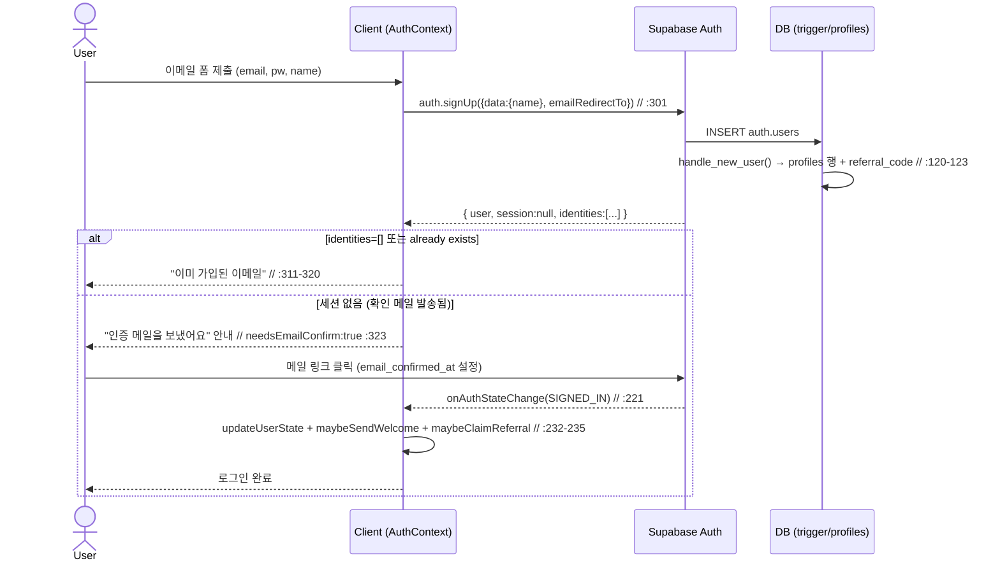
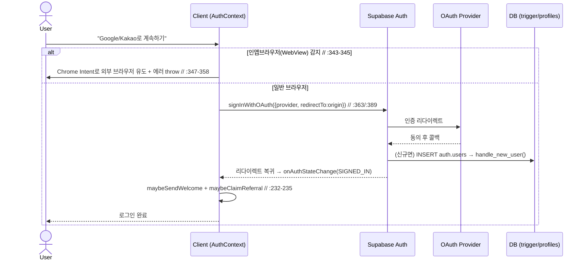
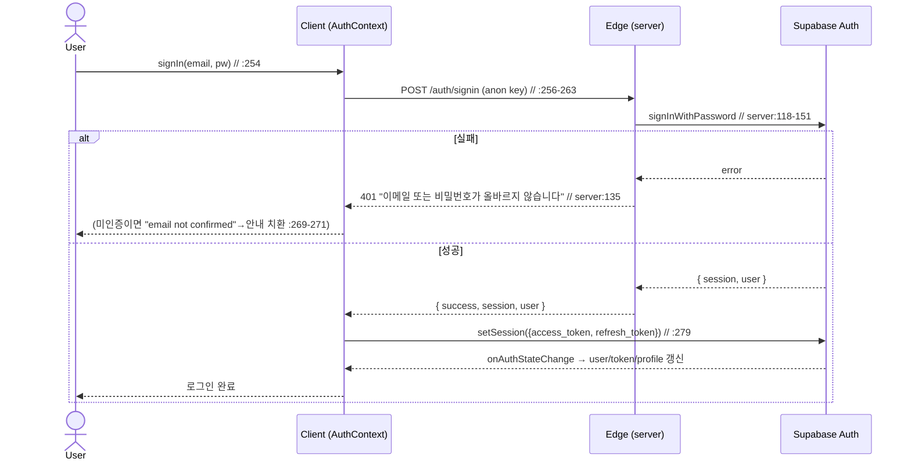
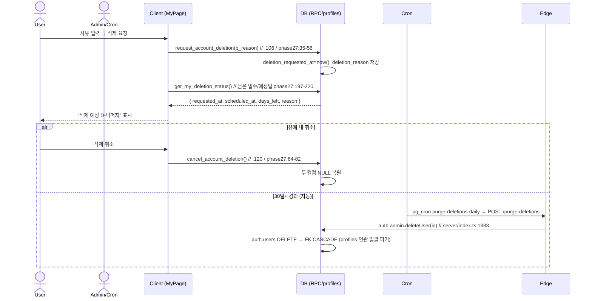
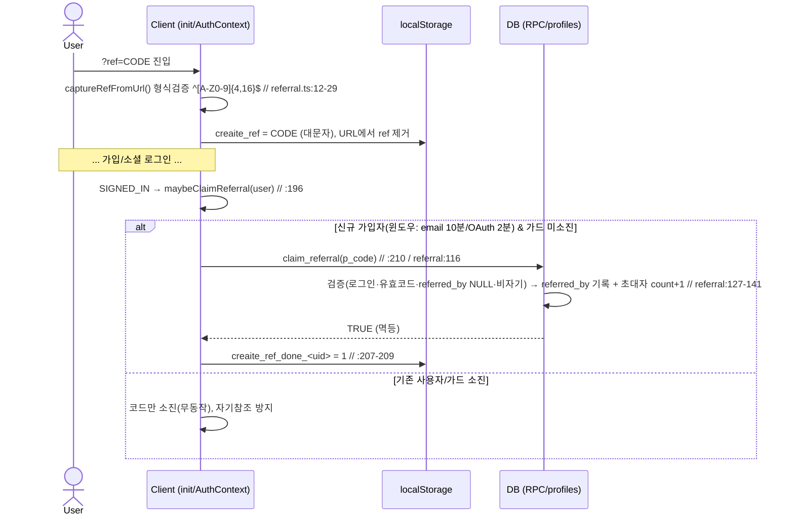

# 01. 인증 · 온보딩 · 계정/데이터 권리 — 상세 명세

> 본 문서는 **실제 구현 코드 기준**으로 작성되었습니다(추측 없음). 각 항목에 `파일:라인` 근거를 표기합니다.
> 보안 감사가 완료된 영역이므로 동작·계약·상태 위주로 깊게 기술합니다.
> 주요 근거 파일:
> - `src/app/contexts/AuthContext.tsx`
> - `src/app/components/AuthModal.tsx`, `PasswordResetScreen.tsx`, `ReferralCard.tsx`, `MyPage.tsx`, `AgeGateModal.tsx`
> - `src/app/utils/referral.ts`, `src/app/utils/sendNotification.ts`, `src/app/init.ts`, `src/app/App.tsx`
> - `supabase/functions/server/index.ts` (`/auth/*`)
> - `supabase/profiles_table.sql`, `supabase/referral_20260618.sql`, `supabase/phase27_user_data_rights.sql`, `supabase/phase26_age_rating.sql`, `supabase/phase_security_hardening_20260531.sql`, `supabase/fix_profiles_column_exposure_20260625.sql`

---

## 1. 개요 / 목적

CREAITE의 인증·계정 도메인은 **Supabase Auth(GoTrue)** 를 기반으로 한다. 클라이언트는 자체 백엔드 가입 엔드포인트를 거의 쓰지 않고, **Supabase SDK를 직접 호출**(`supabase.auth.*`)하며, 인증 상태는 `AuthProvider`(`src/app/contexts/AuthContext.tsx:57`)가 단일 출처(SSOT)로 관리한다.

핵심 목적:

1. **이메일 인증 필수 가입**(R2, 2026-06-11): 이메일/비밀번호 가입은 확인 메일 링크 클릭 후에만 로그인 가능. 인증 우회 루트(Edge `admin.createUser(email_confirm:true)`)는 제거되어 `410`으로 차단됨(`supabase/functions/server/index.ts:110`).
2. **소셜 로그인**: Google·Kakao OAuth 지원. 그 외(Facebook/Apple/X/LINE)는 UI만 존재하고 미연결.
3. **비밀번호 재설정**(H8): 메일 링크 → recovery 세션 → 새 비밀번호 설정 전용 전체화면.
4. **프로필 자동 생성**: `auth.users` INSERT 시 트리거(`handle_new_user`)가 `public.profiles` 1:1 행을 생성, 초대코드도 함께 부여.
5. **권한 보호**: 구독 등급·정산정보·`is_admin`·레퍼럴 컬럼을 사용자가 직접 못 바꾸게 DB 트리거로 차단(권한상승 차단 SSOT).
6. **계정/데이터 권리**(Phase 27, 개인정보보호법/GDPR): 본인 데이터 JSON 내보내기 + 30일 유예 계정 삭제.
7. **레퍼럴(초대) 확산 엔진**: `?ref=CODE` 캡처 → 신규 가입자만 `claim_referral` RPC로 연결, 초대수 카운트.
8. **온보딩 게이트**: 별도 가입 마법사는 없음. 실질 게이트는 **연령 인증(만 19+)** 으로 19+ 콘텐츠 시청 차단.

---

## 2. 사용자 스토리 (As a / I want / so that)

**비회원(방문자)**
- As a 방문자, I want 가입 없이 피드를 둘러보고, so that 가입 전에 서비스 가치를 확인한다. (피드 조회는 로그인 불필요)
- As a 방문자(초대링크 유입), I want `?ref=CODE`로 들어와도 코드가 유지되어, so that OAuth 리다이렉트 후 가입해도 초대자에게 연결된다. (`referral.ts:12` `captureRefFromUrl`)

**신규 가입자(이메일)**
- As a 신규 가입자, I want 이메일/비번/이름으로 가입하면 확인 메일을 받아, so that 메일 링크 클릭으로 가입을 완료하고 로그인된다. (`AuthContext.tsx:299` `signUp`)
- As a 신규 가입자, I want 메일이 안 오면 재발송할 수 있어, so that 스팸함 누락에도 가입을 끝낼 수 있다. (`AuthContext.tsx:331` `resendConfirmEmail`)

**신규 가입자(소셜)**
- As a Google/Kakao 사용자, I want 한 번의 클릭으로 가입·로그인하고, so that 비밀번호 없이 시작한다. (`AuthContext.tsx:340`, `:384`)
- As a 인앱브라우저(카카오톡 등) 사용자, I want Google 로그인 시도 시 외부 브라우저로 안내받아, so that WebView OAuth 차단을 우회한다. (`AuthContext.tsx:341-359`)

**기존 회원**
- As a 회원, I want 이메일/비번으로 로그인하고, so that 내 구독·채널·정산에 접근한다. (`AuthContext.tsx:254` `signIn`)
- As a 비번 분실 회원, I want 재설정 메일로 새 비번을 설정해, so that 계정을 복구한다. (`AuthContext.tsx:413` `requestPasswordReset`, `:420` `updatePassword`)

**시청자(연령 게이트)**
- As a 회원, I want 생년월일을 입력해 만 19세+ 인증을 받으면, so that 19+ 콘텐츠를 볼 수 있다. (`AgeGateModal.tsx:45` → `verify_my_age`)

**데이터 주체(개인정보 권리)**
- As a 회원, I want 내 모든 데이터를 JSON으로 내려받아, so that 데이터 이동권을 행사한다. (`MyPage.tsx:34` `export_my_data`)
- As a 회원, I want 계정 삭제를 요청하되 30일 안에 취소할 수 있어, so that 실수로 인한 영구 삭제를 방지한다. (`MyPage.tsx:106`/`:120`)

**초대자(크리에이터 확산)**
- As a 크리에이터, I want 내 초대링크를 복사·공유하고 초대수를 보고, so that 함께 배급사가 된다. (`ReferralCard.tsx:21` `get_my_referral`)

**어드민**
- As a 어드민/Cron, I want 30일 경과 삭제요청 계정을 일괄 영구삭제하고, so that 법적 보존기한을 준수한다. (`purge_pending_deletions`, `phase27_user_data_rights.sql:92`)

---

## 3. 화면 & 상태

### 3-1. AuthModal (로그인/가입 모달) — `src/app/components/AuthModal.tsx`
- **진입조건**: 로그인 필요 액션 클릭 또는 헤더의 로그인 버튼. `initialMode`로 `"signin"|"signup"` 지정(`:13,:16`).
- **레이아웃**: 모바일은 바텀시트(스프링 슬라이드 업, `:113-117`), 데스크톱은 센터 카드(max 420px). 헤더(타이틀·닫기·뒤로가기), 본문, 하단 모드 전환 영역.
- **상태/분기**:
  - **소셜 목록**(`showEmailForm=false`, `:198`): 이메일/Kakao/Google/Facebook/Apple/X/LINE 버튼. **실제 연결은 Kakao·Google만**(`:217`,`:229`). 나머지 4개는 핸들러 없는 장식.
  - **이메일 폼**(`showEmailForm=true`, `:290`): signup이면 이름 필드 추가(`:298`), 이메일·비번(min 6자, `:336`). signin이면 "비밀번호 찾기" 링크 노출(`:340`).
  - **인증 메일 발송 안내**(`verifySentTo` 설정, `:147`): 받은 메일 안내 + "인증 메일 재발송"(`:182`) + "인증을 마쳤어요 — 로그인"(`:189`, signin 폼으로 복귀).
  - **로딩**: 제출 버튼 스피너(`loading`, `:355-357`). 소셜 버튼도 로딩 잠금(`:84`,`:96`).
  - **에러**: `toast.error`로 표시(`:76`,`:89`,`:99`). WebView 에러는 toast duration 8s(`:89`).
  - **성공**: signin/즉시가입은 `onClose()`(`:63`,`:72`). 인증 필요 가입은 안내 화면 전환(닫지 않음).
- **전환**: signin↔signup 토글(`:375`,`:385`)은 `showEmailForm=false`로 리셋해 소셜 목록부터 다시.

### 3-2. PasswordResetScreen (새 비밀번호 설정) — `src/app/components/PasswordResetScreen.tsx`
- **진입조건**: `onAuthStateChange`에서 `PASSWORD_RECOVERY` 이벤트 → `passwordRecovery=true`(`AuthContext.tsx:227`) → `App.tsx:1384`가 전체화면(`z-[200]`)으로 렌더.
- **레이아웃**: 중앙 카드. 새 비번 + 확인 입력, 변경 버튼, 취소.
- **상태**: 입력(`canSubmit` = 6자+ && 일치, `:22`), 저장중 스피너(`:78`), 완료(체크 + "시작하기", `:50-59`), 에러 toast(`:33`).
- **전환**: 완료/취소 시 `clearPasswordRecovery()`로 화면 닫힘(`:56`,`:80`).

### 3-3. AgeGateModal (연령 인증) — `src/app/components/AgeGateModal.tsx`
- **진입조건**: 19+ 콘텐츠 시청 시도 등. 미인증 시 카드/피드에 블러 락 노출(`DiscoveryFeed.tsx:357-359`, `video.ageGateLockTitle`).
- **동작**: 생년월일 입력 → `verify_my_age(p_birthdate)` RPC(`:45`). 만 19세+면 `age_verified=true`, 미만이면 false 저장(`phase26_age_rating.sql:79-92`).

### 3-4. MyPage 설정 탭의 계정/데이터 섹션 — `src/app/components/MyPage.tsx`
- **DataDownloadSection**(`:27`): 다운로드 버튼. 로딩(`downloading`)/성공/실패 toast. JSON Blob을 `creaite-my-data-YYYY-MM-DD.json`으로 받음(`:42`).
- **DangerZoneSection**(`:86`): 진입 시 `get_my_deletion_status` 조회(`:96`).
  - **삭제요청 없음**: 위험영역 카드 + 사유 입력 + 요청 버튼(2단 confirm).
  - **삭제예정 상태**: 남은 일수·예정일·사유 표시 + "삭제 취소" 버튼(`:132-154`).
  - **로딩 중**: `null` 렌더(`:129`).
- **ReferralCard**(`ReferralCard.tsx`): 코드 없으면(`!code`) 카드 자체를 숨김(`:31`). 코드 있으면 링크 복사/공유 + 초대수 표시.
- **로그아웃**: 설정 내 버튼(`MyPage.tsx:2087` `signOut()` + 성공 toast).

---

## 4. 동작 흐름 (단계별 시퀀스)

### 4-1. 이메일 가입 (R2 — 이메일 인증 필수)
1. 사용자가 AuthModal 이메일 폼 제출 → `signUp(email, password, name)`(`AuthContext.tsx:299`).
2. `supabase.auth.signUp({ email, password, options:{ data:{name}, emailRedirectTo: origin } })`(`:301-308`).
3. 에러 처리: `already registered/exists` → "이미 가입된 이메일"(`:311-314`). **재가입 이메일은 Supabase가 에러 대신 `identities: []`를 반환** → 이를 중복으로 판정(`:318-320`).
4. 세션 유무로 분기: **세션 없음 = 확인 메일 발송됨** → `{ needsEmailConfirm: true }`(`:323`). UI는 "인증 메일을 보냈어요" 화면(`AuthModal.tsx:147`).
5. 사용자가 메일 링크 클릭 → `email_confirmed_at` 설정 → SDK가 `SIGNED_IN` 이벤트 발화.
6. 리스너가 세션 반영(`updateUserState`) + **환영 메일**(`maybeSendWelcome`) + **레퍼럴 연결**(`maybeClaimReferral`)을 SIGNED_IN에서만 실행(`:232-235`).
   - 하위호환: 대시보드 "Confirm email"이 꺼져 있으면 가입 즉시 세션 생성 → `needsEmailConfirm:false` → 즉시 로그인(`:298`, `AuthModal.tsx:69-72`).

### 4-2. 로그인 (이메일/비번)
1. `signIn(email, password)`(`AuthContext.tsx:254`) → Edge `POST /auth/signin`(`serverUrl`, anon key)으로 호출(`:256-263`).
2. Edge가 `signInWithPassword`로 검증, 세션·user 반환(`server/index.ts:118-151`). 실패 시 401 "이메일 또는 비밀번호가 올바르지 않습니다."(`:135`).
3. 클라이언트는 응답 세션 토큰을 `supabase.auth.setSession()`으로 **SDK에 동기화**(`:278-282`) → `onAuthStateChange`가 user/token/profile을 일관 갱신.
4. 미인증 계정 로그인 시도 → 에러 텍스트에 `email not confirmed` 매칭되면 친절 안내로 치환(`:269-271`).

### 4-3. 소셜 로그인 (Google / Kakao)
- **Google**(`:340`): WebView(카카오톡/네이버/FB/IG/Line/Twitter/Android wv) 감지(`:343-345`) → 감지 시 Chrome Intent로 외부 브라우저 유도 후 에러 throw(`:347-358`). 정상 시 `signInWithOAuth({provider:'google', redirectTo:origin, queryParams:{access_type:'offline', prompt:'consent'}})`(`:363-372`).
- **Kakao**(`:384`): `signInWithOAuth({provider:'kakao', redirectTo:origin})`(`:389-394`).
- 리다이렉트 복귀 후 `SIGNED_IN` → 4-1의 5~6단계(welcome/referral) 동일.

### 4-4. 비밀번호 재설정 (H8)
1. AuthModal signin 폼 "비밀번호 찾기" → `requestPasswordReset(email)`(`AuthModal.tsx:48`, `AuthContext.tsx:413`) → `resetPasswordForEmail(email, {redirectTo: origin})`.
2. 메일 링크 클릭 → 앱 진입 시 `PASSWORD_RECOVERY` 이벤트 → `passwordRecovery=true`(`:227`).
3. `PasswordResetScreen` 노출 → 새 비번 입력 → `updatePassword(newPassword)`(`:420`) → `supabase.auth.updateUser({password})` 후 `passwordRecovery=false`(`:423`).

### 4-5. 계정 삭제 (30일 유예)
1. MyPage DangerZone에서 사유 입력 → `request_account_deletion(p_reason)` RPC(`MyPage.tsx:106`).
2. RPC가 `deletion_requested_at=now()`, `deletion_reason` 저장(`phase27_user_data_rights.sql:35-56`).
3. UI는 `get_my_deletion_status`로 남은 일수(예정일 = 요청+30일) 표시(`:197-220`).
4. 유예 내 취소: `cancel_account_deletion`(`MyPage.tsx:120`) → 두 컬럼 NULL 복원(`:64-82`).
5. 영구 삭제(자동): pg_cron `purge-deletions-daily`(매일 04:00 UTC, `purge_deletions_cron_20260614.sql`)가 Edge `/purge-deletions`(`server/index.ts:1383`) 호출 → 30일+ 경과 대상에 `auth.admin.deleteUser(id)` 실행. `profiles.id`가 `auth.users` FK `ON DELETE CASCADE`라 **auth.users 삭제 시 profiles·연관 데이터 일괄 파기**. (SQL `purge_pending_deletions(:92)`는 어드민 수동용 — profiles만 삭제, cron 미사용.)

### 4-6. 데이터 내보내기
1. MyPage 다운로드 버튼 → `export_my_data` RPC(`MyPage.tsx:34`).
2. RPC가 본인(`auth.uid()`) 기준 프로필·업로드영상·댓글·좋아요·시청기록·구매/판매주문·플레이리스트·팔로잉/팔로워·차단·검색기록·정산내역·신고 등을 단일 JSONB로 묶어 반환(`phase27_user_data_rights.sql:134-189`).
3. 클라이언트가 Blob → `creaite-my-data-YYYY-MM-DD.json` 다운로드(`MyPage.tsx:36-46`).

### 4-7. 레퍼럴 연결
1. 방문자가 `?ref=CODE` 진입 → `init.ts:14`에서 가장 먼저 `captureRefFromUrl()` 실행 → 형식검증(`^[A-Z0-9]{4,16}$`) 후 `localStorage.creaite_ref`에 대문자로 저장하고 URL에서 ref만 제거(`referral.ts:12-29`).
2. 가입 후 `SIGNED_IN`에서 `maybeClaimReferral(user)`(`AuthContext.tsx:196`): **신규 가입자만**(provider별 created/confirmed 윈도우, email 10분·OAuth 2분, `:201-206`) + `localStorage` 가드(`creaite_ref_done_<uid>`, `:207-209`)로 1회만 `claim_referral(p_code)` 호출(`:210`). 기존 사용자면 코드만 소진(자기참조 방지).
3. `claim_referral`(`referral_20260618.sql:116`): 가드 — 로그인됨/코드 유효/이미 연결 아님(`referred_by IS NULL`)/자기 자신 아님 → `referred_by` 기록 + 초대자 `referral_count+1`. 멱등(`:127-141`).

---

## 5. 데이터 / RPC / Edge 계약

### 5-1. Edge Functions (`supabase/functions/server/index.ts`)
| 엔드포인트 | 메서드 | 인자 | 반환 | 권한 | 근거 |
|---|---|---|---|---|---|
| `/auth/signup` | POST | — | `410 {error, deprecated:true}` | 차단됨(인증 우회 방지) | `:110-115` |
| `/auth/signin` | POST | `{email, password}` | `{success, session, user}` / `400` / `401` / `500` | anon key(Bearer publicAnonKey) | `:118-151` |
| `/auth/user` | GET | `Authorization: Bearer <accessToken>` | `{user:{id,email,name,created_at}}` / `401` | 사용자 토큰 필요 | `:154-182` |

> Edge `server` 함수는 공개 엔드포인트 포함이라 **항상 `--no-verify-jwt`로 배포**(CLAUDE.md, `supabase/config.toml`).

### 5-2. 인증 (Supabase SDK 직접 호출, `AuthContext.tsx`)
| 동작 | SDK 호출 | 근거 |
|---|---|---|
| 가입 | `auth.signUp({email,password,options:{data:{name}, emailRedirectTo}})` | `:301` |
| 인증메일 재발송 | `auth.resend({type:'signup', email, options:{emailRedirectTo}})` | `:332` |
| Google OAuth | `auth.signInWithOAuth({provider:'google', ...})` | `:363` |
| Kakao OAuth | `auth.signInWithOAuth({provider:'kakao', ...})` | `:389` |
| 재설정 메일 | `auth.resetPasswordForEmail(email,{redirectTo})` | `:414` |
| 새 비번 설정 | `auth.updateUser({password})` | `:421` |
| 세션 동기화 | `auth.setSession({access_token, refresh_token})` | `:279` |
| 세션 조회/리스너 | `auth.getSession()`, `auth.onAuthStateChange(...)` | `:120`,`:221` |
| 로그아웃 | `auth.signOut()`(에러 무시) | `:94` |

### 5-3. RPC 계약
| RPC | 인자 | 반환 | 보안 | GRANT | 근거 |
|---|---|---|---|---|---|
| `get_my_profile()` | — | `public.profiles`(본인 행 전체) | SECURITY DEFINER, STABLE | `authenticated` | `phase_security_hardening_20260531.sql:18-27` |
| `get_my_payout_info()` | — | `JSONB`(본인 payout_info) | SECURITY DEFINER, STABLE | `authenticated` | 동:30-39 |
| `claim_referral(p_code TEXT)` | 초대코드 | `BOOLEAN`(멱등) | SECURITY DEFINER | REVOKE PUBLIC → `authenticated` | `referral_20260618.sql:116-146` |
| `get_my_referral()` | — | `JSON {code,count,referred}` | SECURITY DEFINER, STABLE | REVOKE PUBLIC → `authenticated` | 동:151-163 |
| `gen_referral_code()` | — | `TEXT`(8자, 혼동문자 제외) | SECURITY DEFINER, VOLATILE | (내부 트리거/백필 용) | 동:33-50 |
| `verify_my_age(p_birthdate DATE)` | 생년월일 | `TABLE(verified,age,message)` | SECURITY DEFINER | — | `phase26_age_rating.sql:55-95` |
| `request_account_deletion(p_reason TEXT=NULL)` | 사유(선택) | `TIMESTAMPTZ`(요청시각) | SECURITY DEFINER | — | `phase27_user_data_rights.sql:35-56` |
| `cancel_account_deletion()` | — | `VOID` | SECURITY DEFINER | — | 동:64-82 |
| `get_my_deletion_status()` | — | `TABLE(requested_at,scheduled_at,days_left,reason)` | SECURITY DEFINER, STABLE | — | 동:197-220 |
| `export_my_data()` | — | `JSONB`(본인 전 데이터) | SECURITY DEFINER, STABLE | — | 동:134-189 |
| `purge_pending_deletions(p_days INT=30)` | 경과일 | `INTEGER`(삭제 건수) | SECURITY DEFINER, **어드민 검사** | 어드민/Cron | 동:92-126 |
| `is_subscriber(p_user_id UUID=auth.uid())` | 사용자 | `BOOLEAN` | STABLE | — | `profiles_table.sql:164-172` |

### 5-4. 트리거 / 테이블
- **`handle_new_user()`**(`AFTER INSERT ON auth.users`, 트리거 `on_auth_user_created`): `profiles(id, display_name, avatar_url, referral_code)` INSERT. `display_name`은 메타 `name`→`full_name`→이메일 로컬파트 순. `ON CONFLICT (id) DO NOTHING`. 초대코드는 `gen_referral_code()`로 부여(`referral_20260618.sql:67-84`, 트리거 정의 `profiles_table.sql:120-123`).
- **`protect_subscription_columns()`**(`BEFORE UPDATE ON public.profiles`, 트리거 `profiles_protect_subscription`): postgres/supabase_admin/service_role(또는 jwt role=service_role) 외에는 보호컬럼을 OLD값으로 강제(`referral_20260618.sql:92-110`, 트리거 정의 `profiles_table.sql:94-97`).
- **`set_updated_at()`**: `updated_at`을 now()로(`profiles_table.sql:60-71`).
- **RLS**(`profiles_table.sql:143-156`): SELECT `USING(true)`(공개), UPDATE 본인만(`auth.uid()=id`). INSERT는 트리거(DEFINER) 처리로 정책 불필요.
- **컬럼 GRANT(중요 보안)**: profiles 테이블 단위 SELECT는 anon/authenticated에서 **회수**, 공개 안전 컬럼 7종만 컬럼 단위 재부여(`id, display_name, avatar_url, banner_url, bio, subscription_tier, created_at`). 민감 컬럼은 전부 `get_my_profile` 등 DEFINER RPC 경유(`fix_profiles_column_exposure_20260625.sql:21-33`, 최초 `phase_security_hardening_20260531.sql:13-15`).

---

## 6. 비즈니스 규칙

1. **이메일 인증 필수**: 이메일 가입은 확인 메일 링크 후에만 세션 발급. 미인증 로그인은 친절 안내로 차단(`AuthContext.tsx:269-271`). 인증 우회 Edge 루트는 `410`(`server/index.ts:110`).
2. **세션 SSOT**: 모든 인증 상태는 `onAuthStateChange` 리스너 경유로 통일. `signIn`도 토큰을 `setSession`으로 SDK에 주입해야 일관 유지(`:278-282`).
3. **메타데이터→권한 차단(권한상승 방지)**: 사용자가 직접 못 바꾸는 보호컬럼 = `subscription_tier`, `subscription_started_at`, `subscription_expires_at`, `payout_info`, **`is_admin`**, `referral_code`, `referred_by`, `referral_count`(`referral_20260618.sql:97-105`). `is_admin` 줄 누락이 과거 권한상승 회귀였고 `fix_protect_is_admin_20260624.sql`로 복구됨(`:101` 주석). → **이 8개 컬럼은 보호 트리거에서 절대 제거 금지**(MEMORY: protect-trigger-shared-ssot).
4. **구독 활성 판정**: tier ≠ free AND (만료 없음 OR 만료 미래) → `isSubscriber`, premium은 추가로 tier==='premium'(`AuthContext.tsx:406-410`,`433-434`).
5. **30일 유예 삭제**: 요청 후 30일 경과 시에만 영구 삭제 가능. 유예 내 취소 가능. 어드민/Cron만 purge(`phase27_user_data_rights.sql`).
6. **연령 게이트**: 만 19세+만 19+ 콘텐츠 시청. 현재 MVP는 **생일 자가 입력**(본인인증 기관 연동 아님, `phase26_age_rating.sql:50` 주석). 생일 형식 검증(미래/1900년 이전 거부, `:73-75`). 본인 영상은 게이트 제외(`DiscoveryFeed.tsx:358`).
7. **레퍼럴 자기참조/중복 방지**: 신규 가입자만 1회 연결, 이미 연결됐거나 자기 코드면 무시. 코드 부여/연결은 DEFINER 함수로만(사용자 직접 UPDATE 불가).
8. **welcome/referral은 SIGNED_IN에서만**: 초기 세션 복원(`checkInitialSession`)이나 단순 토큰 갱신에서는 발송/연결하지 않음(`AuthContext.tsx:232`).
9. **정지자(`is_suspended`)**: 어드민 화면에서 표시·관리(`AdminUsers.tsx:148`, `AdminOverview.tsx:308`). `is_suspended`는 공개 노출 금지 민감 컬럼(`fix_profiles_column_exposure_20260625.sql:8,26`).

---

## 7. 엣지 케이스 & 에러 처리

- **중복 가입**: 에러 메시지 매칭(`already registered/exists`) + `identities:[]` 빈 배열 케이스 둘 다 "이미 가입된 이메일"로 처리(`AuthContext.tsx:311-320`).
- **미인증 로그인**: `email not confirmed` 정규식 매칭 시 안내 치환(`:269-271`). Edge는 401 일반 메시지(`server/index.ts:135`).
- **OAuth 웹뷰**: 카카오톡/네이버/FB/IG/Line/Twitter/Android wv 감지 → Chrome Intent 유도 + 에러 throw(`:341-359`). toast 8초 노출(`AuthModal.tsx:89`).
- **getSession 행(hang)/웹뷰 락**: 4초 실패세이프 타이머로 `loading=false` 강제 → 로고 화면 무한멈춤 방지(`:109-114`).
- **언마운트 가드**: `mounted` 플래그로 비동기 setState 방지, cleanup에서 타이머 클리어 + 리스너 unsubscribe(`:104`,`:224`,`:247-251`). MyPage/ReferralCard도 `alive` 가드(`ReferralCard.tsx:18-28`).
- **토큰 만료/재인증**: `setSession` 실패 시 fallback으로 수동 user/profile 설정(`:283-289`).
- **profile 미생성 타이밍**: 가입 직후 트리거 처리 지연 가능 → `fetchProfile`은 `get_my_profile` RPC 사용. profile 로드 실패해도 user 인증은 유지(`:165-167`).
- **레퍼럴 가드 누락 시나리오**: `getStoredRef` 없으면 무동작, 기존 사용자면 코드만 소진(`:198`,`:206-208`). `claim_referral`은 RETURN FALSE로 조용히 실패(예외 안 던짐).
- **데이터 다운로드/삭제 실패**: 전부 try/catch + toast로 사용자 알림(`MyPage.tsx:48-50`,`:108-110`).
- **마이그레이션 미적용**: `get_my_referral` RPC 부재 시 code 비어 ReferralCard 자동 숨김(`ReferralCard.tsx:31`).

---

## 8. 권한/보안

| 역할 | 가능 동작 |
|---|---|
| anon(비회원) | 피드/공개 프로필 안전컬럼 7종 SELECT, `/auth/signin`(anon key), OAuth 시작 |
| authenticated(회원) | 본인 프로필 RPC(`get_my_profile`/`get_my_payout_info`), `claim_referral`/`get_my_referral`, 연령인증, 데이터 내보내기/삭제요청/취소, 본인 프로필 UPDATE(보호컬럼 제외) |
| service_role(Edge/웹훅) | RLS 우회 — 결제 웹훅에서 구독/정산 컬럼 UPDATE, 보호 트리거 통과 |
| admin(`is_admin=true`) | `purge_pending_deletions` 등 어드민 전용 RPC, 사용자 정지 관리 |

**SSOT 금지선(절대 위반 금지)**:
- 보호 트리거의 8개 컬럼(특히 `is_admin`)을 제거하면 권한상승 회귀 → 금지.
- `profiles` 테이블 단위 SELECT를 anon/authenticated에 재부여 금지(민감 컬럼 전수 노출). 공개 컬럼 7종만 컬럼 단위 GRANT.
- 본인 민감값은 반드시 DEFINER RPC 경유(직접 SELECT 금지).
- 인증 우회 가입 루트(`admin.createUser(email_confirm:true)`) 부활 금지.

---

## 9. 분석/이벤트 (추적 포인트)

- **welcome 메일**: `maybeSendWelcome`이 SIGNED_IN에서 신규(이메일=확인 10분 내, OAuth=생성 2분 내) 1회 발송. `localStorage.creaite_welcome_<uid>` 가드로 중복 방지(`AuthContext.tsx:174-193`). 발송은 `sendNotification({type:'welcome'})`(`sendNotification.ts:20-29`).
- **레퍼럴 연결 전환**: `claim_referral` 성공 시 초대자 `referral_count` 증가 — 초대 전환 추적 지표(`referral_20260618.sql:140`). `get_my_referral`로 본인 초대수 조회(ReferralCard count).
- **가입/로그인 콘솔 로그**: 진단용 `[AuthContext]` 로그 다수(초기세션/이벤트/상태갱신, `:119`,`:222`,`:163`).
- **알림 발송 로깅**: Edge `/server/send-email`이 `should_send_notification` 확인 후 Resend 발송 + `notification_log` 기록(`sendNotification.ts:8-12`).
- **연령 인증 시각**: `age_verified_at` 기록(`phase26_age_rating.sql:47,83`).

> 별도 제품 분석 SDK(예: GA/Amplitude) 연동은 본 코드 범위에서 확인되지 않음. 전환 추적은 위 서버측 상태(referral_count, notification_log)로만.

---

## 10. 수용 기준 (체크리스트)

- [ ] 이메일 가입 시 확인 메일 발송되고, 링크 클릭 전에는 로그인 불가(미인증 로그인은 안내 메시지).
- [ ] 인증 메일 재발송이 동작한다.
- [ ] 재가입(이미 가입된 이메일)은 "이미 가입된 이메일" 안내(에러/identities 빈배열 모두).
- [ ] Google/Kakao 로그인 성공 시 자동 가입·로그인, 인앱브라우저 Google 로그인은 외부 브라우저 안내.
- [ ] 비밀번호 재설정: 메일 링크 진입 시 PasswordResetScreen 노출, 6자+ & 일치 검증, 변경 성공.
- [ ] 가입/소셜 첫 로그인 시 welcome 메일 1회만 발송(재로그인 중복 없음).
- [ ] `?ref=CODE` 유입 후 신규 가입 시 `referred_by` 연결 + 초대자 count 증가(자기참조/중복 없음).
- [ ] ReferralCard에 본인 코드·링크·초대수 표시, 복사/공유 동작(코드 없으면 숨김).
- [ ] 연령 인증: 만 19+면 19+ 콘텐츠 해제, 미만이면 차단, 잘못된 생일 거부.
- [ ] 데이터 내보내기: 본인 전 데이터 JSON 다운로드.
- [ ] 계정 삭제 요청 → 30일 카운트다운 표시 → 유예 내 취소 가능 → 30일+ 경과 시 purge로 영구 삭제.
- [ ] 일반 사용자가 PostgREST로 `subscription_tier`/`is_admin`/`payout_info`/`referral_*` 직접 UPDATE 시 무효(OLD 유지).
- [ ] anon/authenticated가 profiles에서 민감 컬럼(email/payout_info/birthdate/is_admin 등) SELECT 불가.
- [ ] getSession 지연/웹뷰 락에도 4초 내 로딩 해제(무한멈춤 없음).

---

## 11. 알려진 제약 / 이월

1. **소셜 4종 미연결**: Facebook/Apple/X/LINE 버튼은 UI만 존재, 핸들러 없음(`AuthModal.tsx:244-288`). iOS 출시 후 Apple 등 확장 예정.
2. **연령 인증은 자가 입력 MVP**: 본인인증 기관(통신사/아이핀) 연동 아님 → 신뢰도 한계(`phase26_age_rating.sql:50`).
3. **(해결 확인 2026-06-28) 계정 영구 삭제 auth.users 자동화**: Edge `/purge-deletions`(`server/index.ts:1383`)가 `auth.admin.deleteUser`로 auth.users 삭제(→CASCADE로 profiles·연관 데이터 일괄 파기), pg_cron `purge-deletions-daily`(`purge_deletions_cron_20260614.sql`)가 매일 호출. SQL `purge_pending_deletions`는 어드민 수동용으로 보존. 운영 확인: `SELECT active FROM cron.job WHERE jobname='purge-deletions-daily';`
4. **레퍼럴 보상은 비현금**: 현재 노출·배지 우선, 현금 정산은 토스 결제 오픈 후 `referral_count` 기반 별도 정산(`ReferralCard.tsx:91-94`, `referral_20260618.sql:7-8`).
5. **welcome/referral 시간 윈도우 의존**: 신규 판정이 시계(created/confirmed 타임스탬프) 윈도우에 의존 → 메일 인증이 10분 넘게 지연되면 welcome 미발송 가능(`AuthContext.tsx:180-183`).
6. **별도 온보딩 마법사 없음**: 가입 후 프로필 설정/튜토리얼 플로우는 미구현, 연령 게이트만 실질 게이트.
7. **제품 분석 이벤트 트래킹 미연동**: 전환 측정은 서버 상태(referral_count/notification_log)로만, 클라이언트 분석 SDK 없음.

---

## 12. 와이어프레임 (텍스트 목업)

> 아래 ASCII 목업은 §3(화면 & 상태)에 기술된 실제 컴포넌트 구조·분기를 그대로 옮긴 것이다. 좌표·픽셀이 아니라 **상태별 구성 요소와 분기**를 표현한다.

### 12-1. AuthModal — 소셜 목록 (`showEmailForm=false`)
모바일은 바텀시트(슬라이드 업), 데스크톱은 센터 카드(max 420px). (`AuthModal.tsx:113-117`,`:198`)

```
┌─────────────────────────────────────┐
│  로그인 / 회원가입            [ X ]  │  ← 헤더(타이틀·닫기) :13,:16
├─────────────────────────────────────┤
│                                     │
│   ┌───────────────────────────────┐ │
│   │  ✉  이메일로 계속하기          │ │ → showEmailForm=true
│   └───────────────────────────────┘ │
│   ┌───────────────────────────────┐ │
│   │  💬  카카오로 계속하기   (연결) │ │ :217  signInWithKakao
│   └───────────────────────────────┘ │
│   ┌───────────────────────────────┐ │
│   │  G  Google로 계속하기    (연결) │ │ :229  signInWithGoogle
│   └───────────────────────────────┘ │
│   ┌───────────────────────────────┐ │
│   │  f  Facebook  (장식·핸들러없음) │ │ :244-288 미연결
│   │    Apple / X / LINE  (장식)    │ │
│   └───────────────────────────────┘ │
│                                     │
├─────────────────────────────────────┤
│  계정이 없으신가요?  회원가입 ▸      │  ← 모드 토글 :375,:385
└─────────────────────────────────────┘
   (소셜/제출 진행 중이면 버튼 로딩 잠금 :84,:96)
```

### 12-2. AuthModal — 이메일 폼 (`showEmailForm=true`)
signup이면 이름 필드 추가, 비번 min 6자. (`AuthModal.tsx:290`,`:298`,`:336`)

```
┌─────────────────────────────────────┐
│  [◂ 뒤로]   회원가입          [ X ]  │
├─────────────────────────────────────┤
│  이름            [______________]   │  ← signup 전용 :298
│  이메일          [______________]   │
│  비밀번호        [______________]   │  ← min 6자 :336
│                                     │
│   ┌───────────────────────────────┐ │
│   │        가입하기  ( ⟳ )         │ │  ← 제출 스피너 :355-357
│   └───────────────────────────────┘ │
│                                     │
│  (signin 모드일 때만)               │
│     비밀번호를 잊으셨나요? ▸         │  ← :340 requestPasswordReset
└─────────────────────────────────────┘
   에러는 toast.error :76,:89,:99
```

### 12-3. AuthModal — 인증 메일 발송 안내 (`verifySentTo` 설정됨)
이메일 가입(R2) 직후, 모달은 닫지 않고 안내 화면으로 전환. (`AuthModal.tsx:147`)

```
┌─────────────────────────────────────┐
│            ✉  메일을 확인하세요       │
├─────────────────────────────────────┤
│  user@example.com 으로               │
│  인증 메일을 보냈어요.               │
│  메일의 링크를 누르면 가입 완료!     │
│                                     │
│   [ 인증 메일 재발송 ]               │  ← :182 resendConfirmEmail
│   [ 인증을 마쳤어요 — 로그인 ]       │  ← :189 signin 폼 복귀
└─────────────────────────────────────┘
```

### 12-4. PasswordResetScreen (새 비밀번호 설정 — 전체화면 `z-[200]`)
`PASSWORD_RECOVERY` 이벤트 시 App이 전체화면으로 렌더. (`App.tsx:1384`, `PasswordResetScreen.tsx`)

```
┌───────────────────────────────────────────┐
│                                           │
│        🔒  새 비밀번호 설정               │
│                                           │
│   새 비밀번호      [__________________]   │
│   비밀번호 확인    [__________________]   │
│                                           │
│   ┌─────────────────────────────────────┐ │
│   │        변경하기  ( ⟳ 저장중 )        │ │  ← canSubmit=6자+&일치 :22 / :78
│   └─────────────────────────────────────┘ │
│        취소                               │  ← clearPasswordRecovery :80
│                                           │
│   ── 완료 시 ──────────────────────────   │
│        ✔  변경되었습니다  [ 시작하기 ]    │  ← :50-59 / clear :56
└───────────────────────────────────────────┘
```

### 12-5. MyPage — 데이터 내보내기 (DataDownloadSection `MyPage.tsx:27`)

```
┌─────────────────────────────────────┐
│  내 데이터 내보내기                  │
│  내 모든 데이터를 JSON으로 받습니다. │
│   ┌───────────────────────────────┐ │
│   │   ⬇  다운로드  ( ⟳ 생성중 )   │ │  ← downloading :42
│   └───────────────────────────────┘ │
│  → creaite-my-data-YYYY-MM-DD.json  │  ← Blob 저장 :42
└─────────────────────────────────────┘
```

### 12-6. MyPage — 계정 삭제 (DangerZoneSection `MyPage.tsx:86`)
진입 시 `get_my_deletion_status` 조회 후 상태 분기. (`:96`)

```
── 삭제요청 없음 ─────────────────────────
┌─────────────────────────────────────┐
│  ⚠ 위험 영역 — 계정 삭제            │
│  사유(선택)   [__________________]   │
│   [ 계정 삭제 요청 ]  (2단 confirm)  │  ← :106 request_account_deletion
└─────────────────────────────────────┘

── 삭제예정 상태 ─────────────────────────
┌─────────────────────────────────────┐
│  ⏳ 삭제 예정                        │
│  남은 일수: 23일                     │  ← days_left
│  예정일: 2026-07-21 (요청+30일)      │  ← scheduled_at
│  사유: "..."                        │  ← reason
│   [ 삭제 취소 ]                      │  ← :120 cancel_account_deletion
└─────────────────────────────────────┘
(로딩 중이면 null 렌더 :129)
```

### 12-7. AgeGateModal (연령 인증)
19+ 콘텐츠 시청 시도 시. 미인증이면 카드/피드에 블러 락. (`AgeGateModal.tsx`, `DiscoveryFeed.tsx:357-359`)

```
── 미인증 락(피드 카드) ──────────────────
┌─────────────────────────────────────┐
│ ▓▓▓▓▓▓ (블러) ▓▓▓▓▓▓                │
│   🔞  성인 인증이 필요합니다         │  ← video.ageGateLockTitle
│        [ 연령 인증하기 ]             │
└─────────────────────────────────────┘

── AgeGateModal ─────────────────────────
┌─────────────────────────────────────┐
│  성인 인증                    [ X ]  │
│  생년월일을 입력하세요.              │
│   생년월일  [ YYYY ][ MM ][ DD ]    │
│   [ 인증하기 ]                       │  ← :45 verify_my_age(p_birthdate)
│  (만 19+ → age_verified=true 저장)   │  ← phase26:79-92
└─────────────────────────────────────┘
```

---

## 13. 시퀀스 다이어그램

> 참여자: **User**(사람), **Client**(`AuthContext`/컴포넌트), **SbAuth**(Supabase Auth/GoTrue), **Edge**(`functions/server`), **DB**(Postgres: profiles·트리거·RPC). §4의 실제 흐름 기준.

### 13-1. 이메일 가입 + 인증 (R2 — 인증 필수, §4-1)



### 13-2. 소셜 OAuth (Google/Kakao, §4-3)



### 13-3. 로그인 (이메일/비번, §4-2)



### 13-4. 계정 삭제 → 30일 유예 → purge (§4-5)



### 13-5. 레퍼럴 claim (§4-7)



---

## 14. API / RPC / Edge 레퍼런스

> §5의 계약을 단일 표로 통합한 빠른 참조. file:line은 정의 위치.

### 14-1. Edge 엔드포인트 (`supabase/functions/server/index.ts`)
| 이름 | 인자 | 반환 | 권한 | file:line |
|---|---|---|---|---|
| `POST /auth/signup` | — | `410 {error, deprecated:true}` | 차단됨(인증 우회 방지) | `server/index.ts:110-115` |
| `POST /auth/signin` | `{email, password}` | `{success, session, user}` / 400 / 401 / 500 | anon key (Bearer publicAnonKey) | `server/index.ts:118-151` |
| `GET /auth/user` | header `Authorization: Bearer <accessToken>` | `{user:{id,email,name,created_at}}` / 401 | 사용자 액세스 토큰 | `server/index.ts:154-182` |

### 14-2. Supabase Auth SDK 호출 (`src/app/contexts/AuthContext.tsx`)
| 이름 | 인자 | 반환 | 권한 | file:line |
|---|---|---|---|---|
| `auth.signUp` | `{email, password, options:{data:{name}, emailRedirectTo}}` | `{user, session}` (R2: session=null) | 공개 | `AuthContext.tsx:301` |
| `auth.resend` | `{type:'signup', email, options:{emailRedirectTo}}` | `{}` / error | 공개 | `AuthContext.tsx:332` |
| `auth.signInWithOAuth` (Google) | `{provider:'google', redirectTo, queryParams:{access_type:'offline', prompt:'consent'}}` | 리다이렉트 | 공개 | `AuthContext.tsx:363` |
| `auth.signInWithOAuth` (Kakao) | `{provider:'kakao', redirectTo}` | 리다이렉트 | 공개 | `AuthContext.tsx:389` |
| `auth.resetPasswordForEmail` | `(email, {redirectTo})` | `{}` / error | 공개 | `AuthContext.tsx:414` |
| `auth.updateUser` | `{password}` | `{user}` | recovery 세션 | `AuthContext.tsx:421` |
| `auth.setSession` | `{access_token, refresh_token}` | `{session, user}` | 토큰 보유자 | `AuthContext.tsx:279` |
| `auth.getSession` / `auth.onAuthStateChange` | — / `(event, session)=>` | 세션 / 구독 | 공개 | `AuthContext.tsx:120`,`:221` |
| `auth.signOut` | — | `{}` (에러 무시) | 인증됨 | `AuthContext.tsx:94` |

### 14-3. RPC (DB 함수)
| 이름 | 인자 | 반환 | 권한 / 보안 | file:line |
|---|---|---|---|---|
| `get_my_profile()` | — | `public.profiles` (본인 행) | `authenticated`, DEFINER STABLE | `phase_security_hardening_20260531.sql:18-27` |
| `get_my_payout_info()` | — | `JSONB` (본인 payout_info) | `authenticated`, DEFINER STABLE | `phase_security_hardening_20260531.sql:30-39` |
| `claim_referral(p_code TEXT)` | 초대코드 | `BOOLEAN` (멱등) | REVOKE PUBLIC → `authenticated`, DEFINER | `referral_20260618.sql:116-146` |
| `get_my_referral()` | — | `JSON {code,count,referred}` | REVOKE PUBLIC → `authenticated`, DEFINER STABLE | `referral_20260618.sql:151-163` |
| `gen_referral_code()` | — | `TEXT` (8자, 혼동문자 제외) | 내부 트리거/백필, DEFINER VOLATILE | `referral_20260618.sql:33-50` |
| `verify_my_age(p_birthdate DATE)` | 생년월일 | `TABLE(verified, age, message)` | 인증됨, DEFINER | `phase26_age_rating.sql:55-95` |
| `request_account_deletion(p_reason TEXT=NULL)` | 사유(선택) | `TIMESTAMPTZ` (요청시각) | 인증됨, DEFINER | `phase27_user_data_rights.sql:35-56` |
| `cancel_account_deletion()` | — | `VOID` | 인증됨, DEFINER | `phase27_user_data_rights.sql:64-82` |
| `get_my_deletion_status()` | — | `TABLE(requested_at, scheduled_at, days_left, reason)` | 인증됨, DEFINER STABLE | `phase27_user_data_rights.sql:197-220` |
| `export_my_data()` | — | `JSONB` (본인 전 데이터) | 인증됨, DEFINER STABLE | `phase27_user_data_rights.sql:134-189` |
| `purge_pending_deletions(p_days INT=30)` | 경과일 | `INTEGER` (삭제 건수) | 어드민/Cron, DEFINER + 어드민 검사 | `phase27_user_data_rights.sql:92-126` |
| `is_subscriber(p_user_id UUID=auth.uid())` | 사용자 | `BOOLEAN` | STABLE | `profiles_table.sql:164-172` |

### 14-4. 트리거 (DB)
| 이름 | 시점/대상 | 동작 | file:line |
|---|---|---|---|
| `handle_new_user()` (`on_auth_user_created`) | AFTER INSERT ON auth.users | profiles 행 + referral_code 생성, ON CONFLICT DO NOTHING | `referral_20260618.sql:67-84`, `profiles_table.sql:120-123` |
| `protect_subscription_columns()` (`profiles_protect_subscription`) | BEFORE UPDATE ON profiles | 보호컬럼 8종을 OLD값으로 강제(서비스롤 제외) | `referral_20260618.sql:92-110`, `profiles_table.sql:94-97` |
| `set_updated_at()` | BEFORE UPDATE | `updated_at=now()` | `profiles_table.sql:60-71` |

---

## 15. 테스트 케이스 (Gherkin)

> Given/When/Then 시나리오. 정상경로 + 엣지케이스. 각 시나리오 끝에 §10 수용기준 매핑을 `[AC: ...]`로 표기.

### 15-1. 이메일 가입 / 인증

```gherkin
Feature: 이메일 인증 필수 가입 (R2)

  Scenario: 정상 — 가입 후 메일 인증으로 로그인
    Given 가입되지 않은 이메일로 AuthModal 이메일 폼을 연다
    When 이름·이메일·6자 이상 비밀번호를 입력하고 제출한다
    Then "인증 메일을 보냈어요" 안내 화면이 뜨고 (needsEmailConfirm:true)
    And 메일 링크 클릭 전에는 세션이 없어 로그인되지 않는다
    When 메일의 링크를 클릭한다
    Then SIGNED_IN 이벤트로 로그인되고 welcome 메일이 1회 발송된다
    # [AC: 이메일 가입 확인메일/링크 전 로그인 불가, welcome 1회]

  Scenario: 엣지 — 중복 가입 (이미 가입된 이메일)
    Given 이미 가입된 이메일을 입력한다
    When 가입을 제출한다
    Then "이미 가입된 이메일" 안내가 표시된다 (에러 메시지 또는 identities:[] 둘 다)
    # [AC: 재가입은 "이미 가입된 이메일"]

  Scenario: 엣지 — 인증 메일 재발송
    Given "인증 메일을 보냈어요" 안내 화면이다
    When "인증 메일 재발송"을 누른다
    Then auth.resend(type:'signup')가 호출되어 메일이 다시 발송된다
    # [AC: 인증 메일 재발송 동작]

  Scenario: 하위호환 — 대시보드 Confirm email 꺼짐
    Given Supabase 대시보드에서 "Confirm email"이 비활성이다
    When 이메일 가입을 제출한다
    Then 즉시 세션이 생성되어 (needsEmailConfirm:false) 바로 로그인된다
```

### 15-2. 로그인

```gherkin
Feature: 이메일/비번 로그인

  Scenario: 정상 — 올바른 자격증명
    Given 인증 완료된 계정이 있다
    When 올바른 이메일·비번으로 signIn 한다
    Then Edge POST /auth/signin이 200을 반환하고
    And 세션 토큰이 setSession으로 SDK에 동기화되어 로그인된다

  Scenario: 엣지 — 미인증 계정 로그인 시도
    Given 메일 인증을 마치지 않은 계정이 있다
    When 해당 계정으로 로그인을 시도한다
    Then Edge가 401을 반환하고
    And "email not confirmed" 매칭 시 친절한 인증 안내로 치환된다
    # [AC: 미인증 로그인은 안내 메시지]

  Scenario: 엣지 — 잘못된 비밀번호
    Given 존재하는 계정이 있다
    When 틀린 비밀번호로 로그인한다
    Then 401 "이메일 또는 비밀번호가 올바르지 않습니다"가 표시된다

  Scenario: 엣지 — getSession 행/웹뷰 락
    Given getSession이 응답하지 않는 환경(웹뷰 락)이다
    When 앱을 로드한다
    Then 4초 실패세이프 타이머로 loading=false 처리되어 무한멈춤이 없다
    # [AC: getSession 지연에도 4초 내 로딩 해제]
```

### 15-3. 소셜 OAuth

```gherkin
Feature: Google / Kakao OAuth

  Scenario: 정상 — 일반 브라우저 Google 로그인
    Given 일반 브라우저에서 AuthModal을 연다
    When "Google로 계속하기"를 누른다
    Then signInWithOAuth(google)로 리다이렉트되고 복귀 후 자동 가입·로그인된다
    # [AC: Google/Kakao 성공 시 자동 가입·로그인]

  Scenario: 엣지 — 인앱브라우저(카카오톡 등) Google 로그인
    Given 카카오톡 인앱브라우저(WebView)에서 접속했다
    When "Google로 계속하기"를 누른다
    Then WebView가 감지되어 Chrome Intent로 외부 브라우저 유도 후 에러를 throw하고
    And 안내 toast가 8초간 노출된다
    # [AC: 인앱브라우저 Google 로그인은 외부 브라우저 안내]
```

### 15-4. 비밀번호 재설정

```gherkin
Feature: 비밀번호 재설정 (H8)

  Scenario: 정상 — 재설정 메일로 새 비번 설정
    Given signin 폼에서 "비밀번호 찾기"로 재설정 메일을 요청했다
    When 메일 링크로 앱에 진입한다
    Then PASSWORD_RECOVERY 이벤트로 PasswordResetScreen이 전체화면 노출된다
    When 6자 이상이고 일치하는 새 비번을 입력하고 변경한다
    Then updateUser({password}) 성공 후 화면이 닫히고 로그인 상태가 된다
    # [AC: 재설정 메일 링크 진입·6자+&일치 검증·변경 성공]

  Scenario: 엣지 — 비번 불일치/짧음
    Given PasswordResetScreen이 열려 있다
    When 두 입력이 다르거나 6자 미만이다
    Then canSubmit=false로 변경 버튼이 비활성화된다
```

### 15-5. 레퍼럴

```gherkin
Feature: 레퍼럴(초대) 연결

  Scenario: 정상 — ?ref=CODE 유입 후 신규 가입
    Given ?ref=ABCD1234 로 진입해 localStorage에 코드가 저장됐다
    When 신규 가입을 완료한다 (윈도우: email 10분/OAuth 2분 내)
    Then claim_referral로 referred_by가 연결되고 초대자 referral_count가 1 증가한다
    # [AC: 신규 가입 시 referred_by 연결 + 초대자 count 증가]

  Scenario: 엣지 — 자기참조 방지
    Given 자신의 초대코드가 localStorage에 있다
    When 본인 계정으로 로그인한다
    Then claim_referral이 자기참조를 거부하고 코드만 소진된다 (count 미증가)
    # [AC: 자기참조/중복 없음]

  Scenario: 엣지 — 기존 사용자 재로그인
    Given 이미 referred_by가 채워진 기존 사용자다
    When 재로그인한다
    Then claim_referral은 멱등으로 FALSE를 반환하고 중복 연결이 없다

  Scenario: 엣지 — 마이그레이션 미적용
    Given get_my_referral RPC가 배포되지 않았다
    When MyPage를 연다
    Then code가 비어 ReferralCard가 자동으로 숨겨진다
    # [AC: 코드 없으면 ReferralCard 숨김]
```

### 15-6. 연령 인증

```gherkin
Feature: 연령 게이트 (만 19+)

  Scenario: 정상 — 성인 인증으로 19+ 콘텐츠 해제
    Given 19+ 콘텐츠가 블러 락으로 잠겨 있다
    When AgeGateModal에서 만 19세 이상인 생년월일을 입력한다
    Then verify_my_age가 verified=true, age_verified_at을 기록하고 콘텐츠가 해제된다
    # [AC: 만 19+면 해제]

  Scenario: 엣지 — 미성년 차단
    Given 만 19세 미만 생년월일을 입력한다
    When 인증한다
    Then age_verified=false가 저장되고 19+ 콘텐츠가 계속 차단된다
    # [AC: 미만이면 차단]

  Scenario: 엣지 — 잘못된 생년월일
    Given 미래 날짜 또는 1900년 이전 날짜를 입력한다
    When 인증한다
    Then 생일 형식 검증으로 거부된다
    # [AC: 잘못된 생일 거부]
```

### 15-7. 데이터 권리 (내보내기 / 삭제)

```gherkin
Feature: 데이터 내보내기 및 계정 삭제

  Scenario: 정상 — 데이터 내보내기
    Given 로그인된 회원이다
    When MyPage에서 데이터 다운로드를 누른다
    Then export_my_data가 본인 전 데이터를 JSONB로 반환하고
    And creaite-my-data-YYYY-MM-DD.json 파일로 다운로드된다
    # [AC: 본인 전 데이터 JSON 다운로드]

  Scenario: 정상 — 계정 삭제 요청과 30일 유예
    Given 로그인된 회원이다
    When 사유를 입력하고 2단 confirm으로 계정 삭제를 요청한다
    Then deletion_requested_at이 기록되고 D-30 카운트다운이 표시된다
    # [AC: 30일 카운트다운 표시]

  Scenario: 엣지 — 유예 내 삭제 취소
    Given 삭제 예정 상태(D-23)다
    When "삭제 취소"를 누른다
    Then cancel_account_deletion으로 두 컬럼이 NULL 복원되어 삭제가 철회된다
    # [AC: 유예 내 취소 가능]

  Scenario: 엣지 — 30일 경과 후 자동 purge
    Given 삭제 요청 후 30일이 지난 행이 있다
    When pg_cron purge-deletions-daily 가 Edge /purge-deletions 를 호출한다
    Then auth.admin.deleteUser(id) 로 auth.users 가 삭제된다
    And FK CASCADE 로 profiles·연관 데이터가 일괄 파기된다
    # [AC: 30일+ 경과 시 자동 영구 삭제]
```

### 15-8. 권한 / 보안 (권한상승 차단)

```gherkin
Feature: 보호컬럼·민감컬럼 차단

  Scenario: 엣지 — 일반 사용자의 보호컬럼 직접 UPDATE
    Given 일반 authenticated 사용자다
    When PostgREST로 subscription_tier/is_admin/payout_info/referral_* 를 직접 UPDATE 한다
    Then protect_subscription_columns 트리거가 OLD값을 강제해 변경이 무효화된다
    # [AC: 보호컬럼 직접 UPDATE 무효]

  Scenario: 엣지 — 민감 컬럼 직접 SELECT
    Given anon 또는 authenticated 사용자다
    When profiles에서 email/payout_info/birthdate/is_admin 등을 SELECT 한다
    Then 컬럼 GRANT 회수로 접근이 차단된다 (공개 안전 컬럼 7종만 허용)
    # [AC: 민감 컬럼 SELECT 불가]

  Scenario: 엣지 — 정지자(is_suspended) 처리
    Given is_admin이 사용자 is_suspended=true로 설정한 계정이다
    When 어드민 화면에서 사용자를 조회한다
    Then is_suspended 상태가 어드민에게만 표시되고 (공개 노출 금지 민감 컬럼) 관리된다

  Scenario: 엣지 — 인증 우회 가입 루트 차단
    Given 과거 인증 우회 Edge 가입 루트(admin.createUser email_confirm:true)가 있었다
    When POST /auth/signup 을 호출한다
    Then 410 {deprecated:true}로 차단된다
```
