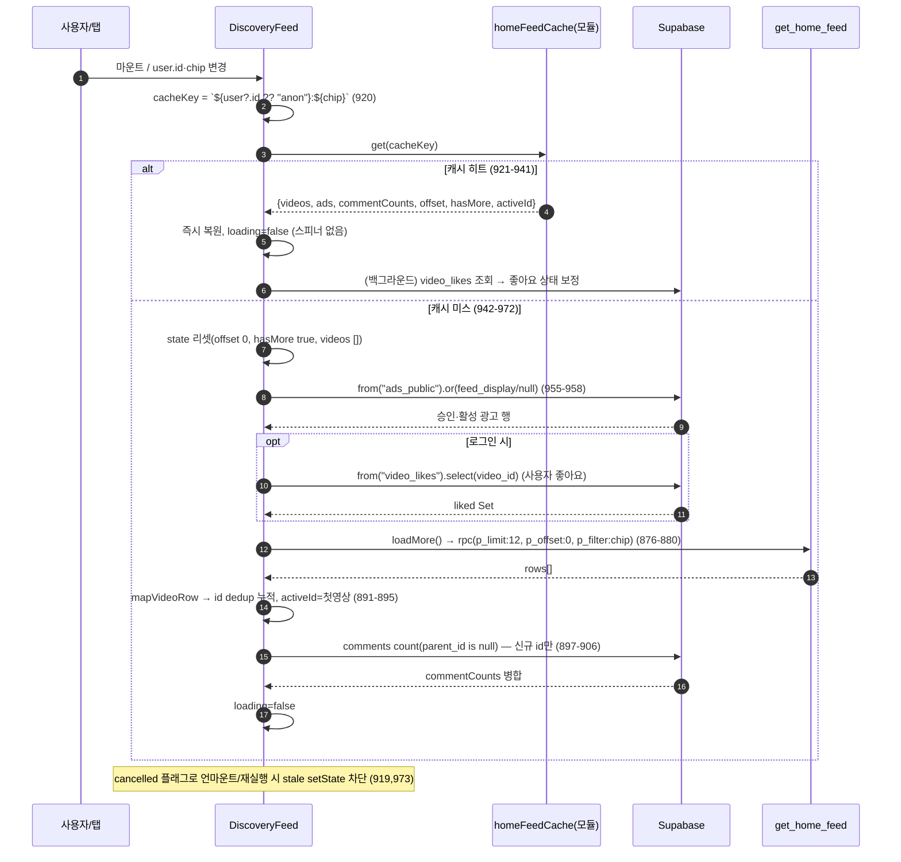
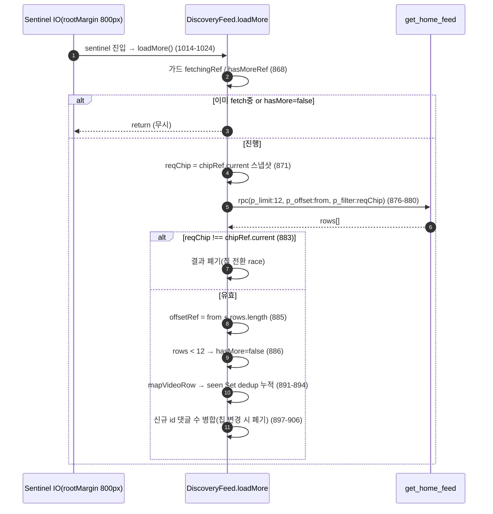
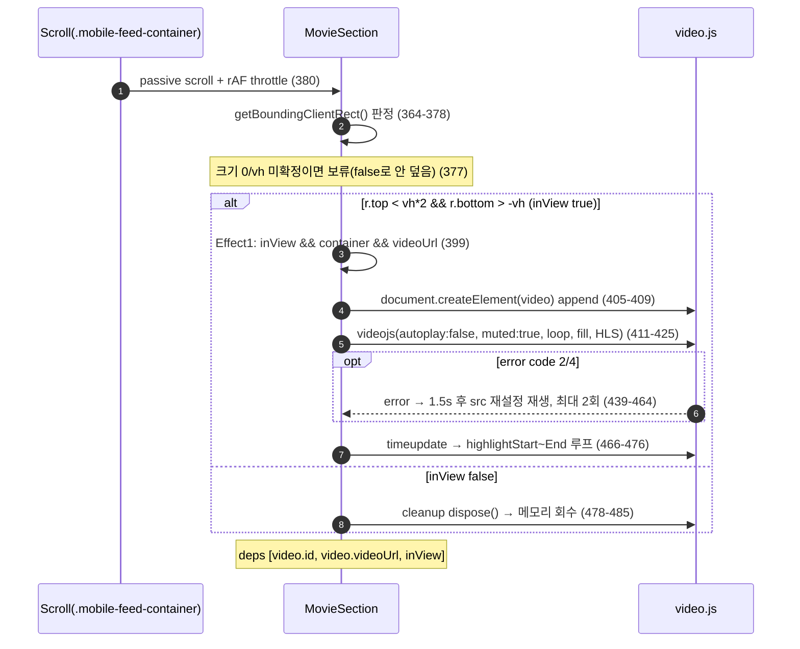
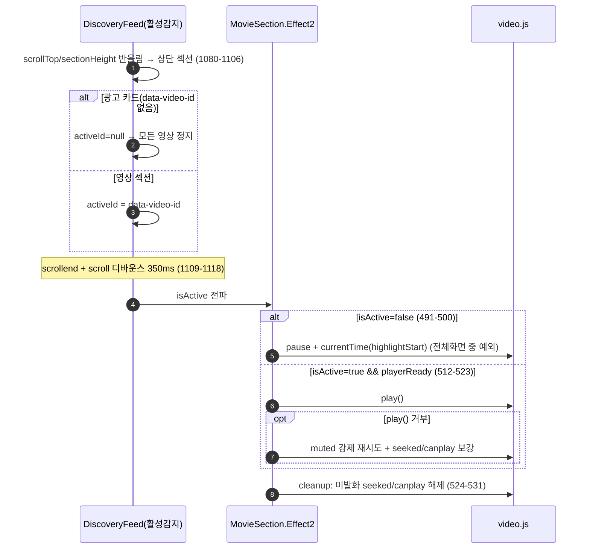
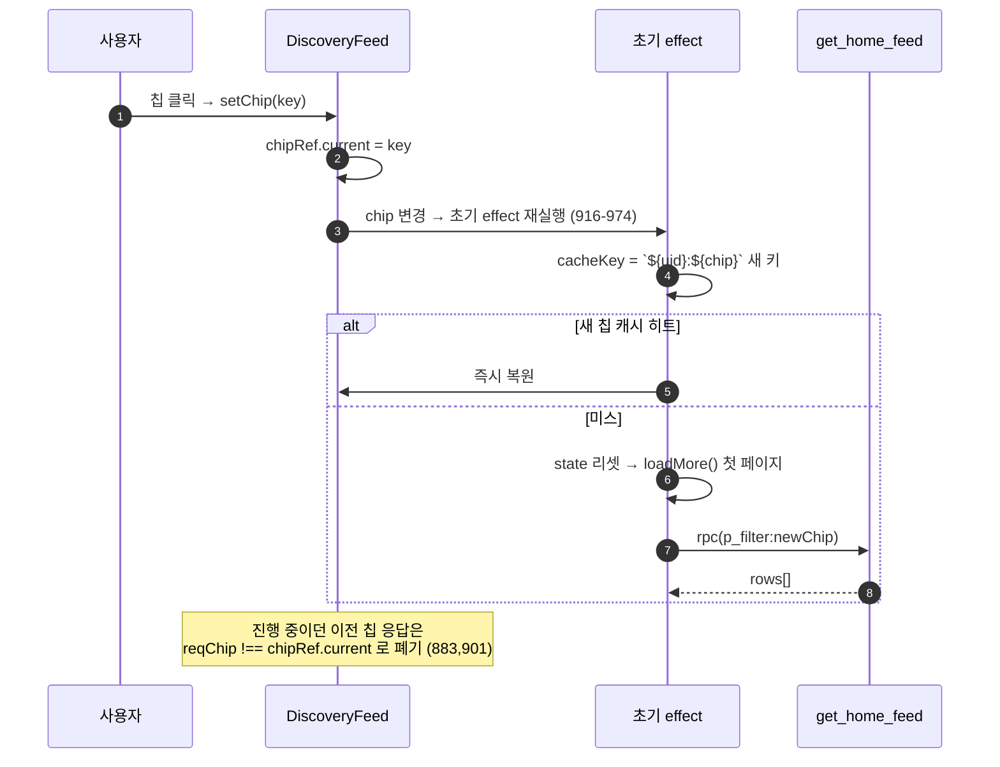
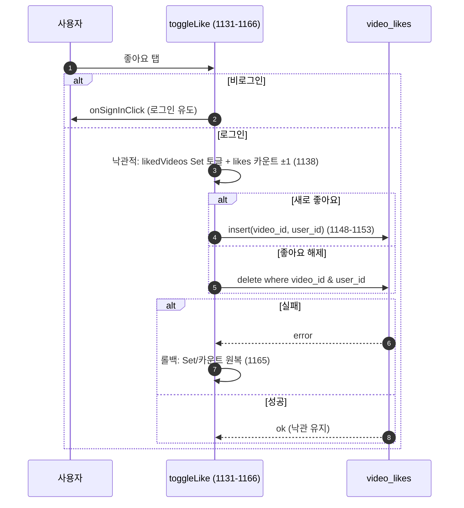

# 02. 홈 피드(Discovery) — 상세 명세

> 본 문서는 추측이 아니라 실제 코드를 읽고 작성됨. 근거는 `파일:줄` 형식으로 표기한다.
> 핵심 구현 파일:
> - `src/app/components/DiscoveryFeed.tsx` (전체 1766줄)
> - `supabase/get_home_feed_safe_columns_20260620.sql` (현행 `get_home_feed` + `v_home_feed_public`)
> - `supabase/home_feed_chip_filter_20260611.sql` (칩 필터 로직 정본 + `get_home_feed_count(text)`)
> - `supabase/home_feed_count_20260611.sql` (구버전 무인자 count — 칩 버전이 이를 대체)
> - `supabase/ads_public_view_20260620.sql` (`ads_public` 안전 뷰)
> - `supabase/ad_charge_dedup_phase3_20260614.sql` (`increment_ad_impressions` dedup)
> - `supabase/home_security_20260620.sql` (`increment_ad_clicks` dedup + `video_likes`/`comments` RLS)
> - `src/app/components/CommentPanel.tsx`, `src/app/components/ExternalAdSlot.tsx`

---

## 1. 개요 / 목적

홈 피드(Discovery)는 CREAITE의 첫 화면이자 모든 공개 영상의 "하이라이트 코너"다. 컴포넌트는 `DiscoveryFeed`(`src/app/components/DiscoveryFeed.tsx:759`).

- 목적: `show_on_home=true`인 모든 공개 영상을 우선순위(개인화/인기/최신)대로 끊김 없이 노출한다. 주석 명시: "홈 피드는 모든 영상의 하이라이트 코너이므로 100편이든 10000편이든 전부 노출"(`DiscoveryFeed.tsx:866`).
- 두 가지 레이아웃을 한 컴포넌트가 CSS 미디어쿼리(≥1024px)로 분기한다: 모바일 = TikTok식 세로 스냅 피드(`mobile-feed-container`, `DiscoveryFeed.tsx:1219`), 데스크탑 = 카드 그리드(`desktop-feed-container`, `DiscoveryFeed.tsx:1264`). 표시 전환은 순수 CSS이며 둘 다 DOM에 렌더링된다(`DiscoveryFeed.tsx:1445`-`1449`).
- 수익화: 영상 사이에 광고를 주기적으로 삽입한다. 정책 플래그 `HOME_FEED_SELF_ADS=false`(`DiscoveryFeed.tsx:54`)로 현재는 외부 네트워크(애드핏/애드센스)만 사용한다.

상단 첫 화면이라 푸터가 없으므로, SEO/OAuth 브랜딩 인증용 약관 링크를 `sr-only` nav로 별도 삽입한다(`DiscoveryFeed.tsx:1211`-`1218`).

---

## 2. 사용자 스토리

- 방문자(비로그인)로서, 첫 화면에서 인기+최신 기반 영상을 바로 스크롤해 보고 싶다(개인화 이력 없으면 인기/최신 폴백, `get_home_feed_safe_columns_20260620.sql:91`).
- 로그인 사용자로서, 내 좋아요·시청·팔로우 이력을 반영한 개인화 피드를 보고 싶다(`...:106`-`155`).
- 시청자로서, 칩(전체/인기/최신/무료/소장가능/시네마급)으로 빠르게 필터링하고 싶다(`DiscoveryFeed.tsx:110`-`117`).
- 시청자로서, 세로 스와이프로 자동재생되는 영상을 끊김 없이 넘기고 싶다(스냅 + 자동재생, `DiscoveryFeed.tsx:1221`, `490`-`532`).
- 시청자로서, 영상에 좋아요/댓글/공유/팔로우를 즉시 하고 싶다(`ActionButtons`, `DiscoveryFeed.tsx:219`).
- 19+ 미성년/미인증자로서, 연령 제한 영상은 잠금 처리되길 원한다(`isAgeLocked`, `DiscoveryFeed.tsx:359`).
- 구매 의향 시청자로서, 가격/협의 여부를 보고 상세로 진입하고 싶다(`DiscoveryFeed.tsx:679`-`704`).
- 크리에이터로서(BETA), 상단 배너로 바로 등록 페이지로 가고 싶다(`DiscoveryFeed.tsx:1194`-`1209`).
- 광고주로서, 노출/클릭이 사기 없이 1시간 1회로 집계되길 원한다(dedup, `ad_charge_dedup_phase3_20260614.sql`, `home_security_20260620.sql:52`).

---

## 3. 화면 & 상태

### 3.1 레이아웃 분기 (모바일 세로피드 / 데스크탑 그리드)
- CSS 미디어쿼리 ≥1024px(=Tailwind `lg`)로 전환. 모바일 컨테이너는 `display:none` @1024px+, 데스크탑 컨테이너는 그 반대(`DiscoveryFeed.tsx:1445`-`1449`).
- 댓글 패널 분기(JS)는 별도로 `matchMedia("(min-width: 1024px)")`로 판단(`isDesktop`, `DiscoveryFeed.tsx:764`-`772`). 이는 모바일 시트와 데스크탑 모달의 **이중 마운트**(이중 fetch/구독)를 막기 위함(`DiscoveryFeed.tsx:762`-`763`).
- 모바일: 세로 스냅(`snap-y snap-mandatory`), 한 화면에 영상 2개(섹션 높이 `calc(50% - 1.5px)`, `DiscoveryFeed.tsx:1393`-`1394`). 컨테이너 높이 `calc(100dvh - 136px)`(`...:1387`).
- 데스크탑: 반응형 그리드 `grid-cols-1 / md:2 / xl:3 / 2xl:4`(`DiscoveryFeed.tsx:1339`), 상단 sticky 헤더(DISCOVERY FILMS 타이틀 + 칩 바 + 검색바 + VIDEOS 카운트 배지, `...:1267`-`1338`).

### 3.2 로딩 / 빈 / 에러
- 초기 로딩: 전체 화면 스피너(`loading` true, `DiscoveryFeed.tsx:1186`).
- 빈 피드: `videos.length === 0` → "표시할 영상이 없습니다."(`DiscoveryFeed.tsx:1187`).
- 추가 로딩(무한스크롤): 하단 스피너(`loadingMore`, `DiscoveryFeed.tsx:1256`-`1258`, 데스크탑 `1375`-`1377`).
- 피드 끝: "END OF FEED"(모바일 `1259`-`1261`) / "End of Feed"(데스크탑 `1378`-`1380`).
- 영상 재생 에러(2회 재시도 실패): 카드 위 "영상 처리 중..." 오버레이 + 스피너(`MovieSection`, `DiscoveryFeed.tsx:558`-`563`).

### 3.3 온보딩 게이트(연령)
- 19+/제한 영상은 `shouldBlur(age_rating, ageVerified)`로 잠금 판정. **본인 영상은 게이트 제외**(`isMyVideo`, `DiscoveryFeed.tsx:358`-`359`).
- 잠금 시 카드 전체에 흐림+자물쇠 오버레이, 탭하면 `onVideoClick`으로 ProductDetail 진입(거기서 실제 게이트, `DiscoveryFeed.tsx:627`-`639`).
- 연령 배지(`AgeBadge`)는 잠금과 무관하게 항상 표시(`DiscoveryFeed.tsx:675`, 데스크탑 `1698`-`1700`).

### 3.4 칩 필터 바
- 칩 6종: `all/popular/new/free/paid/cinema` — `HOME_CHIPS`(`DiscoveryFeed.tsx:110`-`117`). 라벨은 `isKo`에 따라 한/영(`...:1286`).
- 데스크탑에서만 sticky 헤더에 노출. 넘치면 유튜브식 좌우 화살표(`chipArrows`, `DiscoveryFeed.tsx:776`, `984`-`1001`, `1290`-`1315`). 화살표 표시 판정은 `scrollLeft`/`clientWidth`/`scrollWidth` 기준(`...:985`-`991`), 리사이즈/스크롤 시 갱신.
- (모바일 레이아웃엔 칩 바 UI가 렌더되지 않음 — 칩 바는 `desktop-grid-wrapper` 내부 sticky 헤더에만 존재. `chip` state 기본값 `"all"`.)

---

## 4. 동작 흐름

### 4.1 초기 로드 (`user.id`/`chip` 변경 시 재시작, `DiscoveryFeed.tsx:916`-`974`)
1. 캐시 키 `${user?.id ?? "anon"}:${chip}` 계산(`...:920`).
2. **모듈 캐시 히트 시**: 리로드/스피너 없이 즉시 복원(videos/ads/commentCounts/offset/hasMore/activeId 세팅, `loading=false`). 좋아요 상태만 백그라운드 갱신(`...:921`-`941`).
3. 캐시 미스 시: state 리셋(offset 0, hasMore true, videos []) → `ads_public` 광고 조회 → 로그인 시 `video_likes` 조회 → `loadMore()` 첫 페이지(`...:942`-`972`).
4. `cancelled` 플래그로 언마운트/재실행 시 stale setState 차단(`...:919`, `973`).

### 4.2 무한 스크롤 (`loadMore`, `DiscoveryFeed.tsx:867`-`914`)
- 가드: `fetchingRef`(중복 호출 방지) + `hasMoreRef`(`...:868`). 요청 시점 칩을 `reqChip`로 스냅샷(`...:871`).
- `supabase.rpc("get_home_feed", { p_limit: 12, p_offset: from, p_filter: reqChip })`(`...:876`-`880`).
- 응답 후 `reqChip !== chipRef.current`면 결과 폐기(칩 전환 race 방지, `...:883`).
- `offsetRef = from + rows.length`; rows < 12면 `hasMore=false`(`...:885`-`886`).
- 매핑(`mapVideoRow`) 후 **id 기반 dedup**으로 누적(`seen` Set, `...:891`-`894`).
- `activeId`가 비어있으면 첫 영상으로 세팅(`...:895`).
- 새 페이지 영상에 대해서만 댓글 수 조회(`comments` where `parent_id is null`)해 누적 병합(`...:897`-`906`). 병합도 칩 변경 시 폐기(`...:901`).
- sentinel(`.feed-load-sentinel`)이 `rootMargin:"800px 0px"`로 보이면 `loadMore` 트리거(`DiscoveryFeed.tsx:1014`-`1024`). sentinel은 모바일/데스크탑 각각 존재(`1255`, `1374`).

### 4.3 자동재생 — 마운트 / dispose (모바일 `MovieSection`, `DiscoveryFeed.tsx:312`-`711`)
- **지연 마운트(`inView`)**: 비가상화 피드라 모든 섹션이 동시에 플레이어를 만들면 메모리 폭발("Aw Snap" 크래시) → ±1화면 이내일 때만 플레이어 생성(`...:361`-`394`).
  - 판정은 IntersectionObserver가 아니라 `getBoundingClientRect()` 기반. 이유: 이전 IO(root:null)가 내부 스크롤 레이아웃에서 항상 false를 보고해 플레이어가 안 생기던 버그 수정(`...:364`-`366`).
  - 스크롤 컨테이너(`.mobile-feed-container`)에 passive scroll 리스너 + rAF throttle. 초기 레이아웃 안정 대비 120ms/500ms 재시도(`...:380`-`387`). 크기 0/vh 미확정이면 판정 보류(false로 덮지 않음, `...:377`).
  - 임계: `r.top < vh*2 && r.bottom > -vh`(`...:378`).
- **Effect 1 — 플레이어 생성/dispose**(`...:399`-`485`): `inView && container && videoUrl`일 때만. `video` 엘리먼트를 React 밖에서 `document.createElement`로 만들어 append → dispose 시 React removeChild 충돌 방지(`...:405`-`409`). video.js 옵션: autoplay false, controls false, loop true, muted true, fill, preload metadata, crossOrigin anonymous, m3u8면 HLS 타입(`...:411`-`425`). cleanup에서 `dispose()`(`...:478`-`484`). deps `[video.id, video.videoUrl, inView]` → inView false 시 dispose로 메모리 회수(`...:485`).
  - 재시도: `error` 이벤트에서 code 2(NETWORK)/4(SRC_NOT_SUPPORTED)면 1.5초 후 src 재설정+재생, 최대 2회. 실패 시 `hasError`(`...:439`-`464`).
  - 하이라이트 루프: `timeupdate`에서 `highlightStart`~`highlightEnd`(기본 start+30, 영상길이 초과 시 클램프) 구간만 반복(`...:466`-`476`).
- **Effect 2 — 활성/비활성 전환**(`...:490`-`532`): `isActive=false`면 일시정지+`currentTime(highlightStart)`(전체화면 중이면 예외, `...:491`-`500`). `isActive=true && playerReady`면 재생. `play()` 거부 대비 muted 강제 재시도 + `seeked`/`canplay` 이벤트로 재시도 보강(`...:512`-`523`). cleanup에서 미발화 리스너 해제(빠른 스크롤 시 늦게 도착한 이벤트가 비활성 영상 재생/소리내는 것 방지, `...:524`-`531`).
- **Effect 3 — 뮤트 반영**(`...:534`-`539`).
- **활성 감지**(`DiscoveryFeed.tsx:1080`-`1129`): `scrollTop / sectionHeight` 반올림으로 상단 섹션 인덱스 산출 → 그 섹션의 `data-video-id`로 `activeId` 세팅. 광고 카드는 `data-video-id` 없음 → null → 모든 영상 정지(`...:1103`-`1106`). `scrollend`(신규 브라우저) + `scroll` 디바운스 350ms(iOS/휠 폴백, `...:1109`-`1118`). 전체화면 중엔 자동 변경 금지(`...:1086`-`1088`).
- 데스크탑(`DesktopMovieCard`, `DiscoveryFeed.tsx:1628`): 호버 시에만 플레이어 생성/재생, 호버 해제 시 일시정지, **언마운트 시에만 dispose**(`...:1635`-`1674`).

### 4.4 좋아요 / 팔로우 / 댓글 / 공유
- **좋아요**(`toggleLike`, `DiscoveryFeed.tsx:1131`-`1166`): 비로그인 → `onSignInClick`. 낙관적 업데이트(likedVideos Set + likes 카운트) 후 `video_likes` insert/delete, 실패 시 롤백(`...:1138`-`1165`).
- **팔로우**: `FollowButton`(`creatorId` 전달, `DiscoveryFeed.tsx:672`-`674`, 데스크탑 `1724`-`1726`).
- **댓글**: 버튼 → `setCommentVideo(v)`(`DiscoveryFeed.tsx:1242`). showcase 영상이면 차단(`handleShowcaseClick`). 패널은 모바일 시트/데스크탑 모달로 분기(§ CommentPanel 연동).
- **공유**(`handleShare`, `DiscoveryFeed.tsx:1168`-`1184`): URL `${origin}?video=${id}`. 모바일은 `navigator.share` 우선(AbortError는 무시), 미지원/데스크탑은 `ShareModal`(`...:1492`-`1500`).
- **전체화면**(`openFullscreenGated`, `DiscoveryFeed.tsx:791`-`796`): 비구독자 + 길이 미상/60초 초과면 ProductDetail로 우회(페이월 회피 차단). 구독자거나 확실한 60초 이하 숏폼만 직접 `VideoFullscreen`. 진입 직전 모든 `<video>`를 pause+mute(`...:604`-`609`). 전체화면 동안 피드 자동재생 차단(play 이벤트 즉시 재pause + resize/orientation 백업, `DiscoveryFeed.tsx:843`-`863`).

### 4.5 광고 삽입
- **모바일**(`feedItems`, `DiscoveryFeed.tsx:1033`-`1052`): 주기 = self-ads ON이면 `interval_count`(기본 4), OFF면 고정 5(`...:1035`). `(i+1) % interval === 0`마다 슬롯. self-ad 우선(스위치 ON 시) → 없으면 `extad`(외부) → 둘 다 없으면 슬롯 생략(빈 섹션 방지, `...:1040`-`1049`).
- **데스크탑**(`desktopItems`, `DiscoveryFeed.tsx:1060`-`1078`): 영상 6개마다 1개(`DESKTOP_AD_INTERVAL=6`, `...:1059`). 주기 7(=6영상+1광고)이 2/3/4열과 서로소라 광고가 같은 열에 쏠리지 않고 대각선 회전(`...:1054`-`1058`).
- **노출 트래킹**(`handleAdImpression`, `DiscoveryFeed.tsx:1027`-`1029`): 카드가 화면에 들어오면(IntersectionObserver threshold 0.5, 1회만) `increment_ad_impressions(ad_id, p_viewer_key)`(`AdCard` `...:131`-`156`, 데스크탑 `DesktopAdCard` `1567`-`1585`).
- **클릭**: `increment_ad_clicks(ad_id, p_viewer_key)` 후 `openAdLinkSafe`(http(s)만, `DiscoveryFeed.tsx:119`-`128`, `151`-`156`, `1587`-`1590`).
- 외부 광고는 `ExternalAdSlot`(애드핏/애드센스, 300×250 고정, index로 네트워크 로테이션, `ExternalAdSlot.tsx`).

---

## 5. 데이터 / RPC 계약

### 5.1 `get_home_feed(p_limit, p_offset, p_filter)` — `get_home_feed_safe_columns_20260620.sql:42`
- 인자: `p_limit integer DEFAULT 12`, `p_offset integer DEFAULT 0`, `p_filter text DEFAULT 'all'`(`...:43`-`46`). 프론트는 항상 12/offset/chip 전달(`DiscoveryFeed.tsx:876`-`880`).
- 반환: `RETURNS SETOF public.v_home_feed_public`(`...:47`). 이 뷰는 `videos`의 공개 안전 컬럼만 투영하고 `moderation_*`(status/score/categories/error) 내부 운영필드는 제외(`...:23`-`33`). `seed/prompt/ai_model_version`은 AI 증빙으로 의도적 공개 유지(`...:10`-`11`).
- 보안: `STABLE SECURITY DEFINER SET search_path='public'`(`...:48`), `GRANT EXECUTE ... TO anon, authenticated`(`...:159`). 뷰 자체는 anon에 GRANT 안 함(함수 내부에서만 읽음, `...:20`-`21`).

#### 칩 필터 매핑 (`p_filter` → 분기)
- 공통 WHERE(모든 분기): `show_on_home=true AND (visibility='public' OR NULL) AND COALESCE(is_hidden,false)=false AND (series_id IS NULL OR COALESCE(episode_number,1)=1)` — **시리즈는 1화만**(`...:58`-`59` 등).
- `new`: 위 + `ORDER BY created_at DESC, id`(`...:55`-`63`).
- `popular`/`free`/`paid`/`cinema`: 인기점수 정렬. `free` → `price_standard=0`, `paid` → `price_standard>0`, `cinema` → `show_on_ott=true`(`...:66`-`82`). 정렬식: `likes*1.0 + (최근 7일 유효 조회수)*2.0` DESC, created_at DESC, id(`...:74`-`79`).
- `all`(기본) → 개인화(§ 6).

### 5.2 개인화 정렬(`all`) — `get_home_feed_safe_columns_20260620.sql:84`-`155`
- 이력 판단: `auth.uid()`가 있고 `video_likes` 또는 유효 `video_views`가 있으면 `v_has_history=true`(`...:85`-`89`).
- 비로그인 OR 무이력 → 인기/최신 폴백(인기점수식 동일, `...:91`-`104`).
- 이력 있음 → CTE 4종 가중합:
  - `cat_pref`: 좋아요 카테고리 +3, 조회 카테고리 +1(`...:107`-`114`).
  - `genre_pref`: 좋아요 장르 +3, 조회 장르 +1(`...:116`-`123`).
  - `creator_pref`: 좋아요 크리에이터 +3, **팔로우 크리에이터 +5**(`...:125`-`132`).
  - `viewed`: 이미 본 영상(`...:134`-`137`).
  - 최종 점수: `cat*1.0 + genre*1.0 + creator*1.0 + likes*0.05 - (본 영상이면 4)` DESC, created_at DESC, id(`...:148`-`154`). 본 영상은 -4로 강등.

### 5.3 `get_home_feed_count(p_filter)` — `home_feed_chip_filter_20260611.sql:131`
- 현행 시그니처는 `(p_filter text DEFAULT 'all')`(`...:131`)로 프론트 호출 `rpc("get_home_feed_count", { p_filter: chip })`(`DiscoveryFeed.tsx:1007`)와 일치.
- count WHERE: `show_on_home=true AND public(or null) AND not hidden AND (free→=0 / paid→>0 / cinema→ott)`(`...:133`-`139`).
- 주의: `home_feed_count_20260611.sql`의 **무인자** 버전은 구버전이며, 칩 버전이 `DROP FUNCTION ... get_home_feed_count()` 후 이를 대체(`home_feed_chip_filter_20260611.sql:128`-`129`). 단 칩 count WHERE에는 시리즈 1화 필터가 빠져 있어, 무인자 버전(`home_feed_count_20260611.sql:19`, 시리즈 필터 포함)과 조건이 어긋남 → **이월 항목**(§ 12).

### 5.4 페이지네이션 / dedup
- 페이지 크기 `FEED_PAGE_SIZE = 12`(`DiscoveryFeed.tsx:752`). offset 누적은 **반환 행 수 기준**(`offsetRef = from + rows.length`, `...:885`) — 차단 영상 클라 필터로 인한 표시 수와 무관하게 DB 오프셋 정합.
- 안정 정렬: 모든 분기가 마지막에 `id` 타이브레이커(중복/누락 방지).
- 프론트 dedup: 누적 시 id Set으로 중복 제거(`...:891`-`894`).

### 5.5 `mapVideoRow` 매핑 — `DiscoveryFeed.tsx:714`-`749`
DB row(뷰 컬럼) → `Video` 인터페이스. 주요 매핑:
- `price`/`priceStandard` ← `price_standard`(`...:722`, `733`), `tool` ← `ai_tool`(`...:726`), `creatorId` ← `creator_id`(`...:718`).
- `durationSeconds` ← `duration_seconds`(페이월 게이트용, `...:723`).
- `tags`: 배열이면 그대로, 문자열이면 콤마 분리(`...:732`).
- `age_rating` 기본 "all"(`...:730`), `highlightEnd` 기본 `highlightStart+30`(`...:746`), `seriesId` ← `series_id`(`...:747`).

### 5.6 광고 조회 — `DiscoveryFeed.tsx:955`-`958`
- `supabase.from("ads_public").select(...).or("ad_type.eq.feed_display,ad_type.is.null")`. `ads_public` 뷰가 승인·활성·노출기간 필터를 강제하고 민감컬럼(budget/spent/owner) 비노출(`ads_public_view_20260620.sql:20`-`30`).

---

## 6. 비즈니스 규칙

- **개인화 가중치**(`all`, 이력 있음): 카테고리/장르/크리에이터 각 1.0 비중(좋아요 3 / 조회 1 / 팔로우 5 가중) + likes 0.05 − 기시청 4(`get_home_feed_safe_columns_20260620.sql:148`-`154`). 팔로우(5)가 단일 신호로는 최강.
- **인기점수**(popular/free/paid/cinema 및 폴백): `likes + 최근7일유효조회수×2`(`...:74`-`79`).
- **시리즈 1화만**: `series_id IS NULL OR episode_number=1`인 영상만 피드에 노출(후속화 제외, `...:59`). 카드에 "시리즈" 배지(`DiscoveryFeed.tsx:589`-`593`, 데스크탑 `1691`-`1695`).
- **길이 게이팅(페이월)**: 전체화면 진입 시 비구독자 + (길이 미상 또는 60초 초과) → 직접 재생 차단, ProductDetail로(`DiscoveryFeed.tsx:791`-`796`).
- **광고 주기**: 모바일 외부광고 5칸, self-ads ON 시 `interval_count`(기본 4)(`...:1035`); 데스크탑 6칸(`...:1059`).
- **티어/정책 플래그**: `HOME_FEED_SELF_ADS=false`(외부 광고만, `...:54`), `BETA_MODE`(상단 등록 배너, `...:1194`), `EXTERNAL_ADS_ACTIVE`(외부 광고 슬롯 삽입 가드, `ExternalAdSlot.tsx:41`).
- **가격 표시**: `price>0`면 "상업용 다운로드/₩금액" 또는 협의(`isNegotiationOnly`), `price=0`이면 "무료 시청/라이선스 미판매"(`DiscoveryFeed.tsx:679`-`696`, 데스크탑 `1731`-`1743`).
- **차단 사용자**: 차단한 크리에이터 영상은 피드에서 제외(클라, `visibleVideos`, `DiscoveryFeed.tsx:830`-`833`).

---

## 7. 엣지 케이스 & 에러 처리

- **칩 전환 race**: 응답 시점 `reqChip !== chipRef.current`면 결과 폐기(영상·댓글수 둘 다, `DiscoveryFeed.tsx:883`, `901`). 칩 변경은 초기 effect가 새로 로드(`...:944`-`966`).
- **중복 영상**: 누적 시 id Set으로 dedup(`...:891`-`894`); DB 정렬에 id 타이브레이커로 페이지 경계 안정(`get_home_feed_safe_columns_20260620.sql:154`).
- **빈 피드**: "표시할 영상이 없습니다."(`DiscoveryFeed.tsx:1187`); 광고 데이터 없으면 슬롯 생략(빈 섹션 방지, `...:1040`-`1049`).
- **자동재생 실패**: code 2/4면 1.5초 후 2회 재시도 → 실패 시 "영상 처리 중..." 오버레이(`...:439`-`464`, `558`-`563`). `play()` 거부는 muted 강제 재시도 + seeked/canplay 보강(`...:512`-`523`).
- **늦게 도착한 이벤트**: 비활성/언마운트 시 seeked/canplay 리스너 해제 → 빠른 스크롤 후 비활성 영상이 소리내는 것 방지(`...:524`-`531`).
- **다중 소리**: 전체화면 진입 시 모든 `<video>` pause+mute(`...:604`-`609`, `843`-`863`).
- **캐시 오염**: 초기 로딩 중(`loading`)엔 캐시에 기록 안 함(`...:977`-`982`). 캐시 키에 `user.id`와 `chip` 포함 → 사용자/필터 전환 시 격리. 단 캐시는 세션 메모리라 좋아요는 복원 후 백그라운드 재조회로 보정(`...:933`-`939`).
- **잘못된 광고 링크**: `openAdLinkSafe`가 `new URL()` 파싱 + http(s) 스킴만 허용(javascript:/data: 차단, `...:119`-`128`).
- **광고/클릭 위조**: RPC dedup으로 (광고,뷰어,1시간) 1회만 과금(§ 9).

---

## 8. 성능

- **모듈 캐시**(`homeFeedCache`, `DiscoveryFeed.tsx:754`-`757`): 키 `${userId}:${chip}`, 무한스크롤 누적분 통째 보관 → 탭 복귀 즉시 복원(스피너 없음, `...:921`-`941`). 저장은 비로딩 시에만(`...:977`-`982`).
- **useMemo**: `visibleVideos`(차단 필터, `...:830`), `creatorIds`(`...:835`), `feedItems`(`...:1033`), `desktopItems`(`...:1060`) — 사소한 state 변경 시 전배열 재계산 방지.
- **lazy 이미지**: 썸네일 `loading="lazy" decoding="async"`(`...:553`-`554`, 데스크탑 `1684`).
- **지연 마운트**: 비가상화 피드에서 ±1화면 섹션만 video.js 생성, 멀어지면 dispose로 메모리 회수(`...:361`-`394`, `485`). 데스크탑은 호버 시에만 생성(`...:1635`-`1657`).
- **sentinel + rootMargin 800px**: 끝 도달 전 미리 다음 페이지 로드(`...:1019`-`1021`).
- **rAF throttle**: 지연마운트 스크롤 판정(`...:380`), 활성감지 scroll 디바운스 350ms(`...:1113`-`1117`).
- **댓글 수 증분 조회**: 새 페이지 영상 id만 조회해 병합(전체 재조회 안 함, `...:897`-`906`).

---

## 9. 권한 / 보안

- **안전 뷰**: `get_home_feed`는 `v_home_feed_public`만 반환 → `moderation_*` 내부필드 anon 비노출(`get_home_feed_safe_columns_20260620.sql:7`-`33`). 광고는 `ads_public` 뷰로 민감컬럼(budget/spent/owner) 차단하고 base `ads` 공개 SELECT 정책은 제거됨(`ads_public_view_20260620.sql:20`-`37`).
- **viewer_key dedup**:
  - 노출: `increment_ad_impressions(ad_id, p_viewer_key)` — `COALESCE(auth.uid(), 세션키)` + `date_trunc('hour')` 버킷, (광고,뷰어,1시간) 1회만 CPM 과금(`ad_charge_dedup_phase3_20260614.sql:22`-`48`). dedup 테이블은 RLS on + 정책 없음(DEFINER 함수만 기록, `...:18`-`20`).
  - 클릭: `increment_ad_clicks(ad_id, p_viewer_key)` — 동일 dedup, 구 1-파라미터 함수는 DROP(우회 차단, `home_security_20260620.sql:50`-`70`).
  - 세션키: `getViewerSessionKey()`(localStorage)로 비로그인도 식별(`DiscoveryFeed.tsx:153`, `1028`).
- **video_likes RLS**: 본인 행만 select/insert/delete(`home_security_20260620.sql:24`-`33`).
- **comments SELECT RLS**: 숨김 댓글은 작성자/관리자/영상소유자만 열람(`home_security_20260620.sql:90`-`100`).
- **외부 링크 안전**: http(s) 스킴만 `window.open(... noopener,noreferrer)`(`DiscoveryFeed.tsx:119`-`128`).

---

## 10. 분석 / 이벤트

- **광고 노출**: 카드 50% 가시 1회 → `increment_ad_impressions`(impressions+1, spent_krw += CEIL(CPM/1000), `ad_charge_dedup_phase3_20260614.sql:40`-`46`). CPM은 플랫폼 설정 `ad_cpm_krw`(기본 2000, `...:41`).
- **광고 클릭**: `increment_ad_clicks`(clicks+1, dedup, `home_security_20260620.sql:66`-`68`).
- **좋아요**: `video_likes` insert/delete(`DiscoveryFeed.tsx:1148`-`1153`).
- **개인화 신호 원천**: `video_likes`, `video_views`(is_valid), `creator_followers` — `get_home_feed`가 이들을 읽어 랭킹(§ 5.2).
- **인기 신호**: 최근 7일 `video_views.is_valid=true` 카운트(`get_home_feed_safe_columns_20260620.sql:76`-`78`).
- (홈피드 자체 영상 조회수 기록 호출은 본 컴포넌트엔 없음 — 조회 기록은 상세/플레이어 경로에서 발생. 본 피드는 자동재생 미리보기.)

---

## 11. 수용 기준 (체크리스트)

- [ ] 비로그인 시 인기/최신 폴백, 로그인+이력 시 개인화 순서로 노출(`get_home_feed_safe_columns_20260620.sql:91`, `106`).
- [ ] 칩 6종 각각 올바른 필터/정렬(new=최신, popular=인기, free=무료, paid=유료, cinema=ott, all=개인화).
- [ ] 시리즈는 1화만 피드/카운트에 노출, 카드에 "시리즈" 배지.
- [ ] 무한스크롤: 12개 단위 로드, 끝에서 "END OF FEED", 중복 영상 없음.
- [ ] 칩 전환 직후 이전 칩 응답이 섞이지 않음(race 폐기).
- [ ] 모바일 세로 스냅: 상단 영상만 활성·자동재생, 나머지 정지/뮤트.
- [ ] ±1화면 밖 섹션은 플레이어 dispose(메모리 회수), 광고 카드 활성 시 모든 영상 정지.
- [ ] 좋아요 낙관적 업데이트 + 실패 롤백, 비로그인 시 로그인 유도.
- [ ] 댓글 패널: 모바일 시트/데스크탑 모달 중 하나만 마운트(이중 fetch 없음).
- [ ] 공유: 모바일 네이티브 공유 → 미지원 시 ShareModal, URL `?video=id`.
- [ ] 19+ 잠금: 미인증 시 오버레이, 본인 영상은 잠금 제외.
- [ ] 전체화면: 비구독자+장편/길이미상은 ProductDetail로 우회.
- [ ] 광고: 모바일 5칸/데스크탑 6칸 주기 삽입, 데이터 없으면 빈 슬롯 없음.
- [ ] 광고 노출/클릭이 (광고,뷰어,1시간) 1회만 집계(dedup).
- [ ] `ads_public`/`v_home_feed_public`이 민감/모더레이션 컬럼 비노출.
- [ ] 탭 복귀 시 모듈 캐시로 스피너 없이 직전 상태 복원.
- [ ] 외부 광고 링크는 http(s)만 새 탭(noopener) 오픈.

---

## 12. 알려진 제약 / 이월

- **비가상화 피드**: DOM에 전 카드 유지 + 지연 마운트로 메모리만 방어. 향후 가상화(react-virtual 등) 전환 검토(`DiscoveryFeed.tsx:362`).
- **자동재생 IO 미사용**: 지연 마운트는 `getBoundingClientRect`+scroll 리스너로 구현(IO root:null이 내부 스크롤에서 오작동했던 이력, `...:364`-`366`). 스크롤 컨테이너를 root로 지정한 IO 전환은 이월.
- **count 조건 불일치**: 칩 버전 `get_home_feed_count`(`home_feed_chip_filter_20260611.sql:133`-`139`)에는 시리즈 1화 필터가 없어 `get_home_feed`(`get_home_feed_safe_columns_20260620.sql:59`) 및 무인자 count(`home_feed_count_20260611.sql:19`)와 조건이 어긋남 → 배지 수가 실제 피드 수보다 과대 표시될 수 있음(정합 패치 필요).
- **모바일 칩 UI 부재**: 칩 바는 데스크탑 sticky 헤더에만 렌더(`DiscoveryFeed.tsx:1267`-`1338`). 모바일에서 칩 전환 UI는 미노출(코드상 `chip`은 변경 가능하나 트리거 없음) → 모바일 칩 필터 진입점 추가 검토.
- **데스크탑 자동재생**: 호버 기반(터치 데스크탑/키보드 사용자 비호버 시 미리보기 없음, `...:1635`).
- **댓글 수 정합**: 작성 시 +1 낙관 증가(`...:1484`), 삭제 반영은 없음(증분만) → 새로고침 전까지 과대 가능.

---

## 13. 와이어프레임 (텍스트 목업)

> 실제 CSS/구조 근거: 모바일 세로 스냅(`DiscoveryFeed.tsx:1219`-`1262`), 데스크탑 그리드(`...:1264`-`1383`), 칩 바(`...:1290`-`1315`), 연령 게이트(`...:627`-`639`), 광고 슬롯(`...:1033`-`1078`).

### 13.1 모바일 세로 피드 카드 (1화면 2영상, snap-y mandatory)

```
┌─────────────────────────────┐  ← 컨테이너 높이 calc(100dvh - 136px)
│  [BETA] 크리에이터 등록 →     │     (.mobile-feed-container, snap-y)
├─────────────────────────────┤
│ ▓▓▓▓▓ MovieSection #1 ▓▓▓▓▓ │  ← 섹션 높이 calc(50% - 1.5px)
│ ▓ (video.js, muted, loop)  ▓ │     snap-start, data-video-id=#1
│ ▓                          ▓ │     → 상단 = activeId → 자동재생
│ ▓  [12]                    ▓ │  ← AgeBadge(좌상단, 잠금무관 항상)
│ ▓                  ❤  1.2k  ▓ │
│ ▓                  💬   34  ▓ │  ← ActionButtons(우측 세로)
│ ▓                  ↗ 공유   ▓ │
│ ▓                  +팔로우  ▓ │
│ ▓ @creator · 제목           ▓ │
│ ▓ 🎬 상업용 다운로드 ₩30,000 ▓│  ← price>0: 가격 / price=0: 무료시청
│ ▓▓▓▓▓▓▓▓▓▓▓▓▓▓▓▓▓▓▓▓▓▓▓▓▓▓▓ │
├─────────────────────────────┤  ← snap 경계(1.5px gap)
│ ░░░░░ MovieSection #2 ░░░░░ │  ← inView=±1화면 → 마운트, 비활성=정지+mute
│ ░  (썸네일 lazy, 정지)      ░ │
│ ░░░░░░░░░░░░░░░░░░░░░░░░░░░░ │
└─────────────────────────────┘
                ↓ 스크롤
┌─────────────────────────────┐
│  연령 잠금 카드 예시         │
│  🔲🔲🔲 (blur) 🔒 19+ 🔲🔲🔲 │  ← shouldBlur(age_rating, ageVerified)
│   탭 → ProductDetail(실게이트)│     본인 영상(isMyVideo)은 제외
└─────────────────────────────┘
                ↓ (i+1)%5==0 위치
┌─────────────────────────────┐
│  📢 광고 슬롯 (AdCard/extad) │  ← self-ad OFF → 외부광고, 둘 다 없으면 슬롯 생략
│     data-video-id 없음       │     → activeId=null → 모든 영상 정지
└─────────────────────────────┘
   ...
┌─────────────────────────────┐
│   ⟳ (loadingMore 스피너)     │  ← .feed-load-sentinel (rootMargin 800px)
│        END OF FEED           │  ← hasMore=false
└─────────────────────────────┘
```

### 13.2 데스크탑 그리드 (sticky 헤더 + 반응형 그리드)

```
┌──────────────────────────────────────────────────────────────┐
│ DISCOVERY FILMS                              [🔍 검색바      ] │  ← sticky 헤더
│ ◀ [전체][🔥인기][✨최신][🆓무료시청][💎소장가능][🎬시네마급] ▶ │  ← 칩 바(넘치면 ◀▶)
│                                                  VIDEOS: 1,234 │  ← get_home_feed_count 배지
├──────────────────────────────────────────────────────────────┤
│  grid-cols-1 / md:2 / xl:3 / 2xl:4                            │
│  ┌────────┐ ┌────────┐ ┌────────┐ ┌────────┐                │
│  │ card 1 │ │ card 2 │ │ card 3 │ │ card 4 │  ← 호버 시에만 재생 │
│  │ [12]   │ │        │ │ 시리즈 │ │        │                │
│  │@cr ❤34 │ │@cr     │ │@cr     │ │@cr     │                │
│  │₩30,000 │ │ 무료   │ │ 협의   │ │₩5,000  │                │
│  └────────┘ └────────┘ └────────┘ └────────┘                │
│  ┌────────┐ ┌────────┐ ┌────────┐ ┌────────────────────┐    │
│  │ card 5 │ │ card 6 │ │ card 7 │ │ 📢 DesktopAdCard    │    │  ← 6영상마다 1광고
│  └────────┘ └────────┘ └────────┘ │  (300×250 / extad) │    │     주기 7=2/3/4열 서로소
│                                    └────────────────────┘    │     → 대각선 회전
│                          ...                                  │
│                  ⟳ loadingMore / "End of Feed"                │  ← .feed-load-sentinel
└──────────────────────────────────────────────────────────────┘
```

### 13.3 칩 필터 바 (데스크탑 sticky 헤더 전용)

```
컨테이너 좌측 끝(scrollLeft<=0): 좌화살표 숨김
┌──────────────────────────────────────────────────────────────┐
│   [전체*][🔥 인기][✨ 최신][🆓 무료시청][💎 소장가능][🎬 ..▶ │  ← 우측 넘침 → ▶ 표시
└──────────────────────────────────────────────────────────────┘
   * = chip state 활성(기본 "all"). 클릭 → setChip → 초기 effect 재로드
   화살표 표시 판정: scrollLeft / clientWidth / scrollWidth (리사이즈·스크롤 시 갱신)
   (모바일 레이아웃엔 칩 바 미렌더 → § 12 이월)
```

### 13.4 온보딩 게이트(연령) 오버레이

```
┌─────────────────────────────┐
│ ▒▒▒▒▒▒▒▒▒▒▒▒▒▒▒▒▒▒▒▒▒▒▒▒▒▒▒ │  ← 카드 전체 blur
│ ▒▒▒▒▒▒▒    🔒     ▒▒▒▒▒▒▒▒▒ │
│ ▒▒▒▒▒  19+ 인증 필요  ▒▒▒▒▒ │  ← shouldBlur(age_rating, ageVerified)==true
│ ▒▒▒▒▒▒▒▒▒▒▒▒▒▒▒▒▒▒▒▒▒▒▒▒▒▒▒ │
│ [12]                        │  ← AgeBadge는 blur 위에 항상 노출
└─────────────────────────────┘
   탭 → onVideoClick → ProductDetail(실제 게이트 판정)
   예외: isMyVideo==true → blur 안 함(본인 영상)
```

### 13.5 광고 슬롯 배치 규칙

```
모바일(interval=5, self-ads OFF):
  [V][V][V][V][AD][V][V][V][V][AD]...   ← (i+1)%5==0
  AD 우선순위: self-ad(ON일 때) → extad(외부) → 없으면 슬롯 생략

데스크탑(DESKTOP_AD_INTERVAL=6, 주기 7):
  열4 기준:  [V][V][V][V]
             [V][V][AD][V]   ← 7주기가 4열과 서로소 → AD 위치 대각 회전
             [V][V][V][V]
             [AD][V][V][V]
```

---

## 14. 시퀀스 다이어그램

### 14.1 초기 로드 (캐시 → 광고 → 좋아요 → RPC 첫 페이지)



### 14.2 무한 스크롤



### 14.3 자동재생 마운트 / dispose (MovieSection)



### 14.4 활성/비활성 전환 (Effect 2)



### 14.5 칩 전환



### 14.6 좋아요 낙관적 업데이트 + 롤백



---

## 15. API / RPC 레퍼런스

### 15.1 RPC / 뷰 조회 표

| 호출 | 인자 | 반환 | 권한 | 정의 위치(file:line) | 호출부(file:line) |
|---|---|---|---|---|---|
| `get_home_feed` | `p_limit int=12`, `p_offset int=0`, `p_filter text='all'` | `SETOF v_home_feed_public` | `SECURITY DEFINER`, `GRANT EXECUTE → anon, authenticated` | `get_home_feed_safe_columns_20260620.sql:42`-`48`, `:159` | `DiscoveryFeed.tsx:876`-`880` |
| `get_home_feed_count` | `p_filter text='all'` | `integer`(피드 총 건수) | `GRANT EXECUTE → anon, authenticated`(현행 칩 버전) | `home_feed_chip_filter_20260611.sql:131`-`139` | `DiscoveryFeed.tsx:1007` |
| `ads_public` 조회 | `.select(...).or("ad_type.eq.feed_display,ad_type.is.null")` | 승인·활성·기간내 광고 행(민감컬럼 제외) | 안전 뷰(budget/spent/owner 비노출, base `ads` 공개 SELECT 제거) | `ads_public_view_20260620.sql:20`-`37` | `DiscoveryFeed.tsx:955`-`958` |
| `increment_ad_impressions` | `ad_id`, `p_viewer_key` | `void`(impressions+1, spent_krw += CEIL(CPM/1000)) | `SECURITY DEFINER` dedup(광고,뷰어,1시간 1회) | `ad_charge_dedup_phase3_20260614.sql:22`-`48` | `DiscoveryFeed.tsx:141`(AdCard), `1567`-`1585`(DesktopAdCard) |
| `increment_ad_clicks` | `ad_id`, `p_viewer_key` | `void`(clicks+1, dedup) | `SECURITY DEFINER` dedup, 구 1-파라미터 함수 DROP | `home_security_20260620.sql:50`-`70` | `DiscoveryFeed.tsx:153`, `1587`-`1590` |
| `video_likes` insert/delete | `video_id`, `user_id`(insert) | 행 | RLS: 본인 행만 select/insert/delete | `home_security_20260620.sql:24`-`33` | `DiscoveryFeed.tsx:1148`-`1153` |
| `comments` count | `.eq(video_id).is(parent_id, null)` | count | comments SELECT RLS(숨김은 작성자/관리자/소유자) | `home_security_20260620.sql:90`-`100` | `DiscoveryFeed.tsx:897`-`906` |

비고:
- `p_viewer_key`는 `getViewerSessionKey()`(localStorage). RPC 내부에서 `COALESCE(auth.uid(), 세션키)` + `date_trunc('hour')` 버킷으로 dedup(`DiscoveryFeed.tsx:153`, `1028`; `ad_charge_dedup_phase3_20260614.sql:22`-`48`).
- `get_home_feed`의 `all` 필터는 `auth.uid()` 이력 유무로 개인화/폴백 분기(§ 5.2, `get_home_feed_safe_columns_20260620.sql:85`-`155`).

### 15.2 `mapVideoRow` 필드 매핑 표 — `DiscoveryFeed.tsx:714`-`749`

| `Video` 필드 | DB 뷰 컬럼 | 기본/변환 | 줄 |
|---|---|---|---|
| `id` | `id` | 그대로 | 716 |
| `thumbnail` | `thumbnail` | 그대로 | 717 |
| `title` | `title` | 그대로 | 718 |
| `creator` | `creator` | `\|\| "AI Creator"` | 719 |
| `creatorId` | `creator_id` | `\|\| undefined` | 720 |
| `likes` | `likes` | `\|\| 0` | 721 |
| `price` | `price_standard` | `\|\| 0` | 722 |
| `duration` | `duration` | `\|\| "0:00"` | 723 |
| `durationSeconds` | `duration_seconds` | `\|\| 0`(페이월 게이트용) | 724 |
| `resolution` | `resolution` | `\|\| undefined` | 725 |
| `tool` | `ai_tool` | `\|\| "AI Tool"` | 726 |
| `category` | `category` | `\|\| undefined` | 727 |
| `genre` | `genre` | `\|\| undefined` | 728 |
| `videoUrl` | `video_url` | `\|\| ""` | 729 |
| `age_rating` | `age_rating` | `\|\| "all"` | 730 |
| `description` | `description` | `\|\| undefined` | 731 |
| `tags` | `tags` | 배열이면 그대로 / 문자열이면 콤마 분리 trim filter | 732 |
| `priceStandard` | `price_standard` | `\|\| 0` | 733 |
| `aiModelVersion` | `ai_model_version` | `\|\| undefined`(AI 증빙) | 734 |
| `prompt` | `prompt` | `\|\| undefined`(AI 증빙) | 735 |
| `seed` | `seed` | `\|\| undefined`(AI 증빙) | 736 |
| `director` | `director` | `\|\| undefined` | 737 |
| `writer` | `writer` | `\|\| undefined` | 738 |
| `composer` | `composer` | `\|\| undefined` | 739 |
| `castCredits` | `cast_credits` | `\|\| undefined` | 740 |
| `productionYear` | `production_year` | `\|\| undefined` | 741 |
| `language` | `language` | `\|\| undefined` | 742 |
| `subtitleLanguage` | `subtitle_language` | `\|\| undefined` | 743 |
| `visibility` | `visibility` | `\|\| "public"` | 744 |
| `highlightStart` | `highlight_start` | `\|\| 0` | 745 |
| `highlightEnd` | `highlight_end` | `\|\| (highlightStart+30)` | 746 |
| `seriesId` | `series_id` | `\|\| undefined` | 747 |

---

## 16. 테스트 케이스 (Gherkin)

> 각 시나리오 끝에 매핑되는 § 11 수용 기준을 표기한다.

### 16.1 정상 경로

```gherkin
Feature: 홈 피드 정상 동작

  Scenario: 무한 스크롤로 다음 페이지 로드
    Given 로그인 사용자가 "전체" 칩의 홈 피드를 본다
    And 첫 페이지 12개 영상이 로드되어 있다
    When sentinel(.feed-load-sentinel)이 화면 800px 이내로 들어온다
    Then loadMore가 get_home_feed(p_limit:12, p_offset:12, p_filter:"all")을 호출한다
    And 새 12개가 id 기준 중복 없이 누적된다
    And offsetRef가 24로 갱신된다
    # 수용기준: §11 "무한스크롤: 12개 단위 로드 ... 중복 영상 없음"

  Scenario: 상단 영상만 자동재생
    Given 모바일 세로 피드에서 영상 #1이 상단에 스냅되어 있다
    When 활성 감지가 scrollTop/sectionHeight로 #1을 활성으로 산출한다
    Then #1만 play() 되고 나머지 섹션은 pause + mute 된다
    And #1의 재생은 highlightStart~highlightEnd 구간을 루프한다
    # 수용기준: §11 "상단 영상만 활성·자동재생, 나머지 정지/뮤트"

  Scenario: 좋아요 낙관적 업데이트
    Given 로그인 사용자가 영상 #1을 본다
    When 좋아요 버튼을 탭한다
    Then likedVideos Set과 likes 카운트가 즉시 +1 반영된다
    And video_likes에 (video_id, user_id) insert가 발생한다
    # 수용기준: §11 "좋아요 낙관적 업데이트 + 실패 롤백"

  Scenario: 칩 전환으로 필터 변경
    Given 사용자가 "전체" 칩을 보고 있다
    When "🆓 무료시청" 칩을 클릭한다
    Then chip state가 "free"로 바뀌고 초기 effect가 재실행된다
    And get_home_feed(p_filter:"free")로 price_standard=0 영상만 로드된다
    # 수용기준: §11 "칩 6종 각각 올바른 필터/정렬"

  Scenario: 광고 슬롯 주기 삽입
    Given 모바일 피드에 self-ads가 OFF이고 외부광고 데이터가 있다
    When 피드가 렌더링된다
    Then (i+1)%5==0 위치마다 광고 슬롯이 삽입된다
    And 광고 카드가 50% 보이면 increment_ad_impressions가 1회 호출된다
    # 수용기준: §11 "광고: 모바일 5칸/데스크탑 6칸 주기 삽입" + "노출/클릭 dedup"
```

### 16.2 엣지 케이스

```gherkin
Feature: 홈 피드 엣지 케이스

  Scenario: 칩 전환 race — 이전 칩 응답 폐기
    Given "전체" 칩 loadMore 요청이 in-flight 이다 (reqChip="all")
    When 응답 도착 전에 사용자가 "🔥 인기" 칩으로 바꾼다 (chipRef.current="popular")
    And "전체" 응답이 뒤늦게 도착한다
    Then reqChip("all") !== chipRef.current("popular") 이므로 결과가 폐기된다
    And 댓글 수 병합도 동일하게 폐기된다
    # 수용기준: §11 "칩 전환 직후 이전 칩 응답이 섞이지 않음"

  Scenario: 페이지 경계 중복 영상 dedup
    Given 두 페이지의 경계에 동일 id 영상이 반환될 수 있다
    When 새 페이지가 누적된다
    Then seen Set으로 이미 있는 id는 제외되어 중복 없이 병합된다
    And DB 정렬은 마지막 id 타이브레이커로 페이지 경계가 안정적이다
    # 수용기준: §11 "중복 영상 없음"

  Scenario: 빈 피드
    Given get_home_feed가 0건을 반환한다
    When 로딩이 끝난다 (videos.length === 0)
    Then "표시할 영상이 없습니다." 가 표시된다
    And 광고 데이터가 없으면 빈 광고 슬롯이 만들어지지 않는다
    # 수용기준: §11 "광고 데이터 없으면 빈 슬롯 없음"

  Scenario: 자동재생 실패(네트워크/소스)
    Given 영상 src error code가 2(NETWORK) 또는 4(SRC_NOT_SUPPORTED) 이다
    When 자동재생이 시도된다
    Then 1.5초 후 src 재설정 + 재생을 최대 2회 재시도한다
    And 2회 실패 시 "영상 처리 중..." 오버레이 + 스피너가 표시된다

  Scenario: play() 정책 거부
    Given 브라우저 자동재생 정책이 play()를 거부한다
    When 활성 섹션이 재생을 시도한다
    Then muted를 강제하고 재시도하며 seeked/canplay 이벤트로 보강한다

  Scenario: 캐시 오염 방지
    Given 초기 로딩(loading=true)이 진행 중이다
    When 캐시 저장 시점이 도달한다
    Then loading 중에는 homeFeedCache에 기록하지 않는다
    And 캐시 키는 `${user.id}:${chip}` 로 사용자/필터가 격리된다
    And 캐시 복원 후 좋아요 상태는 백그라운드 재조회로 보정된다
    # 수용기준: §11 "탭 복귀 시 모듈 캐시로 스피너 없이 직전 상태 복원"

  Scenario: 광고 카드가 활성 위치일 때
    Given 모바일에서 광고 카드(data-video-id 없음)가 상단에 스냅된다
    When 활성 감지가 실행된다
    Then activeId=null 이 되어 모든 영상이 정지된다
    # 수용기준: §11 "광고 카드 활성 시 모든 영상 정지"

  Scenario: 위조/잘못된 광고 링크 차단
    Given 광고 link_url이 "javascript:alert(1)" 이다
    When 광고 카드를 클릭한다
    Then openAdLinkSafe가 http(s) 스킴이 아니므로 창을 열지 않는다
    # 수용기준: §11 "외부 광고 링크는 http(s)만 새 탭(noopener) 오픈"

  Scenario: 늦게 도착한 이벤트로 비활성 영상 재생 방지
    Given 사용자가 빠르게 스크롤해 #1이 비활성/언마운트 되었다
    When #1의 seeked/canplay 이벤트가 뒤늦게 발화한다
    Then cleanup으로 리스너가 해제되어 비활성 영상이 소리내지 않는다
    # 수용기준: §11 "±1화면 밖 섹션은 플레이어 dispose"
```
