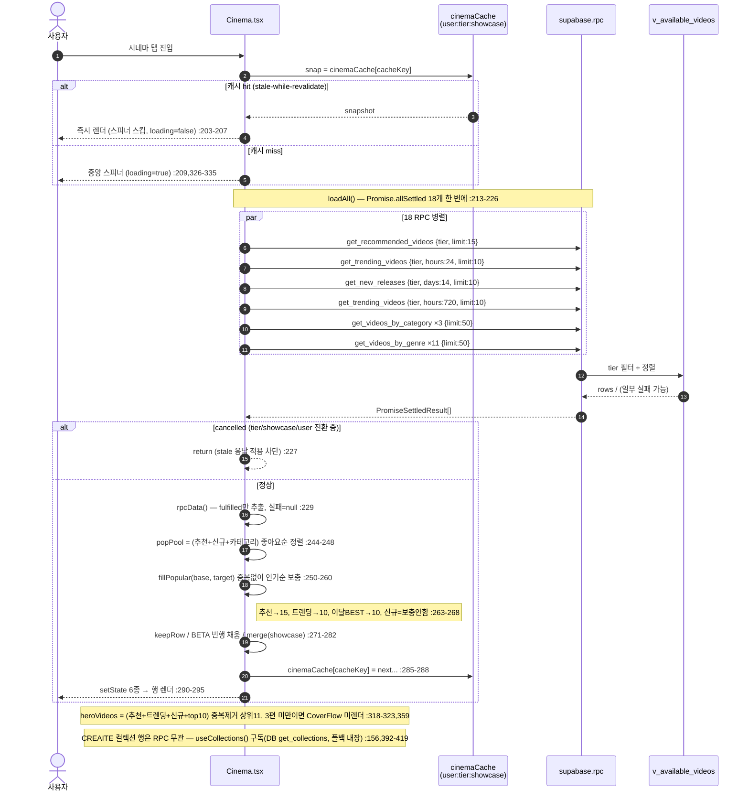
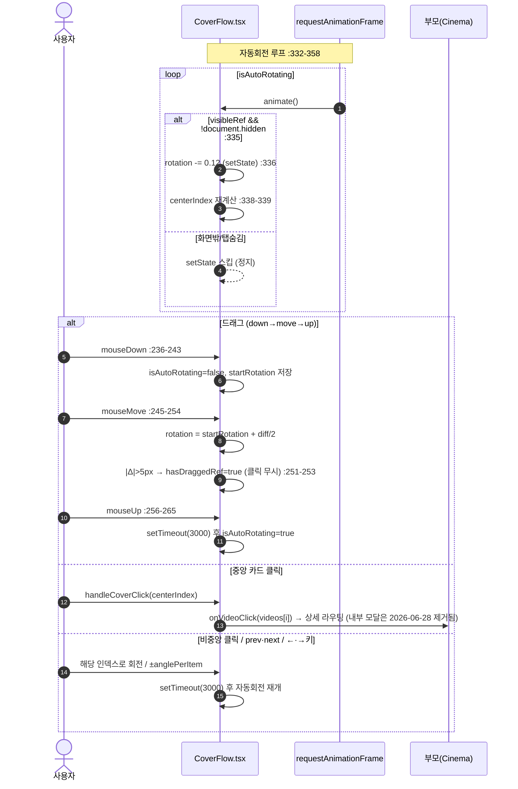
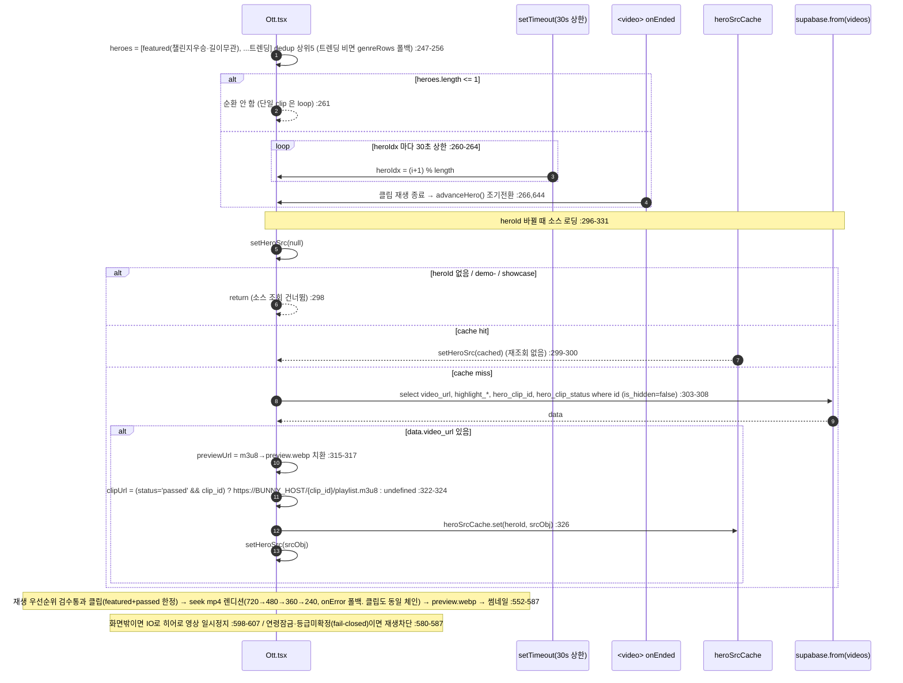
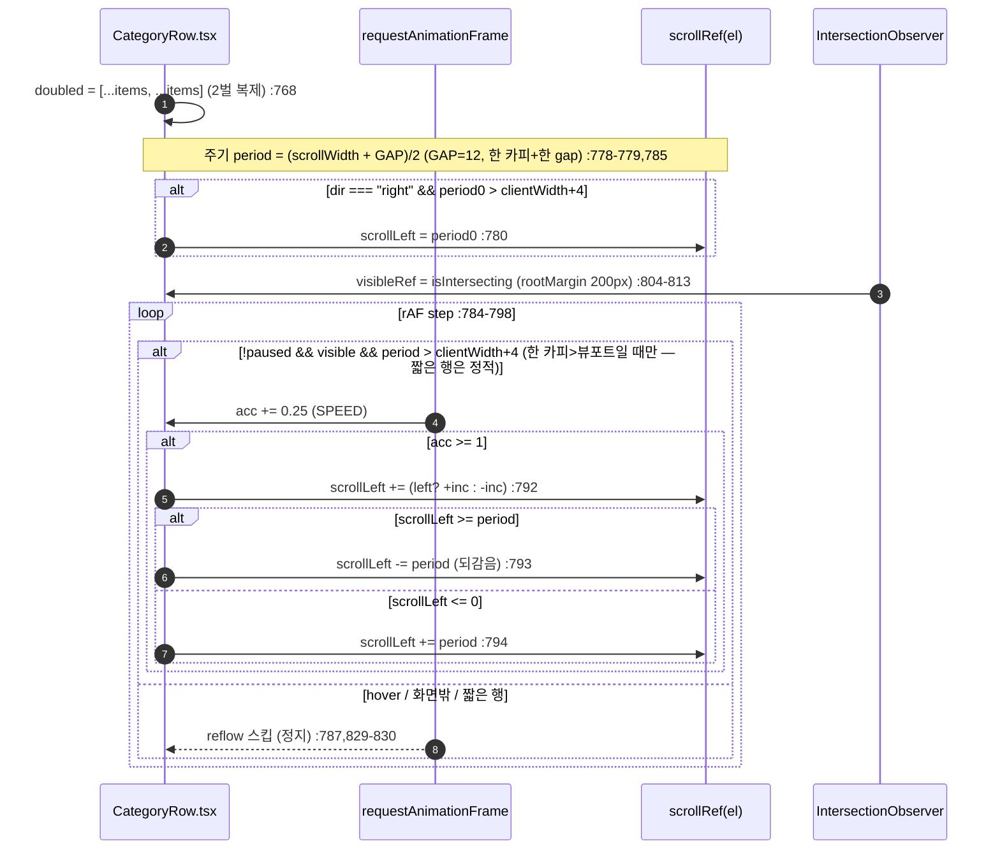

# 03. 시네마 · OTT — 상세 명세

> 본 문서는 실제 코드를 읽고 작성했다(추측 금지). 모든 동작·계약은 아래 file:line 근거를 단다.
>
> **📌 개정 2026-07-13 — 전수 감사 반영.** 인용 라인은 개정일 시점 근사치(표/함수명이 정본).
> **RPC 정본**: `supabase/cinema_rpc_hardening_20260708.sql`(**5개 RPC 전부 + `classify_video_placement`
> 트리거 재정의** — 트렌딩 시청자 dedup, 전 RPC `v.id` 2차 정렬키, 전부 SECURITY DEFINER+search_path).
> **뷰 정본**: `supabase/fix_series_feed_representative_20260712.sql`(`v_available_videos` = 공개·비숨김·
> **시리즈 대표작=첫 노출가능 에피소드** — 1화 숨김 시 시리즈 증발 버그 수정. 옛
> `series_feed_grouping_20260619.sql` 재실행 금지). 좋아요는 카드별 직접 insert →
> **전역 `useLikes().toggleLike`(LikesContext)** 로 전환됨(§4.6).
>
> **📌 개정 2026-07-08 — OTT 히어로 순환 갱신.** 이전 판은 "20초 setInterval" 이었으나 현행은
> **heroIdx 별 30초 상한 setTimeout + 클립종료(onEnded) 시 조기전환**(짧은 영상이 30초 창에서 반복되던
> 것 제거).
>
> 핵심 소스:
> - `src/app/components/Cinema.tsx` (시네마·OTT 공용 컴포넌트, `tier` prop 으로 분기)
> - `src/app/components/Ott.tsx` (OTT 전용 재설계 화면)
> - `src/app/components/VideoRowCarousel.tsx` (Netflix식 가로 행)
> - `src/app/components/CoverFlow.tsx` (원통형 캐러셀 시그니처 UI)
> - `src/app/components/TrendingHeroSection.tsx` (1~10위 순위 캐러셀)
> - `src/app/contexts/LikesContext.tsx` (전역 좋아요·카운트 스토어 — `useLikes()`)
> - `src/app/data/collections.ts` + `supabase/collections_admin_20260711.sql` (CREAITE 컬렉션·셀렉트 — DB화·AdminCollections 관리)
> - `supabase/cinema_rpc_hardening_20260708.sql` (**RPC 5종 + `classify_video_placement` 정본**)
> - `supabase/phase31_carousel_genre_likes.sql` / `supabase/genre_based_rows.sql` (RPC 최초 도입분 — 정의는 위 정본이 대체)
> - `supabase/content_policy_v2.sql` (길이 게이팅 트리거 최초 도입 — 트리거 본문 정본은 hardening 파일)
> - `src/app/utils/brandColors.ts` (장르 스타일), `src/app/data/genres.ts` (장르 SSOT)
> - `src/app/hooks/useAgeRatings.ts`, `src/app/hooks/useSeriesCounts.ts`

---

## 1. 개요 / 목적 (시네마 vs OTT 차이: 길이 게이팅·UI)

CREAITE 의 영상 소비 화면은 길이 기반 3단(홈/시네마/OTT) 중 **시네마**와 **OTT** 두 코너로 나뉜다. 분류는 업로드 시 DB 트리거가 자동 결정한다(`supabase/content_policy_v2.sql:38-87`).

| 구분 | 길이 게이팅(노출 임계값) | 컴포넌트 | UI 콘셉트 | 톤 |
|---|---|---|---|---|
| 시네마 | 60초(1분) 이상 → `show_on_cinema=true` (`content_policy_v2.sql:49,75`) | `Cinema.tsx` (`tier="cinema"`) | 가로 행 캐러셀 + CoverFlow 시그니처 + 트렌딩 히어로 | 라이트 배경(`bg-background`) |
| OTT | 600초(10분) 이상 → `show_on_ott=true` (`content_policy_v2.sql:50,78`) | `Ott.tsx` | 풀블리드 히어로 빌보드 + 시간대 무드 편성 + 좌우 교차 마퀴 행 | 블랙 배경(`bg-black`) |

- 두 코너 모두 노출 영상은 `v_available_videos` 뷰(공개+비숨김, 시리즈는 **첫 노출가능 에피소드**가 대표작)에서 온다(정본 `fix_series_feed_representative_20260712.sql` — 1화가 숨겨져도 다음 화가 대표작이 되어 시리즈가 피드에서 증발하지 않음).
- 시네마는 `Cinema.tsx` 한 컴포넌트가 `tier` prop 으로 cinema/ott 두 모드를 모두 그릴 수 있으나(`Cinema.tsx:107,153,192`), 실제 OTT 탭은 별도 재설계 화면 `Ott.tsx` 를 쓴다(시간대 편성·마퀴·풀블리드 히어로는 `Ott.tsx` 전용). `Cinema.tsx` 의 `tier="ott"` 경로는 시네마와 동일 레이아웃의 OTT 버전(타이틀/이모지만 👑로 바뀜, `Cinema.tsx:341`)이다.
- 목적: 길이가 길수록(=더 "작품"에 가까울수록) 더 몰입형 UI로 노출. 시네마는 탐색·발견(많은 행), OTT는 감상·편성(편성 무드 + 자동 흐름).

> 주의(불일치 메모): DB 트리거의 시네마 임계값은 **60초**(`content_policy_v2.sql:49`)이지만, showcase Mock 합성 필터는 시네마를 **180초**로 거른다(`src/app/utils/showcase.ts:46-48`). 또한 `VideoRowCarousel` 의 OTT 배지는 클라이언트 설정 `ottMinSeconds`(기본 600)로 판단한다(`VideoRowCarousel.tsx:309,382`). 실데이터 노출 게이팅은 DB(60/600초)가, 화면 배지/Mock 만 별 임계값을 쓴다.

---

## 2. 사용자 스토리

- (관람객) 시네마 탭에 들어가면 추천·트렌딩·신규·이달의 BEST·형식별·장르별 행이 한 화면에서 가로로 스크롤된다.
- (관람객) 시네마 상단의 원통형 CoverFlow 가 자동 회전하며, 가운데 카드를 클릭하면 상세로 간다.
- (로그인 사용자) 좋아요/시청 이력이 쌓이면 "당신을 위한 추천" 행이 내 취향(**카테고리+장르 가중치+likes×0.1**) 순으로 바뀐다(`cinema_rpc_hardening_20260708.sql:160-252`).
- (관람객) OTT 탭에 들어가면 트렌딩 상위 작품이 풀블리드로 자동재생(음소거)되고, 클립이 끝나면 즉시 다음 작품으로·아니면 최대 30초 후 순환한다(2026-07-08, `Ott.tsx:238-247`).
- (관람객) OTT는 **지금 접속한 시각**에 맞춰 장르 행 순서가 바뀐다(새벽=호러/스릴러 우선 등, `Ott.tsx:119-139`).
- (관람객) OTT 장르 행은 손대지 않아도 좌/우로 천천히 자동 흐르고, 마우스를 올리면 멈춘다(`Ott.tsx:599-624,652-653`).
- (미성년/미인증) 19+ 작품은 썸네일이 블러 처리되고 잠금 아이콘이 뜬다(`AgeBadge.tsx:48-50`, `Ott.tsx:182-186`).
- (사용자) 어느 행이든 카드에 마우스를 올리면 재생·장바구니·좋아요 버튼이 뜨고, 좋아요를 누르면 전역 스토어(`useLikes().toggleLike`)로 토글돼 같은 세션의 모든 피드에 즉시 반영된다(`VideoRowCarousel.tsx:106,115-123`, `LikesContext.tsx:111-166`).
- (베타) 영상이 부족한 행/빈 장르도 "영상 등록하기" 베타 카드로 8칸까지 채워져 노출된다(`config/beta.ts:11-14`).

---

## 3. 화면 & 상태

### 3.1 시네마 화면 구성 (`Cinema.tsx:337-527`)
위→아래 순서:
1. 헤더(이모지 🎬/👑 + 타이틀/부제, sticky) — `Cinema.tsx:340-349`. 시네마 부제 문구는 2026-07-13 "단편부터 장편까지 · 미리보기 1분 무료"로 수정됨(`ko.json` `cinema.heroSubtitleCinema`).
2. 이벤트 배너 보드(활성 이벤트 있을 때만) — `Cinema.tsx:351-354`
3. **CoverFlow** 원통형 캐러셀(**heroVideos 3편 이상일 때만** — 3D 실린더는 3개 미만이면 자동회전 시 backface-visibility 로 카드가 사라져 보임) — `Cinema.tsx:356-377`
4. 추천(For You) `VideoRowCarousel` — `Cinema.tsx:379-390`
5. **🎞️ CREAITE 컬렉션** 행(에디터 셀렉션 카드 → `?info=collections` 컬렉션 페이지) — `Cinema.tsx:392-419`. 데이터는 `useCollections()`(`data/collections.ts` — DB `collections`/`collection_videos` 로드, 폴백 하드코딩). DB화·관리자 편집: `collections_admin_20260711.sql` + 관리자 페이지 AdminCollections(운영→컬렉션·셀렉트).
6. 인기(24h) `TrendingHeroSection` — `Cinema.tsx:421-430`
7. 새로 추가됨 `VideoRowCarousel` — `Cinema.tsx:432-440`
8. 이달의 BEST(30일) `VideoRowCarousel` — `Cinema.tsx:442-451`
9. 형식 카테고리(top=애니메이션) — `Cinema.tsx:453-464`
10. 장르별(기타 제외) — `Cinema.tsx:466-477`
11. 형식 카테고리(bottom=다큐·뮤직비디오) — `Cinema.tsx:479-490`
12. 기타 장르(맨 끝) — `Cinema.tsx:492-503`
13. 이번 주 TOP 크리에이터 — `Cinema.tsx:505-510`
14. (전부 비었을 때) 빈 상태 — `Cinema.tsx:512-523`
15. Footer — `Cinema.tsx:525`

### 3.2 OTT 화면 구성 (`Ott.tsx:434-517`)
1. **풀블리드 단일 히어로 빌보드**(`heroes.length>0`) — `Ott.tsx:441-458`, `HeroBillboard` (`Ott.tsx:525-721`)
   - 하단 정보: "CREAITE 오리지널" 배지 + 작품 제목(대형) + **크리에이터명** + **[▶ 지금 보기] [ⓘ 작품 정보]** 버튼 2개(`Ott.tsx:695-711`). 인디케이터 도트·"+ 내 목록" 버튼·"장르·길이·가격" 줄은 **없음**(과거 판 서술 오류 정정).
2. **🏆 CREAITE 셀렉트** 행(공식 선정작 — `selectVideos.length>0` 일 때, 히어로 바로 아래) — `Ott.tsx:460-473`. `useCollections().getCollection(CREAITE_SELECT_SLUG)` 의 videoIds 로 `videos` 직접 조회(공개·비숨김 필터, 큐레이션 순서 보존)(`Ott.tsx:183-200`). 소스는 시네마 컬렉션과 동일한 DB(collections_admin_20260711.sql, AdminCollections).
3. 시간대 무드 편성 헤더(이모지+밴드명+태그라인) — `Ott.tsx:476-486`
4. **카테고리 마퀴 행**(좌우 교차) — `Ott.tsx:488-513`, `CategoryRow` (`Ott.tsx:727-976`)
   - 순서: 형식(top) → 장르(기타 제외, 시간대 정렬) → 형식(bottom) → 기타 (`Ott.tsx:491-495`)
5. Footer — `Ott.tsx:515`

### 3.3 상태(로딩/빈/부분실패)

**로딩**
- 시네마: 모듈 캐시에 스냅샷 없으면 `loading=true`(`Cinema.tsx:164`) → 중앙 스피너 + Footer (`Cinema.tsx:326-335`). 캐시 hit 시 첫 렌더부터 데이터 표시(스피너 스킵).
- OTT: 동일 패턴(`Ott.tsx:170`) → 스피너 색만 `#a78bfa`(`Ott.tsx:414-423`).

**빈 상태**
- 시네마: **추천·트렌딩·신규·top10·formatRows·categoryRows 6개 전부 0일 때만** Film 아이콘 + 안내문(`Cinema.tsx:512-523` — top10/형식/장르를 빼면 그 행들엔 영상이 있는데도 "콘텐츠 없음"이 아래 떠버리는 버그가 있어 6개 전부로 교정됨). 개별 행은 `emptyMessage`(`VideoRowCarousel.tsx`)·`TrendingHeroSection` 에서 처리.
- OTT: `heroes.length===0 && genreRows.length===0` 이면 "영상 없음" 단일 메시지(`Ott.tsx:425-432`). 행이 일부라도 있으면 행만 그린다. 마퀴 영역 전부 비면 `ott.noGenreContent`(`Ott.tsx:510-512`).

**부분 실패**
- 시네마: `Promise.allSettled` 로 RPC 하나가 실패해도 나머지로 채움(실패분=빈 데이터)(`Cinema.tsx:213-236`).
- OTT: 각 RPC 를 `.catch(()=>null)` 로 안전 래핑 후 `Promise.all`(`Ott.tsx:352-369`).
- 둘 다 캐시 표시 중(snap 존재)일 때의 백그라운드 갱신 실패는 토스트 없이 조용히 무시(`Cinema.tsx:298-299`, `Ott.tsx:404-405`).

---

## 4. 동작 흐름

### 4.1 행 구성(시네마 데이터 로드)
`Cinema.tsx:211-306` `loadAll()`:
1. `Promise.allSettled` 로 한 번에 호출: 추천 1 + 트렌딩(24h) 1 + 신규(14d) 1 + 트렌딩(720h=30일) 1 + 형식 카테고리 3(애니/다큐/뮤비) + 장르 11 (`Cinema.tsx:213-226`).
2. `rpcData()` 로 fulfilled 만 추출(`Cinema.tsx:229`).
3. `popPool` = 추천+신규+전체 카테고리 영상을 좋아요순 정렬(`Cinema.tsx:244-248`).
4. `fillPopular(base, target)` 로 각 행을 인기순 영상으로 중복 없이 채움(`Cinema.tsx:250-260`).
5. 행별 머지·필터 후 모듈 캐시에 기록 + setState (`Cinema.tsx:263-295`).
- (별도) CREAITE 컬렉션 행은 RPC 아닌 `useCollections()` 구독 — 앱 시작 시 `loadCollections()` 1회 로드(DB `get_collections`, 실패 시 하드코딩 폴백)(`data/collections.ts:151-172,187-194`).

### 4.2 CoverFlow 회전/드래그 (`CoverFlow.tsx`)
- `heroVideos` = 추천+트렌딩+신규+top10 중복제거 상위 11편(`Cinema.tsx:318-323`) → `toCoverFlowVideo` 매핑(`Cinema.tsx:66-81,324`). **3편 미만이면 CoverFlow 자체를 렌더하지 않음**(backface 문제, `Cinema.tsx:359`).
- `anglePerItem = 360/videos.length`(`CoverFlow.tsx:55`), 각 아이템 `translate3d + rotateY`(`CoverFlow.tsx:319-330`).
- **자동회전**: `requestAnimationFrame` 으로 매 프레임 `rotation -= 0.12`(`CoverFlow.tsx:332-358`). 화면 밖/탭숨김이면 setState 스킵(`CoverFlow.tsx:335`).
- **드래그**: 마우스/터치 `down→move→up` 으로 `rotation = startRotation + diff/2`(`CoverFlow.tsx:236-292`). 5px 이상 이동하면 `hasDraggedRef=true` 로 클릭 무시(`CoverFlow.tsx:206-209,251-253`).
- **조작 후 3초 뒤 자동회전 재개**: prev/next/클릭/드래그 종료 모두 `setTimeout(...,3000)`(`CoverFlow.tsx:185-187,197-199,231-233,262-264,289-291`).
- **클릭**: 가운데 아이템 클릭 시 `onVideoClick` 우선 호출(부모 라우팅)(`CoverFlow.tsx:211-221,457-465`). 비중앙 클릭은 해당 인덱스로 회전(`CoverFlow.tsx:223-234`).
- 키보드 ←/→ 로 prev/next(`CoverFlow.tsx:294-305`).
- 화살표는 hover 가능 디바이스에서만 노출(`CoverFlow.tsx:66-72,407`).

### 4.3 히어로 순환 (OTT, `Ott.tsx:244-331`) — 2026-07-08: 20초 setInterval → 30초 상한 + 클립종료 조기전환
- `heroes` = (피처링=챌린지 우승작 + 트렌딩) dedup 상위 5편(트렌딩 비면 장르 행 영상 폴백)(`Ott.tsx:247-256`). **피처링(`featured_hero_until` 미래)은 tier/길이 게이트를 거치지 않는다** — 챌린지 우승작은 길이 무관하게 히어로에 노출된다(예: 10분 미만도 가능하며, 이 경우 히어로엔 뜨지만 show_on_ott 장르/형식 행에는 안 나올 수 있다). featured 로드 쿼리는 `visibility=public·status=ready·is_hidden=false` 만 필터(`Ott.tsx:268-294`).
- **순환 규칙(현행)**: `heroIdx` 별 `setTimeout(...,30000)`(30초 상한), heroIdx 변경마다 타이머 리셋(`Ott.tsx:260-264`). 클립 영상은 `onEnded`(=`advanceHero`)로 재생이 끝나면 30초 전 조기 전환(같은 장면 반복 제거). 1편 이하면 순환/전환 없음(단일 히어로 clip은 loop).
  - (구 20초 setInterval + 10초 구간 되감기 제거 — 짧은 영상이 30초 창에서 반복되던 것 단순화.)
- 히어로 영상 소스는 RPC에 없어 `videos` 테이블에서 별도 조회 — **`video_url`·`highlight_*`·`hero_clip_id`·`hero_clip_status`** 를 읽는다(`Ott.tsx:296-331`). **클립은 검수 게이트를 거친다**: `hero_clip_status='passed'` 이고 `hero_clip_id` 가 있을 때만 `https://${BUNNY_HOST}/${hero_clip_id}/playlist.m3u8` 로 clipUrl 을 조립(pending/rejected/none 이면 undefined → 본편 파생 폴백)(`Ott.tsx:322-324`). `heroSrcCache`(heroId→src)로 회전마다 재조회 방지(`Ott.tsx:154,299-300`).
- 재생 우선순위: 검수 통과 클립(=**featured 히어로 한정**, `allowClip` — admin 지정 히어로에서만 클립 재생 허용)이 있으면 자동재생(끝나면 다음), 없으면 하이라이트 시작점으로 seek 한 mp4 렌디션을 **720→480→360→240 폴백 체인**으로 재생(onError 시 다음 렌디션 — Bunny 가 소스에 따라 720p 를 안 만드는 영상의 404 대응. 클립도 동일 렌디션 체인으로 재생), 둘 다 없으면 Bunny `preview.webp` 애니메이션, 그것도 없으면 썸네일 포스터(`Ott.tsx:552-587,632-668`). seek 지점은 `HERO_MAX_SEEK_SEC=90` 로 상한 clamp(딥 seek 저화질 고착 방지, `Ott.tsx:159,645-651`).
- 화면 밖이면 IntersectionObserver 로 히어로 영상 일시정지(`Ott.tsx:598-607`).

### 4.4 마퀴 자동 흐름 (OTT, `Ott.tsx:775-801`)
- 행마다 dir(left/right) 교차(`Ott.tsx:501`). 주기(한 카피+한 gap) = **`period = (scrollWidth + GAP)/2`**(GAP=12, gap-3)(`Ott.tsx:778-779,785`). `scrollWidth/2` 기준이던 옛 구현은 매 바퀴 gap/2 씩 덜 감아 튀던 잠재버그 → period 기준으로 교정.
- `dir==="right"` 면 시작 위치를 `period0` 로 세팅(`Ott.tsx:780`).
- **한 카피가 뷰포트보다 넓을 때만 흐름** — `period > clientWidth+4` 조건. 짧은 행은 정적(스크롤 불가한 행을 억지로 감다 얼거나 튀는 것 방지. BETA 8칸 패딩으로 가려졌던 잠재버그)(`Ott.tsx:786-787`).
- rAF 루프로 `SPEED=0.25px/frame` 누적, 1px 이상 모이면 `scrollLeft` 가감(`Ott.tsx:783-792`).
- 항목 2벌 복제(`doubled`)로 무한 루프, `period` 지점에서 되감음(`Ott.tsx:768,793-794`).
- hover 시 `pausedRef=true` 로 일시정지(`Ott.tsx:829-830,787`). 화면 밖이면 `visibleRef=false` 로 reflow 스킵(`Ott.tsx:804-813,787`).
- 데스크탑 좌우 화살표로 추가 스크롤(`Ott.tsx:819-824,936-949`).

### 4.5 연령 게이트
- `useAgeRatings` 로 id→등급 맵 조회 후, `shouldBlur(rating, ageVerified)` = `rating==="19" && !ageVerified`(`AgeBadge.tsx:48-50`).
- **fail-closed**: `useAgeRatings` 는 RPC 실패 시 캐시하지 않고(일시 오류로 19금이 'all'=무블러로 고착 방지) 1.5초×n 백오프로 **최대 3회 재시도**(`useAgeRatings.ts:47-55`). 히어로도 등급 미확정(`ratingKnown=false`)이면 재생/미리보기를 보류하고 포스터만 노출(`Ott.tsx:580-587`).
- 본인 영상은 게이트 면제(`isMyVideo`)(`Ott.tsx:216-220`, `VideoRowCarousel.tsx`).
- 잠금 시 썸네일 `blur-xl/blur-2xl scale` + 잠금 오버레이(`VideoRowCarousel.tsx:159-166`, `Ott.tsx:613-618,867-873`). 히어로는 영상 재생 자체를 막음(`Ott.tsx:584-585` `useVideo = !g.isAgeLocked && ratingKnown && ...`).

### 4.6 좋아요 — 전역 스토어(`useLikes()`, 2026-07-03 전환)
- 카드 hover 버튼(`VideoRowCarousel.tsx:115-123`, `TrendingHeroSection.tsx:44-52`)은 직접 insert 하지 않고 **전역 `useLikes().toggleLike`(LikesContext)** 를 호출 — 낙관적 토글(하트+카운트 ±1)·롤백·전 피드 동시 반영은 스토어가 처리(`LikesContext.tsx:111-166`).
- **23505 의미**: "타 기기(또는 다른 세션)에서 이미 좋아요" → 서버 카운트에 이미 반영돼 있으므로 **낙관적 +1 만 취소하고 하트는 유지**(delete 토글 아님)(`LikesContext.tsx:144-147`).
- **in-flight 가드는 LikesContext 로 이동**: 영상별 `inFlight` Set 으로 더블클릭 경합 차단, 중복 호출은 `"busy"` 반환(실패 아님 — 토스트 금지)(`LikesContext.tsx:58,113`). 비로그인은 `"needAuth"` 반환 → 호출부가 안내 토스트(`VideoRowCarousel.tsx:119`).
- 카운트 표시는 `seedCount`(seed-once)+`displayCount` 로 모든 피드가 같은 값 공유(`LikesContext.tsx:94-104`, `VideoRowCarousel.tsx:109-112`, `Ott.tsx:749-753`).

---

## 5. 데이터/RPC 계약

**RPC 5종의 정본은 `cinema_rpc_hardening_20260708.sql`** (phase31/genre_based_rows 는 최초 도입분 — 정의는 정본이 CREATE OR REPLACE 로 대체). 모든 RPC는 `v_available_videos`(공개·비숨김·시리즈 대표작, 정본 `fix_series_feed_representative_20260712.sql`)를 소스로 하고 동일한 컬럼 셋(+행별 추가 컬럼)을 반환한다. 공통 컬럼: `id text, title, thumbnail, video_url, creator, creator_id uuid, creator_display_name, creator_avatar, category, genre, ai_tool, duration, duration_seconds int, views bigint, likes int, price_standard int, highlight_start real, highlight_end real, created_at`.

### 5.1 tier 필터 (모든 RPC 공통)
```sql
(p_tier='all' OR (p_tier='cinema' AND v.show_on_cinema=true) OR (p_tier='ott' AND v.show_on_ott=true))
```
(`cinema_rpc_hardening_20260708.sql:53-56,95-97,131-133,152,195-197,246-248`)

### 5.2 RPC별 계약 (정본 `cinema_rpc_hardening_20260708.sql`)

| RPC | 인자 | 추가 반환 | 정렬 | file:line |
|---|---|---|---|---|
| `get_recommended_videos` | `p_tier='all', p_limit=20` | `score numeric` | 이력無: `score DESC, created_at DESC, v.id` / 이력有: **카테고리+장르 가중치+likes×0.1** 점수 DESC, 2차키 `v.id` | `hardening:160-252` |
| `get_trending_videos` | `p_tier='all', p_hours=24, p_limit=10` | `recent_views bigint` | `recent_views DESC, created_at DESC, v.id` (`HAVING count>0`) — **recent_views = 시청자 dedup `COUNT(DISTINCT COALESCE(viewer_user_id, ip_address, 행id))`** (장기 윈도우에서 같은 시청자 중복 카운트 부풀림 수정) | `hardening:21-64` |
| `get_new_releases` | `p_tier='all', p_days=14, p_limit=10` | (없음) | `created_at DESC, v.id` (최근 N일) | `hardening:67-100` |
| `get_videos_by_category` | `p_category, p_tier='all', p_limit=10` | (없음) | `created_at DESC, v.id` | `hardening:103-136` |
| `get_videos_by_genre` | `p_genre, p_tier='all', p_limit=10` | (없음) | `created_at DESC, v.id` | `hardening:139-156` |

> **전 RPC 공통 하드닝**: ① 정렬 2차키 `v.id` 추가 — `created_at DESC` 단일 정렬이라 동시각 대량적재분(180+편)이 방문마다 뒤섞이던 것 → 결정적 순서 고정. ② 5개 전부 `SECURITY DEFINER STABLE` + `SET search_path = public, pg_temp` 명시.

추천 RPC 상세:
- `auth.uid()` 로 사용자 판별(`hardening:169`). 이력(좋아요/유효 조회)이 없거나 비로그인이면 인기(likes×1)+24h 조회×2 가중 점수로 폴백(`hardening:179-201`).
- 이력 있으면 좋아요(가중 2)·조회(가중 1)로 **카테고리 점수 + 장르 점수**를 각각 산출해 합산하고 `likes×0.1` 을 더한 score 순(`hardening:204-249`), **이미 본 영상 제외**·**본인 영상 제외**(`hardening:228-245`).
- 추천만 plpgsql, 나머지는 `LANGUAGE sql`(전부 `SECURITY DEFINER STABLE`+search_path).

### 5.3 호출부 인자 (클라이언트가 실제로 넘기는 값)

시네마(`Cinema.tsx:213-226`):
- 추천 `{p_tier:tier, p_limit:15}`
- 트렌딩 `{p_tier:tier, p_hours:24, p_limit:10}`
- 신규 `{p_tier:tier, p_days:14, p_limit:10}`
- 이달의 BEST = 트렌딩 `{p_tier:tier, p_hours:720, p_limit:10}` (30일)
- 형식 카테고리 `{p_category, p_tier:tier, p_limit:50}` × 3
- 장르 `{p_genre, p_tier:tier, p_limit:50}` × 11

OTT(`Ott.tsx:356-369`):
- 트렌딩 히어로 `{p_tier:"ott", p_hours:168, p_limit:10}` (7일)
- 형식 카테고리 `{p_category, p_tier:"ott", p_limit:50}` × 3
- 장르 `{p_genre, p_tier:"ott", p_limit:50}` × 11
- (RPC 아님) CREAITE 셀렉트: `videos` 테이블 직접 `.in(id, videoIds)` + 공개·비숨김 필터(`Ott.tsx:191-197`).

### 5.4 CarouselVideo 매핑
- `CarouselVideo` 타입 정의: `VideoRowCarousel.tsx:29-51` (RPC 반환 컬럼과 1:1, snake_case).
- `CarouselVideo → Product`(상세로 넘김): `toProduct()` (`Cinema.tsx:120-140`, `Ott.tsx:81-101`). **`videoUrl:""` 로 비워 ProductDetail 이 자체 재조회**(`Cinema.tsx:133`).
- `CarouselVideo → CoverFlow Video`: `toCoverFlowVideo()` (`Cinema.tsx:66-82`), `highlight_end` 없으면 `start+30`(`Cinema.tsx:80`).
- showcase Mock → CarouselVideo: `showcaseToCarousel()` (`Cinema.tsx:36-55`, `Ott.tsx:60-79`).
- 시리즈/연령 일괄 조회용 id 수집: `allVideoIds`(데모 id 제외. OTT 는 selectVideos·featured 포함 — featured 누락 시 19+ 피처링 히어로가 무블러였던 구멍 수정분) (`Cinema.tsx:181-190`, `Ott.tsx:202-212`).

---

## 6. 비즈니스 규칙

### 6.1 length 게이팅 (DB 트리거)
- `classify_video_placement()` 가 INSERT/UPDATE 시 `duration_seconds` 파싱 후 플래그 세팅(**정본 `cinema_rpc_hardening_20260708.sql:256-304`** — 최초 도입 `content_policy_v2.sql:38-87`):
  - `show_on_home := true` (전부)
  - `show_on_cinema := parsed >= cinema_min`(기본 **60초** — 시네마 게이트는 60초가 맞음)
  - `show_on_ott := parsed >= ott_min`(기본 600초)
- 정본 재정의분: **UPDATE 로 `duration` 텍스트가 바뀌면 재파싱** — 기존엔 `duration_seconds` 가 이미 있으면 파싱을 건너뛰어 텍스트만 재편집 시 옛 초로 tier 가 고착되던 것 수정(`hardening:269-290`).
- 임계값은 `platform_settings` 에서 동적 조회(어드민 조절)(`hardening:266-267`).
- 광고: 60초 미만 본편 광고 X, 60초+ pre-roll/overlay, 600초+ mid-roll(`content_policy_v2.sql:103-182`).

### 6.2 시간대 무드 편성 (OTT 전용)
- 5개 밴드(`Ott.tsx:123-129`), 접속 시각으로 선택(`currentBand()` `Ott.tsx:130-137`):
  - 새벽 02–05 🌌 호러/스릴러/SF/판타지
  - 아침 05–11 🌅 다큐/드라마/애니/음악
  - 낮 11–17 ☀️ 코미디/액션/애니/SF
  - 저녁 17–21 🌆 드라마/로맨스/코미디/판타지
  - 밤 21–02 🌙 스릴러/로맨스/SF/드라마/호러
- 장르 행 정렬: `bandRank()` 로 `order` 우선, "기타"(default)는 항상 맨 뒤(999), 나머지 알려진 장르=100(`Ott.tsx:138-143,237-242`). **2026-06-28 nature·abstract 도 밴드 `order` 에 편입**(nature=아침/낮/저녁, abstract=새벽/밤) → 11개 장르 전부 최소 한 시간대에서 우선 노출.
- 강조(`highlighted` — 따뜻한 시그니처 그라데이션 라벨): **형식 행(`isFormat`)은 항상 강조 + 장르 행은 지금 시간대 우선 장르일 때 강조**(`highlighted={row.isFormat || band.order.includes(...)}`, `Ott.tsx:502,963-969`).

### 6.3 장르 11종 + 형식 3종
- 장르 SSOT: `["SF","액션","로맨스","공포","판타지","스릴러","드라마","코미디","자연·풍경","추상","기타"]`(`data/genres.ts:8-10`). 업로드 폼·시네마·OTT 행 모두 동일 목록·순서.
- 장르 이모지: `GENRE_EMOJI`(`data/genres.ts:13-26`), 시네마 행 제목에 `genreEmoji(category)`(`Cinema.tsx:470,496`).
- 장르 스타일(OTT 라벨 아이콘·그라데이션): `getGenreStyle()` — 한글→키 매핑 후 `GENRE_STYLES` 조회, 미스 시 `DEFAULT_GENRE_STYLE`(`brandColors.ts:44-188`). 자연·풍경/추상은 2026-06-25 누락 버그 수정으로 추가됨(`brandColors.ts:133-149`).
- 형식 카테고리(장르 아님, `category` 기준): 애니메이션(top)·다큐멘터리(bottom)·뮤직비디오(bottom)(`Cinema.tsx:60-64`, `Ott.tsx:111-115`). 영화·드라마·기타는 장르와 겹쳐 제외(`Cinema.tsx:57-59`).

### 6.4 fillPopular 채움 (시네마 전용)
- `popPool` = 추천+신규+카테고리 전체를 좋아요순 정렬(`Cinema.tsx:244-248`).
- 추천(15)·트렌딩(10)·이달의 BEST(10)는 실제 데이터 뒤에 인기순으로 target까지 채움(중복 제거)(`Cinema.tsx:250-268`). 신규 행은 채우지 않음(`Cinema.tsx:266`).
- 베타라 조회/추천 데이터가 적은 행이 비어 보이지 않게 하는 폴백.

### 6.5 시리즈 배지
- `useSeriesCounts` 로 id→회차수, **>1 일 때만** "시리즈 · N화" 배지(`VideoRowCarousel.tsx`, `Ott.tsx:860-865`).
- 연령 잠금 영상엔 배지 미표시(`!isAgeLocked`, `Ott.tsx:860`).

### 6.6 베타 모드 채움
- `BETA_MODE=true`(`config/beta.ts:11`), `BETA_ROW_TARGET=8`(`config/beta.ts:14`).
- `onUpload` 콜백이 넘어오면 부족분을 `BetaCard` 로 8칸까지 채우고 빈 행/빈 장르도 노출(`Cinema.tsx:271-282`, `Ott.tsx:376-395,759-768`, `VideoRowCarousel.tsx`).
- 실제 영상이 8개 이상이면 베타 카드 0장(자동 졸업)(`config/beta.ts:13`).

### 6.7 가격/배지 표시
- 가격: 0 이하면 "라이선스 미판매", `isNegotiationOnly` 면 "별도 협의", 아니면 ₩가격(`VideoRowCarousel.tsx`, `Ott.tsx:898-904`).
- OTT 배지: `is_ott` 이거나 `duration_seconds >= ottMinSeconds`(기본 600)(`VideoRowCarousel.tsx`).

---

## 7. 엣지 케이스 & 에러 처리

- **부분 RPC 실패**: 시네마 `allSettled`(`Cinema.tsx:213-229`), OTT `.catch(()=>null)`(`Ott.tsx:352-354`) → 실패 행만 비고 나머지 정상.
- **빈 행**: BETA OFF면 `keepRow(len)= len>0` 으로 빈 행 숨김, BETA ON이면 전부 노출(`Cinema.tsx:271,277,282`, `Ott.tsx:377,383,395`). 행 컴포넌트도 빈 배열이면 null/emptyMessage(`VideoRowCarousel.tsx`, `Ott.tsx:816`, `TrendingHeroSection.tsx`).
- **중복 제거**: heroVideos 의 `seen` Set(`Cinema.tsx:319-322`); fillPopular 의 `seen`(`Cinema.tsx:251-257`).
- **히어로 폴백(OTT)**: 트렌딩 비면 장르 행 영상으로 폴백(`Ott.tsx:247-249`); `video_url` 없으면 preview.webp → 썸네일 순(`Ott.tsx:586-587,620-628`); demo/showcase id 는 소스 조회 건너뜀(`Ott.tsx:298`); preview 로드 실패 시 숨겨 썸네일 노출(`Ott.tsx:627`).
- **장르 매핑 미스**: `getGenreStyle` 미스 시 `DEFAULT_GENRE_STYLE`(기타, 맨 뒤)(`brandColors.ts:187`). 키 매핑은 한글·영문·AI접두 모두 커버(`brandColors.ts:163-182`).
- **stale 응답**: tier/showcase/user 전환 중 응답은 `cancelled` 가드로 적용 차단(`Cinema.tsx:227,305`, `Ott.tsx:374,411`).
- **좋아요 경합**: in-flight 가드는 **LikesContext 로 이동** — 영상별 `inFlight` Set, 중복 호출=`"busy"`(무시, 실패 토스트 금지)(`LikesContext.tsx:58,113`); **23505=타 기기에서 이미 좋아요 → 낙관 +1 취소, 하트 유지**(`LikesContext.tsx:144-147`); 그 외 실패는 하트·카운트 정확 롤백(`LikesContext.tsx:131-138,154-162`).
- **CoverFlow 빈 배열/소수**: 3편 미만이면 부모가 렌더 안 함(`Cinema.tsx:359`); 내부에도 `isEmpty` 시 null / 회전 계산 0 분모 방지(`CoverFlow.tsx`).
- **연령 맵 미존재 id**: 성공 응답에 없는 id 만 `"all"`/`0` 으로 캐시해 재요청 방지(`useAgeRatings.ts:43-44`, `useSeriesCounts.ts:32`).
- **연령 RPC 실패(fail-closed)**: 실패 시엔 캐시하지 않음 — 일시 오류로 19금이 `"all"`(무블러)로 고착되는 청소년보호 구멍 방지. 대신 **1.5초×n 백오프로 최대 3회 재시도**해 세션 내 실제 등급 확보(`useAgeRatings.ts:47-55`). 등급 미확정 동안 OTT 히어로는 재생 보류(`Ott.tsx:580-585`).

---

## 8. 성능

- **병렬**: 시네마 `Promise.allSettled` 한 번에 18개 RPC(`Cinema.tsx:213-226`); OTT `Promise.all` 1왕복(3단 워터폴 제거)(`Ott.tsx:356-369`).
- **모듈 캐시(stale-while-revalidate)**: `cinemaCache`(키=`user:tier:showcase`)(`Cinema.tsx:152,161,202-207,285`), `ottCache`(키=`showcase`)(`Ott.tsx:151,169,341-348,398`). 재방문 시 스피너 없이 직전 데이터 즉시 표시 후 백그라운드 갱신. 추천 누수 방지 위해 캐시 키에 user id 포함(`Cinema.tsx:159-161`).
- **memo**: `VideoCard`(`VideoRowCarousel.tsx:103`), `CategoryRow`·`HeroBillboard`(`Ott.tsx:525,727`). 핸들러 `useCallback`/`useMemo` 안정화로 카드 리렌더 폭풍 방지(`Cinema.tsx:309-315`, `Ott.tsx:223-233`).
- **화면 밖 회전/마퀴 정지**: CoverFlow IntersectionObserver→`visibleRef`(`CoverFlow.tsx`); OTT 마퀴 `visibleRef`(`Ott.tsx:804-813,787`); 히어로 영상 IO 일시정지(`Ott.tsx:598-607`); CoverFlow 는 `document.hidden` 도 검사.
- **히어로 RPC 캐시(OTT)**: `heroSrcCache`(heroId→src)로 30초(상한) 회전마다 같은 영상 `video_url` 재조회 방지(`Ott.tsx:154,299-300,326`).
- **연령/시리즈 일괄 조회 캐시**: module-level 캐시 single source, 캐시 miss id 만 RPC, useMemo 안정화(`useAgeRatings.ts:15,28-67`, `useSeriesCounts.ts:10,16-49`).
- **이미지 lazy**: 카드 썸네일 `loading="lazy"`(`VideoRowCarousel.tsx:149`, `Ott.tsx:854`).
- **마퀴 부동소수 누적**: `scrollLeft` 정수 반올림 대응으로 SPEED 누적 1px 단위 적용(`Ott.tsx:783-794`).

---

## 9. 권한/보안

- 노출 영상은 `v_available_videos`(공개+비숨김·시리즈 대표작)만(정본 `fix_series_feed_representative_20260712.sql`).
- 추천 개인화는 `auth.uid()` 기반. **RPC 5종 전부 `SECURITY DEFINER` + `SET search_path = public, pg_temp`**(`cinema_rpc_hardening_20260708.sql`). 비로그인은 비개인화 폴백.
- `get_videos_by_genre` 는 `anon, authenticated` 에 EXECUTE 부여(`hardening:156` — GRANT 유지).
- 연령 게이트: 19+ 는 미인증 사용자에 블러+잠금(`AgeBadge.tsx:48-50`), 본인 영상은 면제(`Ott.tsx:216-220`, `VideoRowCarousel.tsx`). 등급 조회 실패는 fail-closed + 3회 백오프 재시도(`useAgeRatings.ts:47-55`).
- 좋아요는 로그인 필요(`LikesContext.tsx:112` `needAuth`), `video_likes` insert/delete 는 LikesContext 가 수행(RLS 의존)(`LikesContext.tsx:140-152`).
- 히어로 클립은 검수 통과(`hero_clip_status='passed'`)분만 + admin featured 히어로에서만 재생(미검수 사용자 업로드 클립 게이트)(`Ott.tsx:322-324,448-450`).
- showcase Mock 은 관리자에게 미표시(`utils/showcase.ts:19-23`), Mock 클릭은 차단·안내(`utils/showcase.ts:68-74`).

---

## 10. 분석/이벤트

> 현 코드에 시네마/OTT 화면 전용 analytics 이벤트 송신 호출은 없음(추측 금지 — `Cinema.tsx`/`Ott.tsx` 내 트래킹 코드 부재). 사용자 행동 신호는 아래 DB 적재 데이터에 의존:
- **조회**: `video_views`(`is_valid`, `occurred_at`, `watch_ratio`)가 트렌딩·추천·이어보기 점수의 원천 — 트렌딩은 시청자 dedup(`COUNT DISTINCT`)로 집계(`hardening:46-52,188-191`).
- **좋아요**: `video_likes` insert/delete 는 전역 LikesContext 가 수행(`LikesContext.tsx:140-152`) → `videos.likes` 자동 동기화 컬럼 사용(`phase31_...:14`).
- **콘솔 경고(운영 디버깅)**: 로드 실패 시 `console.warn("[Cinema]/[Ott] 로딩 실패")`(`Cinema.tsx:297`, `Ott.tsx:403`).
- (확장 시) 행 노출·카드 클릭·히어로 임프레션 이벤트는 미구현 — 추가 필요.

---

## 11. 수용 기준 (체크리스트)

- [ ] 시네마 탭: CoverFlow + 추천/**CREAITE 컬렉션**/트렌딩/신규/이달의BEST/형식/장르(기타 맨끝)/TOP크리에이터 순서로 렌더(`Cinema.tsx:356-510`).
- [ ] 시네마 RPC 18개 병렬 호출, 1개 실패해도 나머지 행 정상(`Cinema.tsx:213-229`).
- [ ] 추천 행: 로그인+이력 있으면 개인화(카테고리+장르 가중치+likes×0.1), 없으면 인기 폴백; 항상 15개까지 fillPopular(`Cinema.tsx:263`, `hardening:160-252`).
- [ ] CoverFlow 는 heroVideos **3편 이상일 때만** 렌더(`Cinema.tsx:359`); 자동회전, 조작 후 3초 뒤 재개, 가운데 클릭 시 상세 이동(`CoverFlow.tsx`).
- [ ] CoverFlow/마퀴/히어로 영상이 화면 밖이면 정지(`CoverFlow.tsx`, `Ott.tsx:787,598-607`).
- [ ] OTT 히어로: (피처링+트렌딩) 상위 5편 순환 — 클립종료 시 조기전환 / 아니면 30초 상한, **검수 통과(passed) 클립**이면 자동재생·없으면 seek/preview/썸네일(`Ott.tsx:244-331,552-587`).
- [ ] OTT 히어로 바로 아래 **CREAITE 셀렉트** 행(셀렉트 videoIds 있을 때)(`Ott.tsx:460-473`), 시네마 추천 아래 **CREAITE 컬렉션** 행(`Cinema.tsx:392-419`).
- [ ] OTT 장르 행이 접속 시각에 맞는 무드 순서로 정렬, "기타" 맨 뒤(`Ott.tsx:237-242,138-143`); 형식 행은 항상 강조(`Ott.tsx:502`).
- [ ] OTT 마퀴 좌우 교차 자동 흐름(한 카피>뷰포트인 행만, 짧은 행은 정적), hover 시 정지(`Ott.tsx:501,775-801,829-830`).
- [ ] 19+ 영상이 미인증 사용자에게 블러+잠금, 본인 영상은 면제(`AgeBadge.tsx:48-50`, `Ott.tsx:216-220`); 등급 조회 실패는 fail-closed+3회 재시도(`useAgeRatings.ts:47-55`).
- [ ] 시리즈 회차>1 인 영상에만 "시리즈 · N화" 배지(`VideoRowCarousel.tsx`, `Ott.tsx:860`).
- [ ] 좋아요 토글이 전역(useLikes)으로 모든 피드에 동시 반영; 23505(타 기기 선좋아요)=낙관 +1 취소·하트 유지; in-flight 중복은 busy 무시(`LikesContext.tsx:111-166`).
- [ ] 길이 게이팅: 60초+만 시네마, 600초+만 OTT에 노출; duration 텍스트 수정 시 재분류(`hardening:256-304`).
- [ ] BETA_MODE ON: 빈 행/부족 행이 베타 카드로 8칸 채워짐(`config/beta.ts`, `Cinema.tsx:271-282`).
- [ ] 탭 재방문 시 캐시로 스피너 없이 즉시 표시 후 백그라운드 갱신(`Cinema.tsx:202-207`, `Ott.tsx:341-348`).
- [ ] 계정 전환 시 이전 사용자 추천이 새어나오지 않음(캐시 키에 user id)(`Cinema.tsx:159-161`).

---

## 12. 알려진 제약 / 이월

- **가상화 없음**: 시네마는 장르 11 + 형식 3 + 4개 큐레이션 행이 모두 DOM 에 마운트되고, 각 행이 최대 50개 카드(+베타) 보유(`Cinema.tsx:219-226`). 행/카드 수가 늘면 가상 스크롤(windowing) 필요.
- **CoverFlow RAF**: 자동회전이 매 프레임 `setRotation` 으로 React 리렌더를 유발. 화면 밖/탭숨김 가드는 있으나 보이는 동안은 상시 리렌더 — CSS transform 직접 구동(ref) 으로 리팩터 여지.
- **OTT 마퀴 rAF**: 행마다 독립 rAF 루프(`Ott.tsx:775-801`). 화면 밖 reflow 스킵은 있으나 보이는 행 다수면 비용 누적.
- **showcase/DB 임계값 불일치**: showcase Mock 은 시네마 180초 기준(`utils/showcase.ts:47`)인데 실데이터는 60초(`content_policy_v2.sql:49`) — Mock 비활성(`SHOWCASE_ENABLED=false`, `utils/showcase.ts:11`) 상태라 현재 영향 없으나 재활성 시 정합 필요.
- **이어보기(Continue Watching) 미사용**: `get_continue_watching` RPC 는 존재하나(`phase31_...:251-300`) 시네마/OTT 화면에서 호출하지 않음(헤더 주석엔 언급, `Cinema.tsx:6`).
- **분석 이벤트 미구현**: 행 임프레션·카드 클릭 추적 없음(11/10절 참조).

---

## 와이어프레임 (텍스트 목업)

> 실제 컴포넌트 구조 기준 ASCII 목업(추측 없이 위 file:line 참조). 카드 폭·여백은 개념도.

### 시네마 (`Cinema.tsx:337-527`)

```
┌──────────────────────────────────────────────────────────────────────┐
│ 🎬 시네마          단편부터 장편까지 · 미리보기 1분 무료      (sticky)   │  ← 헤더 340-349
├──────────────────────────────────────────────────────────────────────┤
│ [ 이벤트 배너 보드 ]   (활성 이벤트 있을 때만)                          │  ← 351-354
├──────────────────────────────────────────────────────────────────────┤
│                                                                        │
│                    ╭─────── CoverFlow (원통형) ───────╮                 │  ← 356-377
│              ╭───╮ │       ╭─────────╮       │ ╭───╮   (heroVideos     │
│        ◀     │ ▒ │ │       │  CENTER  │      │ │ ▒ │     ▶ 3편 이상     │
│       (←/→)  ╰───╯ │       │ ▶ 클릭→상세│      │ ╰───╯   일 때만 렌더)   │
│                    ╰────── 자동회전 -0.12°/frame ──────╯                 │
│        · 드래그(±5px↑=클릭무시) · 조작 후 3초 뒤 자동회전 재개            │
│                                                                        │
├──────────────────────────────────────────────────────────────────────┤
│ ✨ 당신을 위한 추천                                       ◀  ▶          │  ← 379-390
│ ┌────┐┌────┐┌────┐┌────┐┌────┐┌────┐  → 가로 스크롤 (최대 15)          │
│ │card││card││card││card││card││card│    hover: ▶ 🛒 ♥                  │
│ └────┘└────┘└────┘└────┘└────┘└────┘                                  │
├──────────────────────────────────────────────────────────────────────┤
│ 🎞️ CREAITE 컬렉션  장르와 무드로 엮은 에디터 셀렉션       전체 보기 →   │  ← 392-419
│ ┌───────┐┌───────┐┌───────┐ …  (그라데이션+이모지 카드, 클릭 →         │
│ │🏆 셀렉트││🎟️ 입문 ││⚡ 숏필름│    ?info=collections&c=slug.            │
│ └───────┘└───────┘└───────┘    useCollections()=DB 컬렉션, 폴백 내장)  │
├──────────────────────────────────────────────────────────────────────┤
│ 🔥 지금 뜨는 작품 (24h)        [TrendingHeroSection: 순위 1~10 캐러셀]   │  ← 421-430
│  ①┌────┐ ②┌────┐ ③┌────┐ …  (대형 순위 숫자 오버레이)                  │
│    └────┘   └────┘   └────┘                                            │
├──────────────────────────────────────────────────────────────────────┤
│ 🆕 새로 추가됨 (14d)            ┌────┐┌────┐┌────┐ …                    │  ← 432-440
│ 🏆 이달의 BEST (30d)           ┌────┐┌────┐┌────┐ …                    │  ← 442-451
│ 📺 애니메이션 (형식 top)        ┌────┐┌────┐┌────┐ …                    │  ← 453-464
│ 🚀 SF · ⚔ 액션 · 💗 로맨스 …    (장르 11종, "기타" 제외)                │  ← 466-477
│ 🎬 다큐멘터리 · 🎵 뮤직비디오    (형식 bottom)                           │  ← 479-490
│ 📦 기타 (장르 맨 끝)           ┌────┐┌────┐ …                          │  ← 492-503
│ 👑 이번 주 TOP 크리에이터       ┌──┐┌──┐┌──┐ …                          │  ← 505-510
├──────────────────────────────────────────────────────────────────────┤
│                          [ Footer ]                                    │  ← 525
└──────────────────────────────────────────────────────────────────────┘

(추천·트렌딩·신규·top10·형식·장르 6개 전부 비었을 때만)
  ▶ 🎞 Film 아이콘 + "아직 등록된 작품이 없습니다" 안내  ← 512-523
```

### OTT (`Ott.tsx:434-517`, 블랙 배경)

```
┌══════════════════════════════════════════════════════════════════════┐
│                                                                      ░│
│ ░░░ HERO BILLBOARD (풀블리드, heroes 상위 5편, 30초 상한 순환) ░░░░░░░░ │  ← 441-458 / HeroBillboard 525-721
│ ░                                                              [19+] ░│  ← 등급 배지(우상단, all 제외) 714-718
│ ░   [자동재생: 검수통과 클립(featured) → mp4 렌디션 720→…→240          ░│  ← 552-587
│ ░              → preview.webp → 썸네일]                        (🔇)  ░│  ← 음소거 토글(재생 중만) 675-683
│ ░   [CREAITE 오리지널] 배지                                           ░│
│ ░   작품 제목 (대형)                                                  ░│
│ ░   크리에이터명                                                      ░│
│ ░   [ ▶ 지금 보기 ]  [ ⓘ 작품 정보 ]                                  ░│  ← 695-711
│ ░░░░░░░░░░░░░░░░░░░░░░░░░░░░░░░░ (하단 그라데이션 페이드) ░░░░░░░░░░░░░░░ │
│  ※ 인디케이터 도트·"+ 내 목록"·"장르·길이·가격" 줄 없음 (실제 UI 기준)    │
├──────────────────────────────────────────────────────────────────────┤
│ 🏆 CREAITE 셀렉트   에디터가 보증하는 공식 선정작                        │  ← 460-473 (selectVideos>0 일 때)
│ ┌──────┐┌──────┐┌──────┐ …   (VideoRowCarousel, 대형 카드,             │
│ └──────┘└──────┘└──────┘      useCollections creaite-select 순서)      │
├──────────────────────────────────────────────────────────────────────┤
│ 🌙 몰입의 밤                    깊이 빠져드는 한 편                     │  ← 시간대 무드 헤더 476-486
│    (이모지 + 밴드명 + 태그라인, currentBand() 접속시각 기반)            │
├──────────────────────────────────────────────────────────────────────┤
│  CategoryRow (마퀴, 좌우 교차) — hover시 정지, 화면밖 reflow 스킵       │  ← 488-513 / CategoryRow 727-976
│                                                                        │
│  [형식 top]  애니메이션 (항상 highlighted)                              │
│   ──▶ ┌──┐┌──┐┌──┐┌──┐┌──┐┌──┐ …      (dir=left, 0.25px/frame)        │
│  ◀──         스릴러 (시간대 장르 highlighted)      [형식·장르 교차]      │
│        … ┌──┐┌──┐┌──┐┌──┐┌──┐┌──┐ ──   (dir=right, period 지점부터)    │
│   ──▶ ┌──┐┌──┐┌──┐ …      로맨스                                       │
│  ◀──        … (장르 11종, bandRank 시간대 정렬, "기타" 맨 뒤.           │
│               한 카피≤뷰포트인 짧은 행은 마퀴 없이 정적)                 │
│        ◀ ▶  (데스크탑 좌우 화살표, hover시 노출)                        │
├──────────────────────────────────────────────────────────────────────┤
│                          [ Footer ]                                    │  ← 515
└══════════════════════════════════════════════════════════════════════┘

(heroes=0 && genreRows=0)  ▶ "표시할 영상이 없습니다" 단일 메시지  ← 425-432
```

### 연령 잠금 카드 (`VideoRowCarousel.tsx:159-166`, `Ott.tsx:613-618,867-873`)

```
일반 카드                         19+ 잠금 카드 (미인증 사용자)
┌───────────────┐                ┌───────────────┐
│  [썸네일 선명]  │                │ ▒▒▒▒▒▒▒▒▒▒▒▒▒ │ ← blur-xl/2xl + scale
│               │                │ ▒▒▒  🔒  ▒▒▒ │ ← 잠금 오버레이
│ ♥ 12   ▶ 🛒   │                │ ▒▒ 19+ 인증 ▒ │
│ 제목           │                │ ▒필요▒▒▒▒▒▒▒ │ ← 히어로는 영상재생 자체 차단
│ 시리즈·3화 [배지]│                │  제목 (가림)   │   (useVideo=!isAgeLocked&&ratingKnown, 584-585)
│ ₩ 9,900       │                └───────────────┘
└───────────────┘                ※ 본인 영상(isMyVideo)은 게이트 면제 (Ott.tsx:216-220)
   shouldBlur = rating==="19" && !ageVerified   (AgeBadge.tsx:48-50)
   ※ 등급 조회 실패는 fail-closed + 1.5s×n 백오프 3회 재시도 (useAgeRatings.ts:47-55)
```

---

## 시퀀스 다이어그램

### 시네마 로드 (18 RPC allSettled → fillPopular → 행 구성, `Cinema.tsx:211-306`)



### CoverFlow 회전 / 드래그 (`CoverFlow.tsx`)



### OTT 히어로 순환(30초 상한/클립종료 조기전환) + 소스 로딩 (`Ott.tsx:244-331`)



### 마퀴 자동 흐름 (`Ott.tsx:775-801`)



---

## API / RPC 레퍼런스

**RPC 5종 정의의 정본 = `cinema_rpc_hardening_20260708.sql`** (아래 표의 `:줄` 표기는 이 파일 기준). 모든 RPC는 `v_available_videos`(공개·비숨김·시리즈 대표작) 뷰를 단일 소스로 하며 동일 tier 필터를 공유한다. 공통 반환 컬럼(모든 RPC):
`id text, title, thumbnail, video_url, creator, creator_id uuid, creator_display_name, creator_avatar, category, genre, ai_tool, duration, duration_seconds int, views bigint, likes int, price_standard int, highlight_start real, highlight_end real, created_at timestamptz` (+ 아래 표의 행별 추가 컬럼).

### 뷰: `v_available_videos`

| 항목 | 내용 |
|---|---|
| 정의 | 공개 + 비숨김 영상만 노출. 시리즈는 **첫 노출가능 에피소드만 대표작**으로 포함(1화 숨김 시 2화가 대표작 승계) |
| 추가 컬럼 | `show_on_home`, `show_on_cinema`, `show_on_ott` (트리거가 길이로 세팅) |
| 정본 | `fix_series_feed_representative_20260712.sql` (★ 옛 `series_feed_grouping_20260619.sql`·phase31 정의 재실행 금지 — 1화-only 회귀) |
| tier 필터 식 | `(p_tier='all' OR (p_tier='cinema' AND show_on_cinema) OR (p_tier='ott' AND show_on_ott))` |

### RPC 표 (정본 `cinema_rpc_hardening_20260708.sql`)

| RPC | 인자(기본값) | 추가 반환 | 정렬 | 정의 file:line |
|---|---|---|---|---|
| `get_recommended_videos` | `p_tier='all', p_limit=20` | `score numeric` | 이력無/비로그인: `score DESC, created_at DESC, v.id` (likes×1 + 24h조회×2) · 이력有: **카테고리+장르 가중치(좋아요×2,조회×1) 합산 + likes×0.1** 점수 DESC + `v.id` 2차키, **본 영상·본인 영상 제외** | `:160-252` |
| `get_trending_videos` | `p_tier='all', p_hours=24, p_limit=10` | `recent_views bigint` | `recent_views DESC, created_at DESC, v.id` (`HAVING count>0`, 최근 N시간 유효조회). **recent_views = `COUNT(DISTINCT COALESCE(viewer_user_id, ip_address, 행id))` 시청자 dedup** | `:21-64` |
| `get_new_releases` | `p_tier='all', p_days=14, p_limit=10` | (없음) | `created_at DESC, v.id` (최근 N일) | `:67-100` |
| `get_videos_by_category` | `p_category, p_tier='all', p_limit=10` | (없음) | `created_at DESC, v.id` | `:103-136` |
| `get_videos_by_genre` | `p_genre, p_tier='all', p_limit=10` | (없음) | `created_at DESC, v.id` | `:139-156` |

> `v.id` 2차 정렬키 = 동시각 대량적재분(180+편)이 방문마다 뒤섞이던 것 → 결정적 순서 고정(하드닝 ②).

### 함수 속성 / 권한 (정본 기준 — 5종 전부 `SECURITY DEFINER STABLE` + `SET search_path = public, pg_temp`)

| RPC | LANGUAGE | 속성 | EXECUTE 부여 | 근거 |
|---|---|---|---|---|
| `get_recommended_videos` | plpgsql | `SECURITY DEFINER STABLE` + search_path, `auth.uid()` 개인화 | (RPC 기본) | `:160-165` |
| `get_trending_videos` | sql | `SECURITY DEFINER STABLE` + search_path | — | `:34-37` |
| `get_new_releases` | sql | `SECURITY DEFINER STABLE` + search_path | — | `:80-83` |
| `get_videos_by_category` | sql | `SECURITY DEFINER STABLE` + search_path | — | `:116-119` |
| `get_videos_by_genre` | sql | `SECURITY DEFINER STABLE` + search_path | `anon, authenticated` | `:141-142,156` |

### 클라이언트 호출 인자 (실제 전달값)

| 화면 | RPC | 전달 인자 | file:line |
|---|---|---|---|
| 시네마 | 추천 | `{p_tier:tier, p_limit:15}` | `Cinema.tsx:214` |
| 시네마 | 트렌딩(24h) | `{p_tier:tier, p_hours:24, p_limit:10}` | `Cinema.tsx:215` |
| 시네마 | 신규(14d) | `{p_tier:tier, p_days:14, p_limit:10}` | `Cinema.tsx:216` |
| 시네마 | 이달BEST(30d) | `{p_tier:tier, p_hours:720, p_limit:10}` | `Cinema.tsx:217` |
| 시네마 | 형식 카테고리×3 | `{p_category, p_tier:tier, p_limit:50}` | `Cinema.tsx:219-221` |
| 시네마 | 장르×11 | `{p_genre, p_tier:tier, p_limit:50}` | `Cinema.tsx:223-225` |
| OTT | 트렌딩 히어로(7d) | `{p_tier:"ott", p_hours:168, p_limit:10}` | `Ott.tsx:357` |
| OTT | 형식 카테고리×3 | `{p_category, p_tier:"ott", p_limit:50}` | `Ott.tsx:358-362` |
| OTT | 장르×11 | `{p_genre, p_tier:"ott", p_limit:50}` | `Ott.tsx:363-368` |
| OTT | (RPC 아님) CREAITE 셀렉트 | `videos` 직접 `.in(id, videoIds)` + 공개·비숨김 | `Ott.tsx:191-197` |

---

## 테스트 케이스

> Gherkin(한글). 시나리오는 위 동작 흐름·계약을 검증한다. 수용 기준은 11절 체크리스트와 정렬.

### 정상 경로

```gherkin
Feature: 시네마/OTT 행 렌더링 및 인터랙션

  Background:
    Given v_available_videos 에 공개·비숨김 영상이 충분히 적재돼 있다
    And BETA_MODE 와 showcase 상태가 명확히 설정돼 있다

  Scenario: 시네마 행 렌더 순서
    When 사용자가 시네마 탭에 진입한다
    Then CoverFlow, 추천, CREAITE 컬렉션, 트렌딩(24h), 신규(14d), 이달BEST(30d),
         형식(top=애니), 장르(기타 제외), 형식(bottom=다큐·뮤비),
         기타 장르, TOP 크리에이터 순으로 행이 렌더된다   # Cinema.tsx:356-510
    And 18개 RPC 가 Promise.allSettled 로 한 번에 호출된다  # :213-226

  Scenario: CoverFlow 자동회전과 중앙 클릭
    Given CoverFlow 에 heroVideos 가 3편 이상 있다 (3편 미만이면 CoverFlow 미렌더)  # Cinema.tsx:359
    When 아무 조작도 하지 않는다
    Then 매 프레임 rotation 이 0.12° 씩 감소하며 자동회전한다   # CoverFlow.tsx
    When 가운데 카드를 클릭한다
    Then onVideoClick 으로 상세 화면으로 라우팅된다
    When 화살표/드래그로 조작한다
    Then 3초 뒤 자동회전이 재개된다

  Scenario: OTT 히어로 순환 (30초 상한 / 클립종료 조기전환)
    Given 히어로 후보가 2편 이상이다 (피처링+트렌딩, 트렌딩 비면 장르행 폴백)
    When OTT 탭에 진입해 30초가 경과한다 (또는 클립 영상이 재생을 마친다)
    Then heroIdx 가 (i+1)%length 로 다음 작품으로 바뀐다       # Ott.tsx:260-266
    And 히어로 소스는 검수통과 클립(hero_clip_status='passed'·featured 한정, BUNNY_HOST/{hero_clip_id} 조립)
        → seek mp4 렌디션(720→480→360→240) → preview.webp → 썸네일 순으로 선택된다  # :322-324,552-587

  Scenario: OTT 시간대 무드 편성
    Given 접속 시각이 21~02 (밤 밴드) 이다
    When OTT 장르 행이 정렬된다
    Then 스릴러·로맨스·SF·드라마·호러 가 우선 배치된다          # Ott.tsx:128,237-242
    And "기타" 장르 행은 항상 맨 뒤(rank 999)에 온다            # :138-143
    And 형식 행(isFormat)은 항상, 시간대 우선 장르 행은 highlighted 로 강조된다  # :502

  Scenario: 마퀴 좌우 교차 자동 흐름
    When OTT 카테고리 행이 렌더된다
    Then 행마다 dir(left/right)이 교차하며 0.25px/frame 으로 흐른다  # Ott.tsx:501,783
    And 주기는 period=(scrollWidth+GAP)/2 이고, 한 카피가 뷰포트보다 넓을 때만 흐른다(짧은 행은 정적)  # :785-787
    When 행에 마우스를 올린다
    Then pausedRef=true 로 흐름이 멈춘다                       # :829-830

  Scenario: 연령 게이트
    Given 19+ 영상이 있고 사용자가 미인증이다
    Then 썸네일이 블러 처리되고 잠금 아이콘이 표시된다          # AgeBadge.tsx:48-50
    And 히어로면 영상 재생 자체가 차단된다 (useVideo=false)     # Ott.tsx:584-585
    And 등급 미확정(ratingKnown=false) 동안도 재생이 보류된다 (fail-closed)  # :580-587
    But 본인 영상(isMyVideo)이면 게이트가 면제된다             # :216-220

  Scenario: 좋아요 전역 토글 (useLikes)
    Given 로그인 사용자가 카드에 hover 한다
    When 좋아요를 누른다
    Then useLikes().toggleLike 가 낙관적으로 하트+카운트를 올리고 video_likes 에 insert 한다  # LikesContext.tsx:111-142
    And 같은 세션의 모든 피드(홈·시네마·OTT·상세)에 동시 반영된다
    When insert 가 23505 (타 기기에서 이미 좋아요) 로 실패한다
    Then 낙관적 +1 만 취소되고 하트는 유지된다 (delete 토글 아님)  # :144-147
    And inFlight 가드로 더블클릭 중복 호출은 "busy" 로 무시된다   # :58,113
```

### 엣지 케이스

```gherkin
Feature: 시네마/OTT 엣지 및 폴백

  Scenario: 부분 RPC 실패
    Given 18개 RPC 중 장르 1개가 실패한다
    When 시네마가 로드된다
    Then allSettled 로 실패분은 빈 데이터(null) 처리되고
         나머지 행은 정상 렌더된다                            # Cinema.tsx:227-229
    And 캐시 표시 중(snap)이면 백그라운드 갱신 실패는 토스트 없이 무시된다  # :298-299

  Scenario: 빈 행 처리
    Given 어떤 장르에 영상이 0편이다
    When BETA_MODE 가 OFF 이다
    Then 해당 행은 keepRow(len>0)=false 로 숨겨진다           # Cinema.tsx:271,277,282
    When BETA_MODE 가 ON 이다
    Then 빈 행도 BetaCard 로 8칸까지 채워 노출된다             # config/beta.ts:14, Cinema.tsx:271-282

  Scenario: 전체 빈 상태
    Given 추천·트렌딩·신규·top10·formatRows·categoryRows 6개가 전부 0편이다 (시네마)
    Then Film 아이콘과 안내문이 표시된다 (하나라도 있으면 미표시)  # Cinema.tsx:512-523
    Given heroes=0 이고 genreRows=0 이다 (OTT)
    Then "표시할 영상이 없습니다" 단일 메시지가 표시된다         # Ott.tsx:425-432

  Scenario: 장르 스타일 매핑 미스
    Given 알 수 없는 category 값의 행이 있다
    When getGenreStyle 가 매핑에 실패한다
    Then DEFAULT_GENRE_STYLE(기타, 맨 뒤)로 폴백한다           # brandColors.ts:187
    And 한글·영문·AI접두 키 모두 매핑 커버된다                 # :163-182

  Scenario: 히어로 폴백 (OTT)
    Given 트렌딩 결과가 0편이다
    Then heroes 가 genreRows 영상으로 폴백된다                 # Ott.tsx:247-249
    Given 히어로 영상에 video_url 이 없다
    Then preview.webp → 썸네일 순으로 폴백한다                 # :586-587,620-628
    Given hero_clip_status 가 'passed' 가 아니다 (pending/rejected/none)
    Then clipUrl 은 조립되지 않고 본편 파생 폴백으로 재생한다     # :322-324
    Given heroId 가 demo-/showcase 로 시작한다
    Then 소스 조회를 건너뛴다                                 # :298
    Given preview.webp 로드가 실패한다
    Then preview 를 숨겨 썸네일을 노출한다                     # :627

  Scenario: 연령 등급 RPC 실패 (fail-closed + 재시도)
    Given get_age_ratings_for_videos RPC 가 일시 실패한다
    Then 실패분은 캐시되지 않는다 (19금이 'all'=무블러로 고착 방지)  # useAgeRatings.ts:47-48
    And 1.5초×n 백오프로 최대 3회 재시도해 실제 등급을 확보한다      # :51-54

  Scenario: stale 응답 가드
    Given tier/showcase/user 가 전환되는 중이다
    When 이전 요청의 응답이 늦게 도착한다
    Then cancelled 가드로 setState 가 차단된다                # Cinema.tsx:227, Ott.tsx:374

  Scenario: 탭 재방문 캐시 (stale-while-revalidate)
    Given 사용자가 이전에 시네마를 본 적이 있다 (캐시 hit)
    When 시네마 탭을 다시 연다
    Then 스피너 없이 직전 데이터가 즉시 표시된 뒤 백그라운드 갱신된다  # Cinema.tsx:202-207
    And 계정 전환 시 캐시 키(user:tier:showcase)로 이전 추천이 새지 않는다  # :159-161
```

### 수용 기준 (요약)

- 시네마 18 RPC 병렬, 1개 실패해도 나머지 행 정상 렌더. RPC 정본 = `cinema_rpc_hardening_20260708.sql`(정렬 `v.id` 2차키 결정성 포함).
- 추천 행은 로그인+이력 시 개인화(카테고리+장르 가중치+likes×0.1), 없으면 인기 폴백, 항상 fillPopular 로 15까지 채움.
- CoverFlow 는 3편 이상일 때만 렌더; 자동회전·3초 재개·중앙 클릭 상세 이동·화면밖 정지.
- 시네마 추천 아래 CREAITE 컬렉션 행, OTT 히어로 아래 CREAITE 셀렉트 행(useCollections/DB — collections_admin_20260711.sql, AdminCollections).
- OTT 히어로 30초 상한(클립종료 시 조기전환) 순환, 검수통과 클립(featured+passed)/mp4 렌디션 seek(720→…→240)/preview/썸네일 폴백, 시간대 무드 정렬("기타" 맨 뒤·형식 행 항상 강조), 마퀴 좌우 교차(period 기준, 짧은 행 정적)·hover 정지.
- 19+ 미인증 블러+잠금(fail-closed+3회 재시도), 본인 영상 면제. 좋아요는 전역 useLikes 토글(23505=낙관 +1 취소·하트 유지).
- 길이 게이팅: 60초+ 시네마, 600초+ OTT(duration 텍스트 수정 시 재분류). BETA ON 시 빈 행 8칸 채움. 재방문 캐시 즉시 표시.

---

## 개정 이력

| 날짜 | 내용 |
|---|---|
| 2026-07-08 | OTT 히어로 순환 개정(20초 setInterval → 30초 상한 setTimeout + 클립종료 조기전환), RPC 하드닝 초기 반영 |
| 2026-07-13 | 전수 감사 반영 — RPC 정본·컬렉션 행·좋아요 전역화 등 |
