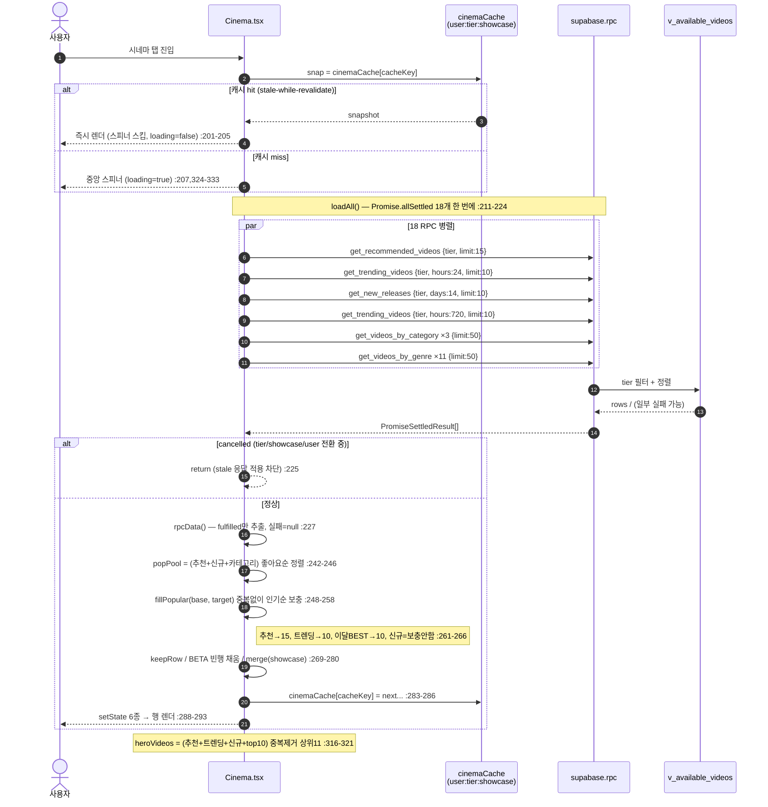
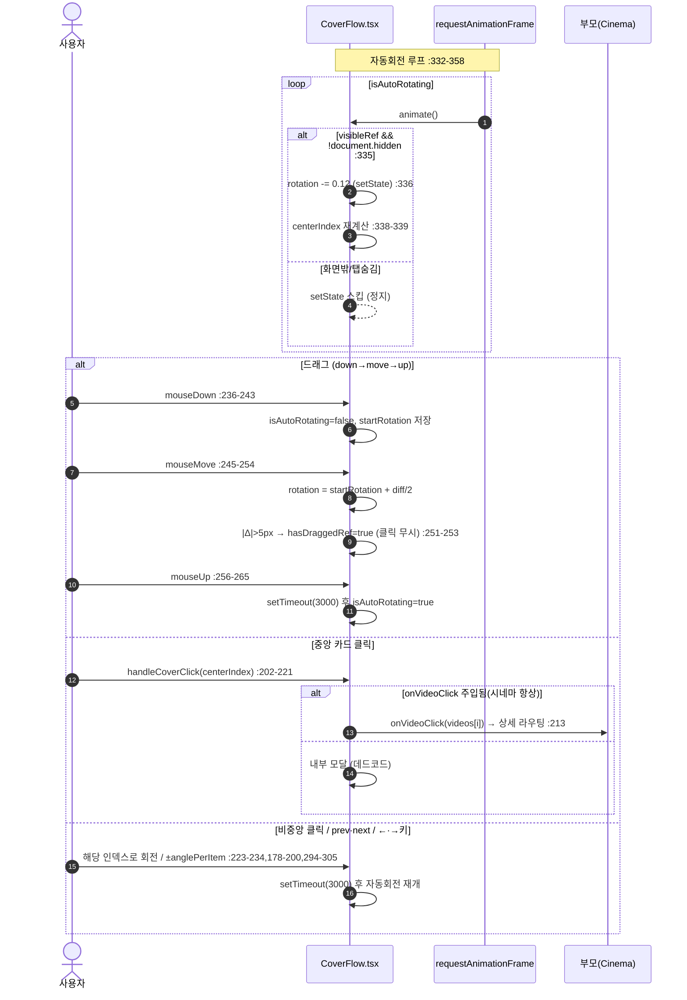
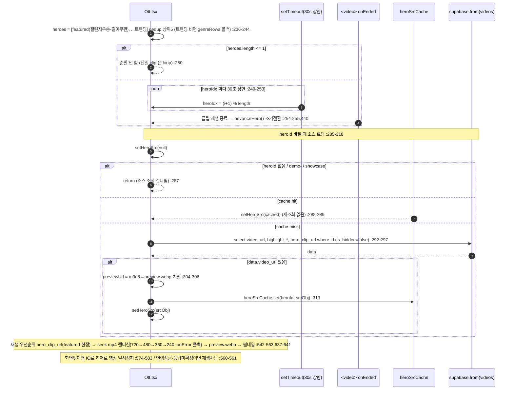
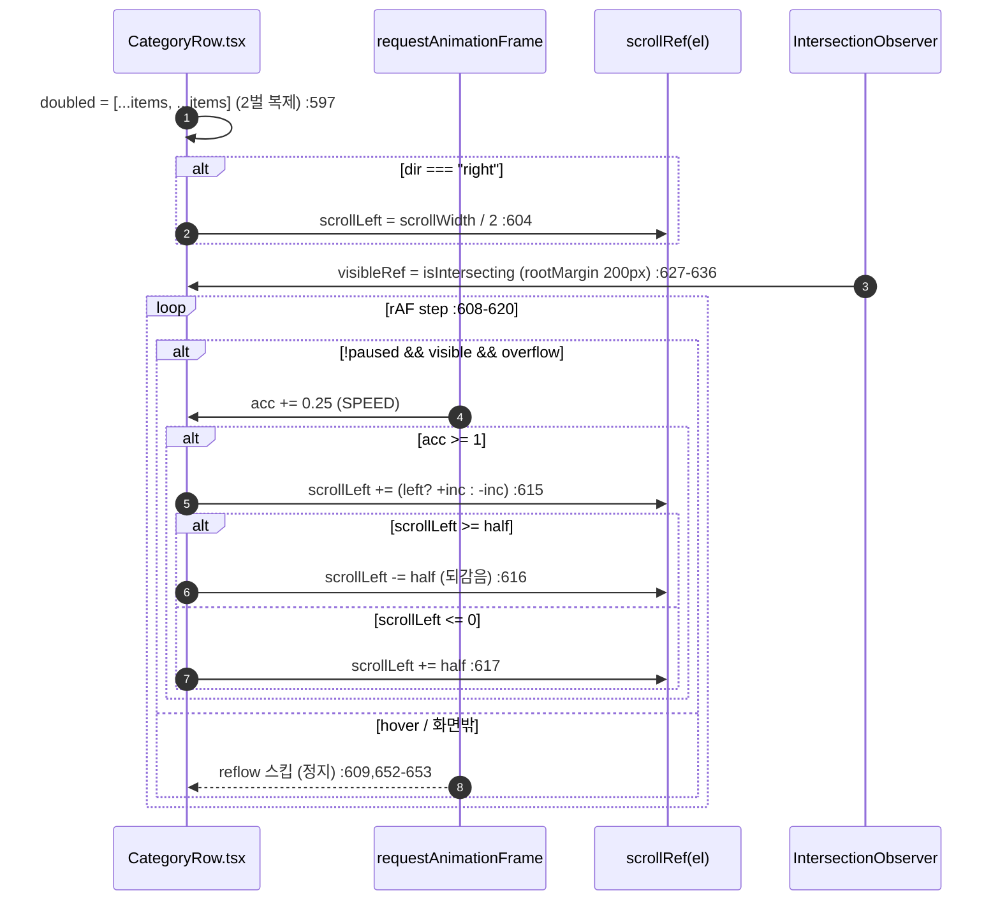

# 03. 시네마 · OTT — 상세 명세

> 본 문서는 실제 코드를 읽고 작성했다(추측 금지). 모든 동작·계약은 아래 file:line 근거를 단다.
>
> **📌 개정 2026-07-08 — OTT 히어로 순환 갱신.** 이전 판은 "20초 setInterval" 이었으나 현행은
> **heroIdx 별 30초 상한 setTimeout + 클립종료(onEnded) 시 조기전환**(짧은 영상이 30초 창에서 반복되던
> 것 제거). §2·§4.3·§11 은 현행 기준이며 인용 라인은 개정일 시점 근사치(표/함수명이 정본). RPC/뷰 정본:
> `supabase/cinema_rpc_hardening_20260708.sql`(3 RPC search_path·grant 하드닝) +
> `supabase/series_feed_grouping_20260619.sql`(`v_available_videos` = 공개·비숨김·**시리즈 1화** 필터).
>
> 핵심 소스:
> - `src/app/components/Cinema.tsx` (시네마·OTT 공용 컴포넌트, `tier` prop 으로 분기)
> - `src/app/components/Ott.tsx` (OTT 전용 재설계 화면)
> - `src/app/components/VideoRowCarousel.tsx` (Netflix식 가로 행)
> - `src/app/components/CoverFlow.tsx` (원통형 캐러셀 시그니처 UI)
> - `src/app/components/TrendingHeroSection.tsx` (1~10위 순위 캐러셀)
> - `supabase/phase31_carousel_genre_likes.sql` (RPC 4종 + `v_available_videos` 뷰)
> - `supabase/genre_based_rows.sql` (`get_videos_by_genre`)
> - `supabase/content_policy_v2.sql` (길이 게이팅 트리거 `classify_video_placement`)
> - `src/app/utils/brandColors.ts` (장르 스타일), `src/app/data/genres.ts` (장르 SSOT)
> - `src/app/hooks/useAgeRatings.ts`, `src/app/hooks/useSeriesCounts.ts`

---

## 1. 개요 / 목적 (시네마 vs OTT 차이: 길이 게이팅·UI)

CREAITE 의 영상 소비 화면은 길이 기반 3단(홈/시네마/OTT) 중 **시네마**와 **OTT** 두 코너로 나뉜다. 분류는 업로드 시 DB 트리거가 자동 결정한다(`supabase/content_policy_v2.sql:38-87`).

| 구분 | 길이 게이팅(노출 임계값) | 컴포넌트 | UI 콘셉트 | 톤 |
|---|---|---|---|---|
| 시네마 | 60초(1분) 이상 → `show_on_cinema=true` (`content_policy_v2.sql:49,75`) | `Cinema.tsx` (`tier="cinema"`) | 가로 행 캐러셀 + CoverFlow 시그니처 + 트렌딩 히어로 | 라이트 배경(`bg-background`) |
| OTT | 600초(10분) 이상 → `show_on_ott=true` (`content_policy_v2.sql:50,78`) | `Ott.tsx` | 풀블리드 히어로 빌보드 + 시간대 무드 편성 + 좌우 교차 마퀴 행 | 블랙 배경(`bg-black`) |

- 두 코너 모두 노출 영상은 `v_available_videos` 뷰(공개+비숨김)에서 온다(`phase31_carousel_genre_likes.sql:30-59`).
- 시네마는 `Cinema.tsx` 한 컴포넌트가 `tier` prop 으로 cinema/ott 두 모드를 모두 그릴 수 있으나(`Cinema.tsx:107,153,192`), 실제 OTT 탭은 별도 재설계 화면 `Ott.tsx` 를 쓴다(시간대 편성·마퀴·풀블리드 히어로는 `Ott.tsx` 전용). `Cinema.tsx` 의 `tier="ott"` 경로는 시네마와 동일 레이아웃의 OTT 버전(타이틀/이모지만 👑로 바뀜, `Cinema.tsx:341`)이다.
- 목적: 길이가 길수록(=더 "작품"에 가까울수록) 더 몰입형 UI로 노출. 시네마는 탐색·발견(많은 행), OTT는 감상·편성(편성 무드 + 자동 흐름).

> 주의(불일치 메모): DB 트리거의 시네마 임계값은 **60초**(`content_policy_v2.sql:49`)이지만, showcase Mock 합성 필터는 시네마를 **180초**로 거른다(`src/app/utils/showcase.ts:46-48`). 또한 `VideoRowCarousel` 의 OTT 배지는 클라이언트 설정 `ottMinSeconds`(기본 600)로 판단한다(`VideoRowCarousel.tsx:309,382`). 실데이터 노출 게이팅은 DB(60/600초)가, 화면 배지/Mock 만 별 임계값을 쓴다.

---

## 2. 사용자 스토리

- (관람객) 시네마 탭에 들어가면 추천·트렌딩·신규·이달의 BEST·형식별·장르별 행이 한 화면에서 가로로 스크롤된다.
- (관람객) 시네마 상단의 원통형 CoverFlow 가 자동 회전하며, 가운데 카드를 클릭하면 상세로 간다.
- (로그인 사용자) 좋아요/시청 이력이 쌓이면 "당신을 위한 추천" 행이 내 취향(카테고리 가중치) 순으로 바뀐다(`phase31_carousel_genre_likes.sql:117-156`).
- (관람객) OTT 탭에 들어가면 트렌딩 상위 작품이 풀블리드로 자동재생(음소거)되고, 클립이 끝나면 즉시 다음 작품으로·아니면 최대 30초 후 순환한다(2026-07-08, `Ott.tsx:238-247`).
- (관람객) OTT는 **지금 접속한 시각**에 맞춰 장르 행 순서가 바뀐다(새벽=호러/스릴러 우선 등, `Ott.tsx:119-139`).
- (관람객) OTT 장르 행은 손대지 않아도 좌/우로 천천히 자동 흐르고, 마우스를 올리면 멈춘다(`Ott.tsx:599-624,652-653`).
- (미성년/미인증) 19+ 작품은 썸네일이 블러 처리되고 잠금 아이콘이 뜬다(`AgeBadge.tsx:48-50`, `Ott.tsx:182-186`).
- (사용자) 어느 행이든 카드에 마우스를 올리면 재생·장바구니·좋아요 버튼이 뜨고, 좋아요를 누르면 토글된다(`VideoRowCarousel.tsx:103-136`).
- (베타) 영상이 부족한 행/빈 장르도 "영상 등록하기" 베타 카드로 8칸까지 채워져 노출된다(`config/beta.ts:11-14`).

---

## 3. 화면 & 상태

### 3.1 시네마 화면 구성 (`Cinema.tsx:335-486`)
위→아래 순서:
1. 헤더(이모지 🎬/👑 + 타이틀/부제, sticky) — `Cinema.tsx:338-347`
2. 이벤트 배너 보드(활성 이벤트 있을 때만) — `Cinema.tsx:350-352`
3. **CoverFlow** 원통형 캐러셀(heroVideos 있을 때만) — `Cinema.tsx:356-368`
4. 추천(For You) `VideoRowCarousel` — `Cinema.tsx:371-381`
5. 인기(24h) `TrendingHeroSection` — `Cinema.tsx:384-391`
6. 새로 추가됨 `VideoRowCarousel` — `Cinema.tsx:394-401`
7. 이달의 BEST(30일) `VideoRowCarousel` — `Cinema.tsx:404-412`
8. 형식 카테고리(top=애니메이션) — `Cinema.tsx:415-425`
9. 장르별(기타 제외) — `Cinema.tsx:428-438`
10. 형식 카테고리(bottom=다큐·뮤직비디오) — `Cinema.tsx:441-451`
11. 기타 장르(맨 끝) — `Cinema.tsx:454-464`
12. 이번 주 TOP 크리에이터 — `Cinema.tsx:467-471`
13. (전부 비었을 때) 빈 상태 — `Cinema.tsx:474-482`
14. Footer — `Cinema.tsx:484`

### 3.2 OTT 화면 구성 (`Ott.tsx:345-405`)
1. **풀블리드 단일 히어로 빌보드**(`heroes.length>0`) — `Ott.tsx:352-362`, `HeroBillboard` (`Ott.tsx:413-557`)
2. 시간대 무드 편성 헤더(이모지+밴드명+태그라인) — `Ott.tsx:365-375`
3. **카테고리 마퀴 행**(좌우 교차) — `Ott.tsx:378-401`, `CategoryRow` (`Ott.tsx:563-791`)
   - 순서: 형식(top) → 장르(기타 제외, 시간대 정렬) → 형식(bottom) → 기타 (`Ott.tsx:380-385`)
4. Footer — `Ott.tsx:403`

### 3.3 상태(로딩/빈/부분실패)

**로딩**
- 시네마: 모듈 캐시에 스냅샷 없으면 `loading=true`(`Cinema.tsx:162`) → 중앙 스피너 + Footer (`Cinema.tsx:324-333`). 캐시 hit 시 첫 렌더부터 데이터 표시(스피너 스킵).
- OTT: 동일 패턴(`Ott.tsx:160`) → 스피너 색만 `#a78bfa`(`Ott.tsx:325-334`).

**빈 상태**
- 시네마: 추천·트렌딩·신규가 모두 0이면 Film 아이콘 + 안내문(`Cinema.tsx:474-482`). 개별 행은 `emptyMessage`(`VideoRowCarousel.tsx:329-342`)·`TrendingHeroSection`(`TrendingHeroSection.tsx:84-95`)에서 처리.
- OTT: `heroes.length===0 && genreRows.length===0` 이면 "영상 없음" 단일 메시지(`Ott.tsx:336-343`). 행이 일부라도 있으면 행만 그린다. 마퀴 영역 전부 비면 `ott.noGenreContent`(`Ott.tsx:398-400`).

**부분 실패**
- 시네마: `Promise.allSettled` 로 RPC 하나가 실패해도 나머지로 채움(실패분=빈 데이터)(`Cinema.tsx:211-234`).
- OTT: 각 RPC 를 `.catch(()=>null)` 로 안전 래핑 후 `Promise.all`(`Ott.tsx:264-280`).
- 둘 다 캐시 표시 중(snap 존재)일 때의 백그라운드 갱신 실패는 토스트 없이 조용히 무시(`Cinema.tsx:296-297`, `Ott.tsx:315-316`).

---

## 4. 동작 흐름

### 4.1 행 구성(시네마 데이터 로드)
`Cinema.tsx:209-302` `loadAll()`:
1. `Promise.allSettled` 로 한 번에 호출: 추천 1 + 트렌딩(24h) 1 + 신규(14d) 1 + 트렌딩(720h=30일) 1 + 형식 카테고리 3(애니/다큐/뮤비) + 장르 11 (`Cinema.tsx:211-224`).
2. `rpcData()` 로 fulfilled 만 추출(`Cinema.tsx:227`).
3. `popPool` = 추천+신규+전체 카테고리 영상을 좋아요순 정렬(`Cinema.tsx:242-246`).
4. `fillPopular(base, target)` 로 각 행을 인기순 영상으로 중복 없이 채움(`Cinema.tsx:248-258`).
5. 행별 머지·필터 후 모듈 캐시에 기록 + setState (`Cinema.tsx:261-293`).

### 4.2 CoverFlow 회전/드래그 (`CoverFlow.tsx`)
- `heroVideos` = 추천+트렌딩+신규+top10 중복제거 상위 11편(`Cinema.tsx:316-321`) → `toCoverFlowVideo` 매핑(`Cinema.tsx:66-81,322`).
- `anglePerItem = 360/videos.length`(`CoverFlow.tsx:55`), 각 아이템 `translate3d + rotateY`(`CoverFlow.tsx:319-330`).
- **자동회전**: `requestAnimationFrame` 으로 매 프레임 `rotation -= 0.12`(`CoverFlow.tsx:332-358`). 화면 밖/탭숨김이면 setState 스킵(`CoverFlow.tsx:335`).
- **드래그**: 마우스/터치 `down→move→up` 으로 `rotation = startRotation + diff/2`(`CoverFlow.tsx:236-292`). 5px 이상 이동하면 `hasDraggedRef=true` 로 클릭 무시(`CoverFlow.tsx:206-209,251-253`).
- **조작 후 3초 뒤 자동회전 재개**: prev/next/클릭/드래그 종료 모두 `setTimeout(...,3000)`(`CoverFlow.tsx:185-187,197-199,231-233,262-264,289-291`).
- **클릭**: 가운데 아이템 클릭 시 `onVideoClick` 우선 호출(부모 라우팅)(`CoverFlow.tsx:211-221,457-465`). 비중앙 클릭은 해당 인덱스로 회전(`CoverFlow.tsx:223-234`).
- 키보드 ←/→ 로 prev/next(`CoverFlow.tsx:294-305`).
- 화살표는 hover 가능 디바이스에서만 노출(`CoverFlow.tsx:66-72,407`).

### 4.3 히어로 순환 (OTT, `Ott.tsx:225-308`) — 2026-07-08: 20초 setInterval → 30초 상한 + 클립종료 조기전환
- `heroes` = (피처링=챌린지 우승작 + 트렌딩) dedup 상위 5편(트렌딩 비면 장르 행 영상 폴백)(`Ott.tsx:236-244`). **피처링(`featured_hero_until` 미래)은 tier/길이 게이트를 거치지 않는다** — 챌린지 우승작은 길이 무관하게 히어로에 노출된다(예: 10분 미만도 가능하며, 이 경우 히어로엔 뜨지만 show_on_ott 장르/형식 행에는 안 나올 수 있다). featured 로드 쿼리는 `visibility=public·status=ready·is_hidden=false` 만 필터(`Ott.tsx:257-283`).
- **순환 규칙(현행)**: `heroIdx` 별 `setTimeout(...,30000)`(30초 상한), heroIdx 변경마다 타이머 리셋(`Ott.tsx:241-245`). 클립 영상은 `onEnded`(=`advanceHero`)로 재생이 끝나면 30초 전 조기 전환(같은 장면 반복 제거). 1편 이하면 순환/전환 없음(단일 히어로 clip은 loop).
  - (구 20초 setInterval + 10초 구간 되감기 제거 — 짧은 영상이 30초 창에서 반복되던 것 단순화.)
- 히어로 영상 소스(`video_url`·`hero_clip_url` 등)는 RPC에 없어 `videos` 테이블에서 별도 조회(`Ott.tsx:276-308`). `heroSrcCache`(heroId→src)로 회전마다 재조회 방지(`Ott.tsx:152,279`).
- 재생 우선순위: `hero_clip_url` 클립(=**featured 히어로 한정**, `allowClip` — 미검수 사용자 업로드 클립 게이트)이 있으면 자동재생(끝나면 다음), 없으면 하이라이트 시작점으로 seek 한 mp4 렌디션을 **720→480→360→240 폴백 체인**으로 재생(onError 시 다음 렌디션 — Bunny 가 소스에 따라 720p 를 안 만드는 영상의 404 대응), 둘 다 없으면 Bunny `preview.webp` 애니메이션, 그것도 없으면 썸네일 포스터(`Ott.tsx:542-563,637-641`). seek 지점은 `HERO_MAX_SEEK_SEC=90` 로 상한 clamp(딥 seek 저화질 고착 방지, `Ott.tsx:157,621-627`).
- 화면 밖이면 IntersectionObserver 로 히어로 영상 일시정지(`Ott.tsx:542-551`).

### 4.4 마퀴 자동 흐름 (OTT, `Ott.tsx:599-624`)
- 행마다 dir(left/right) 교차(`Ott.tsx:390`). `dir==="right"` 면 시작 위치를 `scrollWidth/2` 로 세팅(`Ott.tsx:604`).
- rAF 루프로 `SPEED=0.25px/frame` 누적, 1px 이상 모이면 `scrollLeft` 가감(`Ott.tsx:607-618`).
- 항목 2벌 복제(`doubled`)로 무한 루프, `scrollWidth/2` 지점에서 되감음(`Ott.tsx:597,614-617`).
- hover 시 `pausedRef=true` 로 일시정지(`Ott.tsx:652-653,609`). 화면 밖이면 `visibleRef=false` 로 reflow 스킵(`Ott.tsx:627-636,609`).
- 데스크탑 좌우 화살표로 추가 스크롤(`Ott.tsx:642-647,751-764`).

### 4.5 연령 게이트
- `useAgeRatings` 로 id→등급 맵 조회 후, `shouldBlur(rating, ageVerified)` = `rating==="19" && !ageVerified`(`AgeBadge.tsx:48-50`).
- 본인 영상은 게이트 면제(`isMyVideo`)(`VideoRowCarousel.tsx:380-381`, `Ott.tsx:184-185`).
- 잠금 시 썸네일 `blur-xl/blur-2xl scale` + 잠금 오버레이(`VideoRowCarousel.tsx:172-179`, `Ott.tsx:522-529,690-696`). 히어로는 영상 재생 자체를 막음(`Ott.tsx:441` `useVideo = !g.isAgeLocked && ...`).

### 4.6 좋아요
- 카드 hover 버튼(`VideoRowCarousel.tsx:237-244`, `TrendingHeroSection.tsx:169-176`)에서 `video_likes` insert; 23505 중복 코드면 delete 로 토글(`VideoRowCarousel.tsx:113-129`, `TrendingHeroSection.tsx:47-62`).
- `likingRef` 로 더블클릭 경합 방지(`VideoRowCarousel.tsx:110-111`, `TrendingHeroSection.tsx:44-45`). 비로그인 시 안내 토스트(`VideoRowCarousel.tsx:106-109`).

---

## 5. 데이터/RPC 계약

모든 RPC는 `v_available_videos`(공개·비숨김, `phase31_carousel_genre_likes.sql:30-59`)를 소스로 하고 동일한 컬럼 셋(+행별 추가 컬럼)을 반환한다. 공통 컬럼: `id text, title, thumbnail, video_url, creator, creator_id uuid, creator_display_name, creator_avatar, category, genre, ai_tool, duration, duration_seconds int, views bigint, likes int, price_standard int, highlight_start real, highlight_end real, created_at`.

### 5.1 tier 필터 (모든 RPC 공통)
```sql
(p_tier='all' OR (p_tier='cinema' AND v.show_on_cinema=true) OR (p_tier='ott' AND v.show_on_ott=true))
```
(`phase31_carousel_genre_likes.sql:109-111,195-197,239-241,334-336`; `genre_based_rows.sql:24`)

### 5.2 RPC별 계약

| RPC | 인자 | 추가 반환 | 정렬 | file:line |
|---|---|---|---|---|
| `get_recommended_videos` | `p_tier='all', p_limit=20` | `score numeric` | 이력無: `score DESC, created_at DESC` / 이력有: 카테고리 가중치 점수 DESC | `phase31_...:66-157` |
| `get_trending_videos` | `p_tier='all', p_hours=24, p_limit=10` | `recent_views bigint` | `recent_views DESC, created_at DESC` (`HAVING count>0`) | `phase31_...:164-205` |
| `get_new_releases` | `p_tier='all', p_days=14, p_limit=10` | (없음) | `created_at DESC` (최근 N일) | `phase31_...:212-244` |
| `get_videos_by_category` | `p_category, p_tier='all', p_limit=10` | (없음) | `created_at DESC` | `phase31_...:307-339` |
| `get_videos_by_genre` | `p_genre, p_tier='all', p_limit=10` | (없음) | `created_at DESC` | `genre_based_rows.sql:12-28` |

추천 RPC 상세:
- `auth.uid()` 로 사용자 판별(`phase31_...:83`). 이력(좋아요/유효 조회)이 없거나 비로그인이면 인기+24h 조회 가중 점수로 폴백(`phase31_...:86-114`).
- 이력 있으면 좋아요(가중 2)·조회(가중 1)로 카테고리 점수 산출(`phase31_...:118-133`), **이미 본 영상 제외**·**본인 영상 제외**(`phase31_...:134-153`).
- `SECURITY DEFINER STABLE`, 추천만 plpgsql(`phase31_...:78-81`), 나머지는 `LANGUAGE sql STABLE`.

### 5.3 호출부 인자 (클라이언트가 실제로 넘기는 값)

시네마(`Cinema.tsx:211-224`):
- 추천 `{p_tier:tier, p_limit:15}`
- 트렌딩 `{p_tier:tier, p_hours:24, p_limit:10}`
- 신규 `{p_tier:tier, p_days:14, p_limit:10}`
- 이달의 BEST = 트렌딩 `{p_tier:tier, p_hours:720, p_limit:10}` (30일)
- 형식 카테고리 `{p_category, p_tier:tier, p_limit:50}` × 3
- 장르 `{p_genre, p_tier:tier, p_limit:50}` × 11

OTT(`Ott.tsx:267-280`):
- 트렌딩 히어로 `{p_tier:"ott", p_hours:168, p_limit:10}` (7일)
- 형식 카테고리 `{p_category, p_tier:"ott", p_limit:50}` × 3
- 장르 `{p_genre, p_tier:"ott", p_limit:50}` × 11

### 5.4 CarouselVideo 매핑
- `CarouselVideo` 타입 정의: `VideoRowCarousel.tsx:27-49` (RPC 반환 컬럼과 1:1, snake_case).
- `CarouselVideo → Product`(상세로 넘김): `toProduct()` (`Cinema.tsx:119-139`, `Ott.tsx:77-97`). **`videoUrl:""` 로 비워 ProductDetail 이 자체 재조회**(`Cinema.tsx:132`).
- `CarouselVideo → CoverFlow Video`: `toCoverFlowVideo()` (`Cinema.tsx:66-81`), `highlight_end` 없으면 `start+30`(`Cinema.tsx:79`).
- showcase Mock → CarouselVideo: `showcaseToCarousel()` (`Cinema.tsx:35-54`, `Ott.tsx:56-75`).
- 시리즈/연령 일괄 조회용 id 수집: `allVideoIds`(데모 id 제외) (`Cinema.tsx:179-188`, `Ott.tsx:172-178`).

---

## 6. 비즈니스 규칙

### 6.1 length 게이팅 (DB 트리거)
- `classify_video_placement()` 가 INSERT/UPDATE 시 `duration_seconds` 파싱 후 플래그 세팅(`content_policy_v2.sql:38-87`):
  - `show_on_home := true` (전부)
  - `show_on_cinema := parsed >= cinema_min`(기본 60초)
  - `show_on_ott := parsed >= ott_min`(기본 600초)
- 임계값은 `platform_settings` 에서 동적 조회(어드민 조절)(`content_policy_v2.sql:25-32,49-50`).
- 광고: 60초 미만 본편 광고 X, 60초+ pre-roll/overlay, 600초+ mid-roll(`content_policy_v2.sql:103-182`).

### 6.2 시간대 무드 편성 (OTT 전용)
- 5개 밴드(`Ott.tsx:119-125`), 접속 시각으로 선택(`currentBand()` `Ott.tsx:126-133`):
  - 새벽 02–05 🌌 호러/스릴러/SF/판타지
  - 아침 05–11 🌅 다큐/드라마/애니/음악
  - 낮 11–17 ☀️ 코미디/액션/애니/SF
  - 저녁 17–21 🌆 드라마/로맨스/코미디/판타지
  - 밤 21–02 🌙 스릴러/로맨스/SF/드라마/호러
- 장르 행 정렬: `bandRank()` 로 `order` 우선, "기타"(default)는 항상 맨 뒤(999), 나머지 알려진 장르=100(`Ott.tsx:134-139,197-202`). **2026-06-28 nature·abstract 도 밴드 `order` 에 편입**(nature=아침/낮/저녁, abstract=새벽/밤) → 11개 장르 전부 최소 한 시간대에서 우선 노출.
- 해당 시간 우선 장르는 따뜻한 시그니처 그라데이션으로 강조(`highlighted`)(`Ott.tsx:391,778-784`).

### 6.3 장르 11종 + 형식 3종
- 장르 SSOT: `["SF","액션","로맨스","공포","판타지","스릴러","드라마","코미디","자연·풍경","추상","기타"]`(`data/genres.ts:8-10`). 업로드 폼·시네마·OTT 행 모두 동일 목록·순서.
- 장르 이모지: `GENRE_EMOJI`(`data/genres.ts:13-26`), 시네마 행 제목에 `genreEmoji(category)`(`Cinema.tsx:431,457`).
- 장르 스타일(OTT 라벨 아이콘·그라데이션): `getGenreStyle()` — 한글→키 매핑 후 `GENRE_STYLES` 조회, 미스 시 `DEFAULT_GENRE_STYLE`(`brandColors.ts:44-188`). 자연·풍경/추상은 2026-06-25 누락 버그 수정으로 추가됨(`brandColors.ts:133-149`).
- 형식 카테고리(장르 아님, `category` 기준): 애니메이션(top)·다큐멘터리(bottom)·뮤직비디오(bottom)(`Cinema.tsx:59-63`, `Ott.tsx:107-111`). 영화·드라마·기타는 장르와 겹쳐 제외(`Cinema.tsx:56-58`).

### 6.4 fillPopular 채움 (시네마 전용)
- `popPool` = 추천+신규+카테고리 전체를 좋아요순 정렬(`Cinema.tsx:242-246`).
- 추천(15)·트렌딩(10)·이달의 BEST(10)는 실제 데이터 뒤에 인기순으로 target까지 채움(중복 제거)(`Cinema.tsx:248-266`). 신규 행은 채우지 않음(`Cinema.tsx:264`).
- 베타라 조회/추천 데이터가 적은 행이 비어 보이지 않게 하는 폴백.

### 6.5 시리즈 배지
- `useSeriesCounts` 로 id→회차수, **>1 일 때만** "시리즈 · N화" 배지(`VideoRowCarousel.tsx:196-201`, `Ott.tsx:683-688`).
- 연령 잠금 영상엔 배지 미표시(`VideoRowCarousel.tsx:196` `!isAgeLocked`, `Ott.tsx:683`).

### 6.6 베타 모드 채움
- `BETA_MODE=true`(`config/beta.ts:11`), `BETA_ROW_TARGET=8`(`config/beta.ts:14`).
- `onUpload` 콜백이 넘어오면 부족분을 `BetaCard` 로 8칸까지 채우고 빈 행/빈 장르도 노출(`Cinema.tsx:269-280`, `Ott.tsx:288-294,590-597`, `VideoRowCarousel.tsx:314-316,399-402`).
- 실제 영상이 8개 이상이면 베타 카드 0장(자동 졸업)(`config/beta.ts:13`).

### 6.7 가격/배지 표시
- 가격: 0 이하면 "라이선스 미판매", `isNegotiationOnly` 면 "별도 협의", 아니면 ₩가격(`VideoRowCarousel.tsx:258-266`, `Ott.tsx:721-727`).
- OTT 배지: `is_ott` 이거나 `duration_seconds >= ottMinSeconds`(기본 600)(`VideoRowCarousel.tsx:382`).

---

## 7. 엣지 케이스 & 에러 처리

- **부분 RPC 실패**: 시네마 `allSettled`(`Cinema.tsx:211-227`), OTT `.catch(()=>null)`(`Ott.tsx:264-265`) → 실패 행만 비고 나머지 정상.
- **빈 행**: BETA OFF면 `keepRow(len)= len>0` 으로 빈 행 숨김, BETA ON이면 전부 노출(`Cinema.tsx:269,275,280`, `Ott.tsx:288,294,306`). 행 컴포넌트도 빈 배열이면 null/emptyMessage(`VideoRowCarousel.tsx:329`, `Ott.tsx:639`, `TrendingHeroSection.tsx:84-95`).
- **중복 제거**: heroVideos 의 `seen` Set(`Cinema.tsx:317-320`); fillPopular 의 `seen`(`Cinema.tsx:249-255`).
- **히어로 폴백(OTT)**: 트렌딩 비면 장르 행 영상으로 폴백(`Ott.tsx:204-206`); `video_url` 없으면 preview.webp → 썸네일 순(`Ott.tsx:440-443`); demo/showcase id 는 소스 조회 건너뜀(`Ott.tsx:217`); preview 로드 실패 시 숨겨 썸네일 노출(`Ott.tsx:483`).
- **장르 매핑 미스**: `getGenreStyle` 미스 시 `DEFAULT_GENRE_STYLE`(기타, 맨 뒤)(`brandColors.ts:187`). 키 매핑은 한글·영문·AI접두 모두 커버(`brandColors.ts:163-182`).
- **stale 응답**: tier/showcase/user 전환 중 응답은 `cancelled` 가드로 적용 차단(`Cinema.tsx:225,303`, `Ott.tsx:285,322`).
- **좋아요 경합**: in-flight 가드(`VideoRowCarousel.tsx:110`, `TrendingHeroSection.tsx:44`); 23505=이미 좋아요→취소(`VideoRowCarousel.tsx:117-123`).
- **CoverFlow 빈 배열**: `isEmpty` 면 렌더 null / 회전 계산 0 분모 방지(`CoverFlow.tsx:54-55,84-89,402`).
- **연령 맵 미존재 id**: 응답에 없는 id 는 `"all"`/`0` 으로 캐시해 재요청 방지(`useAgeRatings.ts:43`, `useSeriesCounts.ts:32`).

---

## 8. 성능

- **병렬**: 시네마 `Promise.allSettled` 한 번에 18개 RPC(`Cinema.tsx:211-224`); OTT `Promise.all` 1왕복(3단 워터폴 제거)(`Ott.tsx:267-280`).
- **모듈 캐시(stale-while-revalidate)**: `cinemaCache`(키=`user:tier:showcase`)(`Cinema.tsx:151,159,200-205,283`), `ottCache`(키=`showcase`)(`Ott.tsx:147,159,253-256,309`). 재방문 시 스피너 없이 직전 데이터 즉시 표시 후 백그라운드 갱신. 추천 누수 방지 위해 캐시 키에 user id 포함(`Cinema.tsx:157-159`).
- **memo**: `VideoCard`(`VideoRowCarousel.tsx:97`), `CategoryRow`·`HeroBillboard`(`Ott.tsx:413,563`). 핸들러 `useCallback`/`useMemo` 안정화로 카드 리렌더 폭풍 방지(`Cinema.tsx:307-313`, `Ott.tsx:189-193`).
- **화면 밖 회전/마퀴 정지**: CoverFlow IntersectionObserver→`visibleRef`(`CoverFlow.tsx:74-81,335`); OTT 마퀴 `visibleRef`(`Ott.tsx:627-636,609`); 히어로 영상 IO 일시정지(`Ott.tsx:453-463`); CoverFlow 는 `document.hidden` 도 검사(`CoverFlow.tsx:335`).
- **히어로 RPC 캐시(OTT)**: `heroSrcCache`(heroId→src)로 30초(상한) 회전마다 같은 영상 `video_url` 재조회 방지(`Ott.tsx:152,288,313`).
- **연령/시리즈 일괄 조회 캐시**: module-level 캐시 single source, 캐시 miss id 만 RPC, useMemo 안정화(`useAgeRatings.ts:15,26-59`, `useSeriesCounts.ts:10,16-49`).
- **이미지 lazy**: 카드 썸네일 `loading="lazy"`(`VideoRowCarousel.tsx:162`, `Ott.tsx:677`).
- **마퀴 부동소수 누적**: `scrollLeft` 정수 반올림 대응으로 SPEED 누적 1px 단위 적용(`Ott.tsx:607-618`).

---

## 9. 권한/보안

- 노출 영상은 `v_available_videos`(공개+비숨김)만(`phase31_carousel_genre_likes.sql:57-59`).
- 추천 개인화는 `auth.uid()` 기반, RPC `SECURITY DEFINER`(`phase31_...:79,83`). 비로그인은 비개인화 폴백.
- `get_videos_by_genre` 는 `anon, authenticated` 에 EXECUTE 부여(`genre_based_rows.sql:28`).
- 연령 게이트: 19+ 는 미인증 사용자에 블러+잠금(`AgeBadge.tsx:48-50`), 본인 영상은 면제(`Ott.tsx:184-185`, `VideoRowCarousel.tsx:380-381`).
- 좋아요는 로그인 필요(`VideoRowCarousel.tsx:106-109`), `video_likes` 직접 insert/delete(RLS 의존).
- showcase Mock 은 관리자에게 미표시(`utils/showcase.ts:19-23`), Mock 클릭은 차단·안내(`utils/showcase.ts:68-74`).

---

## 10. 분석/이벤트

> 현 코드에 시네마/OTT 화면 전용 analytics 이벤트 송신 호출은 없음(추측 금지 — `Cinema.tsx`/`Ott.tsx` 내 트래킹 코드 부재). 사용자 행동 신호는 아래 DB 적재 데이터에 의존:
- **조회**: `video_views`(`is_valid`, `occurred_at`, `watch_ratio`)가 트렌딩·추천·이어보기 점수의 원천(`phase31_...:88-91,103-105,190-193,275-284`).
- **좋아요**: `video_likes` insert/delete(`VideoRowCarousel.tsx:113-122`, `TrendingHeroSection.tsx:47-55`) → `videos.likes` 자동 동기화 컬럼 사용(`phase31_...:14`).
- **콘솔 경고(운영 디버깅)**: 로드 실패 시 `console.warn("[Cinema]/[Ott] 로딩 실패")`(`Cinema.tsx:295`, `Ott.tsx:314`).
- (확장 시) 행 노출·카드 클릭·히어로 임프레션 이벤트는 미구현 — 추가 필요.

---

## 11. 수용 기준 (체크리스트)

- [ ] 시네마 탭: CoverFlow + 추천/트렌딩/신규/이달의BEST/형식/장르(기타 맨끝)/TOP크리에이터 순서로 렌더(`Cinema.tsx:356-471`).
- [ ] 시네마 RPC 18개 병렬 호출, 1개 실패해도 나머지 행 정상(`Cinema.tsx:211-227`).
- [ ] 추천 행: 로그인+이력 있으면 개인화, 없으면 인기 폴백; 항상 15개까지 fillPopular(`Cinema.tsx:261`, `phase31_...:93-156`).
- [ ] CoverFlow 자동회전, 조작 후 3초 뒤 재개, 가운데 클릭 시 상세 이동(`CoverFlow.tsx:178-234,332-358`).
- [ ] CoverFlow/마퀴/히어로 영상이 화면 밖이면 정지(`CoverFlow.tsx:335`, `Ott.tsx:609,453-463`).
- [ ] OTT 히어로: (피처링+트렌딩) 상위 5편 순환 — 클립종료 시 조기전환 / 아니면 30초 상한, 클립 있으면 자동재생·없으면 seek/preview/썸네일(`Ott.tsx:225-308,526-531`).
- [ ] OTT 장르 행이 접속 시각에 맞는 무드 순서로 정렬, "기타" 맨 뒤(`Ott.tsx:197-202,134-139`).
- [ ] OTT 마퀴 좌우 교차 자동 흐름, hover 시 정지(`Ott.tsx:390,599-624,652-653`).
- [ ] 19+ 영상이 미인증 사용자에게 블러+잠금, 본인 영상은 면제(`AgeBadge.tsx:48-50`, `Ott.tsx:184-185`).
- [ ] 시리즈 회차>1 인 영상에만 "시리즈 · N화" 배지(`VideoRowCarousel.tsx:196`, `Ott.tsx:683`).
- [ ] 좋아요 토글이 중복 클릭에도 일관(insert→23505→delete)(`VideoRowCarousel.tsx:113-129`).
- [ ] 길이 게이팅: 60초+만 시네마, 600초+만 OTT에 노출(`content_policy_v2.sql:75,78`).
- [ ] BETA_MODE ON: 빈 행/부족 행이 베타 카드로 8칸 채워짐(`config/beta.ts`, `Cinema.tsx:269-280`).
- [ ] 탭 재방문 시 캐시로 스피너 없이 즉시 표시 후 백그라운드 갱신(`Cinema.tsx:200-205`, `Ott.tsx:253-256`).
- [ ] 계정 전환 시 이전 사용자 추천이 새어나오지 않음(캐시 키에 user id)(`Cinema.tsx:157-159`).

---

## 12. 알려진 제약 / 이월

- **가상화 없음**: 시네마는 장르 11 + 형식 3 + 4개 큐레이션 행이 모두 DOM 에 마운트되고, 각 행이 최대 50개 카드(+베타) 보유(`Cinema.tsx:221-223`). 행/카드 수가 늘면 가상 스크롤(windowing) 필요.
- **CoverFlow RAF**: 자동회전이 매 프레임 `setRotation` 으로 React 리렌더를 유발(`CoverFlow.tsx:335-344`). 화면 밖/탭숨김 가드는 있으나(`CoverFlow.tsx:335`) 보이는 동안은 상시 리렌더 — CSS transform 직접 구동(ref) 으로 리팩터 여지.
- **OTT 마퀴 rAF**: 행마다 독립 rAF 루프(`Ott.tsx:601-624`). 화면 밖 reflow 스킵은 있으나 보이는 행 다수면 비용 누적.
- **showcase/DB 임계값 불일치**: showcase Mock 은 시네마 180초 기준(`utils/showcase.ts:47`)인데 실데이터는 60초(`content_policy_v2.sql:49`) — Mock 비활성(`SHOWCASE_ENABLED=false`, `utils/showcase.ts:11`) 상태라 현재 영향 없으나 재활성 시 정합 필요.
- **이어보기(Continue Watching) 미사용**: `get_continue_watching` RPC 는 존재하나(`phase31_...:251-300`) 시네마/OTT 화면에서 호출하지 않음(헤더 주석엔 언급, `Cinema.tsx:6`).
- **분석 이벤트 미구현**: 행 임프레션·카드 클릭 추적 없음(11/10절 참조).
- **CoverFlow 내부 모달 데드코드**: `onVideoClick` 가 항상 주입되어(`Cinema.tsx:365`) 내부 비디오 모달·라이선스 탭(`CoverFlow.tsx:540-730`)은 시네마 경로에서 도달 불가.

---

## 와이어프레임 (텍스트 목업)

> 실제 컴포넌트 구조 기준 ASCII 목업(추측 없이 위 file:line 참조). 카드 폭·여백은 개념도.

### 시네마 (`Cinema.tsx:335-486`)

```
┌──────────────────────────────────────────────────────────────────────┐
│ 🎬 시네마               단편부터 장편까지, 작품을 발견하세요   (sticky)  │  ← 헤더 338-347
├──────────────────────────────────────────────────────────────────────┤
│ [ 이벤트 배너 보드 ]   (활성 이벤트 있을 때만)                          │  ← 350-352
├──────────────────────────────────────────────────────────────────────┤
│                                                                        │
│                    ╭─────── CoverFlow (원통형) ───────╮                 │  ← 356-368
│              ╭───╮ │       ╭─────────╮       │ ╭───╮                    │
│        ◀     │ ▒ │ │       │  CENTER  │      │ │ ▒ │     ▶              │
│       (←/→)  ╰───╯ │       │ ▶ 클릭→상세│      │ ╰───╯  (hover시만)       │
│                    ╰────── 자동회전 -0.12°/frame ──────╯                 │
│        · 드래그(±5px↑=클릭무시) · 조작 후 3초 뒤 자동회전 재개            │
│                                                                        │
├──────────────────────────────────────────────────────────────────────┤
│ ✨ 당신을 위한 추천                                       ◀  ▶          │  ← 371-381
│ ┌────┐┌────┐┌────┐┌────┐┌────┐┌────┐  → 가로 스크롤 (최대 15)          │
│ │card││card││card││card││card││card│    hover: ▶ 🛒 ♥                  │
│ └────┘└────┘└────┘└────┘└────┘└────┘                                  │
├──────────────────────────────────────────────────────────────────────┤
│ 🔥 지금 뜨는 작품 (24h)        [TrendingHeroSection: 순위 1~10 캐러셀]   │  ← 384-391
│  ①┌────┐ ②┌────┐ ③┌────┐ …  (대형 순위 숫자 오버레이)                  │
│    └────┘   └────┘   └────┘                                            │
├──────────────────────────────────────────────────────────────────────┤
│ 🆕 새로 추가됨 (14d)            ┌────┐┌────┐┌────┐ …                    │  ← 394-401
│ 🏆 이달의 BEST (30d)           ┌────┐┌────┐┌────┐ …                    │  ← 404-412
│ 📺 애니메이션 (형식 top)        ┌────┐┌────┐┌────┐ …                    │  ← 415-425
│ 🚀 SF · ⚔ 액션 · 💗 로맨스 …    (장르 11종, "기타" 제외)                │  ← 428-438
│ 🎬 다큐멘터리 · 🎵 뮤직비디오    (형식 bottom)                           │  ← 441-451
│ 📦 기타 (장르 맨 끝)           ┌────┐┌────┐ …                          │  ← 454-464
│ 👑 이번 주 TOP 크리에이터       ┌──┐┌──┐┌──┐ …                          │  ← 467-471
├──────────────────────────────────────────────────────────────────────┤
│                          [ Footer ]                                    │  ← 484
└──────────────────────────────────────────────────────────────────────┘

(전부 비었을 때)  ▶ 🎞 Film 아이콘 + "아직 등록된 작품이 없습니다" 안내  ← 474-482
```

### OTT (`Ott.tsx:345-405`, 블랙 배경)

```
┌══════════════════════════════════════════════════════════════════════┐
│                                                                      ░│
│ ░░░ HERO BILLBOARD (풀블리드, heroes 상위 5편, 30초 상한 순환) ░░░░░░░░ │  ← 428-442 / HeroBillboard 508-697
│ ░                                                                    ░│
│ ░   [자동재생: 클립(featured) → mp4 렌디션 720→…→240 → preview → 썸네일] ░│  ← 542-563
│ ░                                                                    ░│
│ ░   👑 작품 제목 (대형)                                               ░│
│ ░   장르 · 길이 · ₩가격                                               ░│
│ ░   [ ▶ 재생 ]  [ + 내 목록 ]                       ● ○ ○ ○ ○        ░│  ← 인디케이터(heroIdx)
│ ░░░░░░░░░░░░░░░░░░░░░░░░░░░░░░░░ (하단 그라데이션 페이드) ░░░░░░░░░░░░░░░ │
├──────────────────────────────────────────────────────────────────────┤
│ 🌙 밤의 시네마                  스릴러·로맨스·SF로 채우는 밤             │  ← 시간대 무드 헤더 365-375
│    (이모지 + 밴드명 + 태그라인, currentBand() 접속시각 기반)            │
├──────────────────────────────────────────────────────────────────────┤
│  CategoryRow (마퀴, 좌우 교차) — hover시 정지, 화면밖 reflow 스킵       │  ← 378-401 / CategoryRow 563-791
│                                                                        │
│  [형식 top]  애니메이션                                                 │
│   ──▶ ┌──┐┌──┐┌──┐┌──┐┌──┐┌──┐ …      (dir=left, 0.25px/frame)        │
│  ◀──         스릴러 (highlighted, 따뜻한 그라데이션)  [형식·장르 교차]   │
│        … ┌──┐┌──┐┌──┐┌──┐┌──┐┌──┐ ──   (dir=right, scrollLeft=½부터)   │
│   ──▶ ┌──┐┌──┐┌──┐ …      로맨스                                       │
│  ◀──        … (장르 11종, bandRank 시간대 정렬, "기타" 맨 뒤)           │
│        ◀ ▶  (데스크탑 좌우 화살표, hover시 노출)                        │
├──────────────────────────────────────────────────────────────────────┤
│                          [ Footer ]                                    │  ← 403
└══════════════════════════════════════════════════════════════════════┘

(heroes=0 && genreRows=0)  ▶ "표시할 영상이 없습니다" 단일 메시지  ← 336-343
```

### 연령 잠금 카드 (`VideoRowCarousel.tsx:172-179`, `Ott.tsx:522-529,690-696`)

```
일반 카드                         19+ 잠금 카드 (미인증 사용자)
┌───────────────┐                ┌───────────────┐
│  [썸네일 선명]  │                │ ▒▒▒▒▒▒▒▒▒▒▒▒▒ │ ← blur-xl/2xl + scale
│               │                │ ▒▒▒  🔒  ▒▒▒ │ ← 잠금 오버레이
│ ♥ 12   ▶ 🛒   │                │ ▒▒ 19+ 인증 ▒ │
│ 제목           │                │ ▒필요▒▒▒▒▒▒▒ │ ← 히어로는 영상재생 자체 차단
│ 시리즈·3화 [배지]│                │  제목 (가림)   │   (useVideo=!isAgeLocked, 441)
│ ₩ 9,900       │                └───────────────┘
└───────────────┘                ※ 본인 영상(isMyVideo)은 게이트 면제 (184-185 / 380-381)
   shouldBlur = rating==="19" && !ageVerified   (AgeBadge.tsx:48-50)
```

---

## 시퀀스 다이어그램

### 시네마 로드 (18 RPC allSettled → fillPopular → 행 구성, `Cinema.tsx:209-302`)



### CoverFlow 회전 / 드래그 (`CoverFlow.tsx`)



### OTT 히어로 순환(30초 상한/클립종료 조기전환) + 소스 로딩 (`Ott.tsx:233-318`)



### 마퀴 자동 흐름 (`Ott.tsx:599-624`)



---

## API / RPC 레퍼런스

모든 RPC는 `v_available_videos`(공개·비숨김) 뷰를 단일 소스로 하며 동일 tier 필터를 공유한다. 공통 반환 컬럼(모든 RPC):
`id text, title, thumbnail, video_url, creator, creator_id uuid, creator_display_name, creator_avatar, category, genre, ai_tool, duration, duration_seconds int, views bigint, likes int, price_standard int, highlight_start real, highlight_end real, created_at timestamptz` (+ 아래 표의 행별 추가 컬럼).

### 뷰: `v_available_videos`

| 항목 | 내용 |
|---|---|
| 정의 | 공개(`is_public`/공개 상태) + 비숨김 영상만 노출하는 뷰 |
| 추가 컬럼 | `show_on_home`, `show_on_cinema`, `show_on_ott` (트리거가 길이로 세팅) |
| file:line | `phase31_carousel_genre_likes.sql:30-59` |
| tier 필터 식 | `(p_tier='all' OR (p_tier='cinema' AND show_on_cinema) OR (p_tier='ott' AND show_on_ott))` |

### RPC 표

| RPC | 인자(기본값) | 추가 반환 | 정렬 | tier필터 file:line | 정의 file:line |
|---|---|---|---|---|---|
| `get_recommended_videos` | `p_tier='all', p_limit=20` | `score numeric` | 이력無/비로그인: `score DESC, created_at DESC` (likes×1 + 24h조회×2) · 이력有: 카테고리 가중치(좋아요×2,조회×1) 점수 DESC, **본 영상·본인 영상 제외** | `:109-111` | `:64-157` |
| `get_trending_videos` | `p_tier='all', p_hours=24, p_limit=10` | `recent_views bigint` | `recent_views DESC, created_at DESC` (`HAVING count>0`, 최근 N시간 유효조회) | `:195-197` | `:164-205` |
| `get_new_releases` | `p_tier='all', p_days=14, p_limit=10` | (없음) | `created_at DESC` (최근 N일) | `:239-241` | `:212-244` |
| `get_videos_by_category` | `p_category, p_tier='all', p_limit=10` | (없음) | `created_at DESC` | `:334-336` | `:307-339` |
| `get_videos_by_genre` | `p_genre, p_tier='all', p_limit=10` | (없음) | `created_at DESC` | `genre_based_rows.sql:24` | `genre_based_rows.sql:12-28` |

> 모든 file:line 중 RPC 정의/tier필터 열은 별도 표기 없으면 `phase31_carousel_genre_likes.sql` 기준.

### 함수 속성 / 권한

| RPC | LANGUAGE | 속성 | EXECUTE 부여 | 근거 |
|---|---|---|---|---|
| `get_recommended_videos` | plpgsql | `SECURITY DEFINER STABLE`, `auth.uid()` 개인화 | (RPC 기본) | `:78-83` |
| `get_trending_videos` | sql | `STABLE` | — | `:164-205` |
| `get_new_releases` | sql | `STABLE` | — | `:212-244` |
| `get_videos_by_category` | sql | `STABLE` | — | `:307-339` |
| `get_videos_by_genre` | sql | `STABLE` | `anon, authenticated` | `genre_based_rows.sql:28` |

### 클라이언트 호출 인자 (실제 전달값)

| 화면 | RPC | 전달 인자 | file:line |
|---|---|---|---|
| 시네마 | 추천 | `{p_tier:tier, p_limit:15}` | `Cinema.tsx:212` |
| 시네마 | 트렌딩(24h) | `{p_tier:tier, p_hours:24, p_limit:10}` | `Cinema.tsx:213` |
| 시네마 | 신규(14d) | `{p_tier:tier, p_days:14, p_limit:10}` | `Cinema.tsx:214` |
| 시네마 | 이달BEST(30d) | `{p_tier:tier, p_hours:720, p_limit:10}` | `Cinema.tsx:215` |
| 시네마 | 형식 카테고리×3 | `{p_category, p_tier:tier, p_limit:50}` | `Cinema.tsx:217-219` |
| 시네마 | 장르×11 | `{p_genre, p_tier:tier, p_limit:50}` | `Cinema.tsx:221-223` |
| OTT | 트렌딩 히어로(7d) | `{p_tier:"ott", p_hours:168, p_limit:10}` | `Ott.tsx:268` |
| OTT | 형식 카테고리×3 | `{p_category, p_tier:"ott", p_limit:50}` | `Ott.tsx:270-272` |
| OTT | 장르×11 | `{p_genre, p_tier:"ott", p_limit:50}` | `Ott.tsx:275-277` |

---

## 테스트 케이스

> Gherkin(한글). 시나리오는 위 동작 흐름·계약을 검증한다. 수용 기준은 11절 체크리스트와 정렬.

### 정상 경로

```gherkin
Feature: 시네마/OTT 행 렌더링 및 인터랙션

  Background:
    Given v_available_videos 에 공개·비숨김 영상이 충분히 적재돼 있다
    And BETA_MODE 와 showcase 상태가 명확히 설정돼 있다

  Scenario: 시네마 행 렌더 순서
    When 사용자가 시네마 탭에 진입한다
    Then CoverFlow, 추천, 트렌딩(24h), 신규(14d), 이달BEST(30d),
         형식(top=애니), 장르(기타 제외), 형식(bottom=다큐·뮤비),
         기타 장르, TOP 크리에이터 순으로 행이 렌더된다   # Cinema.tsx:356-471
    And 18개 RPC 가 Promise.allSettled 로 한 번에 호출된다  # :211-224

  Scenario: CoverFlow 자동회전과 중앙 클릭
    Given CoverFlow 에 heroVideos 가 1편 이상 있다
    When 아무 조작도 하지 않는다
    Then 매 프레임 rotation 이 0.12° 씩 감소하며 자동회전한다   # CoverFlow.tsx:336
    When 가운데 카드를 클릭한다
    Then onVideoClick 으로 상세 화면으로 라우팅된다            # :213
    When 화살표/드래그로 조작한다
    Then 3초 뒤 자동회전이 재개된다                           # :231-233

  Scenario: OTT 히어로 순환 (30초 상한 / 클립종료 조기전환)
    Given 히어로 후보가 2편 이상이다 (피처링+트렌딩, 트렌딩 비면 장르행 폴백)
    When OTT 탭에 진입해 30초가 경과한다 (또는 클립 영상이 재생을 마친다)
    Then heroIdx 가 (i+1)%length 로 다음 작품으로 바뀐다       # Ott.tsx:249-255
    And 히어로 소스는 hero_clip_url(featured 한정) → seek mp4 렌디션(720→480→360→240) → preview.webp → 썸네일 순으로 선택된다  # :542-563

  Scenario: OTT 시간대 무드 편성
    Given 접속 시각이 21~02 (밤 밴드) 이다
    When OTT 장르 행이 정렬된다
    Then 스릴러·로맨스·SF·드라마·호러 가 우선 배치된다          # Ott.tsx:122-125,197-202
    And "기타" 장르 행은 항상 맨 뒤(rank 999)에 온다            # :134-139

  Scenario: 마퀴 좌우 교차 자동 흐름
    When OTT 카테고리 행이 렌더된다
    Then 행마다 dir(left/right)이 교차하며 0.25px/frame 으로 흐른다  # Ott.tsx:390,607
    When 행에 마우스를 올린다
    Then pausedRef=true 로 흐름이 멈춘다                       # :652-653

  Scenario: 연령 게이트
    Given 19+ 영상이 있고 사용자가 미인증이다
    Then 썸네일이 블러 처리되고 잠금 아이콘이 표시된다          # AgeBadge.tsx:48-50
    And 히어로면 영상 재생 자체가 차단된다 (useVideo=false)     # Ott.tsx:441
    But 본인 영상(isMyVideo)이면 게이트가 면제된다             # :184-185

  Scenario: 좋아요 토글 멱등성
    Given 로그인 사용자가 카드에 hover 한다
    When 좋아요를 누른다
    Then video_likes 에 insert 된다                          # VideoRowCarousel.tsx:113
    When 같은 카드의 좋아요를 다시 누른다 (23505 중복)
    Then 기존 좋아요가 delete 되어 토글된다                    # :117-129
    And likingRef in-flight 가드로 더블클릭 경합이 차단된다     # :110-111
```

### 엣지 케이스

```gherkin
Feature: 시네마/OTT 엣지 및 폴백

  Scenario: 부분 RPC 실패
    Given 18개 RPC 중 장르 1개가 실패한다
    When 시네마가 로드된다
    Then allSettled 로 실패분은 빈 데이터(null) 처리되고
         나머지 행은 정상 렌더된다                            # Cinema.tsx:225-227
    And 캐시 표시 중(snap)이면 백그라운드 갱신 실패는 토스트 없이 무시된다  # :296-297

  Scenario: 빈 행 처리
    Given 어떤 장르에 영상이 0편이다
    When BETA_MODE 가 OFF 이다
    Then 해당 행은 keepRow(len>0)=false 로 숨겨진다           # Cinema.tsx:269,275,280
    When BETA_MODE 가 ON 이다
    Then 빈 행도 BetaCard 로 8칸까지 채워 노출된다             # config/beta.ts:14, Cinema.tsx:269-280

  Scenario: 전체 빈 상태
    Given 추천·트렌딩·신규가 모두 0편이다 (시네마)
    Then Film 아이콘과 안내문이 표시된다                       # Cinema.tsx:474-482
    Given heroes=0 이고 genreRows=0 이다 (OTT)
    Then "표시할 영상이 없습니다" 단일 메시지가 표시된다         # Ott.tsx:336-343

  Scenario: 장르 스타일 매핑 미스
    Given 알 수 없는 category 값의 행이 있다
    When getGenreStyle 가 매핑에 실패한다
    Then DEFAULT_GENRE_STYLE(기타, 맨 뒤)로 폴백한다           # brandColors.ts:187
    And 한글·영문·AI접두 키 모두 매핑 커버된다                 # :163-182

  Scenario: 히어로 폴백 (OTT)
    Given 트렌딩 결과가 0편이다
    Then heroes 가 genreRows 영상으로 폴백된다                 # Ott.tsx:204-206
    Given 히어로 영상에 video_url 이 없다
    Then preview.webp → 썸네일 순으로 폴백한다                 # :440-443
    Given heroId 가 demo-/showcase 로 시작한다
    Then 소스 조회를 건너뛴다                                 # :217
    Given preview.webp 로드가 실패한다
    Then preview 를 숨겨 썸네일을 노출한다                     # :483

  Scenario: stale 응답 가드
    Given tier/showcase/user 가 전환되는 중이다
    When 이전 요청의 응답이 늦게 도착한다
    Then cancelled 가드로 setState 가 차단된다                # Cinema.tsx:225, Ott.tsx:285

  Scenario: 탭 재방문 캐시 (stale-while-revalidate)
    Given 사용자가 이전에 시네마를 본 적이 있다 (캐시 hit)
    When 시네마 탭을 다시 연다
    Then 스피너 없이 직전 데이터가 즉시 표시된 뒤 백그라운드 갱신된다  # Cinema.tsx:200-205
    And 계정 전환 시 캐시 키(user:tier:showcase)로 이전 추천이 새지 않는다  # :157-159
```

### 수용 기준 (요약)

- 시네마 18 RPC 병렬, 1개 실패해도 나머지 행 정상 렌더.
- 추천 행은 로그인+이력 시 개인화, 없으면 인기 폴백, 항상 fillPopular 로 15까지 채움.
- CoverFlow 자동회전·3초 재개·중앙 클릭 상세 이동·화면밖 정지.
- OTT 히어로 30초 상한(클립종료 시 조기전환) 순환, 클립(featured)/mp4 렌디션 seek(720→…→240)/preview/썸네일 폴백, 시간대 무드 정렬("기타" 맨 뒤), 마퀴 좌우 교차·hover 정지.
- 19+ 미인증 블러+잠금, 본인 영상 면제. 좋아요 토글 멱등.
- 길이 게이팅: 60초+ 시네마, 600초+ OTT. BETA ON 시 빈 행 8칸 채움. 재방문 캐시 즉시 표시.
