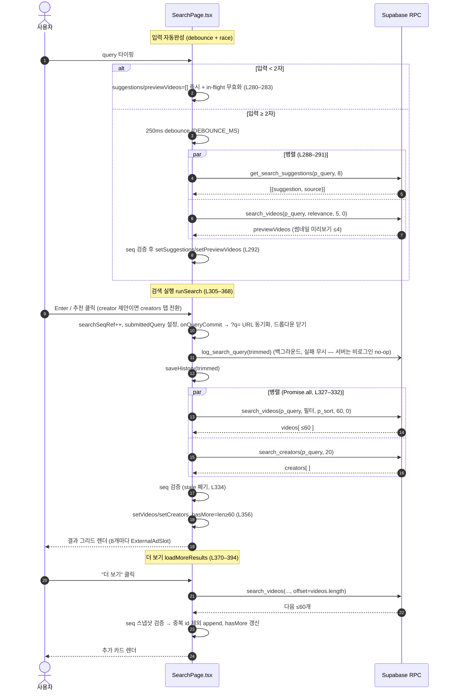
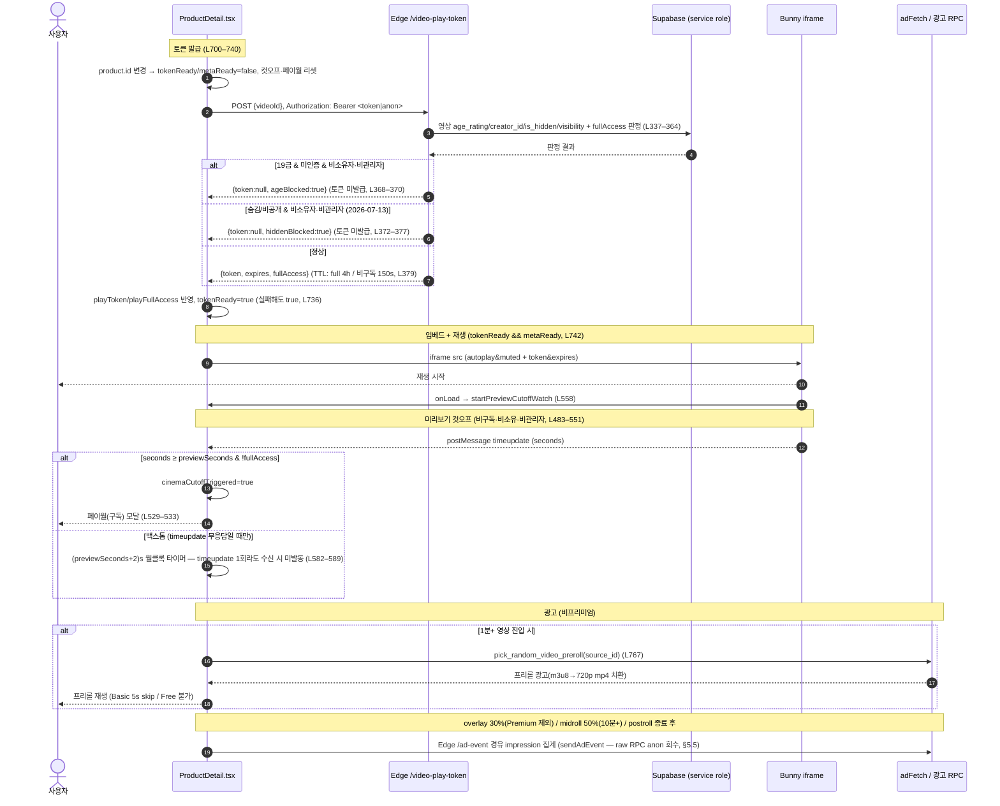
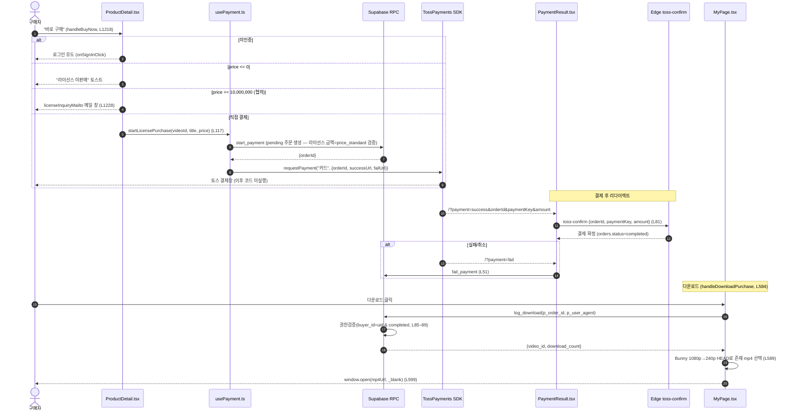

# 04. 검색 · 영상상세 · 재생 · 라이선스 — 상세 명세

> 본 문서는 실제 코드를 읽고 작성한 심화 명세서다. 모든 동작·계약은 아래 파일을 근거로 한다(file:line).
> - 검색 UI: `src/app/components/SearchPage.tsx`
> - 영상상세/재생/광고/구매 진입: `src/app/components/ProductDetail.tsx`
> - 검색 RPC 정본: `supabase/search_feed_audit_20260710.sql` + `supabase/search_feed_audit2_20260710.sql` (`search_creators`·`search_logs` 테이블만 `supabase/phase12_search_enhancements.sql` 유지)
> - 재생 토큰 Edge: `supabase/functions/server/index.ts` (`/video-play-token`, L327–387)
> - 라이선스 가격 정책: `src/app/utils/licensePricing.ts`
> - 결제 훅: `src/app/hooks/usePayment.ts` · 결제 금액검증: `supabase/payment_amount_standard_only_20260711.sql`
> - 상세 광고 fetch/impression/click: `src/app/utils/adFetch.ts` + `src/app/utils/adEvent.ts` (Edge `/ad-event` 경유)
> - 다운로드 로그 RPC: `supabase/phase29_download_logs.sql` (`log_download`)
> - 다운로드 트리거 UI: `src/app/components/MyPage.tsx` (`handleDownloadPurchase`, L584–)
> - 결제 확정: `src/app/components/PaymentResult.tsx` (`toss-confirm` 호출)
>
> **📌 개정 2026-07-13 — 전수 감사 반영.** 검색 RPC 정본 교체(LIKE 이스케이프·`v.id` tiebreak·정지 크리에이터 제외),
> 검색 초기상태의 **디스커버리 화면** 전환, 재생토큰 **서버 게이트 2종(ageBlocked/hiddenBlocked)**, 광고 집계 Edge `/ad-event`
> 경유 등. 본문 인용 라인은 개정일 시점 근사치(파일이 계속 자라 미세 오차 가능 — 표/함수명이 정본).

---

## 1. 개요 / 목적

CREAITE의 콘텐츠 탐색–시청–수익화 핵심 경로를 담당하는 3개 영역의 통합 명세.

1. **통합 검색** — 영상/크리에이터를 제목·태그·크리에이터명으로 ilike 매칭, 자동완성·인기검색어·검색기록·필터·정렬·페이지네이션 제공. (`SearchPage.tsx`)
2. **영상상세 + 재생** — Bunny Stream iframe 플레이어를 서버 재생토큰(페이월)으로 게이팅하고, 비구독자에게 1분 미리보기·광고(프리롤/범퍼/미드롤/오버레이/포스트롤)·연속재생을 제공. (`ProductDetail.tsx`)
3. **라이선스 구매 + 다운로드** — 단일가(All-in-One) 라이선스를 토스페이먼츠로 결제하고, ₩1,000만 이상은 1:1 협의 판매로 분기. 구매 완료 후 MyPage에서 권한 검증을 거쳐 Bunny mp4를 다운로드. (`usePayment.ts`, `licensePricing.ts`, `log_download`)

**목표:** URL 추출로 프리미엄 콘텐츠를 우회 시청하거나 무단 다운로드하지 못하도록 서버 측 권한 판정(재생토큰·다운로드 RPC)을 강제하면서, 비구독자 유입(미리보기·광고)과 결제 전환을 극대화한다.

---

## 2. 사용자 스토리

- 방문자로서, 검색어 2글자 이상 입력 시 자동완성(제목 prefix/포함, 크리에이터명)을 보고 싶다.
- 방문자로서, 검색창이 비어 있을 때 최근 검색기록과 실시간 인기검색어를 보고 싶다.
- 사용자로서, 카테고리·AI도구·길이로 결과를 좁히고 관련도/최신/조회수/좋아요로 정렬하고 싶다.
- 사용자로서, 결과가 많으면 "더 보기"로 다음 60개를 이어 보고 싶다.
- 비구독자로서, 어떤 영상이든 1분 미리보기를 본 뒤 구독 유도를 받고 싶다.
- 프리미엄 구독자/영상 소유자/라이선스 구매자/관리자로서, 컷오프 없이 전체를 시청하고 싶다.
- 시청자로서, 영상 종료 시 다음 추천 영상이 자동으로 이어지길 원한다.
- 구매자로서, 라이선스를 즉시 구매(장바구니 우회)하고 결제 후 다운로드하고 싶다.
- 고가 라이선스 구매 희망자로서, 직접 결제 대신 운영팀과 협의할 창구를 원한다.
- 운영자로서, 무단 공유 분쟁 시 누가/언제/어떤 브라우저로 다운로드했는지 추적하고 싶다.

---

## 3. 화면 & 상태

### 3.1 검색 (`SearchPage.tsx`)

- **검색 입력 헤더** (L490–653): sticky 상단, 검색 input + 닫기(onClose 있을 때) + 필터 토글 버튼.
- **자동완성/기록/인기 드롭다운** (L523–638):
  - 입력 ≥2자 → `suggestions` 렌더 (source가 `creator`면 배지 표시, L544–546) + **매칭 영상 썸네일 미리보기**(유튜브식, `previewVideos` — `search_videos` 5개 조회 후 차단 사용자 제외 4개 표시, 19+ 블러, L552–578).
  - 입력 <2자 → `history`(최근검색, 개별 X·전체삭제) + `popular`(인기, 순위·hit_count) 렌더.
  - 드롭다운 노출 조건: `showDropdown && (입력≥2 ? (suggestions>0 || previewVideos>0) : history>0 || popular>0)` (L525).
  - **크리에이터 제안 클릭 → `creators` 탭 전환**(`handlePickSuggestion`, `source==='creator'`면 `setTab("creators")` — 영상 탭 텍스트검색만 되던 비대칭 해소, L421–426).
- **필터 패널** (L655–689): `FilterChips`로 카테고리(`CATEGORY_OPTIONS`)·AI도구(`AI_TOOL_OPTIONS`)·길이(`DURATION_OPTIONS`).
- **탭 + 정렬** (L691–727): `videos`/`creators` 탭(각 결과 개수 표시), 정렬 select(`SORT_OPTIONS`). **검색/필터 활성 시에만 노출**(`submittedQuery || hasActiveFilter`, L692). creators 탭은 `submittedQuery` 없으면 disabled(L705).
- **결과 영역** (L730–949):
  - 로딩: 스피너(L732–735).
  - 초기상태(`showInitialState`, L482): **디스커버리 화면**(L736–890, 검색 전 허전함 방지). 위에서부터:
    1. **이어보기**(최근 시청) — 로그인 시 `get_my_watch_history(12)` 가로 스크롤(안전뷰 아님이라 표시만, 클릭 시 상세서 최종 게이트. L738–760).
    2. **최근 검색** 칩(개별 X·전체 삭제, L762–784).
    3. **카테고리 둘러보기** 칩 — 클릭 시 카테고리 필터 설정 → 필터변경 이펙트가 검색 실행(L786–800).
    4. **인기 태그** — 트렌딩 영상 tags 빈도 top 12(`challenge:` 접두 제외, L802–818).
    5. **실시간 인기 검색** 6개 그리드(L820–835).
    6. **지금 뜨는 영상** 8개 그리드 — `get_home_feed_order('popular')` top~60 → `get_home_feed_by_ids`(안전뷰라 숨김/비공개 제외, L206–245·L837–850).
    7. **카테고리별 캐러셀** — 트렌딩 60편을 카테고리로 그룹화, 4편+ 카테고리 상위 4개(각 최대 12편, L852–877).
    8. **추천 크리에이터** — `get_popular_creators(8)` `CreatorRow` 리스트(L879–889).
  - 영상 결과 비었음: `EmptyResult`(L893).
  - 영상 그리드: 2/3/4열 반응형 `VideoCard` + **결과 8개마다 `ExternalAdSlot` 1개**(전체 폭, `EXTERNAL_ADS_ACTIVE`일 때만·마지막 뒤엔 미삽입, L910–920) + "더 보기" 버튼(L924–934).
  - 크리에이터 결과: `CreatorRow` 리스트(L942–946) 또는 `EmptyResult`(subject=크리에이터).
- **URL 동기화**: 검색 확정 시 `onQueryCommit(trimmed)`으로 부모에 통지 → **`?q=` URL 동기화**(새로고침/링크 공유 시 검색어 복원, L93·L309).

**상태 변수** (L141–182): `query`, `submittedQuery`, `tab`, `category`/`aiTool`/`durationIdx`/`sort`/`showFilters`, `videos`/`creators`/`loading`/`hasMore`/`loadingMore`, `suggestions`/`history`/`popular`/`showDropdown` + 디스커버리 `trendingVideos`/`discoverCreators`/`previewVideos`/`watchHistory`/`popularTags`/`categoryRows`(L167–173). race 가드 `searchSeqRef`·`suggestSeqRef`(L181–182), debounce `debounceRef`(L180).

### 3.2 영상상세 (`ProductDetail.tsx`)

- **플레이어 영역** (aspect-video, max-h 40vh 모바일/65vh 데스크탑):
  - `iframeBlocked`이면 페이월 차단 화면(블러 썸네일 + 구독 CTA).
  - `bunnyEmbedUrl` 있으면 iframe(`loading="eager"`, `onLoad={startPreviewCutoffWatch}`).
  - `!tokenReady || !metaReady`이면 썸네일 + 로딩 스피너(L1355).
  - 그 외(토큰·메타 준비 완료·임베드 URL 없음)이면 "재생 불가" 안내.
  - 오버레이/미드롤/포스트롤/범퍼/프리롤 광고 슬롯, 연속재생 `NextVideoOverlay`, AUTOPLAY 인디케이터, 스폰서 배지, 1분 미리보기 배지 + 닫기 X. ※ 길이 배지는 **의도적으로 제거됨**(Bunny 컨트롤바가 경과/총시간 표시해 중복 + 재생영역 탭을 삼키는 문제, L1496 주석) — 재감사 시 "누락 버그" 오인 금지.
- **메타 영역**: 제목/연령배지/길이/조회수/좋아요/OTT 배지(L1396–1429), 크리에이터(아바타·이름·팔로우·편집)(L1430–1465).
- **헤더 액션**: 비구독자 "구독하고 전체 보기" CTA(L1470–1485) + 좋아요/댓글/공유/저장/신고 5원형(L1487–1558).
- **줄거리 + 사이드 메타**(L1562–1594), **시리즈 회차 목록**(L1597–1644), **챕터 리스트**(L1647–1671), **자막 안내**(L1674–1679).
- **라이선스 카드** (L1682–1831): 판매가능(`isLicensable`)이면 단일가 박스 + 9개 특전 + 장바구니/구매(또는 협의 문의), 청약철회 고지; 비판매(₩0)이면 회색 비활성 카드.
- **태그**(L1836–1850), **시네마 크레딧**(L1853–1903), **AI 제작 상세**(L1906–1937), **출처·라이선스**(L1940–1957), **함께 시청된 콘텐츠 캐러셀**(L1963–1974).
- **댓글 패널**: 데스크탑 사이드 패널(L1979–1998) / 모바일 시트(L2001–2020).
- **모달들**: 구독(L2025–2030), 신고(L2033–2040), 영상편집(본인, L2043–2086), 연령게이트(L2089–2099)·19+ 잠금 오버레이(L2102–2118), 공유(L2121–2128), 플레이리스트(L2131–2143).

---

## 4. 동작 흐름

### 4.1 검색 흐름

- **자동완성(debounce + race)** (L276–303): `query` 변경 → 250ms(`DEBOUNCE_MS`) debounce → `get_search_suggestions` + `search_videos`(썸네일 미리보기 5개) **병렬 호출**(L288–291). `suggestSeqRef`로 늦게 도착한 이전 입력 폐기(L292). 입력 <2자면 즉시 비움(+in-flight 무효화, L280–283).
- **검색 실행 `runSearch`** (L305–368):
  1. `searchSeqRef` 증가, `submittedQuery` 설정, **`onQueryCommit(trimmed)`로 `?q=` URL 동기화**(L309), 드롭다운 닫기.
  2. trim된 검색어가 있으면 `saveHistory`(L313) + `log_search_query` 백그라운드 호출(실패 무시, L316. 서버는 비로그인이면 no-op — §5.1).
  3. `rpcParams` 구성: `p_query/p_sort/p_limit=60/p_offset=0` + (전체 아님일 때만) `p_category/p_ai_tool/p_min_duration/p_max_duration`(L320–325).
  4. `Promise.all`로 `search_videos` + (검색어 있을 때만)`search_creators` 병렬 호출(L327–332).
  5. **race 가드**: `seq !== searchSeqRef.current`이면 결과 폐기(L334).
  6. 결과 세팅. showcase(관리자)면 mock도 검색어로 필터해 머지(L344–354). `hasMore`는 RPC 원본 길이 ≥60 여부(L356).
- **필터/정렬 변경 자동 재검색** (L402–408): `submittedQuery!=="" || hasActiveFilter`일 때만 `runSearch(submittedQuery)`. 디스커버리의 "카테고리 둘러보기"도 이 경로로 검색 실행(L439–).
- **초기 검색어 자동 검색** (L410–414): `initialQuery` 있으면 마운트 1회(홈 검색바/`?q=` 복원 → 결과 페이지).
- **더 보기 `loadMoreResults`** (L370–394): `p_offset=videos.length`로 다음 60개 호출, **중복 id 제외**하며 append(L385–388), `hasMore` 갱신. 요청 시점 `searchSeqRef` 스냅샷으로 새 검색 시작 시 페이지 폐기(L373·383).

### 4.2 상세: 토큰 발급 → iframe → 재생 → 컷오프 → 광고 → 연속재생

- **재생토큰 발급** (L700–740): `product.id` 변경 시 `tokenReady=false`·`playFullAccess=false` + 컷오프/페이월/timeupdate 수신 플래그 리셋(L701–713) 후 `PLAY_TOKEN_ENDPOINT` POST.
  - 헤더: `apikey`(anon), `Authorization: Bearer <session access_token || anonKey>`(L721–725).
  - 응답 `{token, expires, fullAccess}`(서버 게이트 발동 시 `ageBlocked`/`hiddenBlocked` 동반, §5.2)을 `playToken`·`playFullAccess`에 반영(L730–731). 실패해도 `tokenReady=true`로 마무리(L736).
- **임베드 URL 구성** (L742–744): `BUNNY_LIBRARY_ID && product.id && tokenReady && metaReady`일 때만 생성 — **`metaReady`(videos 메타 fetch 판정 종료, L326·398)도 요구**해 연령등급 등 판정 전 재생 보류·영상 전환 시 이전 메타 잔류 방지. `autoplay=true&loop=false&muted=true&preload=true&responsive=true` + (token 있으면)`&token=...&expires=...`. token이 null이면 토큰 없이 재생(무중단 전환).
- **미리보기 컷오프** (L483–551, 보강 L558–591):
  - `needsPreviewCutoff = durationSeconds > previewSeconds && !isSubscriber && !playFullAccess && !isMyVideo && !profile?.is_admin`(L461–462) — **본인(소유자)·관리자는 클라이언트가 즉시 아는 면제 대상**이라 서버 fullAccess 회신 전에도 컷오프 제외.
  - player.js `postMessage`로 `timeupdate` 구독, `seconds >= previewSeconds` 도달 시 `cinemaCutoffTriggered=true` + 페이월 모달(L525–534). **영상 시간 기준**이라 시킹 점프도 즉시 차단.
  - 보강: iframe `onLoad`마다 `startPreviewCutoffWatch` — ready 레이스 대비 400ms×10회 능동 재구독(L577–581) + `(previewSeconds+2)초` 월클록 백스톱(L582–589). **백스톱은 `timeupdate`를 1회라도 수신했으면 미발동**(`gotTimeupdateRef`, L478·585 — 정상재생·일시정지 방치 시 조기컷 방지, player.js 완전 무응답일 때만 발동). 새 영상 전환 시 수신 플래그 리셋(L713).
- **광고**:
  - **프리롤**(L746–793): 1분+ & 비프리미엄 영상에서 영상 변경 시 1회 `pick_random_video_preroll` RPC. m3u8→720p mp4 치환. basic은 5초 후 skip, 그 외 skip 불가. preroll 잡히면 bumper 취소(L1079).
  - **범퍼**(L1056–1077): 비프리미엄 시작 직후, `fetchAdForVideo(...,'bumper')`, basic=5초 skip/free=skip불가, 본편 pause. 프리롤을 이미 본 세션은 스킵(2연속 방지, L1064).
  - **오버레이**(L888–964): 1분+, 25% 지점부터 fetch, 광고의 `trigger_position_pct`(기본 30%) 도달 시 하단 배너 노출 + `recordAdImpression`. **Premium 제외**(preroll/bumper와 동일 정책으로 보완, L896).
  - **미드롤**(L967–1050): 10분+(`minDurationForMidroll`||600) & 비구독자, 48%부터 fetch, `trigger_position_pct`(기본 50%) 도달 시 본편 pause + 풀스크린 광고.
  - **포스트롤**(L1085–, L1165): 영상 종료 후 비구독자에게 `fetchAdForVideo(...,'postroll')`, 광고 종료 콜백에서 `NextVideoOverlay` 노출.
  - impression/click 집계는 전부 **Edge `/ad-event` 경유**(§5.5 — raw RPC는 anon 회수됨).
- **연속재생**(L1100–1210): player.js `ended`(+`timeupdate` 폴백, 종료 0.6초 전) 구독 → `triggerNext`(L1122): similar→trending(24h)→new(30일) 3단 폴백으로 다음 영상 선정 → (비구독자)포스트롤 후 → `NextVideoOverlay` 8초 카운트다운(L1444).

### 4.3 구매 흐름: start_payment → 토스 → confirm → 다운로드

- **즉시 구매 `handleBuyNow`** (L1218–1251):
  1. 미인증이면 `onSignInClick`(L1219–1222).
  2. `price<=0`이면 "라이선스 미판매" 토스트(L1223–1226).
  3. `isNegotiationOnly(price)`이면 `licenseInquiryMailto`로 메일 창(L1228–1231).
  4. `startLicensePurchase`(L1235–1241) — 성공 시 토스 결제창으로 이동(이후 코드 미실행). 취소(`USER_CANCEL`)/실패 처리(L1243–1250).
  - ※ 장바구니 담기(`handleAddToCart`, L1253–)는 **항상 `"standard"`로 담김** — 카트 타입에 남은 `licenseType: "standard"|"commercial"|"extended"`는 단일가(All-in-One) 정책 이전의 **표기 잔재**(§6).
- **결제 SDK 흐름 `usePayment.ts`**:
  - `start_payment` RPC로 pending 주문 + `orderId` 발급(L36–45) → 실패 시 throw. 라이선스 금액은 서버가 `p_amount = v.price_standard` **단일가로만 검증**(`payment_amount_standard_only_20260711.sql` — 표시가보다 싸게 결제하는 우회 차단).
  - ※ [기록] 위 SQL의 라이선스 분기에 있던 `v.id = p_target_id::uuid` 캐스트 버그(`videos.id`는 TEXT — `text = uuid` 연산자 없음(42883)으로 라이선스 결제 시작이 전면 실패하는 잠재 회귀)는 **2026-07-13 파일 수정 완료** — DB에는 **수정본 재적용 필요 상태**.
  - `loadTossPayments` → `requestPayment("카드", {...})`(L51–60), `successUrl=/?payment=success`, `failUrl=/?payment=fail`.
  - `startLicensePurchase`(L117–): `paymentType:"license"`, `orderName:"라이선스 — <title>"`, `targetId:videoId`.
- **결제 확정 `PaymentResult.tsx`**: 성공 리다이렉트의 `orderId/paymentKey/amount`로 `toss-confirm` Edge 호출(L21·L81–88). 실패/취소 리다이렉트는 `fail_payment` RPC(L51).
- **다운로드 `MyPage.handleDownloadPurchase`** (L573–607):
  1. `log_download(p_order_id, p_user_agent=navigator.userAgent)`(L577–580) — 권한검증 + 로그 INSERT + `video_id` 반환.
  2. Bunny 호스트(`VITE_BUNNY_HOSTNAME`||`vz-<libId>.b-cdn.net`, L585)로 1080p→240p 순서 HEAD 요청해 실제 존재하는 mp4 선택(L589–597).
  3. `window.open(mp4Url, '_blank', 'noopener,noreferrer')` + 성공 토스트(L599–600). cross-origin이라 `<a download>` 무시될 수 있어 새 탭 방식(L572).

---

## 5. 데이터 / RPC 계약

### 5.1 검색 RPC (정본: `search_feed_audit_20260710.sql` + `search_feed_audit2_20260710.sql`)

> **⚠️ 정본 교체(2026-07-10 감사):** `phase12_search_enhancements.sql`은 최초 정의일 뿐 — **재실행 금지**(회귀).
> `search_videos`·`get_search_suggestions` 최종본은 **audit2**, `log_search_query`·`get_popular_searches`는 **audit**.
> **`search_creators`와 `search_logs` 테이블만 phase12 유지.**

- **`search_videos`** (audit2 L40–116) — 인자: `p_query=''`, `p_category=NULL`, `p_ai_tool=NULL`, `p_min_duration/p_max_duration=NULL`, `p_max_price=NULL`, `p_sort='relevance'`, `p_limit=30`, `p_offset=0`. 반환: `id,title,thumbnail,video_url,creator,creator_id,creator_display_name,creator_avatar,category,tags,ai_tool,duration,duration_seconds,views_count,likes,price_standard,created_at,match_score`(phase12와 동일 시그니처). 소스는 `v_available_videos` 뷰(숨김/비공개 사전 제외). match_score: 제목 prefix=3 / 제목 포함=2 / 태그·크리에이터 포함=1. `SECURITY DEFINER STABLE`, GRANT anon+authenticated. **감사 반영 3종:**
  - **LIKE 이스케이프**(`v_esc` — `%`·`_`·`\` 리터럴화. "50%"/"a_b" 같은 검색어가 패턴으로 오작동하던 것 방지, audit2 L61).
  - **결정적 tiebreak**: ORDER BY 말미 `v.created_at DESC, v.id`(동일 시각 대량적재분의 페이지 경계 중복/누락 차단, audit2 L111).
  - **정지 크리에이터 제외**: `NOT EXISTS(profiles.is_suspended=true)`(크리에이터 검색·인기와 일관 — "리스트에선 사라지는데 영상은 뜸" 자기모순 해소, audit2 L91–94).
- **`search_creators`** (phase12 L255–286 **유지**) — 인자: `p_query`, `p_limit=20`. 반환: `creator_id,display_name,avatar_url,bio,video_count,follower_count`. `display_name` ilike + `is_suspended=false`, 팔로워→영상 수 순. 빈 쿼리(`lq=''`)면 결과 없음.
- **`get_search_suggestions`** (audit2 L119–161) — 인자: `p_query`, `p_limit=8`. 반환: `suggestion,source('title'|'creator')`. 제목 prefix(rank1)/포함(rank2)/크리에이터 포함(rank3) UNION 후 `DISTINCT ON (lower(suggestion))` 최선 rank만, rank→가나다 정렬(prefix 상위 보장). **정지 크리에이터의 제목·이름 제안 제외**(audit2).
- **`get_popular_searches`** (audit L107–122) — 인자: `p_limit=10`, `p_days=7`. 반환: `query,hit_count`. `search_logs` 최근 N일 lower(query) 집계 — **`COUNT(DISTINCT user_id)`로 1인 반복 인플레 차단**(`user_id IS NOT NULL`만 집계, 인기검색 조작 방지).
- **`log_search_query`** (audit L92–104) — 인자: `p_query`. **비로그인(`auth.uid()` NULL)이면 무시 — anon 로깅 차단**(인기검색 어뷰징·스팸 표면 축소). 2–100자만 INSERT. `SECURITY DEFINER`.
- **`search_logs` 테이블**(phase12 L24–43): `query` 2–100자 CHECK, RLS는 본인 SELECT만, INSERT는 RPC만.

### 5.2 재생 토큰 Edge (`/video-play-token`, `index.ts` L327–387)

- **요청**: POST body `{videoId}`. 헤더 `Authorization: Bearer <token>`(선택).
- **응답**: `{token, expires, fullAccess}` (게이트 발동 시 `ageBlocked` 또는 `hiddenBlocked` 플래그 동반).
  - `BUNNY_TOKEN_AUTH_KEY` 미설정 → `{token:null, expires:null, fullAccess:false}`(L333, 무중단 전환).
  - 영상 조회: `videos`에서 `age_rating, creator_id, is_hidden, visibility` 1회 조회(service role, L337).
  - `fullAccess` 판정(L340–364): 인증 사용자 중 ① 프리미엄(tier='premium' & expires 미래) 또는 is_admin(L352–357), ② 영상 소유자(`videos.creator_id===user.id`, L348), ③ 라이선스 구매자(`orders` buyer_id+video_id+status='completed', L359–361).
  - **서버 게이트 2종(토큰 자체 미발급 — 미리보기 150초도 불가):**
    1. **`ageBlocked`(청소년보호)**: 19금(`age_rating='19'`) & 연령 미인증 & 비소유자 & 비관리자 → `{token:null, ..., ageBlocked:true}`(L368–370). 클라 블러/게이트가 우회돼도 Bunny 토큰인증 ON 시 CDN이 거부.
    2. **`hiddenBlocked`(모더레이션, 2026-07-13 추가)**: 숨김(`is_hidden=true` — 검수 대기·재검수·신고누적) 또는 비공개(`visibility='private'`) & 비소유자 & 비관리자 → `{token:null, ..., hiddenBlocked:true}`(L372–377). ID 직링크(`?video=<id>`)로 미검수 본편이 재생되던 우회 차단. **unlisted는 링크 공유가 목적이라 발급 유지**(관리자=검수 화면, 소유자=본인 미리보기 예외).
  - **TTL**: `fullAccess`면 4시간, 아니면 150초(L379). `expires=now+ttl`(초), `token=sha256Hex(securityKey+videoId+expires)`(L380–381).
- 클라이언트 매핑(`ProductDetail.tsx:730-731`): `playToken={token,expires}`, `playFullAccess=!!fullAccess`.

### 5.3 가격 / 라이선스 (`licensePricing.ts`)

- `LICENSE_DIRECT_MAX = 10_000_000`(L9) — 직접 결제 상한(미만).
- `isNegotiationOnly(price)`(L12–14) — `price >= 10,000,000`이면 true.
- `licenseInquiryMailto(title, price)`(L17–25) — `support@creaite.net` 사전입력 메일 링크.

### 5.4 다운로드 (`log_download`, `phase29_download_logs.sql` L63–106)

- 인자: `p_order_id uuid`, `p_user_agent text=NULL`. 반환: `video_id text, download_count integer`.
- 권한검증: `orders.id=p_order_id AND buyer_id=auth.uid() AND status='completed'`(L85–89). 미해당 시 예외(L91–93). 미로그인 시 예외(L80–82).
- `download_logs` INSERT(L96–97) 후 해당 주문 누적 다운로드 수 반환(L100–104). `SECURITY DEFINER`, `GRANT ... TO authenticated`(L108).
- `download_logs` 테이블(L30–47): order/video/user FK + user_agent + downloaded_at. RLS는 본인 SELECT만(L54–57), INSERT는 RPC만.

### 5.5 상세 광고 fetch/집계 (`adFetch.ts` + `adEvent.ts`)

- `fetchAdForVideo(videoId, format)`(adFetch L30–57) — `get_ad_for_video(p_video_id, p_format)` 1개 반환, **1분 TTL 모듈 캐시**(null도 캐시, L26–51).
- **집계는 RPC 직접호출이 아니라 Edge `/ad-event` 경유**(`adEvent.sendAdEvent` — raw RPC `record_ad_*`/`increment_ad_*`는 **anon 회수됨**, `ad_fraud_hardening_edge_20260628.sql`). Edge가 신뢰 IP + 로그인 식별(auth.uid) + IP 다양성 가드 후 집계.
  - `recordAdImpression(...)`(adFetch L59–74) — `sendAdEvent("video_impression", adId, {videoId, format, positionSeconds, completed, skipped})`.
  - `recordAdClick(...)`(adFetch L76–79) — `sendAdEvent("video_click", ...)`.
  - `viewer_key`(session key)는 body로 Edge에 전달(익명 식별 — 서버가 로그인 시 auth.uid 우선). ※ 구판의 "`record_ad_impression` RPC + `p_viewer_key` 인자" 서술은 **무효**.
- 프리롤은 별도 RPC `pick_random_video_preroll(p_source_video_id)`(ProductDetail L767).

---

## 6. 비즈니스 규칙

- **미리보기 1분 통일** (정책 v2, ProductDetail L50): 비구독자는 모든 영상 1분(`cinemaPreviewSeconds`, 동적, fallback 60초 L53·443) 미리보기. OTT도 즉시 차단 대신 1분 미리보기(카드엔 🔒 프리미엄 배지, L451).
- **풀액세스 면제**: 프리미엄·소유자·라이선스 구매자·관리자(서버 `/video-play-token` 판정 index.ts L340–364, 클라 `playFullAccess`로 컷오프 면제). **본인·관리자는 클라이언트에서도 즉시 면제**(`needsPreviewCutoff`에 `!isMyVideo && !profile?.is_admin`, L461–462 — 서버 회신 전 컷오프 오발동 방지).
- **연령 게이트** (Phase 26): `age_rating==='19'` & 미인증 & 비소유자면 진입 시 자동 게이트 + 19+ 잠금 오버레이. 검색 카드에도 19+ 블러+잠금. **서버 강제**: 재생토큰 Edge가 19금 미인증에 토큰 자체를 미발급(`ageBlocked`, §5.2).
- **모더레이션 재생 게이트** (2026-07-13 추가): 숨김(`is_hidden`)·비공개(`private`) 영상은 소유자·관리자 외 재생토큰 미발급(`hiddenBlocked`, §5.2) — ID 직링크 우회 차단. unlisted는 발급 유지.
- **티어별 토큰 TTL**: 풀액세스 4시간 / 비구독자 150초(index.ts L345). 150초는 1분 미리보기를 충분히 커버하면서 URL 추출 후 장편 우회 시청을 차단.
- **단일가 / 협의 판매**: 단일가(All-in-One) 라이선스. ₩1,000만 이상은 토스 한도로 직접결제 불가 → 1:1 협의 판매(licensePricing.ts L1–14, ProductDetail L1832–1888). ※ 카트 타입(`App.tsx`·`CartPanel.tsx`)의 `licenseType: "standard"|"commercial"|"extended"`는 구 3단가 정책의 **표기 잔재** — 담기는 항상 `"standard"`(ProductDetail `handleAddToCart` L1255), 서버 금액검증도 `price_standard` 단일(§4.3).
- **₩0 영상 판매불가**: `isLicensable = price>0`(L441). ₩0은 무료 시청 전용, 라이선스 미판매 회색 카드(L1817–1830).
- **광고 티어 정책**: Premium=광고 제거 / Basic=5초 후 skip / Free=skip 불가(프리롤·범퍼). **오버레이도 Premium 제외**(preroll/bumper와 동일 정책으로 보완, L896). 미드롤·포스트롤은 구독자(`isSubscriber`) 제외.
- **청약철회 제한**: 다운로드·시청 시작 시 청약철회 제한 고지(전자상거래법 제17조, 결제 버튼 하단 L1797–1803).
- **3분 미만 판매불가**: 상세/검색/결제 경로에는 게이트 없음. 업로드 시 강제 — 클라 UI(`Upload.tsx`, duration<180 시 가격칸 숨김) + **서버 backstop**(save-metadata 가 duration<180 이면 price를 0으로 강제, `functions/server/index.ts`, 2026-06-28). API 직접호출 우회 차단.

---

## 7. 엣지 케이스 & 에러 처리

- **검색 빈 쿼리**: `runSearch('')`는 creators를 호출하지 않고 `[]` 반환(L329–331). `search_videos`는 빈 쿼리(`v_lq=''`)면 전체를 match_score=0으로 반환(필터만 적용, audit2 L81).
- **검색 race**: 자동완성·검색 모두 seq 가드로 늦게 도착한 응답 폐기(L292·334). `finally`도 최신 seq일 때만 `setLoading(false)`(L366).
- **검색 실패**: `search_videos` 에러 시 토스트 + 결과 비움(L336–340); `search_creators` 에러는 조용히 `[]`(L359–361).
- **토큰 발급 실패/콜드스타트**: fetch 예외여도 `token=null`로 두고 `tokenReady=true`(L733–736) → 토큰 없이 재생 시도. Token Auth 미활성 단계에서는 항상 token=null(index.ts L333). ※ `ageBlocked`/`hiddenBlocked` 응답도 token=null — Token Auth 활성 시 CDN 재생 차단(§5.2).
- **토큰/메타 준비 중 UI**: `!tokenReady || !metaReady`면 차단 화면 대신 썸네일+스피너(L1355).
- **광고 동시 노출 방지**: preroll 잡히면 bumper 취소(L1079) + 프리롤 본 세션은 bumper 스킵(L1064); overlay는 midroll 표시 중 숨김(L1385); 스폰서 배지는 bumper/midroll/postroll 중 숨김(L1040). 영상 전환 중 stale 광고는 `cancelled` 가드로 차단.
- **player.js ready 레이스**: timeupdate 구독을 ready 이벤트 + 능동 재구독(interval, 1.5s×60회 / onLoad 후 400ms×10회) + 즉시 시도로 3중 방어(컷오프 L537–551, 보강 L577–581).
- **ended 미발생 영상**: `timeupdate`로 종료 0.6초 전 폴백 감지(L1195–1202).
- **자막/챕터 없음**: `videoMeta.chapters.length>0` / `subtitle_url` 조건부 렌더 → 없으면 섹션 미표시.
- **다운로드 mp4 없음**: 전 해상도 HEAD 실패 시 "인코딩 처리 중" 에러 throw(MyPage `handleDownloadPurchase`).
- **showcase 머지**: 관리자(`shouldShowShowcase`)만 mock 결과를 검색어로 필터해 추가(L178·344–354).

---

## 8. 성능

- **검색 debounce 250ms** + seq 가드로 과도 RPC·결과 깜빡임 방지(L276–303).
- **페이지네이션**: 60개 단위 offset, 중복 id Set 제거로 append(L370–394).
- **연령등급 일괄 조회**: 카드용 `useAgeRatings(allVideoIds)` 1회(L474–480), demo- 접두 제외. **`allVideoIds`에는 표시되는 모든 소스**(검색결과 + 디스커버리 트렌딩·카테고리 캐러셀·썸네일 미리보기·이어보기)가 포함(L475) — 누락 시 19금 fail-open 무블러(검색피드 SSOT).
- **visible 필터 useMemo**: 차단 사용자 필터를 타이핑마다 재계산 않도록 메모.
- **iframe `loading="eager"`**: 토큰·메타 준비되면 즉시 로드 — 재생 시작 지연 최소화.
- **광고 1분 캐시**(adFetch L26–51): 재시청 시 `get_ad_for_video` 중복 호출 제거(null도 캐시).
- **재생 시작 지연 요인**: ① 토큰 Edge 왕복(콜드스타트 가능) → tokenReady 게이트, ② videos 메타 fetch → metaReady 게이트(L742), ③ 프리롤/범퍼 광고가 본편 앞에 풀스크린, ④ player.js ready 대기. 토큰은 `product.id`마다 매번 재발급(prefetch 없음 — §12).

---

## 9. 권한 / 보안

- **재생 페이월**: 토큰 TTL을 서버가 권한별 차등 발급(150초/4시간, index.ts L379). Bunny Embed Token Auth 활성 시 토큰 없으면 재생 불가 → URL 추출 우회 차단.
- **재생토큰 서버 게이트 2종**(§5.2): ① 19금 미인증 `ageBlocked` — 클라 블러/게이트 우회돼도 토큰 미발급, ② 숨김/비공개 `hiddenBlocked`(2026-07-13 추가) — ID 직링크로 미검수 본편 재생되던 우회 차단. 둘 다 소유자·관리자 예외, Token Auth ON 시 CDN이 최종 거부.
- **임베드 토큰 인증**: `token=sha256Hex(securityKey+videoId+expires)`(L381) — securityKey는 서버 환경변수, 클라엔 미노출.
- **fullAccess 서버 판정**: 프리미엄/소유자/구매자/관리자 모두 admin 클라이언트(service role)로 DB 직접 확인(L340–364) — 클라 위변조 불가.
- **숨김/비공개/정지 누출 방지**: 검색은 `v_available_videos` 뷰만 조회 → 숨김/비공개 영상 결과 미노출. **정지(is_suspended) 크리에이터는 3면 일관 제외** — `search_creators`(phase12) + `search_videos`·`get_search_suggestions`(audit2, §5.1).
- **인기검색 조작 방지**: `log_search_query` anon 차단 + `get_popular_searches` `COUNT(DISTINCT user_id)`(§5.1).
- **광고 집계 위조 방지**: raw RPC anon 회수 → Edge `/ad-event`가 신뢰 IP·auth.uid·IP 다양성 가드 후 집계(§5.5).
- **다운로드 소유검증**: `log_download`가 `buyer_id=auth.uid() & status='completed'`를 RPC 내부에서 검증(L85–93), `download_logs` INSERT는 SECURITY DEFINER RPC만(RLS INSERT 정책 없음).
- **상세 메타 fetch**: `videos` 테이블 직접 select(L335–347)는 RLS 의존 — 비공개 영상의 **메타 텍스트** 보호는 테이블 RLS 책임(본 컴포넌트는 별도 검증 안 함). ※ **재생 자체는 `hiddenBlocked` 토큰 게이트로 서버 강제됨**(2026-07-13) — 남는 표면은 메타 노출뿐. 검증 권장.

---

## 10. 분석 / 이벤트

- **검색 로그**: `log_search_query(trimmed)` 검색 시 백그라운드(실패 무시, L316) → `search_logs` → `get_popular_searches` 집계. **로그인 사용자만 적재**(비로그인 로깅 차단), 인기검색 집계는 **`COUNT(DISTINCT user_id)`**(1인 반복 인플레 차단, §5.1).
- **조회수**: 페이월 통과 시청 시 30% 도달 1회 `trackVideoView`(L658–661), 미달이어도 5초+면 unmount 시 기록(L680–682). 상세 진입 시 카운트 최신화.
- **다운로드**: `log_download`로 `download_logs` 적재 + 누적 횟수 반환(분쟁 추적 근거, phase29 L46–47).
- **광고**: impression/click 전부 **Edge `/ad-event` 경유**(`sendAdEvent` — viewer_key는 body 전달, 서버가 로그인 시 auth.uid 우선 + IP 다양성 가드). raw RPC `record_ad_*` 직접호출은 anon 회수로 불가(§5.5).

---

## 11. 수용 기준 (체크리스트)

- [ ] 입력 2자 이상 시 250ms 후 자동완성 표시, 빠른 연속 입력 시 이전 응답이 최신을 덮지 않음.
- [ ] 입력 비움 시 최근검색(개별/전체 삭제 동작) + 인기검색어 표시.
- [ ] 카테고리·AI도구·길이 필터 + 4종 정렬 적용 시 자동 재검색.
- [ ] "더 보기"가 60개 단위로 중복 없이 이어붙고, <60개면 버튼 사라짐.
- [ ] 검색 결과/크리에이터에 숨김·비공개·정지 사용자 영상이 노출되지 않음.
- [ ] 비구독자: 임의 영상에서 정확히 1분(또는 동적 previewSeconds) 시점·시킹 점프 모두 차단되고 구독 모달 표시.
- [ ] 프리미엄/소유자/라이선스 구매자/관리자: 컷오프 없이 전체 시청(서버 fullAccess=true). 본인·관리자는 서버 회신 전에도 클라 컷오프 미발동.
- [ ] 토큰·메타 준비 중 차단 화면이 아닌 썸네일+스피너 표시, 준비 후 자동 재생.
- [ ] 19+ 영상 미인증 진입 시 연령 게이트 + 잠금 오버레이, **서버는 재생토큰 미발급(ageBlocked)**.
- [ ] 숨김(is_hidden)·비공개(private) 영상은 소유자·관리자 외 **재생토큰 미발급(hiddenBlocked)** — ID 직링크 재생 불가(unlisted는 발급).
- [ ] 검색 초기상태에 디스커버리(이어보기·최근검색·카테고리·인기태그·인기검색·트렌딩·캐러셀·추천 크리에이터) 노출, 결과 8개마다 외부광고 슬롯.
- [ ] 광고: Free skip 불가 / Basic 5초 skip / Premium 광고 없음(오버레이 포함). preroll·bumper 동시 노출 안 됨.
- [ ] 영상 종료 시 다음 추천(3단 폴백) 오버레이 8초 카운트다운, 비구독자는 postroll 후 노출.
- [ ] ₩0 영상은 비활성 라이선스 카드(구매 불가), ₩1,000만 이상은 1:1 문의 버튼.
- [ ] 즉시 구매 → start_payment(orderId 발급) → 토스 결제창 → success → toss-confirm 처리.
- [ ] 결제 완료 주문만 다운로드 가능(log_download 권한검증), 미완료/타인 주문은 예외.
- [ ] 다운로드 시 실제 존재하는 최고 해상도 mp4가 새 탭으로 열림.

---

## 12. 알려진 제약 / 이월

- **토큰 prefetch 없음**: `product.id`마다 매 진입 시 토큰을 동기 발급(L700–740) — Edge 콜드스타트 시 재생 시작 지연. 이전 영상에서 다음 후보 토큰을 미리 받는 prefetch 미구현.
- **Bunny Token Auth 미활성 단계**: `BUNNY_TOKEN_AUTH_KEY` 미설정이면 token=null로 토큰 없이 재생(index.ts L333) — 즉, 키 설정 전까지는 재생 페이월·`ageBlocked`/`hiddenBlocked` 게이트가 클라이언트(컷오프·차단 UI)에만 의존. 다운로드 mp4 URL도 출시 직전까지 public(phase29 L17–21 보안모델 주석).
- **다운로드 cross-origin**: `<a download>` 미지원으로 새 탭 열기 → 사용자 우클릭 저장 안내 필요(L572).
- **VAST 폐기 이력**: Bunny iframe `vastTagUrl`이 1분 미만 차단 정책 적용 불가로 폐기, 자체 광고 컴포넌트로 전환(정책 v4, L639–643).
- **(해결됨 2026-06-28) 3분 미만 판매불가**: 업로드 save-metadata 서버에서 duration<180 시 price 0 강제(`functions/server/index.ts`). 클라 UI 게이트(`Upload.tsx`)와 이중 방어.
- **상세 메타 직접 select RLS 의존**: 비공개 영상의 메타 텍스트 보호가 `videos` 테이블 RLS에 의존 — 정책 명시 검증 권장(§9). **재생 자체는 `hiddenBlocked` 토큰 게이트로 서버 강제됨**(2026-07-13, §5.2).
- **(해결됨 2026-07-13) start_payment 라이선스 분기 `::uuid` 캐스트**: `videos.id`가 TEXT라 `p_target_id::uuid` 비교가 42883 오류 — 라이선스 결제 시작 전면 실패 잠재 회귀. 파일(`payment_amount_standard_only_20260711.sql`) 수정 완료, **DB 수정본 재적용 필요 상태**(§4.3).
- **검색 매칭 방식**: LIKE 부분일치(한국어 적합, 이스케이프 처리)로 형태소/오타 보정·동의어 미지원.

---

## 13. 와이어프레임 (텍스트 목업)

> ASCII 목업. 실제 컴포넌트(`SearchPage.tsx`, `ProductDetail.tsx`) 구조를 단순화한 표현이며, 좌표가 아닌 영역·상태를 나타낸다.

### 13.1 검색 — 자동완성 드롭다운 (입력 ≥2자, L523–638)

```
+--------------------------------------------------------------+
| [<-]  [ 우주 강아|지                    ] [X]   [ 필터 ⚙ ]   |  sticky 헤더
+--------------------------------------------------------------+
| ┌──────────────────────────────────────────────────────┐    |
| │ 🔎 우주 강아지 모험                                    │    |  suggestion(title prefix)
| │ 🔎 강아지 일상 브이로그                                │    |  suggestion(title 포함)
| │ 🔎 강아지크리에이터            [크리에이터]            │    |  source='creator' → 배지·클릭 시 creators 탭
| │ 🔎 우주 다큐멘터리                                     │    |
| ├──────────────────────────────────────────────────────┤    |  ≤8개 (p_limit=8)
| │ [▢썸네일] 우주 강아지 모험 · 크리에이터명              │    |  썸네일 미리보기(유튜브식)
| │ [▢썸네일] 강아지 브이로그   · 크리에이터명             │    |  previewVideos ≤4 (19+ 블러)
| └──────────────────────────────────────────────────────┘    |
+--------------------------------------------------------------+
```

### 13.2 검색 — 입력 비었을 때 (기록 + 인기, L523–638, <2자)

```
+--------------------------------------------------------------+
| [<-]  [                                  ] [ ] [ 필터 ⚙ ]    |
+--------------------------------------------------------------+
| ┌── 최근 검색 ───────────────────────  [전체 삭제] ──────┐  |
| │  🕘 우주 강아지                                  [×]    │  |  history (개별 X)
| │  🕘 사이버펑크 도시                              [×]    │  |
| └────────────────────────────────────────────────────────┘  |
| ┌── 인기 검색어 ──────────────────────────────────────────┐  |
| │  1  AI 영화          (1,204)                            │  |  popular(순위·hit_count)
| │  2  뮤직비디오        (   980)                          │  |
| │  3  브이로그          (   742)                          │  |
| └────────────────────────────────────────────────────────┘  |
+--------------------------------------------------------------+
```

### 13.3 검색 — 결과 (탭 + 정렬 + 필터칩 + 그리드 + 더보기)

```
+--------------------------------------------------------------+
| [<-]  [ 우주 강아지                       ] [X] [ 필터 ⚙ ]   |
+--------------------------------------------------------------+
| 필터 패널 (필터 토글 시, L655–689)                          |
|  카테고리: (전체)(영화)(뮤비)(브이로그)...   ← FilterChips  |
|  AI 도구 : (전체)(Sora)(Runway)(Higgsfield)...             |
|  길이    : (전체)(~1분)(1~5분)(5~10분)(10분+)              |
+--------------------------------------------------------------+
|  [ 영상 (37) ]  [ 크리에이터 (4) ]      정렬:[ 관련도 ▼ ]   |  탭+정렬(검색/필터 활성 시, L691–727)
+--------------------------------------------------------------+
|  ┌────────┐ ┌────────┐ ┌────────┐ ┌────────┐               |
|  │ 썸네일 │ │ 썸네일 │ │ 썸네일 │ │ 썸네일 │   VideoCard   |  2/3/4열 반응형
|  │ 03:21  │ │ 12:40  │ │ 🔒19+  │ │ 01:05  │               |
|  │ 제목.. │ │ 제목.. │ │ ▓▓▓▓▓  │ │ 제목.. │               |  19+ 블러+잠금
|  └────────┘ └────────┘ └────────┘ └────────┘               |
|  ┌──────────────── ExternalAdSlot ────────────────┐         |  결과 8개마다 1개
|  │              [ 외부 광고 배너 ]                 │         |  (광고 활성 시, L910–920)
|  └──────────────────────────────────────────────────┘       |
|        ...  (60개 단위)  ...                                 |
|              [  더 보기  ]                                   |  hasMore일 때만(L924)
+--------------------------------------------------------------+
```

### 13.4 검색 — 디스커버리(초기 상태) / 빈 결과

```
초기 = 디스커버리 (showInitialState, L482 / 렌더 L736–890)
+--------------------------------------------------------------+
| 🕘 이어보기 (로그인 시, get_my_watch_history 12)             |
|  [▢][▢][▢][▢] → 가로 스크롤                                  |
| 🕘 최근 검색                                    [전체 삭제]  |
|  (우주 강아지 ×) (사이버펑크 ×)                 ← 칩         |
| 카테고리 둘러보기                                            |
|  (영화)(뮤비)(브이로그)(광고)...  ← 클릭=필터 검색           |
| # 인기 태그 (트렌딩 tags 빈도 top12)                         |
|  (#AI영화)(#시네마틱)(#고양이)...                            |
| 📈 실시간 인기 검색 (6개, 2열)                               |
|  1 AI 영화     2 뮤직비디오     3 브이로그 ...               |
| 🔥 지금 뜨는 영상 (인기 홈피드 top8 그리드)                  |
|  [▢][▢][▢][▢]                                                |
|  [▢][▢][▢][▢]                                                |
| 영화 >  ← 카테고리별 캐러셀(4편+ 상위 4개, 각 ≤12편)         |
|  [▢][▢][▢][▢][▢] →                                           |
| 👥 추천 크리에이터 (get_popular_creators 8)                  |
|  ┌ 아바타 이름 · 팔로워/영상 수 ┐ (CreatorRow)               |
+--------------------------------------------------------------+

영상 결과 0건(EmptyResult, L893)          크리에이터 0건(EmptyResult, subject=크리에이터)
+----------------------------+           +----------------------------+
|   검색 결과가 없습니다     |           |  일치하는 크리에이터 없음  |
|   다른 키워드로 검색해보세요|           +----------------------------+
+----------------------------+
```

### 13.5 영상상세 — 플레이어 + 메타 + 라이선스 + 댓글 + 관련

```
+======================== 영상 상세 ===========================+
| ┌──────────────────────── 플레이어 ───────────────────────┐ |
| │  [ Bunny iframe 재생 영역 (aspect-video) ]              │ |
| │                                                          │ |  ※ 길이 배지 없음(의도적 제거, §3.2)
| │                          ┌─────────────────────────┐    │ |
| │                          │ ⏱ 미리보기 1분 · [닫기×]│    │ |  미리보기 배지
| │                          └─────────────────────────┘    │ |
| └──────────────────────────────────────────────────────────┘ |
|  제목 (12세) 12:40  · 조회 1.2만 · ♥ 340   [OTT]             |  메타(L1396)
|  ┌ 아바타 크리에이터명  [팔로우]                            |  크리에이터(L1430)
|  ┌──────────────── 비구독자 CTA ────────────────┐           |
|  │   구독하고 전체 보기  →                       │           |  L1470 (비구독자)
|  └────────────────────────────────────────────────┘         |
|   (♥좋아요) (💬댓글) (↗공유) (🔖저장) (🚩신고)              |  5원형(L1487)
|  ── 줄거리 ───────────────────────────  사이드 메타         |  L1562
|  ── 시리즈 회차 / 챕터 / 자막 안내 ──                       |  L1597/1647/1674
| ┌──────────────── 라이선스 카드 ─────────────────┐          |  L1682–1831
| │  All-in-One 라이선스          ₩ 1,200,000        │          |
| │  ✓ 상업적 이용  ✓ 무기한  ✓ 수정 허용  ... (9특전)│         |
| │  [ 장바구니 ]     [ 바로 구매 ]                   │          |  isLicensable
| │  * 다운로드·시청 시작 시 청약철회 제한(전상법17조)│         |  L1797
| └──────────────────────────────────────────────────┘        |
|   #태그 #태그   · 시네마 크레딧 · AI 제작 상세 · 출처        |  L1836~1957
| ┌──── 함께 시청된 콘텐츠 (캐러셀) ────┐                      |  L1963
| │ [▢][▢][▢][▢] →                      │                      |
| └──────────────────────────────────────┘                    |
+--------------------- 댓글 패널(사이드/시트) -----------------+  L1979/2001
```

비판매(₩0) 라이선스 카드:
```
┌──────────────── 라이선스 카드(비활성) ───────────────┐
│  이 영상은 라이선스를 판매하지 않습니다 (회색)        │  L1817–1830
└────────────────────────────────────────────────────────┘
```

### 13.6 프리롤 광고 (1분+ & 비프리미엄, L746–793)

```
+================== 플레이어 (본편 pause) ====================+
|                                                            |
|         [  프리롤 광고 mp4 (720p) 재생 중  ]               |
|                                                            |
|   Basic: 5초 후 →  [ 건너뛰기 ▷ ]    (Free: skip 불가)     |
|                                            [스폰서]        |
+------------------------------------------------------------+
          (광고 종료 → 본편 자동 재생, bumper 취소 L1079)
```

---

## 14. 시퀀스 다이어그램

### 14.1 검색 (debounce 자동완성 / submit / 더 보기)



### 14.2 상세 재생 (토큰 발급 → iframe → 미리보기 컷오프 → 광고)



### 14.3 라이선스 구매 (start_payment → 토스 → confirm → 다운로드)



---

## 15. API / RPC / Edge 레퍼런스

### 15.1 검색 RPC (정본: `search_feed_audit_20260710.sql` + `search_feed_audit2_20260710.sql` · `search_creators`만 phase12)

| 이름 | 인자 | 반환 | 권한 | 정본 위치(file:line) |
|---|---|---|---|---|
| `search_videos` | `p_query=''`, `p_category=NULL`, `p_ai_tool=NULL`, `p_min_duration/p_max_duration=NULL`, `p_max_price=NULL`, `p_sort='relevance'`, `p_limit=30`, `p_offset=0` | `id,title,thumbnail,video_url,creator,creator_id,creator_display_name,creator_avatar,category,tags,ai_tool,duration,duration_seconds,views_count,likes,price_standard,created_at,match_score` | `SECURITY DEFINER STABLE` (anon/authenticated). `v_available_videos` 뷰로 숨김/비공개 제외 + **LIKE 이스케이프·`v.id` tiebreak·정지 크리에이터 제외** | `search_feed_audit2_20260710.sql:40-116` |
| `search_creators` | `p_query`, `p_limit=20` | `creator_id,display_name,avatar_url,bio,video_count,follower_count` | `SECURITY DEFINER`. `is_suspended=false`만, 빈 쿼리 시 결과 없음 | `phase12_search_enhancements.sql:255-286` (**유지**) |
| `get_search_suggestions` | `p_query`, `p_limit=8` | `suggestion,source('title'\|'creator')` | `SECURITY DEFINER`. DISTINCT ON 최선 rank, prefix 상위. **정지 크리에이터 제목·이름 제외** | `search_feed_audit2_20260710.sql:119-161` |
| `get_popular_searches` | `p_limit=10`, `p_days=7` | `query,hit_count` | `SECURITY DEFINER`. `search_logs` 최근 N일 집계 — **`COUNT(DISTINCT user_id)`**(1인 인플레 차단) | `search_feed_audit_20260710.sql:107-122` |
| `log_search_query` | `p_query` | (void) | `SECURITY DEFINER`. **비로그인 무시(anon 로깅 차단)**, 2–100자만 `auth.uid()`와 INSERT | `search_feed_audit_20260710.sql:92-104` |

> ⚠️ `phase12_search_enhancements.sql` 재실행 금지 — audit/audit2 정의가 회귀함(검색피드 SSOT).

호출 위치(클라이언트):
- `get_search_suggestions` + `search_videos`(썸네일 미리보기 5) — `SearchPage.tsx:286-299` (debounce 250ms, suggestSeqRef race 가드, 병렬)
- `search_videos` + `search_creators` — `SearchPage.tsx:327-332` (Promise.all), 더보기 `SearchPage.tsx:370-394`
- `log_search_query` — `SearchPage.tsx:316` (백그라운드, 실패 무시)
- `get_popular_searches` — 마운트 1회(`SearchPage.tsx:203`) → 드롭다운·디스커버리 렌더
- 디스커버리 — `get_home_feed_order('popular')`+`get_home_feed_by_ids`(`:206-245`), `get_popular_creators(8)`(`:248`), `get_my_watch_history(12)`(`:262`)

### 15.2 재생 토큰 Edge (`supabase/functions/server/index.ts`)

| 이름 | 인자 | 반환 | 권한 | 위치(file:line) |
|---|---|---|---|---|
| `POST /video-play-token` | body `{videoId}`, header `Authorization: Bearer <token>`(선택) | `{token, expires, fullAccess}` (+게이트 시 `ageBlocked`/`hiddenBlocked`) | 공개 엔드포인트(no-verify-jwt). 판정은 service role DB 조회 | `index.ts:327-387` |

판정·TTL 세부:
- `BUNNY_TOKEN_AUTH_KEY` 미설정 → `{token:null, expires:null, fullAccess:false}` (`index.ts:333`)
- fullAccess = 프리미엄/admin(`:352-357`) ∨ 소유자(`:348`) ∨ 라이선스 구매자(`:359-361`)
- **게이트 1 `ageBlocked`**: 19금 & 미인증 & 비소유자·비관리자 → 토큰 미발급 (`:368-370`)
- **게이트 2 `hiddenBlocked`**(2026-07-13): `is_hidden` 또는 `visibility='private'` & 비소유자·비관리자 → 토큰 미발급, unlisted는 발급 (`:372-377`)
- TTL = fullAccess 4시간 / 비구독 150초 (`:379`), `token=sha256Hex(securityKey+videoId+expires)` (`:380-381`)
- 클라 발급 호출: `ProductDetail.tsx:700-740`, 매핑 `:730-731`

### 15.3 결제 / 다운로드 RPC·Edge

| 이름 | 인자 | 반환 | 권한 | 위치(file:line) |
|---|---|---|---|---|
| `start_payment` (RPC) | (주문 파라미터: paymentType, orderName, targetId, amount 등) | `{orderId}` (pending 주문) | `authenticated`. 라이선스 금액은 **`p_amount = v.price_standard` 단일 검증** | 정본 `payment_amount_standard_only_20260711.sql`, 호출 `usePayment.ts:36-45`, 라이선스 래퍼 `usePayment.ts:117-` |
| `requestPayment` (TossPayments SDK) | `"카드", {orderId, orderName, successUrl=/?payment=success, failUrl=/?payment=fail}` | (리다이렉트) | 클라이언트 SDK | `usePayment.ts:51-60` |
| `POST toss-confirm` (Edge) | `{orderId, paymentKey, amount}` | 결제 확정(orders.status=completed) | 결제 성공 리다이렉트 처리(멱등) | 호출 `PaymentResult.tsx:21` |
| `fail_payment` (RPC) | (orderId 등) | 주문 실패 처리 | 실패/취소 리다이렉트 | `PaymentResult.tsx:148` |
| `log_download` (RPC) | `p_order_id uuid`, `p_user_agent text=NULL` | `video_id text, download_count integer` | `SECURITY DEFINER`, `GRANT ... TO authenticated`. 내부 권한검증(buyer_id=uid & completed) | `phase29_download_logs.sql:63-106`, 호출 `MyPage.tsx:584-` |

> ※ [기록] `start_payment` 라이선스 분기의 `p_target_id::uuid` 캐스트 버그(`videos.id`=TEXT → 42883, 라이선스 결제 시작 전면 실패 잠재 회귀)는 2026-07-13 파일 수정 완료 — **DB에 수정본(`payment_amount_standard_only_20260711.sql`) 재적용 필요 상태**.

진입 분기(`ProductDetail.handleBuyNow`, `:1218-1251`):
- 미인증→`onSignInClick`(`:1219-1222`) / `price<=0`→토스트(`:1223-1226`) / `isNegotiationOnly`→메일(`:1228-1231`) / 직접결제→`startLicensePurchase`(`:1235-1241`)

### 15.4 상세 광고 fetch/집계 (`src/app/utils/adFetch.ts` + `adEvent.ts`)

| 이름 | 인자 | 반환 | 권한 | 위치(file:line) |
|---|---|---|---|---|
| `get_ad_for_video` (RPC) | `p_video_id`, `p_format` | 광고 1개 | 1분 TTL 모듈 캐시(null도 캐시) | `adFetch.ts:30-57` (캐시 `:26-51`) |
| `POST /ad-event` (Edge) | `{ad_id, type('video_impression'\|'video_click'\|'feed_*'), viewer_key, video_id, format, position_seconds, completed, skipped}` | (void) | 신뢰 IP + 로그인 식별(auth.uid 우선) + IP 다양성 가드 후 집계. **raw RPC `record_ad_*`/`increment_ad_*`는 anon 회수**(`ad_fraud_hardening_edge_20260628.sql`) | `adEvent.ts:12-`, 래퍼 `adFetch.ts:59-79` (`recordAdImpression`/`recordAdClick`) |
| `pick_random_video_preroll` (RPC) | `p_source_video_id` | 프리롤 광고 영상 | 1분+ & 비프리미엄에서 호출 | `ProductDetail.tsx:767` |

> ※ 구판의 `record_ad_impression`/`record_ad_click` RPC 직접호출(+`p_viewer_key` 인자) 서술은 무효 — 전부 Edge `/ad-event` 경유.

### 15.5 가격 / 라이선스 (`src/app/utils/licensePricing.ts`)

| 이름 | 인자 | 반환 | 위치(file:line) |
|---|---|---|---|
| `LICENSE_DIRECT_MAX` | (상수) | `10_000_000` (직접결제 상한, 미만) | `licensePricing.ts:9` |
| `isNegotiationOnly(price)` | `price` | `price >= 10,000,000` → true | `licensePricing.ts:12-14` |
| `licenseInquiryMailto(title, price)` | `title, price` | `support@creaite.net` 사전입력 메일 링크 | `licensePricing.ts:17-25` |

---

## 16. 테스트 케이스 (Gherkin)

### 16.1 검색

```gherkin
Feature: 통합 검색

  Scenario: 자동완성 정상 표시
    Given 사용자가 검색 페이지에 있다
    When 검색창에 "우주"를 입력한다
    And 250ms가 지난다
    Then get_search_suggestions(p_query="우주", p_limit=8)가 1회 호출된다
    And 제목 prefix가 상단, 크리에이터 항목엔 "크리에이터" 배지가 표시된다
    And 제안은 최대 8개까지 노출된다

  Scenario: 입력 비었을 때 기록 + 인기
    Given 사용자가 과거에 "사이버펑크"를 검색한 적이 있다
    When 검색창을 비운다
    Then 최근 검색에 "사이버펑크"가 [×] 버튼과 함께 표시된다
    And 인기 검색어가 순위·hit_count와 함께 표시된다
    When "전체 삭제"를 누른다
    Then 최근 검색 목록이 사라진다

  Scenario: 필터 + 정렬 적용 시 자동 재검색
    Given 검색어 "강아지"로 결과가 표시되어 있다
    When 카테고리="브이로그", 길이="1~5분", 정렬="최신"을 선택한다
    Then runSearch가 p_category/p_min_duration/p_max_duration/p_sort="latest"로 재호출된다
    And 조건에 맞는 결과만 표시된다

  Scenario: 더 보기 페이지네이션
    Given 검색 결과가 60개로 hasMore=true 이다
    When "더 보기"를 누른다
    Then search_videos가 p_offset=60으로 호출된다
    And 중복 id 없이 다음 묶음이 append 된다
    And 반환 개수가 60 미만이면 "더 보기" 버튼이 사라진다

  Scenario: 크리에이터 제안 클릭 시 탭 전환
    Given 자동완성에 source='creator' 제안이 표시되어 있다
    When 해당 제안을 클릭한다
    Then creators 탭으로 전환되며 검색이 실행된다

  Scenario: 초기상태 디스커버리
    Given 검색어와 활성 필터가 없다 (showInitialState)
    Then 이어보기(로그인 시)·최근검색 칩·카테고리 둘러보기·인기 태그·실시간 인기 검색·지금 뜨는 영상·카테고리 캐러셀·추천 크리에이터가 표시된다
    When "카테고리 둘러보기"의 칩을 클릭한다
    Then 해당 카테고리 필터로 검색이 실행된다

  Scenario: LIKE 와일드카드 리터럴 검색
    When "50%"를 검색한다
    Then '%'가 이스케이프되어 제목에 "50%"가 들어간 영상만 매칭된다 (전체 매칭 아님)

  Scenario: 정지 크리에이터 검색 미노출
    Given 크리에이터가 is_suspended=true 이다
    When 그 이름/영상 제목으로 검색·자동완성한다
    Then search_videos·get_search_suggestions·search_creators 모두에서 노출되지 않는다
```

### 16.2 재생 / 페이월

```gherkin
Feature: 영상 재생 페이월

  Scenario: 비구독자 1분 미리보기 컷오프
    Given 비구독자가 길이 12:40 영상에 진입했다 (fullAccess=false)
    When 재생 시간이 previewSeconds(기본 60초)에 도달한다
    Then cinemaCutoffTriggered=true 가 되고 구독 페이월 모달이 표시된다

  Scenario: 시킹 점프도 차단
    Given 비구독자가 미리보기 영상을 보고 있다
    When 슬라이더를 5분 지점으로 점프한다
    Then 영상 시간 기준 컷오프가 즉시 발동해 차단된다

  Scenario: 풀액세스 면제
    Given 프리미엄 구독자(또는 소유자/구매자/admin)가 진입했다
    When 서버가 fullAccess=true를 반환한다
    Then 컷오프 없이 전체 영상을 시청한다
    And 토큰 TTL은 4시간으로 발급된다

  Scenario Outline: 광고 티어 정책
    Given <tier> 사용자가 1분+ 영상을 본다
    When 프리롤 광고가 재생된다
    Then <skip> 동작이 적용된다
    Examples:
      | tier    | skip                |
      | premium | 광고 없음           |
      | basic   | 5초 후 건너뛰기 가능 |
      | free    | 건너뛰기 불가       |

  Scenario: 토큰·메타 준비 중 UI
    Given 토큰 Edge 콜드스타트 또는 videos 메타 fetch가 지연된다 (!tokenReady || !metaReady)
    Then 차단 화면이 아닌 썸네일 + 로딩 스피너가 표시된다
    When 둘 다 완료된다
    Then iframe이 로드되어 자동 재생된다

  Scenario: 토큰 TTL 만료 시 재발급 게이트
    Given 비구독자 토큰 TTL이 150초로 발급되었다
    When 미리보기(1분)를 충분히 커버하지만 그 이후 장편 우회를 시도한다
    Then 토큰 만료로 URL 추출 재생이 차단된다 (Token Auth 활성 시)

  Scenario: 19금 미인증 토큰 게이트 (ageBlocked)
    Given age_rating='19' 영상에 연령 미인증 사용자가 진입한다 (비소유자·비관리자)
    When /video-play-token 을 호출한다
    Then {token:null, ageBlocked:true} 가 반환되어 토큰 자체가 발급되지 않는다
    And Token Auth 활성 시 미리보기(150초)도 재생되지 않는다

  Scenario: 숨김/비공개 토큰 게이트 (hiddenBlocked)
    Given is_hidden=true(검수 대기) 또는 visibility='private' 영상이다
    When 비소유자·비관리자가 ID 직링크로 /video-play-token 을 호출한다
    Then {token:null, hiddenBlocked:true} 가 반환되어 재생이 차단된다
    And 소유자·관리자·unlisted 영상은 정상 발급된다

  Scenario: 월클록 백스톱 오발동 방지
    Given 비구독자가 미리보기 영상을 재생 직후 일시정지한 채 방치한다
    When timeupdate 가 1회 이상 수신된 상태다 (gotTimeupdateRef=true)
    Then (previewSeconds+2)초 월클록 백스톱은 발동하지 않는다
    And player.js 완전 무응답일 때만 백스톱이 컷오프한다
```

### 16.3 구매 / 다운로드

```gherkin
Feature: 라이선스 구매와 다운로드

  Scenario: 즉시 구매 정상 흐름
    Given 로그인한 사용자가 가격 ₩1,200,000 라이선스 영상에 있다
    When "바로 구매"를 누른다
    Then start_payment가 pending 주문과 orderId를 생성한다
    And 토스 결제창(requestPayment "카드")이 열린다
    When 결제가 성공해 /?payment=success 로 리다이렉트된다
    Then PaymentResult가 toss-confirm을 호출해 주문을 completed로 확정한다

  Scenario: 결제 완료 주문만 다운로드 가능
    Given 사용자가 결제 완료(completed) 주문을 보유한다
    When MyPage에서 다운로드를 누른다
    Then log_download(p_order_id, navigator.userAgent)가 권한검증을 통과한다
    And video_id와 download_count가 반환되고 로그가 적재된다
    And 실제 존재하는 최고 해상도 mp4가 새 탭으로 열린다

  Scenario: 미완료/타인 주문 다운로드 거부
    Given 사용자가 status!=completed 이거나 타인 소유 주문을 지목한다
    When log_download를 호출한다
    Then 권한검증 실패로 예외가 발생하고 다운로드되지 않는다

  Scenario: ₩0 영상 / 협의 판매 분기
    Given 영상 가격이 ₩0 이다
    Then 라이선스 카드가 회색 비활성으로 표시되고 구매가 불가하다
    Given 영상 가격이 ₩10,000,000 이상이다
    When "바로 구매"를 누른다
    Then isNegotiationOnly=true 로 licenseInquiryMailto 메일 창이 열린다
```

### 16.4 엣지 케이스

```gherkin
Feature: 엣지 케이스

  Scenario: 빈 쿼리 검색
    When 빈 검색어로 runSearch('')를 실행한다
    Then search_creators는 호출되지 않고 creators=[] 이다
    And search_videos는 match_score=0으로 (필터만 적용된) 전체를 반환한다

  Scenario: 검색 race condition
    Given 사용자가 "우" → "우주" → "우주강" 으로 빠르게 연속 입력한다
    When 이전 요청이 최신 요청보다 늦게 도착한다
    Then seq 가드(searchSeqRef/suggestSeqRef)로 stale 응답이 폐기된다
    And 화면에는 최신 입력 결과만 표시된다

  Scenario: 토큰 발급 실패 폴백
    Given 토큰 Edge 호출이 예외로 실패한다
    Then token=null 로 두고 tokenReady=true 로 마무리된다
    And 토큰 없이 재생을 시도한다 (Token Auth 미활성 단계)

  Scenario: 광고 동시 노출 방지
    Given preroll 광고가 잡혔다
    Then bumper가 취소된다
    Given midroll이 표시 중이다
    Then overlay 배너와 스폰서 배지가 숨겨진다
    Given 영상이 전환되는 중이다
    Then cancelled 가드로 stale 광고가 차단된다

  Scenario: 협의 전용 가격 직접결제 차단
    Given 가격이 ₩10,000,000 이상이다
    When 직접 결제를 시도한다
    Then 토스 결제창이 아니라 협의 메일 창으로 분기된다

  Scenario: 다운로드 mp4 없음
    Given 모든 해상도 HEAD 요청이 실패한다
    Then "인코딩 처리 중" 에러가 표시되고 새 탭이 열리지 않는다
```

### 16.5 수용 기준 (요약)

- [ ] 자동완성: ≥2자·250ms·seq 가드(stale 미덮어쓰기)·≤8개·creator 배지(클릭 시 creators 탭)·썸네일 미리보기 ≤4.
- [ ] 빈 입력 드롭다운: 최근검색(개별/전체삭제) + 인기검색어(순위·hit_count). 초기상태는 디스커버리 8종 섹션.
- [ ] 필터/정렬 변경 시 자동 재검색, 더보기 60개 단위·중복 없음·<60이면 버튼 소멸. 검색 확정 시 ?q= URL 동기화.
- [ ] 숨김/비공개/정지 크리에이터 결과·제안 미노출, LIKE 와일드카드 리터럴 처리.
- [ ] 비구독자 정확히 1분(또는 previewSeconds) + 시킹 점프 차단 + 페이월. 백스톱은 timeupdate 수신 시 미발동.
- [ ] 풀액세스(프리미엄/소유자/구매자/admin) 컷오프 면제, 토큰 4h. 본인·관리자는 클라 즉시 면제.
- [ ] 19금 미인증 ageBlocked / 숨김·비공개 hiddenBlocked → 토큰 미발급(unlisted·소유자·관리자 예외).
- [ ] 토큰·메타 준비 중 썸네일+스피너, 준비 후 자동 재생.
- [ ] 광고 Free skip불가 / Basic 5s / Premium 없음(오버레이 포함), preroll·bumper 동시노출 금지. 집계는 Edge /ad-event.
- [ ] 즉시구매 start_payment(orderId, 금액=price_standard 검증)→토스→toss-confirm 확정. 카트 담기는 항상 standard.
- [ ] completed 주문만 log_download 통과, mp4 새 탭, ₩0 비활성·₩1,000만+ 협의 분기.

---

## 개정 이력

| 일자 | 내용 |
|---|---|
| 2026-07-13 | 전수 감사 반영 — 검색 정본·디스커버리·재생토큰 게이트 등 |
