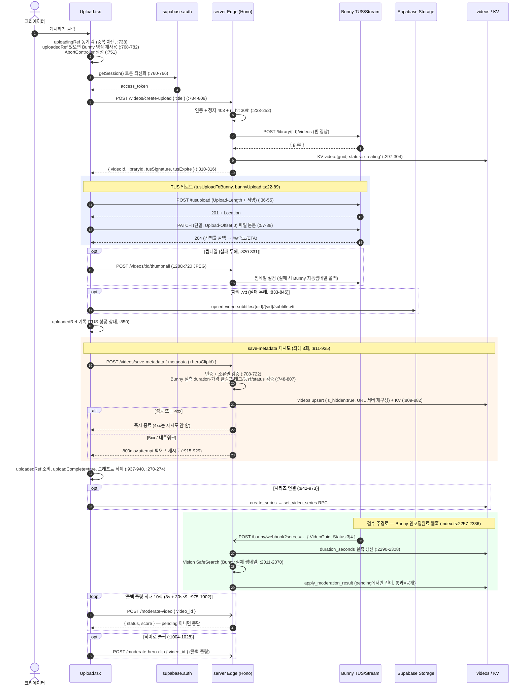
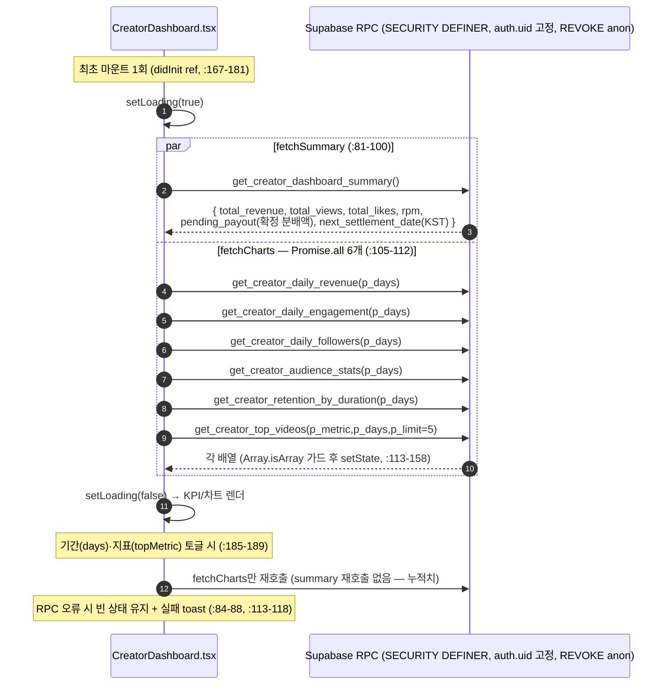

# 05. 업로드 · 크리에이터 대시보드 — 상세 명세

> 본 문서는 **실제 코드를 읽고** 작성됐다. 모든 동작·계약은 `file:line` 근거를 단다.
> 핵심 파일:
> - 업로드 UI/오케스트레이션: `src/app/components/Upload.tsx`
> - Bunny TUS 업로더: `src/app/utils/bunnyUpload.ts` / 히어로 클립 업로더: `src/app/utils/heroClipUpload.ts`
> - Edge Function(Hono): `supabase/functions/server/index.ts`
>   - `create-upload` (`index.ts:215`), `save-metadata` (`index.ts:682`), `moderate-video` (`index.ts:2112`), 썸네일 프록시 (`index.ts:392`), 자막 transcribe (`index.ts:586`), `set-hero-clip` (`index.ts:2168`), `moderate-hero-clip` (`index.ts:2215`), Bunny 인코딩완료 웹훅 (`index.ts:2257`)
> - 모더레이션 RPC 정본: `supabase/upload_moderation_pipeline_20260709.sql` (`apply_moderation_result`)
> - 편집 재검수 정본: `supabase/video_edit_remoderation_20260711.sql` (`update_my_video_metadata`)
> - 본인 영상 삭제: `supabase/creator_video_delete_20260712.sql` (`delete_my_video`)
> - rate limit 원자 카운터: `supabase/rate_limit_atomic_20260707.sql` (`rl_hit`)
> - 대시보드 UI: `src/app/components/CreatorDashboard.tsx`
> - 대시보드 RPC **정본**: `supabase/channel_feed_audit3_20260710.sql`(일별 3종) → `supabase/channel_feed_audit5_20260710.sql`(summary 최종), `supabase/phase20_creator_analytics.sql`(audience/top/retention). ※ `phase21_creator_dashboard.sql`은 원본(구본) — 재실행 금지.
> - IDOR/통계 보안 RPC: `supabase/high_fixes_20260614.sql`
> - 정지 계정 쓰기 차단: `supabase/block_suspended_writes_20260625.sql`
> - 장르 SSOT: `src/app/data/genres.ts`

---

## 1. 개요 / 목적

### 1.1 업로드
크리에이터가 AI 영상을 CREAITE에 등록하는 3단계 위저드. 핵심 설계 원칙:

- **라이브러리 키 미노출**: 과거 Edge Function이 Bunny 라이브러리 API Key를 클라이언트에 내려 직접 PUT 했으나, 그 키로 라이브러리 전체 영상을 삭제/변조할 수 있어 제거. 현재는 서버가 만든 **TUS presigned 서명**(`SHA256(libraryId+apiKey+expire+videoId)`)으로만 업로드한다 (`bunnyUpload.ts:1-11`, `index.ts:306-316`).
- **2단계 저장**: ① Bunny에 영상 본문 업로드(TUS) → ② Supabase `videos` 테이블 + KV에 메타데이터 저장(`save-metadata`). 둘은 별개 호출이라 "고아 영상"(Bunny엔 있고 DB엔 없음) 방지 로직이 들어있다 (`Upload.tsx:911-935`, 재사용 `uploadedRef` `:768-782`).
- **검수 통과 전 숨김(hide-until-passed)**: 신규 업로드는 `save-metadata` upsert 시점부터 `is_hidden:true`로 시작하고(`index.ts:823-825`), **Bunny 인코딩완료 웹훅의 서버강제 검수**(`/bunny/webhook`, `index.ts:2257-2336`)가 실제 썸네일을 Vision 검수해 통과 시에만 공개한다. 클라 모더레이션 호출은 폴백(폴링 최대 10회)일 뿐이다 (§4.4).
- **콘텐츠 정책 v2**: 30초 미만 업로드 차단, 3분(180초) 미만은 라이선스 판매 불가(무료 광고형으로만 노출). 판매가 0 강제는 서버에서도 재검증(`index.ts:760-764`).

### 1.2 크리에이터 대시보드 / 애널리틱스
MyPage 판매 탭 최상단에 배치되는 본인 채널 KPI/추세/Top/retention 분석 (`CreatorDashboard.tsx:1-4`). 모든 데이터는 `SECURITY DEFINER` RPC가 `auth.uid()`로 본인 데이터만 집계하므로 IDOR 불가. 두 계열로 나뉜다:
- **summary + 일별 3종** — 정본은 채널 피드 감사 SQL: `channel_feed_audit3_20260710.sql`(daily_revenue/engagement/followers + summary 1차) → `channel_feed_audit5_20260710.sql`(summary 최종). 누적 KPI 4종 + 일별 수익 + 일별 조회수/좋아요 + 일별 팔로워 + 정산 안내. `pending_payout`은 **확정 pending 분배액만**, 날짜 버킷·정산일은 **KST**, `total_views`는 **공개·비숨김 영상 스코프**, 전부 `REVOKE anon`. (원본 `phase21_creator_dashboard.sql` 재실행 금지 — 회귀.)
- **Phase 20**(`phase20_creator_analytics.sql`, 정본 유지): 시청자 통계(시청률·완주율·유니크) + Top 영상 + 길이 구간별 retention.

---

## 2. 사용자 스토리

- **US-1 (무로그인 진입)**: 비로그인 사용자가 업로드 탭에 들어오면 로그인 벽 대신 "3대 수익원(80%/50~60%/50%) + 원클릭 소셜 로그인(Google/Kakao/이메일)" 화면을 본다 (`Upload.tsx:512-586`).
- **US-2 (파일 선택)**: 영상을 고르면 길이·해상도 자동측정, 썸네일 후보 3프레임 자동추출, 하이라이트 기본구간이 자동 세팅된다 (`Upload.tsx:307-463`).
- **US-3 (정보 입력)**: 제목/설명/카테고리/장르/시청등급/AI도구/해상도/재생시간을 채우고, 선택적으로 시리즈·AI증빙·시네마 메타·협찬·태그를 입력한다 (`Upload.tsx:1487-2060`).
- **US-4 (가격·공개)**: 공개범위(public/unlisted/private)와 단일가를 정한다. 3분 미만은 가격 입력칸 대신 "라이선스 판매 불가" 안내가 뜬다 (`Upload.tsx:2102-2196`).
- **US-5 (미리보기→게시)**: 마켓 카드 시뮬레이션 모달로 최종 확인 후 업로드한다. 완료 화면·토스트에서 "검수 통과 후 공개" 안내를 본다 (`Upload.tsx:2244-`, `:979`, `:1107-1142`).
- **US-6 (이어쓰기)**: 작성 도중 떠나도 드래프트가 localStorage에 자동저장되고, 재방문 시 "이어서 작성" 토스트가 뜬다 (`Upload.tsx:213-274`).
- **US-7 (채널 분석)**: 크리에이터가 대시보드에서 7/14/30일 토글로 수익·조회수·좋아요·팔로워 추세와 Top 영상, 길이별 완주율을 본다 (`CreatorDashboard.tsx:282-472`).
- **US-8 (히어로 클립, 10분+만)**: OTT 등록급(10분 이상) 영상을 올릴 때 Step 1에서 30초 내외 MP4 티저를 함께 등록하면, 검수 통과 후 OTT 히어로 섹션에서 그 클립이 0초부터 선명하게 자동재생된다 (`Upload.tsx:1430-1468`, §13).
- **US-9 (본인 영상 삭제)**: 크리에이터가 마이페이지 판매 탭에서 본인 영상을 직접 삭제한다. 판매 완료 주문이 있으면 구매자 보호를 위해 차단된다 (`MyPage.tsx:1045-1055`, §14).

---

## 3. 화면 & 상태

### 3.1 업로드 — 단계별 폼
진행바는 3스텝(`Upload.tsx:1201-1226`).

**Step 1 — 파일 선택 + 썸네일/하이라이트 + 히어로 클립** (`Upload.tsx:1229-1485`)
- 드래그/클릭 드롭존(`accept="video/*,.mp4,.mov,.avi"`, `Upload.tsx:1231-1269`).
- 썸네일 선택 그리드: 자동추출 3프레임(시작/중간/끝) + 커스텀 이미지 업로드 (`Upload.tsx:1271-1340`).
- 하이라이트 구간 마킹: 미리보기 비디오 + dual-thumb 슬라이더(5~30초 제약) + "하이라이트 미리보기" 버튼 (`Upload.tsx:1342-1428`).
- **OTT 히어로 미리보기 클립(선택, 10분+ 영상만)**: `videoDurationSec >= 600`일 때만 노출. MP4·50MB 이하, 등록 즉시 Bunny로 TUS 업로드 후 "등록됨 ✓ (검수 통과 후 노출)" 표시 (`Upload.tsx:1430-1468`, §13).
- "다음" 버튼은 `selectedFile` 없으면 disabled (`Upload.tsx:1476-1483`).

**Step 2 — 콘텐츠 정보** (`Upload.tsx:1487-2060`)
- 제목(60자 카운터, `Upload.tsx:1489-1505`), 설명(500자 카운터, **필수**, `:1507-1524`).
- 카테고리/장르 select (`:1526-1558`), 시리즈 선택(`:1560-1597`), **시청등급 3버튼(전체/12+/15+ — 19+ 제거, 광고정책 2026-06-29)**(`:1599-1632`), AI도구(`:1634-1648`), 해상도/재생시간(`:1650-1679`).
- 접이식 섹션(details): AI 제작 증빙(프롬프트/시드, `:1681-`), 시네마 메타데이터(감독/각본/음악/제작연도/출연/언어/자막언어 + .vtt 업로드), 어드민 전용 라이선스·출처, 협찬·후원.
- 태그 칩 입력(최대 10개).

**Step 3 — 가격/공개/진행률/완료** (`Upload.tsx:2062-2240`)
- 업로드 중일 때 진행률 카드: %, 진행/속도/남은시간 3분할(`:2064-2100`).
- 공개 설정 라디오 3종(`:2102-2141`).
- 가격: 3분 미만이면 잠금 안내, 아니면 단일가 입력(₩1,000만 이상은 협의판매 안내, `:2143-2196`).
- 저작권 서약 체크박스(`:2198-2212`), 제출 버튼(`:2214-2238`).

**미리보기 모달**: 마켓 카드 시뮬레이션 + 공개범위/하이라이트/카테고리·장르/가격/크레딧/태그 요약 (`Upload.tsx:2244-`).

**완료 화면 — 검수 대기 안내 UX**: 체크 애니메이션 + "계속 업로드"/"내 상품 보기" (`Upload.tsx:1107-1142`). 안내 문구 3줄(등록 완료 → 하이라이트 분석 중 → 완료되면 자동 게시, `uploadSuccessHint1~3` `:1119-1123`)과 별도로 게시 직후 "업로드 완료 — 콘텐츠 검수 통과 후 공개됩니다 (보통 수 분 내)" 토스트(`upload.toast.moderationPending`, `:979`)로 **검수 통과 전 미노출**임을 알린다.

### 3.2 대시보드 — KPI/차트/Top/retention
최초 마운트 시 전체 스피너(`CreatorDashboard.tsx:191-197`), 기간/지표 토글 시 차트별 부분 스피너(`chartLoading`).

- **누적 KPI 4종**: 총수익/총조회수/총좋아요/RPM (`CreatorDashboard.tsx:224-229`).
- **시청자 인사이트 4종(기간 기준)**: 평균시청률/완주율/유니크시청자/평균시청시간 (`:232-261`).
- **다음 정산 안내**: `pending_payout > 0`일 때만 (`:264-279`).
- **기간 셀렉터**: 7/14/30일 (`:282-300`, `RANGE_OPTIONS` `:51-55`). 하단에 "판매매출 기준" 안내(광고·구독 수익은 월 정산 합산, `:303`).
- **일별 수익 LineChart** (`:306-330`), **조회수+좋아요 콤보 LineChart** (`:332-358`), **일별 팔로워(누적+신규) LineChart** (`:360-385`), **길이 구간별 평균 시청률 BarChart** (`:388-424`), **Top 영상(views/likes/watch_ratio 토글)** (`:426-472`).
- **RPC 실패 시**: 조용히 0/빈 차트로 두지 않고 콘솔 로그 + 실패 toast로 표면화 (`:84-88`, `:113-118`, `:159-161`).

---

## 4. 동작 흐름

### 4.1 업로드 파이프라인 (`performUpload`, `Upload.tsx:735-1041`)

1. **중복 제출 방지 (동기 락 + 재사용)** — `uploadingRef`(useRef)가 true면 즉시 return (`:738`). setState(`isUploading`)는 비동기라 첫 await 전 빠른 더블클릭이 둘 다 통과하던 것을 렌더 전에 원천 차단. 락은 `finally`에서 해제(`:1038`). `AbortController` 새로 생성(`:751`). 직전 시도에서 TUS까지 성공한 기록(`uploadedRef`, `:170`)이 있고 같은 파일이면 **Bunny 영상을 재생성하지 않고 재사용** — create-upload/TUS/썸네일/자막을 건너뛰고 메타데이터만 재저장(`:768-782`).
2. **세션 토큰 최신화** — `supabase.auth.getSession()`로 `access_token` 재확보(`:760-766`). TUS가 길어지면 저장 직전에도 재조회(`:816-818`, `:853-855`).
3. **create-upload 호출** (`:784-809`) — body `{ title }`만 전송. 응답 `{ videoId, libraryId, tusSignature, tusExpire }`.
4. **TUS 업로드** (`uploadToBunny` `:647-673` → `tusUploadToBunny` `bunnyUpload.ts:22-89`):
   - ① `POST https://video.bunnycdn.com/tusupload` (`Upload-Length` 헤더 + 서명 헤더) → `Location` 헤더로 업로드 URL 수신 (`bunnyUpload.ts:36-55`).
   - ② 그 URL에 **단일 PATCH**로 파일 본문 전송(XHR, `Upload-Offset: 0`) — `xhr.upload.progress`로 진행률 보고 (`bunnyUpload.ts:57-88`).
   - 진행률 콜백에서 지수이동평균 속도 + ETA 계산 후 `setUploadProgress`/`setUploadStats` (`Upload.tsx:653-671`).
   - `uploadAbortRef.current.signal`로 취소 가능 (`bunnyUpload.ts:77-79`).
5. **썸네일 업로드(선택, 실패 무해)** (`Upload.tsx:820-831`) — `setBunnyThumbnail`이 이미지를 1280×720 JPEG로 다운스케일(`:598-620`) 후 `POST /server/videos/:videoId/thumbnail` Edge 경유 전송(`:626-644`). 실패 시 Bunny 자동썸네일로 폴백.
6. **자막(.vtt) 업로드(선택, 실패 무해)** (`Upload.tsx:833-845`) — Supabase Storage `video-subtitles/{userId}/{videoId}/subtitle.vtt`에 upsert, publicUrl 확보. TUS+썸네일+자막까지 성공하면 `uploadedRef`에 기록(`:850`).
7. **save-metadata 호출(재시도 포함)** (`Upload.tsx:853-935`) — 메타 객체 구성(`:858-906`, `heroClipId` 포함) 후 `POST /server/videos/save-metadata`. **최대 3회 재시도**: 성공 또는 4xx면 즉시 중단, 5xx/네트워크 오류만 `800ms×attempt` 백오프 재시도(`:915-929`).
8. **완료 처리** (`:937-940`) — `uploadedRef` 소비(`:938`), `uploadComplete=true`, 성공 토스트, 드래프트 삭제(`:270-274`).
9. **시리즈 연결(선택)** (`:942-973`) — 새 시리즈면 `create_series` RPC로 생성 후 `set_video_series` RPC 연결. 회차 자동 +1.
10. **자동 모더레이션 (웹훅 주경로 + 클라 폴백 폴링)** (`:975-1002`) — 신규 업로드는 서버 upsert 시점부터 `is_hidden:true`(검수 대기). **주경로는 Bunny 인코딩완료 웹훅**(`/bunny/webhook`)의 서버강제 검수이고, 클라는 폴백으로 `POST /server/moderate-video`를 **최대 10회 폴링**(8s + 30s×9 ≈ 4.6분 — 대용량/4K 인코딩 커버). status가 `pending`이 아니게 되면(판정 완료) 중단. 실패해도 업로드 흐름과 무관. 히어로 클립이 있으면 `moderate-hero-clip`도 동일 패턴으로 별도 폴링(`:1004-1028`).

### 4.2 create-upload 서버 흐름 (`index.ts:215-321`)
인증(`:217-231`) → 정지 403 + rate limit 검사(`rl_hit` 원자 카운터, 비관리자 시간당 30회, `:233-252`) → Bunny `POST /library/{id}/videos`로 빈 영상 생성(`:270-291`) → KV `video:{guid}`에 소유자 기록(`status:'creating'`, `:297-304`) → TUS 서명 생성 후 반환(`:306-316`).

### 4.3 save-metadata 서버 흐름 (`index.ts:682-911`)
인증(`:684-697`) → `videoId` 필수(`:702-704`) → **소유권 검증**(`:708-722`) → KV 저장(`:724-733`) → **서버측 검증/재구성**: Bunny 실측 length 조회(`:748-759`), 가격 0~1억 클램프 + 180초 미만 판매가 0 강제(`:760-764`), 챌린지 태그 서버검증(`:766-795`), 히어로 클립 GUID KV 소유권 검증(`:797-807`) → `videos` 테이블 upsert(**`is_hidden:true` 시작**, thumbnail/video_url은 GUID로 서버 재구성, age_rating·status·visibility 화이트리스트, 확장 컬럼 포함, `:809-882`) → 사용자 영상목록 KV 추가(`:892-898`).

### 4.4 모더레이션 서버 흐름 — 웹훅 주경로 + moderate-video 폴백
- **공유 헬퍼** `scoreBunnyThumbnail`(`index.ts:2011-2070`): Bunny가 인코딩한 **실제 썸네일**(`{host}/{id}/thumbnail.jpg`)을 서버가 직접 바이트로 가져와 base64로 Vision SafeSearch 호출 → likelihood 5단계 → 0~100 점수 변환(`:2058-2060`) → `score = max(adult, violence, racy)`(spoof/medical 무시, `:2068`). 클라가 넘긴 썸네일 URL 위조 원천 차단.
- **본편 판정** `moderateVideoById`(`:2073-2094`): 점수를 **`apply_moderation_result` RPC**(`upload_moderation_pipeline_20260709.sql:20-71`)에 전달. **pending 상태에서만 전이**(오너가 flagged/rejected를 재검수로 되돌리는 회피 차단): score <70 → passed+공개 / 70~89 → flagged+숨김 / ≥90 → rejected+숨김 / 오류·NULL → pending+숨김 유지(fail-closed). RPC는 **service_role 전용**(REVOKE PUBLIC/anon/authenticated, `:77-80`).
- **주경로 — Bunny 인코딩완료 웹훅** `POST /bunny/webhook?secret=…`(`index.ts:2257-2336`): URL 쿼리 시크릿 인증(`:2260-2263`) → Status 3(Finished)/4(ResolutionFinished)만 처리(`:2277-2280`) → 본편이면 Bunny 실측 length로 `duration_seconds` 갱신(duration 위조 무력화, `:2290-2308`) + `moderation_status='pending'`일 때만 검수(다중 해상도 웹훅 Vision 중복 방지, `:2309-2315`) → 히어로 클립이면 `hero_clip_id` 매칭으로 클립 검수(`:2318-2328`).
- **폴백 — moderate-video** (`index.ts:2112-2162`): 인증(`:2117-2121`) → **소유자/어드민만**(`:2140-2144`) → 헬퍼 검수. 썸네일 미생성(인코딩 중)·Vision 일시오류는 200 + `status:'pending'` 반환 → 클라 폴링이 재시도(`:2151-2157`).

### 4.5 대시보드 데이터 흐름 (`CreatorDashboard.tsx`)
**최초 마운트 1회**만 `fetchSummary` + `fetchCharts`를 전역 스피너로 병렬 실행(`:167-181`, `didInit` ref). 기간 토글(`days`)·Top 지표 토글(`topMetric`) 변경 시엔 **차트만 재조회**(`fetchCharts`, `:185-189`) — summary는 기간 무관 누적치라 재호출하지 않고, 전체 리로드/스크롤 소실을 방지. `fetchCharts`는 6개 RPC를 `Promise.all`로 동시 호출(`:105-112`). summary/차트 RPC 실패는 콘솔 로그 + 실패 toast로 표면화(`:84-88`, `:113-118`).

---

## 5. 데이터 / RPC 계약

### 5.1 저장 메타 필드 매핑 (클라 metadata → DB 컬럼)
클라가 만든 `metadata` 객체(`Upload.tsx:858-906`)와 서버 upsert(`index.ts:809-882`)의 매핑. **핵심 원칙: 위조 가능한 클라 값은 서버가 무시하거나 재검증한다.**

| 클라 필드 (`Upload.tsx`) | 서버 upsert 컬럼 (`index.ts`) | 비고 |
|---|---|---|
| `videoId` | `id` (`:812`) | Bunny guid |
| `title` (없으면 파일명, `:860`) | `title` (`:813`) | |
| `description` (필수) | `description` (`:814`) | |
| — | `creator` (`:815-817`) | **프로필 `display_name` 우선** → `user_metadata.name` → 이메일 앞부분 |
| — | `creator_id` (`:818`) | 인증된 `user.id` 강제 |
| `thumbnailUrl` — **서버가 무시** | `thumbnail` (`:819-821`) | **GUID로 서버 재구성**(`https://{BUNNY_CDN_HOST}/{videoId}/thumbnail.jpg`) — 검수대상≠노출대상 우회 차단 |
| `hlsUrl` — **서버가 무시** | `video_url` (`:822`) | **GUID로 서버 재구성**(`.../playlist.m3u8`) |
| — | `is_hidden` (`:823-825`) | **upsert 시점부터 `true`(검수 대기)** — 별도 후속 UPDATE의 레이스/fail-open 제거 |
| `duration` | `duration` (`:826`) + `duration_seconds` (`:827-828`) | **Bunny 실측 length 우선**(`:748-759`) — 있으면 명시 저장(위조 문자열 재파생 차단), 없으면(인코딩 전) 클라값 폴백 |
| `tags` (challenge 태그 자동부착, `:865-868`) | `tags` (`:831`) | **챌린지 태그 서버검증**(`:766-795`): 마감/미존재 챌린지·1인 3편 초과·위조 슬러그의 `challenge:*` 태그만 제거 |
| `standardPrice` (콤마 제거, `:870`) | `price_standard`/`price_commercial`/`price_exclusive` (`:834-836`) | **0~1억 클램프 + 180초 미만 판매가 0 강제**(`:760-764`). commercial/exclusive는 stale, standard 동일값 |
| `aiTool`, `aiModelVersion` | `ai_tool`(`:837`), `ai_model_version`(`:849`) | |
| `category`, `genre` | `category`(`:838`), `genre`(`:839`) | |
| `age_rating` (`:875`) | `age_rating` (`:840-842`) | **서버 화이트리스트 `['all','13','15']`, 그 외 폴백 '15'**(청소년보호 방향 — all로 열리지 않게). 19+ 신규 업로드 제거 |
| `prompt`, `seed` | `prompt`(`:843`), `seed`(`:850`) | |
| `resolution` | `resolution` (`:846`) | |
| `director`/`writer`/`composer`/`cast`/`productionYear`/`language`/`subtitleLanguage` | `director`/`writer`/`composer`/`cast_credits`/`production_year`/`language`/`subtitle_language` (`:852-858`) | `productionYear`→int(`:737`) |
| `subtitleUrl` | `subtitle_url` (`:859`) | `safeHttpUrl` — http(s)만 |
| `visibility` | `visibility` (화이트리스트 검증, `:861`) | |
| `licenseType`/`licenseSourceUrl`/`attribution`/`originalCreator` | `license_type`/`license_source_url`/`attribution`/`original_creator` (`:862-866`) | **비관리자는 서버에서 'original'/빈값 강제** |
| `highlightStart`/`highlightEnd` | `highlight_start`/`highlight_end` (parseFloat, 기본 0/15, `:738-739`,`:868-869`) | |
| `heroClipId` (`:899`) | `hero_clip_id`/`hero_clip_url`/`hero_clip_status` (`:870-875`) | **KV 소유권 검증 통과분만**(`:797-807`), URL은 GUID로 서버 재구성, status='pending'(검수 게이트) |
| `sponsorBrand`/`sponsorLogoUrl`/`sponsorDisclosure`/`sponsorLinkUrl` | `sponsor_brand`/`sponsor_logo_url`/`sponsor_disclosure`/`sponsor_link_url` (`:876-881`) | Phase 28. URL은 `safeHttpUrl` |
| `status` | `status` (`:844-845`) | **서버 화이트리스트 `['ready','processing','draft']`**, 그 외 'ready'(임의 문자열 주입 차단) |
| — | `views:"0"`, `likes:0` (`:829-830`) | |

### 5.2 create-upload 응답 (`index.ts:310-316`)
```
{ videoId, libraryId, title, tusSignature, tusExpire }
```
- `tusSignature = SHA256(libraryId + apiKey + tusExpire + videoId)` (`index.ts:308`).
- `tusExpire = now + 6시간` (`index.ts:307`).
- 클라는 `videoId/libraryId/tusSignature/tusExpire`만 사용(`Upload.tsx:806`), `BunnyTusAuth` 헤더로 전송(`bunnyUpload.ts:29-34`).

### 5.3 save-metadata 응답 (`index.ts:902-906`)
```
{ success: true, videoId, message }
```
오류: 401(토큰), 400(videoId 누락), 403(권한), 500(DB).

### 5.4 대시보드 RPC 계약 (인자 / 반환 / auth.uid 고정 / file:line)

모든 RPC는 `SECURITY DEFINER` + `SET search_path`이고 본인(`auth.uid()`) 데이터만 집계한다. **정본 = `channel_feed_audit3_20260710.sql`(daily 3종) → `channel_feed_audit5_20260710.sql`(summary 최종)** — `phase21_creator_dashboard.sql`·phase20의 daily_followers 구본 재실행 금지.

**summary + 일별 3종** (정본: `channel_feed_audit3_20260710.sql`, summary는 `channel_feed_audit5_20260710.sql`):

| RPC | 인자 | 반환 | auth 고정 | file:line (정본) |
|---|---|---|---|---|
| `get_creator_dashboard_summary()` | 없음 | `total_revenue, total_views, total_likes, rpm, pending_payout, next_settlement_date` | `v_uid := auth.uid()`, NULL이면 예외 | `audit5:43-102` (uid `:55`, 가드 `:65`) |
| `get_creator_daily_revenue(p_days int=30)` | 일수 | `day, revenue` (0인 날 포함) | `WHERE seller_id = auth.uid()` | `audit3:79-104` (`:94`) |
| `get_creator_daily_engagement(p_days int=30)` | 일수 | `day, views, likes` | `creator_id = auth.uid()` / videos.creator_id = auth.uid() | `audit3:107-142` (`:121`,`:130`) |
| `get_creator_daily_followers(p_days=30)` | 일수 | `day, gained, total`(base_total + 누적 윈도우합) | `creator_id = auth.uid()` | `audit3:145-179` (`:159`,`:167`) |

- 수익은 `orders WHERE seller_id=uid AND status='completed'`(refunded 제외, `audit5:67-68`). RPM = 최근30일(수익/시청수)×1000 (`audit5:82-92`).
- **`pending_payout` = 확정 pending 분배액만**: `revenue_distributions WHERE payout_status='pending'`의 합(이미 순수령·판매+광고+구독 합, `audit5:94-96`). 이번달 미확정 gross 추정분을 더하던 구본(phase21) 방식은 단위 혼합 과대라 제거.
- **`total_views`는 공개·비숨김 영상 스코프**: `visibility='public'(또는 NULL) AND is_hidden=false` 영상의 유효 조회수만(`audit5:70-75`) — 공개 3종(채널 프로필 등)과 화면 간 일치.
- **일별 집계·정산일 모두 KST**: generate_series/필터/그룹키 전부 `AT TIME ZONE 'Asia/Seoul'`(구본은 UTC 혼용으로 KST 저녁 "오늘분" 누락). `next_settlement_date` = KST 기준 다음달 1일(`audit5:63`).
- **전 RPC `REVOKE ... FROM PUBLIC, anon` + `GRANT ... TO authenticated`** (`audit3:75-76`,`:103-104`,`:141-142`,`:178-179`, `audit5:101-102`).

**Phase 20** (`phase20_creator_analytics.sql`, audience/top/retention 정본 유지):

| RPC | 인자 | 반환 | auth 고정 | file:line |
|---|---|---|---|---|
| `get_creator_audience_stats(p_days=30)` | 일수 | `avg_watch_ratio, completion_rate, unique_viewers, total_views, avg_watch_seconds` | `v_uid:=auth.uid()`, NULL 예외 | `:19-54` (`:33`,`:36-38`) |
| `get_creator_top_videos(p_metric='views', p_days=30, p_limit=5)` | 지표/일수/개수 | `id, title, thumbnail, duration, views_count, likes_count, avg_watch_ratio` | `WHERE v.creator_id = v_uid` | `:62-120` (`:82`,`:103`) |
| `get_creator_retention_by_duration(p_days=30)` | 일수 | `bucket, bucket_order, avg_watch_ratio, view_count` | `WHERE vv.creator_id = v_uid` | `:176-227` (`:189`,`:213`) |

- `completion_rate` = `watch_ratio>=0.9` 비율(`:43-45`). `p_metric`은 `views`/`likes`/`watch_ratio`를 CASE 정렬로 분기(`:106-117`). retention 버킷: `1분 미만/1~5분/5~10분/10분+`(`:199-210`).
- `get_creator_top_videos`는 `is_hidden=false`만(`:104`).

**클라 RPC 호출** (`CreatorDashboard.tsx:82`, `:105-112`): 인자 키는 `p_days`/`p_metric`/`p_limit`로 정확히 일치. 모든 반환을 `Number(...) || 0`로 방어 매핑(`:89-158`). RPC 오류는 콘솔 + 실패 toast(`:84-88`,`:113-118`).

**IDOR 보안 RPC** (`high_fixes_20260614.sql`) — 대시보드에서 직접 쓰진 않지만 같은 통계 계열:
- `get_creator_view_stats(p_creator_id=auth.uid(), p_since=now()-30d)` — `WHERE creator_id=p_creator_id AND (p_creator_id=auth.uid() OR is_admin())` (`:107-120`).
- `get_creator_ad_stats(p_creator_id=auth.uid())` — 동일 IDOR 가드 + `source_video_id IN (본인 videos)` (`:122-134`).
- `get_creator_ad_stats_by_video(...)` — 영상별 노출/클릭, 동일 가드 (`:136-148`).

---

## 6. 비즈니스 규칙

- **필수 필드(Step 2) — 8개** (`validateStep2`, `Upload.tsx:677-717`): 제목, 카테고리, 장르, **설명**, 시청등급, AI도구, 해상도, 재생시간. (설명은 JSX `required`가 step "다음"(type=button)에서 미발동해 빈 설명이 저장되던 것을 검증으로 추가, `:691-695`.) 첫 누락에서 toast 후 false. "다음" 이동·최종 제출 공통 게이트(`:730`).
- **길이/형식 검증**:
  - 제목 최대 60자(`maxLength`, `:1502`), 설명 500자(`:1521`), 태그 최대 10개(`addTag` `:188-191`).
  - 재생시간 형식 정규식 `/^\d{1,3}:[0-5]\d(:[0-5]\d)?$/` (예 `3:45`, `1:03:45`, `:712`) — 초·분 파트 00~59 강제(`3:99` 같은 값이 트리거 파싱에서 잘못된 초로 계산되던 것 차단).
  - 파일: MIME/확장자 화이트리스트(mp4/mov/avi), 최대 5GB (`:312-328`).
  - 자막: `.vtt`만, 1MB 이하. 커스텀 썸네일: 이미지, 5MB 이하 (`:466-476`). 히어로 클립: MP4만, 50MB 이하 (`:495-496`).
- **30초 미만 업로드 차단**: `settings.minUploadSeconds`(기본 30) 미만이면 선택 거부(`:371-382`).
- **3분 미만 판매 불가**: `videoDurationSec < 180`이면 가격칸 대신 잠금 안내(무료 광고형으로만 노출, `:2143-2165`). **서버도 강제**: Bunny 실측 우선 duration이 180초 미만이면 판매가 0(`index.ts:760-764`).
- **가격 서버검증**: 음수·NaN은 0, **₩1억 상한 클램프**(`index.ts:761-763`).
- **협의판매(₩1,000만+)**: `isNegotiationOnly(price)`면 "1:1 협의 판매" 안내(`:2180-2186`).
- **시리즈**: 단일/기존선택/새로만들기. 새 시리즈는 `create_series` 후 `set_video_series`, 회차 자동 +1(`:942-973`). 새로 만든 시리즈는 즉시 선택상태로 전환(중복생성 방지, `:952-953`).
- **챌린지 태그**: 챌린지로 진입 시 제출 메타 태그에 `challenge:{tag}` 자동부착(가시 태그칩과 무관, `:865-868`). **서버검증**(`index.ts:766-795`): 존재+오픈 중(starts_at≤today≤deadline) 챌린지만, 1인 최대 3편 — 무효한 `challenge:*` 태그만 제거하고 업로드 자체는 막지 않음.
- **라이선스 타입**: 어드민만 입력 노출, **비관리자는 서버에서 'original' 강제**(`index.ts:862-866`). 클라도 `profile.is_admin` 아니면 'original' 전송(`Upload.tsx:890-894`) — 이중 방어.
- **드래프트 저장**: 사용자별 키 `creaite_upload_draft_{userId}`(`:211`). 변경 시 localStorage 저장(`:252-267`), 마운트 시 내용 있으면 복원 토스트(`:213-250`), 완료/리셋 시 삭제(`:270-274`,`:1104`).
- **rate limit (rl_hit 원자 카운터)**: create-upload 비관리자 **시간당 30회**(빈 Bunny 영상 무한생성 차단, `index.ts:244-251`), transcribe **시간당 20회**+정지 차단(`index.ts:620-635`), generate-promo 시간당 20회(`index.ts:485-490`). 어드민 예외. `rl_hit`는 단일 INSERT … ON CONFLICT 원자 증가(`rate_limit_atomic_20260707.sql:21-41`), service_role 전용.
- **시청등급**: UI는 **3버튼(전체/12+/15+)** — 19+ 신규 업로드 제거(광고 정책상 성인인증 요구 콘텐츠 불가, 2026-06-29, `Upload.tsx:1604-1631`). 서버 화이트리스트 `['all','13','15']`, 그 외 값은 **폴백 '15'**(all로 열리지 않게 청소년보호 방향, `index.ts:840-842`). DB CHECK엔 '19'도 있으나(기존 콘텐츠 호환) 신규 업로드에선 미사용.

---

## 7. 엣지 케이스 & 에러 처리

- **고아 영상(TUS 성공·메타 실패)**: save-metadata 5xx/네트워크 오류 시 최대 3회 백오프 재시도(`Upload.tsx:915-929`). 4xx(검증오류)는 즉시 중단(재시도 무의미). 3회 모두 실패해도 `uploadedRef`에 TUS 성공 상태가 남아, **다시 게시를 누르면 같은 Bunny 영상으로 메타만 재저장**(중복 생성·고아 방지, `:768-782`, 재시도 안내 토스트 `:1031-1036`).
- **중복 제출(더블클릭)**: `uploadingRef` 동기 락으로 영상 2개 생성 차단(`:736-738`, 해제 `:1038`). setState 기반 `isUploading` 가드는 첫 await 전 더블클릭을 못 막아 ref로 교체.
- **업로드 중 이탈/언마운트**: `uploadAbortRef`를 unmount cleanup에서 abort(`:167`), TUS XHR이 abort 신호 수신 시 전송 중단(`bunnyUpload.ts:77-79`) — 대용량 백그라운드 전송 방지.
- **측정 실패(메타데이터)**: `video.onerror`면 경고 토스트만, 폼은 진행 가능(`:458-462`).
- **프레임 캡처 실패**: 개별 타임스탬프 5초 타임아웃, 실패해도 `console.warn` 후 계속(`:435-443`). 0개여도 Bunny 자동썸네일 폴백.
- **부분 실패(썸네일/자막)**: 둘 다 실패해도 업로드 흐름 비차단 — 썸네일 실패 시 경고+Bunny폴백(`:827-830`), 자막 실패 시 경고만(`:841-844`).
- **모더레이션 실패/지연 (fail-closed)**: 신규 업로드는 이미 숨김이라 검수 실패·지연 시에도 미노출 유지. 썸네일 미생성(인코딩 중)·Vision 일시오류는 `apply_moderation_result`가 pending+숨김 유지(`upload_moderation_pipeline_20260709.sql:49-50`), 클라 폴백 폴링이 재시도(`Upload.tsx:983-1001`). 폴링이 전부 실패해도 웹훅(주경로)이 판정을 완료.
- **웹훅 레이스(save-metadata 전 인코딩 완료)**: 웹훅 수신 시 본편/클립 행이 아직 없으면 무시 — 클라 폴백이 이후 처리(`index.ts:2330-2331`).
- **토큰 없음**: 세션·accessToken 둘 다 없으면 에러 토스트 후 중단(`:740-743`,`:763-766`).
- **대시보드 RPC 오류**: 각 결과를 `Array.isArray` 가드 후에만 setState, 실패하면 빈 상태 유지 + 콘솔·실패 toast 표면화(`CreatorDashboard.tsx:113-158`).

---

## 8. 성능

- **TUS 단일 PATCH**: 파일 본문을 청크 분할 없이 한 번의 PATCH(`Upload-Offset: 0`)로 전송(`bunnyUpload.ts:82-87`). 단순/저오버헤드(단, resume 미지원 — §12).
- **속도/ETA 안정화**: 진행률 콜백에서 지수이동평균(신규 70% / 기존 30%)으로 속도 평활화, 200ms 미만 샘플은 무시(`Upload.tsx:653-671`).
- **썸네일 프레임 캡처**: `<video>` + `<canvas>`로 10%/50%/90% 지점 3프레임만 캡처(`:412-452`), 업로드 전 1280×720 JPEG로 다운스케일해 페이로드 최소화(`:598-620`).
- **재시도 시 재업로드 생략**: save-metadata만 실패한 재시도는 `uploadedRef` 재사용으로 create-upload/TUS/썸네일/자막 전 구간을 건너뜀 — 대용량 재전송 비용 제로(`:768-782`).
- **드래프트 저장**: `useEffect` 의존성 변경 기반(타이머 디바운스가 아닌 React 리렌더 단위, `:252-267`) — 입력마다 localStorage 직렬화. (주: 명시적 setTimeout 디바운스는 아님.)
- **대시보드 병렬 페치**: 6개 분석 RPC를 `Promise.all` 동시 호출(`CreatorDashboard.tsx:105-112`). 기간/지표 토글은 차트만 재조회(summary 재호출 없음, `:185-189`).
- **웹훅 Vision 중복 방지**: 다중 해상도 인코딩 웹훅이 여러 번 와도 `moderation_status='pending'`일 때만 Vision 호출(`index.ts:2309-2312`).
- **광고통계 인덱스**: `idx_ad_video_events_source(source_video_id, event_type)`로 정산/통계 풀스캔 방지(`high_fixes_20260614.sql:168-170`).

---

## 9. 권한 / 보안

- **라이브러리 키 미노출**: 클라엔 TUS presigned 서명만 전달, Bunny AccessKey는 서버에만(`bunnyUpload.ts:1-11`, `index.ts:306-316`). 썸네일/자막도 Edge 프록시 경유(`index.ts:392-`,`:586-`).
- **소유권 검증(save-metadata)**: 비관리자는 KV `video:{id}.userId` 또는 `videos.creator_id`가 호출자여야 함, 아니면 403(`index.ts:708-722`). 타인 videoId로 메타 덮어쓰기/소유권 탈취 차단.
- **소유권 검증(썸네일/transcribe/moderate/set-hero-clip)**: KV→videos.creator_id→is_admin 순(`index.ts:601-618`,`:2140-2144`,`:2180-2200`).
- **creator_id 위조 불가**: upsert의 `creator_id`는 클라 입력이 아닌 인증된 `user.id`로 강제(`index.ts:818`).
- **재생·표시 URL 위조 불가**: `thumbnail`/`video_url`/`hero_clip_url`은 클라 입력을 버리고 GUID로 서버 재구성(`index.ts:819-822`,`:805`) — 검수대상(GUID 실제 프레임) ≠ 노출대상(임의 URL) 우회 차단.
- **검수 게이트(서버강제)**: 신규 업로드 upsert부터 `is_hidden:true`, 공개 전이는 `apply_moderation_result`(pending에서만, **service_role 전용** — REVOKE PUBLIC/anon/authenticated)로만(`upload_moderation_pipeline_20260709.sql:73-80`). anon이 PostgREST로 직접 호출해 self-approve/타인 영상 강제 rejected 하는 경로 차단.
- **편집 재검수(우회 차단)**: 검수 통과 후 편집으로 제목/설명/썸네일/태그를 유해물로 바꾸는 우회는 `update_my_video_metadata`가 실변경 감지 시 pending+숨김으로 되돌려 차단(§15, `video_edit_remoderation_20260711.sql:126-135`,`:181-183`).
- **정지(suspended) 차단**: create-upload Edge에서 `is_suspended` 시 403(`index.ts:241-243`), transcribe도 동일(`:624-626`). DB 트리거(`block_suspended_writes_20260625.sql`)는 댓글/팔로우/좋아요 등 사용자 직접쓰기를 차단하나, 영상 업로드는 service_role(save-metadata) 경로라 트리거 미적용 → Edge 403이 유일 방어선(SQL 주석 `:11`).
- **rate limit (rl_hit 원자 카운터)**: create-upload 시간당 30회(`index.ts:244-251`), transcribe 20회(`:627-634`), generate-promo 20회(`:485-490`). KV get→set 경합으로 한도 초과 가능하던 것을 단일 INSERT … ON CONFLICT로 교체(`rate_limit_atomic_20260707.sql`). `rl_hit`는 service_role 전용.
- **IDOR 불가(통계)**: 대시보드 RPC는 인자 없이 `auth.uid()`로만 본인 데이터 집계 + `REVOKE anon`(`channel_feed_audit3/5`, `phase20`). 명시적 creator_id 인자를 받는 통계 RPC는 `(p_creator_id=auth.uid() OR is_admin())` 가드(`high_fixes_20260614.sql:118`,`:132`,`:145`).
- **라이선스 비관리자 위조 차단**: 클라가 임의 license_type을 보내도 서버가 비관리자면 'original' 강제(`index.ts:862-866`).
- **본인 영상 삭제 가드**: `delete_my_video`는 소유권(creator_id=auth.uid()) + 판매완료 주문 존재 시 예외(구매자 보호, `creator_video_delete_20260712.sql:20-27`).
- **웹훅 인증**: Bunny는 서명 헤더가 없어 URL 쿼리 시크릿(`BUNNY_WEBHOOK_SECRET`)으로 인증 + 자사 라이브러리 ID 확인(`index.ts:2260-2274`).
- **VAST 픽셀 위조 차단**(연관): HMAC 서명 트래킹 픽셀.

---

## 10. 분석 / 이벤트

- **업로드 진행 로그**: 버전·요청 진단·생성/업로드/저장 각 단계 `console.log`(`Upload.tsx:758-937`).
- **모더레이션 로그**: 클라 폴백 폴링 시도별 status/score(`Upload.tsx:996`,`:1021`), 서버 웹훅 판정 로그(`index.ts:2314`,`:2326`).
- **대시보드 집계 소스(읽기 측)**:
  - 수익: `orders(seller_id, status='completed', amount, created_at)`.
  - 시청: `video_views(creator_id, is_valid, occurred_at, watch_ratio, watch_seconds, viewer_user_id, video_duration)`.
  - 좋아요: `video_likes` JOIN `videos.creator_id`.
  - 팔로워: `creator_followers(creator_id, created_at)`.
  - 광고 이벤트: `ad_video_events(source_video_id, event_type=impression/click/complete/skip)`.
- **RPM** = 최근30일 수익/시청수×1000 (`audit5:82-92`), **완주율** = watch_ratio≥0.9 비율 (`phase20:43-45`).

---

## 11. 수용 기준 (체크리스트)

업로드:
- [ ] 비로그인 진입 시 수익 카드 + Google/Kakao/이메일 시작 화면이 보인다(Apple 버튼 없음, `Upload.tsx:512-586`).
- [ ] 30초 미만 영상 선택 시 거부 토스트가 뜨고 파일이 초기화된다 (`:371-382`).
- [ ] 파일 선택 시 해상도·재생시간·하이라이트·썸네일 3프레임이 자동 세팅된다 (`:367-452`).
- [ ] Step 2 필수 **8개(설명 포함)** 중 하나라도 비면 "다음"/제출이 막히고 toast가 뜬다 (`validateStep2` `:677-717`).
- [ ] 시청등급 버튼은 전체/12+/15+ 3개만 보인다(19+ 없음, `:1604-1631`). age_rating에 '19'/junk를 보내도 서버가 '15'로 저장한다 (`index.ts:840-842`).
- [ ] 3분 미만이면 가격칸 대신 판매 불가 안내가 뜨고(`:2143-2165`), API 직접 호출로 가격을 넣어도 서버가 0으로 저장한다 (`index.ts:760-764`).
- [ ] 더블클릭해도 영상이 1개만 생성된다 (`uploadingRef` 동기 락, `:736-738`).
- [ ] save-metadata 실패 후 재시도하면 Bunny 영상을 재생성하지 않고 재사용한다 (`uploadedRef`, `:768-782`).
- [ ] create-upload 응답에 Bunny AccessKey가 포함되지 않는다 (TUS 서명만, `index.ts:310-316`).
- [ ] save-metadata가 5xx면 최대 3회 재시도, 4xx면 즉시 실패한다 (`:915-929`).
- [ ] 비관리자가 license_type을 위조해도 DB엔 'original'로 저장된다 (`index.ts:862-866`).
- [ ] 정지 계정은 create-upload에서 403을 받는다 (`index.ts:241-243`).
- [ ] 업로드 중 탭 이탈 시 TUS 전송이 abort된다 (`:167`, `bunnyUpload.ts:77-79`).
- [ ] 작성 중 이탈 후 재진입 시 "이어서 작성" 토스트가 뜬다 (`:233-245`).
- [ ] 신규 업로드는 게시 직후 피드에 안 보이고(`is_hidden:true`, `index.ts:823-825`), Bunny 웹훅 검수 통과 시 자동 공개된다 (`/bunny/webhook`).
- [ ] 완료 화면·토스트에 "검수 통과 후 공개" 안내가 보이고, 검수 폴링이 실패해도 완료 화면은 정상 표시된다 (`:975-1002`, `:1107-1142`).
- [ ] 10분+ 영상에서만 히어로 클립 등록 UI가 보이고, 등록 클립은 검수 통과(passed) 전 히어로에서 재생되지 않는다 (`:1432`, §13).

대시보드:
- [ ] 누적 KPI 4종 + 시청자 4종이 표시된다 (`CreatorDashboard.tsx:224-261`).
- [ ] 7/14/30일 토글 시 **차트만** 재조회된다(summary 재호출·전체 리로드 없음, `:185-189`).
- [ ] Top 영상 지표 토글(views/likes/watch_ratio)이 동작한다 (`:434-447`).
- [ ] `pending_payout=0`이면 정산 안내가 숨겨진다 (`:264`).
- [ ] 정산 예정액은 확정 pending 분배액과 일치한다(이번달 gross 미포함, `audit3/5`).
- [ ] summary/차트 RPC 실패 시 실패 toast가 뜬다(무증상 0 표시 금지, `:84-88`,`:113-118`).
- [ ] 다른 사용자의 통계가 절대 노출되지 않는다(auth.uid 고정 + REVOKE anon, IDOR RPC 가드).
- [ ] retention/Top 데이터가 없으면 빈 상태/안내가 보인다 (`:388`,`:450-451`).

삭제/편집:
- [ ] 판매완료 주문이 없는 본인 영상은 마이페이지에서 삭제된다. 판매분이 있으면 예외 메시지로 차단된다 (`delete_my_video`, §14).
- [ ] 편집으로 제목/설명/썸네일/태그를 실변경하면 pending+숨김으로 재검수 대기가 된다. 가격만 변경하면 숨겨지지 않는다 (§15).

---

## 12. 알려진 제약 / 이월

- **TUS resume 미지원**: 현재 단일 PATCH(offset 0)라 중단 시 처음부터 재전송. 부분 재개(Upload-Offset 기반 resume)는 미구현 (`bunnyUpload.ts:82-87`). (단, save-metadata만 실패한 재시도는 `uploadedRef` 재사용으로 재전송 없음.)
- **재생시간 자유 입력(완화됨)**: `duration` input은 여전히 수정 가능하나, 정규식이 초·분 00~59를 강제하고(`Upload.tsx:712`) 서버가 **Bunny 실측 length를 우선** 저장(`index.ts:748-759`) + 웹훅이 인코딩 완료 시 `duration_seconds`를 실측으로 갱신(`:2290-2308`) → 위조 duration의 티어/판매가 영향은 무력화. 표시 문자열(`duration`)과 실측의 표기 불일치만 잔존.
- **price_commercial/exclusive stale 컬럼**: All-in-One 단일가 전환 후에도 NOT NULL 안전을 위해 standard와 동일값으로 유지, schema cleanup 시 DROP 예정(`index.ts:832-836`).
- **KV ↔ DB 이중 저장**: save-metadata가 KV와 `videos` 테이블에 동시 기록(하위호환, `index.ts:724-733`). KV는 점진 폐기 대상.
- **~~rate limit 분산 정확도~~ (해소, 2026-07-07)**: KV 기반 best-effort 윈도우의 경합 부정확은 `rl_hit` DB 원자 카운터(단일 INSERT … ON CONFLICT)로 교체돼 해소(`rate_limit_atomic_20260707.sql`). transcribe에도 20회/h + 정지 차단 적용(`index.ts:620-635`).
- **드래프트 디바운스 부재**: 드래프트는 리렌더 단위로 즉시 localStorage 직렬화(명시적 setTimeout 디바운스 아님). 대용량 폼에서 빈번한 저장 발생 가능(`Upload.tsx:252-267`).
- **모더레이션 = 썸네일 단일 프레임**: Vision SafeSearch가 Bunny **실제 인코딩 썸네일** 1장만 검사(`index.ts:2011-2070`) — URL 위조는 차단됐지만 영상 본문 프레임 샘플링은 미구현 → 본문 우회 여지.
- **자막 하드섭 안내만**: 번인 자막은 끌 수 없음 — UI 경고로만 안내, 강제 검출은 없음.

---

## 13. OTT 히어로 클립 (30초 티저) — 신규 (2026-07-09)

10분+(=OTT 등록급) 영상이 OTT 히어로 섹션에 노출될 때, 본편 딥 seek(하이라이트 지점) 재생은 화질이 고착되는 문제가 있어 **30초 내외 MP4 티저 클립을 별도 등록**해 0초부터 네이티브 재생한다. "방식 C" — 클립도 본편과 동일한 Bunny 검수 파이프라인을 태운다.

- **등록(Step 1)**: `videoDurationSec >= 600`일 때만 UI 노출(`Upload.tsx:1430-1468`). MP4·50MB 이하(`:495-496`). 파일 변경 시 클립 무효화(비-OTT 영상에 잘못 붙는 것 방지, `:337-339`).
- **업로더** `uploadHeroClip`(`heroClipUpload.ts:11-38`): 본편과 동일한 `create-upload` + TUS 경로로 Bunny에 업로드 → `clipId`(Bunny GUID) 반환. 이 GUID를 save-metadata의 `heroClipId`로 전달(`Upload.tsx:899`).
- **저장(save-metadata)**: 서버가 클립 GUID를 **KV 소유권으로 검증**(본인이 create-upload로 만든 클립만, `index.ts:797-807`) → `hero_clip_id` + GUID로 재구성한 `hero_clip_url` + **`hero_clip_status='pending'`** 저장(`:870-875`).
- **편집 연결** `POST /videos/set-hero-clip`(`index.ts:2168-2211`): 기존 영상에 클립 추가/교체/제거. 본편 소유자/어드민 + 클립 KV 소유권 검증, 제거 시 status='none'.
- **검수 게이트**: 주경로는 Bunny 웹훅(클립 GUID가 본편이 아니면 `hero_clip_id` 매칭으로 클립 검수, `index.ts:2318-2328`), 폴백은 `POST /moderate-hero-clip`(`:2215-2247`) — 클라가 업로드 후 최대 10회 폴링(`Upload.tsx:1004-1028`). 판정은 `apply_hero_clip_moderation` RPC(`hero_clip_moderation_20260709.sql`), OTT 히어로는 **`hero_clip_status='passed'`만 재생**(미통과·미등록은 본편 폴백).

## 14. 본인 영상 삭제 — 신규 (2026-07-12)

기존엔 편집만 있고 삭제가 없어 관리자를 경유해야 했다. 마이페이지 판매 탭에서 직접 삭제 가능.

- **RPC** `delete_my_video(p_video_id)` (`creator_video_delete_20260712.sql:15-32`): SECURITY DEFINER. 로그인 필수 → 소유권(`creator_id = auth.uid()`) 검증 → **판매된 라이선스(완료 주문)가 있으면 예외로 차단**(구매자 보호 — "숨김 처리 후 고객센터 문의" 안내) → DELETE. `collection_videos`는 FK CASCADE 자동 정리. `GRANT EXECUTE TO authenticated`.
- **UI** (`MyPage.tsx:1045-1055`, 버튼 `:1763-1767`): confirm 후 RPC 호출, 성공 시 목록에서 즉시 제거, 실패(판매분 존재 등) 시 에러 toast.

## 15. 편집 재검수 — 신규 (2026-07-11)

검수 통과 후 **편집으로 유해물로 바꾸는 우회**(무해한 영상으로 passed 받고 제목/설명/썸네일/태그를 교체) 차단. 정본 = `video_edit_remoderation_20260711.sql` — phase35/34/33/22 구본 재실행 금지(재검수 리셋 소실).

- **RPC** `update_my_video_metadata(...)` (`video_edit_remoderation_20260711.sql:38-186`): 소유권·검증 로직은 phase35와 100% 동일 + 재검수 리셋 추가.
- **재검수 판정**: 공개 노출 콘텐츠 4종(제목·설명·썸네일·태그)이 **실제로 바뀌었을 때만**(`IS DISTINCT FROM`, 전달값 NULL 아님) `v_content_changed=true`(`:126-135`) → `moderation_status='pending'` + `is_hidden=true`(fail-closed, `:181-183`). 클라가 기존값을 그대로 재전송하면 재검수 안 함.
- **저위험 메타는 즉시 반영**: 가격·카테고리·하이라이트·시네마 크레딧 등은 숨김 없이 반영.
- **재심사 경로**: 편집 썸네일은 Bunny 프레임이 아니라(스토리지 URL) 자동 Vision 재점수로 안 잡힘 → 관리자(AdminModeration/AdminContent)가 확인·복원하는 사람 검수가 정답.

---

## 와이어프레임 (텍스트 목업)

> ASCII 목업은 레이아웃 의도를 보여주기 위한 것이며, 실제 클래스/색은 `Upload.tsx`·`CreatorDashboard.tsx` 참조.

### W-1. 업로드 위저드 — Step 1 (파일 선택 + 썸네일/하이라이트 + 히어로 클립) (`Upload.tsx:1229-1485`)

```
┌──────────────────────────────────────────────────────────────┐
│  영상 업로드                                          [ X ]     │
│  ●━━━━━━━━━━○────────────○   1/3  파일 선택               │  ← 진행바 3스텝 (:1201-1226)
├──────────────────────────────────────────────────────────────┤
│                                                                │
│   ┌────────────────────────────────────────────────────┐     │
│   │            ⬆  영상을 드래그하거나 클릭             │     │  ← 드롭존
│   │        mp4 / mov / avi · 최대 5GB · 30초 이상       │     │    (:1231-1269)
│   └────────────────────────────────────────────────────┘     │
│                                                                │
│   썸네일 선택                                                   │  ← 자동 3프레임
│   ┌──────┐ ┌──────┐ ┌──────┐ ┌──────┐                       │    (10/50/90%)
│   │[시작]│ │[중간]│ │ [끝] │ │ + 업 │                       │    + 커스텀
│   │  ●   │ │      │ │      │ │ 로드 │                       │    (:1271-1340)
│   └──────┘ └──────┘ └──────┘ └──────┘                       │
│                                                                │
│   하이라이트 구간 (5~30초)                                     │  ← dual-thumb
│   ┌────────────────────────────────────────────────────┐     │    슬라이더
│   │  ▶ 미리보기 비디오                                  │     │    (:1342-1428)
│   │  ├──[█████]────────────────────┤  00:03 ~ 00:18    │     │
│   └────────────────────────────────────────────────────┘     │
│                                                                │
│   👑 OTT 히어로 미리보기 클립 (선택)                           │  ← 10분+ 영상만
│   ┌────────────────────────────────────────────────────┐     │    (:1430-1468, §13)
│   │  [ + 히어로 클립 선택 (MP4) ]  또는                 │     │    MP4·50MB 이하
│   │  히어로 클립 등록됨 ✓ (검수 통과 후 노출)  [제거]   │     │
│   └────────────────────────────────────────────────────┘     │
│                                              [ 다음 ▶ ]        │  ← 파일없으면 disabled
└──────────────────────────────────────────────────────────────┘    (:1476-1483)
```

비로그인 진입 시 (Step 1 대신 로그인 벽, `Upload.tsx:512-586`) — Apple 버튼 없음(2026-07-10 소셜 정리):

```
┌──────────────────────────────────────────────────────────────┐
│         크리에이터 수익, 이렇게 나눕니다                       │
│   ┌────────────┐  ┌────────────┐  ┌────────────┐             │
│   │  판매 80%  │  │ 구독 50~60%│  │  광고 50%  │             │
│   └────────────┘  └────────────┘  └────────────┘             │
│   [ Google 로 시작 ]  [ Kakao 로 시작 ]  [ 이메일로 시작 ]    │
└──────────────────────────────────────────────────────────────┘
```

### W-2. 업로드 위저드 — Step 2 (콘텐츠 정보) (`Upload.tsx:1487-2060`)

```
┌──────────────────────────────────────────────────────────────┐
│  ○━━━━━━━━━━●━━━━━━━━━━○   2/3  정보 입력                 │
├──────────────────────────────────────────────────────────────┤
│  제목 *            [_______________________________]  12/60   │
│  설명 *           [_______________________________]  0/500    │
│  카테고리 * [▼ 선택  ]    장르 * [▼ 선택  ]                   │
│  시리즈     [단일] [기존▼] [+ 새로 만들기]                    │
│  시청등급 * ( 전체 ) ( 12+ ) ( 15+ )     ← 19+ 없음(광고정책) │
│    * 최대 15세 이용가까지 등록 가능 (성인 콘텐츠 불가)         │
│  AI 도구 * [▼     ]   해상도 * [▼   ]   재생시간 * [3:45]     │
│  ▸ AI 제작 증빙 (프롬프트 / 시드)                  [접힘]     │  ← details
│  ▸ 시네마 메타데이터 (감독·각본·음악·출연·자막)    [접힘]     │    (:1681-)
│  ▸ 협찬 · 후원                                     [접힘]     │
│  태그  [#AI] [#영화] [+ 추가]                       (최대10)   │
│                                  [ ◀ 이전 ]  [ 다음 ▶ ]       │
└──────────────────────────────────────────────────────────────┘
   * = 필수 8개 (validateStep2, :677-717) — 첫 누락에서 toast 후 차단
```

### W-3. 업로드 위저드 — Step 3 (가격/공개) + 진행률 + 완료 (`Upload.tsx:2062-2240`)

```
┌──────────────────── 정상 (3분 이상) ─────────────────────┐
│  ○━━━━━○━━━━━●  3/3  가격·공개                          │
│  공개 설정  (●) 공개   ( ) 일부공개   ( ) 비공개           │
│  판매 가격  ₩ [   5,000   ]   (₩1,000만+ → 1:1 협의판매)  │
│  [✓] 저작권·초상권을 보유하거나 권리를 확보했습니다       │
│                           [ ◀ 이전 ]  [ 게시하기 ]        │
└────────────────────────────────────────────────────────────┘

┌──────────────── 3분 미만 (판매 잠금, :2143-2165) ─────────┐
│  🔒 3분 미만 영상은 라이선스 판매 불가                     │
│     무료 광고형으로만 노출됩니다.                          │
└────────────────────────────────────────────────────────────┘

┌──────────────── 업로드 진행 중 (:2064-2100) ──────────────┐
│              ◜ 67% ◝                                        │
│   ┌──────────────┬──────────────┬──────────────┐          │
│   │  진행 2.0/3GB │  속도 8 MB/s │  남은 02:10  │          │
│   └──────────────┴──────────────┴──────────────┘          │
└────────────────────────────────────────────────────────────┘

┌──────────────── 완료 화면 (:1107-1142) ───────────────────┐
│                  ✔  업로드 완료!                           │
│   영상이 성공적으로 등록되었습니다.                        │  ← 검수 대기 안내 UX
│   AI가 하이라이트 구간을 분석하고 있습니다.                │    (:1119-1123)
│   분석이 완료되면 마켓과 홈 피드에 자동 게시됩니다.        │
│        [ 계속 업로드 ]   [ 내 상품 보기 ]                  │
└────────────────────────────────────────────────────────────┘
  + 토스트: "업로드 완료 — 콘텐츠 검수 통과 후 공개됩니다 (보통 수 분 내)" (:979)
```

### W-4. 크리에이터 대시보드 (KPI + 차트 + Top + retention) (`CreatorDashboard.tsx:221-473`)

```
┌──────────────────────────────────────────────────────────────┐
│  누적 KPI (:224-229)                                           │
│  ┌─────────┐┌─────────┐┌─────────┐┌─────────┐               │
│  │💲 총수익││👁 총조회││♥ 총좋아││📈 RPM   │               │
│  │₩1.2M    ││ 340K    ││ 12.5K   ││₩3,400   │               │
│  └─────────┘└─────────┘└─────────┘└─────────┘               │
│  시청자 인사이트 (기간 기준, audience 있을 때만, :232-261)     │
│  ┌─────────┐┌─────────┐┌─────────┐┌─────────┐               │
│  │% 시청률 ││✓ 완주율 ││👥 유니크││⏱ 평균시청│               │
│  │ 62%     ││ 41%     ││ 8.1K    ││ 1m 12s  │               │
│  └─────────┘└─────────┘└─────────┘└─────────┘               │
│  ┌────────────────────────────────────────────────────┐     │
│  │ 📅 다음 정산  7월 1일 · ₩240,000 pending           │     │  ← pending>0만 (:264)
│  └────────────────────────────────────────────────────┘     │     (확정 분배액만)
│  일별 추세                          [7일] [14일] [●30일]      │  ← 기간 토글 (:282-300)
│  (판매매출 기준 — 광고·구독은 월 정산 합산 :303)               │     차트만 재조회
│  ┌──────────── 일별 수익 LineChart (:306-330) ────────┐     │
│  │  ₩ ╱╲      ╱╲╱                                      │     │
│  └────────────────────────────────────────────────────┘     │
│  ┌──── 조회수+좋아요 콤보 (:332-358) ─────────────────┐     │
│  │  — views   --- likes                                │     │
│  └────────────────────────────────────────────────────┘     │
│  ┌──── 팔로워 (누적 — / 신규 ---) (:360-385) ─────────┐     │
│  └────────────────────────────────────────────────────┘     │
│  ┌──── 길이 구간별 평균 시청률 BarChart (:388-424) ───┐     │  ← retention>0만
│  │  <1분 ▇▇▇  1~5분 ▇▇▇▇▇  5~10분 ▇▇▇  10분+ ▇▇    │     │
│  └────────────────────────────────────────────────────┘     │
│  ┌──── Top 영상  [●조회] [좋아요] [완주율] (:426-472) ┐     │
│  │ 1 [▣] 제목A      👁340K ♥12K %62                   │     │
│  │ 2 [▣] 제목B      👁210K ♥ 8K %58                   │     │
│  │ (데이터 없으면: "데이터 없음" :450-451)             │     │
│  └────────────────────────────────────────────────────┘     │
└──────────────────────────────────────────────────────────────┘
  최초 마운트: 전체 스피너 (:191-197) / 기간·지표 토글 시: 차트별 부분 스피너 (chartLoading)
  RPC 실패 시: 실패 toast (:84-88, :113-118)
```

---

## 시퀀스 다이어그램

### S-1. 업로드 파이프라인 (`performUpload`, `Upload.tsx:735-1041`)



### S-2. 대시보드 로드 (병렬 RPC) (`CreatorDashboard.tsx:167-189`)



---

## API / RPC / Edge 레퍼런스

### A-1. Edge Function (Hono, `supabase/functions/server/index.ts`)

| 엔드포인트 | 요청 | 응답 | 권한/검증 | file:line |
|---|---|---|---|---|
| `POST /videos/create-upload` | `{ title }` | `{ videoId, libraryId, title, tusSignature, tusExpire }` | 인증 필수, 정지 403, 비관리자 시간당 30회 `rl_hit` | `:215-321` (정지 `:241-243`, RL `:244-251`, 응답 `:310-316`) |
| `POST /videos/save-metadata` | `{ metadata }` (§A-4) | `{ success:true, videoId, message }` | 인증 필수, KV/`creator_id` 소유권 검증, URL 서버 재구성, 가격 클램프, 등급/status 화이트리스트, 비관리자 license_type='original' 강제, `is_hidden:true` 시작 | `:682-911` (소유권 `:708-722`, 검증 `:748-807`, upsert `:809-882`, 응답 `:902-906`) |
| `POST /moderate-video` | `{ video_id }` | `{ success, status, score }` (인코딩 중이면 `status:'pending'`) | 인증 필수, 소유자/어드민만. 클라 **폴백** — 주경로는 웹훅 | `:2112-2162` (가드 `:2140-2144`) |
| `POST /videos/set-hero-clip` | `{ video_id, heroClipId? }` | `{ success, status }` | 본편 소유자/어드민 + 클립 KV 소유권, GUID 형식 검증. heroClipId 없으면 제거(none) | `:2168-2211` |
| `POST /moderate-hero-clip` | `{ video_id }` | `{ success, status, score }` | 소유자/어드민만, `hero_clip_status='pending'`일 때만 검수 | `:2215-2247` |
| `POST /bunny/webhook?secret=…` | Bunny payload `{ VideoGuid, Status, VideoLibraryId }` | `{ ok, … }` | **URL 쿼리 시크릿**(`BUNNY_WEBHOOK_SECRET`) + 자사 라이브러리 확인. Status 3/4만 처리. **검수 주경로** | `:2257-2336` |
| `POST /videos/:videoId/thumbnail` | 이미지 본문 (JPEG) | 성공/실패 | 소유권 KV→creator_id→admin | `:392-` |
| `POST /videos/:videoId/transcribe` | `{ sourceLanguage, targetLanguages }` | `{ ok, queued, … }` | 소유권 동일 가드 + 정지 403 + 시간당 20회 `rl_hit` | `:586-679` (가드 `:601-618`, RL `:620-635`) |

서명: `tusSignature = SHA256(libraryId + apiKey + tusExpire + videoId)` (`:308`), `tusExpire = now + 6h` (`:307`).
모더레이션 판정 RPC: `apply_moderation_result`(본편)·`apply_hero_clip_moderation`(클립) — 둘 다 pending에서만 전이, service_role 전용 (`upload_moderation_pipeline_20260709.sql`, `hero_clip_moderation_20260709.sql`).

### A-2. 클라 업로더 / RPC

| 함수 | 시그니처 | 동작 | file:line |
|---|---|---|---|
| `tusUploadToBunny` | `(file, auth, onProgress?, signal?) => Promise<void>` | ① POST /tusupload → Location ② 단일 PATCH(offset 0) XHR 진행률, abort 지원 | `bunnyUpload.ts:22-89` |
| `BunnyTusAuth` (헤더) | `{ videoId, libraryId, tusSignature, tusExpire }` | `AuthorizationSignature/AuthorizationExpire/VideoId/LibraryId` 헤더로 전송 | `bunnyUpload.ts:15-34` |
| `uploadHeroClip` | `(file, onProgress?, signal?) => Promise<{ clipId, clipUrl }>` | 히어로 클립을 본편과 동일한 create-upload+TUS 경로로 Bunny 업로드, GUID 반환 | `heroClipUpload.ts:11-38` |
| `delete_my_video` (RPC) | `(p_video_id text) => void` | 본인 영상 삭제. 소유권 검증 + 판매완료 주문 있으면 예외 | `creator_video_delete_20260712.sql:15-32` |
| `update_my_video_metadata` (RPC) | `(p_video_id, p_title?, …)` | 본인 영상 편집. 제목/설명/썸네일/태그 실변경 시 pending+숨김(재검수) | `video_edit_remoderation_20260711.sql:38-186` |

### A-3. 대시보드 RPC (인자 / 반환 / 권한 / file:line)

모든 RPC: `SECURITY DEFINER` + `SET search_path`, 인자 없이 `auth.uid()`로 본인 데이터만 집계(IDOR 불가) + `REVOKE anon`. 상세 계약·정본 근거는 §5.4 참조.

**summary + 일별 3종** (정본: `channel_feed_audit3_20260710.sql`, summary 최종은 `channel_feed_audit5_20260710.sql` — phase21 구본 재실행 금지):

| RPC | 인자 | 반환 | 권한 | file:line (정본) |
|---|---|---|---|---|
| `get_creator_dashboard_summary()` | 없음 | `total_revenue, total_views(공개·비숨김 스코프), total_likes, rpm, pending_payout(확정 분배액만), next_settlement_date(KST)` | `v_uid:=auth.uid()`, NULL이면 예외 | `audit5:43-102` |
| `get_creator_daily_revenue(p_days int=30)` | 일수 | `day, revenue` (0인 날 포함, KST 버킷) | `WHERE seller_id=auth.uid()` | `audit3:79-104` |
| `get_creator_daily_engagement(p_days int=30)` | 일수 | `day, views, likes` (KST 버킷) | `creator_id=auth.uid()` | `audit3:107-142` |
| `get_creator_daily_followers(p_days=30)` | 일수 | `day, gained, total` (base_total+누적 윈도우합, KST 버킷) | `creator_id=auth.uid()` | `audit3:145-179` |

**Phase 20** (`supabase/phase20_creator_analytics.sql`, audience/top/retention 정본 유지):

| RPC | 인자 | 반환 | 권한 | file:line |
|---|---|---|---|---|
| `get_creator_audience_stats(p_days=30)` | 일수 | `avg_watch_ratio, completion_rate, unique_viewers, total_views, avg_watch_seconds` | `v_uid:=auth.uid()`, NULL 예외 | `:19-54` (`:33`,`:36-38`) |
| `get_creator_top_videos(p_metric='views', p_days=30, p_limit=5)` | 지표/일수/개수 | `id, title, thumbnail, duration, views_count, likes_count, avg_watch_ratio` | `WHERE v.creator_id=v_uid`, `is_hidden=false` | `:62-120` (`:82`,`:103`,`:104`) |
| `get_creator_retention_by_duration(p_days=30)` | 일수 | `bucket, bucket_order, avg_watch_ratio, view_count` | `WHERE vv.creator_id=v_uid` | `:176-227` (`:189`,`:213`) |

**IDOR 보안 RPC** (`supabase/high_fixes_20260614.sql`, 같은 통계 계열):

| RPC | 인자 | 반환 | 권한 가드 | file:line |
|---|---|---|---|---|
| `get_creator_view_stats(p_creator_id=auth.uid(), p_since=now()-30d)` | 크리에이터/시작시각 | 조회 통계 | `WHERE creator_id=p_creator_id AND (p_creator_id=auth.uid() OR is_admin())` | `:107-120` |
| `get_creator_ad_stats(p_creator_id=auth.uid())` | 크리에이터 | 광고 노출/클릭 집계 | 동일 IDOR 가드 + `source_video_id IN (본인 videos)` | `:122-134` |
| `get_creator_ad_stats_by_video(...)` | 크리에이터 | 영상별 광고 통계 | 동일 가드 | `:136-148` |

클라 호출: `CreatorDashboard.tsx:82`(summary), `:105-112`(6개 Promise.all). 인자 키 `p_days/p_metric/p_limit` 정확히 일치, 반환은 `Number(...) || 0` 방어 매핑(`:89-158`), 오류 시 실패 toast(`:84-88`,`:113-118`).

### A-4. save-metadata 메타 필드 매핑 (클라 → DB 컬럼)

클라 `metadata`(`Upload.tsx:858-906`) → 서버 upsert(`index.ts:809-882`). 서버 재구성·검증 원칙 포함 상세는 §5.1과 동일:

| 클라 필드 | 서버 컬럼 | 비고 |
|---|---|---|
| `videoId` | `id` (`:812`) | Bunny guid |
| `title`(없으면 파일명, `:860`) | `title` (`:813`) | |
| `description`(필수) | `description` (`:814`) | |
| — | `creator` (`:815-817`) | **display_name 우선** → user_metadata.name → 이메일 앞부분 |
| — | `creator_id` (`:818`) | 인증된 user.id 강제(위조 불가) |
| `thumbnailUrl` — 무시 | `thumbnail` (`:819-821`) | GUID로 서버 재구성 |
| `hlsUrl` — 무시 | `video_url` (`:822`) | GUID로 서버 재구성(`.../playlist.m3u8`) |
| — | `is_hidden:true` (`:823-825`) | 검수 통과 전 숨김 |
| `duration` | `duration`(`:826`) + `duration_seconds`(`:827-828`) | Bunny 실측 우선(`:748-759`) |
| `tags`(challenge 자동부착 `:865-868`) | `tags` (`:831`) | 챌린지 태그 서버검증(`:766-795`) |
| `standardPrice`(콤마 제거 `:870`) | `price_standard`/`price_commercial`/`price_exclusive` (`:834-836`) | 0~1억 클램프+180초 미만 0(`:760-764`). commercial/exclusive는 stale |
| `aiTool`, `aiModelVersion` | `ai_tool`(`:837`), `ai_model_version`(`:849`) | |
| `category`, `genre` | `category`(`:838`), `genre`(`:839`) | |
| `age_rating`(`:875`) | `age_rating`(`:840-842`) | 화이트리스트 `['all','13','15']`, 폴백 '15' |
| `prompt`, `seed` | `prompt`(`:843`), `seed`(`:850`) | |
| `resolution` | `resolution`(`:846`) | |
| `director`/`writer`/`composer`/`cast`/`productionYear`/`language`/`subtitleLanguage` | `director`/`writer`/`composer`/`cast_credits`/`production_year`/`language`/`subtitle_language` (`:852-858`) | productionYear→int(`:737`) |
| `subtitleUrl` | `subtitle_url`(`:859`) | safeHttpUrl |
| `visibility` | `visibility`(화이트리스트 검증, `:861`) | |
| `licenseType`/`licenseSourceUrl`/`attribution`/`originalCreator` | `license_type`/`license_source_url`/`attribution`/`original_creator` (`:862-866`) | 비관리자는 'original'/빈값 강제 |
| `highlightStart`/`highlightEnd` | `highlight_start`/`highlight_end`(parseFloat 기본0/15, `:738-739`,`:868-869`) | |
| `heroClipId`(`:899`) | `hero_clip_id`/`hero_clip_url`/`hero_clip_status`(`:870-875`) | KV 소유권 검증, URL 서버 재구성, pending |
| `sponsorBrand`/`sponsorLogoUrl`/`sponsorDisclosure`/`sponsorLinkUrl` | `sponsor_brand`/`sponsor_logo_url`/`sponsor_disclosure`/`sponsor_link_url` (`:876-881`) | Phase 28. safeHttpUrl |
| `status` | `status`(`:844-845`) | 화이트리스트 `['ready','processing','draft']`, 폴백 'ready' |
| — | `views:"0"`, `likes:0` (`:829-830`) | |

---

## 테스트 케이스

### TC-업로드 (정상·검증·진행률·재시도·취소)

```gherkin
Feature: 영상 업로드 위저드

  Scenario: 정상 업로드 (3분 이상)
    Given 로그인한 크리에이터가 4분짜리 mp4를 선택한다
    And 해상도·재생시간·하이라이트·썸네일 3프레임이 자동 세팅됐다  # :367-452
    When Step 2 필수 8개를 채우고 가격 ₩5,000, 공개 설정 후 게시한다
    Then create-upload → TUS → save-metadata가 순서대로 성공한다
    And 완료 화면(✔)과 검수 대기 안내 토스트가 표시된다            # :1107-1142, :979
    And 드래프트가 삭제된다                                        # :270-274
    And 영상은 검수 통과 전까지 피드에 노출되지 않는다             # is_hidden:true, index.ts:823-825

  Scenario: 30초 미만 차단
    Given 크리에이터가 20초짜리 영상을 선택한다
    When 파일이 드롭존에 들어간다
    Then 거부 토스트가 뜨고 selectedFile이 초기화된다              # :371-382

  Scenario Outline: Step 2 필수 검증 (8개)
    Given <필드>를 비운 채로 "다음"을 누른다
    Then 이동이 막히고 toast가 뜬다                                # validateStep2 :677-717
    Examples:
      | 필드 |
      | 제목 |
      | 카테고리 |
      | 장르 |
      | 설명 |
      | 시청등급 |
      | AI도구 |
      | 해상도 |
      | 재생시간 |

  Scenario: 재생시간 형식 검증
    Given 재생시간에 "3:99"를 입력하고 "다음"을 누른다
    Then 정규식 /^\d{1,3}:[0-5]\d(:[0-5]\d)?$/에 걸려 toast가 뜬다  # :710-715

  Scenario: 3분 미만 판매 잠금
    Given 90초짜리 영상으로 Step 3에 도달한다
    Then 가격 입력칸 대신 "라이선스 판매 불가" 안내가 뜬다          # :2143-2165
    And API로 가격을 직접 보내도 서버가 0으로 저장한다             # index.ts:760-764

  Scenario: 진행률 표시
    When TUS PATCH가 진행 중이다
    Then %, 진행/속도/남은시간 3분할 카드가 갱신된다                # :2064-2100
    And 속도는 지수이동평균(신규70/기존30)으로 평활화된다           # :653-671

  Scenario: save-metadata 재시도 (5xx)
    Given TUS 업로드는 성공했다
    When save-metadata가 500을 3번 반환한다
    Then 800ms×attempt 백오프로 최대 3회 재시도한다                # :915-929

  Scenario: save-metadata 4xx 즉시 실패
    When save-metadata가 400을 반환한다
    Then 재시도 없이 즉시 실패 처리한다                            # :915-929

  Scenario: 실패 후 재시도 시 Bunny 영상 재사용
    Given TUS까지 성공하고 save-metadata 3회가 모두 실패했다
    When 사용자가 같은 파일로 다시 게시를 누른다
    Then create-upload/TUS 없이 기존 videoId로 메타만 재저장된다   # uploadedRef, :768-782

  Scenario: 업로드 중 취소/이탈
    Given TUS PATCH가 진행 중이다
    When 사용자가 탭을 떠나 컴포넌트가 언마운트된다
    Then uploadAbortRef가 abort되어 XHR 전송이 중단된다           # :167, bunnyUpload.ts:77-79

  Scenario: 히어로 클립 등록 (10분+ 영상)
    Given 12분짜리 영상을 선택했다
    When Step 1에서 30초 MP4 클립을 등록한다
    Then 클립이 Bunny에 업로드되고 "검수 통과 후 노출" 배지가 뜬다  # :1430-1468, heroClipUpload.ts
    And save-metadata에 heroClipId가 포함돼 hero_clip_status='pending'으로 저장된다  # index.ts:870-875

  Scenario: 검수 통과 → 자동 공개
    Given 게시 직후 영상이 is_hidden=true, moderation_status='pending'이다
    When Bunny 인코딩완료 웹훅이 도착하고 Vision score가 70 미만이다
    Then apply_moderation_result가 passed + is_hidden=false로 전이한다  # index.ts:2257-2336, pipeline sql:49-57
```

### TC-대시보드 (표시)

```gherkin
Feature: 크리에이터 대시보드

  Scenario: KPI 및 차트 표시
    Given 본인 영상·주문·시청 데이터가 있다
    When 대시보드를 연다
    Then 누적 KPI 4종 + 시청자 4종이 표시된다                      # :224-261
    And 일별 수익/조회수·좋아요/팔로워/retention/Top이 렌더된다     # :306-472

  Scenario: 기간 토글 — 차트만 재조회
    When 7/14/30일 버튼을 누른다
    Then fetchCharts만 재호출되고 summary는 재호출되지 않는다       # :185-189
    And 전체 스피너 대신 차트별 부분 스피너만 뜬다(스크롤 유지)     # chartLoading

  Scenario: Top 지표 토글
    When views/likes/watch_ratio 버튼을 누른다
    Then get_creator_top_videos가 p_metric으로 재조회된다          # :434-447, :111

  Scenario: 정산 안내 조건부 노출
    Given pending_payout = 0
    Then 다음 정산 안내 카드가 숨겨진다                            # :264

  Scenario: 정산 예정액 = 확정 pending 분배액
    Given 이번달 gross 매출과 pending revenue_distributions가 모두 있다
    Then pending_payout에는 pending 분배액 합만 표시된다            # audit3/5 (gross 미포함)

  Scenario: RPC 실패 표면화
    Given summary 또는 차트 RPC가 오류를 반환한다
    Then 콘솔 로그 + "불러오지 못했어요" toast가 뜬다               # :84-88, :113-118
```

### TC-엣지 (고아영상·중복제출·측정실패·정지차단)

```gherkin
Feature: 업로드/대시보드 엣지 케이스

  Scenario: 고아 영상 방지
    Given TUS는 성공하고 save-metadata가 네트워크 오류다
    Then 최대 3회 재시도로 DB 누락(Bunny엔 있고 DB엔 없음)을 줄인다 # :911-935
    And 그래도 실패하면 uploadedRef가 남아 재시도 시 재사용된다     # :768-782

  Scenario: 중복 제출(더블클릭)
    Given 업로드가 이미 진행 중(uploadingRef.current=true)이다
    When 게시 버튼을 다시 누른다
    Then 첫 await 전이라도 즉시 return되어 영상이 1개만 생성된다   # 동기 락, :736-738

  Scenario: 메타데이터 측정 실패
    Given video.onerror가 발생한다(손상 파일)
    Then 경고 토스트만 뜨고 폼은 계속 진행 가능하다                # :458-462

  Scenario: 프레임 캡처 실패
    Given 특정 타임스탬프 캡처가 5초 내 안 끝난다
    Then console.warn 후 계속, 0개여도 Bunny 자동썸네일로 폴백     # :435-443

  Scenario: 정지 계정 차단
    Given is_suspended=true인 계정
    When create-upload 또는 transcribe를 호출한다
    Then 403을 받고 차단된다                                       # index.ts:241-243, :624-626

  Scenario: rate limit 초과 (rl_hit 원자 카운터)
    Given 비관리자가 1시간 내 30회 create-upload를 호출했다
    When 31번째를 호출한다 (동시요청 포함)
    Then 429를 받는다 — 경합에도 카운트 정확                       # index.ts:244-251, rate_limit_atomic

  Scenario: transcribe rate limit
    Given 비관리자가 1시간 내 20회 transcribe를 호출했다
    Then 21번째는 429를 받는다                                     # index.ts:627-634

  Scenario: license_type 위조 차단
    Given 비관리자가 license_type='exclusive'를 보낸다
    Then 서버가 'original'로 덮어써 저장한다                       # index.ts:862-866

  Scenario: age_rating 위조/19+ 차단
    Given API로 age_rating='19' 또는 'junk'를 보낸다
    Then 서버 화이트리스트에 걸려 '15'로 저장된다                  # index.ts:840-842

  Scenario: 검수 지연/실패 (fail-closed)
    Given moderate-video 폴링이 전부 실패하거나 Vision이 오류다
    Then 영상은 pending+숨김을 유지하고 완료 화면은 정상 표시       # :975-1002, pipeline sql:49-50

  Scenario: 검수우회 차단 (직접 RPC 호출)
    Given anon/authenticated가 apply_moderation_result를 직접 호출한다
    Then EXECUTE 권한이 없어 거부된다 (service_role 전용)           # pipeline sql:77-80

  Scenario: 편집 재검수
    Given passed 영상의 제목을 편집으로 변경한다
    Then moderation_status='pending' + is_hidden=true가 된다        # video_edit_remoderation:181-183
    And 가격만 변경하면 숨겨지지 않는다                             # 실변경 판정 :126-135

  Scenario: 본인 영상 삭제 — 판매분 차단
    Given 내 영상에 status='completed' 주문이 있다
    When 마이페이지에서 삭제를 누른다
    Then delete_my_video가 예외를 던져 삭제가 차단된다              # creator_video_delete:25-27

  Scenario: 대시보드 IDOR 차단
    Given 공격자가 타인 데이터를 조회하려 한다
    Then RPC는 인자 없이 auth.uid()로만 집계해 타인 통계 미노출     # audit3/5, phase20
    And anon은 EXECUTE 자체가 불가(REVOKE)                          # audit3:75-76 등
    And creator_id 인자를 받는 통계는 (uid OR is_admin) 가드        # high_fixes_20260614.sql:118,132,145

  Scenario: 대시보드 RPC 오류
    Given 한 RPC가 오류를 반환한다
    Then Array.isArray 가드로 setState를 건너뛰고 빈 상태 유지 + toast # :113-158
```

### 수용 기준 (요약)

- [ ] 정상 업로드: create-upload→TUS→save-metadata 성공 후 완료 화면 + 검수 대기 안내.
- [ ] 신규 업로드는 검수 통과 전 숨김(is_hidden:true), 웹훅 검수 통과 시 자동 공개.
- [ ] 30초 미만 거부, 3분 미만 판매 잠금(클라+서버), 가격 0~1억 클램프.
- [ ] Step 2 필수 8개(설명 포함) 검증 게이트, 시청등급 3버튼(19+ 없음, 서버 폴백 '15').
- [ ] 진행률 %/속도/ETA 표시, 취소 시 TUS abort.
- [ ] save-metadata 5xx 최대 3회 재시도, 4xx 즉시 실패, 재시도 시 Bunny 영상 재사용.
- [ ] 더블클릭 1개 생성(uploadingRef), 정지 403, rl_hit 429(업로드30/자막20/프로모20), license_type 'original' 강제.
- [ ] 히어로 클립: 10분+만 등록, KV 소유권 검증, passed만 히어로 재생.
- [ ] 본인 영상 삭제 가능(판매분 있으면 차단), 편집 실변경 시 재검수(pending+숨김).
- [ ] 대시보드 KPI 4+4, 기간/Top 토글은 차트만 재조회, pending=0 정산 숨김, 정산액=확정 분배액.
- [ ] IDOR 불가(auth.uid 고정 + REVOKE anon + admin 가드), RPC 오류 시 빈 상태 + 실패 toast.

---

## 개정 이력

| 날짜 | 내용 |
|---|---|
| 2026-07-13 | 전수 감사 반영 — 서버강제 검수·19+ 제거·삭제 기능 등 |
