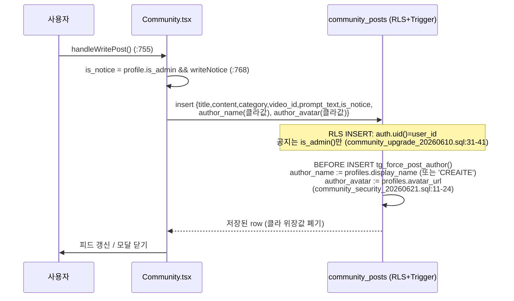
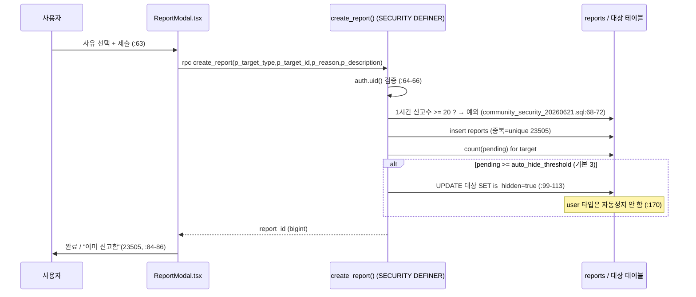
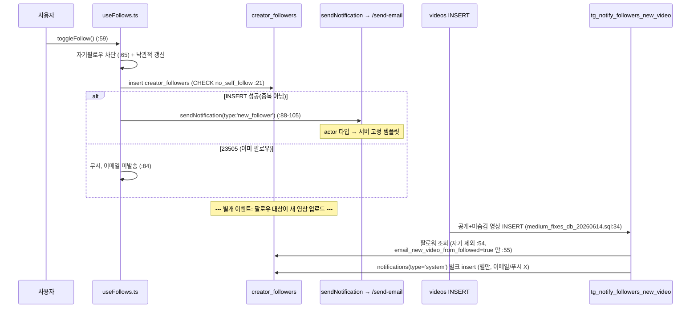
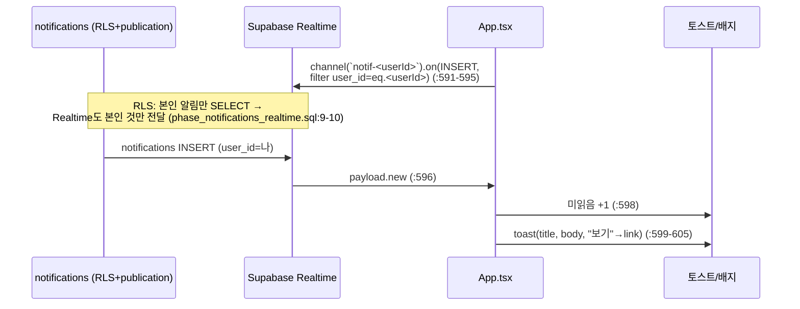
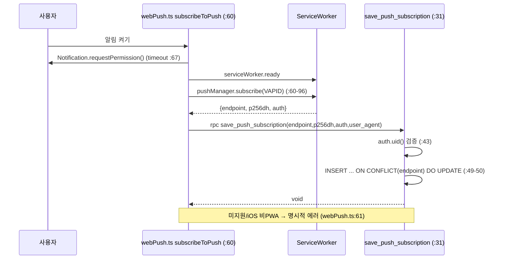
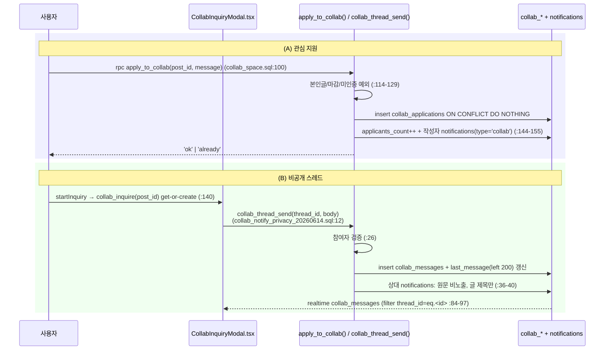

# 06. 커뮤니티 · 채널/팔로우 · 알림 — 상세 명세

> 본 문서는 실제 코드/마이그레이션을 읽고 작성된 SSOT 명세다. 모든 동작·계약·규칙은 `파일:라인`으로 근거를 표기한다(추측 금지).
>
> 대상 코드:
> - 프론트: `src/app/components/Community.tsx`, `CommunityChallengeDetail.tsx`, `ReportModal.tsx`, `CommentPanel.tsx`, `Channel.tsx`, `FollowButton.tsx`, `NotificationPanel.tsx`, `CollabInquiryModal.tsx`, `src/app/hooks/useFollows.ts`, `src/app/utils/sendNotification.ts`, `src/app/utils/webPush.ts`, `src/app/App.tsx`
> - DB/Edge: `supabase/features_tables.sql`, `community_upgrade_20260610.sql`, `community_security_20260621.sql`, `collab_space.sql`, `collab_inquiries.sql`, `collab_notify_privacy_20260614.sql`, `phase10_reports.sql`, `creator_followers.sql`, `phase34_notifications.sql`, `phase_notifications_realtime.sql`, `phase_web_push_20260531.sql`, `new_video_follower_notify_20260612.sql`, `medium_fixes_db_20260614.sql`, `functions/server/index.ts`(/send-email, /broadcast-email, /broadcast-push)

---

## 1. 개요 / 목적

CREAITE 의 소셜 레이어. 세 축으로 구성된다.

1. **커뮤니티** — 게시글 피드(팁·프롬프트·비교 등 7개 카테고리, 공지 고정), 매월 정기 챌린지(콘테스트), 크리에이터 협업 공간(모집/구직/도움/외주 + 비공개 1:1 문의 스레드). 댓글·좋아요·북마크·신고 포함. 진입 컴포넌트는 `Community.tsx:352` 의 `Community` (탭 3개: `posts` / `challenges` / `collab`, `Community.tsx:881-884`).
2. **채널/팔로우** — 크리에이터 구독(`creator_followers`). "구독" 탭은 팔로우한 채널의 최신 영상 피드, "탐색" 탭은 인기 크리에이터 카드. 진입 컴포넌트 `Channel.tsx:73`, 팔로우 토글은 전역 캐시 훅 `useFollows.ts:32`.
3. **알림/실시간** — 인앱 벨(`notifications` 테이블 + Realtime), 이메일(Resend), 웹 푸시(Service Worker + VAPID)의 3채널. 사용자별 opt-in/out 설정(`notification_preferences`). 벨 패널 `NotificationPanel.tsx:103`, 실시간 수신 `App.tsx:591-608`.

핵심 보안 원칙: 작성자명/아바타는 **서버 트리거로 강제**(위장 차단, `community_security_20260621.sql:11-29`), 타인에게 가는 이메일(actor 타입)은 **클라 콘텐츠를 신뢰하지 않고 서버 템플릿으로 고정**(`functions/server/index.ts:1416-1445`), 모든 알림 발송은 **사용자 설정 게이트**를 통과해야 한다(`should_send_notification`, `phase34_notifications.sql:168-207`).

---

## 2. 사용자 스토리

- 시청자/크리에이터로서, 프롬프트·팁을 **카테고리별로 올리고** 좋아요·북마크·댓글을 남기고 싶다.
- 관리자로서, **공지 글을 상단 고정**하고 부적절 글/댓글/사용자를 신고 큐로 처리하고 싶다.
- 크리에이터로서, **매월 챌린지에 출품**(`challenge:<tag>` 태그 영상 업로드)하고 다른 참여작을 보고 싶다.
- 크리에이터로서, **협업 글**(팀원 모집/외주 등)을 올리고, 관심 있는 사람과 **작성자만 보이는 1:1 비공개 스레드**로 대화하고 싶다.
- 시청자로서, 좋아하는 크리에이터를 **팔로우**하고 그들의 새 영상을 "구독" 피드에서 모아 보고 싶다.
- 사용자로서, 답글/새 팔로워/협업 문의/팔로우 채널 새 영상 같은 활동을 **벨·이메일·푸시**로 받되, 종류별로 **켜고 끄고** 싶다.
- 사용자로서, 앱을 켜둔 상태에서 새 알림이 오면 **즉시 토스트**로 뜨고(`App.tsx:599`), 잠금화면에서도 푸시를 받고 싶다.
- 신고당하지 않으려는 악성 사용자라도, **타인 이름 사칭·신고 도배·자기 팔로우·중복 좋아요/신고**는 시스템이 막아야 한다.

---

## 3. 화면 & 상태

### 3.1 커뮤니티 (`Community.tsx`)
- **탭 컨테이너**: `posts` / `challenges` / `collab` (`Community.tsx:879-908`). 외부 딥링크로 특정 탭 진입 가능(`initialTab`, `Community.tsx:360-366`; 유효값 `['posts','challenges','collab']`).
- **게시글 피드** (`posts` 탭, `Community.tsx:910-`):
  - 카테고리 필터 칩 `all + CATEGORIES`(`Community.tsx:312`, 필터 UI `:915-936`), 정렬 `latest|popular|comments`(`:937-953`, 로직 `visiblePosts` `:846-854`). 공지(`isNotice`)는 정렬과 무관하게 항상 최상단(`:849`).
  - 카드: 작성자 아바타/이름·타임스탬프·공지 배지·카테고리 배지·제목·본문(line-clamp-3)·프롬프트 미리보기(line-clamp-2)·임베드 영상 썸네일(`:986-1038`).
  - 비프리미엄은 외부 광고 슬롯 노출(`ExternalAdSlot`, `Community.tsx:973`; `isPremium` 판정 `:356`).
  - 상태: `posts/loadingPosts`(`:367-368`), `categoryFilter/sortKey`(`:370-371`), `likedPosts/bookmarkedPosts`(`:386-387`), `selectedPost`(상세, `:392`). 모듈 캐시(stale-while-revalidate) `postsCache`(`:349`).
- **글쓰기/수정 모달** (작성+수정 겸용): `showWriteModal`(`:389`), 필드 `writeTitle/writeContent/writeCategory/writePrompt/writeVideoId/writeNotice/editingPostId`(`:403-409`). 내 영상 임베드 선택 목록 `myVideos`(`:410`, 로드 `:424-439`). 공지 토글은 어드민에게만 의미(`:768`).
- **챌린지** (`challenges` 탭): `challenges/loadingChallenges`(`:373-374`), 상세 오버레이 `selectedChallenge`(`:393`). DB `challenges` 로드 + 참여작 수 카운트(`:493-531`).
- **협업** (`collab` 탭): `collabs/loadingCollab`(`:375-376`), 필터 `collabFilter`(`:377`), 작성 모달 `showCollabModal/collabForm`(`:379-383`), 비공개 문의 모달 `inquiryPost`(`:385`).
- **댓글 패널**: `commentPostId`(`:388`) → `CommentPanel` 렌더(영상이 아니라 `postId` 전달).
- **뒤로가기 LIFO**: 모든 모달/패널이 `useBackButton` 으로 등록(`Community.tsx:448-453`).

### 3.2 챌린지 상세 (`CommunityChallengeDetail.tsx`)
- 슬라이드 오버레이(`z-[60]`, `:149`). 히어로·핵심정보 3카드(상금/참여자/D-day, `:190-208`)·설명·규칙·시상·참여작 갤러리·sticky 참여 버튼(`:322-337`).
- 상태: `entries/entriesLoading`(`:51-52`), 참여작은 `videos.tags @> ['challenge:<tag>']` 공개 영상 좋아요순 12개(`:58-64`).
- 진행 상태 `ended|upcoming|ongoing` 계산(`:130-132`; `startsAt` 있으면 날짜 기준, 없으면 participants 0 = upcoming).

### 3.3 신고 모달 (`ReportModal.tsx`)
- 공통 컴포넌트. `targetType: 'video'|'comment'|'user'|'community_post'`(`:28`). 사유 7종(`REASON_KEYS`, `:39-47`) + 상세설명(최대 500자, `:175`).
- 상태: `selectedReason/description/submitting`(`:59-61`). 미인증 시 `onSignInClick` 후 닫힘(`:64-68`).

### 3.4 댓글 패널 (`CommentPanel.tsx`)
- 영상/커뮤니티글 겸용(`videoId` XOR `postId`, `:77`). 모바일 바텀시트 / 데스크탑 사이드패널(`mode`, `:711-714`).
- 상태: `comments`(부모+대댓글 중첩, `:83`), `likedComments`(`:95`), `replyTo`(`:93`), `expandedReplies`(`:94`), `openMenu`(`:96`), `reportTarget`(`:97`), 인라인 편집 로컬상태 `editing/draft/savingEdit`(`:444-446`).
- 작성자 전용 액션: 핀(`:610`)·하트(`:621`)·차단(`:689`). 본인 댓글: 수정(`:633`)·삭제(`:642`). 타인 댓글: 신고·차단 메뉴(`:652-704`).

### 3.5 채널 (`Channel.tsx`)
- 탭 `subscribed`(`Users` 아이콘) / `explore`(`Compass`)(`:23`, UI `:218-241`).
- **구독 탭** `SubscribedTab`(`:280`): 미인증 시 로그인 유도(`:294-312`), 빈 상태(`:322-335`), 영상 그리드(`:337-385`). 데이터 `get_my_following_videos`(`:125`).
- **탐색 탭** `ExploreTab`(`:391`): 인기 크리에이터 카드(TOP3 배지, 통계, 최근 썸네일 3개, FollowButton). 데이터 `get_popular_creators`(`:142`).
- 크리에이터 선택 시 `CreatorChannel` 풀스크린(`:188-200`).
- 상태: `activeTab`(`:75`), `followingVideos`(`:88`), `creators`(`:92`), `myFollows`(FollowButton 초기값, `:96`). 모듈 캐시 `channelCreatorsCache`/`followingVideosCache`(`:70-71`).

### 3.6 팔로우 버튼 (`FollowButton.tsx`)
- 두 사이즈: `sm`(원형 아이콘, `:42-69`) / `md`(텍스트, `:72-98`). 상태는 `useFollows()` 캐시에서 자동(`:25,27`). 자기 자신엔 렌더 안 함(`:30`). 로딩 중 스피너(`:59`).

### 3.7 알림 벨 패널 (`NotificationPanel.tsx`)
- 사이드패널(`w-80`, `:175`). 헤더에 미읽음 배지 + "모두 읽음"(`:181-196`).
- 상태: `notifications/loading`(`:108-109`). 미인증 시 샘플 알림(`SAMPLE_KO/EN`, `:20-72`).
- 타입별 아이콘/배경: `like/comment/purchase/sale/system/challenge/collab`(`:74-94`).
- 클릭 → 읽음 처리 + `link` 로 네비게이션(`handleClick` `:163-170`; 샘플 id `s` 접두는 이동 안 함).

### 3.8 협업 비공개 문의 모달 (`CollabInquiryModal.tsx`)
- 3-뷰 머신: `detail` / `list`(작성자: 받은 문의 목록) / `thread`(`:65`).
- 상태: `threads`(`:66`), `messages`(`:71`), `activeThreadId`(`:68`), `input/sending/starting`(`:73-75`), realtime `channelRef`(`:77`).
- 작성자/비작성자 분기 CTA(`:243-281`): 작성자=받은 문의 + 마감/재오픈 + 삭제, 비작성자=비공개 문의 시작(마감 글이면 비활성).

---

## 4. 동작 흐름

### 4.1 게시글 CRUD
- **작성**: `handleWritePost`(`Community.tsx:755-807`). `community_posts` insert, payload `title/content/category/video_id/prompt_text/is_notice`(`:762-769`). `is_notice` 는 `profile.is_admin && writeNotice` 일 때만 true(`:768`). `author_name/author_avatar` 를 클라가 보내지만 → **서버 트리거가 프로필 값으로 덮어씀**(`community_security_20260621.sql:11-24`).
- **수정**: 동일 함수, `editingPostId` 분기(`:770-782`). RLS `auth.uid()=user_id`.
- **삭제**: `handleDeletePost`(`:822-837`). RPC `delete_community_post`(댓글까지 cascade 삭제) → 미적용 환경이면 `community_posts.delete` 폴백(`:824-828`).
- 본인 글 검증은 UI가 아니라 RLS 가 최종 결정(0행 = 권한 없음).

### 4.2 댓글
- **로드**: `fetchComments`(`CommentPanel.tsx:102-176`). 부모는 `is_hidden=false` + `parent_id is null`(`:115-118`), 대댓글 별도 조회(`:135-140`). 내 좋아요 상태 `get_my_comment_likes`(`:164`).
- **작성**: `handleSubmit`(`:190-282`). `comments` insert, `video_id` XOR `post_id` + `parent_id`(`:204-206`). 삽입 직후 `is_hidden` 이면(자동 필터) 목록에 추가 안 하고 안내(`:219-224`).
- **답글 알림**: 원댓글 작성자 ≠ 본인이면 `sendNotification({type:'comment_reply'})`(`:242-268`). link 는 영상이면 `?video=…&comment=1`, 글이면 `?tab=community&sub=posts&post=…`(`:259-263`).
- **수정**: 인라인 `saveEdit`(`:448-498`). 수정 후 자동필터 숨김되면 목록 제거(`:468-482`).
- **핀/하트**: 영상 작성자만. `toggle_pin_comment`(`:365`)·`toggle_creator_heart`(`:389`). 핀은 한 댓글만(다른 핀 해제 후 정렬, `:373-386`).
- **댓글 수 동기화**: `comments` INSERT/DELETE/숨김변경 트리거 `tg_sync_post_comments_count` → `community_posts.comments_count` 재계산(`community_upgrade_20260610.sql:116-145`).

### 4.3 좋아요 / 북마크
- **게시글 좋아요**: `toggleLike`(`Community.tsx:694-720`). 낙관적 UI 후 `post_likes` upsert(`ignoreDuplicates`)/delete. 카운트는 트리거 `tg_sync_post_likes_count`(`community_upgrade_20260610.sql:49-77`)가 동기화(작성자 RLS 회피 위해 SECURITY DEFINER, `:47-48`). 실패 시 롤백(`:709-719`).
- **북마크**: `toggleBookmark`(`Community.tsx:723-746`). `post_bookmarks` upsert/delete(`post_bookmarks` 테이블 `community_upgrade_20260610.sql:88-109`).
- **댓글 좋아요**: `handleLike`(`CommentPanel.tsx:302-363`). `like_comment`/`unlike_comment` RPC → 서버 카운트로 보정(`:348-361`).
- 로그인 시 내 좋아요/북마크 일괄 로드(`Community.tsx:534-551`).

### 4.4 신고
- `ReportModal.handleSubmit`(`:63-103`) → `create_report(p_target_type,p_target_id,p_reason,p_description)`(`phase10_reports.sql:110-175`, rate-limit 추가본 `community_security_20260621.sql:48-117`).
- 자동 숨김: 같은 대상 `pending` 신고 ≥ `auto_hide_threshold`(기본 3) → 대상 `is_hidden=true`(`community_security_20260621.sql:99-113`). user 타입은 자동 정지 안 함(`phase10_reports.sql:170`).
- 어드민 처리: `moderate_report(keep|remove|dismiss)`(`phase10_reports.sql:183-268`). keep=복원, remove=숨김/정지, dismiss=단건 반려.
- 중복은 unique index 위반(23505) → UI가 "이미 신고함" 안내(`ReportModal.tsx:84-86`).

### 4.5 챌린지 출품
- 정규 출품 테이블 없음. 영상 업로드 시 `tags` 에 `challenge:<tag>` 를 넣어 연결(참여작 조회 `CommunityChallengeDetail.tsx:58-64`, 참여자수 카운트 `Community.tsx:514-523`).
- 참여 버튼 `handleParticipate`(`:134-141`): upcoming=안내 토스트, 그 외 `onParticipate(challenge)` → 업로드 진입. 챌린지 참가 시 오버레이를 먼저 닫고 닫힘 애니메이션 후 이동(history 충돌 방지, `Community.tsx:396-400`).

### 4.6 협업 — 지원 / 스레드
- **글 등록**: `handleCreateCollab`(`Community.tsx:609-645`). `collab_posts` insert(작성자명은 트리거가 강제, `community_security_20260621.sql:26-29`).
- **지원(관심)**: `apply_to_collab(p_post_id,p_message)`(`collab_space.sql:100-159`). 'ok'/'already' 반환. 본인 글/마감/미인증은 예외. 성공 시 `applicants_count++` + 작성자에게 `notifications(type='collab')` insert(`:144-155`).
- **비공개 문의 스레드** (`collab_inquiries.sql`):
  - 시작: `collab_inquire(p_post_id)` get-or-create 스레드(`:62-75`). 호출 `CollabInquiryModal.startInquiry`(`:140-148`).
  - 전송: `collab_thread_send(p_thread_id,p_body)`(`collab_notify_privacy_20260614.sql:12-43`, 최신본). 메시지 insert + 스레드 last_message 갱신 + **상대에게 알림(메시지 원문 비노출, 글 제목만)** (`:36-40`).
  - 목록: `collab_threads_for(p_post_id)` (작성자=전체, 문의자=본인 것, unread 포함, `collab_inquiries.sql:115-137`).
  - 읽음: `collab_thread_mark_read`(`:140-152`).
  - Realtime: `collab_messages` 가 publication 에 추가됨(`collab_inquiries.sql:155-157`). 클라 구독 `CollabInquiryModal.subscribe`(`:84-97`), 필터 `thread_id=eq.<id>`.

### 4.7 팔로우 / 언팔
- `useFollows.toggleFollow`(`useFollows.ts:59-127`). 모듈 캐시 + subscribers 로 전 컴포넌트 공유(`:12-30`).
- 낙관적 갱신 후 `creator_followers` insert/delete(`:79-113`). insert 23505(이미 팔로우)는 무시(`:84`). 실패 시 롤백(`:115-124`).
- INSERT 성공 시(중복 아님)에만 새 팔로워 이메일 `sendNotification({type:'new_follower'})`(`:88-105`), link=팔로워의 채널.
- 자기 팔로우 차단: 클라(`:65`) + DB CHECK `no_self_follow`(`creator_followers.sql:21`).

### 4.8 새 영상 팬아웃 알림
- DB 트리거 `tg_notify_followers_new_video`(`new_video_follower_notify_20260612.sql:20-52`, 최신본 `medium_fixes_db_20260614.sql:34-58`). `videos` INSERT 시 공개+미숨김 영상이면 팔로워 전원에게 `notifications(type='system')` 벌크 insert.
- **opt-in 게이트**: `notification_preferences.email_new_video_from_followed = true` 인 팔로워만(`medium_fixes_db_20260614.sql:55`, `COALESCE(...,false)` → 기본 OFF). 자기 자신 제외(`:54`).
- 이메일/푸시가 아니라 **벨 알림**으로만 보냄(Resend 비용 절감, 파일 헤더 주석 `new_video_follower_notify_20260612.sql:4-6`).

### 4.9 Realtime 수신 (벨)
- `notifications` 가 `supabase_realtime` publication 에 등록됨(`phase_notifications_realtime.sql:13-23`).
- 클라 구독 `App.tsx:591-608`: 채널 `notif-<userId>`, `event:INSERT`, `filter: user_id=eq.<userId>`. 수신 시 미읽음 +1 + 토스트(`title/body`, "보기" 액션이 `link` 로 이동, `:599-605`).
- 진입 시 미읽음 수 초기 로드(`:584-588`). 로그아웃이면 0(`:578-580`).
- RLS 가 본인 알림만 SELECT 허용하므로 Realtime 도 본인 것만 전달(보안 주석 `phase_notifications_realtime.sql:9-10`).

### 4.10 웹 푸시 구독
- 클라 `subscribeToPush`(`webPush.ts:60-96`): 권한 요청 → `serviceWorker.ready` → `pushManager.subscribe(VAPID)` → `save_push_subscription(endpoint,p256dh,auth,user_agent)`(`phase_web_push_20260531.sql:31-53`). 모든 await 에 timeout(`:67-95`).
- 해제 `unsubscribeFromPush`(`:98-107`) → `delete_push_subscription`(`phase_web_push_20260531.sql:56-67`) + `sub.unsubscribe()`.
- 발송은 Edge `/send-push` 가 service_role 로 `push_subscriptions` 조회 후 web-push(파일 주석 `phase_web_push_20260531.sql:5-7`).
- 푸시 클릭 → SW(`sw.js`)가 `postMessage({type:'push-navigate',url})` → `App.tsx:480-489` 가 SPA 네비게이션 처리.
- iOS 한계: 홈 화면 설치 PWA + iOS 16.4+ 만 동작(`webPush.ts:9`).

### 4.11 이메일 발송 (actor 흐름)
- 클라 `sendNotification`(`sendNotification.ts:48-81`) → Edge `/send-email`(`functions/server/index.ts:1361-`).
- 서버: 호출자 토큰 검증(`:1366-1370`) → `providedTo` 무시·user_id 로 수신자 조회(`:1372,1390-1396`) → 타입별 권한(self/admin/actor, `:1379-1388`) → 벨 INSERT(`:1447-1454`) → `should_send_notification(email)` 게이트(`:1460-1472`) → Resend(`:1484-`) → `log_notification`(`:1502,1515`).

---

## 5. 데이터 / RPC 계약

### 5.1 테이블 · RLS
| 테이블 | 정의 | RLS 요약 |
|---|---|---|
| `community_posts` | `features_tables.sql:98-111` (+`is_notice/video_id/prompt_text/is_hidden` 확장) | SELECT: 숨김 아님 OR 본인 OR admin(`community_security_20260621.sql:35-41`). INSERT/UPDATE: 본인 + 공지는 admin만(`community_upgrade_20260610.sql:30-41`). DELETE: 본인(`features_tables.sql:128-129`) |
| `post_likes` | `features_tables.sql:132-137` | SELECT all, INSERT/DELETE 본인(`:141-148`) |
| `post_bookmarks` | `community_upgrade_20260610.sql:88-93` | SELECT/INSERT/DELETE 본인만(`:99-109`) |
| `comments` | (features 외) `is_hidden` 확장 `phase10_reports.sql:28-30` | SELECT 숨김 게이트(코드상 `is_hidden=false` 필터, `CommentPanel.tsx:116`) |
| `challenges` | `community_upgrade_20260610.sql:157-172` | SELECT all(`:179-180`), 그 외 admin(`:182-184`) |
| `collab_posts` | `collab_space.sql:17-31` | SELECT all, INSERT/UPDATE/DELETE 본인(`:39-56`); admin 삭제는 service_role/별도 마이그레이션 |
| `collab_applications` | `collab_space.sql:59-67` | SELECT 지원자 OR 글주인(`:75-80`), INSERT/DELETE 본인(`:83-90`) |
| `collab_threads` | `collab_inquiries.sql:15-23` | SELECT 문의자 OR 글주인(`:29-34`) |
| `collab_messages` | `collab_inquiries.sql:37-44` | SELECT 스레드 참여자(`:49-58`); INSERT는 RPC만 |
| `creator_followers` | `creator_followers.sql:16-22` | SELECT all, INSERT/DELETE 본인(`:34-44`), `no_self_follow` CHECK(`:21`) |
| `reports` | `phase10_reports.sql:54-83` | SELECT 본인 OR admin(`:336-342`); INSERT/UPDATE는 RPC만 |
| `notifications` | `features_tables.sql:68-77` (type에 `collab` 추가 `collab_space.sql:93-95`) | SELECT/UPDATE/INSERT/DELETE 본인(`:85-95`) |
| `notification_preferences` | `phase34_notifications.sql:17-41` | SELECT/UPDATE 본인(`:45-53`); INSERT는 트리거/RPC |
| `notification_log` | `phase34_notifications.sql:58-70` | SELECT 본인(`:79-82`); INSERT RPC만 |
| `push_subscriptions` | `phase_web_push_20260531.sql:11-19` | SELECT 본인(`:25-27`); INSERT/DELETE RPC만 |

### 5.2 RPC 계약
- `create_report(text,text,text,text?) → bigint` — 신고 기록 + 자동숨김 + rate-limit(1시간 20건, `community_security_20260621.sql:68-72`). SECURITY DEFINER.
- `moderate_report(bigint,text,text?) → void` — 어드민 전용(`phase10_reports.sql:183-268`).
- `get_pending_reports()` / `get_my_reports()` (`phase10_reports.sql:276-329`).
- `apply_to_collab(uuid,text?) → text('ok'|'already')` (`collab_space.sql:100-159`).
- `collab_inquire(uuid) → uuid` / `collab_thread_send(uuid,text) → (id,created_at)` / `collab_threads_for(uuid)` / `collab_thread_mark_read(uuid)` (`collab_inquiries.sql`, send 최신본 `collab_notify_privacy_20260614.sql`).
- `get_my_following_videos(int)` / `get_popular_creators(int)` / `get_creator_profile(uuid)` / `get_creator_videos(uuid,int)` (`creator_followers.sql:50-280`, GRANT anon+authenticated `:283-286`).
- 댓글: `get_my_comment_likes` / `like_comment` / `unlike_comment` / `toggle_pin_comment` / `toggle_creator_heart` / `creator_block_user`(`CommentPanel.tsx:164,331,366,390,414`).
- 알림: `get_my_notification_preferences()` / `update_my_notification_preferences(jsonb)` / `should_send_notification(uuid,text,text)→bool` / `log_notification(...)` (`phase34_notifications.sql:87-244`).
- 푸시: `save_push_subscription(text,text,text,text?)` / `delete_push_subscription(text)` (`phase_web_push_20260531.sql:31-67`).
- `delete_community_post(p_post_id)` — 글+댓글 cascade 삭제(`Community.tsx:824`, 정의는 `fixes_audit_20260611.sql`).

### 5.3 트리거
- `community_posts_force_author` / `collab_posts_force_author` — 작성자명·아바타 강제(`community_security_20260621.sql:21-29`).
- `post_likes_sync_count` — 좋아요 카운트 동기화(`community_upgrade_20260610.sql:74-77`).
- `comments_sync_post_count` — 댓글 카운트 재계산(`:142-145`).
- `trg_notify_followers_new_video` — 새 영상 팬아웃(`medium_fixes_db_20260614.sql:34-58`).
- `trg_init_notification_preferences` — 가입 시 기본 설정 INSERT(`phase34_notifications.sql:266-270`).

---

## 6. 비즈니스 규칙

1. **작성자명 서버 강제** — `community_posts`/`collab_posts` INSERT·UPDATE 시 트리거가 `profiles.display_name`(없으면 'CREAITE')·`avatar_url` 로 덮어씀. 클라 입력 무시(`community_security_20260621.sql:11-29`).
2. **공지는 관리자만** — `is_notice=true` 는 `public.is_admin()` 일 때만 INSERT/UPDATE 허용(`community_upgrade_20260610.sql:31-41`). 클라는 `is_admin && writeNotice` 로만 true 전송(`Community.tsx:768`). 공지는 항상 피드 최상단(`:849`).
3. **숨김 글 비노출** — 자동/수동 숨김 글 본문은 작성자·관리자만(`community_security_20260621.sql:35-41`). 숨김 댓글은 SELECT 에서 제외(`CommentPanel.tsx:116,139`).
4. **신고 자동숨김 + rate-limit** — 같은 대상 pending 신고 ≥ 임계값(기본 3) → 자동 숨김. 한 사용자 1시간 20건 초과 신고 차단(`community_security_20260621.sql:68-72,93-113`).
5. **자기 팔로우 금지** — DB CHECK `no_self_follow`(`creator_followers.sql:21`) + 클라 가드(`useFollows.ts:65`, `FollowButton.tsx:30`).
6. **알림 opt-in** — 모든 발송은 `should_send_notification(channel)` 통과 필수(`phase34_notifications.sql:168-207`). 푸시는 전 종류 기본 OFF(`:31-38`), 새 영상/답글 이메일도 기본 OFF(`medium_fixes_db_20260614.sql:55`, `new_video_follower_notify_20260612.sql:11`).
7. **정지자 쓰기 차단** — `profiles.is_suspended`(`phase10_reports.sql:38`). 어드민 remove 액션이 user 대상이면 정지(`:247-250`).
8. **협업 자기 글 지원/문의 금지** — `apply_to_collab`(`collab_space.sql:124-126`), `collab_inquire`(`collab_inquiries.sql:69`).
9. **마감 협업은 지원/문의 불가** — status='closed' 예외(`collab_space.sql:127-129`), UI 비활성(`CollabInquiryModal.tsx:263-264`).
10. **actor 이메일은 서버 템플릿 고정** — 타인에게 가는 알림은 클라 subject/html/link 무시, 서버 고정 템플릿 사용(피싱 차단, `functions/server/index.ts:1416-1445`).

---

## 7. 엣지 케이스 & 에러 처리

- **위장 방지**: 클라가 `author_name='관리자'` 로 insert 시도해도 트리거가 프로필명으로 덮음(§6.1). UPDATE 에도 적용.
- **중복 좋아요/북마크**: upsert `onConflict + ignoreDuplicates`(`Community.tsx:708,736`) → 더블탭/경합에도 1행. 카운트 트리거는 INSERT/DELETE 만 반응하므로 중복 upsert는 카운트 미증가.
- **중복 신고**: unique index `idx_reports_dedup`(`phase10_reports.sql:86-88`) → 23505 → "이미 신고함"(`ReportModal.tsx:84-86`).
- **중복 팔로우**: insert 23505 무시(`useFollows.ts:84`), 이메일도 미발송(`:88`).
- **삭제된 딥링크 대상**: 글/챌린지 미존재 시 토스트 안내 + 신호 소거(재시도 루프 방지)(`Community.tsx:593,604,572`).
- **마이그레이션 미적용 폴백**: 챌린지 테이블 없으면 하드코딩 폴백(`Community.tsx:507-511`), `delete_community_post` 없으면 단순 delete 폴백(`:824-828`).
- **Realtime 권한**: notifications/collab_messages 둘 다 RLS 가 본인/참여자만 SELECT → Realtime 도 그 범위만 전달(`phase_notifications_realtime.sql:9-10`).
- **푸시 endpoint**: `endpoint UNIQUE` + `save_push_subscription` ON CONFLICT 업서트(기기 재구독·소유자 변경 처리, `phase_web_push_20260531.sql:14,49-50`). 미지원 브라우저/iOS 비PWA 는 명시적 에러(`webPush.ts:61`). 모든 await timeout 으로 무한 로딩 방지(`webPush.ts:67-95`).
- **자동 필터 숨김 댓글**: insert/edit 직후 `is_hidden` 이면 목록 미반영 + 안내(`CommentPanel.tsx:219-224,468-482`).
- **낙관적 UI 실패**: 좋아요/북마크/팔로우 모두 실패 시 롤백(`Community.tsx:709-719,737-744`, `useFollows.ts:115-124`).

---

## 8. 권한 / 보안

- **RLS 본인/공개/admin 매트릭스**: §5.1 참조. 공개 SELECT(community_posts·challenges·collab_posts·creator_followers), 본인 한정(post_bookmarks·notification_preferences·push_subscriptions·notification_log), 참여자 한정(collab_threads/messages), admin 게이트(challenges 관리·reports 조회·공지).
- **Realtime RLS 상속** — 별도 정책 없이 테이블 RLS 를 그대로 따른다(notifications=본인, collab_messages=참여자). publication 등록만으로 충분(`phase_notifications_realtime.sql`, `collab_inquiries.sql:155-157`).
- **SECURITY DEFINER 사용 근거** — 카운트 동기화/타인 알림 insert/팬아웃은 작성자 RLS 를 우회해야 하므로 DEFINER + `SET search_path=public`(`community_upgrade_20260610.sql:47-48`, `collab_space.sql:103-104`).
- **send-email actor 템플릿** — self/admin/actor 권한 분기(`index.ts:1379-1388`), actor 는 서버 고정 subject/html/link(`:1416-1445`), 수신자 이메일은 항상 서버 조회(오픈릴레이 차단, `:1372`).
- **수신거부 일관성** — 이메일 푸터에 알림 설정 링크 포함(서버 템플릿 `index.ts:1434`, 클라 템플릿 `sendNotification.ts:108` 등).
- **메시지 프라이버시** — 협업 알림 body 에 메시지 원문 비노출(글 제목만), `last_message`(200자)는 스레드 당사자에게만(`collab_notify_privacy_20260614.sql:36-40`).

---

## 9. 분석 / 이벤트

> 현재 코드에 전용 analytics 호출은 없음. 아래는 자연 발생하는 측정 가능 신호.

- **참여 카운터(DB)**: `community_posts.likes_count/comments_count`, `collab_posts.applicants_count`, `creator_followers`(팔로워 수), `videos.tags challenge:<tag>`(챌린지 참여작 수).
- **발송 감사**: `notification_log`(channel/type/status/resend_message_id, `phase34_notifications.sql:58-70`) — 발송 성공/실패/skip 추적.
- **신고 큐 지표**: `reports.status`(pending/kept/removed/dismissed) + `get_pending_reports.report_count`.
- **인기 크리에이터 랭킹**: `get_popular_creators` 정렬키 = follower_count → total_views → video_count(`creator_followers.sql:173-177`).
- 제언(미구현): 글 작성·챌린지 출품·협업 문의 시작·푸시 구독 전환을 별도 이벤트로 적재하면 퍼널 분석 가능.

---

## 10. 수용 기준 (체크리스트)

- [ ] 게시글 작성/수정/삭제가 RLS(본인) 하에 동작하고, 삭제 시 댓글도 함께 제거된다.
- [ ] 클라가 author_name 을 위조해도 저장 결과는 프로필 표시명이다.
- [ ] 공지 토글은 어드민에게만 효력이 있고, 공지는 항상 피드 최상단에 고정된다.
- [ ] 카테고리 필터·정렬(최신/인기/댓글)이 의도대로 동작한다.
- [ ] 좋아요/북마크/댓글좋아요가 낙관적 갱신되고, 실패 시 롤백되며, 카운트가 트리거로 정확히 동기화된다.
- [ ] 같은 대상 중복 신고는 막히고, 1시간 20건 초과 신고가 차단되며, 임계값 누적 시 자동 숨김된다.
- [ ] 숨김 글/댓글은 작성자·관리자 외에는 보이지 않는다.
- [ ] 챌린지 참여작은 `challenge:<tag>` 공개 영상만 좋아요순으로 표시되고, upcoming 챌린지는 참여가 막힌다.
- [ ] 협업 지원·비공개 문의가 본인 글에는 불가, 마감 글에는 불가하다.
- [ ] 협업 스레드는 작성자↔문의자 둘만 열람되고, 새 메시지가 realtime 으로 수신되며, 알림 body 에 원문이 노출되지 않는다.
- [ ] 자기 자신은 팔로우할 수 없고(클라+DB), 중복 팔로우는 무시되며, 새 팔로워 이메일은 INSERT 성공 시 1회만 발송된다.
- [ ] "구독" 피드가 팔로우한 채널의 공개 영상만 모아 보여준다.
- [ ] 앱을 켜둔 상태에서 새 알림 INSERT 시 벨 배지 +1 + 토스트가 뜬다(본인 알림만).
- [ ] 새 영상 팬아웃 알림은 opt-in 한 팔로워에게만(기본 OFF), 자기 자신 제외하고 발송된다.
- [ ] 모든 이메일/푸시는 사용자 설정(should_send) OFF면 skip 되고 그 사실이 log 에 남는다.
- [ ] actor 이메일은 클라 콘텐츠가 아닌 서버 고정 템플릿으로 발송된다.
- [ ] 웹 푸시 구독/해제가 동작하고(미지원 기기는 명시적 에러), 푸시 클릭이 올바른 화면으로 이동한다.

---

## 11. 알려진 제약 / 이월

- **챌린지 출품 비정규화** — 별도 출품 테이블 없이 영상 `tags` 의 `challenge:<tag>` 문자열로만 연결(`CommunityChallengeDetail.tsx:61`). 출품 메타(제출 시각·순위·심사상태)·자동 순위·중복 출품 제한(규칙상 1인 3편 `:100`은 안내만, 강제 없음) 미구현.
- **챌린지 시상/심사 수동** — 시상 구조는 하드코딩 텍스트(`CommunityChallengeDetail.tsx:81-110`). 자동 정산·당첨자 표기 없음.
- **협업 지원 vs 문의 이원화** — `collab_applications`(관심 기록, `apply_to_collab`)와 `collab_threads`(비공개 대화) 두 모델이 공존. 현재 UI 는 주로 문의 스레드를 사용(`CollabInquiryModal`).
- **푸시 발송 FCM/web-push 후행** — 구독 저장·설정은 완비, 실제 발송 Edge `/send-push` 의 운영 활성화는 VAPID private key/배포 의존(`phase_web_push_20260531.sql:5-7`, `webPush.ts:13-17`).
- **알림 타입 enum 분산** — `notifications.type` CHECK 에 `collab` 추가(`collab_space.sql:93-95`)됐으나 프론트 `Notification` 타입 정의(`NotificationPanel.tsx:9-17`)에는 union 에 `collab` 미포함(아이콘/배경 맵에는 있음). 표시는 되지만 타입 정의 불일치 정리 필요.
- **미인증 샘플 알림** — 로그인 전 벨에 가짜 샘플 노출(`NotificationPanel.tsx:20-72`); 실데이터와 혼동 방지 위해 id `s` 접두로 클릭 무효화(`:166`).
- **i18n 혼용** — 카테고리 키는 한글 상수("팁","챌린지" 등)를 그대로 DB CHECK·필터에 사용(`features_tables.sql:105`, `Community.tsx:312`). 다국어 라벨은 별도 키 맵(`:314-322`)으로만 처리.

---

## 와이어프레임 (텍스트 목업)

> 실제 컴포넌트 구조 기준의 ASCII 목업. 좌표·픽셀이 아니라 정보 위계/상태를 표현한다.

### 커뮤니티 — 게시글 피드 (`posts` 탭, `Community.tsx:910-`)

```
┌───────────────────────────────────────────────────────────────┐
│  커뮤니티                                          [+ 글쓰기]   │
│  ┌─────────────────────────────────────────────────────────┐  │
│  │ [게시글] [챌린지] [협업]            ← 탭 (:879-908)        │  │
│  └─────────────────────────────────────────────────────────┘  │
│  카테고리:  (전체) (팁) (프롬프트) (비교) (질문) (자랑) ...     │  ← :915-936
│  정렬:      [최신 ▼]  최신 | 인기 | 댓글                       │  ← :937-953
│                                                                 │
│  ┌─────────────────────────────────────────────────────────┐  │
│  │ 📌 공지  [공지 배지]            ← isNotice 항상 최상단 :849│  │
│  │ (아바타) 관리자 · 3시간 전                                 │  │
│  │ [공지] 6월 챌린지 안내                                     │  │
│  │ 본문 미리보기 (line-clamp-3) ...                           │  │
│  └─────────────────────────────────────────────────────────┘  │
│  ┌─────────────────────────────────────────────────────────┐  │
│  │ (아바타) 홍길동 · 1시간 전           [프롬프트] 카테고리   │  │
│  │ 제목 텍스트                                                │  │
│  │ 본문 미리보기 (line-clamp-3) ...                           │  │
│  │ ┌── 프롬프트 미리보기 (line-clamp-2) ──┐                  │  │
│  │ │ "cinematic, slow dolly-in ..."        │                  │  │
│  │ └───────────────────────────────────────┘                  │  │
│  │ [▶ 임베드 영상 썸네일]            ← writeVideoId :986-1038 │  │
│  │ ♥ 12   💬 4   🔖   ⚐ 신고                                 │  │
│  └─────────────────────────────────────────────────────────┘  │
│  ┌─ [외부 광고 슬롯] ExternalAdSlot (비프리미엄만 :973) ─────┐  │
│  └─────────────────────────────────────────────────────────┘  │
└───────────────────────────────────────────────────────────────┘
```

### 커뮤니티 — 글쓰기/수정 모달 (`showWriteModal`, `Community.tsx:389,755-807`)

```
┌──────────────── 글쓰기 / 수정 ────────────────[X]┐
│ 카테고리: [팁 ▼]                                   │  ← writeCategory
│ 제목:    [______________________________]          │  ← writeTitle
│ 본문:    [                              ]           │  ← writeContent
│          [                              ]           │
│ 프롬프트: [_____________________________] (선택)    │  ← writePrompt
│ 영상 임베드: [내 영상 선택 ▼] myVideos (:410,424)   │  ← writeVideoId
│ ┌ ⚠ 공지로 등록 (관리자 전용) ──────────┐          │  ← writeNotice, :768
│ │ [ ] is_admin 일 때만 의미                │          │
│ └──────────────────────────────────────┘          │
│                          [취소]   [등록하기]        │
│  ※ author_name/avatar 는 입력칸 없음 → 서버 강제     │
└────────────────────────────────────────────────────┘
```

### 커뮤니티 — 챌린지 카드 + 상세 (`challenges` 탭, `CommunityChallengeDetail.tsx`)

```
┌──────────── 챌린지 카드 (:493-531) ────────────┐
│ [히어로 배너]                                     │
│ 6월 챌린지: "비 오는 도시"                         │
│ 상태: ● 진행중 (ongoing | upcoming | ended :130) │
│ 🏆 상금  · 👥 참여 23 · ⏳ D-7                    │
│                              [참여하기 →]         │
└──────────────────────────────────────────────────┘
        │ 클릭 → 슬라이드 오버레이 (z-[60] :149)
        ▼
┌──────────── 챌린지 상세 ──────────────[X]┐
│ [히어로]                                    │
│ ┌상금┐ ┌참여자┐ ┌D-day┐   ← 3카드 :190-208│
│ 설명 / 규칙 / 시상(하드코딩 :81-110)        │
│ 참여작 갤러리:                              │
│  videos.tags @> ['challenge:<tag>']         │  ← :58-64
│  공개·좋아요순 12개                          │
│  [썸] [썸] [썸] [썸] ...                     │
│ ─────────────────────────────────────────  │
│ [참여하기]  (sticky, upcoming이면 안내토스트)│  ← :134-141,322-337
└─────────────────────────────────────────────┘
```

### 커뮤니티 — 협업 카드 + 비공개 문의 (`collab` 탭, `CollabInquiryModal.tsx`)

```
┌──────────── 협업 카드 ────────────┐
│ [모집] 영상 편집자 구합니다         │  ← type: recruit|join|help|outsource
│ (아바타) 김감독 · 2일 전            │
│ 역할: 편집, 모션그래픽              │
│ 보상: 협의 · 지원 5명               │  ← applicants_count
│ 상태: ● open                       │
│              [관심] [문의하기]      │
└────────────────────────────────────┘
   │ 문의하기 → 3-뷰 머신 (:65)
   ▼
detail ──► (작성자) list: 받은 문의 목록      ──► thread
           ┌────────────────────────┐          ┌──────────────────────┐
           │ 김편집 · 미읽음 2        │          │ ← 「영상 편집자」      │
           │ 이모션 · 마감           │          │ [상대] 안녕하세요...   │
           └────────────────────────┘          │ [나] 포트폴리오는...   │
           (비작성자) detail:                    │ ......                │
           [비공개 문의 시작]                    │ [_________] [전송]    │  ← input :73
           (마감 글이면 비활성 :263)             │ realtime 구독 :84-97   │
                                                └──────────────────────┘
```

### 커뮤니티 — 신고 모달 (`ReportModal.tsx`)

```
┌──────────── 신고하기 ────────────[X]┐
│ 대상: community_post | video | comment | user  (:28)
│ 사유 (REASON_KEYS :39-47):           │
│  ( ) 스팸/광고      ( ) 부적절         │
│  ( ) 저작권 침해    ( ) 폭력           │
│  ( ) 괴롭힘         ( ) 허위정보       │
│  (•) 기타                              │
│ 상세설명 (선택, 최대 500자 :175):      │
│  [______________________________]      │
│                  [취소]   [신고 제출]   │
│  ※ 미인증 → onSignInClick 후 닫힘 :64   │
└────────────────────────────────────────┘
```

### 채널 — 구독/탐색/크리에이터 채널 (`Channel.tsx`)

```
┌──────────────────────── 채널 ────────────────────────┐
│ [👥 구독]  [🧭 탐색]              ← activeTab :23,218  │
├───────────────────────────────────────────────────────┤
│ ▣ 구독 탭 (SubscribedTab :280)                        │
│   get_my_following_videos (:125)                       │
│   미인증 → 로그인 유도(:294) / 빈 상태(:322)           │
│   ┌─────┐ ┌─────┐ ┌─────┐                            │
│   │ 영상 │ │ 영상 │ │ 영상 │  ← 그리드 :337-385        │
│   └─────┘ └─────┘ └─────┘                            │
│                                                        │
│ ▣ 탐색 탭 (ExploreTab :391)                           │
│   get_popular_creators (:142)                          │
│   ┌──────────────────────────────────────┐           │
│   │ 🥇TOP3  (아바타) 김감독                │           │
│   │ 팔로워 1.2K · 영상 34 · 조회 50K       │           │
│   │ [썸][썸][썸]            [팔로우] (md)  │  ← FollowButton :72
│   └──────────────────────────────────────┘           │
│   클릭 → CreatorChannel 풀스크린 (:188-200)            │
└───────────────────────────────────────────────────────┘

FollowButton 상태(useFollows 캐시 :25): [팔로우] ⇄ [팔로잉] (스피너 로딩 :59)
자기 자신이면 렌더 안 함(:30)
```

### 알림 — 벨 패널 (`NotificationPanel.tsx`)

```
            🔔(3)  ← 미읽음 배지 (App.tsx unread)
            │ 클릭
            ▼
┌──────────────────── 알림 (w-80 :175) ────────────────────┐
│ 알림                                  [모두 읽음] (:181)   │
├───────────────────────────────────────────────────────────┤
│ 💬 새 답글이 달렸습니다           ● 미읽음  ← comment      │
│    "제목" · 5분 전                                          │
│ ❤ 좋아요를 받았습니다                       ← like         │
│ 👤 새 팔로워가 생겼습니다                    ← system       │
│ 🤝 김편집님이 협업에 관심...                 ← collab       │
│ 🏆 챌린지 결과 발표                          ← challenge    │
│ 💰 정산이 완료되었습니다                     ← sale         │
│   (타입별 아이콘/배경 :74-94)                              │
│   클릭 → 읽음 처리 + link 이동 (handleClick :163-170)      │
│   ※ 미인증이면 SAMPLE_KO 샘플, id 's' 접두는 이동 안 함     │
└───────────────────────────────────────────────────────────┘
```

---

## 시퀀스 다이어그램

> mermaid. 실제 함수/파일:라인 기준. 단순화를 위해 일부 분기 생략.

### S1. 게시글 작성 (작성자명 서버 강제)



### S2. 신고 → 자동 숨김



### S3. 팔로우 + 새 영상 팬아웃 알림



### S4. Realtime 벨 수신



### S5. 웹 푸시 구독



### S6. 협업 지원 / 비공개 문의 스레드



---

## API / RPC 레퍼런스

> 인자/반환/권한/근거(파일:라인). RLS는 §5.1 보강.

### 테이블 RLS (핵심)

| 테이블 | SELECT | INSERT | UPDATE/DELETE | file:line |
|---|---|---|---|---|
| `community_posts` | 숨김아님 OR 본인 OR admin | 본인(공지는 admin) | 본인 | `community_security_20260621.sql:35-41`, `community_upgrade_20260610.sql:30-41`, `features_tables.sql:128-129` |
| `comments` | `is_hidden=false`(코드 필터) | 본인 | 본인 | `phase10_reports.sql:28-30`, `CommentPanel.tsx:116` |
| `reports` | 본인 OR admin | RPC만 | RPC만(moderate) | `phase10_reports.sql:336-342` |
| `creator_followers` | 전체 | 본인(`no_self_follow`) | DELETE 본인 | `creator_followers.sql:16-22,34-44` |
| `notifications` | 본인 | 본인(타인은 DEFINER RPC) | 본인 | `features_tables.sql:85-95`, type+collab `collab_space.sql:93-95` |
| `collab_threads` | 문의자 OR 글주인 | RPC만 | — | `collab_inquiries.sql:29-34` |
| `collab_messages` | 스레드 참여자 | RPC만 | — | `collab_inquiries.sql:49-58` |
| `push_subscriptions` | 본인 | RPC만 | RPC만 | `phase_web_push_20260531.sql:25-27` |

### RPC

| RPC | 인자 | 반환 | 권한 | file:line |
|---|---|---|---|---|
| `create_report` | `(p_target_type text, p_target_id text, p_reason text, p_description text=null)` | `bigint` (report_id) | DEFINER, authenticated. auth 필수, 1h 20건 제한, 본인 user 신고 차단, 자동숨김 | `community_security_20260621.sql:48-117` |
| `moderate_report` | `(bigint, text 'keep'|'remove'|'dismiss', text? note)` | `void` | admin 전용 | `phase10_reports.sql:183-268` |
| `apply_to_collab` | `(p_post_id uuid, p_message text=null)` | `text 'ok'|'already'` | DEFINER. auth 필수, 본인글/마감 예외, 작성자 알림 | `collab_space.sql:100-159` |
| `collab_inquire` | `(p_post_id uuid)` | `uuid` (thread_id, get-or-create) | DEFINER. 본인글 예외 | `collab_inquiries.sql:62-76` |
| `collab_thread_send` | `(p_thread_id uuid, p_body text)` | `TABLE(id uuid, created_at timestamptz)` | DEFINER. 참여자만. 원문 비노출 알림 | `collab_notify_privacy_20260614.sql:12-45` |
| `collab_threads_for` | `(p_post_id uuid)` | `TABLE(thread_id,other_id,other_name,other_avatar,last_message,last_message_at,unread)` | DEFINER. 작성자=전체/문의자=본인 | `collab_inquiries.sql:115-137` |
| `collab_thread_mark_read` | `(p_thread_id uuid)` | `void` | DEFINER. 참여자만 | `collab_inquiries.sql:140-152` |
| `save_push_subscription` | `(p_endpoint text, p_p256dh text, p_auth text, p_user_agent text=null)` | `void` | DEFINER, authenticated. auth 필수, endpoint upsert | `phase_web_push_20260531.sql:31-53` |
| `delete_push_subscription` | `(p_endpoint text)` | `void` | DEFINER, authenticated | `phase_web_push_20260531.sql:56-67` |
| `should_send_notification` | `(p_user_id uuid, p_type text, p_channel 'email'|'push')` | `bool` | DEFINER, authenticated+service_role. 미지정 채널/컬럼=false | `phase34_notifications.sql:168-209` |
| `log_notification` | `(p_user_id, p_type, p_channel, p_recipient, p_subject, p_status, p_resend_message_id?, p_error_message?)` | `uuid` (log_id) | DEFINER, authenticated+service_role | `phase34_notifications.sql:212-244` |
| `get_my_following_videos` / `get_popular_creators` | `(int limit)` | `TABLE` | anon+authenticated GRANT | `creator_followers.sql:50-280` |

### Edge Functions (`functions/server/index.ts`)

| 엔드포인트 | 인자(body) | 반환 | 권한/동작 | file:line |
|---|---|---|---|---|
| `POST /send-email` | `{user_id, type, subject, html, link?}` (`to`는 무시) | `{success, skipped?, reason?}` | Bearer 토큰 검증. self/admin/actor 권한 분기. actor=서버 고정 템플릿. 수신자=user_id로 서버 조회. 벨 INSERT → should_send(email) 게이트 → Resend → log_notification | `index.ts:1361-1515` |
| `POST /broadcast-email` | (어드민 대량 발송 페이로드) | `{...}` | 어드민 대상 일괄 이메일 | `index.ts:1542-` |
| `POST /broadcast-push` | (어드민 대량 발송 페이로드) | `{...}` | 어드민 대상 일괄 웹푸시 | `index.ts:1611-` |

### 클라이언트 헬퍼

| 함수 | 인자 | 반환 | file:line |
|---|---|---|---|
| `sendNotification` | `{user_id, type, to?, subject, html, link?}` | `{success, skipped?, error?}` | `sendNotification.ts:48-81` (access token으로 `/send-email` 호출) |
| `subscribeToPush` / `unsubscribeFromPush` | — | `Promise` | `webPush.ts:60-107` |
| `useFollows().toggleFollow` | `(creatorId)` | `Promise` (낙관적) | `useFollows.ts:59-127` |

---

## 테스트 케이스

> Gherkin (한글). 정상 + 엣지. 각 시나리오 끝에 수용 기준 매핑(§10).

### 게시글

```gherkin
기능: 커뮤니티 게시글 CRUD

  시나리오: 일반 사용자가 글을 작성한다
    조건 로그인한 사용자가 글쓰기 모달을 연다
    만약 제목/본문/카테고리를 입력하고 등록을 누르면
    그러면 community_posts 에 본인 user_id 로 저장된다
    그리고 피드 최신순 상단에 노출된다
    # 수용: §10 게시글 작성/수정/삭제

  시나리오: 작성자명 위장 차단 (엣지)
    조건 클라이언트가 author_name="관리자" 를 함께 insert 한다
    만약 저장이 완료되면
    그러면 author_name 은 트리거가 덮어쓴 프로필 표시명이다
    그리고 프로필명이 비어 있으면 'CREAITE' 로 저장된다
    # community_security_20260621.sql:11-24 / 수용: author_name 위조 방지

  시나리오: 공지 토글은 관리자만 (엣지)
    조건 비관리자가 is_notice=true 로 insert 를 시도한다
    그러면 RLS 가 거부한다(0행)
    조건 관리자가 공지를 등록하면
    그러면 정렬과 무관하게 피드 최상단에 고정된다
    # 수용: 공지 토글/고정

  시나리오: 글 삭제 시 댓글도 함께 제거된다
    조건 본인 글에 댓글이 달려 있다
    만약 delete_community_post(post_id) 를 호출하면
    그러면 글과 댓글이 cascade 삭제된다
    그리고 RPC 미적용 환경이면 단순 delete 로 폴백한다
```

### 댓글 / 좋아요 / 북마크

```gherkin
기능: 상호작용

  시나리오: 답글 작성 시 원댓글 작성자에게 알림
    조건 타인의 댓글에 답글을 단다
    그러면 sendNotification(type:'comment_reply') 가 호출된다
    그리고 link 는 글이면 ?tab=community&sub=posts&post=...
    조건 본인 댓글에 답글을 달면
    그러면 알림이 발송되지 않는다

  시나리오: 중복 좋아요 (엣지)
    조건 같은 글에 더블탭으로 좋아요를 두 번 보낸다
    만약 upsert(ignoreDuplicates) 로 처리되면
    그러면 post_likes 는 1행이고 likes_count 는 1만 증가한다
    # Community.tsx:708 / 트리거 INSERT/DELETE만 반응

  시나리오: 낙관적 갱신 실패 롤백 (엣지)
    조건 좋아요 요청이 네트워크 오류로 실패한다
    그러면 UI 가 이전 상태로 롤백된다

  시나리오: 자동 필터 숨김 댓글 (엣지)
    조건 댓글 작성 직후 is_hidden=true 가 된다
    그러면 목록에 추가되지 않고 안내 문구가 표시된다
```

### 신고

```gherkin
기능: 신고 / 모더레이션

  시나리오: 임계값 누적 시 자동 숨김
    조건 같은 글에 서로 다른 3명이 신고한다(기본 threshold=3)
    그러면 community_posts.is_hidden=true 로 자동 숨김된다
    그리고 작성자/관리자 외에는 보이지 않는다

  시나리오: 중복 신고 차단 (엣지)
    조건 동일 사용자가 같은 대상을 다시 신고한다
    그러면 unique index 23505 로 거부되고 "이미 신고함" 안내가 뜬다

  시나리오: 신고 도배 차단 (엣지)
    조건 한 사용자가 1시간에 20건을 이미 신고했다
    만약 21번째 신고를 시도하면
    그러면 "신고가 너무 많습니다" 예외가 발생한다

  시나리오: 본인 신고 차단 (엣지)
    조건 target_type='user' 이고 target_id 가 본인이다
    그러면 예외가 발생한다
```

### 챌린지 / 협업

```gherkin
기능: 챌린지·협업

  시나리오: 챌린지 참여작 노출
    조건 challenge:<tag> 태그가 붙은 공개 영상이 존재한다
    그러면 상세에서 좋아요순 최대 12개가 표시된다

  시나리오: 예정(upcoming) 챌린지 참여 차단 (엣지)
    조건 챌린지 상태가 upcoming 이다
    만약 참여 버튼을 누르면
    그러면 업로드로 이동하지 않고 안내 토스트만 뜬다

  시나리오: 본인 협업 글 지원/문의 차단 (엣지)
    조건 본인이 올린 협업 글이다
    만약 apply_to_collab / collab_inquire 를 호출하면
    그러면 예외가 발생한다

  시나리오: 마감 협업 지원 차단 (엣지)
    조건 협업 글 status='closed' 이다
    그러면 지원/문의가 불가하고 UI 가 비활성화된다

  시나리오: 협업 스레드 프라이버시
    조건 문의자가 메시지를 전송한다
    그러면 상대에게 알림이 가되 body 에는 글 제목만 노출된다
    그리고 스레드는 작성자↔문의자 둘만 SELECT 된다
    그리고 새 메시지가 realtime 으로 수신된다
```

### 팔로우 / 알림 / 푸시

```gherkin
기능: 팔로우·알림

  시나리오: 자기 자신 팔로우 차단 (엣지)
    조건 본인 채널에서 팔로우를 시도한다
    그러면 클라 가드와 DB CHECK(no_self_follow) 가 모두 막는다
    그리고 FollowButton 은 애초에 렌더되지 않는다

  시나리오: 중복 팔로우 (엣지)
    조건 이미 팔로우한 크리에이터를 다시 팔로우한다
    그러면 23505 가 무시되고 새 팔로워 이메일이 중복 발송되지 않는다

  시나리오: 새 팔로워 알림 1회
    조건 처음으로 팔로우(INSERT 성공)한다
    그러면 new_follower 이메일이 정확히 1회 발송된다

  시나리오: realtime 벨 수신 (엣지)
    조건 앱이 켜진 상태에서 본인 앞으로 notifications INSERT 가 발생한다
    그러면 미읽음 배지 +1 + 토스트가 뜬다
    그리고 타인 앞 알림은 RLS 로 수신되지 않는다

  시나리오: 새 영상 팬아웃 opt-in (엣지)
    조건 팔로워 중 email_new_video_from_followed=true 인 사람만 있다(기본 OFF)
    만약 팔로우 대상이 공개 영상을 올리면
    그러면 opt-in 한 팔로워에게만 벨 알림이 가고 자기 자신은 제외된다

  시나리오: 알림 설정 OFF skip
    조건 사용자가 해당 종류의 이메일을 OFF 했다
    만약 /send-email 이 호출되면
    그러면 should_send_notification 이 false → skip 되고 notification_log 에 남는다

  시나리오: actor 이메일 서버 템플릿 (엣지)
    조건 클라가 임의 html/subject/link 를 보낸다(actor 타입)
    그러면 서버가 이를 무시하고 고정 템플릿으로 발송한다(피싱 차단)

  시나리오: 웹 푸시 미지원 기기 (엣지)
    조건 iOS 비PWA 또는 미지원 브라우저다
    만약 subscribeToPush 를 호출하면
    그러면 명시적 에러가 반환되고 무한 로딩되지 않는다(timeout)

  시나리오: 푸시 클릭 네비게이션
    조건 푸시 알림을 클릭한다
    그러면 SW 가 postMessage(push-navigate) 로 SPA 가 해당 화면으로 이동한다
```

### 수용 기준 (요약)

- 위 모든 정상 시나리오가 RLS/트리거/RPC 계약대로 통과한다.
- 모든 엣지(위장·중복·도배·자기팔로우·realtime 권한·푸시 미지원)가 시스템 레벨(클라+DB 이중)으로 차단된다.
- 모든 이메일/푸시는 should_send 게이트를 통과하고 결과가 notification_log 에 기록된다.
- 타인에게 가는 알림 본문/이메일은 서버 고정 템플릿이며 사적 메시지 원문을 노출하지 않는다.
