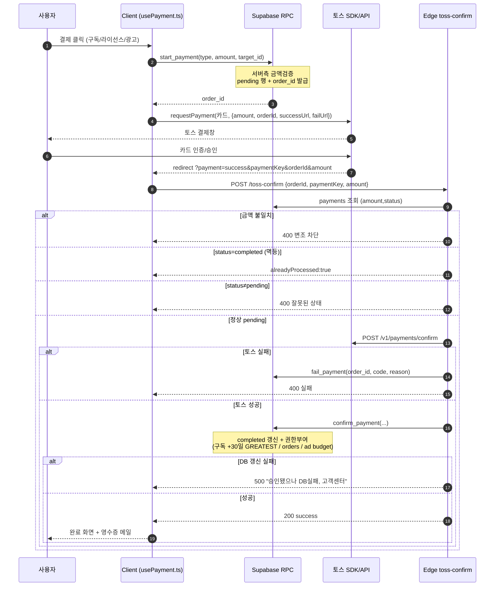
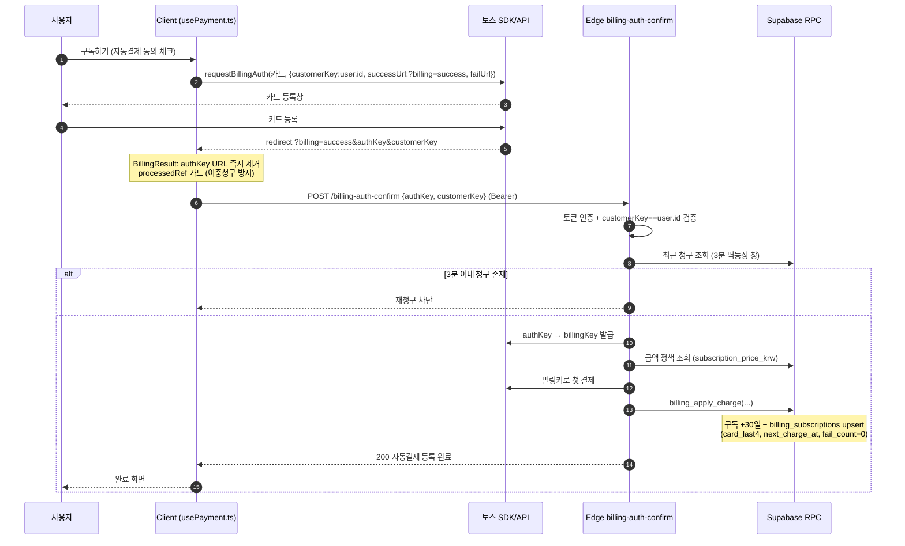
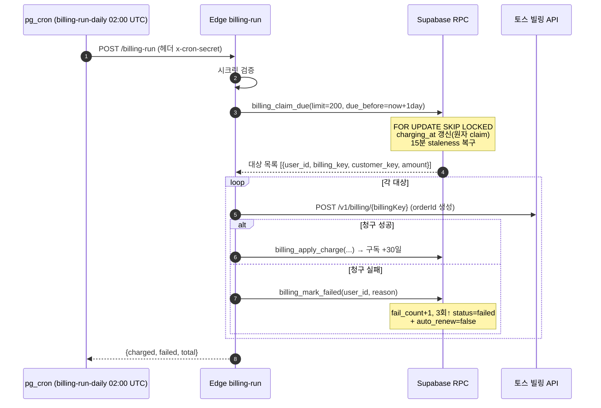
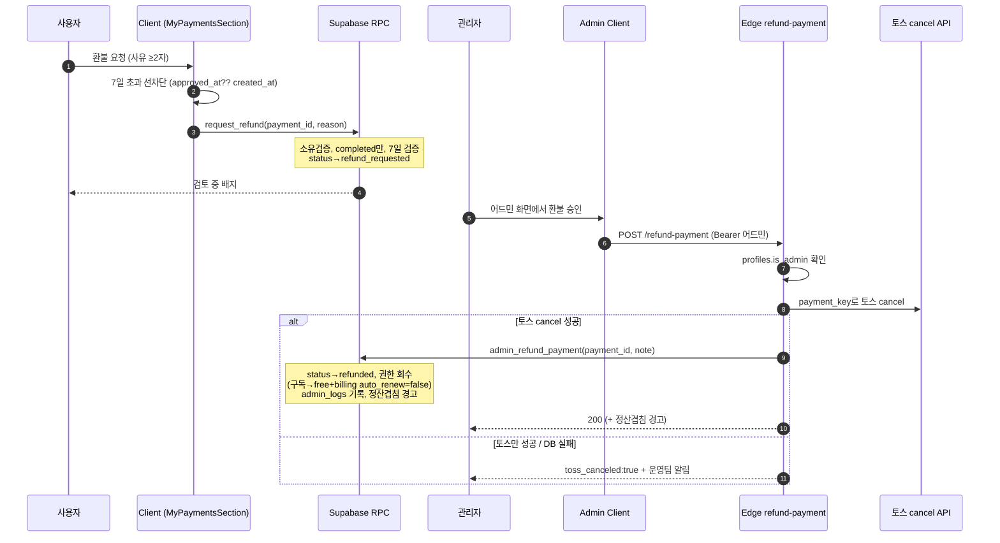
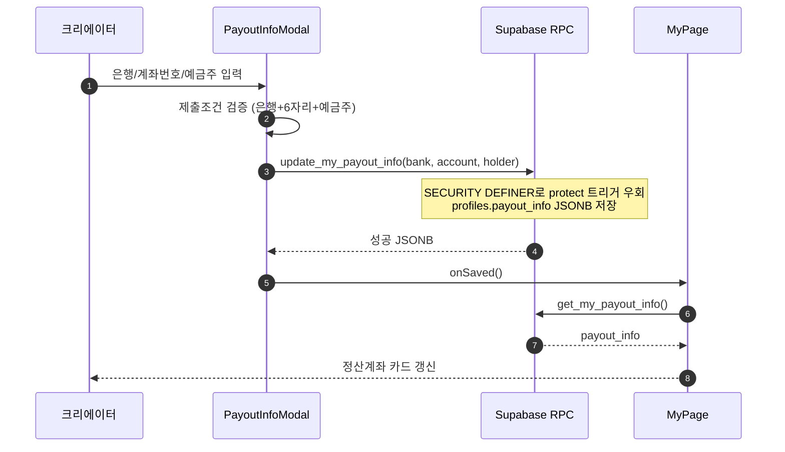

# 07. 마이페이지 · 결제/구독/빌링 — 상세 명세

> 본 문서는 실제 코드를 읽고 `file:line`을 명시해 작성한 심화 명세서입니다. 추측 없이 현행 구현을 기준으로 합니다.
> 주요 대상 파일: `src/app/components/MyPage.tsx`, `PayoutInfoModal.tsx`, `TaxInfoSection.tsx`, `MyPaymentsSection.tsx`, `SubscriptionPage.tsx`, `PaymentResult.tsx`, `BillingResult.tsx`, `src/app/hooks/usePayment.ts`, `supabase/functions/server/index.ts`(Edge), 그리고 다수의 `supabase/*.sql` 마이그레이션.

---

## 1. 개요 / 목적

마이페이지는 사용자(구매자)·크리에이터(판매자) 양쪽 코너를 한 화면에서 제공하는 통합 계정 허브이며, 결제/구독/빌링은 그 안에서 동작하는 수익화 파이프라인이다.

- **마이페이지** (`MyPage.tsx:430`): 모드 선택(`select`/`user`/`creator`, `MyPage.tsx:301-303`, `MyPage.tsx:442-446`) 후 탭 기반 화면을 보여준다. 탭 = 프로필 / 구매내역 / 판매(크리에이터) / 댓글관리 / 시청기록 / 플레이리스트 / 설정 (`MyPage.tsx:1284-1292`).
- **설정 탭**은 레퍼럴 · 알림 · **결제내역 · 세금** · 보안 · 차단관리 · 데이터권리 · 계정삭제를 한곳에 모은다 (`MyPage.tsx:2042-2101`).
- **결제**: 토스페이먼츠 단건 결제(구독/라이선스/광고예산)와 정기 자동결제(빌링키) 두 경로. 클라이언트는 `usePayment.ts`로 토스 SDK를 띄우고, 승인·빌링·환불의 신뢰 경계는 모두 Edge Function(`server/index.ts`)에서 service_role로 처리한다.
- **구독**: 단일 프리미엄 요금제(₩4,900/월). 무료 광고형 티어는 토스 무관, 프리미엄만 토스 후행(가맹 심사 병목, `CLAUDE.md`).
- **정산/세금**: 크리에이터 정산계좌(`payout_info`)·세금유형(원천징수 3.3%)·환불(청약철회 7일)·관리자 환불·연말 세무 리포트.

목적: 본인 한정 자기서비스(프로필/계좌/세금/결제내역/시청기록/플레이리스트/차단/데이터권리)와 안전한 결제·구독·정산 흐름을 한 번에 제공한다.

---

## 2. 사용자 스토리

- 구매자로서 내 결제 내역을 보고 7일 이내 결제는 환불을 요청하고 싶다.
- 구매자로서 라이선스 구매한 영상을 마이페이지에서 다운로드하고 싶다.
- 사용자로서 프로필(이름/소개/아바타/배너), 이메일(이메일계정 한정), 비밀번호를 바꾸고 싶다.
- 사용자로서 프리미엄을 구독하고, 자동결제를 언제든 해지/재개하고, 만료 임박(D-7) 알림을 받고 싶다.
- 크리에이터로서 정산계좌를 등록/수정하고, 세금유형(비사업자/사업자)을 신고하고, 예상 정산액·수수료를 미리 보고 싶다.
- 사용자로서 시청기록을 보고 개별/전체 삭제하고, 플레이리스트를 관리하고, 특정 사용자를 차단/해제하고 싶다.
- 사용자로서 내 데이터를 JSON으로 내려받고(데이터 이동권), 계정 삭제를 30일 유예로 요청/취소하고 싶다.
- 관리자로서 (별도 어드민 화면에서) 결제를 환불하고 정산을 확정하며 연말 세무 자료를 뽑고 싶다.

---

## 3. 화면 & 상태

### 3.1 마이페이지 진입 / 모드
- 비로그인: 로그인 유도 화면 (`MyPage.tsx:1066-1100`).
- 로딩: 스피너 (`MyPage.tsx:1102-1124`). 재진입 시 모듈 캐시(`myPageCache`, `MyPage.tsx:428`, `MyPage.tsx:784-805`)로 stale-while-revalidate.
- 모드 선택 화면 (`ModeSelectScreen`, `MyPage.tsx:315-378`); 영상 0개로 크리에이터 진입 시 온보딩 안내 (`CreatorOnboardingScreen`, `MyPage.tsx:381-410`, `MyPage.tsx:1138-1140`).
- `isCreator = myProducts.length > 0` (`MyPage.tsx:935`) — 영상 1개 이상이면 크리에이터 탭(판매/댓글) 노출.
- 탭 리스트는 `pageMode`/`isCreator`에 따라 5~6칸으로 구성 (`MyPage.tsx:1281-1316`). 외부 진입(알림 등)은 `initialTab`으로 특정 탭 강제 (`MyPage.tsx:435-441`).

### 3.2 프로필 섹션 (profile 탭)
- 구독 상태 카드: 현재 티어(free/basic/premium) 배지 + 설명 (`tierMeta`, `MyPage.tsx:938-943`, 카드 `MyPage.tsx:1329-1375`). 구독 중이면 만료/다음결제일 표시, D-7 임박 강조 (`MyPage.tsx:1338-1351`). 버튼은 비구독=업그레이드 / 구독=연장 → `onNavigate("subscription")`.
- 계정 정보 카드: 이메일/이름/계정유형(CREATOR 배지) (`MyPage.tsx:1377-1406`).
- 빠른 링크: 멤버십 관리 / 고객센터 / 설정 (`MyPage.tsx:1408-1425`).
- **정산계좌 카드 — 크리에이터에게만** (`MyPage.tsx:1428-1456`): `payoutInfo`(은행·계좌번호) 표시, 등록/변경 버튼 → `PayoutInfoModal`.

### 3.3 정산계좌 모달 (`PayoutInfoModal.tsx`)
- 한국 은행 22종 드롭다운 (`PayoutInfoModal.tsx:17-22`), 계좌번호, 예금주 입력.
- 제출 가능 조건: 은행 선택 + 계좌번호 숫자 6자리 이상 + 예금주 입력 (`PayoutInfoModal.tsx:55-58`).
- 저장 → `update_my_payout_info` RPC (`PayoutInfoModal.tsx:63-67`), 성공 시 `onSaved()`로 `loadPayoutInfo()` 재조회 (`MyPage.tsx:1155`).

### 3.4 세금 정보 섹션 (`TaxInfoSection.tsx`, 설정 탭)
- 진입 시 `get_my_tax_info`로 로드 (`TaxInfoSection.tsx:63`).
- 세금유형 라디오 4종: individual / business_simple / business_general / business_corp (`TaxInfoSection.tsx:39-44`).
- 사업자 선택 시 추가필드: 사업자등록번호(숫자 10자리 검증, `TaxInfoSection.tsx:94-98`), 상호, 세금계산서 이메일 (`TaxInfoSection.tsx:189-227`).
- 등록 완료 배지 + `tax_consent_at` 표시 (`TaxInfoSection.tsx:152-159`).
- 저장 → `update_my_tax_info` (`TaxInfoSection.tsx:102-107`).

### 3.5 결제내역 섹션 (`MyPaymentsSection.tsx`, 설정 탭)
- 진입 시 `get_my_payments(p_limit=50, p_offset=0)` (`MyPaymentsSection.tsx:61`).
- 상태 배지 색상 매핑 (`MyPaymentsSection.tsx:36-43`): completed/pending/failed/refunded/cancelled/refund_requested.
- 환불 버튼 활성 조건: `status==='completed' && 결제 후 ≤7일` (`MyPaymentsSection.tsx:147`, 기준일 = `approved_at ?? created_at`, `daysSince` `MyPaymentsSection.tsx:45-48`).
- `refund_requested` 상태는 "검토 중" + 사유 표시, 버튼 비활성 (`MyPaymentsSection.tsx:171-178`).
- 환불 요청 모달: 사유 2자 이상 입력 → `request_refund` (`MyPaymentsSection.tsx:88-112`).

### 3.6 구매내역 섹션 (purchases 탭)
- `orders` 테이블 직접 조회(JOIN videos) (`MyPage.tsx:617-637`). 총지출 합계 표시 (`MyPage.tsx:1463`).
- 다운로드: `log_download` RPC 후 Bunny mp4 해상도 탐색(1080→240p HEAD) 후 새 탭 열기 (`handleDownloadPurchase`, `MyPage.tsx:573-607`).

### 3.7 판매(크리에이터) 섹션 (sales 탭)
- `CreatorDashboard` + 총매출/실정산액(수수료 공제) KPI (`MyPage.tsx:1538-1558`).
- 광고수익 통계(노출/클릭/CTR/예상수익, 분배율 가중평균) (`MyPage.tsx:915-932`, 카드 `MyPage.tsx:1561-1587`).
- 정산 일정(매월 15일 가정) (`MyPage.tsx:1589-1607`), 월별 매출 차트(`MyPage.tsx:1610-1628`), 상품 목록(`MyPage.tsx:1631-1683`).
- 분배정책은 `get_active_platform_settings`로 로드, 미로드 시 기본값(판매 80% / 광고 home50·cinema55·ott60 / CPM 2000 / 정산최소 10000) (`MyPage.tsx:905-910`).

### 3.8 레퍼럴 / 시청기록 / 플레이리스트 / 차단 / 데이터권리 (설정 및 전용 탭)
- 레퍼럴: `ReferralCard` (`MyPage.tsx:2045`).
- 시청기록(history 탭): `get_my_watch_history`/`delete_my_watch_history`(개별/전체) (`MyPage.tsx:807-838`).
- 플레이리스트(playlists 탭): `get_my_playlists`/`get_playlist_videos`/`delete_playlist`/`remove_from_playlist` (`MyPage.tsx:840-899`). Watch Later는 삭제 불가 안내 (`MyPage.tsx:881-885`).
- 차단관리(`BlockedUsersSection`, `MyPage.tsx:213-278`): `get_my_blocked_users` + `unblockUser`.
- 데이터 다운로드(`DataDownloadSection`, `MyPage.tsx:27-76`): `export_my_data` → JSON 파일 저장.
- 위험영역 계정삭제(`DangerZoneSection`, `MyPage.tsx:86-210`): `get_my_deletion_status`/`request_account_deletion`/`cancel_account_deletion` (30일 유예).

### 3.9 구독 페이지 (`SubscriptionPage.tsx`)
- Free vs Premium(₩4,900/월) 2카드 비교 (`SubscriptionPage.tsx:136-199`).
- 현재 프리미엄+자동결제 상태/카드 끝4자리/자동결제 ON·OFF 토글 (`get_my_billing`/`set_my_auto_renew`, `SubscriptionPage.tsx:44-80`, `SubscriptionPage.tsx:110-133`).
- 자동결제 동의 체크박스(전자상거래법) 미동의 시 구독 버튼 비활성 (`SubscriptionPage.tsx:179-187`).
- 앱래퍼(리더앱)에서는 IAP 수수료 회피 위해 웹 결제로 유도 (`SubscriptionPage.tsx:56-61`).

### 3.10 결제 결과 화면
- 단건 결제 결과(`PaymentResult.tsx`): `?payment=success|fail`. processing/success/failed 3상태 (`PaymentResult.tsx:27`). 성공 시 `toss-confirm` 호출 후 영수증 메일(fire-and-forget, `PaymentResult.tsx:102-129`).
- 자동결제 카드등록 결과(`BillingResult.tsx`): `?billing=success|fail`. 성공 시 `billing-auth-confirm` 호출. 새로고침 이중청구 방지 위해 authKey URL 즉시 제거 + `processedRef` 가드 (`BillingResult.tsx:28-33`, `BillingResult.tsx:53-55`).

---

## 4. 동작 흐름

### 4.1 프로필 편집
1. 편집 버튼 → 모달 오픈, 현재값 prefill (`MyPage.tsx:1230-1245`).
2. 아바타(≤2MB)/배너(≤5MB) 업로드 → Supabase Storage `user-avatars`/`user-banners`, 캐시버스터 `?t=` 부여 (`MyPage.tsx:501-558`).
3. 저장: `auth.updateUser({data:{name}})` + `profiles` upsert(display_name/bio/avatar_url/banner_url) (`MyPage.tsx:1017-1046`).
4. 이메일 변경(이메일계정만, `identities`에 provider==='email' 확인 `MyPage.tsx:985-994`): `auth.updateUser({email})` → 확인메일 링크 클릭 시 확정 (`MyPage.tsx:996-1015`).
5. 비밀번호 변경: 6자 이상·일치 검증 → `auth.updateUser({password})` (`MyPage.tsx:1048-1064`).

### 4.2 정산계좌 등록
모달 입력 → `update_my_payout_info(bank,account,holder)` → 성공 토스트 → `get_my_payout_info` 재조회 → 카드 갱신.

### 4.3 세금 정보
라디오 선택 → (사업자면) 사업자번호 형식검증 → `update_my_tax_info(...)` → `tax_consent_at` 갱신 → 등록완료 배지.

### 4.4 결제내역 / 환불 요청
1. `get_my_payments` 로드.
2. 환불 버튼 클릭 시 클라이언트에서 7일 초과 선차단 (`MyPaymentsSection.tsx:77-86`).
3. 사유(≥2자) 입력 → `request_refund(p_payment_id, p_reason)` → status `completed`→`refund_requested`.
4. 실제 환불(토스 cancel + 권한 회수)은 관리자가 어드민 화면에서 `refund-payment` Edge → `admin_refund_payment` RPC로 수행.

### 4.5 구독 — 자동결제(정기) 흐름 (권장 경로)
1. `SubscriptionPage.subscribe()` → 동의 체크 후 `startAutoBilling({customerKey:user.id, email})` (`SubscriptionPage.tsx:52-72`).
2. `usePayment.startAutoBilling` → `startBillingAuth` → 토스 `requestBillingAuth("카드", {customerKey, successUrl:?billing=success, failUrl:?billing=fail})` (`usePayment.ts:64-78`, `usePayment.ts:139-142`).
3. 토스 카드등록 완료 → `?billing=success&authKey=&customerKey=` 리다이렉트 → `BillingResult` 가 `billing-auth-confirm` 호출.
4. Edge `billing-auth-confirm` (`server/index.ts:1163-1246`): 토큰 인증 → customerKey==user.id 검증 → **3분 멱등성**(최근 청구 시 재청구 차단, `:1176-1188`) → authKey로 billingKey 발급(`:1195-1205`) → 금액 정책 조회(`:1208-1212`) → 빌링키로 첫 결제(`:1216-1225`) → `billing_apply_charge` RPC로 구독 +30일 + billing 저장(`:1230-1235`).
5. 이후 매월 cron(`billing-run`)이 자동 청구.

### 4.6 자동결제 정기 청구 (cron)
1. pg_cron `billing-run-daily`(매일 02:00 UTC)이 `billing-run` Edge 호출(헤더 `x-cron-secret`) (`billing_cron_20260612.sql:12-22`).
2. Edge `billing-run` (`server/index.ts:1252-1302`): 시크릿 검증 → **만료 1일 전**(`dueBefore`)까지 대상 → `billing_claim_due`로 원자적 claim(FOR UPDATE SKIP LOCKED) → 각 건 토스 빌링 청구 → 성공 `billing_apply_charge` / 실패 `billing_mark_failed`.

### 4.7 자동결제 해지/재개
`SubscriptionPage.setAutoRenew(on)` → `set_my_auto_renew(p_on)` (`SubscriptionPage.tsx:74-80`). OFF=다음 결제일부터 미청구, 현재 구독은 만료일까지 유지.

### 4.8 단건 결제 (토스 일반결제) 흐름
1. `usePayment.startTossPayment` → `start_payment(type, amount, target_id)` RPC로 pending 행 + order_id 발급 (`usePayment.ts:29-61`).
2. 토스 `requestPayment("카드", {amount, orderId, successUrl:?payment=success, failUrl:?payment=fail})`.
3. 성공 리다이렉트 → `PaymentResult` 가 `toss-confirm` Edge 호출.
4. Edge `toss-confirm` (`server/index.ts:1046-1157`): payments 조회 → **금액 위변조 검증**(`:1075-1078`) → 멱등(completed면 통과 `:1080-1083`) → pending 상태 가드(`:1085-1087`) → 토스 confirm API(`:1092-1099`) → 성공 `confirm_payment` / 실패 `fail_payment`.
5. 실패 리다이렉트 → `fail_payment` 직접 호출(`PaymentResult.tsx:49-57`).

---

## 5. 데이터 / RPC / Edge 계약

> 별도 표기 없으면 모두 `SECURITY DEFINER`. 본인 한정 RPC는 `auth.uid()` 기준.

### 5.1 결제 코어 RPC
- **`start_payment(p_payment_type TEXT, p_amount INTEGER, p_target_id TEXT DEFAULT NULL) RETURNS TEXT`** — 최신 정의 `start_payment_ad_owner_20260624.sql:15-67` (SECURITY DEFINER, `SET search_path=public`). pending 행 + order_id 발급. **서버측 금액검증**: 구독=platform_settings `subscription_price_krw` 일치, 라이선스=해당 영상의 price_standard/commercial/exclusive 중 하나, 광고예산=`ads.owner_id=uid` 소유 검증(`:52-59`). 초기 v1 `phase9_payments.sql:92-128`(금액검증 無), v2 `payment_hardening_20260612.sql:10-55`.
- **`confirm_payment(p_order_id TEXT, p_payment_key TEXT, p_method TEXT, p_approved_at TIMESTAMPTZ, p_raw_response JSONB) RETURNS VOID`** — `phase9_payments.sql:143-223`. 멱등(completed면 no-op `:166-169`), pending→completed 가드(`:171-173`). 구독: `subscription_expires_at = GREATEST(COALESCE(expires, now()), now()) + INTERVAL '30 days'`(누적, `:191-202`). 라이선스: orders INSERT(license_type='standard', ON CONFLICT DO NOTHING). 광고: `ads.budget_krw += amount`.
- **`fail_payment(p_order_id TEXT, p_failure_code TEXT, p_failure_reason TEXT) RETURNS VOID`** — `phase9_payments.sql:231-249`. `WHERE order_id=? AND status='pending'`만 갱신(완료건 덮어쓰기 방지).
- **`get_my_payments(p_limit INTEGER=50, p_offset INTEGER=0) RETURNS TABLE(...)`** — 정본 `phase_user_payment_history.sql:48-95`, GRANT `authenticated`(`:97`). 본인 행만 created_at DESC. 반환: id,order_id,payment_type,target_id,amount,method,status,approved_at,created_at,failure_reason,refund_reason,refund_requested_at.
- **`request_refund(p_payment_id BIGINT, p_reason TEXT) RETURNS VOID`** — `phase_user_payment_history.sql:117-174`, GRANT `authenticated`(`:176`). 소유검증, status='completed'만, **7일(청약철회) 초과 차단**(`:155-159`), 사유 2자 이상. → status='refund_requested'.
- **`admin_refund_payment(p_payment_id BIGINT, p_admin_note TEXT=NULL) RETURNS TEXT`** — 최신 `refund_cancel_billing_20260614.sql:9-93`(`assert_admin()` 게이트). completed/refund_requested만, status→'refunded', 권한 회수(구독→free+expires NULL **+ billing_subscriptions auto_renew=false/status='canceled'**, 라이선스 orders→refunded, 광고예산 차감 floor0), `admin_logs` 기록, **확정 정산 겹침 경고 TEXT 반환**(R6). 구버전 `phase_user_payment_history.sql:184-244`.
- **`admin_get_all_payments(p_status='all', p_payment_type='all', p_limit=100, p_offset=0)`** — `phase_admin_payments_refund_reason.sql:22-77`(assert_admin, STABLE). refund_reason/refund_requested_at 포함.

### 5.2 정산계좌 / 세금 RPC
- **`get_my_payout_info() RETURNS JSONB`** — `phase_security_hardening_20260531.sql:30-38`, GRANT `authenticated`(`:39`). `SELECT payout_info FROM profiles WHERE id=auth.uid()`. (MyPage `loadPayoutInfo`에서 호출, `MyPage.tsx:452-460`.)
- **`update_my_payout_info(p_bank_name TEXT, p_account_number TEXT, p_account_holder TEXT) RETURNS JSONB`** — `phase_payout_info.sql:20-66`, GRANT `authenticated`(`:68`). 로그인·은행·계좌6자리·예금주 검증. JSONB로 `profiles.payout_info` 저장(SECURITY DEFINER로 protect 트리거 우회).
- **`get_my_tax_info() RETURNS TABLE(tax_type, business_number, business_name, tax_invoice_email, tax_consent_at)`** — `phase32_tax_withholding.sql:125-152`, GRANT `authenticated`.
- **`update_my_tax_info(p_tax_type TEXT, p_business_number TEXT=NULL, p_business_name TEXT=NULL, p_tax_invoice_email TEXT=NULL) RETURNS VOID`** — `phase32_tax_withholding.sql:157-195`, GRANT `authenticated`. tax_type 4종 검증, business_* 면 사업자번호 필수, 항상 `tax_consent_at=now()`.
- **`mark_revenue_paid(p_distribution_id BIGINT) RETURNS VOID`** — `phase32_tax_withholding.sql:64-118`(assert_admin). **원천징수**: individual(또는 NULL)이면 `tax_withholding=FLOOR(total*0.033)`, 사업자면 0. `WHERE id=? AND payout_status='pending'`만(멱등). GRANT authenticated이나 내부 assert_admin.
- **`admin_get_tax_annual_report(p_year INTEGER)`**, **`get_revenue_distributions_by_period(p_year, p_month)`** — 관리자 정산/세무용. 후자는 `payout_info`에서 bank/account/holder 추출해 어드민에 노출(`phase_settlement_payout_account.sql:21-60`).

### 5.3 빌링(자동결제) RPC
- **`get_my_billing() RETURNS TABLE(card_company, card_last4, auto_renew, status, amount, next_charge_at)`** — `billing_subscriptions_20260612.sql:36-51`, GRANT `authenticated`. **billing_key/customer_key 의도적 제외**.
- **`set_my_auto_renew(p_on BOOLEAN) RETURNS void`** — `billing_subscriptions_20260612.sql:54-65`, GRANT `authenticated`.
- **`billing_apply_charge(p_user_id, p_billing_key, p_customer_key, p_card_company, p_card_last4, p_amount, p_order_id, p_payment_key, p_approved_at, p_raw) RETURNS void`** — `billing_charge_rpcs_20260612.sql:8-68`, GRANT **service_role 한정**(`:68`). 멱등(order_id completed면 RETURN), payments INSERT(ON CONFLICT DO NOTHING), 구독 +30일 GREATEST, billing_subscriptions upsert(next_charge_at=신규만료, fail_count=0).
- **`billing_mark_failed(p_user_id, p_reason) RETURNS void`** — `billing_charge_rpcs_20260612.sql:71-92`, GRANT **service_role**. fail_count+1, **3회 이상 시 status='failed' + auto_renew=false**, next_charge_at=+1day.
- **`billing_claim_due(p_limit=200, p_due_before=now()) RETURNS TABLE(user_id, billing_key, customer_key, amount)`** — `billing_claim_due_20260616.sql:14-33`, **REVOKE PUBLIC/anon/authenticated + GRANT service_role**. `charging_at` 갱신으로 원자 claim, `FOR UPDATE SKIP LOCKED`, 15분 staleness 자동복구. billing_key를 반환하는 유일한 경로(Edge 전용).

### 5.4 시청기록 / 플레이리스트 / 차단 / 데이터권리 RPC
- 시청기록: `get_my_watch_history(p_limit=50, p_offset=0)`(`phase17_watch_history.sql:7-70`, DISTINCT ON video_id 최신, 삭제·숨김 영상 제외), `delete_my_watch_history(p_video_id TEXT=NULL) RETURNS INTEGER`(`:78-102`, NULL=전체삭제).
- 플레이리스트: `get_my_playlists()`(`phase18_playlists.sql:63-99`, Watch Later 핀고정), `get_playlist_videos(p_playlist_id uuid)`(`:104-142`, 소유검증), `delete_playlist`(`:194-210`, **Watch Later 삭제 불가**), `remove_from_playlist`(`:244-263`), `create/update/add/toggle_watch_later/get_playlist_memberships`. RLS: 본인 소유만(`:44-60`).
- 차단: `get_my_blocked_users()`(`phase24_user_blocks.sql:87-104`), `block_user`/`unblock_user`(`:44-82`), `get_my_blocked_user_ids() RETURNS UUID[]`(클라 필터용 `:109-119`). 뷰어측 차단(필터 client-side).
- 데이터권리: `export_my_data() RETURNS JSONB`(16개 데이터 섹션, `phase27_user_data_rights.sql:134-189`), `request_account_deletion(p_reason=NULL)`/`cancel_account_deletion()`/`get_my_deletion_status()`(30일, `:35-220`), `purge_pending_deletions(p_days=30)`(어드민/cron, profiles만 삭제 — auth.users는 Edge가 처리).

### 5.5 Edge Function 계약 (`supabase/functions/server/index.ts`)
- **`POST /toss-confirm`** (`:1046`): body `{orderId, paymentKey, amount}`. service_role로 payments 조회→금액검증→토스 confirm→`confirm_payment`/`fail_payment`. (인증: anon apikey + 선택적 Bearer.)
- **`POST /billing-auth-confirm`** (`:1163`): Bearer 인증 필수, body `{authKey, customerKey}`, customerKey==user.id. 3분 멱등, billingKey 발급+첫결제+`billing_apply_charge`.
- **`POST /billing-run`** (`:1252`): 헤더 `x-cron-secret` 검증(cron 전용). `billing_claim_due`→토스 빌링 청구→apply/mark_failed.
- **`POST /refund-payment`** (`:1833`): Bearer(어드민) 인증 + `profiles.is_admin` 확인(`:1850-1857`). payments.payment_key로 토스 cancel→`admin_refund_payment`(어드민 토큰 클라이언트로 assert_admin 통과, `:1916-1926`). 정산겹침 경고/메일발송용 정보 반환.
- **`POST /purge-deletions`** (`:1313`): `x-cron-secret` 검증. 30일+ 경과 삭제요청자 `auth.admin.deleteUser`(CASCADE 파기).
- 모든 server Edge는 공개 엔드포인트 포함 → `--no-verify-jwt` 배포(`CLAUDE.md`, `supabase/config.toml`).

---

## 6. 비즈니스 규칙

- **구독가/티어**: 프리미엄 ₩4,900/월(단일). 가격 정본은 `platform_settings.subscription_price_krw`(클라/Edge 모두 조회, `usePayment.ts:86-89`, `server/index.ts:1208-1212`). 티어 free/basic/premium(`MyPage.tsx:938-942`).
- **구독 갱신(누적)**: 결제 시 만료일 = `GREATEST(기존만료, now()) + 30일` — 남은 기간을 깎지 않고 누적(`confirm_payment` / `billing_apply_charge`).
- **만료 강등**: `reset_expired_subscriptions`(cron 03:00) premium→free(`payment_hardening_20260612.sql:58-69`). 환불 시도 즉시 강등.
- **청약철회 7일**: `request_refund`가 `approved_at ?? created_at` 기준 7일 초과 차단(전자상거래법). 클라이언트도 선차단.
- **원천징수 3.3%**: 비사업자(individual/미등록)는 정산 확정 시 `tax_withholding=FLOOR(total*0.033)`, 사업자(business_*)는 0(세금계산서 별도). `mark_revenue_paid`.
- **정산 최소액**: 화면 가이드 표기 ₩10,000(`PAYOUT_MIN_KRW`, `MyPage.tsx:910`, 표기 `:1702`) — platform_settings `payout_minimum_krw` 기반. (SQL 정산 RPC에 강제 임계 로직은 미확인.)
- **분배율**: 판매 80% / 광고 home50·cinema55·ott60(기본값, platform_settings로 변경, `MyPage.tsx:905-909`).
- **협의 판매(라이선스)**: 가격은 영상별 price_standard/commercial/exclusive 중 하나여야 결제 성립(`start_payment` 검증).
- **멱등성**: 단건=order_id UNIQUE + confirm_payment completed no-op + toss-confirm completed 통과. 빌링=order_id completed RETURN + billing-auth-confirm 3분창 + BillingResult `processedRef`/authKey 제거.
- **빌링키 미노출**: `billing_subscriptions` RLS 정책 없음 + `REVOKE ALL FROM anon, authenticated`(`billing_subscriptions_20260612.sql:30-33`). `get_my_billing`은 카드사·끝4자리만 반환. billing_key는 service_role(`billing_claim_due`/`billing_apply_charge`)만 접근.

---

## 7. 엣지 케이스 & 에러 처리

- **결제 중복 확정**: toss-confirm이 completed면 `alreadyProcessed:true`로 통과(`server/index.ts:1080-1083`); confirm_payment도 no-op.
- **금액 위변조**: payments.amount ≠ 토스 amount면 400 차단(`:1075-1078`); start_payment 단계에서도 서버 금액검증.
- **잘못된 상태**: pending 아닌 건 confirm 거부(`:1085-1087`), fail_payment는 pending만 갱신.
- **DB 갱신 실패(토스만 성공)**: toss-confirm 500 + 고객센터 안내(`:1126-1134`); billing-auth-confirm 동일(`:1236-1239`); refund-payment는 `toss_canceled:true` + 운영팀 알림 안내(`:1928-1937`).
- **환불 상태머신**: completed→refund_requested(사용자)→refunded(관리자). refund_requested/refunded 재요청 시 구분 메시지(`phase_user_payment_history.sql:146-152`). 환불 후 빌링 auto_renew=false/canceled로 cron 재청구 차단.
- **빌링 동시청구**: `billing_claim_due`의 `FOR UPDATE SKIP LOCKED` + charging_at 15분 창으로 cron 중복 실행 시 이중청구 방지.
- **빌링 연속 실패**: 3회 누적 시 자동결제 중단(auto_renew=false), 사용자 알림(`billing_mark_failed`).
- **다운로드**: Bunny 해상도별 HEAD 탐색 실패 시 "인코딩 처리 중" 안내(`MyPage.tsx:598`).
- **부분 데이터 로드**: 각 쿼리 독립 try/catch, 개별 테이블 누락은 console.warn만(빈 화면 대신 부분표시, `MyPage.tsx:609-780`).
- **잘못된 결제 결과 진입**: success/fail 외 outcome은 실패 처리(`PaymentResult.tsx:138-141`).
- **고객센터**: 결제/환불 문의 → 1:1 문의 또는 support@creaite.net(`SubscriptionPage.tsx:206`).

---

## 8. 권한 / 보안

- **본인 한정**: get_my_*/update_my_*/request_refund 등은 `auth.uid()` 기반, GRANT `authenticated`. 결제내역·계좌·세금·시청기록·플레이리스트·차단·데이터 모두 본인 것만 반환/수정.
- **protect_subscription_columns 트리거**: 일반 세션의 `profiles` 직접 UPDATE에서 보호컬럼 8개(subscription_tier/started_at/expires_at, **payout_info**, **is_admin**, referral_code/referred_by/referral_count)를 OLD로 되돌림(`fix_protect_is_admin_20260624.sql:13-35`). is_admin 포함 필수(누락=권한상승 회귀, MEMORY `protect-trigger-shared-ssot`). payout_info 갱신은 SECURITY DEFINER RPC(`update_my_payout_info`)로만.
- **confirm/billing은 service_role**: toss-confirm/billing-run은 service_role 클라이언트(`getSupabaseClient(true)`)로 RLS 우회 + DEFINER RPC 호출. billing_apply_charge/mark_failed/claim_due는 GRANT service_role 한정.
- **is_admin 환불**: refund-payment Edge가 토큰→`profiles.is_admin` 확인 후만 진행(`server/index.ts:1850-1857`), RPC도 `assert_admin()`.
- **계좌 PII**: 클라이언트는 본인 `get_my_payout_info`만. 타 사용자 계좌는 관리자 정산 RPC(`get_revenue_distributions_by_period`)로만 노출. billing_key/customer_key는 어떤 클라 경로로도 미노출.
- **cron 비밀**: billing-run/purge-deletions는 `x-cron-secret`(BILLING_CRON_SECRET)로 보호.

---

## 9. 분석 / 이벤트

- **결제 전환**: start_payment(pending) 대비 confirm_payment(completed) 비율, 24시간 미승인 자동 failed(`cleanup_stale_payments`)로 이탈 추적 가능.
- **구독 지표**: get_my_billing/billing_subscriptions(status, fail_count, next_charge_at)로 활성/실패/해지(auto_renew) 코호트.
- **환불율**: payments.status 분포(refund_requested/refunded) + admin_logs `refund_payment` 기록(was_user_requested 플래그).
- **영수증 메일**: 결제 성공 시 `subscription_receipt` 알림 발송(`PaymentResult.tsx:113-125`).
- **크리에이터 수익**: 광고 노출/클릭/CTR/예상수익, 월별 매출 차트(sales 탭).
- (전용 GA/이벤트 트래커 코드는 본 범위 파일에서 미확인 — 지표는 DB 상태 기반.)

---

## 10. 수용 기준 (체크리스트)

- [ ] 비크리에이터는 정산계좌 카드/판매 탭이 보이지 않고, 영상 1개 등록 시 노출된다.
- [ ] 정산계좌 저장 시 6자리 미만 계좌번호/빈 은행/빈 예금주는 거부된다.
- [ ] 세금유형 사업자 선택 시 사업자번호 10자리 검증을 통과해야 저장된다.
- [ ] 결제내역에서 7일 초과 결제는 환불 버튼이 보이지 않거나 클릭 시 차단된다.
- [ ] 환불 요청 시 status가 refund_requested로 바뀌고 "검토 중" 배지가 뜬다.
- [ ] 구독 결제 성공 시 만료일이 기존 만료일에 +30일 누적된다(깎이지 않음).
- [ ] 자동결제 ON 상태에서 만료 1일 전 cron이 자동 청구하고, OFF면 만료일까지만 유지된다.
- [ ] 동일 order_id 재확정(새로고침 포함)으로 이중 청구/이중 권한부여가 발생하지 않는다.
- [ ] 빌링 연속 3회 실패 시 자동결제가 중단되고 사용자 알림이 간다.
- [ ] 클라이언트 어떤 경로로도 billing_key/customer_key가 반환되지 않는다(get_my_billing은 끝4자리만).
- [ ] 일반 사용자가 profiles 직접 UPDATE로 subscription_tier/is_admin/payout_info를 바꿀 수 없다(트리거 되돌림).
- [ ] 비관리자 토큰으로 refund-payment 호출 시 403.
- [ ] 정산 확정 시 비사업자는 3.3% 원천징수, 사업자는 0이 기록된다.
- [ ] 데이터 다운로드가 16개 섹션 JSON을 생성한다.
- [ ] 계정 삭제 요청 후 30일 유예 표시, 취소 가능, 미취소 시 cron 파기된다.

---

## 11. 알려진 제약 / 이월

- **토스 가맹 심사 병목**: 프리미엄 구독·라이선스 결제는 토스페이먼츠 가맹 심사(1~2개월) 후행. 무료 광고형 티어는 토스 무관 선출시 가능(`CLAUDE.md`).
- **PG 종속**: 빌링이 토스 기반. PG 변경(이니시스 등)은 빌링 재개발 비용 큼 → 토스 반려 시에만 검토(`CLAUDE.md`).
- **앱(IAP) 회피**: 앱래퍼에서는 구독을 웹(creaite.net)으로 유도(`SubscriptionPage.tsx:56-61`). iOS는 베타 후.
- **2FA 미구현**: 보안 섹션에 "준비 중" 버튼 비노출(`MyPage.tsx:2070`).
- **정산 최소액 강제**: 화면 가이드(₩10,000)는 있으나 정산 RPC에 최소액 임계 차단 로직은 본 범위 SQL에서 미확인 — 운영/어드민 확정 단계 검증 필요.
- **basic 티어**: tierMeta에 정의되어 있으나 현재 요금제는 free/premium 2단(`SubscriptionPage.tsx`). basic 활성 경로 미구현.
- **search_path 누락**: phase17/phase18 RPC 일부에 `SET search_path` 미지정(타 마이그레이션은 명시) — 하드닝 보강 후보.
- **2026-06-16 교훈**(MEMORY): 외부·지역 사실(수수료·세율·정책)은 단정 금지, 최신값 검증 우선.

---

## 와이어프레임 (텍스트 목업)

### 마이페이지 — 프로필 탭 (`MyPage.tsx:1329-1456`)

```
┌──────────────────────────────────────────────────────────────┐
│  [배너 이미지]                                        [프로필 편집]│
│   (●아바타)  홍길동  creator@creaite.net   [CREATOR]            │
├──────────────────────────────────────────────────────────────┤
│  ┌── 구독 상태 ─────────────────────────────────────────────┐ │
│  │ [PREMIUM] 프리미엄 회원                                    │ │
│  │ 다음 결제일: 2026-07-25  (만료까지 27일)                   │ │
│  │ ⚠ 만료 임박 (D-7 이내일 때 강조)                          │ │
│  │                                    [ 구독 연장/관리 → ]   │ │
│  └──────────────────────────────────────────────────────────┘ │
│  ┌── 계정 정보 ───────────┐  ┌── 빠른 링크 ─────────────────┐ │
│  │ 이메일  creator@…       │  │ ▸ 멤버십 관리                │ │
│  │ 이름    홍길동          │  │ ▸ 고객센터                   │ │
│  │ 유형    [CREATOR]       │  │ ▸ 설정                       │ │
│  └────────────────────────┘  └──────────────────────────────┘ │
│  ┌── 정산 계좌 (크리에이터 전용) ───────────────────────────┐ │
│  │ 국민은행  123456-**-****  홍길동                          │ │
│  │                                  [ 등록/변경 → 모달 ]    │ │
│  └──────────────────────────────────────────────────────────┘ │
└──────────────────────────────────────────────────────────────┘
탭: [프로필][구매내역][판매][댓글관리][시청기록][플레이리스트][설정]
```

### 정산 계좌 모달 (`PayoutInfoModal.tsx`)

```
┌──────────── 정산 계좌 등록 ─────────────┐
│  은행        [ 국민은행        ▼ ]      │  ← 22종 드롭다운
│  계좌번호    [ 12345678901      ]       │  ← 숫자 6자리 이상
│  예금주      [ 홍길동           ]       │
│  ──────────────────────────────────────│
│  ⓘ 정산은 매월 15일, 최소 ₩10,000부터  │
│              [ 취소 ]   [ 저장 ]        │  ← 조건 미충족 시 비활성
└─────────────────────────────────────────┘
```

### 세금 정보 섹션 (`TaxInfoSection.tsx`, 설정 탭)

```
┌──────────── 세금 정보 ────────────────────────────┐
│ 세금 유형                                          │
│  (◉) 비사업자 (원천징수 3.3%)                      │
│  ( ) 간이과세 사업자                               │
│  ( ) 일반과세 사업자                               │
│  ( ) 법인 사업자                                   │
│ ─ 사업자 선택 시 펼침 ────────────────────────────│
│  사업자등록번호 [ 123-45-67890 ]  ← 숫자 10자리    │
│  상호           [ (주)크레비즈   ]                 │
│  세금계산서 이메일 [ tax@…        ]                │
│ ──────────────────────────────────────────────────│
│  [✓ 등록 완료]  동의일 2026-06-01    [ 저장 ]      │
└────────────────────────────────────────────────────┘
```

### 결제 내역 섹션 (`MyPaymentsSection.tsx`, 설정 탭)

```
┌──────────── 결제 내역 ─────────────────────────────────────┐
│ 2026-06-20  프리미엄 구독   ₩4,900  [완료]    [환불 요청]   │ ← ≤7일
│ 2026-06-10  라이선스 구매   ₩50,000 [완료]    (7일 초과,    │
│                                                버튼 없음)   │
│ 2026-06-18  광고 예산 충전  ₩30,000 [검토 중] 사유: 단순변심│ ← refund_requested
│ 2026-05-30  프리미엄 구독   ₩4,900  [환불됨]                │
│ 2026-05-12  라이선스 구매   ₩20,000 [실패]   사유: 한도초과 │
└────────────────────────────────────────────────────────────┘
배지색: 완료=초록 대기=노랑 실패=빨강 환불됨=회색 검토중=주황
```

### 레퍼럴 / 시청기록 / 플레이리스트 / 차단 (설정 및 전용 탭)

```
[설정 탭]                          [시청기록 탭]
┌── 레퍼럴 카드 ──────────┐        ┌──────────────────────────┐
│ 내 추천코드  CR-AB12      │        │ 영상A  2026-06-24  [삭제] │
│ 가입 3명 · 적립 ₩X        │        │ 영상B  2026-06-23  [삭제] │
│ [코드 복사] [공유]        │        │            [ 전체 삭제 ] │
└──────────────────────────┘        └──────────────────────────┘
[플레이리스트 탭]                   [차단 관리 (설정 탭)]
┌──────────────────────────┐        ┌──────────────────────────┐
│ 📌 나중에 볼 영상 (삭제X)  │        │ user_xyz       [차단해제] │
│ 내 모음집 1     [삭제]     │        │ user_abc       [차단해제] │
│  └ 영상 목록 [개별 제거]   │        └──────────────────────────┘
└──────────────────────────┘
```

### 구독 페이지 (`SubscriptionPage.tsx`)

```
┌──────────────── 멤버십 ────────────────┐
│ ┌── FREE ──────┐   ┌── PREMIUM ──────┐ │
│ │ ₩0           │   │ ₩4,900 / 월     │ │
│ │ • 광고 시청   │   │ • 광고 없음      │ │
│ │ • 기본 화질   │   │ • 시네마/OTT 무제한│ │
│ │              │   │ • 고화질         │ │
│ │  [현재 등급]  │   │ [✓] 자동결제 동의 │ │  ← 미동의 시 버튼 비활성
│ │              │   │ [ 구독하기 ]     │ │
│ └──────────────┘   └─────────────────┘ │
│ ── 현재 자동결제 상태 (프리미엄 회원) ──│
│  카드  국민카드 ****1234                 │
│  자동결제  [ ON ●——○ OFF ]  토글        │
│  다음 결제  2026-07-25                   │
│  문의: support@creaite.net               │
└──────────────────────────────────────────┘
```

### 결제 결과 화면 (`PaymentResult.tsx` / `BillingResult.tsx`)

```
[단건 결제 ?payment=success]        [실패 ?payment=fail]
┌──────────────────────────┐        ┌──────────────────────────┐
│   ⏳ 결제 확인 중…         │        │   ❌ 결제 실패            │
│   (toss-confirm 호출)      │        │   사유: 카드 한도 초과    │
│        ↓                   │        │   [ 다시 시도 ] [ 홈 ]   │
│   ✅ 결제 완료!            │        └──────────────────────────┘
│   프리미엄 활성화 (30일)   │
│   영수증 메일 발송됨        │        [자동결제 카드등록 ?billing=success]
│   [ 마이페이지 ] [ 홈 ]   │        │ ⏳ 카드 등록 처리 중…     │
└──────────────────────────┘        │ (billing-auth-confirm,    │
                                     │  authKey URL 즉시 제거)   │
                                     │ ✅ 자동결제 등록 완료     │
```

---

## 시퀀스 다이어그램

### 단건 결제 (start_payment → 토스 → toss-confirm → confirm_payment, 멱등)



### 자동결제 설정 (billing-auth-confirm: 빌링키 + 첫 결제)



### 정기 청구 (billing-run cron)



### 환불 (request_refund → admin Edge → admin_refund_payment)



### 정산 계좌 등록 (update_my_payout_info)



---

## API / RPC / Edge 레퍼런스

### 본인 조회/수정 RPC (GRANT authenticated, auth.uid() 기준)

| 이름 | 인자 | 반환 | 권한 | file:line |
|---|---|---|---|---|
| `get_my_payout_info` | (없음) | `JSONB` (payout_info) | authenticated, DEFINER | `phase_security_hardening_20260531.sql:30-39` |
| `update_my_payout_info` | `p_bank_name TEXT, p_account_number TEXT, p_account_holder TEXT` | `JSONB` | authenticated, DEFINER (protect 우회) | `phase_payout_info.sql:20-68` |
| `get_my_tax_info` | (없음) | `TABLE(tax_type, business_number, business_name, tax_invoice_email, tax_consent_at)` | authenticated | `phase32_tax_withholding.sql:125-152` |
| `update_my_tax_info` | `p_tax_type TEXT, p_business_number TEXT=NULL, p_business_name TEXT=NULL, p_tax_invoice_email TEXT=NULL` | `VOID` | authenticated | `phase32_tax_withholding.sql:157-195` |
| `get_my_payments` | `p_limit INTEGER=50, p_offset INTEGER=0` | `TABLE(id, order_id, payment_type, target_id, amount, method, status, approved_at, created_at, failure_reason, refund_reason, refund_requested_at)` | authenticated | `phase_user_payment_history.sql:48-97` |
| `request_refund` | `p_payment_id BIGINT, p_reason TEXT` | `VOID` | authenticated (소유+7일 검증) | `phase_user_payment_history.sql:117-176` |
| `get_my_billing` | (없음) | `TABLE(card_company, card_last4, auto_renew, status, amount, next_charge_at)` | authenticated (billing_key 제외) | `billing_subscriptions_20260612.sql:36-51` |
| `set_my_auto_renew` | `p_on BOOLEAN` | `void` | authenticated | `billing_subscriptions_20260612.sql:54-65` |

### 결제 코어 RPC

| 이름 | 인자 | 반환 | 권한 | file:line |
|---|---|---|---|---|
| `start_payment` | `p_payment_type TEXT, p_amount INTEGER, p_target_id TEXT=NULL` | `TEXT` (order_id) | authenticated, DEFINER, 서버 금액검증 | `start_payment_ad_owner_20260624.sql:15-67` |
| `confirm_payment` | `p_order_id TEXT, p_payment_key TEXT, p_method TEXT, p_approved_at TIMESTAMPTZ, p_raw_response JSONB` | `VOID` | DEFINER (멱등, pending→completed) | `phase9_payments.sql:143-223` |
| `fail_payment` | `p_order_id TEXT, p_failure_code TEXT, p_failure_reason TEXT` | `VOID` | DEFINER (pending만 갱신) | `phase9_payments.sql:231-249` |
| `admin_refund_payment` | `p_payment_id BIGINT, p_admin_note TEXT=NULL` | `TEXT` (정산겹침 경고) | assert_admin() | `refund_cancel_billing_20260614.sql:9-93` |
| `admin_get_all_payments` | `p_status='all', p_payment_type='all', p_limit=100, p_offset=0` | `TABLE(...)` | assert_admin, STABLE | `phase_admin_payments_refund_reason.sql:22-77` |
| `mark_revenue_paid` | `p_distribution_id BIGINT` | `VOID` | 내부 assert_admin (3.3% 원천징수) | `phase32_tax_withholding.sql:64-118` |

### 빌링 코어 RPC (service_role 한정 — Edge 전용)

| 이름 | 인자 | 반환 | 권한 | file:line |
|---|---|---|---|---|
| `billing_claim_due` | `p_limit=200, p_due_before=now()` | `TABLE(user_id, billing_key, customer_key, amount)` | service_role (REVOKE public/anon/authenticated), FOR UPDATE SKIP LOCKED | `billing_claim_due_20260616.sql:14-33` |
| `billing_apply_charge` | `p_user_id, p_billing_key, p_customer_key, p_card_company, p_card_last4, p_amount, p_order_id, p_payment_key, p_approved_at, p_raw` | `void` | service_role (멱등, 구독 +30일) | `billing_charge_rpcs_20260612.sql:8-68` |
| `billing_mark_failed` | `p_user_id, p_reason` | `void` | service_role (fail_count+1, 3회↑ 중단) | `billing_charge_rpcs_20260612.sql:71-92` |

### Edge Function (`supabase/functions/server/index.ts`)

| 엔드포인트 | 인자(body/header) | 반환 | 권한 | file:line |
|---|---|---|---|---|
| `POST /toss-confirm` | `{orderId, paymentKey, amount}` | `{success, message, alreadyProcessed?}` / 4xx·5xx | anon apikey (+선택 Bearer), service_role 처리 | `server/index.ts:1046-1157` |
| `POST /billing-auth-confirm` | `{authKey, customerKey}`, Bearer | `{success}` / 4xx·5xx | Bearer 필수, customerKey==user.id, 3분 멱등 | `server/index.ts:1163-1246` |
| `POST /billing-run` | header `x-cron-secret` | `{charged, failed, total}` | cron 시크릿 (BILLING_CRON_SECRET) | `server/index.ts:1252-1302` |
| `POST /refund-payment` | (어드민 body), Bearer | `{success, ...정산겹침/toss_canceled}` | Bearer + profiles.is_admin | `server/index.ts:1833-1937` |

### 클라이언트 훅 / 호출부

| 함수 | 역할 | file:line |
|---|---|---|
| `usePayment.startTossPayment` | start_payment → 토스 requestPayment | `usePayment.ts:29-61` |
| `usePayment.startAutoBilling` / `startBillingAuth` | requestBillingAuth (빌링키 등록) | `usePayment.ts:64-78, 139-142` |
| `PaymentResult` | toss-confirm 호출 + 영수증 메일 | `PaymentResult.tsx:102-129` |
| `BillingResult` | billing-auth-confirm 호출 + 멱등 가드 | `BillingResult.tsx:28-55` |

---

## 테스트 케이스

### 프로필 편집

```gherkin
Feature: 프로필 편집
  Scenario: 이름·소개·아바타 저장
    Given 로그인한 사용자가 프로필 편집 모달을 연다
    When 이름과 소개를 수정하고 2MB 이하 아바타를 업로드한 뒤 저장한다
    Then auth.updateUser({data:{name}})와 profiles upsert가 호출되고
    And 아바타 URL에 캐시버스터 ?t= 가 붙어 즉시 반영된다

  Scenario: 이메일 변경은 이메일 계정만 가능
    Given OAuth(구글) 로그인 사용자
    When 프로필 편집을 연다
    Then 이메일 변경 필드가 노출되지 않는다 (identities provider!='email')

  Scenario: 비밀번호 6자 미만 거부
    When 비밀번호를 "12345"로 입력한다
    Then 6자 이상·일치 검증에 막혀 저장되지 않는다
```

### 정산 계좌

```gherkin
Feature: 정산 계좌 등록
  Scenario: 정상 저장
    Given 크리에이터(영상 1개 이상)
    When 은행 선택 + 계좌번호 11자리 + 예금주 입력 후 저장
    Then update_my_payout_info가 호출되고 정산계좌 카드가 갱신된다

  Scenario Outline: 입력 검증 거부
    When <필드>를 <값>으로 두고 제출을 시도한다
    Then 저장 버튼이 비활성이거나 RPC가 거부한다
    Examples:
      | 필드     | 값        |
      | 계좌번호 | 12345 (5자리) |
      | 은행     | (미선택)  |
      | 예금주   | (빈값)    |
```

### 결제 (단건)

```gherkin
Feature: 단건 결제
  Scenario: 구독 결제 성공
    Given start_payment로 pending payment와 order_id가 생성됨
    When 토스 승인 후 toss-confirm이 호출된다
    Then 금액검증 통과 → 토스 confirm → confirm_payment 실행
    And subscription_expires_at = GREATEST(기존만료, now()) + 30일 로 누적된다
    And subscription_receipt 영수증 메일이 발송된다

  Scenario: 결제 실패 리다이렉트
    Given ?payment=fail 로 진입
    When fail_payment가 호출된다
    Then 해당 order_id의 status가 failed로 기록된다 (pending만 갱신)
```

### 구독 / 자동결제

```gherkin
Feature: 구독 및 자동결제
  Scenario: 자동결제 등록 (빌링키 발급)
    Given 자동결제 동의 체크박스를 선택함
    When requestBillingAuth 후 billing-auth-confirm이 호출된다
    Then authKey로 billingKey 발급 → 첫 결제 → billing_apply_charge
    And get_my_billing은 카드사·끝4자리만 반환하고 billing_key는 절대 노출하지 않는다

  Scenario: 자동결제 OFF
    Given 프리미엄 + 자동결제 ON 사용자
    When set_my_auto_renew(false)를 호출한다
    Then 다음 결제일부터 청구되지 않고 현재 구독은 만료일까지 유지된다

  Scenario: 정기 청구 (cron)
    Given 만료 1일 전인 활성 구독
    When billing-run이 실행된다
    Then billing_claim_due로 claim → 토스 빌링 청구 → 구독 +30일 누적
```

### 환불

```gherkin
Feature: 환불
  Scenario: 7일 이내 환불 요청
    Given completed 상태이고 결제 후 5일 경과한 결제
    When 사유 2자 이상으로 환불을 요청한다
    Then status가 refund_requested로 바뀌고 "검토 중" 배지가 뜬다

  Scenario: 관리자 환불 승인
    Given refund_requested 결제
    When 관리자가 refund-payment Edge를 호출한다
    Then 토스 cancel 후 admin_refund_payment로 status→refunded
    And 구독은 free로 강등되고 billing auto_renew=false로 cron 재청구가 차단된다
```

### 엣지 케이스

```gherkin
Feature: 엣지 케이스
  Scenario: 중복 확정 (새로고침 포함)
    Given 이미 completed된 order_id
    When toss-confirm이 다시 호출된다
    Then alreadyProcessed:true로 통과하고 confirm_payment는 no-op (이중 권한부여 없음)

  Scenario: 동시 청구 방지
    Given billing-run cron이 동시에 두 번 실행됨
    When 같은 대상을 claim하려 한다
    Then FOR UPDATE SKIP LOCKED + charging_at 창으로 한 번만 청구된다

  Scenario: DB 갱신 실패 (토스만 성공)
    Given 토스 confirm은 성공했으나 confirm_payment RPC가 실패
    Then 500과 함께 "승인됐으나 DB 처리 실패, 고객센터 문의" 안내가 반환된다

  Scenario: 청약철회 7일 초과
    Given 결제 후 8일 경과한 completed 결제
    When 환불을 요청한다
    Then 클라이언트 선차단 또는 request_refund가 7일 초과로 거부한다

  Scenario: 정산 최소액
    Given 누적 정산액이 ₩10,000 미만
    Then 화면 가이드에 최소 정산액 ₩10,000이 표기된다
    # 비고: SQL 정산 RPC의 최소액 강제 임계는 본 범위 미확인 (이월 항목)

  Scenario: 빌링 연속 3회 실패
    Given 자동결제 청구가 2회 연속 실패한 구독
    When 3번째 청구도 실패한다
    Then billing_mark_failed로 status=failed + auto_renew=false 처리되고 사용자에게 알림
```

### 수용 기준 (요약)

- [ ] 모든 본인 한정 RPC가 auth.uid() 기준으로만 데이터를 반환/수정한다.
- [ ] 구독 만료일은 항상 GREATEST로 누적되어 남은 기간이 깎이지 않는다.
- [ ] 어떤 클라이언트 경로로도 billing_key/customer_key가 노출되지 않는다.
- [ ] 동일 order_id 재확정 시 이중 청구·이중 권한부여가 없다.
- [ ] 7일 초과 결제는 환불이 차단된다.
- [ ] 비관리자 토큰의 refund-payment 호출은 403이다.
- [ ] 비사업자 정산 확정 시 3.3% 원천징수가 기록된다.
