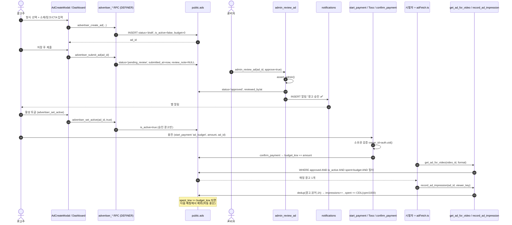
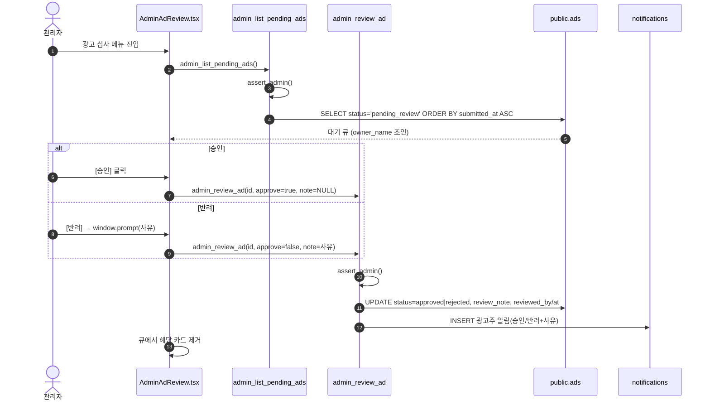
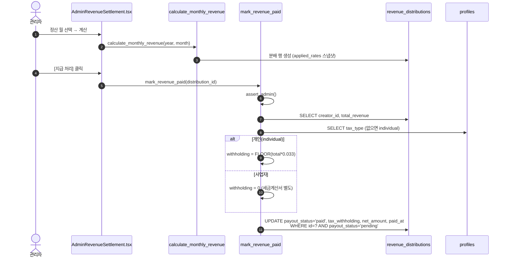
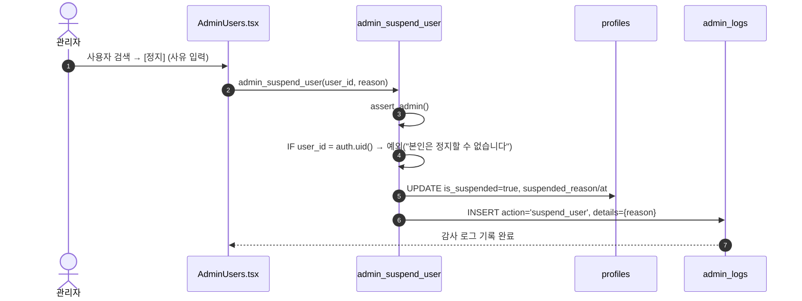

# 08. 광고 · 광고주 · 관리자 — 상세 명세

> 본 문서는 **실제 코드를 읽고** 작성했습니다(추측 금지). 모든 RPC/RLS/엣지 함수에 `file:line` 근거를 표기합니다.
> 대상 영역: ① 광고 노출·과금(자체 House Ads + 외부 광고 네트워크), ② 광고주 셀프서비스 센터, ③ 관리자 패널 전체.
> 최종 점검 기준일: 2026-06-28. SSOT 보조 문서: `docs/advertiser-self-service-design.md`, `docs/ad-fraud-hardening-plan.md`, `docs/launch-checklist.md`.

---

## 1. 개요 / 목적

CREAITE의 광고/운영 시스템은 세 축으로 구성된다.

1. **광고 노출·수익화** — 무료(광고형) 티어의 핵심 수익원. 광고 형식은 6종이며(`src/app/utils/adFetch.ts:7` `AdFormat = "feed" | "preroll" | "midroll" | "overlay" | "postroll" | "bumper"`), 노출면(surface)은 상호 배타로 분리한다(`supabase/ad_surface_exclusive_20260615.sql`). 자체 광고(House Ads, `budget_krw IS NULL`)와 광고주 예산광고(`budget_krw` 설정)가 같은 `public.ads` 테이블을 공유하되, 과금/노출 게이트로 구분된다. 자체 광고가 없을 때 빈 슬롯에는 외부 광고 네트워크(카카오 애드핏·Google AdSense)를 로테이션 노출한다(`src/app/components/ExternalAdSlot.tsx`).

2. **광고주 셀프서비스** — 일반 사용자가 가입 후 직접 광고를 만들고(소재 업로드), 심사 제출하고, 승인 후 예산을 충전해 노출시키는 셀프 광고주 센터(`src/app/components/AdvertiserDashboard.tsx`). 모든 쓰기는 `advertiser_*` SECURITY DEFINER RPC 경유(직접 INSERT/UPDATE 정책 없음).

3. **관리자 패널** — YouTube Studio 스타일 별도 레이아웃(`src/app/components/AdminLayout.tsx`). 21개 메뉴(사용자/콘텐츠/공지/문의/챌린지/배너/버그/메가/자체광고/광고심사/외부광고/스폰서십/수익정책/정산/결제/신고/숨김/댓글/활동로그)를 그룹화. 전 관리 기능은 `assert_admin()`(`supabase/phase10_6_admin_management.sql:18`) 또는 `is_admin()`(`supabase/admin_rls_is_admin_function.sql:21`)로 보호.

**핵심 출시 의존성:** 무료 광고형 티어는 토스페이먼츠 가맹 심사와 무관하게 선출시 가능(`CLAUDE.md` 출시 의존 순서). 단 광고주 **예산 충전**은 토스 결제(`ad_budget`)에 의존하므로, 충전 기능은 결제 가맹 후 활성화된다.

---

## 2. 사용자 스토리 (광고주 / 관리자)

### 광고주

- (광고주) 가입한 사용자로서, **로그인만 하면** 광고주 센터에 진입해 첫 광고를 만들 수 있다(`AdvertiserDashboard.tsx:93` 비로그인 시 로그인 유도).
- (광고주) 4종 형식(오버레이 배너 / 피드 이미지 / 피드 영상 / 영상 프리롤) 중 하나를 골라 소재(이미지 또는 영상)·링크·CTA를 입력하고 **임시 저장** 또는 **저장 후 제출**할 수 있다(`AdCreateModal.tsx:47,317-332`).
- (광고주) 노출당 단가(₩2/노출, CPM ₩2,000)와 예상 노출량을 사전에 확인하고 싶다(`AdCreateModal.tsx:201-215`, `AdTopupModal.tsx:34`).
- (광고주) 제출한 광고의 **심사 상태**(초안/심사 중/승인됨/반려됨/중지됨)와 **반려 사유**를 확인하고 싶다(`AdvertiserDashboard.tsx:68-78,140-142`).
- (광고주) 승인된 광고에 **예산을 충전**하고(₩10,000 최소), 충전 즉시 노출이 시작되며 예산 소진 시 자동 중단되길 기대한다(`AdTopupModal.tsx`, `advertiser_self_service_phase1_20260614.sql:70`).
- (광고주) 광고별 **노출/클릭/CTR**과 최근 14일 **일자별 추이**를 보고 싶다(`AdStatsModal.tsx`, `advertiser_self_service_phase5_20260614.sql:54`).
- (광고주) 승인된 광고를 수정하면 재심사를 거친다는 점을 이해하고, 재승인 시 노출이 자동 재개되길 기대한다(`AdCreateModal.tsx:303-307`, `advertiser_edit_approved_rereview_20260615.sql`).
- (광고주) 광고를 직접 **일시중지/재개**할 수 있다(`AdvertiserDashboard.tsx:182-185`).

### 관리자

- (관리자) 마이페이지 → "관리자 페이지"로 별도 콘솔에 진입한다(어드민만 메뉴 노출, `AdminLayout.tsx:154,167`).
- (관리자) 광고주가 제출한 광고 큐를 보고 소재 미리보기 후 **승인/반려(사유 입력)** 한다(`AdminAdReview.tsx`, `admin_review_ad`).
- (관리자) **자체 House Ads**를 직접 등록/수정/토글/삭제한다(`AdminDashboard.tsx`).
- (관리자) 사용자 검색·정지·관리자 권한 부여(`AdminUsers.tsx`), 콘텐츠 강제 숨김/삭제(`AdminContent.tsx`), 댓글 관리(`AdminComments.tsx`), 신고 큐 처리(`AdminReports.tsx`), AI 안전 심사(`AdminModeration.tsx`)를 수행한다.
- (관리자) 월별 크리에이터 수익을 산출하고 세금 원천징수와 함께 지급 처리한다(`AdminRevenueSettlement.tsx`).
- (관리자) 분배율·CPM·정산 허들 등 정책을 변경하고 이력을 추적한다(`AdminRevenuePolicy.tsx`).
- (관리자) 결제/환불(`AdminPayments.tsx`), 공지 발송(`AdminBroadcast.tsx`), 고객/비즈니스 문의(`AdminSupportInquiries.tsx`, `AdminInquiries.tsx`), 버그/메가/챌린지/배너 운영을 처리한다.
- (관리자) 본인이 수행한 모든 변경 이력을 감사 로그로 추적할 수 있다(`AdminActivityLog.tsx`, `admin_logs`).

---

## 3. 화면 & 상태

### 3.1 광고주 센터 (`AdvertiserDashboard.tsx`)

- **진입**: 비로그인 시 로그인 유도 화면(`:93-97`).
- **목록**: `advertiser_my_ads()` RPC로 본인 광고 로드(`:44`). 각 카드는 소재 썸네일 + 제목 + 상태 배지 + 노출/클릭/CTR(`:130-136`).
- **상태 배지** 5종(`:68-78`): `draft`(초안), `pending_review`(심사 중), `approved`(승인됨), `rejected`(반려됨), `paused`(중지됨).
- **반려 카드**: `rejected` + `review_note` 있으면 빨간 박스로 사유 표시(`:140-142`).
- **예산 진행바**: `approved` 광고는 `spent_krw / budget_krw` 막대(`:144-157`). `budget_krw === 0`이면 "예산 충전 시 노출 시작" 안내(`:153-155`).
- **상태별 버튼**(`:159-197`):
  - `draft`/`rejected`: [수정] [심사 제출].
  - `approved`: [충전] [수정] [일시중지/재개].
  - `pending_review`: "운영팀 심사 중" + [수정].
- **모달**: `AdCreateModal`(생성/수정), `AdTopupModal`(충전), `AdStatsModal`(성과)(`:207-209`).

### 3.2 광고 생성/수정 (`AdCreateModal.tsx`)

- **형식 4종 선택**(새 광고만, `:174-198`): overlay / feed_image / feed_video / preroll → DB 매핑 `format`+`ad_type`(`:114-115`).
- **비용 안내**: 노출당 ₩2 고정(전 형식 동일), 예) ₩10,000 → ~5,000 노출(`:201-215`).
- **입력**: 광고명(80자), 광고주명(선택 60자), 소재(이미지 또는 영상), 클릭 링크, CTA(20자).
- **이미지 업로드**: `ad-images` 버킷 `{uid}/{ts}.{ext}`, 10MB 제한, image/* 만(`:72-87`). URL 직접 입력 시 로드 실패하면 경고 폴백(`:245-259`).
- **영상 업로드**: Bunny(create-upload + TUS) `uploadAdVideo`, 300MB 제한, video/* 만(`:89-101`). 진행률 표시.
- **재심사 모드**(`reReview`, `:58`): 승인됨/심사중 광고 편집 → 단일 [저장 후 재심사 요청] 버튼만(submit 재호출 금지, `:317-321`).
- **신규 모드**: [임시 저장] / [저장 후 제출] 2버튼(`:322-332`).

### 3.3 예산 충전 (`AdTopupModal.tsx`)

- 프리셋 ₩10,000/30,000/50,000/100,000 + 직접입력(`:23,71-84`), 최소 ₩10,000(`:24,37`).
- 예상 노출 = `amount / cpm(=2)`(`:34`).
- 전자상거래법 환불 고지(노출 전 7일 전액 / 후 잔액 환불, `:91-97`).
- 결제: `usePayment.startAdBudgetTopUp` → 토스 결제창 이동 → `/?payment=success` → `confirm_payment`가 `budget_krw` 증액(`:1-5,40`).

### 3.4 광고 성과 (`AdStatsModal.tsx`)

- `advertiser_ad_daily_stats(p_ad_id, p_days=14)` RPC(`:25`). 총 노출/클릭/CTR + 일자별 막대 그래프(`:62-78`).

### 3.5 외부 광고 슬롯 (`ExternalAdSlot.tsx`)

- 자체광고 없는 피드 자리(영상 4개마다)에 외부 네트워크 노출. 규격 300×250 고정(`:27-29`).
- 네트워크: 카카오 애드핏(`:101-113`) + Google AdSense(`:114-132`). `index % networks.length` 로테이션(`:76`).
- 활성 조건: `VITE_EXTERNAL_ADS_ENABLED` + 네트워크 ID(env) 존재(`:41-42`). 비활성 시 `null` 반환 → 빈 칸 방지(`:140-142`).
- **지연 로드**: IntersectionObserver `rootMargin: 300px`로 뷰포트 근처일 때만 스크립트 로드(무한 피드 동시 로드로 인한 첫 화면 멈춤 방지, `:82-94`).
- AdFit 정책 준수: 라운딩/테두리/AD 오버레이 제거하고 원본 그대로 노출(`:149-151`).

### 3.6 영상 광고 플레이어 (`AdMidrollPlayer.tsx`) / 오버레이 (`AdOverlayBanner.tsx`)

- **AdMidrollPlayer**: video.js 기반 풀스크린 광고(pre/mid/post-roll·bumper). HTML5 `<video>` 메모리 누수(800MB+) → video.js `dispose()` 전환(`:1-7`). 마운트 시 `recordAdImpression`(`:37`), `ended` 시 completed 집계(`:80-88`), SKIP 정책(`skip_after_seconds`, `:33-34`), 음소거 자동재생 후 unmute 시도(`:99-121`), 타임아웃 폴백(`maxDur+5`초, `:124-127`), 클릭 시 `recordAdClick`(`:147`).
- **AdOverlayBanner**: 영상 중 하단 배너, `duration_seconds` 카운트다운 자동 닫힘(`:23-35`), 이미지 로드 실패 시 텍스트 폴백(`:54-67`), 클릭 시 `recordAdClick("overlay")`(`:39`).

### 3.7 관리자 패널 화면 (`AdminLayout.tsx`)

레이아웃: 좌측 사이드바 + 메인(`:219-324`). 메뉴 그룹(`:74-96`):
- **📊 한눈에 보기**: 대시보드(`overview` → `AdminOverview`).
- **👥 운영**: 사용자/콘텐츠/공지/고객문의/비즈니스문의/챌린지/배너/버그/메가.
- **📢 광고 관리**: 자체 광고(`ads` → `AdminDashboard`)/광고 심사(`ad_reviews` → `AdminAdReview`)/외부 광고(placeholder)/스폰서십(placeholder).
- **💰 수익화**: 수익 정책/정산 관리/결제·환불.
- **🛡 안전·품질**: 신고 큐/숨김 콘텐츠/댓글 관리/활동 로그.

배지: 메가 달성 대기·신규 버그·미답변 고객문의 카운트(`:138-149`). 접근 제한: 비로그인/비어드민 차단 화면(`:157-180`).

각 패널 화면:
- **AdminOverview**: KPI 카드(사용자/영상/월매출/24h 조회) + 경보 배너 + 차트(매출·성장·조회 30일) + Top10 영상/크리에이터 + 광고 성과 요약.
- **AdminDashboard(자체 광고)**: House/광고주 탭, 폼(형식별 옵션·예산·기간·타게팅), 이미지(`ad-images`)/Bunny 영상 업로드, 토글/삭제.
- **AdminAdReview(광고 심사)**: `pending_review` 큐, 소재 미리보기, [승인]/[반려(사유 prompt)](`AdminAdReview.tsx:34-47`).
- **AdminUsers / AdminContent / AdminComments / AdminModeration / AdminReports / AdminActivityLog**: 검색·필터·조치(정지/숨김/삭제/복원/심사).
- **AdminPayments / AdminRevenueSettlement / AdminRevenuePolicy**: 결제·환불, 월정산+세금, 정책 편집·이력.
- **AdminBroadcast / AdminInquiries / AdminSupportInquiries / AdminBugReports / AdminChallenges / AdminBanners / AdminMegaUploader**: 운영 도구.
- **AdminExternalAds / AdminSponsorships**: 준비 중 placeholder(`AdminLayout.tsx:48-49,204-205`).

---

## 4. 동작 흐름

### 4.1 광고 생성 → 수정 → 심사 제출 → 승인/반려 → 활성화 → 예산 충전 → 노출/과금

```
[생성]  advertiser_create_ad  → status='draft', is_active=false, budget_krw=0   (phase1:98-118)
   ↓
[수정]  advertiser_update_ad  (draft/rejected: 자유 / approved: 재심사 전환)     (rereview:12-45)
   ↓
[제출]  advertiser_submit_ad  → status='pending_review', submitted_at=now()      (phase1:140-150)
   ↓
[심사]  admin_review_ad(approve)
         ├ 승인 → status='approved' + 광고주 알림(벨)                            (phase1:180-205)
         └ 반려 → status='rejected', review_note=사유 + 알림
   ↓
[활성]  승인 직후 is_active 는 광고주가 제어. budget_krw=0 이면 노출 0
   ↓
[충전]  start_payment('ad_budget', amount, adId) → 토스 결제 → confirm_payment 가 budget_krw 증액
   ↓
[노출]  get_ad_for_video / pick_random_video_preroll: status='approved' AND is_active
         AND (budget_krw IS NULL OR spent_krw < budget_krw) AND 기간/길이/카테고리 필터  (phase1:43-94)
   ↓
[과금]  record_ad_impression: 예산광고는 (광고,뷰어,1시간) 1회만 집계 + CPM 차감       (phase5:11-51)
         spent_krw >= budget_krw 가 되면 다음 매칭에서 제외 → 자동 중단
```

**승인본 수정의 재심사 흐름**(`advertiser_edit_approved_rereview_20260615.sql:36-42`): `approved` 광고를 수정하면 `status='pending_review'`로 자동 전환되고 `review_note/reviewed_by/reviewed_at` 초기화. 노출 게이트가 `status='approved'`라 재심사 동안 노출 중단, 재승인 시 `is_active` 보존되어 자동 재개. (bait-and-switch 방지)

### 4.2 외부 광고 노출 흐름

피드 렌더 → 자체광고 없는 슬롯 → `EXTERNAL_ADS_ACTIVE`면 `ExternalAdSlot` 삽입 → IntersectionObserver가 뷰포트 근처 감지(`rootMargin:300px`) → 네트워크별 `ins` + 로더 스크립트 주입(애드핏 `ba.min.js` / AdSense `adsbygoogle.js`) → 네트워크가 300×250 광고 렌더. 언마운트 시 `el.innerHTML=""` 정리(`ExternalAdSlot.tsx:134-136`).

### 4.3 VAST 프리롤 흐름 (Bunny IMA SDK)

Bunny Player `vastTagUrl` → `/vast-tag/:sourceVideoId`(Edge, `supabase/functions/server/index.ts:846`) → `pick_random_video_preroll(source_video_id)`(가중치 랜덤 + 영상 길이 검사) → 광고 있으면 VAST 2.0 XML, 없으면 빈 `<VAST></VAST>`(`:858-870`) → 트래킹 픽셀 URL에 HMAC 서명(`vastSign`, 6시간 유효, `:836-844,879-886`) → IMA SDK가 impression/start/quartile/complete/skip/click 픽셀 호출.

### 4.4 관리자 운영 흐름

- **정지/권한**: `admin_suspend_user`/`admin_unsuspend_user`/`admin_set_admin_role`(본인 권한 회수 차단).
- **모더레이션**: AI 점수(`update_video_moderation`: ≥90 reject / 70-89 flagged / <70 pass) → `get_moderation_queue` → `resolve_moderation_flag(pass|reject)`.
- **신고**: `create_report`(임계치 도달 시 자동 숨김) → `get_pending_reports` → `moderate_report(keep|remove|dismiss)` → 신고자에게 결과 알림/메일.
- **정산**: `calculate_monthly_revenue(year,month)`(분배율 스냅샷 `applied_rates`) → `get_revenue_distributions_by_period` → `mark_revenue_paid`(세금 원천징수 계산).
- **정책**: `update_platform_setting(key,value,note)`(이전 행 effective_to 마감 + 신규 행) → `get_platform_setting_history`. 과거 정산월은 스냅샷 사용으로 소급 미적용.
- **공지**: `admin_broadcast_notification(title,body,link,segment)` → 세그먼트별 알림 + 선택 시 이메일.
- **심사/문의**: 위 4.1 광고 심사, `admin_reply_support_inquiry`(고객 알림), 비즈니스 문의는 직접 테이블 상태 변경.

---

## 5. 데이터/RPC 계약

### 5.1 `public.ads` 테이블 (핵심 컬럼)

기본(`ads_table.sql:6-23`): `id, title, advertiser, image_url, video_url, thumbnail_url, link_url, cta_text, interval_count, is_active, starts_at, ends_at, impressions, clicks`.
셀프서비스 확장(`advertiser_self_service_phase1_20260614.sql:13-20`): `owner_id`(FK auth.users, ON DELETE SET NULL), `status`(CHECK `draft|pending_review|approved|rejected|paused`, 기본 `approved`), `review_note, reviewed_by, reviewed_at, submitted_at`.
기타(타 phase): `format, ad_type, budget_krw, spent_krw, weight, target_tiers, target_categories, min_video_duration_sec, duration_seconds, skip_after_seconds, trigger_position_pct, max_duration, skip_offset`.
`ad_type` CHECK(`ad_surface_exclusive_20260615.sql:19-20`): `feed_display | video_preroll | overlay`.

### 5.2 광고주 RPC (`advertiser_*`, 전부 SECURITY DEFINER, GRANT authenticated)

| RPC | 인자 | 반환 | 권한/조건 | file:line |
|---|---|---|---|---|
| `advertiser_create_ad` | `p_title,p_format,p_ad_type,p_link_url,p_cta_text='자세히 보기',p_image_url,p_video_url,p_thumbnail_url,p_advertiser` | `uuid` | `auth.uid()` 필수. status='draft', is_active=false, budget=0 | phase1:98-118 |
| `advertiser_update_ad` | `p_ad_id,p_title,p_link_url,p_cta_text,p_image_url,p_video_url,p_thumbnail_url` | `void` | 본인 + `draft/rejected/pending_review/approved`. 승인본 수정→재심사 전환. 미디어는 COALESCE(빈값=기존유지) | rereview:12-45, media_coalesce:3-21 |
| `advertiser_submit_ad` | `p_ad_id` | `void` | 본인 + `draft/rejected` → `pending_review`, review_note 초기화 | phase1:140-150 |
| `advertiser_set_active` | `p_ad_id,p_on` | `void` | 본인 + **승인된 광고만** is_active 토글 | phase1:153-162 |
| `advertiser_my_ads` | (없음) | `TABLE(... video_url 포함 ...)` | `owner_id=auth.uid()`만 | phase1:165-177, add_video_url:8-20 |
| `advertiser_ad_daily_stats` | `p_ad_id,p_days=14` | `TABLE(day,impressions,clicks)` | 본인 또는 is_admin. `ad_video_events` 집계 | phase5:54-72 |

> 주의: `advertiser_update_ad`는 같은 시그니처로 여러 파일에 정의됨(phase1 → media_coalesce → rereview). **현재 정본은 rereview 버전(2026-06-15, 승인본 재심사 전환 포함)**. 재배포 순서에 따라 정본 확정 필요.

### 5.3 서빙/심사 RPC

| RPC | 인자 | 반환 | 핵심 필터/권한 | file:line |
|---|---|---|---|---|
| `get_ad_for_video` | `p_video_id,p_format` | `TABLE(ad_id,...,trigger_position_pct)` | status='approved' AND is_active AND format=p_format AND 기간 AND `(budget_krw IS NULL OR spent_krw<budget_krw)` AND 영상길이/카테고리 타게팅. `ORDER BY random() LIMIT 1` | phase1:43-76 |
| `pick_random_video_preroll` | `p_source_video_id` | `SETOF ads` | ad_type='video_preroll' AND approved AND active AND video_url AND 기간 AND 예산. `random()*weight DESC LIMIT 1` | phase1:78-94 |
| `admin_review_ad` | `p_ad_id,p_approve,p_note` | `void` | `assert_admin()`. status 전환 + 광고주 알림 + admin_logs(`admin_audit_log_boost_20260616.sql`) | phase1:180-205 / audit_boost:7-39 |
| `admin_list_pending_ads` | (없음) | `TABLE(... owner_name ...)` | `assert_admin()`. status='pending_review', submitted_at ASC | phase4:2-18 |

### 5.4 노출/클릭/과금 RPC

| RPC | 인자 | 반환 | 동작 | file:line |
|---|---|---|---|---|
| `record_ad_impression`(정본) | `p_ad_id,p_video_id,p_format,p_position_seconds,p_completed,p_skipped,p_viewer_key` | `void` | 예산광고는 `ad_charge_dedup`(광고,뷰어,1시간) 1회만 집계+CPM 차감. 무료 House Ads(budget NULL)는 매 노출 집계·과금 없음. `ad_impressions`+`ad_video_events`+`ads.impressions++` | phase5:11-51 |
| `record_ad_click` | `p_ad_id,p_video_id,p_format` | `void` | `ad_clicks`+`ad_video_events(click)`+`ads.clicks++` (프론트 `adFetch.ts:84`가 호출) | phase28_ad_revenue_distribution_fix.sql |
| `increment_ad_impressions` | `ad_id,p_viewer_key,p_video_id` | `void` | dedup(`ad_charge_dedup`) 1회만 impressions++ + CPM 차감 | ad_charge_dedup_phase3:22-48 |
| `increment_ad_clicks`(정본) | `ad_id,p_viewer_key` | `void` | **구 1-파라미터 sql 함수 DROP** 후 dedup(`ad_click_dedup`) 2-파라미터 버전. (광고,뷰어,1시간) 1회만 clicks++ | home_security_20260620.sql:51-70 |
| `cleanup_ad_charge_dedup` / `cleanup_ad_click_dedup` | (없음) | `integer` | 7일 경과 dedup 정리(크론 권장) | dedup_phase3:51-59 / home_security:73-81 |

> 프론트 호출 매핑(`adFetch.ts`): 매칭=`get_ad_for_video`(1분 TTL 캐시, `:26,41`), 노출=`record_ad_impression`(`:67`, `p_viewer_key=getViewerSessionKey()`), 클릭=`record_ad_click`(`:84`). `increment_ad_clicks`는 홈피드 자체광고(House Ads) 클릭 경로에서 사용.

### 5.5 관리자 RPC (대표, 전부 SECURITY DEFINER)

| RPC | 권한 게이트 | file:line |
|---|---|---|
| `assert_admin()` | (가드 자체) profiles.is_admin 확인 후 예외 | phase10_6_admin_management.sql:18-34 |
| `is_admin()` | RLS용 boolean 반환 | admin_rls_is_admin_function.sql:21-25 |
| `admin_search_users / admin_suspend_user / admin_unsuspend_user / admin_set_admin_role` | `assert_admin()`. 권한RPC는 본인 회수 차단 | phase10_6:41 / phase10_7:166,192,321 |
| `admin_search_videos / admin_hide_video / admin_unhide_video / admin_delete_video / admin_get_hidden_content` | `assert_admin()` | phase10_6:158,263 / phase10_7:208,229,244 |
| `admin_search_comments / admin_hide_comment / admin_unhide_comment / admin_delete_comment / admin_unhide_post` | `assert_admin()` | phase23_admin_comments.sql:21,104,125,145 / phase_security_hardening:111 |
| `get_admin_dashboard_summary / get_daily_revenue / get_daily_user_growth / get_daily_views / get_top_videos / get_top_creators / get_ad_performance_summary / get_report_stats` | **SECURITY DEFINER + `PERFORM assert_admin()`** (plpgsql 전환, 2026-06-24 강건화) | `admin_dashboard_assert_admin_20260624.sql:27,76,99,120,140,162,185,207` |
| `get_pending_reports / moderate_report / create_report / get_my_reports` | moderate_report=is_admin 체크 / create_report·get_my는 사용자용 | phase10_reports.sql:110,183,276,311 |
| `get_moderation_queue / resolve_moderation_flag / update_video_moderation` | 앞 둘 `assert_admin()`, 마지막은 service_role(Edge) | phase25_moderation.sql:50,100,153 |
| `admin_broadcast_notification` / `admin_broadcast_email_targets` | 앞 `assert_admin()`, 뒤 service_role(PII) | phase10_7:15 / broadcast_email_20260616.sql:16 |
| `admin_get_activity_logs` | `assert_admin()` | phase10_7:108 |
| `admin_get_all_payments / admin_refund_payment` | `assert_admin()` | phase10_6:342 / phase_user_payment_history.sql:184 |
| `get_active_platform_settings / update_platform_setting / get_platform_setting_history / get_platform_setting / get_platform_setting_at` | update=is_admin 체크, 나머지 조회용 | phase8_platform_settings.sql:69,85,103,140,204 |
| `calculate_monthly_revenue / mark_revenue_paid / get_revenue_distributions_by_period / admin_get_tax_annual_report` | calc=is_admin / 나머지 assert_admin (annual) | phase8_revenue_distributions.sql:77,340 / phase32_tax_withholding.sql:64,201 |
| `admin_reply_support_inquiry` | (고객 알림 동반) | AdminSupportInquiries.tsx:65 호출 |
| `admin_list_upload_milestones` | 메가 이벤트 | mega_uploader_event_20260611.sql:89 |

직접 테이블 접근(어드민 화면, RLS의 "Admin full access"/`is_admin()` 정책 의존): `ads`(AdminDashboard), `business_inquiries`(AdminInquiries), `support_inquiries`(AdminSupportInquiries), `bug_reports`(AdminBugReports), `challenges`/`videos`(AdminChallenges), `event_banners`(AdminBanners), `upload_milestones`(AdminMegaUploader).

### 5.6 핵심 테이블

- `ad_charge_dedup`(PK `ad_id,viewer_key,bucket`, RLS on + 정책 없음, REVOKE anon/auth — DEFINER 함수만 기록, `dedup_phase3:11-20`).
- `ad_click_dedup`(동일 구조, `home_security:40-48`).
- `admin_logs`(`admin_id,action,target_type,target_id,details(jsonb),created_at`, RLS `is_admin()`만 SELECT, `phase10_7:85-105`).
- `platform_settings`(key/value/effective_from/effective_to, 활성 1행 UNIQUE, `phase8_platform_settings.sql:22-46`).
- `revenue_distributions`(applied_rates 스냅샷 + tax_withholding/net_amount, `phase8_revenue_distributions.sql:18-50`).
- `ads_public` 뷰(공개 안전 컬럼만, 승인·활성·기간 필터 내장, `ads_public_view_20260620.sql:20-30`).

---

## 6. 비즈니스 규칙

1. **생성 기본값**: 새 광고는 `status='draft'`, `is_active=false`, `budget_krw=0`(phase1:111-114). 즉 만들어도 즉시 노출되지 않는다.
2. **심사 상태머신**: `draft/rejected → (submit) → pending_review → (admin) → approved | rejected`. 승인본 수정 → `pending_review`(재심사). 일시중지는 status가 아닌 `is_active` 토글로 처리(승인 상태 유지).
3. **노출 게이트(승인된 것만)**: 모든 서빙 RPC가 `status='approved' AND is_active AND 기간 AND 예산 미소진`을 강제(phase1:65-73,86-92). draft/pending/rejected/paused는 절대 노출 안 됨 → 심사 우회 불가.
4. **활성 토글 본인 제한**: `advertiser_set_active`는 **승인된 본인 광고만**(phase1:159-160). 타인/미승인 광고 토글 불가.
5. **충전 본인 제한**: `start_payment('ad_budget', ...)`가 결제 생성 단계에서 `owner_id=auth.uid()` 검증(start_payment_ad_owner_20260624.sql:52-59). 타인 광고 예산 오염 차단.
6. **CPM 차감**: 예산광고 노출 1회당 `CEIL(ad_cpm_krw/1000)` 차감(기본 CPM ₩2,000 → ₩2/노출, phase5:46-48). `spent_krw >= budget_krw`가 되면 다음 매칭에서 제외 → 자동 중단.
7. **dedup(과금 정합)**: 예산광고는 (광고, 뷰어, 1시간) 조합당 1회만 집계·과금(phase5:28-32). 뷰어키 = `auth.uid()` 또는 클라 세션키. 반복 호출로 경쟁 광고 예산 고갈·자기 노출 부풀리기 차단.
8. **무료 House Ads 무중단**: `budget_krw IS NULL`인 자체 광고는 매 노출 집계·과금 없음(phase5:6,46). status 기본 `approved`라 셀프서비스 도입 후에도 무중단(phase1:6,15).
9. **노출면 상호 배타**: 오버레이는 `ad_type='overlay'`, 피드카드는 `feed_display`, 프리롤은 `video_preroll`로 분리(ad_surface_exclusive). 오버레이가 피드에도 뜨던 중복 노출 제거(AdCreateModal.tsx:42-46).
10. **외부 광고 IO 지연**: 외부 광고는 뷰포트 근접 시에만 스크립트 로드(ExternalAdSlot:82-94). AdFit 표준 300×250 고정, 임의 확대/축소·가림 금지(정책 위반 방지).
11. **분배율 정책**: 광고 수익은 노출 tier별(OTT/cinema/home) CPM × tier_share로 크리에이터에 분배(`calculate_monthly_revenue`). 정책값은 `platform_settings`에서 변경, 과거 정산월은 `applied_rates` 스냅샷으로 소급 미적용.
12. **VAST 빈 응답 폴백**: 광고 없음/길이 미달/에러 시 빈 `<VAST>` 반환 → Bunny가 광고 스킵(index.ts:858-870,941-952).

---

## 7. 엣지 케이스 & 에러 처리

- **심사 우회 차단**: 서빙 RPC 게이트가 `status='approved'` 강제. draft/pending/rejected 광고는 충전해도 노출 안 됨(phase1:65). 승인본 소재 교체(bait-and-switch)는 재심사 강제 전환으로 차단(rereview:36-42).
- **예산 오염 차단**: 충전 시 본인 소유 검증(start_payment_ad_owner). 과거에 `payment_hardening`의 "ads에 소유자 없음" 가정이 깨져 타인 광고 예산 증액 가능했던 갭을 #B(2026-06-24)에서 폐쇄.
- **과금 fraud(이월)**: 클라이언트 `record_ad_impression`/`record_ad_click`/`increment_ad_*`는 dedup으로 1시간 1회만 과금. **단 영상광고 VAST 트래킹(Edge service_role 경유)은 별도 경로**로 dedup 미적용 — `dedup_phase3` 주석에 "후속 보강" 명시(`ad_charge_dedup_phase3:6-7`). → 11장 이월 항목.
- **중복 심사**: `admin_list_pending_ads`는 `pending_review`만 노출, `admin_review_ad`는 status 무관 일괄 UPDATE라 멱등(이미 승인/반려된 건 재처리 시 단순 덮어쓰기). 광고주가 심사 중 수정하면 `pending_review` 유지(재 submit 금지, AdCreateModal:57-58).
- **소재 로드 실패**: 이미지 URL이 웹페이지/잘못된 주소면 미리보기·노출 모두 폴백(AdCreateModal:245-259, AdOverlayBanner:54-67, AdMidrollPlayer:182-183).
- **영상 메모리 누수/타임아웃**: video.js `dispose()`로 buffer 해제(:129-135), `maxDur+5`초 타임아웃 강제 complete(:124-127), autoplay 실패 시 muted 유지(:111-120).
- **VAST query string 누락**: Bunny `vastTagUrl`가 query를 보존 못해 path parameter(`/vast-tag/:sourceVideoId`)가 정식 경로, query 버전은 legacy 호환(index.ts:814-817).
- **권한 회수 자살 방지**: `admin_set_admin_role`는 본인 admin 회수 차단(phase10_7:331).
- **메디어 빈값 보존**: `advertiser_update_ad`(media_coalesce)가 빈 미디어 인자를 무시 → 메타만 수정 시 영상 유실 방지.

---

## 8. 권한/보안

- **전 관리 기능 게이트**: 거의 모든 `admin_*` RPC가 첫 줄 `PERFORM public.assert_admin();`(phase10_6:18 가드). 통계 조회 8종(`get_admin_dashboard_summary` 등)도 2026-06-24 plpgsql 전환 + `assert_admin()` 선행으로 게이트됨(`admin_dashboard_assert_admin_20260624.sql`) — 비관리자 직접 호출 차단.
- **RLS 정책**: `ads`는 "Admin full access"(is_admin) + "Advertiser can view own ads"(owner_id=auth.uid())만 유지, 공개 SELECT 정책 제거(ads_public_view:36-37). 광고주 직접 INSERT/UPDATE 정책 없음 → 모든 쓰기는 DEFINER RPC.
- **ads_public 뷰**: 공개 노출은 안전 컬럼만(budget/spent/owner_id/review_note 제외). 피드는 base가 아닌 `ads_public` 조회(ads_public_view:20-30). 광고주 대시보드·프리롤은 RPC(DEFINER) 경유라 RLS 우회.
- **이미지 본인 폴더**: `ad-images` 버킷 INSERT/UPDATE/DELETE는 `(storage.foldername(name))[1] = auth.uid()::text`(본인 폴더만, ad_images_advertiser_upload:8-20). 읽기는 공개(노출용).
- **dedup 테이블 잠금**: `ad_charge_dedup`/`ad_click_dedup` RLS on + 정책 없음 + REVOKE anon/auth → DEFINER 함수만 기록(클라 직접 위조 차단).
- **VAST 이스케이프**: XML 인젝션 방지 — CDATA 탈출(`]]>`) 무력화 + 클릭링크 `^https?://` 만 허용(아니면 `#`)(index.ts:888-890). 트래킹 픽셀 HMAC 서명(service_role_key, 6시간 만료)으로 임의 ad_id 위조 차단(index.ts:836-844).
- **결제 검증**: `start_payment`가 서버측 금액·소유권 검증(구독=정책가 일치, 라이선스=영상가 일치, ad_budget=본인 광고)(start_payment_ad_owner:36-60).
- **감사 트리거**: 어드민의 `ads` 직접 INSERT/UPDATE/DELETE는 `log_ads_changes` 트리거가 `admin_logs`에 자동 기록(시청자 RPC 차감은 비어드민이라 skip, admin_audit_ads_trigger.sql:20-109).
- **CORS**: VAST는 credentials 요청 대응 위해 정확한 origin 반향(wildcard 금지, index.ts:825-833).

---

## 9. 분석/이벤트

### 광고 성과
- 광고주: `advertiser_my_ads`(누적 노출/클릭/CTR), `advertiser_ad_daily_stats`(최근 14일 일자별, `ad_video_events` 집계).
- 노출 상세: `ad_impressions`(format, position_seconds, completed, skipped). 수익분배: `ad_video_events`(impression/click + source_video_id + viewer).
- VAST 트래킹 이벤트: impression/start/firstQuartile/midpoint/thirdQuartile/complete/skip/click(index.ts:905-916).
- 관리 통계: `get_ad_performance_summary`(total/active/depleted ads, impressions, clicks, spent/budget, avg_ctr).

### 관리 통계
- `get_admin_dashboard_summary`(사용자·매출·조회·운영 KPI), `get_daily_revenue/user_growth/views`(30일 추이), `get_top_videos/creators`, `get_report_stats`.
- 감사: `admin_logs`(모든 어드민 액션 — suspend/role/hide/delete/refund/broadcast/ad_approve/ad_reject/resolve_moderation), `admin_get_activity_logs`로 조회.

---

## 10. 수용 기준 (체크리스트)

- [ ] 비로그인 사용자는 광고주 센터에서 로그인 유도만 보인다.
- [ ] 새 광고는 draft/비활성/예산0으로 생성되어 즉시 노출되지 않는다.
- [ ] draft/rejected 광고만 자유 수정, 승인본 수정 시 자동 재심사(pending_review) 전환되고 노출 중단된다.
- [ ] 재승인 시 `is_active`가 보존되어 노출이 자동 재개된다.
- [ ] 광고주는 승인된 본인 광고만 활성 토글/충전할 수 있다(타인/미승인 차단 예외).
- [ ] 타인 광고 id로 `start_payment('ad_budget',...)` 호출 시 "본인 소유 광고에만…" 예외.
- [ ] 예산광고 노출은 (광고,뷰어,1시간) 1회만 과금되고, `spent_krw>=budget_krw`면 노출이 자동 중단된다.
- [ ] 무료 House Ads(budget NULL)는 과금 없이 무중단 노출된다.
- [ ] `record_ad_impression`/`increment_ad_clicks` 반복 호출이 dedup으로 과금/카운트되지 않는다.
- [ ] 오버레이 광고가 피드 카드에 동시 노출되지 않는다(노출면 배타).
- [ ] 외부 광고는 env(ENABLED+네트워크ID) 설정 시에만, 뷰포트 근접 시에만 로드된다.
- [ ] anon이 base `ads`를 직접 조회 시 0행, `ads_public`은 승인광고 안전 컬럼만 노출한다.
- [ ] 광고주는 `ad-images`의 본인 폴더에만 업로드 가능하다.
- [ ] 모든 `admin_*` 변경 RPC가 비어드민 호출 시 예외(assert_admin)이며 admin_logs에 기록된다.
- [ ] VAST 클릭링크가 http(s)가 아니면 `#`로 치환되고, CDATA 탈출 인젝션이 무력화된다.
- [ ] 관리자 광고 심사: pending 큐 표시 → 승인/반려(사유) → 광고주 알림 발송.
- [ ] 정책 변경은 이력으로 남고 과거 정산월(applied_rates 스냅샷)에 소급 적용되지 않는다.

---

## 11. 알려진 제약 / 이월

- **영상광고 VAST 트래킹 dedup 미적용**: 클라이언트 RPC 경로(`record_ad_impression`/`increment_ad_*`)는 dedup이 있으나, **VAST 트래킹 픽셀(Edge service_role 경유)은 dedup 미적용**(`ad_charge_dedup_phase3:6-7` 주석). HMAC 서명으로 위조는 막지만, 동일 뷰어 반복 노출 과금 정합은 후속 보강 필요. (참조: `docs/ad-fraud-hardening-plan.md`)
- **`advertiser_update_ad` 다중 정의**: phase1 → media_coalesce → rereview 순으로 같은 시그니처가 재정의됨. 배포 순서에 따라 정본 확정 필요(현재 의도 정본 = rereview, 재심사 전환 포함).
- **외부 광고 화이트리스트**: 외부 광고는 코드상 카카오 애드핏 + Google AdSense 2종만 지원(`ExternalAdSlot.tsx:44`). 쿠팡 파트너스 등은 `AdminExternalAds` placeholder("준비 중 · 베타 후 통합", AdminLayout:111). 신규 네트워크는 env + `enabledNetworks()` 화이트리스트 확장 필요.
- **(해결됨 2026-06-24) 통계 조회 RPC 게이트**: `get_admin_dashboard_summary` 계열 8종이 plpgsql + `PERFORM assert_admin()` 선행으로 전환됨(`admin_dashboard_assert_admin_20260624.sql:27,76,99,120,140,162,185,207`). 비관리자 직접 호출 시 예외.
- **예산 충전 토스 의존**: 예산 충전은 토스 `ad_budget` 결제에 의존 → 토스 가맹 심사 완료 전까지 충전 비활성/안내 처리(`AdvertiserDashboard.tsx:5` 주석 맥락, `CLAUDE.md` 출시 의존 순서).
- **외부 스폰서십/크리에이터 콘텐츠 협찬**: `AdminSponsorships` placeholder(준비 중).

---

## 와이어프레임 (텍스트 목업)

> 실제 컴포넌트(`AdvertiserDashboard.tsx`, `AdCreateModal.tsx`, `AdTopupModal.tsx`, `AdStatsModal.tsx`, `ExternalAdSlot.tsx`, `AdminLayout.tsx`, `AdminAdReview.tsx`)의 마크업·상태·버튼 구성을 ASCII로 옮긴 목업. 라벨은 한글 i18n 기준.

### W1. 광고주 센터 — 광고 목록 (`AdvertiserDashboard.tsx:82-205`)

```
┌───────────────────────────────────────────────┐
│ [←]  📢 광고주 센터                              │
├───────────────────────────────────────────────┤
│ ┌───────────────────────────────────────────┐ │
│ │  +  새 광고 만들기                          │ │  (:100-103)
│ └───────────────────────────────────────────┘ │
│                                                 │
│ ┌── 광고 카드 (draft) ──────────────────────┐  │
│ │ [썸네일] 여름 세일 프로모션  [초안]         │  │  (:127-128)
│ │          📊 노출 0  클릭 0  CTR —  추이      │  │  (:130-136)
│ │  [ ✎ 수정 ]            [ ➤ 심사 제출 ]      │  │  (:160-170)
│ └────────────────────────────────────────────┘ │
│                                                 │
│ ┌── 광고 카드 (rejected) ───────────────────┐  │
│ │ [썸네일] 가을 런칭        [반려됨]          │  │
│ │ ┌ 반려 사유: 소재에 과장 표현 포함 ───────┐ │  │  (:140-142)
│ │ └──────────────────────────────────────┘ │  │
│ │  [ ✎ 수정 ]            [ ➤ 심사 제출 ]      │  │
│ └────────────────────────────────────────────┘ │
│                                                 │
│ ┌── 광고 카드 (pending_review) ─────────────┐  │
│ │ [썸네일] 신제품 티저      [심사 중]         │  │
│ │  운영팀 심사 중 (보통 1영업일).   [ ✎ 수정 ]│  │  (:188-195)
│ └────────────────────────────────────────────┘ │
│                                                 │
│ ┌── 광고 카드 (approved, 예산0) ────────────┐  │
│ │ [썸네일] 브랜드 캠페인    [승인됨]          │  │
│ │  예산 소진           ₩0 / ₩0               │  │  (:144-152)
│ │  ▕░░░░░░░░░░░░░░░░░░░░░░░░░░░░░░░░░░░░░▏ 0% │  │
│ │  ⚡ 예산을 충전하면 노출이 시작됩니다.       │  │  (:153-155)
│ │  [ 💳 충전 ]  [ ✎ 수정 ]  [ ▶ 재개/⏸일시중지]│  │  (:172-186)
│ └────────────────────────────────────────────┘ │
└───────────────────────────────────────────────┘
  비로그인 → "로그인이 필요합니다." + [로그인] 버튼만 (:93-97)
```

### W2. 광고 생성/수정 모달 (`AdCreateModal.tsx:157-339`)

```
┌──────────── 새 광고 만들기 ───────────── [x] ┐
│ [형식 4종 — 새 광고만 노출] (:174-198)        │
│  ┌──────────┐┌──────────┐                    │
│  │🖼 오버레이 배너││🖼 피드 이미지│              │
│  └──────────┘└──────────┘                    │
│  ┌──────────┐┌──────────┐                    │
│  │🎞 피드 영상  ││🎞 영상 프리롤│              │
│  └──────────┘└──────────┘                    │
│  ⓘ 선택 형식 설명 (노출면 안내)               │
│ ┌ 💰 비용                       노출당 ₩2 ──┐ │  (:201-215)
│ │ CPM ₩2,000 기준 1회당 ₩2 차감 (클릭 무료) │ │
│ │ 예) ₩10,000 → 약 5,000회 노출, 소진 자동중단│ │
│ └──────────────────────────────────────────┘ │
│ 광고명        [____________________] (80자)   │  (:217-221)
│ 광고주명(선택)[____________________] (60자)   │  (:223-229)
│ 배너 이미지   [업로드 | URL ]  [미리보기]      │  (:231-261)
│   └ 이미지킨드 / 영상킨드는 상호배타 렌더       │  (:264-291)
│ 클릭 링크     [https://...]                    │  (:293-296)
│ 버튼문구(CTA) [자세히 보기] (20자)             │  (:298-301)
│ ⓘ 저장 후 「심사 제출」 → 승인 → 충전 → 노출    │  (:308-313)
├───────────────────────────────────────────────┤
│  [ 임시 저장 ]            [ ➤ 저장 후 제출 ]    │  신규 (:322-332)
│  ────── 또는 재심사 모드 ──────                 │
│  [ ➤ 저장 후 재심사 요청 ] (단일 버튼)          │  reReview (:317-321)
└───────────────────────────────────────────────┘
```

### W3. 예산 충전 모달 (`AdTopupModal.tsx:50-110`)

```
┌──────────── 💳 예산 충전 ──────────── [x] ┐
│ 「브랜드 캠페인」                           │  (:69)
│ ┌────────┐┌────────┐┌────────┐┌────────┐ │  (:71-78)
│ │ ₩10,000││ ₩30,000││ ₩50,000││₩100,000│ │
│ └────────┘└────────┘└────────┘└────────┘ │
│ 직접 입력 (₩) [ 30000 ]  (최소 ₩10,000)    │  (:80-84)
│ ⓘ 예상 노출 약 15,000회 (노출당 ₩2).        │  (:86-89)
│   충전 후 즉시 노출 반영.                    │
│ ⓘ 노출 전 7일 전액 환불 / 후 잔액 환불.      │  (:91-97)
│   환불 정책: 이용약관 제7조                  │
├─────────────────────────────────────────────┤
│        [ ₩30,000 충전하기 ]                 │  → Toss 결제창 (:100-105)
└─────────────────────────────────────────────┘
```

### W4. 광고 성과 모달 (`AdStatsModal.tsx`)

```
┌──────────── 📊 「브랜드 캠페인」 성과 ── [x] ┐
│  총 노출 12,340   총 클릭 215   CTR 1.7%      │
│  최근 14일 추이 (일자별 막대)                 │
│   ▁▂▃▅▇▆▄▃▂▁▂▃▄▅   (impressions)            │
│   advertiser_ad_daily_stats(p_ad_id, 14)     │
└───────────────────────────────────────────────┘
```

### W5. 외부 광고 슬롯 (`ExternalAdSlot.tsx`)

```
피드: [영상][영상][영상][영상][▼외부광고 슬롯▼][영상]...
                              └ 4개마다 1슬롯
┌──── 300 × 250 (고정) ────┐   (:27-29)
│  카카오 애드핏 / AdSense  │   index % networks.length 로테이션 (:76)
│  (뷰포트 300px 근접 시     │   IntersectionObserver lazy-load (:82-94)
│   에만 스크립트 로드)      │
└───────────────────────────┘
  env(VITE_EXTERNAL_ADS_ENABLED + 네트워크ID) 없으면 → null(빈칸 없음) (:41-42,140-142)
```

### W6. 관리자 패널 레이아웃 (`AdminLayout.tsx:74-96,219-324`)

```
┌─ 사이드바 ──────────┬─ 메인 ────────────────────────┐
│ 📊 한눈에 보기      │                                │
│   대시보드          │   (선택 메뉴의 패널 렌더)       │
│ 👥 운영             │                                │
│   사용자 / 콘텐츠    │                                │
│   공지 / 고객문의    │                                │
│   비즈니스문의       │                                │
│   챌린지 / 배너      │                                │
│   버그 / 메가 [N]    │  ← 배지: 대기 카운트 (:138-149) │
│ 📢 광고 관리        │                                │
│   자체 광고          │                                │
│   광고 심사 [N]      │                                │
│   외부 광고(준비중)  │                                │
│   스폰서십(준비중)   │                                │
│ 💰 수익화           │                                │
│   수익 정책          │                                │
│   정산 관리          │                                │
│   결제·환불          │                                │
│ 🛡 안전·품질        │                                │
│   신고 큐 / 숨김     │                                │
│   댓글 / 활동 로그   │                                │
└─────────────────────┴────────────────────────────────┘
  비로그인/비어드민 → 접근 차단 화면 (:157-180)
```

### W7. 관리자 — 광고 심사 큐 (`AdminAdReview.tsx:49-101`)

```
┌─ 📢 광고 심사   [3건 대기] ──────────────────┐  (:51-56)
│ ┌── 심사 카드 ─────────────────────────────┐ │
│ │ [소재 32×24] 신제품 티저                   │ │  (:70-75)
│ │   광고주: 아크미 · 계정 hong               │ │  (:77)
│ │   포맷: feed · CTA: 자세히 보기            │ │  (:78)
│ │   🔗 https://example.com/promo            │ │  (:79-82)
│ │   [ ✓ 승인 ]            [ ✗ 반려 ]         │ │  (:86-95)
│ └────────────────────────────────────────────┘ │  반려 → window.prompt(사유) (:36-40)
│   대기 0건 → "심사 대기 중인 광고가 없습니다." │  (:60-64)
└───────────────────────────────────────────────┘
```

### W8. 관리자 — 사용자 관리 / 정산 / 정책 (개념 목업)

```
[사용자 관리 AdminUsers]                 [정산 관리 AdminRevenueSettlement]
┌──────────────────────────────┐        ┌──────────────────────────────────┐
│ 🔍 [검색: 이메일/닉네임]      │        │ 정산 월 [2026-05] [계산하기]       │
│ ─ hong  활성   [정지][권한]    │        │  creator      총수익  세금   순지급 │
│ ─ kim   정지   [해제]          │        │  hong       120,000 -3,960 116,040│
│   admin_suspend_user (본인X)   │        │   [지급 처리] → mark_revenue_paid  │
│   admin_set_admin_role(본인X)  │        │   3.3% 원천(개인) / 0%(사업자)     │
└──────────────────────────────┘        └──────────────────────────────────┘

[수익 정책 AdminRevenuePolicy]
┌──────────────────────────────────────────────┐
│ ad_cpm_krw           [2000]  [저장]            │
│ subscription_price_krw [9900] [저장]           │
│   update_platform_setting → 이력 추가          │
│   과거 정산월은 applied_rates 스냅샷(소급 X)   │
└──────────────────────────────────────────────┘
```

---

## 시퀀스 다이어그램

### S1. 광고 생성 → 심사 → 승인 → 활성화 → 예산충전 → 노출/과금 (전체 라이프사이클)



### S2. 관리자 광고 심사 (`admin_review_ad`)



### S3. 정산 지급 (`mark_revenue_paid`, 세금 원천징수)



### S4. 사용자 정지 (`admin_suspend_user`)



---

## API / RPC 레퍼런스

> 모든 RPC는 PostgreSQL `SECURITY DEFINER`. `assert_admin()` = `phase10_6_admin_management.sql:18-34`(profiles.is_admin 미충족 시 예외), `is_admin()` = `admin_rls_is_admin_function.sql:21-25`(boolean).

### A1. 광고주 RPC (`advertiser_*`, GRANT authenticated)

| RPC | 인자 | 반환 | 권한/조건 | file:line |
|---|---|---|---|---|
| `advertiser_create_ad` | `p_title, p_format, p_ad_type, p_link_url, p_cta_text='자세히 보기', p_image_url, p_video_url, p_thumbnail_url, p_advertiser` | `uuid` | `auth.uid()` 필수. status='draft', is_active=false, budget=0 | `advertiser_self_service_phase1_20260614.sql:98-118` |
| `advertiser_update_ad` (정본) | `p_ad_id, p_title, p_link_url, p_cta_text, p_image_url, p_video_url, p_thumbnail_url` | `void` | 본인 + status∈`draft/rejected/pending_review/approved`. **approved 수정→pending_review 전환**. 미디어 빈값=기존 유지(COALESCE) | `advertiser_edit_approved_rereview_20260615.sql:12-45` |
| `advertiser_submit_ad` | `p_ad_id` | `void` | 본인 + `draft/rejected` → `pending_review`, review_note=NULL | `advertiser_self_service_phase1_20260614.sql:140-150` |
| `advertiser_set_active` | `p_ad_id, p_on` | `void` | 본인 + **승인된 광고만** is_active 토글 | `advertiser_self_service_phase1_20260614.sql:153-162` |
| `advertiser_my_ads` | (없음) | `TABLE(id,title,format,ad_type,status,is_active,image_url,thumbnail_url,link_url,cta_text,budget_krw,spent_krw,impressions,clicks,review_note,created_at,submitted_at)` | `owner_id=auth.uid()`만, created_at DESC | `advertiser_self_service_phase1_20260614.sql:165-177` |
| `advertiser_ad_daily_stats` | `p_ad_id, p_days=14` | `TABLE(day,impressions,clicks)` | 본인 또는 `is_admin()`. `ad_video_events` 집계 | `advertiser_self_service_phase5_20260614.sql:54-72` |

### A2. 심사 RPC

| RPC | 인자 | 반환 | 권한/조건 | file:line |
|---|---|---|---|---|
| `admin_review_ad` | `p_ad_id, p_approve, p_note=NULL` | `void` | `assert_admin()`. status=approved\|rejected 전환 + reviewed_by/at + 광고주 알림 | `advertiser_self_service_phase1_20260614.sql:180-205` |
| `admin_list_pending_ads` | (없음) | `TABLE(id,owner_id,owner_name,title,advertiser,format,ad_type,image_url,video_url,thumbnail_url,link_url,cta_text,submitted_at,created_at)` | `assert_admin()`. status='pending_review', submitted_at ASC NULLS LAST | `advertiser_self_service_phase4_admin_review_20260614.sql:2-19` |

### A3. 노출/클릭/과금 RPC

| RPC | 인자 | 반환 | 동작 | file:line |
|---|---|---|---|---|
| `record_ad_impression` | `p_ad_id, p_video_id, p_format, p_position_seconds=NULL, p_completed=false, p_skipped=false, p_viewer_key=NULL` | `void` | 예산광고는 `ad_charge_dedup`(광고,뷰어,1h) 1회만 집계+CPM 차감(`CEIL(cpm/1000)`). House Ads(budget NULL)는 매 노출 집계·과금 없음. `ad_impressions`+`ad_video_events`+`ads.impressions++` | `advertiser_self_service_phase5_20260614.sql:11-51` |
| `record_ad_click` | `p_ad_id, p_video_id, p_format` | `void` | `ad_clicks`+`ad_video_events(click)`+`ads.clicks++`. 프론트 `adFetch.ts:84` 호출 | `phase28_ad_revenue_distribution_fix.sql` |
| `increment_ad_clicks` (정본) | `ad_id, p_viewer_key=NULL` | `void` | 구 1-파라미터 함수 DROP 후 dedup(`ad_click_dedup`) 2-파라미터. (광고,뷰어,1h) 1회만 clicks++ | `home_security_20260620.sql:51-70` |
| `cleanup_ad_click_dedup` | (없음) | `integer` | 7일 경과 dedup 정리(크론 권장) | `home_security_20260620.sql:73-81` |

> 프론트 호출 매핑(`adFetch.ts`): 매칭=`fetchAdForVideo`→`get_ad_for_video`(1분 TTL 캐시, `:26,41`), 노출=`recordAdImpression`→`record_ad_impression`(`:67`, `p_viewer_key=getViewerSessionKey()` `:74`), 클릭=`recordAdClick`→`record_ad_click`(`:84`).

### A4. 결제 (광고 예산 충전)

| RPC | 인자 | 반환 | 권한/조건 | file:line |
|---|---|---|---|---|
| `start_payment` (`ad_budget` 분기) | `p_payment_type='ad_budget', p_amount, p_target_id`(=ad_id) | `text`(order_id) | `auth.uid()` 필수, amount>0. **본인 소유 광고만**(owner_id=auth.uid())아니면 예외. payments INSERT status='pending' | `start_payment_ad_owner_20260624.sql:15-67` |
| (후속) `confirm_payment` | (Toss 콜백) | — | 결제 확정 시 `budget_krw += amount` (소유권은 start 단계에서 이미 보장) | `start_payment_ad_owner_20260624.sql:11-13` 주석 |

### A5. 주요 관리자 RPC (전부 `assert_admin()` 게이트, 명시 표기)

| RPC | 인자 | 반환 | 권한 | file:line |
|---|---|---|---|---|
| `assert_admin` | (없음) | `void` | profiles.is_admin 미충족 시 예외 | `phase10_6_admin_management.sql:18-34` |
| `admin_suspend_user` | `p_user_id, p_reason=NULL` | `void` | `assert_admin()`. **본인 정지 차단**. admin_logs 기록 | `phase10_7_broadcast_and_logs.sql:166-190` |
| `admin_unsuspend_user` | `p_user_id` | `void` | `assert_admin()`. admin_logs 기록 | `phase10_7_broadcast_and_logs.sql:192-205` |
| `admin_set_admin_role` | `p_user_id, p_is_admin` | `void` | `assert_admin()`. **본인 권한 회수 차단** | `phase10_7_broadcast_and_logs.sql:321-331` |
| `mark_revenue_paid` | `p_distribution_id` | `void` | `assert_admin()`. 세금 원천(개인 3.3%/사업자 0%) 계산 + payout_status='paid' (WHERE pending) | `phase32_tax_withholding.sql:64-118` |
| `calculate_monthly_revenue` | `(year, month)` | — | is_admin 체크. applied_rates 스냅샷 | `phase8_revenue_distributions.sql:77` |
| `update_platform_setting` | `(key, value, note)` | — | is_admin 체크. 이전 행 effective_to 마감 + 신규 행 | `phase8_platform_settings.sql:85` |

### A6. 광고 상태머신

| 현재 상태 | 트리거 | 다음 상태 | 부수 효과 | 근거 |
|---|---|---|---|---|
| (없음) | `advertiser_create_ad` | `draft` | is_active=false, budget=0 | phase1:111-114 |
| `draft` / `rejected` | `advertiser_update_ad` | (유지) | 내용 수정 자유 | rereview:25-44 |
| `draft` / `rejected` | `advertiser_submit_ad` | `pending_review` | submitted_at=now, review_note=NULL | phase1:145-148 |
| `pending_review` | `admin_review_ad(approve)` | `approved` | reviewed_by/at, 광고주 알림 | phase1:189-203 |
| `pending_review` | `admin_review_ad(reject)` | `rejected` | review_note=사유, 알림 | phase1:189-203 |
| `pending_review` | `advertiser_update_ad` | (유지 `pending_review`) | 재 submit 금지(단일 저장) | rereview:37 / AdCreateModal:57-58 |
| `approved` | `advertiser_update_ad` | `pending_review` | submitted_at=now, review_note/reviewed_* NULL (재심사·노출 중단, is_active 보존) | rereview:36-42 |
| `approved` | `advertiser_set_active(on/off)` | (유지) | is_active 토글(일시중지/재개) | phase1:158-160 |
| `approved` + budget>spent + is_active | `get_ad_for_video` 매칭 | (유지) | 노출 1회 + dedup 과금 | phase1:65-74 / phase5:28-49 |
| `approved` + spent≥budget | 매칭 시도 | (유지) | **노출 제외(자동 중단)** | phase1:70 |

> 주의: `paused`는 CHECK 제약에 존재하나(phase1:16) 현재 코드 경로상 status로는 미사용 — 일시중지는 `is_active=false` 토글로 처리(`AdvertiserDashboard.tsx:182-185`).

---

## 테스트 케이스

> Gherkin. 각 시나리오는 위 RPC/컴포넌트 근거로 검증 가능. 수용 기준은 §10 체크리스트와 정합.

### TC-광고주

```gherkin
Feature: 광고주 셀프서비스 광고 라이프사이클

  Background:
    Given 로그인한 광고주 "hong"
    And 광고주 센터(AdvertiserDashboard)에 진입함

  Scenario: 새 광고 생성은 draft/비활성/예산0
    When advertiser_create_ad 로 오버레이 광고를 만든다
    Then status="draft" AND is_active=false AND budget_krw=0 이다   # phase1:111-114
    And 즉시 노출되지 않는다

  Scenario: draft 광고 자유 수정
    Given status="draft" 인 본인 광고
    When advertiser_update_ad 로 제목/링크/소재를 바꾼다
    Then 상태 변화 없이 내용만 수정된다                              # rereview:25-44

  Scenario: 심사 제출
    Given status="draft" 인 본인 광고
    When advertiser_submit_ad 를 호출한다
    Then status="pending_review" AND submitted_at 이 설정된다        # phase1:145-148
    And review_note 가 NULL 로 초기화된다

  Scenario: 승인된 광고 수정 시 재심사 자동 전환
    Given status="approved" 인 본인 광고
    When advertiser_update_ad 로 소재를 교체한다
    Then status="pending_review" 로 전환된다                         # rereview:36-42
    And review_note/reviewed_by/reviewed_at 가 NULL 로 초기화된다
    And is_active 는 보존되어 재승인 시 자동 재개된다
    And AdCreateModal 은 [저장 후 재심사 요청] 단일 버튼만 보인다    # AdCreateModal:317-321

  Scenario: 승인된 본인 광고만 활성 토글
    Given status="approved" 인 본인 광고
    When advertiser_set_active(p_on=true) 를 호출한다
    Then is_active=true 가 된다                                      # phase1:158-160

  Scenario: 예산 충전
    Given status="approved" 인 본인 광고, budget=0
    When AdTopupModal 에서 ₩30,000 충전 → Toss 결제 성공
    Then confirm_payment 가 budget_krw 를 30000 으로 증액한다
    And spent<budget 이 되어 다음 매칭부터 노출된다                  # phase1:70
```

### TC-관리자

```gherkin
Feature: 관리자 심사·정산·정지

  Background:
    Given is_admin=true 인 관리자 "root"

  Scenario: 심사 큐 표시 → 승인 → 알림
    Given status="pending_review" 광고가 3건 있다
    When admin_list_pending_ads() 를 호출한다
    Then submitted_at ASC 로 3건이 반환된다                          # phase4:15-16
    When admin_review_ad(id, approve=true) 를 호출한다
    Then status="approved" 이고 광고주에게 "승인 ✅" 알림이 간다     # phase1:189-203

  Scenario: 반려는 사유 필수
    When AdminAdReview 에서 [반려] → 사유 입력 없이 확인
    Then "반려 사유를 입력해 주세요" 토스트로 막힌다                 # AdminAdReview:39
    When 사유를 입력해 admin_review_ad(approve=false, note=사유)
    Then status="rejected" + review_note=사유 + 광고주 알림

  Scenario: 정산 지급 + 세금 원천징수(개인)
    Given tax_type="individual" 크리에이터의 pending 정산 행(total=120000)
    When mark_revenue_paid(distribution_id) 를 호출한다
    Then tax_withholding=3960 (FLOOR(120000*0.033))                 # phase32:97-99
    And net_amount=116040, payout_status="paid"

  Scenario: 정산 지급(사업자)는 원천징수 0
    Given tax_type 가 "business" 인 크리에이터
    When mark_revenue_paid 를 호출한다
    Then tax_withholding=0, net_amount=total                        # phase32:100-103

  Scenario: 사용자 정지
    When admin_suspend_user(user_id, reason) 를 호출한다
    Then is_suspended=true 이고 admin_logs 에 'suspend_user' 기록됨  # phase10_7:179-188
```

### TC-엣지 케이스

```gherkin
Feature: 보안·과금·우회 엣지

  Scenario: 심사 우회 차단 (충전해도 미승인은 노출 안 됨)
    Given status="draft" 광고에 budget_krw>0 이 강제로 설정됨
    When get_ad_for_video 가 매칭을 시도한다
    Then status="approved" 게이트에 걸려 0행 반환된다                # phase1:65

  Scenario: 예산 오염 차단 (타인 광고 충전 시도)
    Given 광고주 "hong" 이 타인 "kim" 의 광고 id 로 충전 시도
    When start_payment('ad_budget', 1000, kim_ad_id) 를 호출한다
    Then "본인 소유의 광고에만 예산을 충전할 수 있습니다" 예외       # start_payment_ad_owner:55-59

  Scenario: 과금 dedup (반복 노출 1회만 과금)
    Given budget 광고를 같은 뷰어가 1시간 내 5회 노출 기록
    When record_ad_impression 를 5회 호출한다
    Then ad_charge_dedup 에 의해 impressions++ 와 CPM 차감은 1회만   # phase5:28-32
    And 2~5회차는 이벤트·카운터·과금 모두 skip 된다

  Scenario: 클릭 dedup
    Given 같은 뷰어가 1시간 내 같은 광고를 여러 번 클릭
    When increment_ad_clicks(ad_id, viewer_key) 를 반복 호출한다
    Then ad_click_dedup 으로 clicks++ 는 1회만 일어난다              # home_security:60-68

  Scenario: House Ads 무중단 (budget NULL은 과금 없음)
    Given budget_krw IS NULL 인 자체 광고
    When record_ad_impression 를 호출한다
    Then dedup 없이 매 노출 집계되고 spent_krw 차감은 없다           # phase5:6,46

  Scenario: 비관리자 차단
    Given 일반 인증 사용자 "guest"
    When admin_review_ad / mark_revenue_paid / admin_suspend_user 를 호출한다
    Then assert_admin() 에서 예외 발생                               # phase10_6:18-34

  Scenario: 본인 권한·정지 자살 방지
    When admin_set_admin_role(self_id, false) 를 호출한다
    Then "본인 권한 회수 차단" 예외                                  # phase10_7:331
    When admin_suspend_user(self_id) 를 호출한다
    Then "본인은 정지할 수 없습니다" 예외                            # phase10_7:176-178
```

### 수용 기준 (요약)

- [ ] 생성 직후 광고는 draft/비활성/예산0이며 즉시 노출되지 않는다.
- [ ] 승인본 수정은 자동 재심사(pending_review)로 전환되고 노출이 중단되며, 재승인 시 is_active 보존으로 자동 재개된다.
- [ ] 충전·활성 토글은 승인된 본인 광고에만 허용되고, 타인 광고 충전은 예외로 차단된다.
- [ ] 예산광고는 (광고,뷰어,1시간) 1회만 과금되고 spent≥budget이면 자동 중단된다.
- [ ] House Ads(budget NULL)는 과금 없이 무중단 노출된다.
- [ ] 모든 admin_* 변경 RPC는 비관리자 호출 시 예외이며, 본인 정지/권한회수는 차단된다.
- [ ] 정산 지급은 세금 유형별(개인 3.3% / 사업자 0%) 원천징수를 계산하고 pending 행만 paid로 전환한다.
- [ ] 심사 큐는 pending_review만 submitted_at ASC로 표시하고, 반려는 사유 입력을 강제한다.
