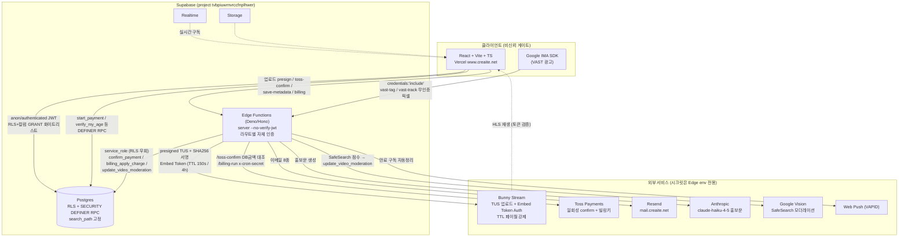
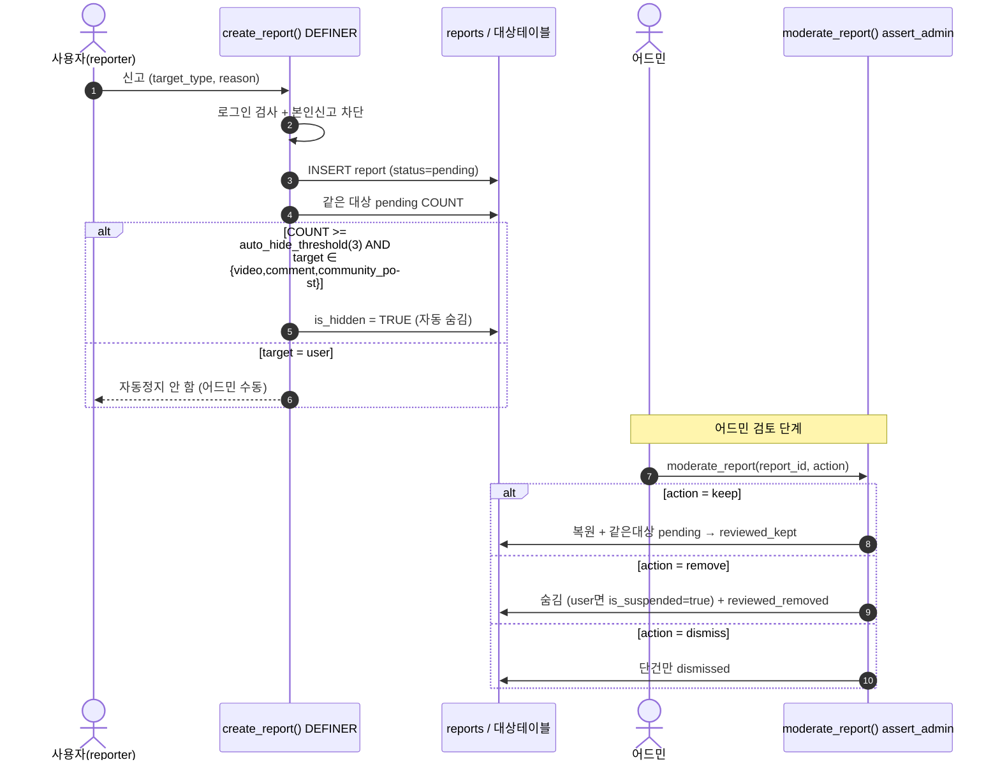
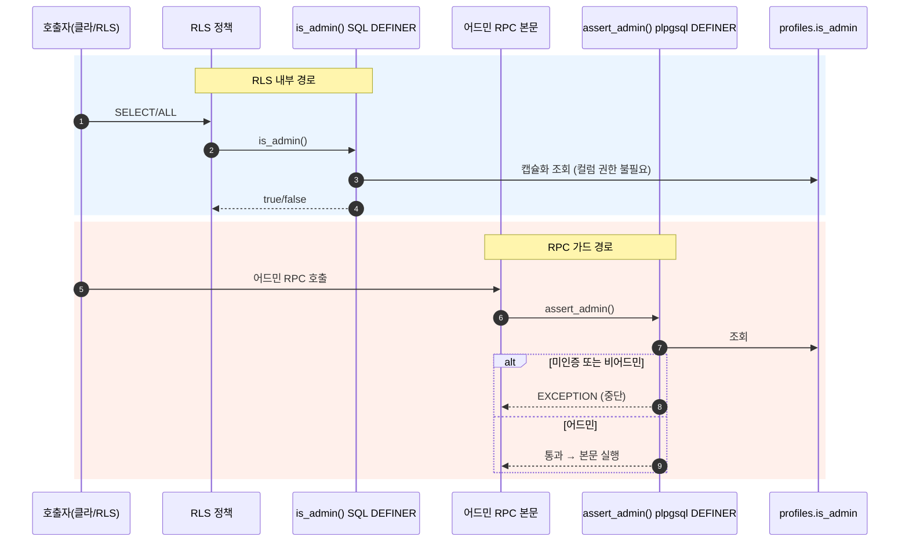
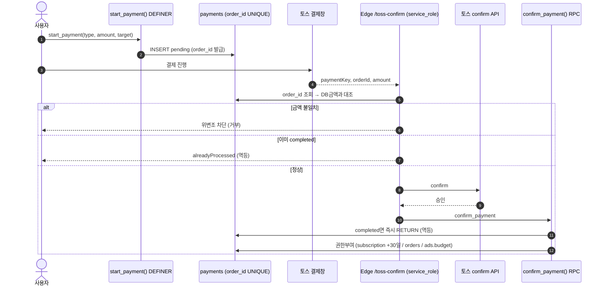
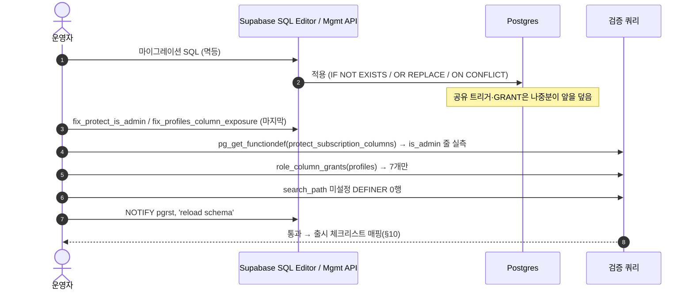
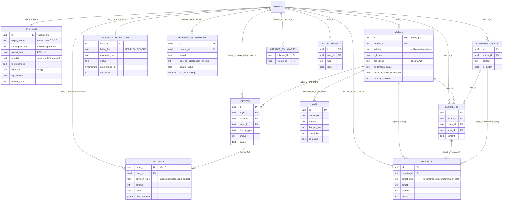

# 09. 콘텐츠정책 · 보안 · 데이터모델 · 기술 — 상세 명세

> 본 명세는 **추측 없이 실제 마이그레이션 SQL / Edge 코드를 읽고** 작성됨. 모든 근거는 `파일:줄` 로 표기.
> 마이그레이션은 마이그레이션 툴이 아니라 **Supabase SQL Editor / Management API 로 직접 적용**(전부 멱등). 색인: `docs/MIGRATIONS.md`.
> 검증 우선 원칙(`CLAUDE.md`): 외부에서 바뀔 수 있는 값(토스 정책·세율·요율 등)은 적용 시점에 재확인 필요.

---

## 1. 콘텐츠 정책 (연령등급·길이게이팅·자동모더레이션·신고→자동숨김→정지 머신)

### 1.1 영상 길이 게이팅 / 페이월 / 광고 (content_policy_v2)

`platform_settings` 키 6개로 어드민이 동적 조절. 기본값(`supabase/content_policy_v2.sql:25-32`):

| key | 기본값 | 의미 | 근거 |
|---|---|---|---|
| `min_upload_duration_seconds` | 30 | 업로드 최소 길이(미만 차단) | content_policy_v2.sql:26 |
| `cinema_min_duration_seconds` | 60 | 시네마 코너 노출 하한 | content_policy_v2.sql:27 |
| `ott_min_duration_seconds` | 600 | OTT 코너 노출 하한 | content_policy_v2.sql:28 |
| `cinema_preview_seconds` | 60 | 비구독자 상세 미리보기(초) | content_policy_v2.sql:29 |
| `min_duration_for_preroll_seconds` | 60 | pre-roll/overlay 광고 최소 영상길이 | content_policy_v2.sql:30 |
| `min_duration_for_midroll_seconds` | 600 | mid-roll 광고 최소 영상길이 | content_policy_v2.sql:31 |

- 자동 분류 트리거 `classify_video_placement()` (BEFORE INSERT/UPDATE): `show_on_home=true`(전체), `show_on_cinema = parsed>=60`, `show_on_ott = parsed>=600`. `duration` 문자열(`hh:mm:ss`/`mm:ss`/초)을 자동 파싱(`content_policy_v2.sql:38-87`). 광고 검수 대기 `ad_eligibility_at = created_at + 48h`(`content_policy_v2.sql:81-83`).
- 광고 매칭 `get_ad_for_video(p_video_id,p_format)` SECURITY DEFINER: **1분 미만 영상은 preroll/overlay/postroll/bumper 차단, 10분 미만은 midroll 차단**(`content_policy_v2.sql:143-151`). 임계값은 platform_settings 동적 조회.
- 재생 페이월은 DB가 아니라 **Bunny Embed Token TTL**로 강제: 비구독자 토큰 수명 150초(1분 미리보기 커버), 구독자/소유자/관리자/구매자 4시간(`functions/server/index.ts:307-353`, 특히 :345 `ttl = fullAccess ? 4*3600 : 150`).

### 1.2 연령 등급 19+ 게이트 (phase26_age_rating)

- `videos.age_rating` TEXT NOT NULL DEFAULT 'all', CHECK `('all','13','15','19')`(`phase26_age_rating.sql:18-30`). 부분 인덱스 `age_rating<>'all'`(:35-37).
- `profiles.birthdate / age_verified / age_verified_at` 추가(`phase26_age_rating.sql:42-47`).
- 본인 인증 RPC `verify_my_age(p_birthdate)` SECURITY DEFINER: 만 19세+ → `age_verified=true`, 미만 → false(`phase26_age_rating.sql:55-95`). **MVP는 생일 자가 입력**(:50 코멘트) — 실명/통신사 본인인증은 미구현(부채).
- 업로드 시 등급은 `update_my_video_metadata(...,p_age_rating)` 가 소유자 검증 후 반영(`phase26_age_rating.sql:104-149`), Edge `save-metadata` 도 `age_rating` 기본 'all' 강제(`functions/server/index.ts:663`).

### 1.3 자동 모더레이션 (phase25_moderation — Google Vision SafeSearch)

- `videos` 모더레이션 컬럼 5개: `moderation_status`(pending/passed/flagged/rejected), `moderation_score`(0-100), `moderation_categories`(JSONB), `moderation_checked_at`, `moderation_error`(`phase25_moderation.sql:18-38`). 검토 큐 부분 인덱스(:41-43).
- 점수→상태 규칙 `update_video_moderation()`(`phase25_moderation.sql:50-91`):

| 조건 | status | is_hidden |
|---|---|---|
| error 또는 score NULL | pending(재시도) | 유지 |
| score >= 90 | rejected | **TRUE(자동 숨김)** |
| score 70~90 | flagged(검토 대기) | 유지(사용자엔 보임) |
| score < 70 | passed | 유지 |

- **권한**: `update_video_moderation` 은 본문 권한검증이 없어 위변조 위험 → `authenticated` REVOKE, `service_role` 만 EXECUTE(`phase25_moderation.sql:93-94`, `phase_security_hardening_20260531.sql:48`). Edge가 service_role로 호출.
- 어드민 검토: `get_moderation_queue(status,limit)` / `resolve_moderation_flag(video_id,'pass'|'reject')` — 둘 다 `assert_admin()` 선행(`phase25_moderation.sql:124,163`). pass 시 `is_hidden=false` 복원 + `admin_logs` 감사(H4/M8, `phase_security_hardening_20260531.sql:96-105`).

### 1.4 신고 → 자동숨김 → 정지 스테이트머신 (phase10_reports)

- `reports` 테이블: target_type(video/comment/user/community_post), reason(spam/inappropriate/copyright/violence/harassment/misinformation/other), status(pending/reviewed_kept/reviewed_removed/dismissed)(`phase10_reports.sql:54-83`). **중복 신고 방지** unique index `(reporter_id,target_type,target_id)`(:86-88).
- 자동 숨김 임계값 `platform_settings.auto_hide_threshold=3`(`phase10_reports.sql:47-49`).
- `create_report()` SECURITY DEFINER: 로그인 필수, 본인 신고 차단, 신고 INSERT 후 같은 대상 pending 카운트 ≥ threshold 면 **video/comment/community_post 자동 숨김**(`phase10_reports.sql:155-171`). **user는 자동 정지 안 함**(오용 방지, 어드민 수동) — :170.
- `moderate_report(report_id, 'keep'|'remove'|'dismiss')`: keep=복원+같은대상 pending 일괄 reviewed_kept, remove=숨김(+user면 `is_suspended=true`)+reviewed_removed, dismiss=단건만 반려(`phase10_reports.sql:215-266`).
- 신고 RLS: 본인 신고 또는 어드민만 SELECT, INSERT/UPDATE는 DEFINER RPC만(`phase10_reports.sql:334-344`, 이후 `admin_rls_is_admin_function.sql:49-51`로 `is_admin()` 화).

### 1.5 정지 사용자 쓰기 차단 (block_suspended_writes)

- `is_suspended=true` 만으로는 로그인/쓰기를 못 막던 갭(Medium) → DB 레이어 차단(`block_suspended_writes_20260625.sql:1-12`).
- `is_self_suspended()`(DEFINER, is_suspended 컬럼 직접 조회) + `tg_block_suspended()` BEFORE INSERT/UPDATE 트리거를 comments/community_posts/collab_posts(작성·수정), creator_followers/post_likes/comment_likes/video_likes/reports(생성)에 부착(`block_suspended_writes_20260625.sql:16-69`).
- service_role(auth.uid()=NULL)은 미차단(시스템 정상 동작 보존). **영상 업로드는 Edge save-metadata(service_role)라 트리거 미적용 → create-upload Edge에서 별도 403**(`functions/server/index.ts:220-222`).

---

## 2. 보안 모델 (역할·인가 SSOT)

### 2.1 역할(role)별 권한 경계

| role | 부여 대상 | 권한 | 비고 |
|---|---|---|---|
| `anon` | 비로그인 PostgREST | RLS+컬럼 GRANT 화이트리스트 내 SELECT만 | profiles 민감컬럼 비노출 |
| `authenticated` | 로그인 JWT | 본인 행 + DEFINER RPC 경유 | 보호컬럼 직접 UPDATE 불가 |
| `service_role` | Edge Functions만 | **RLS 우회** + 결제/모더레이션/빌링 RPC | 키는 Edge 시크릿에만 |
| `postgres`/`supabase_admin` | SQL Editor/Dashboard | 전권 | 마이그레이션·어드민 승격 |

### 2.2 인가 SSOT = 서버(DB DEFINER + Edge)

클라이언트 게이트는 신뢰하지 않는다. 핵심 패턴:
- 어드민 판별 SSOT 2종:
  - `is_admin()` SQL DEFINER — RLS 정책 내부용. profiles 컬럼 권한 없이도 평가되도록 캡슐화(`admin_rls_is_admin_function.sql:21-27`). anon/authenticated EXECUTE.
  - `assert_admin()` plpgsql DEFINER — RPC 본문 가드용, 미인증/비어드민이면 예외(`phase10_6_admin_management.sql:18-34`).
- IDOR 방지: `get_my_revenue_history(p_creator_id)` 는 파라미터 무시·항상 `auth.uid()`(`phase_security_hardening_20260531.sql:50-77`).
- 결제 RPC 노출 축소: `confirm_payment` anon/authenticated REVOKE(Edge 전용), `fail_payment` 는 클라가 직접 호출하므로 본인 결제 또는 service_role 클레임만 처리(`security_patch_critical_20260614.sql:55-74`).

### 2.3 search_path 고정

모든 SECURITY DEFINER 함수에 `SET search_path = public(, pg_temp)` — search_path hijacking 차단. 일괄 보강 마이그레이션이 pg_proc 스캔 후 미설정 함수에 ALTER 적용(`security_definer_search_path_fix.sql:26-66`). 신규 DEFINER 함수 작성 시 반드시 SET 포함. 핵심 인가 함수 `assert_admin()` 도 2026-06-28 인라인 `SET search_path = public, pg_temp` 추가(일괄 ALTER 의존 제거, `phase10_6_admin_management.sql`).

---

## 3. RLS·권한 SSOT & 금지선

### 3.1 profiles 보호 트리거 — 8컬럼 SSOT (절대 누락 금지)

`protect_subscription_columns()` 는 여러 마이그레이션이 CREATE OR REPLACE로 덮는 **공유 트리거**(profiles BEFORE UPDATE, `profiles_table.sql:94-97`에서 연결). 일반 사용자(non service_role)면 OLD로 되돌리는 8컬럼(`fix_protect_is_admin_20260624.sql:18-32`):

| 그룹 | 컬럼 | 변경 허용 경로 |
|---|---|---|
| 구독 | subscription_tier, subscription_started_at, subscription_expires_at | 결제 웹훅/빌링/어드민 |
| 정산 | payout_info | 전용 RPC |
| **권한** | **is_admin** | **service_role/postgres만** |
| 레퍼럴 | referral_code, referred_by, referral_count | claim_referral RPC |

> **회귀 사건**: `referral_20260618.sql` 이 이 트리거를 덮으며 `is_admin` 줄을 누락 → 프로덕션에서 일반 사용자가 `UPDATE profiles SET is_admin=true WHERE id=auth.uid()` 로 권한 탈취 가능(치명). 2026-06-24 `fix_protect_is_admin_20260624.sql` 로 8컬럼 완전판 복구. (메모리: protect-trigger-shared-ssot)
> **🚫 금지선**: 이 트리거를 다시 덮는 마이그레이션은 위 8컬럼 전부 포함. 적용 후 `pg_get_functiondef('public.protect_subscription_columns()'::regprocedure)` 로 `is_admin` 줄 실측. 재구축 시 `fix_protect_is_admin_20260624.sql` 가 마지막에 적용되게.

### 3.2 profiles 컬럼 GRANT 화이트리스트 (PII 비노출 SSOT)

profiles RLS SELECT는 `USING(true)`(행 전체 공개)이나, **컬럼 수준 GRANT 화이트리스트**로 민감 컬럼을 막는다.
- 테이블 SELECT 회수 후 안전 7컬럼만 재부여: `id, display_name, avatar_url, banner_url, bio, subscription_tier, created_at`(`phase_security_hardening_20260531.sql:13-15`).
- 유출 사건 재발: 추가 PII 컬럼(birthdate/business_*/tax_*/referral_*/email/payout_info/is_admin/is_suspended/deletion_requested_at)이 다시 노출됨 → 2026-06-25 재회수 + 안전 7컬럼만 재GRANT(`fix_profiles_column_exposure_20260625.sql:21-33`). 방어적으로 민감 13컬럼 명시 REVOKE(:25-29).
- 본인 민감값은 DEFINER RPC로만: `get_my_profile()` / `get_my_payout_info()`(`phase_security_hardening_20260531.sql:18-39`).

> **🚫 금지선**: 누구든 `GRANT SELECT ON public.profiles TO anon/authenticated`(컬럼 미지정)을 실행하면 전 컬럼이 열려 전 사용자 PII 유출. 새 PII 컬럼은 GRANT 목록에 넣지 말 것. 검증: `SELECT column_name FROM information_schema.role_column_grants WHERE table_name='profiles' AND grantee IN ('anon','authenticated')` → 7개만. (메모리: profiles-column-grant-ssot)

### 3.3 videos SELECT RLS 좁히기

레거시 `USING(true)` 는 anon이 비공개/숨김/미검수 영상의 video_url·moderation_*·seed까지 직접 SELECT 가능했음 → 제한(`videos_select_rls_20260620.sql:24-32`):
`(visibility IN public,unlisted AND is_hidden=false) OR creator_id=auth.uid() OR is_admin()`. (컬럼 REVOKE는 미적용 — App/MyPage가 select("*") 사용. 공개영상 moderation_* 내부값 노출은 잔존 저위험, :18-20.)

---

## 4. 결제/정산 무결성

### 4.1 일회성 결제 (토스 confirm)

- 흐름: `start_payment(type,amount,target)` → pending payments 행 생성(`phase9_payments.sql:92-128`) → 토스 결제창 → Edge `/toss-confirm` 이 **DB 금액과 대조해 위변조 차단**(`functions/server/index.ts:1075-1078`) → 토스 confirm API → `confirm_payment` RPC.
- **멱등성**: payments.order_id UNIQUE(`phase9_payments.sql:25`). `confirm_payment` 는 이미 completed면 즉시 RETURN(`phase9_payments.sql:166-169`), Edge도 alreadyProcessed 반환(`functions/server/index.ts:1080-1082`).
- 권한 부여(`confirm_payment`, `phase9_payments.sql:191-221`): subscription→premium +30일, license→orders INSERT, ad_budget→ads.budget_krw 증액.

### 4.2 정기결제(빌링키) — service_role 격리

- `billing_subscriptions.billing_key`(카드 청구 토큰)는 **클라 노출 절대 금지**: RLS enable + 정책 0개 + 테이블 권한 REVOKE(`billing_subscriptions_20260612.sql:30-33`). 표시용은 `get_my_billing()`(billing_key 제외, :36-51).
- 청구 RPC `billing_apply_charge` / `billing_mark_failed` 는 service_role EXECUTE만(`billing_charge_rpcs_20260612.sql:68,94`). 멱등: 같은 order_id completed면 RETURN(:26-28) → 구독 이중 +30일 방지.
- 실패 3회 누적 시 auto_renew off + status='failed'(`billing_charge_rpcs_20260612.sql:77-83`).
- 스케줄러 `/billing-run` 은 `x-cron-secret`(BILLING_CRON_SECRET) 검증(`functions/server/index.ts:1254-1256`), `billing_claim_due` 가 `FOR UPDATE SKIP LOCKED` 로 원자적 claim(이중청구 방지, :1265-1267).

### 4.3 정산 계좌 / 원장 보존·익명화

- 정산 계좌 조회 `get_revenue_distributions_by_period` 는 `assert_admin()` 선행 + search_path 고정(SQL→plpgsql 전환, `security_patch_critical_20260614.sql:31-53`).
- **회계 원장 CASCADE 소실 차단**: 계정 삭제 시 payments.user_id / revenue_distributions.creator_id / orders.buyer_id FK를 `ON DELETE SET NULL` 로 변경(원장은 익명화 보존 — 전자상거래법 보존의무 + 정산 분쟁 근거, `security_patch_critical_20260614.sql:76-93`).

---

## 5. 데이터 모델 (주요 테이블 요약)

| 테이블 | 핵심 컬럼 | 관계 | RLS / 권한 한 줄 | 근거 |
|---|---|---|---|---|
| profiles | id(PK=auth.users), display_name, subscription_tier(free/basic/premium), payout_info, is_admin, is_suspended, birthdate, age_verified, referral_* | id→auth.users CASCADE | SELECT USING(true)이나 **컬럼 GRANT 7개 화이트리스트**; UPDATE 본인+보호 트리거 8컬럼 | profiles_table.sql:18-49, fix_profiles_column_exposure_20260625.sql:32 |
| videos | id(TEXT=Bunny guid), creator_id, visibility, is_hidden, age_rating, moderation_status, show_on_home/cinema/ott, duration_seconds | creator_id→auth.users | SELECT 공개/본인/관리자; INSERT/UPDATE 본인 | videos_select_rls_20260620.sql:27-32 |
| orders | buyer_id, seller_id(자동), video_id, license_type, amount, status | buyer/seller→auth.users SET NULL, video_id→videos CASCADE | SELECT 본인(buyer/seller); 쓰기 service_role | orders_table.sql:23-25,93-96 |
| payments | order_id(UNIQUE), user_id, payment_type(subscription/license/ad_budget), amount, status, raw_response | user_id→auth.users **SET NULL**(원장보존) | SELECT 본인; 쓰기 DEFINER RPC | phase9_payments.sql:21-58,266-269 |
| billing_subscriptions | user_id(PK), **billing_key(비밀)**, customer_key, status, next_charge_at, fail_count | user_id→auth.users CASCADE | RLS 정책 0개 + 테이블 REVOKE = 클라 접근 0 | billing_subscriptions_20260612.sql:8-33 |
| reports | reporter_id, target_type/id, reason, status | reporter→auth.users SET NULL | SELECT 본인 또는 admin; 쓰기 DEFINER | phase10_reports.sql:54-88,334-342 |
| revenue_distributions | creator_id, period, sale/ad/subscription_revenue, payout_status, tax_withholding | creator_id→auth.users **SET NULL** | SELECT 본인 또는 admin | admin_rls_is_admin_function.sql:54-56 |
| notification_preferences / notification_log | user_id, email_*/push_* 토글 / 발송기록 | user_id→auth.users | SELECT/UPDATE 본인; INSERT DEFINER | phase34_notifications.sql:43-84 |
| ads | id(uuid), advertiser, format, budget_krw, spent_krw, is_active, starts/ends_at | (광고주 self-service) | 활성광고 공개 SELECT, 관리 `is_admin()` ALL | ads_table.sql:40-61 |
| platform_settings | key, value, note | — | 어드민 RPC로 조절 | content_policy_v2.sql:25 |

신규 가입: `auth.users` INSERT 트리거 `handle_new_user`(profile 생성, `profiles_table.sql:102-123`) + `init_notification_preferences_on_signup`(알림 기본값, `phase34_notifications.sql:247-270`).

---

## 6. 기술 아키텍처

| 레이어 | 스택 | 메모 |
|---|---|---|
| 프론트 | React + Vite + TS, Vercel(`www.creaite.net`) | 타입체크 `npx tsc --noEmit`(커밋 전) |
| 백엔드 | Supabase Postgres(RLS+DEFINER RPC) + Edge Functions(Deno/Hono) | project_id `tvbpiuwmvrccfnplhwer`(config.toml:5) |
| 영상 | Bunny Stream(TUS 업로드 presigned, Embed Token Auth) | API Key 미노출, SHA256 서명 발급(index.ts:188-300) |
| 결제 | Toss Payments(일회성 confirm + 빌링키 정기) | Edge `/toss-confirm`, `/billing-run` |
| 메일/푸시 | Resend(mail.creaite.net) + Web Push(VAPID) | index.ts:11-68; FCM은 컬럼만(미연동) |
| AI | Anthropic(홍보문 생성, `claude-haiku-4-5`), Google Vision(모더레이션) | index.ts:463-495 |
| 앱 | Android TWA(PWABuilder, 개인 Play $25) | iOS 베타 후. docs/twa-build-guide.md |

- **Edge `server` 는 항상 `--no-verify-jwt` 배포**: VAST 픽셀(vast-tag/vast-track) 등 무인증 공개 엔드포인트가 있어 게이트웨이 JWT 검증을 끄고 라우트별 자체 인증(토큰/관리자/cron-secret) 수행(`config.toml:1-8`). **누락 시 공개 픽셀이 401.**
- **시크릿(Edge env)**: SUPABASE_SERVICE_ROLE_KEY, BUNNY_API_KEY / BUNNY_LIBRARY_ID / BUNNY_TOKEN_AUTH_KEY, TOSS_SECRET_KEY, ANTHROPIC_API_KEY, VAPID_PUBLIC/PRIVATE_KEY, BILLING_CRON_SECRET. 전부 서버 측에만 존재(클라 미전달).
- **CORS**: `origin: (o)=>o||'*'` echo + `credentials:true`(Google IMA SDK가 credentials:'include' 호출하므로 wildcard 불가) — `index.ts:85-95`. VAST 엔드포인트는 별도 `vastCorsHeaders`(정확 origin echo, `index.ts:825-834`).
- search_path: §2.3 참조(모든 DEFINER 함수 고정).

---

## 7. 비기능

- **재생 안정성**: Bunny HLS + 비구독자 미리보기는 짧은 TTL 토큰(URL 추출해도 장편 끝까지 불가, index.ts:308-310). BUNNY_TOKEN_AUTH_KEY 미설정 시 token=null로 무중단 전환(:317).
- **성능**: 어드민/집계 부분 인덱스(모더레이션 큐 phase25:41-43, 신고 큐 phase10_reports:91-97, 빌링 due billing_subscriptions:25-27), 결제 조회 인덱스(phase9_payments:60-67).
- **i18n/자막**: Bunny 내장 transcribe로 다국어 VTT 자동 생성(index.ts:502-579).
- **알림**: 이메일 8종 토글(welcome/receipt/new_video/comment_reply/follower/revenue/report/ad_budget) + 푸시 컬럼 선반영(phase34_notifications.sql:21-41). 만료 푸시 구독 자동 정리(index.ts:30-33,61-63).
- **반응형/SEO/접근성**: 프론트(React+Vite) 책임 — 본 명세 범위 밖(코드 미확인이므로 단정 보류).

---

## 8. 마이그레이션 운영

- 전부 **멱등**(IF NOT EXISTS / CREATE OR REPLACE / ON CONFLICT DO NOTHING / DO $$ 제약 가드). 재실행 안전.
- 적용: Supabase SQL Editor 또는 Management API(`MIGRATIONS.md:3`). 적용 검증: `supabase/_verify_migrations_applied.sql`.
- **적용 순서 주의**: 공유 트리거(`protect_subscription_columns`)·공유 GRANT(profiles 컬럼)는 **나중 적용분이 앞을 덮는다**. 재구축 시 `fix_protect_is_admin_20260624.sql`(8컬럼) / `fix_profiles_column_exposure_20260625.sql`(7컬럼)가 **마지막**에 오도록(§3 참조).
- 정본 이관 주의: `confirm_payment`/`admin_refund_payment`/`get_my_payments` 등은 옛 버전 재정의 시 회귀 → 정본은 `phase_user_payment_history.sql`(phase10_6_admin_management.sql:400-404, phase9_payments.sql:253-256). 신규 환경 셋업 시 함께 적용 필수.
- 스키마 변경 후 `NOTIFY pgrst, 'reload schema'`(예: billing_subscriptions_20260612.sql:67).

---

## 9. 알려진 보안 부채 / 이월

| 항목 | 내용 | 상태 / 근거 |
|---|---|---|
| 광고 노출/클릭 fraud | `increment_ad_impressions` dedup 키가 클라 생성 세션키(localStorage) → 키 회전으로 예산 소진/노출 부풀리기 가능 | 결제 라이브 전 Edge 기반 재설계 예정(자체광고 OFF·과금 전이라 실손해 0). ad-fraud-hardening-plan.md:6-9,17-24 |
| VAST 영상광고 과금 dedup 부재 | `track_video_ad_event` 에 dedup 없음 — exp 만료 전 동일 URL 반복 GET 시 매번 과금, viewer dedup 불가 | ad-fraud-hardening-plan.md:37; Edge 일괄 정리 시 처리 |
| 연령인증 자가입력 | birthdate 자가 입력만(실명/통신사 인증 없음) | phase26_age_rating.sql:50(MVP) |
| videos 컬럼 노출 잔존 | 공개영상의 moderation_*/seed 내부값이 직접 SELECT로 노출(저위험) | videos_select_rls_20260620.sql:18-20 |
| 전화번호/PII | profiles 화이트리스트로 차단되나 새 PII 컬럼 추가 시 재유출 위험 상존 | §3.2 금지선 준수 필요 |
| CORS echo | origin echo + credentials(IMA SDK 요구) — 광범위. 토큰 기반 인증으로 완화되나 origin 화이트리스트 강화 여지 | index.ts:85-95 |
| ads_table 레거시 정책 | `ads_table.sql:53-61` 의 profiles 직접참조 admin 정책은 깨졌었고 `admin_rls_is_admin_function.sql:29-33` 에서 `is_admin()` 로 교체됨 — 재적용 순서 주의 | admin_rls_is_admin_function.sql |

---

## 10. 출시 전 보안 체크리스트

- [ ] `protect_subscription_columns()` 본문에 **8컬럼 전부**(특히 `is_admin`) 존재 — `pg_get_functiondef` 실측(§3.1).
- [ ] profiles 컬럼 GRANT = 안전 7개만 — `role_column_grants` 쿼리로 확인(§3.2).
- [ ] videos SELECT RLS = 공개/본인/관리자 조건 적용(`videos_select_rls_20260620.sql`).
- [ ] 모든 SECURITY DEFINER 함수에 search_path 설정(`security_definer_search_path_fix.sql` 검증쿼리 0행).
- [ ] `confirm_payment` anon/authenticated REVOKE, `update_video_moderation` service_role 전용.
- [ ] billing_subscriptions 테이블 권한 REVOKE 확인(billing_key 노출 0).
- [ ] payments/revenue/orders FK = ON DELETE SET NULL(원장 보존).
- [ ] Edge `server` `--no-verify-jwt` 로 배포 + 시크릿 전체 설정(TOSS_SECRET_KEY, BUNNY_*, BILLING_CRON_SECRET, VAPID_*, ANTHROPIC_API_KEY).
- [ ] 정지 계정 쓰기 차단 트리거 8개 부착 확인(`block_suspended_writes_20260625.sql` 검증쿼리).
- [ ] **광고 결제 토스 라이브 전**: ad-fraud Edge 재설계 완료(§9 1·2행).
- [ ] 신규/재구축 적용 순서: fix_protect_is_admin / fix_profiles_column_exposure 가 마지막.

---

## 아키텍처 다이어그램

> 시스템 구성도 + 데이터 흐름. 인가 SSOT는 서버(DB DEFINER + Edge)이며 클라이언트 게이트는 비신뢰(§2.2). 모든 시크릿은 Edge env에만 존재(§6).



---

## 시퀀스 다이어그램

### (a) 신고 → 자동숨김 → 정지 스테이트머신 (§1.4)



### (b) 권한 판정 — assert_admin / is_admin (§2.2)



### (c) 결제 무결성 — 토스 일회성 confirm (§4.1)



### (d) 마이그레이션 적용 / 검증 (§8)



---

## 데이터 모델 ERD

> §5 테이블 요약 기반. PK/FK·ON DELETE 동작은 §5 표 및 근거 파일과 일치. (id→auth.users 관계는 외부 auth 스키마라 본 ERD에서 USERS 가상 엔티티로 표기.)



---

## 테스트 케이스 (보안·정책)

> Gherkin. 각 시나리오 끝의 `→ 체크리스트` 는 §10 출시 전 보안 체크리스트 항목 매핑. 회귀방지 시나리오는 §3 금지선(protect 8컬럼 / profiles GRANT) 직결.

```gherkin
Feature: RLS — 타인 데이터 차단

  Scenario: 비구독자 anon이 비공개/숨김 영상 직접 SELECT 차단 (§3.3)
    Given anon 역할로 PostgREST 접근
    When visibility='private' 또는 is_hidden=true 영상을 SELECT
    Then 행이 반환되지 않는다
    And 공개(public/unlisted, is_hidden=false) 또는 본인(creator_id=auth.uid) 또는 is_admin()만 보인다
    # → 체크리스트: videos SELECT RLS = 공개/본인/관리자

  Scenario: IDOR — 타인 정산내역 조회 차단 (§2.2)
    Given 사용자 A 로그인
    When get_my_revenue_history(p_creator_id=B의 id) 호출
    Then 파라미터 무시하고 항상 auth.uid()(=A) 기준만 반환
    # → 체크리스트: (IDOR 방지 DEFINER RPC)

  Scenario: billing_key 클라 노출 차단 (§4.2)
    Given authenticated 사용자
    When billing_subscriptions 테이블 직접 SELECT
    Then 정책 0개 + 테이블 REVOKE로 0행/거부
    And get_my_billing()은 billing_key 제외 컬럼만 반환
    # → 체크리스트: billing_subscriptions 테이블 권한 REVOKE 확인

Feature: 권한상승 차단 (회귀방지 — protect 8컬럼 SSOT §3.1)

  Scenario: 일반 사용자 self is_admin 승격 차단
    Given authenticated 사용자(비어드민)
    When UPDATE profiles SET is_admin=true WHERE id=auth.uid()
    Then protect_subscription_columns 트리거가 OLD 값으로 되돌림
    And is_admin은 false 유지
    # → 체크리스트: protect_subscription_columns 본문에 8컬럼 전부(특히 is_admin)

  Scenario: 보호 8컬럼 전체 되돌림
    Given authenticated 사용자
    When subscription_tier/subscription_*/payout_info/is_admin/referral_* 직접 UPDATE
    Then 8컬럼 모두 OLD로 복원 (service_role/지정 RPC 경로만 허용)
    # → 체크리스트: pg_get_functiondef로 8컬럼 실측

  Scenario Outline: 회귀 가드 — 트리거 재정의 후 is_admin 줄 존재
    Given <migration>이 protect_subscription_columns를 덮은 직후
    When pg_get_functiondef('public.protect_subscription_columns()'::regprocedure) 검사
    Then 본문에 is_admin 보호 줄이 존재해야 한다
    And fix_protect_is_admin_20260624.sql가 마지막에 적용되었다
    Examples:
      | migration |
      | referral_20260618.sql |
      | (임의의 공유 트리거 재정의 마이그레이션) |
    # → 체크리스트: 신규/재구축 적용 순서 = fix_protect_is_admin 마지막

Feature: profiles PII 비노출 (회귀방지 — GRANT 화이트리스트 §3.2)

  Scenario: 안전 7컬럼만 GRANT
    Given anon/authenticated 역할
    When role_column_grants에서 profiles GRANT 컬럼 조회
    Then 정확히 7개(id, display_name, avatar_url, banner_url, bio, subscription_tier, created_at)
    And birthdate/email/payout_info/is_admin/business_*/tax_*/referral_* 등 PII는 비노출
    # → 체크리스트: profiles 컬럼 GRANT = 안전 7개만

  Scenario: 금지선 — 테이블 전체 GRANT 금지
    Given 마이그레이션 작성자
    When GRANT SELECT ON public.profiles TO anon/authenticated (컬럼 미지정) 실행 시도
    Then 이는 전 컬럼 PII 유출이므로 금지선 위반
    And 본인 민감값은 get_my_profile()/get_my_payout_info() DEFINER RPC로만 접근
    # → 체크리스트: profiles 컬럼 GRANT = 안전 7개만 (전체 GRANT 금지)

Feature: 정지 사용자 쓰기 강제 차단 (§1.5)

  Scenario: 정지 계정 쓰기 트리거 차단
    Given profiles.is_suspended=true 사용자
    When comments/community_posts/collab_posts 작성·수정 또는
         creator_followers/post_likes/comment_likes/video_likes/reports 생성
    Then tg_block_suspended 트리거가 차단
    And service_role(auth.uid()=NULL)은 미차단(시스템 동작 보존)

  Scenario: 정지 계정 영상 업로드 차단 (트리거 미적용 경로 보강)
    Given is_suspended=true 사용자
    When create-upload Edge 호출
    Then Edge에서 403 반환 (save-metadata는 service_role라 트리거 우회되므로)
    # → 체크리스트: 정지 계정 쓰기 차단 트리거 8개 부착 확인

Feature: 연령 게이트 19+ (§1.2)

  Scenario: 미인증 사용자의 19+ 재생 차단
    Given age_verified=false 사용자
    When age_rating='19' 영상 접근
    Then 게이트로 차단 (verify_my_age로 만19세+ 인증 필요)

  Scenario: 생일 자가입력 인증
    Given 사용자가 verify_my_age(p_birthdate) 호출
    When 만 19세 이상
    Then age_verified=true, age_verified_at 기록
    But MVP는 자가입력만 — 실명/통신사 인증 미구현(부채 §9)

Feature: 신고 자동숨김 임계값 (§1.4)

  Scenario: 임계값 도달 시 자동 숨김
    Given 같은 video에 pending 신고 2건 존재 (threshold=3)
    When 서로 다른 사용자가 3번째 신고
    Then is_hidden=true로 자동 숨김
    And target_type=user는 자동정지하지 않음(어드민 수동)
    # → 체크리스트: 신고/모더레이션 정책 동작

Feature: 결제 멱등성 (§4.1, §4.2)

  Scenario: 동일 order_id 이중 confirm 방지
    Given payments.order_id UNIQUE
    And 해당 결제가 이미 completed
    When confirm_payment 재호출
    Then 즉시 RETURN (권한 이중부여 없음)
    And Edge는 alreadyProcessed 반환

  Scenario: 빌링 이중청구 방지
    Given billing_apply_charge가 같은 order_id로 재호출
    When 이미 completed
    Then RETURN (구독 이중 +30일 차단)
    And billing_claim_due가 FOR UPDATE SKIP LOCKED로 원자적 claim
    # → 체크리스트: payments/billing 멱등

Feature: 결제 위변조 차단 (§4.1)

  Scenario: 결제 금액 위변조 차단
    Given start_payment로 생성된 pending 금액
    When 토스 콜백 amount가 DB 금액과 불일치
    Then Edge /toss-confirm이 거부 (DB 대조)

Feature: update_video_moderation 위변조 차단 (§1.3)

  Scenario: 모더레이션 점수 직접 조작 차단
    Given authenticated 사용자
    When update_video_moderation 직접 호출 시도
    Then EXECUTE 권한 없음 (authenticated REVOKE, service_role 전용)
    # → 체크리스트: update_video_moderation service_role 전용

Feature: 회계 원장 보존 (§4.3)

  Scenario: 계정 삭제 시 원장 익명화 보존
    Given payments/orders/revenue_distributions에 사용자 FK 참조
    When 해당 계정 삭제
    Then FK ON DELETE SET NULL로 원장 행은 보존(익명화)
    And CASCADE로 소실되지 않음(전자상거래법 보존의무)
    # → 체크리스트: payments/revenue/orders FK = ON DELETE SET NULL
```
