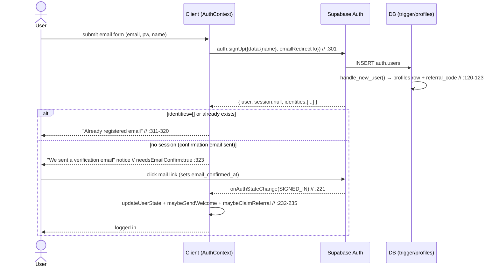
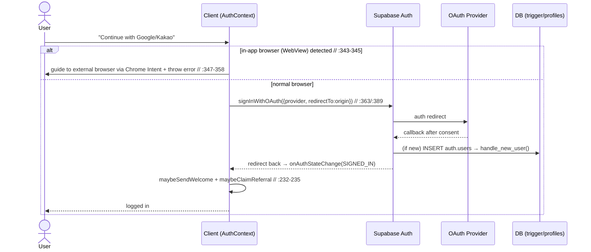
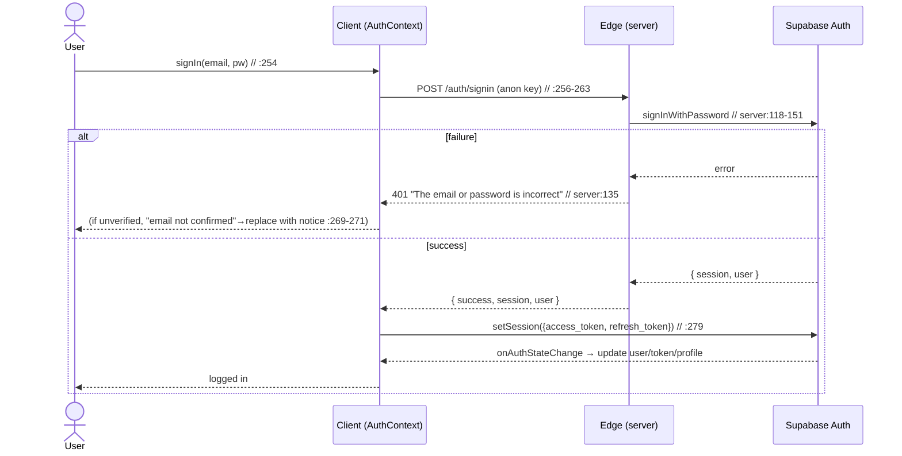
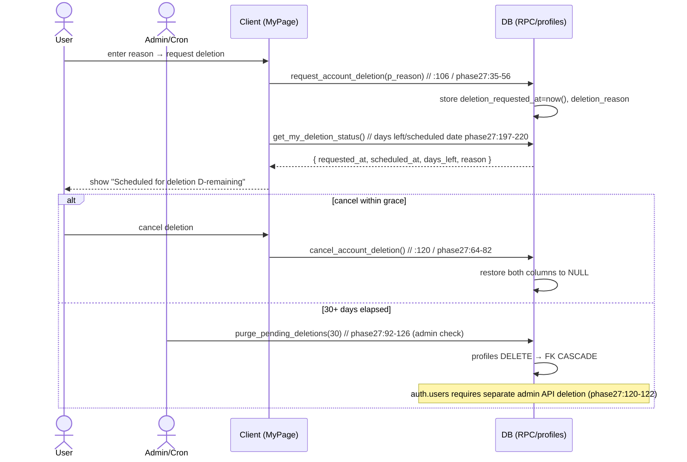
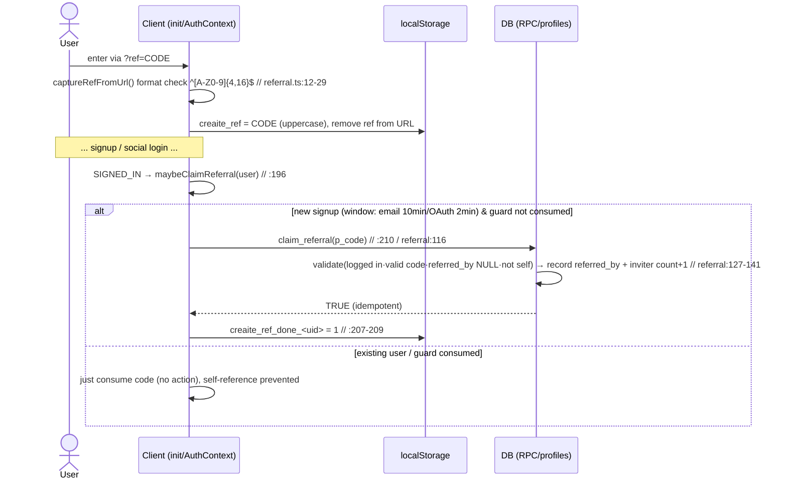

# 01. Authentication · Onboarding · Account/Data Rights — Detailed Specification

> This document is written **based on the actual implementation code** (no guesswork). Each item cites its `file:line` source.
> This is a security-audited area, so it describes behavior, contracts, and state in depth.
> Primary source files:
> - `src/app/contexts/AuthContext.tsx`
> - `src/app/components/AuthModal.tsx`, `PasswordResetScreen.tsx`, `ReferralCard.tsx`, `MyPage.tsx`, `AgeGateModal.tsx`
> - `src/app/utils/referral.ts`, `src/app/utils/sendNotification.ts`, `src/app/init.ts`, `src/app/App.tsx`
> - `supabase/functions/server/index.ts` (`/auth/*`)
> - `supabase/profiles_table.sql`, `supabase/referral_20260618.sql`, `supabase/phase27_user_data_rights.sql`, `supabase/phase26_age_rating.sql`, `supabase/phase_security_hardening_20260531.sql`, `supabase/fix_profiles_column_exposure_20260625.sql`

---

## 1. Overview / Purpose

CREAITE's authentication/account domain is built on **Supabase Auth (GoTrue)**. The client rarely uses its own backend signup endpoints; instead it **calls the Supabase SDK directly** (`supabase.auth.*`), and auth state is managed by `AuthProvider` (`src/app/contexts/AuthContext.tsx:57`) as a single source of truth (SSOT).

Core goals:

1. **Email-verification-required signup** (R2, 2026-06-11): Email/password signup can log in only after the confirmation email link is clicked. The verification-bypass route (Edge `admin.createUser(email_confirm:true)`) has been removed and is blocked with `410` (`supabase/functions/server/index.ts:110`).
2. **Social login**: Google·Kakao OAuth supported. Others (Facebook/Apple/X/LINE) exist as UI only and are not connected.
3. **Password reset** (H8): mail link → recovery session → dedicated full screen for setting a new password.
4. **Automatic profile creation**: on `auth.users` INSERT, a trigger (`handle_new_user`) creates a 1:1 row in `public.profiles` and also assigns an invite code.
5. **Privilege protection**: subscription tier, payout info, `is_admin`, and referral columns are blocked from direct user modification via DB triggers (privilege-escalation prevention SSOT).
6. **Account/Data rights** (Phase 27, Personal Information Protection Act / GDPR): JSON export of own data + 30-day grace-period account deletion.
7. **Referral (invite) growth engine**: capture `?ref=CODE` → connect only new signups via the `claim_referral` RPC, counting invites.
8. **Onboarding gate**: there is no separate signup wizard. The actual gate is **age verification (19+)**, which blocks viewing of 19+ content.

---

## 2. User Stories (As a / I want / so that)

**Non-member (visitor)**
- As a visitor, I want to browse the feed without signing up, so that I can confirm the service's value before joining. (Feed viewing requires no login)
- As a visitor (arriving from an invite link), I want the code to persist even when I enter via `?ref=CODE`, so that I'm connected to the inviter even after signing up post-OAuth redirect. (`referral.ts:12` `captureRefFromUrl`)

**New signup (email)**
- As a new signup, I want to receive a confirmation email when I sign up with email/password/name, so that I complete signup and log in by clicking the mail link. (`AuthContext.tsx:299` `signUp`)
- As a new signup, I want to resend the email if it doesn't arrive, so that I can finish signup even if it lands in spam. (`AuthContext.tsx:331` `resendConfirmEmail`)

**New signup (social)**
- As a Google/Kakao user, I want to sign up/log in with a single click, so that I can start without a password. (`AuthContext.tsx:340`, `:384`)
- As an in-app-browser (e.g., KakaoTalk) user, I want to be guided to an external browser when attempting Google login, so that I bypass WebView OAuth blocking. (`AuthContext.tsx:341-359`)

**Existing member**
- As a member, I want to log in with email/password, so that I can access my subscription, channel, and payouts. (`AuthContext.tsx:254` `signIn`)
- As a member who lost their password, I want to set a new password via a reset email, so that I recover my account. (`AuthContext.tsx:413` `requestPasswordReset`, `:420` `updatePassword`)

**Viewer (age gate)**
- As a member, I want to enter my birthdate to get verified as 19+, so that I can view 19+ content. (`AgeGateModal.tsx:45` → `verify_my_age`)

**Data subject (privacy rights)**
- As a member, I want to download all my data as JSON, so that I exercise my data portability right. (`MyPage.tsx:34` `export_my_data`)
- As a member, I want to request account deletion but be able to cancel within 30 days, so that I prevent accidental permanent deletion. (`MyPage.tsx:106`/`:120`)

**Inviter (creator growth)**
- As a creator, I want to copy/share my invite link and see my invite count, so that we become distributors together. (`ReferralCard.tsx:21` `get_my_referral`)

**Admin**
- As an admin/Cron, I want to bulk-permanently-delete accounts whose deletion request is 30 days past, so that I comply with the legal retention period. (`purge_pending_deletions`, `phase27_user_data_rights.sql:92`)

---

## 3. Screens & State

### 3-1. AuthModal (login/signup modal) — `src/app/components/AuthModal.tsx`
- **Entry condition**: clicking a login-required action or the header login button. `initialMode` specifies `"signin"|"signup"` (`:13,:16`).
- **Layout**: mobile is a bottom sheet (spring slide-up, `:113-117`), desktop is a center card (max 420px). Header (title/close/back), body, and a bottom mode-switch area.
- **State/branches**:
  - **Social list** (`showEmailForm=false`, `:198`): Email/Kakao/Google/Facebook/Apple/X/LINE buttons. **Only Kakao·Google are actually connected** (`:217`,`:229`). The other 4 are decorative with no handler.
  - **Email form** (`showEmailForm=true`, `:290`): for signup, adds a name field (`:298`); email/password (min 6 chars, `:336`). For signin, shows the "Find password" link (`:340`).
  - **Verification email sent notice** (`verifySentTo` set, `:147`): a received-mail notice + "Resend verification email" (`:182`) + "I've verified — log in" (`:189`, returns to signin form).
  - **Loading**: submit button spinner (`loading`, `:355-357`). Social buttons are also locked during loading (`:84`,`:96`).
  - **Errors**: shown via `toast.error` (`:76`,`:89`,`:99`). WebView error toast duration is 8s (`:89`).
  - **Success**: signin/immediate signup calls `onClose()` (`:63`,`:72`). Verification-required signup switches to the notice screen (does not close).
- **Transitions**: signin↔signup toggle (`:375`,`:385`) resets `showEmailForm=false`, starting again from the social list.

### 3-2. PasswordResetScreen (set new password) — `src/app/components/PasswordResetScreen.tsx`
- **Entry condition**: `PASSWORD_RECOVERY` event in `onAuthStateChange` → `passwordRecovery=true` (`AuthContext.tsx:227`) → `App.tsx:1384` renders it full screen (`z-[200]`).
- **Layout**: center card. New password + confirm input, change button, cancel.
- **State**: input (`canSubmit` = 6+ chars && match, `:22`), saving spinner (`:78`), done (check + "Get started", `:50-59`), error toast (`:33`).
- **Transitions**: on done/cancel, `clearPasswordRecovery()` closes the screen (`:56`,`:80`).

### 3-3. AgeGateModal (age verification) — `src/app/components/AgeGateModal.tsx`
- **Entry condition**: attempting to view 19+ content, etc. When unverified, a blur lock is shown on the card/feed (`DiscoveryFeed.tsx:357-359`, `video.ageGateLockTitle`).
- **Behavior**: enter birthdate → `verify_my_age(p_birthdate)` RPC (`:45`). If 19+, stores `age_verified=true`; if under, stores false (`phase26_age_rating.sql:79-92`).

### 3-4. Account/Data section in MyPage settings tab — `src/app/components/MyPage.tsx`
- **DataDownloadSection** (`:27`): download button. Loading (`downloading`)/success/failure toast. Receives a JSON Blob as `creaite-my-data-YYYY-MM-DD.json` (`:42`).
- **DangerZoneSection** (`:86`): on entry, queries `get_my_deletion_status` (`:96`).
  - **No deletion request**: danger-zone card + reason input + request button (2-step confirm).
  - **Pending-deletion state**: shows remaining days/scheduled date/reason + "Cancel deletion" button (`:132-154`).
  - **Loading**: renders `null` (`:129`).
- **ReferralCard** (`ReferralCard.tsx`): if no code (`!code`), hides the card entirely (`:31`). With a code, shows link copy/share + invite count.
- **Logout**: button inside settings (`MyPage.tsx:2087` `signOut()` + success toast).

---

## 4. Behavior Flows (step-by-step sequences)

### 4-1. Email signup (R2 — email verification required)
1. User submits the AuthModal email form → `signUp(email, password, name)` (`AuthContext.tsx:299`).
2. `supabase.auth.signUp({ email, password, options:{ data:{name}, emailRedirectTo: origin } })` (`:301-308`).
3. Error handling: `already registered/exists` → "Already registered email" (`:311-314`). **Re-signup of an email returns `identities: []` from Supabase instead of an error** → this is judged as a duplicate (`:318-320`).
4. Branch by session presence: **no session = confirmation email sent** → `{ needsEmailConfirm: true }` (`:323`). UI shows the "We sent a verification email" screen (`AuthModal.tsx:147`).
5. User clicks the mail link → `email_confirmed_at` is set → the SDK fires the `SIGNED_IN` event.
6. The listener reflects the session (`updateUserState`) + **welcome email** (`maybeSendWelcome`) + **referral connection** (`maybeClaimReferral`), running these only on SIGNED_IN (`:232-235`).
   - Backward compat: if the dashboard "Confirm email" is off, a session is created immediately on signup → `needsEmailConfirm:false` → immediate login (`:298`, `AuthModal.tsx:69-72`).

### 4-2. Login (email/password)
1. `signIn(email, password)` (`AuthContext.tsx:254`) → calls Edge `POST /auth/signin` (`serverUrl`, anon key) (`:256-263`).
2. Edge validates via `signInWithPassword`, returns session/user (`server/index.ts:118-151`). On failure, 401 "The email or password is incorrect." (`:135`).
3. The client syncs the response session tokens **into the SDK** via `supabase.auth.setSession()` (`:278-282`) → `onAuthStateChange` consistently updates user/token/profile.
4. On login attempt with an unverified account → if the error text matches `email not confirmed`, it is replaced with a friendly notice (`:269-271`).

### 4-3. Social login (Google / Kakao)
- **Google** (`:340`): detects WebView (KakaoTalk/Naver/FB/IG/Line/Twitter/Android wv) (`:343-345`) → on detection, guides to an external browser via Chrome Intent then throws an error (`:347-358`). Otherwise `signInWithOAuth({provider:'google', redirectTo:origin, queryParams:{access_type:'offline', prompt:'consent'}})` (`:363-372`).
- **Kakao** (`:384`): `signInWithOAuth({provider:'kakao', redirectTo:origin})` (`:389-394`).
- After redirect return, `SIGNED_IN` → same as steps 5-6 of 4-1 (welcome/referral).

### 4-4. Password reset (H8)
1. AuthModal signin form "Find password" → `requestPasswordReset(email)` (`AuthModal.tsx:48`, `AuthContext.tsx:413`) → `resetPasswordForEmail(email, {redirectTo: origin})`.
2. Mail link click → on app entry, `PASSWORD_RECOVERY` event → `passwordRecovery=true` (`:227`).
3. `PasswordResetScreen` shown → enter new password → `updatePassword(newPassword)` (`:420`) → `supabase.auth.updateUser({password})` then `passwordRecovery=false` (`:423`).

### 4-5. Account deletion (30-day grace)
1. In MyPage DangerZone, enter a reason → `request_account_deletion(p_reason)` RPC (`MyPage.tsx:106`).
2. The RPC stores `deletion_requested_at=now()`, `deletion_reason` (`phase27_user_data_rights.sql:35-56`).
3. UI shows remaining days (scheduled date = request+30 days) via `get_my_deletion_status` (`:197-220`).
4. Cancel within grace: `cancel_account_deletion` (`MyPage.tsx:120`) → restores both columns to NULL (`:64-82`).
5. Permanent deletion: admin/Cron calls `purge_pending_deletions(p_days=30)` (`:92`). DELETEs `profiles` rows that are 30+ days past → FK CASCADE cleans up related data. **`auth.users` requires a separate admin API deletion** (`:120-122` comment).

### 4-6. Data export
1. MyPage download button → `export_my_data` RPC (`MyPage.tsx:34`).
2. The RPC bundles, for the current user (`auth.uid()`), profile, uploaded videos, comments, likes, watch history, purchase/sale orders, playlists, following/followers, blocks, search history, payout records, reports, etc., into a single JSONB and returns it (`phase27_user_data_rights.sql:134-189`).
3. The client downloads it via Blob as `creaite-my-data-YYYY-MM-DD.json` (`MyPage.tsx:36-46`).

### 4-7. Referral connection
1. Visitor enters via `?ref=CODE` → `init.ts:14` runs `captureRefFromUrl()` first → after format validation (`^[A-Z0-9]{4,16}$`), stores it uppercased in `localStorage.creaite_ref` and removes only `ref` from the URL (`referral.ts:12-29`).
2. After signup, on `SIGNED_IN`, `maybeClaimReferral(user)` (`AuthContext.tsx:196`): **only for new signups** (per-provider created/confirmed window, email 10 min·OAuth 2 min, `:201-206`) + a `localStorage` guard (`creaite_ref_done_<uid>`, `:207-209`) calls `claim_referral(p_code)` exactly once (`:210`). For existing users, it just consumes the code (self-reference prevention).
3. `claim_referral` (`referral_20260618.sql:116`): guards — logged in / code valid / not already linked (`referred_by IS NULL`) / not self → records `referred_by` + inviter `referral_count+1`. Idempotent (`:127-141`).

---

## 5. Data / RPC / Edge Contracts

### 5-1. Edge Functions (`supabase/functions/server/index.ts`)
| Endpoint | Method | Args | Returns | Permission | Source |
|---|---|---|---|---|---|
| `/auth/signup` | POST | — | `410 {error, deprecated:true}` | Blocked (prevent auth bypass) | `:110-115` |
| `/auth/signin` | POST | `{email, password}` | `{success, session, user}` / `400` / `401` / `500` | anon key (Bearer publicAnonKey) | `:118-151` |
| `/auth/user` | GET | `Authorization: Bearer <accessToken>` | `{user:{id,email,name,created_at}}` / `401` | requires user token | `:154-182` |

> The Edge `server` function includes public endpoints, so it is **always deployed with `--no-verify-jwt`** (CLAUDE.md, `supabase/config.toml`).

### 5-2. Authentication (direct Supabase SDK calls, `AuthContext.tsx`)
| Action | SDK call | Source |
|---|---|---|
| Signup | `auth.signUp({email,password,options:{data:{name}, emailRedirectTo}})` | `:301` |
| Resend verification email | `auth.resend({type:'signup', email, options:{emailRedirectTo}})` | `:332` |
| Google OAuth | `auth.signInWithOAuth({provider:'google', ...})` | `:363` |
| Kakao OAuth | `auth.signInWithOAuth({provider:'kakao', ...})` | `:389` |
| Reset email | `auth.resetPasswordForEmail(email,{redirectTo})` | `:414` |
| Set new password | `auth.updateUser({password})` | `:421` |
| Session sync | `auth.setSession({access_token, refresh_token})` | `:279` |
| Session get/listener | `auth.getSession()`, `auth.onAuthStateChange(...)` | `:120`,`:221` |
| Logout | `auth.signOut()` (errors ignored) | `:94` |

### 5-3. RPC Contracts
| RPC | Args | Returns | Security | GRANT | Source |
|---|---|---|---|---|---|
| `get_my_profile()` | — | `public.profiles` (entire own row) | SECURITY DEFINER, STABLE | `authenticated` | `phase_security_hardening_20260531.sql:18-27` |
| `get_my_payout_info()` | — | `JSONB` (own payout_info) | SECURITY DEFINER, STABLE | `authenticated` | ibid:30-39 |
| `claim_referral(p_code TEXT)` | invite code | `BOOLEAN` (idempotent) | SECURITY DEFINER | REVOKE PUBLIC → `authenticated` | `referral_20260618.sql:116-146` |
| `get_my_referral()` | — | `JSON {code,count,referred}` | SECURITY DEFINER, STABLE | REVOKE PUBLIC → `authenticated` | ibid:151-163 |
| `gen_referral_code()` | — | `TEXT` (8 chars, ambiguous chars excluded) | SECURITY DEFINER, VOLATILE | (internal trigger/backfill use) | ibid:33-50 |
| `verify_my_age(p_birthdate DATE)` | birthdate | `TABLE(verified,age,message)` | SECURITY DEFINER | — | `phase26_age_rating.sql:55-95` |
| `request_account_deletion(p_reason TEXT=NULL)` | reason (optional) | `TIMESTAMPTZ` (request time) | SECURITY DEFINER | — | `phase27_user_data_rights.sql:35-56` |
| `cancel_account_deletion()` | — | `VOID` | SECURITY DEFINER | — | ibid:64-82 |
| `get_my_deletion_status()` | — | `TABLE(requested_at,scheduled_at,days_left,reason)` | SECURITY DEFINER, STABLE | — | ibid:197-220 |
| `export_my_data()` | — | `JSONB` (all own data) | SECURITY DEFINER, STABLE | — | ibid:134-189 |
| `purge_pending_deletions(p_days INT=30)` | days elapsed | `INTEGER` (deletion count) | SECURITY DEFINER, **admin check** | admin/Cron | ibid:92-126 |
| `is_subscriber(p_user_id UUID=auth.uid())` | user | `BOOLEAN` | STABLE | — | `profiles_table.sql:164-172` |

### 5-4. Triggers / Tables
- **`handle_new_user()`** (`AFTER INSERT ON auth.users`, trigger `on_auth_user_created`): INSERTs `profiles(id, display_name, avatar_url, referral_code)`. `display_name` is taken from meta `name`→`full_name`→email local part. `ON CONFLICT (id) DO NOTHING`. The invite code is assigned via `gen_referral_code()` (`referral_20260618.sql:67-84`, trigger definition `profiles_table.sql:120-123`).
- **`protect_subscription_columns()`** (`BEFORE UPDATE ON public.profiles`, trigger `profiles_protect_subscription`): for anyone other than postgres/supabase_admin/service_role (or jwt role=service_role), forces protected columns to their OLD values (`referral_20260618.sql:92-110`, trigger definition `profiles_table.sql:94-97`).
- **`set_updated_at()`**: sets `updated_at` to now() (`profiles_table.sql:60-71`).
- **RLS** (`profiles_table.sql:143-156`): SELECT `USING(true)` (public), UPDATE only own (`auth.uid()=id`). INSERT is handled by the (DEFINER) trigger so no policy is needed.
- **Column GRANT (key security)**: table-level SELECT on profiles is **revoked** from anon/authenticated; only 7 publicly safe columns are re-granted at column level (`id, display_name, avatar_url, banner_url, bio, subscription_tier, created_at`). Sensitive columns all go through DEFINER RPCs like `get_my_profile` (`fix_profiles_column_exposure_20260625.sql:21-33`, originally `phase_security_hardening_20260531.sql:13-15`).

---

## 6. Business Rules

1. **Email verification required**: email signup issues a session only after the confirmation mail link. Unverified login is blocked with a friendly notice (`AuthContext.tsx:269-271`). The auth-bypass Edge route is `410` (`server/index.ts:110`).
2. **Session SSOT**: all auth state is unified via the `onAuthStateChange` listener. `signIn` must also inject tokens into the SDK via `setSession` to stay consistent (`:278-282`).
3. **Metadata→privilege blocking (privilege-escalation prevention)**: protected columns that users cannot change directly = `subscription_tier`, `subscription_started_at`, `subscription_expires_at`, `payout_info`, **`is_admin`**, `referral_code`, `referred_by`, `referral_count` (`referral_20260618.sql:97-105`). A missing `is_admin` line was a past privilege-escalation regression, recovered by `fix_protect_is_admin_20260624.sql` (`:101` comment). → **These 8 columns must never be removed from the protection trigger** (MEMORY: protect-trigger-shared-ssot).
4. **Subscription active判定 (active determination)**: tier ≠ free AND (no expiry OR expiry in future) → `isSubscriber`; premium additionally requires tier==='premium' (`AuthContext.tsx:406-410`,`433-434`).
5. **30-day grace deletion**: permanent deletion is allowed only after 30 days pass from the request. Cancellable within grace. Only admin/Cron may purge (`phase27_user_data_rights.sql`).
6. **Age gate**: only 19+ can view 19+ content. The current MVP uses **self-entered birthdate** (not integrated with an identity-verification authority, `phase26_age_rating.sql:50` comment). Birthdate format validation (rejects future/pre-1900, `:73-75`). One's own videos are excluded from the gate (`DiscoveryFeed.tsx:358`).
7. **Referral self-reference/duplicate prevention**: only new signups link once; ignored if already linked or if it's one's own code. Code assignment/linking only via DEFINER functions (no direct user UPDATE).
8. **welcome/referral only on SIGNED_IN**: not sent/linked during initial session restore (`checkInitialSession`) or simple token refresh (`AuthContext.tsx:232`).
9. **Suspended users (`is_suspended`)**: displayed/managed in admin screens (`AdminUsers.tsx:148`, `AdminOverview.tsx:308`). `is_suspended` is a sensitive column that must not be publicly exposed (`fix_profiles_column_exposure_20260625.sql:8,26`).

---

## 7. Edge Cases & Error Handling

- **Duplicate signup**: both the error-message match (`already registered/exists`) and the `identities:[]` empty-array case are handled as "Already registered email" (`AuthContext.tsx:311-320`).
- **Unverified login**: on `email not confirmed` regex match, replaced with a notice (`:269-271`). Edge returns a generic 401 message (`server/index.ts:135`).
- **OAuth WebView**: detects KakaoTalk/Naver/FB/IG/Line/Twitter/Android wv → guides via Chrome Intent + throws an error (`:341-359`). Toast shown for 8 seconds (`AuthModal.tsx:89`).
- **getSession hang / WebView lock**: a 4-second fail-safe timer forces `loading=false` → prevents an infinitely stuck logo screen (`:109-114`).
- **Unmount guard**: a `mounted` flag prevents async setState; cleanup clears timers + unsubscribes the listener (`:104`,`:224`,`:247-251`). MyPage/ReferralCard also use an `alive` guard (`ReferralCard.tsx:18-28`).
- **Token expiry/re-auth**: on `setSession` failure, falls back to manual user/profile setting (`:283-289`).
- **profile not-yet-created timing**: trigger processing may lag right after signup → `fetchProfile` uses the `get_my_profile` RPC. Even if profile loading fails, user authentication is preserved (`:165-167`).
- **Referral guard-missing scenario**: no action if `getStoredRef` is empty; for existing users, only the code is consumed (`:198`,`:206-208`). `claim_referral` fails silently with RETURN FALSE (throws no exception).
- **Data download/deletion failures**: all wrapped in try/catch + toast user notification (`MyPage.tsx:48-50`,`:108-110`).
- **Migration not applied**: if the `get_my_referral` RPC is absent, code is empty and ReferralCard auto-hides (`ReferralCard.tsx:31`).

---

## 8. Permissions / Security

| Role | Allowed actions |
|---|---|
| anon (non-member) | SELECT the 7 safe public-profile columns, `/auth/signin` (anon key), start OAuth |
| authenticated (member) | own-profile RPCs (`get_my_profile`/`get_my_payout_info`), `claim_referral`/`get_my_referral`, age verification, data export/deletion-request/cancel, own-profile UPDATE (except protected columns) |
| service_role (Edge/webhook) | bypass RLS — UPDATE subscription/payout columns from payment webhooks, pass the protection trigger |
| admin (`is_admin=true`) | admin-only RPCs like `purge_pending_deletions`, user-suspension management |

**SSOT hard lines (must never violate)**:
- Removing the 8 columns of the protection trigger (especially `is_admin`) causes a privilege-escalation regression → forbidden.
- Re-granting table-level SELECT on `profiles` to anon/authenticated is forbidden (exposes all sensitive columns wholesale). Only the 7 public columns are granted at column level.
- Own sensitive values must always go through DEFINER RPCs (direct SELECT forbidden).
- Reviving the auth-bypass signup route (`admin.createUser(email_confirm:true)`) is forbidden.

---

## 9. Analytics / Events (tracking points)

- **welcome email**: `maybeSendWelcome` sends once on SIGNED_IN for new users (email = within 10 min of confirm, OAuth = within 2 min of creation). A `localStorage.creaite_welcome_<uid>` guard prevents duplicates (`AuthContext.tsx:174-193`). Sending uses `sendNotification({type:'welcome'})` (`sendNotification.ts:20-29`).
- **referral connection conversion**: on `claim_referral` success, the inviter's `referral_count` increases — an invite-conversion tracking metric (`referral_20260618.sql:140`). `get_my_referral` queries one's own invite count (ReferralCard count).
- **signup/login console logs**: many diagnostic `[AuthContext]` logs (initial session/event/state update, `:119`,`:222`,`:163`).
- **notification send logging**: Edge `/server/send-email` checks `should_send_notification`, then sends via Resend + records in `notification_log` (`sendNotification.ts:8-12`).
- **age verification timestamp**: records `age_verified_at` (`phase26_age_rating.sql:47,83`).

> Integration with a separate product analytics SDK (e.g., GA/Amplitude) is not found within this code's scope. Conversion tracking relies only on the above server-side state (referral_count, notification_log).

---

## 10. Acceptance Criteria (checklist)

- [ ] On email signup, a confirmation email is sent, and login is impossible before clicking the link (unverified login shows a notice message).
- [ ] Resend of the verification email works.
- [ ] Re-signup (already-registered email) shows "Already registered email" notice (both error and empty `identities` array cases).
- [ ] On successful Google/Kakao login, auto signup/login occurs; in-app-browser Google login guides to an external browser.
- [ ] Password reset: on mail-link entry, PasswordResetScreen appears; 6+ chars & match validation; change succeeds.
- [ ] On signup/first social login, the welcome email is sent exactly once (no duplicate on re-login).
- [ ] After arriving via `?ref=CODE`, on new signup, `referred_by` is linked + inviter count increases (no self-reference/duplicate).
- [ ] ReferralCard shows one's own code/link/invite count, copy/share works (hidden if no code).
- [ ] Age verification: 19+ unlocks 19+ content, under-19 is blocked, invalid birthdates rejected.
- [ ] Data export: downloads all own data as JSON.
- [ ] Account deletion request → 30-day countdown shown → cancellable within grace → permanent deletion via purge after 30+ days.
- [ ] When a regular user UPDATEs `subscription_tier`/`is_admin`/`payout_info`/`referral_*` directly via PostgREST, it is void (OLD preserved).
- [ ] anon/authenticated cannot SELECT sensitive columns (email/payout_info/birthdate/is_admin etc.) from profiles.
- [ ] Even on getSession delay / WebView lock, loading is released within 4 seconds (no infinite freeze).

---

## 11. Known Constraints / Carried Over

1. **4 social providers not connected**: Facebook/Apple/X/LINE buttons exist as UI only, with no handlers (`AuthModal.tsx:244-288`). Apple etc. planned to expand after iOS launch.
2. **Age verification is a self-entry MVP**: not integrated with an identity-verification authority (carrier/i-PIN) → reliability limitation (`phase26_age_rating.sql:50`).
3. **auth.users handling for permanent deletion is separate**: `purge_pending_deletions` only DELETEs `profiles`. `auth.users` requires the Edge to call `auth.admin.deleteUser` separately via an admin client (`phase27_user_data_rights.sql:120-122`). Whether the automatic Cron + Edge connection exists is outside this code's scope.
4. **Referral reward is non-cash**: currently exposure/badge first; cash settlement is a separate settlement based on `referral_count` after Toss payment opens (`ReferralCard.tsx:91-94`, `referral_20260618.sql:7-8`).
5. **welcome/referral depend on time windows**: new-user判定 (determination) depends on a clock (created/confirmed timestamp) window → if mail verification is delayed more than 10 min, welcome may not be sent (`AuthContext.tsx:180-183`).
6. **No separate onboarding wizard**: a post-signup profile setup/tutorial flow is unimplemented; the age gate is the only actual gate.
7. **Product analytics event tracking not integrated**: conversion measurement relies only on server state (referral_count/notification_log); there is no client analytics SDK.

---

## 12. Wireframes (text mockups)

> The ASCII mockups below directly transcribe the actual component structure/branches described in §3 (Screens & State). They express **per-state components and branches**, not coordinates/pixels.

### 12-1. AuthModal — social list (`showEmailForm=false`)
Mobile is a bottom sheet (slide-up), desktop is a center card (max 420px). (`AuthModal.tsx:113-117`,`:198`)

```
┌─────────────────────────────────────┐
│  Log in / Sign up             [ X ]  │  ← header (title/close) :13,:16
├─────────────────────────────────────┤
│                                     │
│   ┌───────────────────────────────┐ │
│   │  ✉  Continue with email        │ │ → showEmailForm=true
│   └───────────────────────────────┘ │
│   ┌───────────────────────────────┐ │
│   │  💬  Continue with Kakao (live) │ │ :217  signInWithKakao
│   └───────────────────────────────┘ │
│   ┌───────────────────────────────┐ │
│   │  G  Continue with Google (live) │ │ :229  signInWithGoogle
│   └───────────────────────────────┘ │
│   ┌───────────────────────────────┐ │
│   │  f  Facebook  (decor·no handler)│ │ :244-288 not connected
│   │    Apple / X / LINE  (decor)    │ │
│   └───────────────────────────────┘ │
│                                     │
├─────────────────────────────────────┤
│  Don't have an account?  Sign up ▸   │  ← mode toggle :375,:385
└─────────────────────────────────────┘
   (buttons lock during social/submit loading :84,:96)
```

### 12-2. AuthModal — email form (`showEmailForm=true`)
For signup, adds a name field; password min 6 chars. (`AuthModal.tsx:290`,`:298`,`:336`)

```
┌─────────────────────────────────────┐
│  [◂ Back]   Sign up           [ X ]  │
├─────────────────────────────────────┤
│  Name            [______________]   │  ← signup only :298
│  Email           [______________]   │
│  Password        [______________]   │  ← min 6 chars :336
│                                     │
│   ┌───────────────────────────────┐ │
│   │        Sign up  ( ⟳ )          │ │  ← submit spinner :355-357
│   └───────────────────────────────┘ │
│                                     │
│  (signin mode only)                 │
│     Forgot your password? ▸         │  ← :340 requestPasswordReset
└─────────────────────────────────────┘
   errors via toast.error :76,:89,:99
```

### 12-3. AuthModal — verification email sent notice (`verifySentTo` is set)
Right after email signup (R2), the modal does not close but switches to the notice screen. (`AuthModal.tsx:147`)

```
┌─────────────────────────────────────┐
│            ✉  Check your email       │
├─────────────────────────────────────┤
│  We sent a verification email to     │
│  user@example.com.                   │
│  Click the link to finish signup!    │
│                                     │
│   [ Resend verification email ]      │  ← :182 resendConfirmEmail
│   [ I've verified — log in ]         │  ← :189 return to signin form
└─────────────────────────────────────┘
```

### 12-4. PasswordResetScreen (set new password — full screen `z-[200]`)
On `PASSWORD_RECOVERY` event, App renders it full screen. (`App.tsx:1384`, `PasswordResetScreen.tsx`)

```
┌───────────────────────────────────────────┐
│                                           │
│        🔒  Set new password               │
│                                           │
│   New password    [__________________]   │
│   Confirm pwd     [__________________]   │
│                                           │
│   ┌─────────────────────────────────────┐ │
│   │        Change  ( ⟳ saving )          │ │  ← canSubmit=6+&match :22 / :78
│   └─────────────────────────────────────┘ │
│        Cancel                             │  ← clearPasswordRecovery :80
│                                           │
│   ── on done ──────────────────────────   │
│        ✔  Changed  [ Get started ]        │  ← :50-59 / clear :56
└───────────────────────────────────────────┘
```

### 12-5. MyPage — data export (DataDownloadSection `MyPage.tsx:27`)

```
┌─────────────────────────────────────┐
│  Export my data                      │
│  Download all my data as JSON.       │
│   ┌───────────────────────────────┐ │
│   │   ⬇  Download  ( ⟳ generating ) │ │  ← downloading :42
│   └───────────────────────────────┘ │
│  → creaite-my-data-YYYY-MM-DD.json  │  ← Blob save :42
└─────────────────────────────────────┘
```

### 12-6. MyPage — account deletion (DangerZoneSection `MyPage.tsx:86`)
On entry, queries `get_my_deletion_status` then branches by state. (`:96`)

```
── No deletion request ──────────────────
┌─────────────────────────────────────┐
│  ⚠ Danger zone — Delete account     │
│  Reason (optional) [______________]  │
│   [ Request account deletion ]       │  ← :106 request_account_deletion
│   (2-step confirm)                   │
└─────────────────────────────────────┘

── Pending-deletion state ───────────────
┌─────────────────────────────────────┐
│  ⏳ Scheduled for deletion           │
│  Days left: 23                       │  ← days_left
│  Scheduled: 2026-07-21 (req+30 days) │  ← scheduled_at
│  Reason: "..."                       │  ← reason
│   [ Cancel deletion ]                │  ← :120 cancel_account_deletion
└─────────────────────────────────────┘
(renders null while loading :129)
```

### 12-7. AgeGateModal (age verification)
On attempting to view 19+ content. If unverified, a blur lock appears on card/feed. (`AgeGateModal.tsx`, `DiscoveryFeed.tsx:357-359`)

```
── Unverified lock (feed card) ───────────
┌─────────────────────────────────────┐
│ ▓▓▓▓▓▓ (blur) ▓▓▓▓▓▓                │
│   🔞  Adult verification required    │  ← video.ageGateLockTitle
│        [ Verify age ]                │
└─────────────────────────────────────┘

── AgeGateModal ─────────────────────────
┌─────────────────────────────────────┐
│  Adult verification           [ X ]  │
│  Enter your birthdate.               │
│   Birthdate  [ YYYY ][ MM ][ DD ]   │
│   [ Verify ]                         │  ← :45 verify_my_age(p_birthdate)
│  (19+ → stores age_verified=true)    │  ← phase26:79-92
└─────────────────────────────────────┘
```

---

## 13. Sequence Diagrams

> Participants: **User** (person), **Client** (`AuthContext`/components), **SbAuth** (Supabase Auth/GoTrue), **Edge** (`functions/server`), **DB** (Postgres: profiles·triggers·RPCs). Based on the actual flows in §4.

### 13-1. Email signup + verification (R2 — verification required, §4-1)



### 13-2. Social OAuth (Google/Kakao, §4-3)



### 13-3. Login (email/password, §4-2)



### 13-4. Account deletion → 30-day grace → purge (§4-5)



### 13-5. Referral claim (§4-7)



---

## 14. API / RPC / Edge Reference

> A quick reference consolidating §5's contracts into single tables. file:line is the definition location.

### 14-1. Edge endpoints (`supabase/functions/server/index.ts`)
| Name | Args | Returns | Permission | file:line |
|---|---|---|---|---|
| `POST /auth/signup` | — | `410 {error, deprecated:true}` | Blocked (prevent auth bypass) | `server/index.ts:110-115` |
| `POST /auth/signin` | `{email, password}` | `{success, session, user}` / 400 / 401 / 500 | anon key (Bearer publicAnonKey) | `server/index.ts:118-151` |
| `GET /auth/user` | header `Authorization: Bearer <accessToken>` | `{user:{id,email,name,created_at}}` / 401 | user access token | `server/index.ts:154-182` |

### 14-2. Supabase Auth SDK calls (`src/app/contexts/AuthContext.tsx`)
| Name | Args | Returns | Permission | file:line |
|---|---|---|---|---|
| `auth.signUp` | `{email, password, options:{data:{name}, emailRedirectTo}}` | `{user, session}` (R2: session=null) | public | `AuthContext.tsx:301` |
| `auth.resend` | `{type:'signup', email, options:{emailRedirectTo}}` | `{}` / error | public | `AuthContext.tsx:332` |
| `auth.signInWithOAuth` (Google) | `{provider:'google', redirectTo, queryParams:{access_type:'offline', prompt:'consent'}}` | redirect | public | `AuthContext.tsx:363` |
| `auth.signInWithOAuth` (Kakao) | `{provider:'kakao', redirectTo}` | redirect | public | `AuthContext.tsx:389` |
| `auth.resetPasswordForEmail` | `(email, {redirectTo})` | `{}` / error | public | `AuthContext.tsx:414` |
| `auth.updateUser` | `{password}` | `{user}` | recovery session | `AuthContext.tsx:421` |
| `auth.setSession` | `{access_token, refresh_token}` | `{session, user}` | token holder | `AuthContext.tsx:279` |
| `auth.getSession` / `auth.onAuthStateChange` | — / `(event, session)=>` | session / subscription | public | `AuthContext.tsx:120`,`:221` |
| `auth.signOut` | — | `{}` (errors ignored) | authenticated | `AuthContext.tsx:94` |

### 14-3. RPC (DB functions)
| Name | Args | Returns | Permission / Security | file:line |
|---|---|---|---|---|
| `get_my_profile()` | — | `public.profiles` (own row) | `authenticated`, DEFINER STABLE | `phase_security_hardening_20260531.sql:18-27` |
| `get_my_payout_info()` | — | `JSONB` (own payout_info) | `authenticated`, DEFINER STABLE | `phase_security_hardening_20260531.sql:30-39` |
| `claim_referral(p_code TEXT)` | invite code | `BOOLEAN` (idempotent) | REVOKE PUBLIC → `authenticated`, DEFINER | `referral_20260618.sql:116-146` |
| `get_my_referral()` | — | `JSON {code,count,referred}` | REVOKE PUBLIC → `authenticated`, DEFINER STABLE | `referral_20260618.sql:151-163` |
| `gen_referral_code()` | — | `TEXT` (8 chars, ambiguous excluded) | internal trigger/backfill, DEFINER VOLATILE | `referral_20260618.sql:33-50` |
| `verify_my_age(p_birthdate DATE)` | birthdate | `TABLE(verified, age, message)` | authenticated, DEFINER | `phase26_age_rating.sql:55-95` |
| `request_account_deletion(p_reason TEXT=NULL)` | reason (optional) | `TIMESTAMPTZ` (request time) | authenticated, DEFINER | `phase27_user_data_rights.sql:35-56` |
| `cancel_account_deletion()` | — | `VOID` | authenticated, DEFINER | `phase27_user_data_rights.sql:64-82` |
| `get_my_deletion_status()` | — | `TABLE(requested_at, scheduled_at, days_left, reason)` | authenticated, DEFINER STABLE | `phase27_user_data_rights.sql:197-220` |
| `export_my_data()` | — | `JSONB` (all own data) | authenticated, DEFINER STABLE | `phase27_user_data_rights.sql:134-189` |
| `purge_pending_deletions(p_days INT=30)` | days elapsed | `INTEGER` (deletion count) | admin/Cron, DEFINER + admin check | `phase27_user_data_rights.sql:92-126` |
| `is_subscriber(p_user_id UUID=auth.uid())` | user | `BOOLEAN` | STABLE | `profiles_table.sql:164-172` |

### 14-4. Triggers (DB)
| Name | Timing/Target | Behavior | file:line |
|---|---|---|---|
| `handle_new_user()` (`on_auth_user_created`) | AFTER INSERT ON auth.users | create profiles row + referral_code, ON CONFLICT DO NOTHING | `referral_20260618.sql:67-84`, `profiles_table.sql:120-123` |
| `protect_subscription_columns()` (`profiles_protect_subscription`) | BEFORE UPDATE ON profiles | force 8 protected columns to OLD values (except service role) | `referral_20260618.sql:92-110`, `profiles_table.sql:94-97` |
| `set_updated_at()` | BEFORE UPDATE | `updated_at=now()` | `profiles_table.sql:60-71` |

---

## 15. Test Cases (Gherkin)

> Given/When/Then scenarios. Happy path + edge cases. Each scenario ends with a §10 acceptance-criteria mapping marked as `[AC: ...]`.

### 15-1. Email signup / verification

```gherkin
Feature: Email-verification-required signup (R2)

  Scenario: Happy — log in after signup via email verification
    Given I open the AuthModal email form with an unregistered email
    When I enter name, email, and a 6+ char password and submit
    Then the "We sent a verification email" notice screen appears (needsEmailConfirm:true)
    And before clicking the mail link there is no session, so I'm not logged in
    When I click the link in the email
    Then I'm logged in via the SIGNED_IN event and the welcome email is sent once
    # [AC: email signup — no login before confirm/link, welcome once]

  Scenario: Edge — duplicate signup (already registered email)
    Given I enter an already-registered email
    When I submit signup
    Then the "Already registered email" notice is shown (both error message and identities:[])
    # [AC: re-signup shows "Already registered email"]

  Scenario: Edge — resend verification email
    Given I'm on the "We sent a verification email" notice screen
    When I press "Resend verification email"
    Then auth.resend(type:'signup') is called and the email is sent again
    # [AC: resend verification email works]

  Scenario: Backward compat — dashboard Confirm email is off
    Given "Confirm email" is disabled in the Supabase dashboard
    When I submit an email signup
    Then a session is created immediately (needsEmailConfirm:false) and I'm logged in directly
```

### 15-2. Login

```gherkin
Feature: Email/password login

  Scenario: Happy — correct credentials
    Given a verified account exists
    When I signIn with the correct email/password
    Then Edge POST /auth/signin returns 200
    And the session tokens are synced into the SDK via setSession and I'm logged in

  Scenario: Edge — login attempt with unverified account
    Given an account that has not completed email verification exists
    When I attempt to log in with that account
    Then Edge returns 401
    And on "email not confirmed" match it is replaced with a friendly verification notice
    # [AC: unverified login shows notice message]

  Scenario: Edge — wrong password
    Given an existing account
    When I log in with the wrong password
    Then 401 "The email or password is incorrect" is shown

  Scenario: Edge — getSession hang / WebView lock
    Given an environment where getSession does not respond (WebView lock)
    When I load the app
    Then the 4-second fail-safe timer sets loading=false so there is no infinite freeze
    # [AC: loading released within 4s even on getSession delay]
```

### 15-3. Social OAuth

```gherkin
Feature: Google / Kakao OAuth

  Scenario: Happy — Google login in a normal browser
    Given I open the AuthModal in a normal browser
    When I press "Continue with Google"
    Then I'm redirected via signInWithOAuth(google) and on return I'm auto signed-up/logged-in
    # [AC: on Google/Kakao success, auto signup/login]

  Scenario: Edge — Google login in an in-app browser (KakaoTalk etc.)
    Given I accessed via the KakaoTalk in-app browser (WebView)
    When I press "Continue with Google"
    Then the WebView is detected, I'm guided to an external browser via Chrome Intent then an error is thrown
    And a notice toast is shown for 8 seconds
    # [AC: in-app-browser Google login guides to external browser]
```

### 15-4. Password reset

```gherkin
Feature: Password reset (H8)

  Scenario: Happy — set new password via reset email
    Given I requested a reset email via "Find password" on the signin form
    When I enter the app via the mail link
    Then the PASSWORD_RECOVERY event shows PasswordResetScreen full screen
    When I enter a new password that is 6+ chars and matches, and change it
    Then after updateUser({password}) succeeds the screen closes and I'm logged in
    # [AC: reset-mail-link entry · 6+&match validation · change succeeds]

  Scenario: Edge — password mismatch/too short
    Given PasswordResetScreen is open
    When the two inputs differ or are under 6 chars
    Then canSubmit=false disables the change button
```

### 15-5. Referral

```gherkin
Feature: Referral (invite) connection

  Scenario: Happy — new signup after arriving via ?ref=CODE
    Given I entered via ?ref=ABCD1234 and the code was stored in localStorage
    When I complete a new signup (within window: email 10min/OAuth 2min)
    Then claim_referral links referred_by and the inviter's referral_count increases by 1
    # [AC: on new signup, referred_by linked + inviter count increases]

  Scenario: Edge — self-reference prevention
    Given my own invite code is in localStorage
    When I log in with my own account
    Then claim_referral rejects self-reference and only consumes the code (count not increased)
    # [AC: no self-reference/duplicate]

  Scenario: Edge — existing user re-login
    Given an existing user whose referred_by is already filled
    When I re-login
    Then claim_referral idempotently returns FALSE and there is no duplicate connection

  Scenario: Edge — migration not applied
    Given the get_my_referral RPC is not deployed
    When I open MyPage
    Then code is empty and ReferralCard auto-hides
    # [AC: ReferralCard hidden if no code]
```

### 15-6. Age verification

```gherkin
Feature: Age gate (19+)

  Scenario: Happy — unlock 19+ content via adult verification
    Given 19+ content is locked behind a blur lock
    When I enter a birthdate that is 19 or older in AgeGateModal
    Then verify_my_age records verified=true, age_verified_at, and the content unlocks
    # [AC: 19+ unlocks]

  Scenario: Edge — minor blocked
    Given I enter a birthdate under 19
    When I verify
    Then age_verified=false is stored and 19+ content remains blocked
    # [AC: under-19 is blocked]

  Scenario: Edge — invalid birthdate
    Given I enter a future date or a date before 1900
    When I verify
    Then it is rejected by birthdate format validation
    # [AC: invalid birthdates rejected]
```

### 15-7. Data rights (export / deletion)

```gherkin
Feature: Data export and account deletion

  Scenario: Happy — data export
    Given I'm a logged-in member
    When I press data download in MyPage
    Then export_my_data returns all my data as JSONB
    And it is downloaded as creaite-my-data-YYYY-MM-DD.json
    # [AC: download all own data as JSON]

  Scenario: Happy — account deletion request and 30-day grace
    Given I'm a logged-in member
    When I enter a reason and request account deletion with 2-step confirm
    Then deletion_requested_at is recorded and a D-30 countdown is shown
    # [AC: 30-day countdown shown]

  Scenario: Edge — cancel deletion within grace
    Given a pending-deletion state (D-23)
    When I press "Cancel deletion"
    Then cancel_account_deletion restores both columns to NULL and the deletion is withdrawn
    # [AC: cancellable within grace]

  Scenario: Edge — purge after 30 days elapse
    Given a row whose deletion request is 30 days past
    When admin/Cron calls purge_pending_deletions(30)
    Then that profiles row is DELETEd and related data is cleaned via FK CASCADE
    And auth.users must be deleted via a separate admin API
    # [AC: permanent deletion via purge after 30+ days]
```

### 15-8. Permissions / Security (privilege-escalation blocking)

```gherkin
Feature: Protected/sensitive column blocking

  Scenario: Edge — regular user directly UPDATEs protected columns
    Given a regular authenticated user
    When I directly UPDATE subscription_tier/is_admin/payout_info/referral_* via PostgREST
    Then the protect_subscription_columns trigger forces OLD values and the change is voided
    # [AC: direct UPDATE of protected columns is void]

  Scenario: Edge — directly SELECT sensitive columns
    Given an anon or authenticated user
    When I SELECT email/payout_info/birthdate/is_admin etc. from profiles
    Then access is blocked by column GRANT revocation (only the 7 safe public columns allowed)
    # [AC: cannot SELECT sensitive columns]

  Scenario: Edge — suspended user (is_suspended) handling
    Given an account that an admin set is_suspended=true on
    When I view the user in the admin screen
    Then the is_suspended state is shown only to admins (sensitive column not publicly exposed) and managed

  Scenario: Edge — auth-bypass signup route blocked
    Given a past auth-bypass Edge signup route existed (admin.createUser email_confirm:true)
    When POST /auth/signup is called
    Then it is blocked with 410 {deprecated:true}
```
