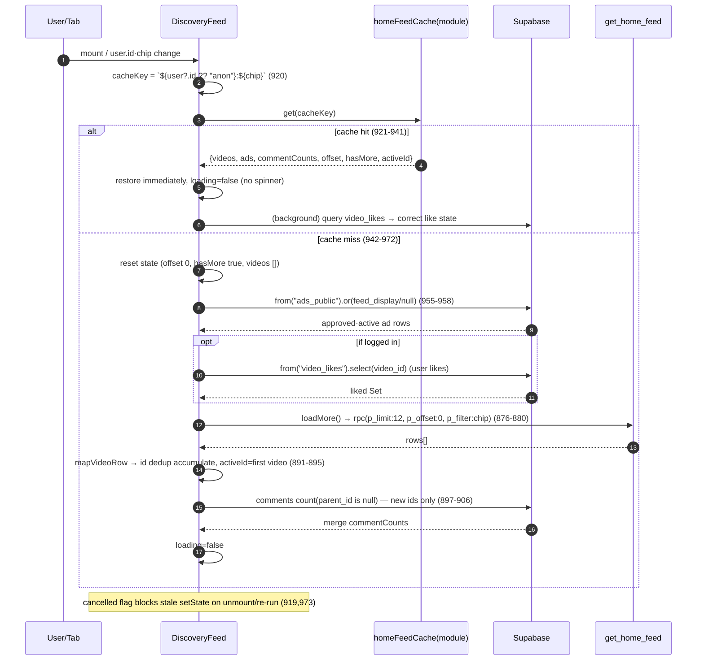
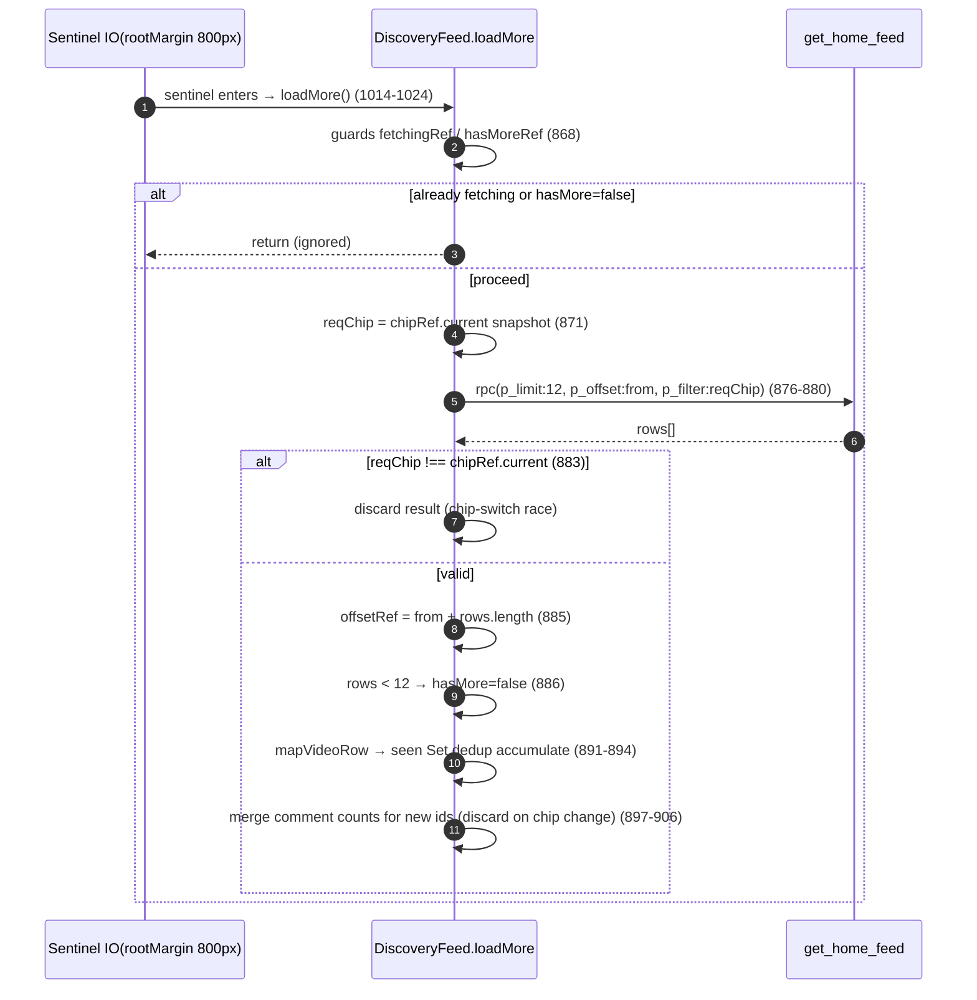
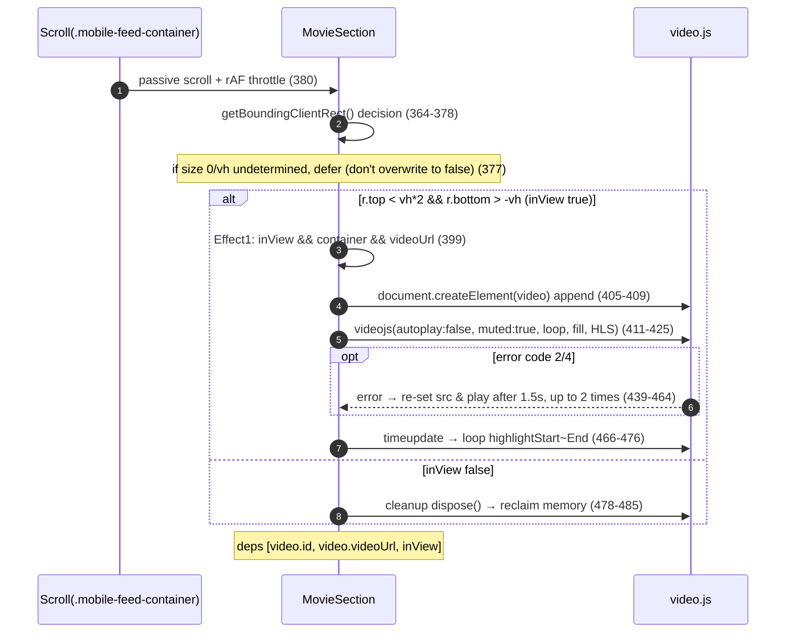
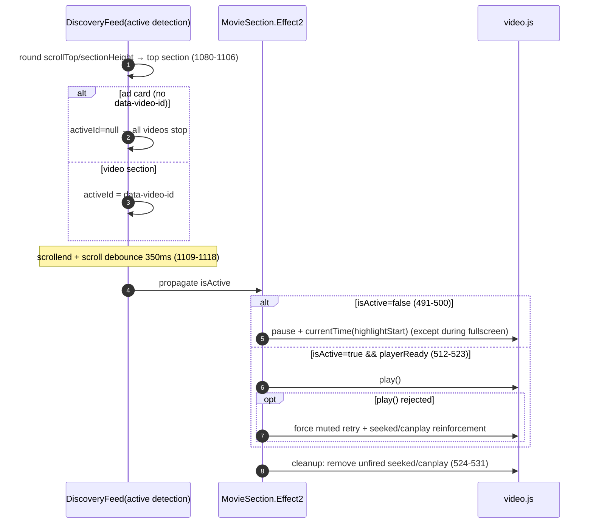
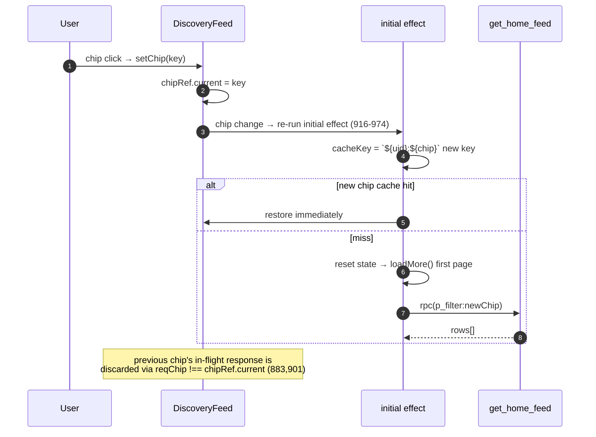
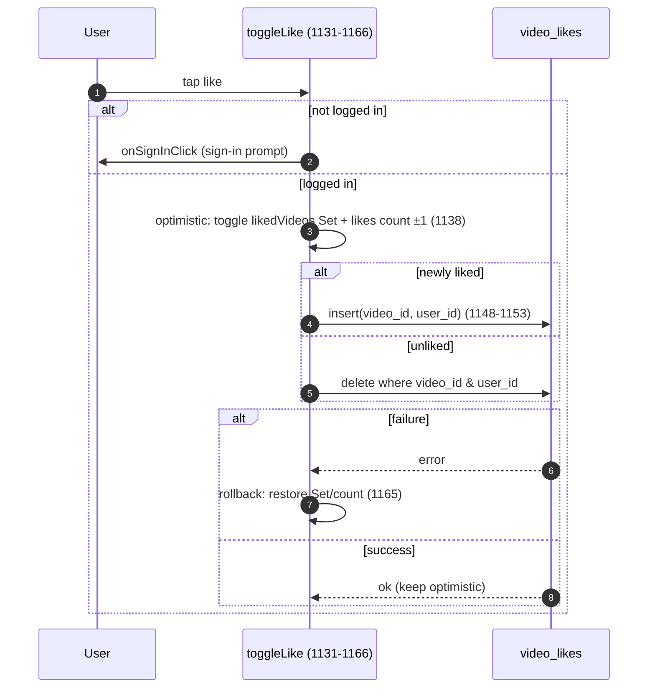

# 02. Home Feed (Discovery) — Detailed Specification

> This document is written by reading the actual code, not by guessing. Evidence is cited in `file:line` format.
> Core implementation files:
> - `src/app/components/DiscoveryFeed.tsx` (1766 lines total)
> - `supabase/get_home_feed_safe_columns_20260620.sql` (current `get_home_feed` + `v_home_feed_public`)
> - `supabase/home_feed_chip_filter_20260611.sql` (authoritative chip filter logic + `get_home_feed_count(text)`)
> - `supabase/home_feed_count_20260611.sql` (legacy no-arg count — superseded by the chip version)
> - `supabase/ads_public_view_20260620.sql` (`ads_public` safe view)
> - `supabase/ad_charge_dedup_phase3_20260614.sql` (`increment_ad_impressions` dedup)
> - `supabase/home_security_20260620.sql` (`increment_ad_clicks` dedup + `video_likes`/`comments` RLS)
> - `src/app/components/CommentPanel.tsx`, `src/app/components/ExternalAdSlot.tsx`

---

## 1. Overview / Purpose

The Home Feed (Discovery) is CREAITE's landing screen and the "highlight corner" for all public videos. The component is `DiscoveryFeed` (`src/app/components/DiscoveryFeed.tsx:759`).

- Purpose: surface every public video with `show_on_home=true` seamlessly, ordered by priority (personalized / popular / latest). The comment states it explicitly: "the home feed is the highlight corner of all videos, so it shows everything whether there are 100 or 10,000" (`DiscoveryFeed.tsx:866`).
- A single component branches between two layouts via a CSS media query (≥1024px): mobile = TikTok-style vertical snap feed (`mobile-feed-container`, `DiscoveryFeed.tsx:1219`), desktop = card grid (`desktop-feed-container`, `DiscoveryFeed.tsx:1264`). The switch is pure CSS and both are rendered to the DOM (`DiscoveryFeed.tsx:1445`-`1449`).
- Monetization: ads are periodically inserted between videos. The policy flag `HOME_FEED_SELF_ADS=false` (`DiscoveryFeed.tsx:54`) means only external networks (AdFit/AdSense) are used currently.

Because it is the very first screen, it has no footer, so terms links for SEO/OAuth brand verification are inserted separately as an `sr-only` nav (`DiscoveryFeed.tsx:1211`-`1218`).

---

## 2. User Stories

- As a visitor (not logged in), I want to immediately scroll videos based on popularity + recency on the first screen (with no personalization history, fall back to popular/latest, `get_home_feed_safe_columns_20260620.sql:91`).
- As a logged-in user, I want a personalized feed reflecting my likes / views / follows (`...:106`-`155`).
- As a viewer, I want to filter quickly with chips (all / popular / new / free / for-sale / cinema-grade) (`DiscoveryFeed.tsx:110`-`117`).
- As a viewer, I want to swipe vertically through autoplaying videos without interruption (snap + autoplay, `DiscoveryFeed.tsx:1221`, `490`-`532`).
- As a viewer, I want to instantly like / comment / share / follow on a video (`ActionButtons`, `DiscoveryFeed.tsx:219`).
- As a 19+ minor / unverified user, I want age-restricted videos to be locked (`isAgeLocked`, `DiscoveryFeed.tsx:359`).
- As a purchase-intent viewer, I want to see price / negotiation status and enter the detail page (`DiscoveryFeed.tsx:679`-`704`).
- As a creator (BETA), I want a top banner that takes me straight to the registration page (`DiscoveryFeed.tsx:1194`-`1209`).
- As an advertiser, I want impressions/clicks counted fraud-free, once per hour (dedup, `ad_charge_dedup_phase3_20260614.sql`, `home_security_20260620.sql:52`).

---

## 3. Screens & States

### 3.1 Layout branching (mobile vertical feed / desktop grid)
- Switched by a CSS media query at ≥1024px (= Tailwind `lg`). The mobile container is `display:none` at 1024px+, the desktop container is the inverse (`DiscoveryFeed.tsx:1445`-`1449`).
- The comment panel branching (JS) is decided separately via `matchMedia("(min-width: 1024px)")` (`isDesktop`, `DiscoveryFeed.tsx:764`-`772`). This prevents a **double mount** (double fetch/subscribe) of the mobile sheet and the desktop modal (`DiscoveryFeed.tsx:762`-`763`).
- Mobile: vertical snap (`snap-y snap-mandatory`), two videos per screen (section height `calc(50% - 1.5px)`, `DiscoveryFeed.tsx:1393`-`1394`). Container height `calc(100dvh - 136px)` (`...:1387`).
- Desktop: responsive grid `grid-cols-1 / md:2 / xl:3 / 2xl:4` (`DiscoveryFeed.tsx:1339`), top sticky header (DISCOVERY FILMS title + chip bar + search bar + VIDEOS count badge, `...:1267`-`1338`).

### 3.2 Loading / Empty / Error
- Initial loading: full-screen spinner (`loading` true, `DiscoveryFeed.tsx:1186`).
- Empty feed: `videos.length === 0` → "No videos to display." (`DiscoveryFeed.tsx:1187`).
- Loading more (infinite scroll): bottom spinner (`loadingMore`, `DiscoveryFeed.tsx:1256`-`1258`, desktop `1375`-`1377`).
- End of feed: "END OF FEED" (mobile `1259`-`1261`) / "End of Feed" (desktop `1378`-`1380`).
- Video playback error (after 2 retries fail): "Processing video..." overlay + spinner over the card (`MovieSection`, `DiscoveryFeed.tsx:558`-`563`).

### 3.3 Onboarding gate (age)
- 19+/restricted videos are locked via `shouldBlur(age_rating, ageVerified)`. **The user's own videos are excluded from the gate** (`isMyVideo`, `DiscoveryFeed.tsx:358`-`359`).
- When locked, the whole card is blurred with a lock overlay; tapping enters ProductDetail via `onVideoClick` (the real gate is there, `DiscoveryFeed.tsx:627`-`639`).
- The age badge (`AgeBadge`) is always shown regardless of lock (`DiscoveryFeed.tsx:675`, desktop `1698`-`1700`).

### 3.4 Chip filter bar
- 6 chips: `all/popular/new/free/paid/cinema` — `HOME_CHIPS` (`DiscoveryFeed.tsx:110`-`117`). Labels are Korean/English by `isKo` (`...:1286`).
- Shown only in the desktop sticky header. When overflowing, YouTube-style left/right arrows (`chipArrows`, `DiscoveryFeed.tsx:776`, `984`-`1001`, `1290`-`1315`). Arrow visibility is decided by `scrollLeft`/`clientWidth`/`scrollWidth` (`...:985`-`991`), refreshed on resize/scroll.
- (The chip bar UI is not rendered in the mobile layout — the chip bar only exists in the sticky header inside `desktop-grid-wrapper`. `chip` state defaults to `"all"`.)

---

## 4. Behavior Flow

### 4.1 Initial load (restarts on `user.id`/`chip` change, `DiscoveryFeed.tsx:916`-`974`)
1. Compute cache key `${user?.id ?? "anon"}:${chip}` (`...:920`).
2. **On module cache hit**: restore immediately without reload/spinner (set videos/ads/commentCounts/offset/hasMore/activeId, `loading=false`). Only the like state is refreshed in the background (`...:921`-`941`).
3. On cache miss: reset state (offset 0, hasMore true, videos []) → query `ads_public` for ads → if logged in, query `video_likes` → `loadMore()` for the first page (`...:942`-`972`).
4. A `cancelled` flag blocks stale setState on unmount/re-run (`...:919`, `973`).

### 4.2 Infinite scroll (`loadMore`, `DiscoveryFeed.tsx:867`-`914`)
- Guards: `fetchingRef` (prevents duplicate calls) + `hasMoreRef` (`...:868`). Snapshot the chip at request time into `reqChip` (`...:871`).
- `supabase.rpc("get_home_feed", { p_limit: 12, p_offset: from, p_filter: reqChip })` (`...:876`-`880`).
- After the response, if `reqChip !== chipRef.current` the result is discarded (prevents chip-switch race, `...:883`).
- `offsetRef = from + rows.length`; if rows < 12 then `hasMore=false` (`...:885`-`886`).
- After mapping (`mapVideoRow`), accumulate with **id-based dedup** (`seen` Set, `...:891`-`894`).
- If `activeId` is empty, set it to the first video (`...:895`).
- Comment counts are queried only for the new page's videos (`comments` where `parent_id is null`) and merged into the accumulator (`...:897`-`906`). The merge is also discarded on chip change (`...:901`).
- When the sentinel (`.feed-load-sentinel`) becomes visible with `rootMargin:"800px 0px"`, `loadMore` is triggered (`DiscoveryFeed.tsx:1014`-`1024`). The sentinel exists in both mobile and desktop (`1255`, `1374`).

### 4.3 Autoplay — mount / dispose (mobile `MovieSection`, `DiscoveryFeed.tsx:312`-`711`)
- **Lazy mount (`inView`)**: this is a non-virtualized feed, so creating players for all sections at once explodes memory ("Aw Snap" crash) → a player is created only when within ±1 screen (`...:361`-`394`).
  - The decision is based on `getBoundingClientRect()`, not IntersectionObserver. Reason: a previous IO (root:null) always reported false inside the inner scroll layout, so players were never created — bug fix (`...:364`-`366`).
  - A passive scroll listener with rAF throttle on the scroll container (`.mobile-feed-container`). Retries at 120ms/500ms to account for initial layout settling (`...:380`-`387`). If size is 0 / vh undetermined, the decision is deferred (not overwritten to false, `...:377`).
  - Threshold: `r.top < vh*2 && r.bottom > -vh` (`...:378`).
- **Effect 1 — player create/dispose** (`...:399`-`485`): only when `inView && container && videoUrl`. The `video` element is created outside React via `document.createElement` and appended → avoids React removeChild conflicts on dispose (`...:405`-`409`). video.js options: autoplay false, controls false, loop true, muted true, fill, preload metadata, crossOrigin anonymous, HLS type for m3u8 (`...:411`-`425`). `dispose()` in cleanup (`...:478`-`484`). deps `[video.id, video.videoUrl, inView]` → on inView false, dispose reclaims memory (`...:485`).
  - Retry: on the `error` event, for code 2 (NETWORK) / 4 (SRC_NOT_SUPPORTED), re-set src + play after 1.5s, up to 2 times. On failure, `hasError` (`...:439`-`464`).
  - Highlight loop: on `timeupdate`, loop only the `highlightStart`~`highlightEnd` segment (default start+30, clamped if it exceeds video length) (`...:466`-`476`).
- **Effect 2 — active/inactive transition** (`...:490`-`532`): if `isActive=false`, pause + `currentTime(highlightStart)` (except during fullscreen, `...:491`-`500`). If `isActive=true && playerReady`, play. To handle `play()` rejection, force muted and retry, reinforced by `seeked`/`canplay` events (`...:512`-`523`). cleanup removes unfired listeners (prevents a late-arriving event from playing/sounding an inactive video during fast scrolling, `...:524`-`531`).
- **Effect 3 — apply mute** (`...:534`-`539`).
- **Active detection** (`DiscoveryFeed.tsx:1080`-`1129`): round `scrollTop / sectionHeight` to derive the top section index → set `activeId` from that section's `data-video-id`. Ad cards have no `data-video-id` → null → all videos stop (`...:1103`-`1106`). `scrollend` (newer browsers) + `scroll` debounce 350ms (iOS/wheel fallback, `...:1109`-`1118`). No auto-change during fullscreen (`...:1086`-`1088`).
- Desktop (`DesktopMovieCard`, `DiscoveryFeed.tsx:1628`): create/play the player only on hover, pause on un-hover, **dispose only on unmount** (`...:1635`-`1674`).

### 4.4 Like / Follow / Comment / Share
- **Like** (`toggleLike`, `DiscoveryFeed.tsx:1131`-`1166`): not logged in → `onSignInClick`. Optimistic update (likedVideos Set + likes count), then `video_likes` insert/delete, rollback on failure (`...:1138`-`1165`).
- **Follow**: `FollowButton` (passes `creatorId`, `DiscoveryFeed.tsx:672`-`674`, desktop `1724`-`1726`).
- **Comment**: button → `setCommentVideo(v)` (`DiscoveryFeed.tsx:1242`). Blocked for showcase videos (`handleShowcaseClick`). The panel branches into a mobile sheet / desktop modal (see § CommentPanel integration).
- **Share** (`handleShare`, `DiscoveryFeed.tsx:1168`-`1184`): URL `${origin}?video=${id}`. Mobile prefers `navigator.share` (AbortError is ignored); unsupported/desktop uses `ShareModal` (`...:1492`-`1500`).
- **Fullscreen** (`openFullscreenGated`, `DiscoveryFeed.tsx:791`-`796`): non-subscriber + unknown/over-60s length → detour to ProductDetail (blocks paywall evasion). Only subscribers or definitely ≤60s shorts go directly to `VideoFullscreen`. Just before entering, pause+mute all `<video>` (`...:604`-`609`). During fullscreen, feed autoplay is blocked (re-pause immediately on play event + resize/orientation backup, `DiscoveryFeed.tsx:843`-`863`).

### 4.5 Ad insertion
- **Mobile** (`feedItems`, `DiscoveryFeed.tsx:1033`-`1052`): interval = `interval_count` (default 4) if self-ads ON, fixed 5 if OFF (`...:1035`). A slot every `(i+1) % interval === 0`. self-ad priority (when switch ON) → else `extad` (external) → if neither, the slot is omitted (avoids empty sections, `...:1040`-`1049`).
- **Desktop** (`desktopItems`, `DiscoveryFeed.tsx:1060`-`1078`): one ad per 6 videos (`DESKTOP_AD_INTERVAL=6`, `...:1059`). The period 7 (= 6 videos + 1 ad) is coprime with 2/3/4 columns, so ads don't pile up in the same column and rotate diagonally (`...:1054`-`1058`).
- **Impression tracking** (`handleAdImpression`, `DiscoveryFeed.tsx:1027`-`1029`): when a card enters the screen (IntersectionObserver threshold 0.5, once only) `increment_ad_impressions(ad_id, p_viewer_key)` (`AdCard` `...:131`-`156`, desktop `DesktopAdCard` `1567`-`1585`).
- **Click**: `increment_ad_clicks(ad_id, p_viewer_key)` then `openAdLinkSafe` (http(s) only, `DiscoveryFeed.tsx:119`-`128`, `151`-`156`, `1587`-`1590`).
- External ads use `ExternalAdSlot` (AdFit/AdSense, fixed 300×250, network rotation by index, `ExternalAdSlot.tsx`).

---

## 5. Data / RPC Contract

### 5.1 `get_home_feed(p_limit, p_offset, p_filter)` — `get_home_feed_safe_columns_20260620.sql:42`
- Args: `p_limit integer DEFAULT 12`, `p_offset integer DEFAULT 0`, `p_filter text DEFAULT 'all'` (`...:43`-`46`). The frontend always passes 12/offset/chip (`DiscoveryFeed.tsx:876`-`880`).
- Returns: `RETURNS SETOF public.v_home_feed_public` (`...:47`). This view projects only the public-safe columns of `videos` and excludes internal ops fields `moderation_*` (status/score/categories/error) (`...:23`-`33`). `seed/prompt/ai_model_version` are intentionally kept public as AI provenance (`...:10`-`11`).
- Security: `STABLE SECURITY DEFINER SET search_path='public'` (`...:48`), `GRANT EXECUTE ... TO anon, authenticated` (`...:159`). The view itself is not GRANTed to anon (read only inside the function, `...:20`-`21`).

#### Chip filter mapping (`p_filter` → branch)
- Common WHERE (all branches): `show_on_home=true AND (visibility='public' OR NULL) AND COALESCE(is_hidden,false)=false AND (series_id IS NULL OR COALESCE(episode_number,1)=1)` — **series show episode 1 only** (`...:58`-`59` etc.).
- `new`: above + `ORDER BY created_at DESC, id` (`...:55`-`63`).
- `popular`/`free`/`paid`/`cinema`: popularity-score ordering. `free` → `price_standard=0`, `paid` → `price_standard>0`, `cinema` → `show_on_ott=true` (`...:66`-`82`). Sort expression: `likes*1.0 + (valid views in last 7 days)*2.0` DESC, created_at DESC, id (`...:74`-`79`).
- `all` (default) → personalized (§ 6).

### 5.2 Personalized ordering (`all`) — `get_home_feed_safe_columns_20260620.sql:84`-`155`
- History check: if `auth.uid()` exists and there is a `video_likes` or valid `video_views`, then `v_has_history=true` (`...:85`-`89`).
- Not logged in OR no history → popular/latest fallback (same popularity score expression, `...:91`-`104`).
- Has history → weighted sum of 4 CTEs:
  - `cat_pref`: liked category +3, viewed category +1 (`...:107`-`114`).
  - `genre_pref`: liked genre +3, viewed genre +1 (`...:116`-`123`).
  - `creator_pref`: liked creator +3, **followed creator +5** (`...:125`-`132`).
  - `viewed`: already-watched videos (`...:134`-`137`).
  - Final score: `cat*1.0 + genre*1.0 + creator*1.0 + likes*0.05 - (4 if already watched)` DESC, created_at DESC, id (`...:148`-`154`). Watched videos are demoted by -4.

### 5.3 `get_home_feed_count(p_filter)` — `home_feed_chip_filter_20260611.sql:131`
- The current signature is `(p_filter text DEFAULT 'all')` (`...:131`), matching the frontend call `rpc("get_home_feed_count", { p_filter: chip })` (`DiscoveryFeed.tsx:1007`).
- count WHERE: `show_on_home=true AND public(or null) AND not hidden AND (free→=0 / paid→>0 / cinema→ott)` (`...:133`-`139`).
- Note: the **no-arg** version in `home_feed_count_20260611.sql` is legacy; the chip version replaces it after `DROP FUNCTION ... get_home_feed_count()` (`home_feed_chip_filter_20260611.sql:128`-`129`). However, the chip count WHERE lacks the series-episode-1 filter, so it diverges from the no-arg version (`home_feed_count_20260611.sql:19`, includes the series filter) → **carried-over item** (§ 12).

### 5.4 Pagination / dedup
- Page size `FEED_PAGE_SIZE = 12` (`DiscoveryFeed.tsx:752`). Offset accumulation is **based on returned row count** (`offsetRef = from + rows.length`, `...:885`) — keeping the DB offset consistent regardless of the displayed count after client-side filtering of blocked videos.
- Stable ordering: every branch ends with an `id` tiebreaker (prevents duplicates/gaps).
- Frontend dedup: remove duplicates with an id Set on accumulation (`...:891`-`894`).

### 5.5 `mapVideoRow` mapping — `DiscoveryFeed.tsx:714`-`749`
DB row (view columns) → `Video` interface. Key mappings:
- `price`/`priceStandard` ← `price_standard` (`...:722`, `733`), `tool` ← `ai_tool` (`...:726`), `creatorId` ← `creator_id` (`...:718`).
- `durationSeconds` ← `duration_seconds` (for the paywall gate, `...:723`).
- `tags`: if an array, keep as-is; if a string, split by comma (`...:732`).
- `age_rating` default "all" (`...:730`), `highlightEnd` default `highlightStart+30` (`...:746`), `seriesId` ← `series_id` (`...:747`).

### 5.6 Ad query — `DiscoveryFeed.tsx:955`-`958`
- `supabase.from("ads_public").select(...).or("ad_type.eq.feed_display,ad_type.is.null")`. The `ads_public` view enforces approval/active/display-period filters and hides sensitive columns (budget/spent/owner) (`ads_public_view_20260620.sql:20`-`30`).

---

## 6. Business Rules

- **Personalization weights** (`all`, with history): category/genre/creator each weighted 1.0 (liked 3 / viewed 1 / followed 5) + likes 0.05 − already-watched 4 (`get_home_feed_safe_columns_20260620.sql:148`-`154`). Follow (5) is the strongest single signal.
- **Popularity score** (popular/free/paid/cinema and fallback): `likes + valid views in last 7 days ×2` (`...:74`-`79`).
- **Series episode 1 only**: only videos with `series_id IS NULL OR episode_number=1` appear in the feed (later episodes excluded, `...:59`). Cards get a "Series" badge (`DiscoveryFeed.tsx:589`-`593`, desktop `1691`-`1695`).
- **Length gating (paywall)**: on fullscreen entry, non-subscriber + (unknown length or over 60s) → direct playback blocked, go to ProductDetail (`DiscoveryFeed.tsx:791`-`796`).
- **Ad interval**: mobile external ads every 5 slots, `interval_count` (default 4) when self-ads ON (`...:1035`); desktop every 6 slots (`...:1059`).
- **Tier/policy flags**: `HOME_FEED_SELF_ADS=false` (external ads only, `...:54`), `BETA_MODE` (top registration banner, `...:1194`), `EXTERNAL_ADS_ACTIVE` (external ad slot insertion guard, `ExternalAdSlot.tsx:41`).
- **Price display**: if `price>0`, "Commercial download/₩amount" or negotiation (`isNegotiationOnly`); if `price=0`, "Free viewing/license not for sale" (`DiscoveryFeed.tsx:679`-`696`, desktop `1731`-`1743`).
- **Blocked users**: videos from blocked creators are excluded from the feed (client-side, `visibleVideos`, `DiscoveryFeed.tsx:830`-`833`).

---

## 7. Edge Cases & Error Handling

- **Chip-switch race**: if at response time `reqChip !== chipRef.current`, discard the result (both videos and comment counts, `DiscoveryFeed.tsx:883`, `901`). A chip change triggers a fresh load via the initial effect (`...:944`-`966`).
- **Duplicate videos**: dedup with an id Set on accumulation (`...:891`-`894`); the DB sort's id tiebreaker keeps page boundaries stable (`get_home_feed_safe_columns_20260620.sql:154`).
- **Empty feed**: "No videos to display." (`DiscoveryFeed.tsx:1187`); if there's no ad data, the slot is omitted (avoids empty sections, `...:1040`-`1049`).
- **Autoplay failure**: for code 2/4, retry twice after 1.5s → on failure, "Processing video..." overlay (`...:439`-`464`, `558`-`563`). `play()` rejection → force muted retry + seeked/canplay reinforcement (`...:512`-`523`).
- **Late-arriving events**: on inactive/unmount, remove seeked/canplay listeners → prevents an inactive video from sounding after fast scrolling (`...:524`-`531`).
- **Multiple sounds**: on fullscreen entry, pause+mute all `<video>` (`...:604`-`609`, `843`-`863`).
- **Cache poisoning**: do not write to the cache while initial loading (`loading`) is in progress (`...:977`-`982`). The cache key includes `user.id` and `chip` → isolated across user/filter switches. Since the cache is session memory, likes are corrected by a background re-query after restore (`...:933`-`939`).
- **Bad ad links**: `openAdLinkSafe` parses with `new URL()` and only allows http(s) schemes (blocks javascript:/data:, `...:119`-`128`).
- **Ad/click forgery**: RPC dedup charges only once per (ad, viewer, 1 hour) (§ 9).

---

## 8. Performance

- **Module cache** (`homeFeedCache`, `DiscoveryFeed.tsx:754`-`757`): key `${userId}:${chip}`, holds the entire infinite-scroll accumulation → instant restore on tab return (no spinner, `...:921`-`941`). Saved only when not loading (`...:977`-`982`).
- **useMemo**: `visibleVideos` (block filter, `...:830`), `creatorIds` (`...:835`), `feedItems` (`...:1033`), `desktopItems` (`...:1060`) — avoids recomputing the whole array on trivial state changes.
- **Lazy images**: thumbnails `loading="lazy" decoding="async"` (`...:553`-`554`, desktop `1684`).
- **Lazy mount**: in this non-virtualized feed, only ±1-screen sections create a video.js player; when they move away, dispose reclaims memory (`...:361`-`394`, `485`). Desktop creates only on hover (`...:1635`-`1657`).
- **Sentinel + rootMargin 800px**: preloads the next page before reaching the end (`...:1019`-`1021`).
- **rAF throttle**: lazy-mount scroll decision (`...:380`), active-detection scroll debounce 350ms (`...:1113`-`1117`).
- **Incremental comment-count query**: query only the new page's video ids and merge (no full re-query, `...:897`-`906`).

---

## 9. Permissions / Security

- **Safe view**: `get_home_feed` returns only `v_home_feed_public` → `moderation_*` internal fields are hidden from anon (`get_home_feed_safe_columns_20260620.sql:7`-`33`). Ads use the `ads_public` view to block sensitive columns (budget/spent/owner), and the base `ads` public SELECT policy was removed (`ads_public_view_20260620.sql:20`-`37`).
- **viewer_key dedup**:
  - Impression: `increment_ad_impressions(ad_id, p_viewer_key)` — `COALESCE(auth.uid(), session key)` + `date_trunc('hour')` bucket, charges CPM only once per (ad, viewer, 1 hour) (`ad_charge_dedup_phase3_20260614.sql:22`-`48`). The dedup table is RLS on with no policy (only DEFINER functions write, `...:18`-`20`).
  - Click: `increment_ad_clicks(ad_id, p_viewer_key)` — same dedup; the old 1-parameter function is DROPped (bypass blocked, `home_security_20260620.sql:50`-`70`).
  - Session key: `getViewerSessionKey()` (localStorage) identifies even logged-out users (`DiscoveryFeed.tsx:153`, `1028`).
- **video_likes RLS**: select/insert/delete only the user's own rows (`home_security_20260620.sql:24`-`33`).
- **comments SELECT RLS**: hidden comments viewable only by author/admin/video owner (`home_security_20260620.sql:90`-`100`).
- **External link safety**: only http(s) schemes via `window.open(... noopener,noreferrer)` (`DiscoveryFeed.tsx:119`-`128`).

---

## 10. Analytics / Events

- **Ad impression**: 50% card visibility once → `increment_ad_impressions` (impressions+1, spent_krw += CEIL(CPM/1000), `ad_charge_dedup_phase3_20260614.sql:40`-`46`). CPM is the platform setting `ad_cpm_krw` (default 2000, `...:41`).
- **Ad click**: `increment_ad_clicks` (clicks+1, dedup, `home_security_20260620.sql:66`-`68`).
- **Like**: `video_likes` insert/delete (`DiscoveryFeed.tsx:1148`-`1153`).
- **Personalization signal sources**: `video_likes`, `video_views` (is_valid), `creator_followers` — `get_home_feed` reads these to rank (§ 5.2).
- **Popularity signal**: count of `video_views.is_valid=true` in the last 7 days (`get_home_feed_safe_columns_20260620.sql:76`-`78`).
- (There is no view-count recording call for the home feed's own videos in this component — view recording happens in the detail/player paths. This feed is an autoplay preview.)

---

## 11. Acceptance Criteria (checklist)

- [ ] Logged-out shows popular/latest fallback; logged-in + history shows personalized order (`get_home_feed_safe_columns_20260620.sql:91`, `106`).
- [ ] Each of the 6 chips applies the correct filter/sort (new=latest, popular=popular, free=free, paid=paid, cinema=ott, all=personalized).
- [ ] Series show episode 1 only in feed/count, with a "Series" badge on the card.
- [ ] Infinite scroll: loads in units of 12, "END OF FEED" at the end, no duplicate videos.
- [ ] Right after a chip switch, the previous chip's response is not mixed in (race discard).
- [ ] Mobile vertical snap: only the top video is active/autoplaying, the rest are stopped/muted.
- [ ] Sections beyond ±1 screen dispose their player (memory reclaim); when an ad card is active, all videos stop.
- [ ] Like optimistic update + rollback on failure, sign-in prompt when logged out.
- [ ] Comment panel: only one of mobile sheet / desktop modal mounts (no double fetch).
- [ ] Share: mobile native share → ShareModal if unsupported, URL `?video=id`.
- [ ] 19+ lock: overlay when unverified, own videos excluded from the lock.
- [ ] Fullscreen: non-subscriber + long/unknown length detours to ProductDetail.
- [ ] Ads: inserted every 5 (mobile)/6 (desktop), no empty slot when there's no data.
- [ ] Ad impressions/clicks counted only once per (ad, viewer, 1 hour) (dedup).
- [ ] `ads_public`/`v_home_feed_public` hide sensitive/moderation columns.
- [ ] On tab return, the module cache restores the prior state with no spinner.
- [ ] External ad links open only http(s) in a new tab (noopener).

---

## 12. Known Constraints / Carry-overs

- **Non-virtualized feed**: keeps all cards in the DOM + defends memory only via lazy mount. Consider migrating to virtualization (react-virtual, etc.) later (`DiscoveryFeed.tsx:362`).
- **Autoplay does not use IO**: lazy mount is implemented with `getBoundingClientRect` + scroll listener (history of IO root:null misbehaving in inner scroll, `...:364`-`366`). Migrating to an IO with the scroll container as root is carried over.
- **count condition mismatch**: the chip version `get_home_feed_count` (`home_feed_chip_filter_20260611.sql:133`-`139`) lacks the series-episode-1 filter, so it diverges from `get_home_feed` (`get_home_feed_safe_columns_20260620.sql:59`) and the no-arg count (`home_feed_count_20260611.sql:19`) → the badge count may overstate the actual feed count (consistency patch needed).
- **No mobile chip UI**: the chip bar renders only in the desktop sticky header (`DiscoveryFeed.tsx:1267`-`1338`). On mobile there is no chip-switch UI entry point (the `chip` is changeable in code but has no trigger) → consider adding a mobile chip filter entry.
- **Desktop autoplay**: hover-based (touch-desktop/keyboard users get no preview without hovering, `...:1635`).
- **Comment count consistency**: +1 optimistic on creation (`...:1484`), no decrement on deletion (increment only) → may overstate until refresh.

---

## 13. Wireframes (text mockups)

> Actual CSS/structure basis: mobile vertical snap (`DiscoveryFeed.tsx:1219`-`1262`), desktop grid (`...:1264`-`1383`), chip bar (`...:1290`-`1315`), age gate (`...:627`-`639`), ad slot (`...:1033`-`1078`).

### 13.1 Mobile vertical feed card (2 videos per screen, snap-y mandatory)

```
┌─────────────────────────────┐  ← container height calc(100dvh - 136px)
│  [BETA] Register as creator →│     (.mobile-feed-container, snap-y)
├─────────────────────────────┤
│ ▓▓▓▓▓ MovieSection #1 ▓▓▓▓▓ │  ← section height calc(50% - 1.5px)
│ ▓ (video.js, muted, loop)  ▓ │     snap-start, data-video-id=#1
│ ▓                          ▓ │     → top = activeId → autoplay
│ ▓  [12]                    ▓ │  ← AgeBadge (top-left, always, regardless of lock)
│ ▓                  ❤  1.2k  ▓ │
│ ▓                  💬   34  ▓ │  ← ActionButtons (right, vertical)
│ ▓                  ↗ Share  ▓ │
│ ▓                  +Follow  ▓ │
│ ▓ @creator · Title          ▓ │
│ ▓ 🎬 Commercial DL ₩30,000  ▓│  ← price>0: price / price=0: Free
│ ▓▓▓▓▓▓▓▓▓▓▓▓▓▓▓▓▓▓▓▓▓▓▓▓▓▓▓ │
├─────────────────────────────┤  ← snap boundary (1.5px gap)
│ ░░░░░ MovieSection #2 ░░░░░ │  ← inView=±1 screen → mount, inactive=stop+mute
│ ░  (thumbnail lazy, stopped)░ │
│ ░░░░░░░░░░░░░░░░░░░░░░░░░░░░ │
└─────────────────────────────┘
                ↓ scroll
┌─────────────────────────────┐
│  age-locked card example     │
│  🔲🔲🔲 (blur) 🔒 19+ 🔲🔲🔲 │  ← shouldBlur(age_rating, ageVerified)
│   tap → ProductDetail(real gate)│  own video (isMyVideo) excluded
└─────────────────────────────┘
                ↓ at (i+1)%5==0
┌─────────────────────────────┐
│  📢 Ad slot (AdCard/extad)   │  ← self-ads OFF → external ad; if neither, slot omitted
│     no data-video-id         │     → activeId=null → all videos stop
└─────────────────────────────┘
   ...
┌─────────────────────────────┐
│   ⟳ (loadingMore spinner)    │  ← .feed-load-sentinel (rootMargin 800px)
│        END OF FEED           │  ← hasMore=false
└─────────────────────────────┘
```

### 13.2 Desktop grid (sticky header + responsive grid)

```
┌──────────────────────────────────────────────────────────────┐
│ DISCOVERY FILMS                              [🔍 search bar  ] │  ← sticky header
│ ◀ [All][🔥Popular][✨New][🆓Free][💎For sale][🎬Long-form]  ▶ │  ← chip bar (◀▶ on overflow)
│                                                  VIDEOS: 1,234 │  ← get_home_feed_count badge
├──────────────────────────────────────────────────────────────┤
│  grid-cols-1 / md:2 / xl:3 / 2xl:4                            │
│  ┌────────┐ ┌────────┐ ┌────────┐ ┌────────┐                │
│  │ card 1 │ │ card 2 │ │ card 3 │ │ card 4 │  ← play on hover  │
│  │ [12]   │ │        │ │ Series │ │        │                │
│  │@cr ❤34 │ │@cr     │ │@cr     │ │@cr     │                │
│  │₩30,000 │ │ Free   │ │ Nego   │ │₩5,000  │                │
│  └────────┘ └────────┘ └────────┘ └────────┘                │
│  ┌────────┐ ┌────────┐ ┌────────┐ ┌────────────────────┐    │
│  │ card 5 │ │ card 6 │ │ card 7 │ │ 📢 DesktopAdCard    │    │  ← 1 ad per 6 videos
│  └────────┘ └────────┘ └────────┘ │  (300×250 / extad) │    │     period 7 coprime w/ 2/3/4 cols
│                                    └────────────────────┘    │     → diagonal rotation
│                          ...                                  │
│                  ⟳ loadingMore / "End of Feed"                │  ← .feed-load-sentinel
└──────────────────────────────────────────────────────────────┘
```

### 13.3 Chip filter bar (desktop sticky header only)

```
container left edge (scrollLeft<=0): left arrow hidden
┌──────────────────────────────────────────────────────────────┐
│   [All*][🔥 Popular][✨ New][🆓 Free][💎 For sale][🎬 Lon..▶ │  ← right overflow → ▶ shown
└──────────────────────────────────────────────────────────────┘
   * = chip state active (default "all"). Click → setChip → initial effect reload
   arrow visibility: scrollLeft / clientWidth / scrollWidth (refreshed on resize/scroll)
   (chip bar not rendered in mobile layout → § 12 carry-over)
```

### 13.4 Onboarding gate (age) overlay

```
┌─────────────────────────────┐
│ ▒▒▒▒▒▒▒▒▒▒▒▒▒▒▒▒▒▒▒▒▒▒▒▒▒▒▒ │  ← whole card blurred
│ ▒▒▒▒▒▒▒    🔒     ▒▒▒▒▒▒▒▒▒ │
│ ▒▒▒▒▒ 19+ verification req. ▒│  ← shouldBlur(age_rating, ageVerified)==true
│ ▒▒▒▒▒▒▒▒▒▒▒▒▒▒▒▒▒▒▒▒▒▒▒▒▒▒▒ │
│ [12]                        │  ← AgeBadge always shown above the blur
└─────────────────────────────┘
   tap → onVideoClick → ProductDetail (real gate decision)
   exception: isMyVideo==true → no blur (own video)
```

### 13.5 Ad slot placement rules

```
Mobile (interval=5, self-ads OFF):
  [V][V][V][V][AD][V][V][V][V][AD]...   ← (i+1)%5==0
  AD priority: self-ad (when ON) → extad (external) → omit slot if none

Desktop (DESKTOP_AD_INTERVAL=6, period 7):
  4-col example: [V][V][V][V]
                 [V][V][AD][V]   ← period 7 coprime with 4 cols → AD position rotates diagonally
                 [V][V][V][V]
                 [AD][V][V][V]
```

---

## 14. Sequence Diagrams

### 14.1 Initial load (cache → ads → likes → RPC first page)



### 14.2 Infinite scroll



### 14.3 Autoplay mount / dispose (MovieSection)



### 14.4 Active/inactive transition (Effect 2)



### 14.5 Chip switch



### 14.6 Like optimistic update + rollback



---

## 15. API / RPC Reference

### 15.1 RPC / view query table

| Call | Args | Returns | Permissions | Definition (file:line) | Caller (file:line) |
|---|---|---|---|---|---|
| `get_home_feed` | `p_limit int=12`, `p_offset int=0`, `p_filter text='all'` | `SETOF v_home_feed_public` | `SECURITY DEFINER`, `GRANT EXECUTE → anon, authenticated` | `get_home_feed_safe_columns_20260620.sql:42`-`48`, `:159` | `DiscoveryFeed.tsx:876`-`880` |
| `get_home_feed_count` | `p_filter text='all'` | `integer` (total feed count) | `GRANT EXECUTE → anon, authenticated` (current chip version) | `home_feed_chip_filter_20260611.sql:131`-`139` | `DiscoveryFeed.tsx:1007` |
| `ads_public` query | `.select(...).or("ad_type.eq.feed_display,ad_type.is.null")` | approved·active·in-period ad rows (sensitive columns excluded) | safe view (budget/spent/owner hidden, base `ads` public SELECT removed) | `ads_public_view_20260620.sql:20`-`37` | `DiscoveryFeed.tsx:955`-`958` |
| `increment_ad_impressions` | `ad_id`, `p_viewer_key` | `void` (impressions+1, spent_krw += CEIL(CPM/1000)) | `SECURITY DEFINER` dedup (once per ad, viewer, 1 hour) | `ad_charge_dedup_phase3_20260614.sql:22`-`48` | `DiscoveryFeed.tsx:141` (AdCard), `1567`-`1585` (DesktopAdCard) |
| `increment_ad_clicks` | `ad_id`, `p_viewer_key` | `void` (clicks+1, dedup) | `SECURITY DEFINER` dedup, old 1-parameter function DROPped | `home_security_20260620.sql:50`-`70` | `DiscoveryFeed.tsx:153`, `1587`-`1590` |
| `video_likes` insert/delete | `video_id`, `user_id` (insert) | row | RLS: own rows only for select/insert/delete | `home_security_20260620.sql:24`-`33` | `DiscoveryFeed.tsx:1148`-`1153` |
| `comments` count | `.eq(video_id).is(parent_id, null)` | count | comments SELECT RLS (hidden → author/admin/owner) | `home_security_20260620.sql:90`-`100` | `DiscoveryFeed.tsx:897`-`906` |

Notes:
- `p_viewer_key` is `getViewerSessionKey()` (localStorage). Inside the RPC, dedup uses `COALESCE(auth.uid(), session key)` + `date_trunc('hour')` bucket (`DiscoveryFeed.tsx:153`, `1028`; `ad_charge_dedup_phase3_20260614.sql:22`-`48`).
- The `all` filter of `get_home_feed` branches into personalized/fallback based on whether `auth.uid()` has history (§ 5.2, `get_home_feed_safe_columns_20260620.sql:85`-`155`).

### 15.2 `mapVideoRow` field mapping table — `DiscoveryFeed.tsx:714`-`749`

| `Video` field | DB view column | Default/transform | Line |
|---|---|---|---|
| `id` | `id` | as-is | 716 |
| `thumbnail` | `thumbnail` | as-is | 717 |
| `title` | `title` | as-is | 718 |
| `creator` | `creator` | `\|\| "AI Creator"` | 719 |
| `creatorId` | `creator_id` | `\|\| undefined` | 720 |
| `likes` | `likes` | `\|\| 0` | 721 |
| `price` | `price_standard` | `\|\| 0` | 722 |
| `duration` | `duration` | `\|\| "0:00"` | 723 |
| `durationSeconds` | `duration_seconds` | `\|\| 0` (for paywall gate) | 724 |
| `resolution` | `resolution` | `\|\| undefined` | 725 |
| `tool` | `ai_tool` | `\|\| "AI Tool"` | 726 |
| `category` | `category` | `\|\| undefined` | 727 |
| `genre` | `genre` | `\|\| undefined` | 728 |
| `videoUrl` | `video_url` | `\|\| ""` | 729 |
| `age_rating` | `age_rating` | `\|\| "all"` | 730 |
| `description` | `description` | `\|\| undefined` | 731 |
| `tags` | `tags` | array as-is / string split by comma, trim, filter | 732 |
| `priceStandard` | `price_standard` | `\|\| 0` | 733 |
| `aiModelVersion` | `ai_model_version` | `\|\| undefined` (AI provenance) | 734 |
| `prompt` | `prompt` | `\|\| undefined` (AI provenance) | 735 |
| `seed` | `seed` | `\|\| undefined` (AI provenance) | 736 |
| `director` | `director` | `\|\| undefined` | 737 |
| `writer` | `writer` | `\|\| undefined` | 738 |
| `composer` | `composer` | `\|\| undefined` | 739 |
| `castCredits` | `cast_credits` | `\|\| undefined` | 740 |
| `productionYear` | `production_year` | `\|\| undefined` | 741 |
| `language` | `language` | `\|\| undefined` | 742 |
| `subtitleLanguage` | `subtitle_language` | `\|\| undefined` | 743 |
| `visibility` | `visibility` | `\|\| "public"` | 744 |
| `highlightStart` | `highlight_start` | `\|\| 0` | 745 |
| `highlightEnd` | `highlight_end` | `\|\| (highlightStart+30)` | 746 |
| `seriesId` | `series_id` | `\|\| undefined` | 747 |

---

## 16. Test Cases (Gherkin)

> Each scenario ends with the mapped § 11 acceptance criterion.

### 16.1 Happy paths

```gherkin
Feature: Home feed normal behavior

  Scenario: Infinite scroll loads the next page
    Given a logged-in user views the "All" chip home feed
    And the first page of 12 videos is loaded
    When the sentinel (.feed-load-sentinel) enters within 800px of the screen
    Then loadMore calls get_home_feed(p_limit:12, p_offset:12, p_filter:"all")
    And the new 12 are accumulated with no duplicates by id
    And offsetRef is updated to 24
    # Acceptance: §11 "Infinite scroll: loads in units of 12 ... no duplicate videos"

  Scenario: Only the top video autoplays
    Given video #1 is snapped at the top of the mobile vertical feed
    When active detection derives #1 as active via scrollTop/sectionHeight
    Then only #1 plays and the rest are paused + muted
    And #1 loops the highlightStart~highlightEnd segment
    # Acceptance: §11 "only the top video is active/autoplaying, the rest are stopped/muted"

  Scenario: Like optimistic update
    Given a logged-in user views video #1
    When they tap the like button
    Then the likedVideos Set and likes count immediately reflect +1
    And an insert of (video_id, user_id) occurs in video_likes
    # Acceptance: §11 "Like optimistic update + rollback on failure"

  Scenario: Chip switch changes the filter
    Given the user is viewing the "All" chip
    When they click the "🆓 Free" chip
    Then chip state becomes "free" and the initial effect re-runs
    And get_home_feed(p_filter:"free") loads only price_standard=0 videos
    # Acceptance: §11 "each of the 6 chips applies the correct filter/sort"

  Scenario: Ad slots inserted periodically
    Given the mobile feed has self-ads OFF and external ad data exists
    When the feed renders
    Then an ad slot is inserted at every (i+1)%5==0 position
    And when an ad card is 50% visible, increment_ad_impressions is called once
    # Acceptance: §11 "Ads: inserted every 5 (mobile)/6 (desktop)" + "impressions/clicks dedup"
```

### 16.2 Edge cases

```gherkin
Feature: Home feed edge cases

  Scenario: Chip-switch race — discard previous chip response
    Given an "All" chip loadMore request is in-flight (reqChip="all")
    When the user switches to "🔥 Popular" before the response arrives (chipRef.current="popular")
    And the "All" response arrives late
    Then since reqChip("all") !== chipRef.current("popular"), the result is discarded
    And the comment-count merge is likewise discarded
    # Acceptance: §11 "right after a chip switch, the previous chip's response is not mixed in"

  Scenario: Page-boundary duplicate video dedup
    Given a video with the same id may be returned at a page boundary
    When the new page is accumulated
    Then the seen Set excludes ids already present so the merge has no duplicates
    And the DB sort's trailing id tiebreaker keeps page boundaries stable
    # Acceptance: §11 "no duplicate videos"

  Scenario: Empty feed
    Given get_home_feed returns 0 rows
    When loading finishes (videos.length === 0)
    Then "No videos to display." is shown
    And if there is no ad data, no empty ad slot is created
    # Acceptance: §11 "no empty slot when there's no data"

  Scenario: Autoplay failure (network/source)
    Given the video src error code is 2 (NETWORK) or 4 (SRC_NOT_SUPPORTED)
    When autoplay is attempted
    Then it re-sets src + plays after 1.5s, up to 2 retries
    And after 2 failures, a "Processing video..." overlay + spinner is shown

  Scenario: play() policy rejection
    Given the browser autoplay policy rejects play()
    When the active section attempts to play
    Then it forces muted and retries, reinforced by seeked/canplay events

  Scenario: Cache poisoning prevention
    Given initial loading (loading=true) is in progress
    When the cache-save point is reached
    Then nothing is written to homeFeedCache while loading
    And the cache key `${user.id}:${chip}` isolates user/filter
    And after cache restore, the like state is corrected by a background re-query
    # Acceptance: §11 "on tab return, the module cache restores the prior state with no spinner"

  Scenario: When an ad card is at the active position
    Given on mobile, an ad card (no data-video-id) snaps to the top
    When active detection runs
    Then activeId=null and all videos stop
    # Acceptance: §11 "when an ad card is active, all videos stop"

  Scenario: Block forged/bad ad links
    Given an ad link_url is "javascript:alert(1)"
    When the ad card is clicked
    Then openAdLinkSafe does not open a window because it is not an http(s) scheme
    # Acceptance: §11 "external ad links open only http(s) in a new tab (noopener)"

  Scenario: Prevent late-arriving events from playing inactive videos
    Given the user scrolled fast so #1 became inactive/unmounted
    When #1's seeked/canplay events fire late
    Then cleanup removes the listeners so the inactive video does not sound
    # Acceptance: §11 "sections beyond ±1 screen dispose their player"
```
