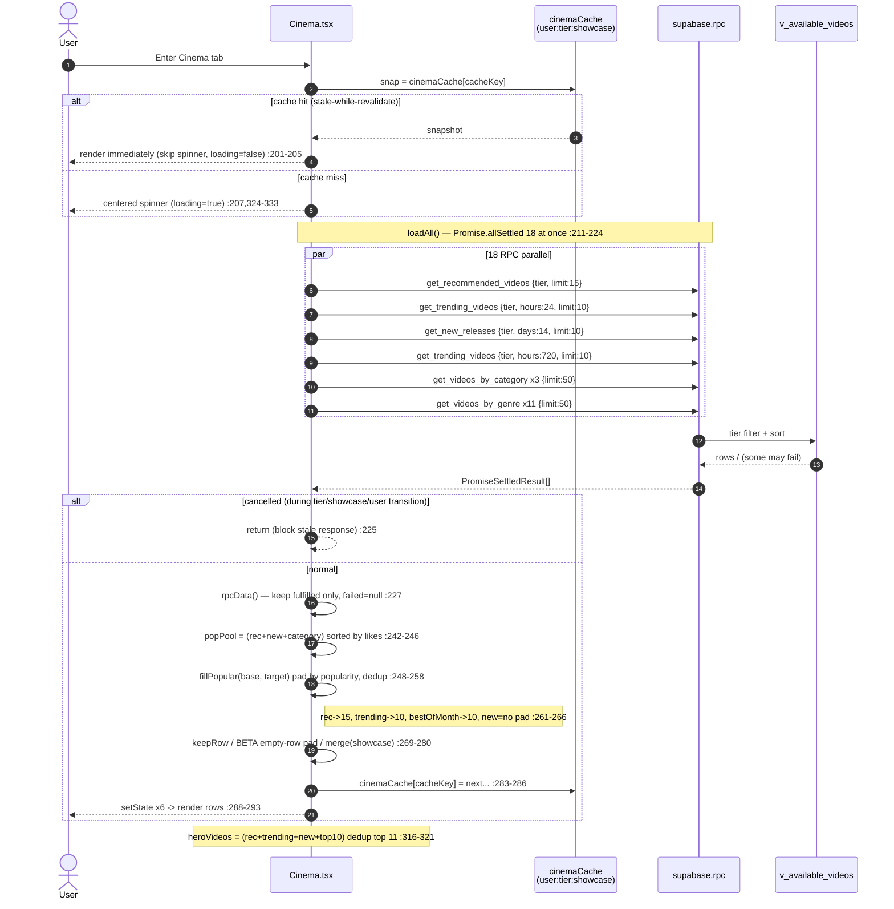
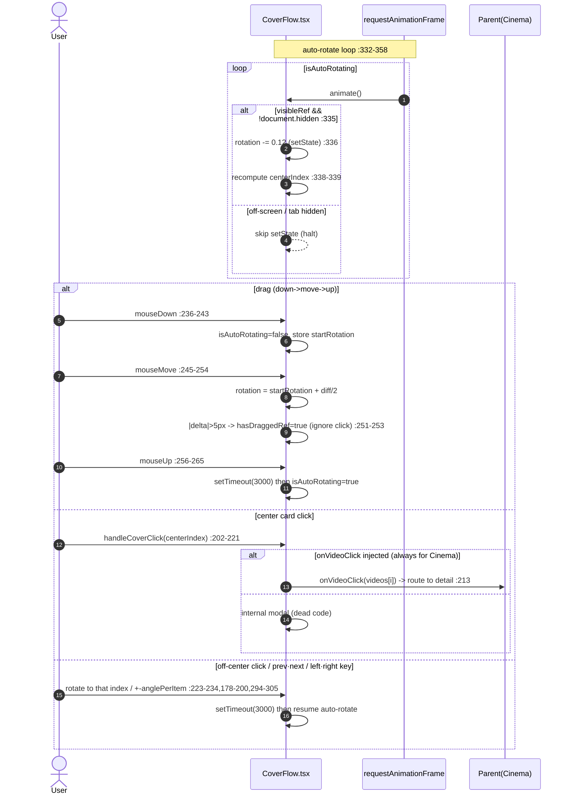
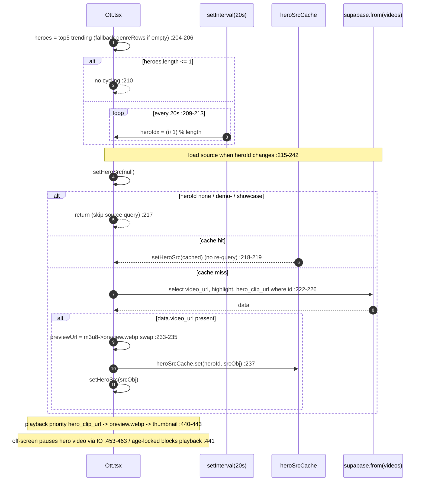
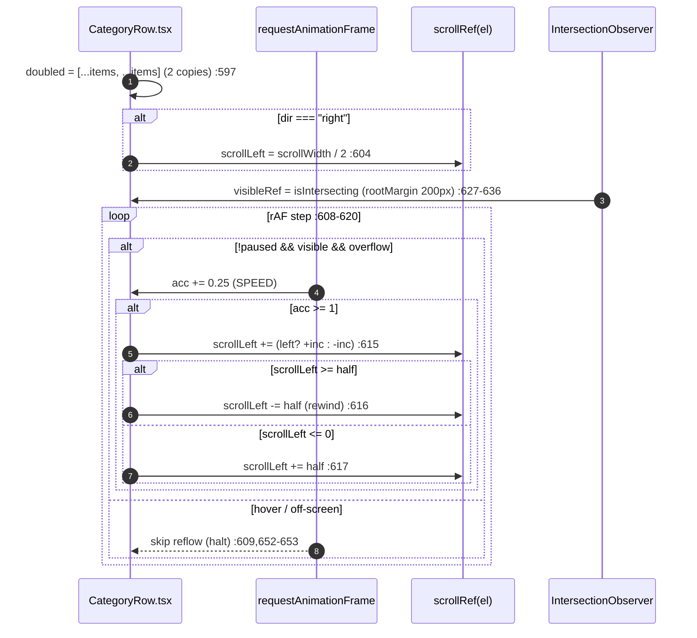

# 03. Cinema & OTT — Detailed Specification

> This document was written by reading the actual code (no guessing). All behaviors/contracts cite file:line evidence below.
> Key sources:
> - `src/app/components/Cinema.tsx` (shared Cinema/OTT component, branches via `tier` prop)
> - `src/app/components/Ott.tsx` (OTT-only redesigned screen)
> - `src/app/components/VideoRowCarousel.tsx` (Netflix-style horizontal row)
> - `src/app/components/CoverFlow.tsx` (cylindrical carousel signature UI)
> - `src/app/components/TrendingHeroSection.tsx` (rank 1–10 carousel)
> - `supabase/phase31_carousel_genre_likes.sql` (4 RPCs + `v_available_videos` view)
> - `supabase/genre_based_rows.sql` (`get_videos_by_genre`)
> - `supabase/content_policy_v2.sql` (length-gating trigger `classify_video_placement`)
> - `src/app/utils/brandColors.ts` (genre styles), `src/app/data/genres.ts` (genre SSOT)
> - `src/app/hooks/useAgeRatings.ts`, `src/app/hooks/useSeriesCounts.ts`

---

## 1. Overview / Purpose (Cinema vs OTT differences: length gating / UI)

CREAITE's video consumption screens follow a length-based 3-tier model (Home/Cinema/OTT), split into two corners: **Cinema** and **OTT**. Classification is decided automatically by a DB trigger on upload (`supabase/content_policy_v2.sql:38-87`).

| Tier | Length gating (visibility threshold) | Component | UI concept | Tone |
|---|---|---|---|---|
| Cinema | ≥ 60s (1 min) → `show_on_cinema=true` (`content_policy_v2.sql:49,75`) | `Cinema.tsx` (`tier="cinema"`) | Horizontal row carousels + CoverFlow signature + trending hero | Light bg (`bg-background`) |
| OTT | ≥ 600s (10 min) → `show_on_ott=true` (`content_policy_v2.sql:50,78`) | `Ott.tsx` | Full-bleed hero billboard + time-band mood programming + alternating-direction marquee rows | Black bg (`bg-black`) |

- Both corners source visible videos from the `v_available_videos` view (public + non-hidden) (`phase31_carousel_genre_likes.sql:30-59`).
- Cinema can render both cinema/ott modes from one component via the `tier` prop (`Cinema.tsx:107,153,192`), but the actual OTT tab uses the separately redesigned `Ott.tsx` (time-band programming, marquee, full-bleed hero are `Ott.tsx`-only). The `tier="ott"` path of `Cinema.tsx` is an OTT variant with the same layout as Cinema (only the title/emoji changes to 👑, `Cinema.tsx:341`).
- Purpose: the longer the content (= closer to a "work"), the more immersive the UI. Cinema is for discovery/browsing (many rows); OTT is for viewing/programming (mood programming + auto-flow).

> Note (inconsistency memo): The DB trigger's Cinema threshold is **60s** (`content_policy_v2.sql:49`), but the showcase Mock synthesis filter screens Cinema at **180s** (`src/app/utils/showcase.ts:46-48`). Also, `VideoRowCarousel`'s OTT badge judges by the client setting `ottMinSeconds` (default 600) (`VideoRowCarousel.tsx:309,382`). Real-data visibility gating uses the DB (60/600s); only the on-screen badge/Mock use different thresholds.

---

## 2. User Stories

- (Viewer) Entering the Cinema tab, rows for Recommended, Trending, New, Best of the Month, by-format, and by-genre scroll horizontally on one screen.
- (Viewer) The cylindrical CoverFlow at the top of Cinema auto-rotates; clicking the center card goes to detail.
- (Logged-in user) As likes/watch history accumulate, the "For You" row reorders by my taste (category weights) (`phase31_carousel_genre_likes.sql:117-156`).
- (Viewer) Entering the OTT tab, the top trending work auto-plays full-bleed (muted) and cycles to the next work every 20 seconds (`Ott.tsx:204-213`).
- (Viewer) OTT reorders genre rows to match **the current access time** (e.g., horror/thriller first at dawn, `Ott.tsx:119-139`).
- (Viewer) OTT genre rows slowly auto-flow left/right without interaction and pause on hover (`Ott.tsx:599-624,652-653`).
- (Minor/Unverified) 19+ works have blurred thumbnails and a lock icon (`AgeBadge.tsx:48-50`, `Ott.tsx:182-186`).
- (User) Hovering any card reveals play/cart/like buttons; clicking like toggles it (`VideoRowCarousel.tsx:103-136`).
- (Beta) Rows/empty genres lacking videos are padded up to 8 cells with "Register a video" beta cards (`config/beta.ts:11-14`).

---

## 3. Screens & State

### 3.1 Cinema layout (`Cinema.tsx:335-486`)
Top → bottom:
1. Header (emoji 🎬/👑 + title/subtitle, sticky) — `Cinema.tsx:338-347`
2. Event banner board (only when an active event exists) — `Cinema.tsx:350-352`
3. **CoverFlow** cylindrical carousel (only when heroVideos exist) — `Cinema.tsx:356-368`
4. Recommended (For You) `VideoRowCarousel` — `Cinema.tsx:371-381`
5. Trending (24h) `TrendingHeroSection` — `Cinema.tsx:384-391`
6. New Additions `VideoRowCarousel` — `Cinema.tsx:394-401`
7. Best of the Month (30 days) `VideoRowCarousel` — `Cinema.tsx:404-412`
8. Format category (top = animation) — `Cinema.tsx:415-425`
9. By genre (excluding "Other") — `Cinema.tsx:428-438`
10. Format category (bottom = documentary, music video) — `Cinema.tsx:441-451`
11. Other genre (very end) — `Cinema.tsx:454-464`
12. This week's TOP creators — `Cinema.tsx:467-471`
13. (When all empty) Empty state — `Cinema.tsx:474-482`
14. Footer — `Cinema.tsx:484`

### 3.2 OTT layout (`Ott.tsx:345-405`)
1. **Full-bleed single hero billboard** (`heroes.length>0`) — `Ott.tsx:352-362`, `HeroBillboard` (`Ott.tsx:413-557`)
2. Time-band mood programming header (emoji + band name + tagline) — `Ott.tsx:365-375`
3. **Category marquee rows** (alternating direction) — `Ott.tsx:378-401`, `CategoryRow` (`Ott.tsx:563-791`)
   - Order: format (top) → genre (excl. Other, time-band sorted) → format (bottom) → Other (`Ott.tsx:380-385`)
4. Footer — `Ott.tsx:403`

### 3.3 State (loading / empty / partial failure)

**Loading**
- Cinema: if no snapshot in module cache, `loading=true` (`Cinema.tsx:162`) → centered spinner + Footer (`Cinema.tsx:324-333`). On cache hit, data shows from the first render (spinner skipped).
- OTT: same pattern (`Ott.tsx:160`) → only the spinner color is `#a78bfa` (`Ott.tsx:325-334`).

**Empty state**
- Cinema: if Recommended/Trending/New are all 0, Film icon + notice (`Cinema.tsx:474-482`). Individual rows handle it via `emptyMessage` (`VideoRowCarousel.tsx:329-342`) / `TrendingHeroSection` (`TrendingHeroSection.tsx:84-95`).
- OTT: if `heroes.length===0 && genreRows.length===0`, a single "no videos" message (`Ott.tsx:336-343`). If even some rows exist, only those rows render. If the marquee area is entirely empty, `ott.noGenreContent` (`Ott.tsx:398-400`).

**Partial failure**
- Cinema: `Promise.allSettled` so even if one RPC fails the rest fill in (failed = empty data) (`Cinema.tsx:211-234`).
- OTT: each RPC safely wrapped with `.catch(()=>null)` then `Promise.all` (`Ott.tsx:264-280`).
- Both: when displaying cache (snap exists), background-refresh failures are silently ignored without a toast (`Cinema.tsx:296-297`, `Ott.tsx:315-316`).

---

## 4. Behavior Flow

### 4.1 Row composition (Cinema data load)
`Cinema.tsx:209-302` `loadAll()`:
1. Call all at once with `Promise.allSettled`: 1 Recommended + 1 Trending (24h) + 1 New (14d) + 1 Trending (720h = 30 days) + 3 format categories (anime/doc/MV) + 11 genres (`Cinema.tsx:211-224`).
2. Extract only fulfilled results via `rpcData()` (`Cinema.tsx:227`).
3. `popPool` = Recommended + New + all category videos sorted by likes (`Cinema.tsx:242-246`).
4. `fillPopular(base, target)` fills each row with popular videos without duplicates (`Cinema.tsx:248-258`).
5. After per-row merge/filter, write to module cache + setState (`Cinema.tsx:261-293`).

### 4.2 CoverFlow rotation/drag (`CoverFlow.tsx`)
- `heroVideos` = top 11 deduped from Recommended + Trending + New + top10 (`Cinema.tsx:316-321`) → mapped via `toCoverFlowVideo` (`Cinema.tsx:66-81,322`).
- `anglePerItem = 360/videos.length` (`CoverFlow.tsx:55`); each item uses `translate3d + rotateY` (`CoverFlow.tsx:319-330`).
- **Auto-rotate**: per-frame `rotation -= 0.12` via `requestAnimationFrame` (`CoverFlow.tsx:332-358`). setState skipped when off-screen / tab hidden (`CoverFlow.tsx:335`).
- **Drag**: mouse/touch `down→move→up` with `rotation = startRotation + diff/2` (`CoverFlow.tsx:236-292`). Moving ≥ 5px sets `hasDraggedRef=true` to ignore the click (`CoverFlow.tsx:206-209,251-253`).
- **Auto-rotate resumes 3s after interaction**: prev/next/click/drag-end all `setTimeout(...,3000)` (`CoverFlow.tsx:185-187,197-199,231-233,262-264,289-291`).
- **Click**: clicking the center item calls `onVideoClick` first (parent routing) (`CoverFlow.tsx:211-221,457-465`). Off-center click rotates to that index (`CoverFlow.tsx:223-234`).
- Keyboard ←/→ for prev/next (`CoverFlow.tsx:294-305`).
- Arrows shown only on hover-capable devices (`CoverFlow.tsx:66-72,407`).

### 4.3 Hero 20s cycling (OTT, `Ott.tsx:204-242`)
- `heroes` = top 5 trending (falls back to genre-row videos if empty) (`Ott.tsx:204-206`).
- `heroIdx` cycles `(i+1)%length` every `setInterval(...,20000)` (`Ott.tsx:209-213`). No cycling if ≤ 1 work.
- Hero video source (`video_url`, etc.) isn't in the RPC, so it's queried separately from the `videos` table (`Ott.tsx:215-242`). `heroSrcCache` prevents re-query on each rotation (`Ott.tsx:150,219`).
- Playback priority: pre-cut `hero_clip_url` (30s clip) auto-plays if present; otherwise Bunny `preview.webp` animation; otherwise thumbnail poster (`Ott.tsx:440-443,233-236`).
- Off-screen pauses the hero video via IntersectionObserver (`Ott.tsx:453-463`).

### 4.4 Marquee auto-flow (OTT, `Ott.tsx:599-624`)
- Each row alternates dir (left/right) (`Ott.tsx:390`). If `dir==="right"`, start position is set to `scrollWidth/2` (`Ott.tsx:604`).
- rAF loop accumulates `SPEED=0.25px/frame`; when ≥ 1px accumulates, adjusts `scrollLeft` (`Ott.tsx:607-618`).
- Items duplicated into 2 copies (`doubled`) for an infinite loop, rewound at `scrollWidth/2` (`Ott.tsx:597,614-617`).
- Hover pauses via `pausedRef=true` (`Ott.tsx:652-653,609`). Off-screen skips reflow via `visibleRef=false` (`Ott.tsx:627-636,609`).
- Desktop left/right arrows for extra scroll (`Ott.tsx:642-647,751-764`).

### 4.5 Age gate
- `useAgeRatings` looks up id→rating map; `shouldBlur(rating, ageVerified)` = `rating==="19" && !ageVerified` (`AgeBadge.tsx:48-50`).
- Own videos are gate-exempt (`isMyVideo`) (`VideoRowCarousel.tsx:380-381`, `Ott.tsx:184-185`).
- When locked, thumbnail gets `blur-xl/blur-2xl scale` + lock overlay (`VideoRowCarousel.tsx:172-179`, `Ott.tsx:522-529,690-696`). For the hero, video playback itself is blocked (`Ott.tsx:441` `useVideo = !g.isAgeLocked && ...`).

### 4.6 Likes
- The card-hover button (`VideoRowCarousel.tsx:237-244`, `TrendingHeroSection.tsx:169-176`) inserts into `video_likes`; on 23505 duplicate code it toggles via delete (`VideoRowCarousel.tsx:113-129`, `TrendingHeroSection.tsx:47-62`).
- `likingRef` prevents double-click races (`VideoRowCarousel.tsx:110-111`, `TrendingHeroSection.tsx:44-45`). Non-logged-in shows a guide toast (`VideoRowCarousel.tsx:106-109`).

---

## 5. Data / RPC Contracts

All RPCs source from `v_available_videos` (public, non-hidden, `phase31_carousel_genre_likes.sql:30-59`) and return the same column set (+ per-row extra columns). Common columns: `id text, title, thumbnail, video_url, creator, creator_id uuid, creator_display_name, creator_avatar, category, genre, ai_tool, duration, duration_seconds int, views bigint, likes int, price_standard int, highlight_start real, highlight_end real, created_at`.

### 5.1 tier filter (common to all RPCs)
```sql
(p_tier='all' OR (p_tier='cinema' AND v.show_on_cinema=true) OR (p_tier='ott' AND v.show_on_ott=true))
```
(`phase31_carousel_genre_likes.sql:109-111,195-197,239-241,334-336`; `genre_based_rows.sql:24`)

### 5.2 Per-RPC contract

| RPC | Args | Extra return | Sort | file:line |
|---|---|---|---|---|
| `get_recommended_videos` | `p_tier='all', p_limit=20` | `score numeric` | No history: `score DESC, created_at DESC` / With history: category-weighted score DESC | `phase31_...:66-157` |
| `get_trending_videos` | `p_tier='all', p_hours=24, p_limit=10` | `recent_views bigint` | `recent_views DESC, created_at DESC` (`HAVING count>0`) | `phase31_...:164-205` |
| `get_new_releases` | `p_tier='all', p_days=14, p_limit=10` | (none) | `created_at DESC` (last N days) | `phase31_...:212-244` |
| `get_videos_by_category` | `p_category, p_tier='all', p_limit=10` | (none) | `created_at DESC` | `phase31_...:307-339` |
| `get_videos_by_genre` | `p_genre, p_tier='all', p_limit=10` | (none) | `created_at DESC` | `genre_based_rows.sql:12-28` |

Recommendation RPC details:
- Identifies user via `auth.uid()` (`phase31_...:83`). If no history (likes/valid views) or not logged in, falls back to popularity + 24h-view weighted score (`phase31_...:86-114`).
- With history, computes category score from likes (weight 2) + views (weight 1) (`phase31_...:118-133`), **excluding already-watched videos** and **own videos** (`phase31_...:134-153`).
- `SECURITY DEFINER STABLE`; only recommendation is plpgsql (`phase31_...:78-81`), the rest are `LANGUAGE sql STABLE`.

### 5.3 Caller args (actual values the client passes)

Cinema (`Cinema.tsx:211-224`):
- Recommended `{p_tier:tier, p_limit:15}`
- Trending `{p_tier:tier, p_hours:24, p_limit:10}`
- New `{p_tier:tier, p_days:14, p_limit:10}`
- Best of the Month = Trending `{p_tier:tier, p_hours:720, p_limit:10}` (30 days)
- Format category `{p_category, p_tier:tier, p_limit:50}` × 3
- Genre `{p_genre, p_tier:tier, p_limit:50}` × 11

OTT (`Ott.tsx:267-280`):
- Trending hero `{p_tier:"ott", p_hours:168, p_limit:10}` (7 days)
- Format category `{p_category, p_tier:"ott", p_limit:50}` × 3
- Genre `{p_genre, p_tier:"ott", p_limit:50}` × 11

### 5.4 CarouselVideo mapping
- `CarouselVideo` type definition: `VideoRowCarousel.tsx:27-49` (1:1 with RPC return columns, snake_case).
- `CarouselVideo → Product` (passed to detail): `toProduct()` (`Cinema.tsx:119-139`, `Ott.tsx:77-97`). **`videoUrl:""` is left empty so ProductDetail re-fetches it** (`Cinema.tsx:132`).
- `CarouselVideo → CoverFlow Video`: `toCoverFlowVideo()` (`Cinema.tsx:66-81`); if no `highlight_end`, `start+30` (`Cinema.tsx:79`).
- showcase Mock → CarouselVideo: `showcaseToCarousel()` (`Cinema.tsx:35-54`, `Ott.tsx:56-75`).
- ID collection for bulk series/age lookups: `allVideoIds` (excl. demo ids) (`Cinema.tsx:179-188`, `Ott.tsx:172-178`).

---

## 6. Business Rules

### 6.1 Length gating (DB trigger)
- `classify_video_placement()` parses `duration_seconds` on INSERT/UPDATE and sets flags (`content_policy_v2.sql:38-87`):
  - `show_on_home := true` (all)
  - `show_on_cinema := parsed >= cinema_min` (default 60s)
  - `show_on_ott := parsed >= ott_min` (default 600s)
- Thresholds are dynamically looked up from `platform_settings` (admin-adjustable) (`content_policy_v2.sql:25-32,49-50`).
- Ads: no in-content ads under 60s; pre-roll/overlay at 60s+; mid-roll at 600s+ (`content_policy_v2.sql:103-182`).

### 6.2 Time-band mood programming (OTT-only)
- 5 bands (`Ott.tsx:119-125`), selected by access time (`currentBand()` `Ott.tsx:126-133`):
  - Dawn 02–05 🌌 Horror/Thriller/SF/Fantasy
  - Morning 05–11 🌅 Documentary/Drama/Anime/Music
  - Day 11–17 ☀️ Comedy/Action/Anime/SF
  - Evening 17–21 🌆 Drama/Romance/Comedy/Fantasy
  - Night 21–02 🌙 Thriller/Romance/SF/Drama/Horror
- Genre row sort: `bandRank()` prioritizes `order`; "Other" (default) is always last (999); other known genres = 100 (`Ott.tsx:134-139,197-202`).
- Genres prioritized for the current time are emphasized with a warm signature gradient (`highlighted`) (`Ott.tsx:391,778-784`).

### 6.3 11 genres + 3 formats
- Genre SSOT: `["SF","Action","Romance","Horror","Fantasy","Thriller","Drama","Comedy","Nature/Scenery","Abstract","Other"]` (`data/genres.ts:8-10`). The upload form, Cinema, and OTT rows all use the same list/order.
- Genre emoji: `GENRE_EMOJI` (`data/genres.ts:13-26`); Cinema row titles use `genreEmoji(category)` (`Cinema.tsx:431,457`).
- Genre style (OTT label icon/gradient): `getGenreStyle()` — maps Korean→key then looks up `GENRE_STYLES`; on miss, `DEFAULT_GENRE_STYLE` (`brandColors.ts:44-188`). Nature/Scenery and Abstract were added in the 2026-06-25 missing-bug fix (`brandColors.ts:133-149`).
- Format categories (not genres, based on `category`): Animation (top), Documentary (bottom), Music Video (bottom) (`Cinema.tsx:59-63`, `Ott.tsx:107-111`). Movie/Drama/Other are excluded as they overlap with genres (`Cinema.tsx:56-58`).

### 6.4 fillPopular padding (Cinema-only)
- `popPool` = Recommended + New + all category sorted by likes (`Cinema.tsx:242-246`).
- Recommended (15) / Trending (10) / Best of the Month (10) are padded to target by popularity after real data (dedup) (`Cinema.tsx:248-266`). The New row is not padded (`Cinema.tsx:264`).
- A fallback so that rows with little view/recommendation data don't look empty during beta.

### 6.5 Series badge
- `useSeriesCounts` maps id→episode count; the "Series · N eps" badge shows **only when > 1** (`VideoRowCarousel.tsx:196-201`, `Ott.tsx:683-688`).
- No badge on age-locked videos (`VideoRowCarousel.tsx:196` `!isAgeLocked`, `Ott.tsx:683`).

### 6.6 Beta-mode padding
- `BETA_MODE=true` (`config/beta.ts:11`), `BETA_ROW_TARGET=8` (`config/beta.ts:14`).
- When an `onUpload` callback is passed, shortfalls are padded with `BetaCard` up to 8 cells and empty rows/genres are shown (`Cinema.tsx:269-280`, `Ott.tsx:288-294,590-597`, `VideoRowCarousel.tsx:314-316,399-402`).
- With 8+ real videos, 0 beta cards (auto-graduation) (`config/beta.ts:13`).

### 6.7 Price/badge display
- Price: ≤ 0 shows "License not for sale"; `isNegotiationOnly` shows "Contact for terms"; otherwise ₩price (`VideoRowCarousel.tsx:258-266`, `Ott.tsx:721-727`).
- OTT badge: `is_ott` OR `duration_seconds >= ottMinSeconds` (default 600) (`VideoRowCarousel.tsx:382`).

---

## 7. Edge Cases & Error Handling

- **Partial RPC failure**: Cinema `allSettled` (`Cinema.tsx:211-227`), OTT `.catch(()=>null)` (`Ott.tsx:264-265`) → only failed rows empty, rest normal.
- **Empty row**: with BETA OFF, `keepRow(len)= len>0` hides empty rows; with BETA ON, all shown (`Cinema.tsx:269,275,280`, `Ott.tsx:288,294,306`). Row components also return null/emptyMessage on empty arrays (`VideoRowCarousel.tsx:329`, `Ott.tsx:639`, `TrendingHeroSection.tsx:84-95`).
- **Dedup**: heroVideos `seen` Set (`Cinema.tsx:317-320`); fillPopular `seen` (`Cinema.tsx:249-255`).
- **Hero fallback (OTT)**: if trending empty, fall back to genre-row videos (`Ott.tsx:204-206`); if no `video_url`, preview.webp → thumbnail (`Ott.tsx:440-443`); skip source query for demo/showcase ids (`Ott.tsx:217`); on preview load failure, hide it to show thumbnail (`Ott.tsx:483`).
- **Genre mapping miss**: on `getGenreStyle` miss, `DEFAULT_GENRE_STYLE` (Other, last) (`brandColors.ts:187`). Key mapping covers Korean, English, and AI-prefix forms (`brandColors.ts:163-182`).
- **Stale response**: responses arriving during tier/showcase/user transitions are blocked by the `cancelled` guard (`Cinema.tsx:225,303`, `Ott.tsx:285,322`).
- **Like race**: in-flight guard (`VideoRowCarousel.tsx:110`, `TrendingHeroSection.tsx:44`); 23505 = already liked → cancel (`VideoRowCarousel.tsx:117-123`).
- **CoverFlow empty array**: if `isEmpty`, render null / prevent 0-denominator in rotation calc (`CoverFlow.tsx:54-55,84-89,402`).
- **Age map missing id**: ids absent from the response are cached as `"all"`/`0` to prevent re-requests (`useAgeRatings.ts:43`, `useSeriesCounts.ts:32`).

---

## 8. Performance

- **Parallelism**: Cinema `Promise.allSettled` of 18 RPCs at once (`Cinema.tsx:211-224`); OTT `Promise.all` in 1 round trip (3-stage waterfall removed) (`Ott.tsx:267-280`).
- **Module cache (stale-while-revalidate)**: `cinemaCache` (key=`user:tier:showcase`) (`Cinema.tsx:151,159,200-205,283`), `ottCache` (key=`showcase`) (`Ott.tsx:147,159,253-256,309`). On revisit, prior data shows instantly without a spinner, then refreshes in the background. User id is in the cache key to prevent recommendation leakage (`Cinema.tsx:157-159`).
- **memo**: `VideoCard` (`VideoRowCarousel.tsx:97`), `CategoryRow`/`HeroBillboard` (`Ott.tsx:413,563`). Handlers stabilized with `useCallback`/`useMemo` to prevent card re-render storms (`Cinema.tsx:307-313`, `Ott.tsx:189-193`).
- **Off-screen rotation/marquee halt**: CoverFlow IntersectionObserver→`visibleRef` (`CoverFlow.tsx:74-81,335`); OTT marquee `visibleRef` (`Ott.tsx:627-636,609`); hero video IO pause (`Ott.tsx:453-463`); CoverFlow also checks `document.hidden` (`CoverFlow.tsx:335`).
- **Hero RPC cache (OTT)**: `heroSrcCache` (heroId→src) prevents re-querying the same video's `video_url` every 20s rotation (`Ott.tsx:150,219,237`).
- **Bulk age/series query cache**: module-level single-source cache, RPC only for cache-miss ids, useMemo stabilization (`useAgeRatings.ts:15,26-59`, `useSeriesCounts.ts:10,16-49`).
- **Lazy images**: card thumbnails `loading="lazy"` (`VideoRowCarousel.tsx:162`, `Ott.tsx:677`).
- **Marquee float accumulation**: handles `scrollLeft` integer rounding by applying accumulated SPEED at 1px granularity (`Ott.tsx:607-618`).

---

## 9. Authorization / Security

- Visible videos come only from `v_available_videos` (public + non-hidden) (`phase31_carousel_genre_likes.sql:57-59`).
- Recommendation personalization is based on `auth.uid()`, RPC `SECURITY DEFINER` (`phase31_...:79,83`). Non-logged-in gets non-personalized fallback.
- `get_videos_by_genre` grants EXECUTE to `anon, authenticated` (`genre_based_rows.sql:28`).
- Age gate: 19+ shows blur + lock to unverified users (`AgeBadge.tsx:48-50`); own videos exempt (`Ott.tsx:184-185`, `VideoRowCarousel.tsx:380-381`).
- Likes require login (`VideoRowCarousel.tsx:106-109`), direct insert/delete on `video_likes` (relies on RLS).
- showcase Mock is hidden from admins (`utils/showcase.ts:19-23`); Mock clicks are blocked with guidance (`utils/showcase.ts:68-74`).

---

## 10. Analytics / Events

> The current code has no Cinema/OTT-screen-specific analytics event emission (no guessing — there is no tracking code in `Cinema.tsx`/`Ott.tsx`). User behavior signals rely on DB-stored data below:
- **Views**: `video_views` (`is_valid`, `occurred_at`, `watch_ratio`) is the source of trending/recommendation/continue-watching scores (`phase31_...:88-91,103-105,190-193,275-284`).
- **Likes**: `video_likes` insert/delete (`VideoRowCarousel.tsx:113-122`, `TrendingHeroSection.tsx:47-55`) → uses the auto-synced `videos.likes` column (`phase31_...:14`).
- **Console warnings (ops debugging)**: on load failure, `console.warn("[Cinema]/[Ott] load failed")` (`Cinema.tsx:295`, `Ott.tsx:314`).
- (When extended) Row impression / card click / hero impression events are not implemented — needs adding.

---

## 11. Acceptance Criteria (checklist)

- [ ] Cinema tab: renders in order CoverFlow + Recommended/Trending/New/BestOfMonth/Format/Genre("Other" last)/TOP creators (`Cinema.tsx:356-471`).
- [ ] Cinema 18 RPCs called in parallel; one failure keeps the rest of the rows normal (`Cinema.tsx:211-227`).
- [ ] Recommended row: personalized when logged in + has history, else popularity fallback; always fillPopular up to 15 (`Cinema.tsx:261`, `phase31_...:93-156`).
- [ ] CoverFlow auto-rotates, resumes 3s after interaction, center click navigates to detail (`CoverFlow.tsx:178-234,332-358`).
- [ ] CoverFlow/marquee/hero video halt when off-screen (`CoverFlow.tsx:335`, `Ott.tsx:609,453-463`).
- [ ] OTT hero: top 5 trending cycle every 20s; clip auto-plays if present, else preview/thumbnail (`Ott.tsx:204-242,440-443`).
- [ ] OTT genre rows sorted by mood order matching access time, "Other" last (`Ott.tsx:197-202,134-139`).
- [ ] OTT marquee alternating-direction auto-flow, pauses on hover (`Ott.tsx:390,599-624,652-653`).
- [ ] 19+ videos show blur + lock to unverified users; own videos exempt (`AgeBadge.tsx:48-50`, `Ott.tsx:184-185`).
- [ ] "Series · N eps" badge only on videos with episode count > 1 (`VideoRowCarousel.tsx:196`, `Ott.tsx:683`).
- [ ] Like toggle consistent under double-clicks (insert→23505→delete) (`VideoRowCarousel.tsx:113-129`).
- [ ] Length gating: only 60s+ in Cinema, only 600s+ in OTT (`content_policy_v2.sql:75,78`).
- [ ] BETA_MODE ON: empty/short rows padded to 8 cells with beta cards (`config/beta.ts`, `Cinema.tsx:269-280`).
- [ ] On tab revisit, cache shows instantly without spinner then refreshes in background (`Cinema.tsx:200-205`, `Ott.tsx:253-256`).
- [ ] On account switch, the previous user's recommendations don't leak (user id in cache key) (`Cinema.tsx:157-159`).

---

## 12. Known Constraints / Carryover

- **No virtualization**: Cinema mounts all of 11 genres + 3 formats + 4 curated rows into the DOM, each row holding up to 50 cards (+ beta) (`Cinema.tsx:221-223`). As rows/cards grow, virtual scrolling (windowing) is needed.
- **CoverFlow RAF**: auto-rotate triggers React re-renders via per-frame `setRotation` (`CoverFlow.tsx:335-344`). Off-screen/tab-hidden guards exist (`CoverFlow.tsx:335`) but it re-renders constantly while visible — room to refactor to drive CSS transform directly (ref).
- **OTT marquee rAF**: each row runs an independent rAF loop (`Ott.tsx:601-624`). Off-screen reflow skipping exists, but costs accumulate with many visible rows.
- **showcase/DB threshold mismatch**: showcase Mock uses a 180s Cinema basis (`utils/showcase.ts:47`) while real data uses 60s (`content_policy_v2.sql:49`) — no impact currently since Mock is disabled (`SHOWCASE_ENABLED=false`, `utils/showcase.ts:11`), but needs alignment if re-enabled.
- **Continue Watching unused**: `get_continue_watching` RPC exists (`phase31_...:251-300`) but is not called from Cinema/OTT screens (mentioned in header comment, `Cinema.tsx:6`).
- **CoverFlow internal modal dead code**: `onVideoClick` is always injected (`Cinema.tsx:365`), so the internal video modal/license tab (`CoverFlow.tsx:540-730`) is unreachable from the Cinema path.

---

## Wireframes (text mockups)

> ASCII mockups based on the actual component structure (no guessing; cites file:line above). Card widths/margins are conceptual.

### Cinema (`Cinema.tsx:335-486`)

```
┌──────────────────────────────────────────────────────────────────────┐
│ 🎬 Cinema          From shorts to features, discover works  (sticky)  │  ← header 338-347
├──────────────────────────────────────────────────────────────────────┤
│ [ Event banner board ]   (only when an active event exists)           │  ← 350-352
├──────────────────────────────────────────────────────────────────────┤
│                                                                        │
│                    ╭─────── CoverFlow (cylindrical) ───────╮           │  ← 356-368
│              ╭───╮ │       ╭─────────╮       │ ╭───╮                    │
│        ◀     │ ▒ │ │       │  CENTER  │      │ │ ▒ │     ▶              │
│       (←/→)  ╰───╯ │       │▶ click→detail│   │ ╰───╯  (hover only)     │
│                    ╰─── auto-rotate -0.12°/frame ───╯                   │
│        · drag(>5px=ignore click) · auto-rotate resumes 3s after        │
│                                                                        │
├──────────────────────────────────────────────────────────────────────┤
│ ✨ For You                                              ◀  ▶           │  ← 371-381
│ ┌────┐┌────┐┌────┐┌────┐┌────┐┌────┐  → horizontal scroll (max 15)    │
│ │card││card││card││card││card││card│    hover: ▶ 🛒 ♥                  │
│ └────┘└────┘└────┘└────┘└────┘└────┘                                  │
├──────────────────────────────────────────────────────────────────────┤
│ 🔥 Trending Now (24h)        [TrendingHeroSection: rank 1~10 carousel] │  ← 384-391
│  ①┌────┐ ②┌────┐ ③┌────┐ …  (large rank number overlay)               │
│    └────┘   └────┘   └────┘                                            │
├──────────────────────────────────────────────────────────────────────┤
│ 🆕 New Additions (14d)         ┌────┐┌────┐┌────┐ …                    │  ← 394-401
│ 🏆 Best of the Month (30d)     ┌────┐┌────┐┌────┐ …                    │  ← 404-412
│ 📺 Animation (format top)      ┌────┐┌────┐┌────┐ …                    │  ← 415-425
│ 🚀 SF · ⚔ Action · 💗 Romance … (11 genres, "Other" excluded)         │  ← 428-438
│ 🎬 Documentary · 🎵 Music Video (format bottom)                        │  ← 441-451
│ 📦 Other (genre, very end)     ┌────┐┌────┐ …                          │  ← 454-464
│ 👑 This Week's TOP Creators    ┌──┐┌──┐┌──┐ …                          │  ← 467-471
├──────────────────────────────────────────────────────────────────────┤
│                          [ Footer ]                                    │  ← 484
└──────────────────────────────────────────────────────────────────────┘

(when all empty)  ▶ 🎞 Film icon + "No works registered yet" notice  ← 474-482
```

### OTT (`Ott.tsx:345-405`, black background)

```
┌══════════════════════════════════════════════════════════════════════┐
│                                                                      ░│
│ ░░░ HERO BILLBOARD (full-bleed, top 5 heroes cycle every 20s) ░░░░░░░░ │  ← 352-362 / HeroBillboard 413-557
│ ░                                                                    ░│
│ ░   [auto-play: hero_clip_url 30s → preview.webp → thumbnail poster] ░│  ← 440-443
│ ░                                                                    ░│
│ ░   👑 Work Title (large)                                            ░│
│ ░   genre · length · ₩price                                          ░│
│ ░   [ ▶ Play ]  [ + My List ]                       ● ○ ○ ○ ○        ░│  ← indicators(heroIdx)
│ ░░░░░░░░░░░░░░░░░░░░░░░░░░ (bottom gradient fade) ░░░░░░░░░░░░░░░░░░░░░ │
├──────────────────────────────────────────────────────────────────────┤
│ 🌙 Night Cinema           Thriller, Romance, SF for the night         │  ← time-band header 365-375
│    (emoji + band name + tagline, currentBand() by access time)         │
├──────────────────────────────────────────────────────────────────────┤
│  CategoryRow (marquee, alternating dir) — pause on hover, off-screen   │  ← 378-401 / CategoryRow 563-791
│                                              reflow skipped            │
│  [format top]  Animation                                               │
│   ──▶ ┌──┐┌──┐┌──┐┌──┐┌──┐┌──┐ …      (dir=left, 0.25px/frame)        │
│  ◀──         Thriller (highlighted, warm gradient)  [format·genre alt] │
│        … ┌──┐┌──┐┌──┐┌──┐┌──┐┌──┐ ──   (dir=right, scrollLeft=½ start) │
│   ──▶ ┌──┐┌──┐┌──┐ …      Romance                                      │
│  ◀──        … (11 genres, bandRank time-band sort, "Other" last)       │
│        ◀ ▶  (desktop left/right arrows, shown on hover)                │
├──────────────────────────────────────────────────────────────────────┤
│                          [ Footer ]                                    │  ← 403
└══════════════════════════════════════════════════════════════════════┘

(heroes=0 && genreRows=0)  ▶ "No videos to show" single message  ← 336-343
```

### Age-lock card (`VideoRowCarousel.tsx:172-179`, `Ott.tsx:522-529,690-696`)

```
Normal card                       19+ locked card (unverified user)
┌───────────────┐                ┌───────────────┐
│  [clear thumb] │                │ ▒▒▒▒▒▒▒▒▒▒▒▒▒ │ ← blur-xl/2xl + scale
│               │                │ ▒▒▒  🔒  ▒▒▒ │ ← lock overlay
│ ♥ 12   ▶ 🛒   │                │ ▒▒ 19+ verify │
│ Title         │                │ ▒required▒▒▒▒ │ ← hero: video playback blocked
│ Series·3eps [badge]│            │  Title (hidden)│   (useVideo=!isAgeLocked, 441)
│ ₩ 9,900       │                └───────────────┘
└───────────────┘                ※ Own video (isMyVideo) is gate-exempt (184-185 / 380-381)
   shouldBlur = rating==="19" && !ageVerified   (AgeBadge.tsx:48-50)
```

---

## Sequence Diagrams

### Cinema load (18 RPC allSettled → fillPopular → row composition, `Cinema.tsx:209-302`)



### CoverFlow rotation / drag (`CoverFlow.tsx`)



### OTT hero 20s cycling + source loading (`Ott.tsx:204-242`)



### Marquee auto-flow (`Ott.tsx:599-624`)



---

## API / RPC Reference

All RPCs use the `v_available_videos` (public, non-hidden) view as a single source and share the same tier filter. Common return columns (all RPCs):
`id text, title, thumbnail, video_url, creator, creator_id uuid, creator_display_name, creator_avatar, category, genre, ai_tool, duration, duration_seconds int, views bigint, likes int, price_standard int, highlight_start real, highlight_end real, created_at timestamptz` (+ per-row extra columns in the table below).

### View: `v_available_videos`

| Item | Content |
|---|---|
| Definition | View exposing only public + non-hidden videos |
| Extra columns | `show_on_home`, `show_on_cinema`, `show_on_ott` (set by trigger from length) |
| file:line | `phase31_carousel_genre_likes.sql:30-59` |
| tier filter expr | `(p_tier='all' OR (p_tier='cinema' AND show_on_cinema) OR (p_tier='ott' AND show_on_ott))` |

### RPC Table

| RPC | Args (defaults) | Extra return | Sort | tier filter file:line | def file:line |
|---|---|---|---|---|---|
| `get_recommended_videos` | `p_tier='all', p_limit=20` | `score numeric` | No history/non-logged-in: `score DESC, created_at DESC` (likes×1 + 24h views×2) · With history: category-weighted (likes×2, views×1) score DESC, **excludes watched & own videos** | `:109-111` | `:64-157` |
| `get_trending_videos` | `p_tier='all', p_hours=24, p_limit=10` | `recent_views bigint` | `recent_views DESC, created_at DESC` (`HAVING count>0`, valid views in last N hours) | `:195-197` | `:164-205` |
| `get_new_releases` | `p_tier='all', p_days=14, p_limit=10` | (none) | `created_at DESC` (last N days) | `:239-241` | `:212-244` |
| `get_videos_by_category` | `p_category, p_tier='all', p_limit=10` | (none) | `created_at DESC` | `:334-336` | `:307-339` |
| `get_videos_by_genre` | `p_genre, p_tier='all', p_limit=10` | (none) | `created_at DESC` | `genre_based_rows.sql:24` | `genre_based_rows.sql:12-28` |

> Among all file:line values, unless otherwise noted the RPC def / tier-filter columns are based on `phase31_carousel_genre_likes.sql`.

### Function attributes / privileges

| RPC | LANGUAGE | Attributes | EXECUTE grant | Evidence |
|---|---|---|---|---|
| `get_recommended_videos` | plpgsql | `SECURITY DEFINER STABLE`, `auth.uid()` personalization | (RPC default) | `:78-83` |
| `get_trending_videos` | sql | `STABLE` | — | `:164-205` |
| `get_new_releases` | sql | `STABLE` | — | `:212-244` |
| `get_videos_by_category` | sql | `STABLE` | — | `:307-339` |
| `get_videos_by_genre` | sql | `STABLE` | `anon, authenticated` | `genre_based_rows.sql:28` |

### Client call args (actual passed values)

| Screen | RPC | Passed args | file:line |
|---|---|---|---|
| Cinema | Recommended | `{p_tier:tier, p_limit:15}` | `Cinema.tsx:212` |
| Cinema | Trending(24h) | `{p_tier:tier, p_hours:24, p_limit:10}` | `Cinema.tsx:213` |
| Cinema | New(14d) | `{p_tier:tier, p_days:14, p_limit:10}` | `Cinema.tsx:214` |
| Cinema | BestOfMonth(30d) | `{p_tier:tier, p_hours:720, p_limit:10}` | `Cinema.tsx:215` |
| Cinema | Format category x3 | `{p_category, p_tier:tier, p_limit:50}` | `Cinema.tsx:217-219` |
| Cinema | Genre x11 | `{p_genre, p_tier:tier, p_limit:50}` | `Cinema.tsx:221-223` |
| OTT | Trending hero(7d) | `{p_tier:"ott", p_hours:168, p_limit:10}` | `Ott.tsx:268` |
| OTT | Format category x3 | `{p_category, p_tier:"ott", p_limit:50}` | `Ott.tsx:270-272` |
| OTT | Genre x11 | `{p_genre, p_tier:"ott", p_limit:50}` | `Ott.tsx:275-277` |

---

## Test Cases

> Gherkin. Scenarios validate the behavior flows/contracts above. Acceptance criteria align with the section 11 checklist.

### Happy path

```gherkin
Feature: Cinema/OTT row rendering and interaction

  Background:
    Given v_available_videos has enough public, non-hidden videos
    And BETA_MODE and showcase states are clearly set

  Scenario: Cinema row render order
    When the user enters the Cinema tab
    Then rows render in order: CoverFlow, Recommended, Trending(24h), New(14d),
         BestOfMonth(30d), Format(top=anime), Genre(excl. Other),
         Format(bottom=doc·MV), Other genre, TOP creators   # Cinema.tsx:356-471
    And 18 RPCs are called at once via Promise.allSettled    # :211-224

  Scenario: CoverFlow auto-rotate and center click
    Given CoverFlow has 1+ heroVideos
    When no interaction occurs
    Then rotation decreases by 0.12 deg each frame (auto-rotate)   # CoverFlow.tsx:336
    When the center card is clicked
    Then it routes to the detail screen via onVideoClick           # :213
    When arrows/drag are used
    Then auto-rotate resumes 3s later                              # :231-233

  Scenario: OTT hero 20s cycling
    Given there are 2+ trending results
    When the OTT tab is entered and 20s elapse
    Then heroIdx advances to the next work via (i+1)%length        # Ott.tsx:209-213
    And the hero source is chosen as hero_clip_url -> preview.webp -> thumbnail  # :440-443

  Scenario: OTT time-band mood programming
    Given the access time is 21-02 (Night band)
    When OTT genre rows are sorted
    Then Thriller·Romance·SF·Drama·Horror are placed first         # Ott.tsx:122-125,197-202
    And the "Other" genre row always comes last (rank 999)         # :134-139

  Scenario: Marquee alternating-direction auto-flow
    When OTT category rows render
    Then each row alternates dir(left/right) and flows at 0.25px/frame  # Ott.tsx:390,607
    When the row is hovered
    Then flow halts via pausedRef=true                             # :652-653

  Scenario: Age gate
    Given a 19+ video exists and the user is unverified
    Then the thumbnail is blurred and a lock icon shows            # AgeBadge.tsx:48-50
    And for the hero, video playback itself is blocked (useVideo=false)  # Ott.tsx:441
    But if it is the user's own video (isMyVideo), the gate is exempt    # :184-185

  Scenario: Like toggle idempotency
    Given a logged-in user hovers a card
    When they click like
    Then it inserts into video_likes                              # VideoRowCarousel.tsx:113
    When they click like on the same card again (23505 duplicate)
    Then the existing like is deleted (toggled off)               # :117-129
    And the likingRef in-flight guard blocks the double-click race  # :110-111
```

### Edge cases

```gherkin
Feature: Cinema/OTT edges and fallbacks

  Scenario: Partial RPC failure
    Given 1 genre RPC out of 18 fails
    When Cinema loads
    Then allSettled treats the failure as empty data (null) and
         the remaining rows render normally                      # Cinema.tsx:225-227
    And while displaying cache (snap), background-refresh failures are ignored without a toast  # :296-297

  Scenario: Empty row handling
    Given some genre has 0 videos
    When BETA_MODE is OFF
    Then that row is hidden via keepRow(len>0)=false             # Cinema.tsx:269,275,280
    When BETA_MODE is ON
    Then the empty row is padded to 8 cells with BetaCards       # config/beta.ts:14, Cinema.tsx:269-280

  Scenario: Fully empty state
    Given Recommended/Trending/New are all 0 (Cinema)
    Then a Film icon and notice show                            # Cinema.tsx:474-482
    Given heroes=0 and genreRows=0 (OTT)
    Then a single "No videos to show" message shows             # Ott.tsx:336-343

  Scenario: Genre style mapping miss
    Given a row has an unknown category value
    When getGenreStyle fails to map
    Then it falls back to DEFAULT_GENRE_STYLE (Other, last)     # brandColors.ts:187
    And key mapping covers Korean, English, and AI-prefix forms  # :163-182

  Scenario: Hero fallback (OTT)
    Given trending results are 0
    Then heroes fall back to genreRows videos                   # Ott.tsx:204-206
    Given the hero video has no video_url
    Then it falls back to preview.webp -> thumbnail            # :440-443
    Given heroId starts with demo-/showcase
    Then the source query is skipped                           # :217
    Given preview.webp fails to load
    Then preview is hidden to expose the thumbnail             # :483

  Scenario: Stale response guard
    Given tier/showcase/user is transitioning
    When a previous request's response arrives late
    Then setState is blocked by the cancelled guard            # Cinema.tsx:225, Ott.tsx:285

  Scenario: Tab revisit cache (stale-while-revalidate)
    Given the user has viewed Cinema before (cache hit)
    When the Cinema tab is reopened
    Then prior data shows instantly without a spinner, then refreshes in background  # Cinema.tsx:200-205
    And on account switch, the cache key (user:tier:showcase) prevents prior recommendations leaking  # :157-159
```

### Acceptance criteria (summary)

- Cinema 18 RPCs in parallel; one failure keeps the rest of the rows normal.
- Recommended row personalized when logged in + has history, else popularity fallback; always fillPopular up to 15.
- CoverFlow auto-rotate / 3s resume / center click to detail / halt off-screen.
- OTT hero 20s cycle, clip/preview/thumbnail fallback, time-band mood sort ("Other" last), marquee alternating direction / pause on hover.
- 19+ unverified blur + lock, own videos exempt. Like toggle idempotent.
- Length gating: 60s+ Cinema, 600s+ OTT. With BETA ON, empty rows padded to 8 cells. Revisit cache shows instantly.
