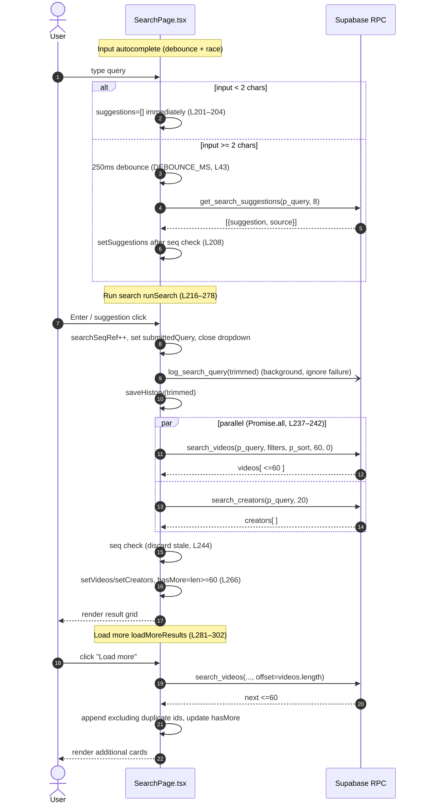
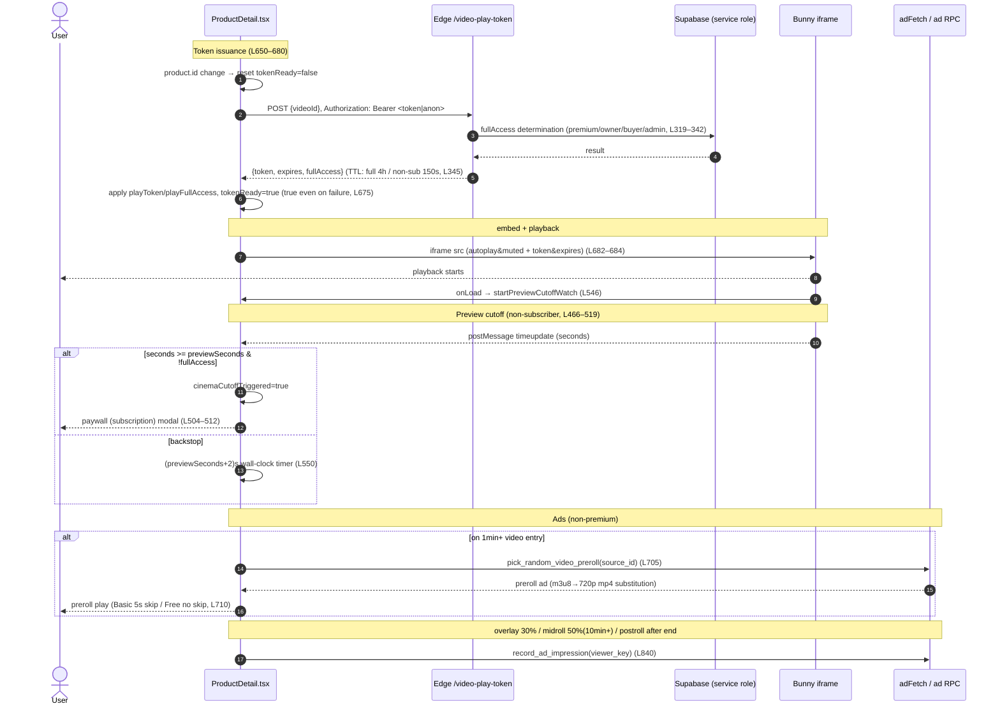
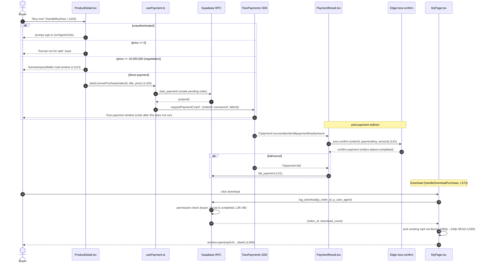

# 04. Search · Video Detail · Playback · Licensing — Detailed Spec

> This document is an in-depth spec written by reading the actual code. Every behavior/contract is grounded in the files below (file:line).
> - Search UI: `src/app/components/SearchPage.tsx`
> - Video detail / playback / ads / purchase entry: `src/app/components/ProductDetail.tsx`
> - Search RPCs: `supabase/phase12_search_enhancements.sql`
> - Play token Edge: `supabase/functions/server/index.ts` (`/video-play-token`, L311–353)
> - License pricing policy: `src/app/utils/licensePricing.ts`
> - Payment hook: `src/app/hooks/usePayment.ts`
> - Detail ad fetch/impression/click: `src/app/utils/adFetch.ts`
> - Download log RPC: `supabase/phase29_download_logs.sql` (`log_download`)
> - Download trigger UI: `src/app/components/MyPage.tsx` (`handleDownloadPurchase`, L573–607)
> - Payment confirmation: `src/app/components/PaymentResult.tsx` (`toss-confirm` call, L21·L81–88)

---

## 1. Overview / Purpose

A unified spec for the three areas that form CREAITE's core content discovery–viewing–monetization path.

1. **Unified search** — Matches videos/creators by title·tag·creator name via ilike, providing autocomplete, popular searches, search history, filters, sorting, and pagination. (`SearchPage.tsx`)
2. **Video detail + playback** — Gates the Bunny Stream iframe player with a server play token (paywall), and offers non-subscribers a 1-minute preview, ads (preroll/bumper/midroll/overlay/postroll), and continuous play. (`ProductDetail.tsx`)
3. **License purchase + download** — Charges a single-price (All-in-One) license via Toss Payments, branching to 1:1 negotiated sales for prices ≥ ₩10M. After purchase, downloads the Bunny mp4 from MyPage after a permission check. (`usePayment.ts`, `licensePricing.ts`, `log_download`)

**Goal:** Enforce server-side authorization (play token · download RPC) so premium content cannot be bypass-viewed or downloaded via URL extraction, while maximizing non-subscriber inflow (preview · ads) and payment conversion.

---

## 2. User Stories

- As a visitor, when I type 2+ characters I want to see autocomplete (title prefix/contains, creator name).
- As a visitor, when the search box is empty I want to see recent search history and live popular searches.
- As a user, I want to narrow results by category·AI tool·duration and sort by relevance/latest/views/likes.
- As a user, when there are many results I want "Load more" to continue with the next 60.
- As a non-subscriber, for any video I want a 1-minute preview followed by a subscription prompt.
- As a premium subscriber / video owner / license buyer / admin, I want to watch the full video without cutoff.
- As a viewer, when a video ends I want the next recommended video to auto-continue.
- As a buyer, I want to purchase a license instantly (bypassing the cart) and download after payment.
- As a high-value license prospect, I want a channel to negotiate with the operations team instead of direct payment.
- As an operator, in a sharing dispute I want to trace who/when/which browser downloaded.

---

## 3. Screens & States

### 3.1 Search (`SearchPage.tsx`)

- **Search input header** (L383–521): sticky top, search input + close (when onClose present) + filter toggle button.
- **Autocomplete / history / popular dropdown** (L420–506):
  - Input ≥2 chars → render `suggestions` (badge shown if source is `creator`, L440–442).
  - Input <2 chars → render `history` (recent search, individual X · clear all) + `popular` (popular, rank · hit_count).
  - Dropdown visibility: `showDropdown && (input≥2 ? suggestions>0 : history>0 || popular>0)` (L421).
- **Filter panel** (L524–557): `FilterChips` for category (`CATEGORY_OPTIONS`, L94) · AI tool (`AI_TOOL_OPTIONS`, L95–99) · duration (`DURATION_OPTIONS`, L100–106).
- **Tabs + sort** (L560–595): `videos`/`creators` tabs (each shows result count), sort select (`SORT_OPTIONS`, L107–112). Creators tab is disabled without `submittedQuery` (L573).
- **Results area** (L599–652):
  - Loading: spinner (L600–603).
  - Initial state (`showInitialState`, L378): `EmptyInitial` — popular searches Top5 (L780–808).
  - Empty video results: `EmptyResult` (L607–608).
  - Video grid: 2/3/4-column responsive `VideoCard` (L611–626) + "Load more" button (L627–637).
  - Creator results: `CreatorRow` list (L645–649) or `EmptyResult` (subject=creator).

**State variables** (L141–172): `query`, `submittedQuery`, `tab`, `category`/`aiTool`/`durationIdx`/`sort`/`showFilters`, `videos`/`creators`/`loading`/`hasMore`/`loadingMore`, `suggestions`/`history`/`popular`/`showDropdown`. Race guards `searchSeqRef`·`suggestSeqRef` (L171–172), debounce `debounceRef` (L170).

### 3.2 Video detail (`ProductDetail.tsx`)

- **Player area** (L1193–1390, aspect-video, max-h 40vh mobile / 65vh desktop):
  - If `iframeBlocked`, paywall block screen (blurred thumbnail + subscription CTA, L1194–1228).
  - If `bunnyEmbedUrl` present, iframe (L1229–1240, `loading="eager"`, `onLoad={startPreviewCutoffWatch}`).
  - If `!tokenReady`, thumbnail + loading spinner (L1241–1252).
  - Otherwise (token issued · no embed URL), "Cannot play" notice (L1253–1265).
  - Overlay/midroll/postroll/bumper/preroll ad slots (L1270–1327), continuous play `NextVideoOverlay` (L1329–1341), AUTOPLAY indicator (L1343–1349), duration badge (L1352–1354), sponsor badge (L1356–1372), 1-minute preview badge + close X (L1374–1389).
- **Meta area**: title/age badge/duration/views/likes/OTT badge (L1396–1429), creator (avatar·name·follow·edit) (L1430–1465).
- **Header actions**: non-subscriber "Subscribe to watch full" CTA (L1470–1485) + like/comment/share/save/report 5 circles (L1487–1558).
- **Synopsis + side meta** (L1562–1594), **series episode list** (L1597–1644), **chapter list** (L1647–1671), **subtitle notice** (L1674–1679).
- **License card** (L1682–1831): if sellable (`isLicensable`), single-price box + 9 benefits + cart/buy (or negotiation inquiry), withdrawal notice; if not for sale (₩0), greyed-out disabled card.
- **Tags** (L1836–1850), **cinema credits** (L1853–1903), **AI production details** (L1906–1937), **source·license** (L1940–1957), **watched-together content carousel** (L1963–1974).
- **Comment panel**: desktop side panel (L1979–1998) / mobile sheet (L2001–2020).
- **Modals**: subscription (L2025–2030), report (L2033–2040), video edit (owner, L2043–2086), age gate (L2089–2099) · 19+ lock overlay (L2102–2118), share (L2121–2128), playlist (L2131–2143).

---

## 4. Behavior Flows

### 4.1 Search flow

- **Autocomplete (debounce + race)** (L199–214): `query` change → 250ms (`DEBOUNCE_MS`, L43) debounce → call `get_search_suggestions`. `suggestSeqRef` discards late-arriving prior input (L208). If input <2 chars, clear immediately (L201–204).
- **Run search `runSearch`** (L216–278):
  1. Increment `searchSeqRef`, set `submittedQuery`, close dropdown (L217–220).
  2. If trimmed query exists, `saveHistory` (L223) + background `log_search_query` call (failures ignored, L226).
  3. Build `rpcParams`: `p_query/p_sort/p_limit=60/p_offset=0` + (only when not "all") `p_category/p_ai_tool/p_min_duration/p_max_duration` (L231–235).
  4. Parallel `search_videos` + (only when query present) `search_creators` via `Promise.all` (L237–242).
  5. **Race guard**: discard results if `seq !== searchSeqRef.current` (L244).
  6. Set results. If showcase (admin), filter mock by query and merge (L254–264). `hasMore` = RPC raw length ≥60 (L266).
- **Auto re-search on filter/sort change** (L311–316): `runSearch(submittedQuery)` only when `submittedQuery!=="" || hasActiveFilter`.
- **Initial query auto-search** (L319–322): if `initialQuery` present, once on mount.
- **Load more `loadMoreResults`** (L281–302): call next 60 with `p_offset=videos.length`, append **excluding duplicate ids** (L293–296), update `hasMore`.

### 4.2 Detail: token issue → iframe → playback → cutoff → ads → continuous play

- **Play token issuance** (L650–680): on `product.id` change, reset `tokenReady=false` then POST `PLAY_TOKEN_ENDPOINT` (L48).
  - Headers: `apikey` (anon), `Authorization: Bearer <session access_token || anonKey>` (L661–665).
  - Map response `{token, expires, fullAccess}` to `playToken`·`playFullAccess` (L670–671). Even on failure, finish with `tokenReady=true` (L675).
- **Embed URL construction** (L682–684): generated only when `BUNNY_LIBRARY_ID && product.id && tokenReady`. `autoplay=true&loop=false&muted=true&preload=true&responsive=true` + (if token) `&token=...&expires=...`. If token is null, play without token (seamless transition, L647).
- **Preview cutoff** (L466–519, reinforced L521–556):
  - `needsPreviewCutoff = durationSeconds > previewSeconds && !isSubscriber && !playFullAccess` (L450).
  - Subscribe to `timeupdate` via player.js `postMessage`; on `seconds >= previewSeconds`, `cinemaCutoffTriggered=true` + paywall modal (L504–512). **Based on video time**, so seeking jumps are blocked immediately too (L465).
  - Reinforcement: per iframe `onLoad`, `startPreviewCutoffWatch` — 400ms×10 active re-subscribe to handle ready race (L546–549) + `(previewSeconds+2)s` wall-clock backstop (L550–554).
- **Ads**:
  - **Preroll** (L689–730): on video change for 1min+ & non-premium videos, one `pick_random_video_preroll` RPC. m3u8→720p mp4 substitution (L712–714). basic skips after 5s, otherwise no skip (L710). If preroll caught, bumper cancelled (L967).
  - **Bumper** (L945–964): right after start for non-premium, `fetchAdForVideo(...,'bumper')`, basic=5s skip / free=no skip (L959), main pauses.
  - **Overlay** (L780–854): 1min+, fetch from 25%, on ad's `trigger_position_pct` (default 30%) show bottom banner + `recordAdImpression` (L840–843).
  - **Midroll** (L857–922): 10min+ (`minDurationForMidroll`||600) & non-subscriber, fetch from 48%, on `trigger_position_pct` (default 50%) pause main + fullscreen ad (L908–911).
  - **Postroll** (L1049–1057): after video ends, for non-subscriber `fetchAdForVideo(...,'postroll')`; in ad-end callback show `NextVideoOverlay`.
- **Continuous play** (L982–1098): subscribe to player.js `ended` (+`timeupdate` fallback 0.6s before end) → `triggerNext` (L1008): similar→trending(24h)→new(30d) 3-stage fallback to pick next video (L1013–1038) → (non-subscriber) after postroll → `NextVideoOverlay` 8s countdown (L1333).

### 4.3 Purchase flow: start_payment → Toss → confirm → download

- **Instant buy `handleBuyNow`** (L1104–1137):
  1. If unauthenticated, `onSignInClick` (L1105–1108).
  2. If `price<=0`, "license not for sale" toast (L1109–1112).
  3. If `isNegotiationOnly(price)`, open mail via `licenseInquiryMailto` (L1113–1117).
  4. `startLicensePurchase` (L1121–1127) — on success, redirect to Toss payment window (code after this does not execute). Handle cancel (`USER_CANCEL`)/failure (L1129–1136).
- **Payment SDK flow `usePayment.ts`**:
  - `start_payment` RPC creates pending order + issues `orderId` (L36–45) → throws on failure.
  - `loadTossPayments` → `requestPayment("card", {...})` (L48–60), `successUrl=/?payment=success`, `failUrl=/?payment=fail`.
  - `startLicensePurchase` (L104–119): `paymentType:"license"`, `orderName:"License — <title>"`, `targetId:videoId`.
- **Payment confirmation `PaymentResult.tsx`**: on success redirect, call `toss-confirm` Edge with `orderId/paymentKey/amount` (L21·L81–88). On fail/cancel redirect, `fail_payment` RPC (L51).
- **Download `MyPage.handleDownloadPurchase`** (L573–607):
  1. `log_download(p_order_id, p_user_agent=navigator.userAgent)` (L577–580) — permission check + log INSERT + returns `video_id`.
  2. On Bunny host (`VITE_BUNNY_HOSTNAME`||`vz-<libId>.b-cdn.net`, L585), HEAD requests in 1080p→240p order to pick an mp4 that actually exists (L589–597).
  3. `window.open(mp4Url, '_blank', 'noopener,noreferrer')` + success toast (L599–600). Cross-origin may ignore `<a download>`, so new-tab approach (L572).

---

## 5. Data / RPC Contracts

### 5.1 Search RPCs (`phase12_search_enhancements.sql`)

- **`search_videos`** (L145–250) — Args: `p_query=''`, `p_category=NULL`, `p_ai_tool=NULL`, `p_min_duration/p_max_duration=NULL`, `p_max_price=NULL`, `p_sort='relevance'`, `p_limit=30`, `p_offset=0`. Returns (L156–175): `id,title,thumbnail,video_url,creator,creator_id,creator_display_name,creator_avatar,category,tags,ai_tool,duration,duration_seconds,views_count,likes,price_standard,created_at,match_score`. Source is the `v_available_videos` view (hidden/private pre-excluded). match_score: title prefix=3 / title contains=2 / tag·creator contains=1 (L208–215). Sorting via per-`p_sort` CASE (L227–243). `SECURITY DEFINER STABLE`.
- **`search_creators`** (L255–286) — Args: `p_query`, `p_limit=20`. Returns: `creator_id,display_name,avatar_url,bio,video_count,follower_count`. `display_name` ilike + `is_suspended=false` (L282–283), order by follower→video count (L284). Empty query (`lq=''`) yields no results (L281).
- **`get_search_suggestions`** (L97–140) — Args: `p_query`, `p_limit=8`. Returns: `suggestion,source('title'|'creator')`. UNION of title prefix(rank1)/contains(rank2)/creator contains(rank3), then `DISTINCT ON (lower(suggestion))` keeping best rank, sorted rank→alphabetical (L133–139, prefix-on-top guarantee — 2026-06-25 bugfix comment).
- **`get_popular_searches`** (L72–92) — Args: `p_limit=10`, `p_days=7`. Returns: `query,hit_count`. Aggregates lower(query) over `search_logs` last N days, ordered hit_count→recency (L85–91).
- **`log_search_query`** (L49–64) — Args: `p_query`. INSERTs only 2–100 chars (with `auth.uid()`), ignores others (L59–61). `SECURITY DEFINER`.
- **`search_logs` table** (L24–43): `query` 2–100 char CHECK, RLS allows own SELECT only, INSERT only via RPC (L40–44).

### 5.2 Play token Edge (`/video-play-token`, `index.ts` L311–353)

- **Request**: POST body `{videoId}`. Header `Authorization: Bearer <token>` (optional).
- **Response**: `{token, expires, fullAccess}`.
  - `BUNNY_TOKEN_AUTH_KEY` unset → `{token:null, expires:null, fullAccess:false}` (L317, seamless transition).
  - `fullAccess` determination (L319–342): among authenticated users, ① premium (tier='premium' & expires in future) or is_admin (L328–331), ② video owner (`videos.creator_id===user.id`, L333–335), ③ license buyer (`orders` buyer_id+video_id+status='completed', L337–339).
  - **TTL**: 4 hours if `fullAccess`, else 150 seconds (L345). `expires=now+ttl` (seconds), `token=sha256Hex(securityKey+videoId+expires)` (L346–347).
- Client mapping (L670–671): `playToken={token,expires}`, `playFullAccess=!!fullAccess`.

### 5.3 Pricing / Licensing (`licensePricing.ts`)

- `LICENSE_DIRECT_MAX = 10_000_000` (L9) — direct-payment cap (below this).
- `isNegotiationOnly(price)` (L12–14) — true if `price >= 10,000,000`.
- `licenseInquiryMailto(title, price)` (L17–25) — pre-filled mail link to `support@creaite.net`.

### 5.4 Download (`log_download`, `phase29_download_logs.sql` L63–106)

- Args: `p_order_id uuid`, `p_user_agent text=NULL`. Returns: `video_id text, download_count integer`.
- Permission check: `orders.id=p_order_id AND buyer_id=auth.uid() AND status='completed'` (L85–89). Exception otherwise (L91–93). Exception if not logged in (L80–82).
- INSERT into `download_logs` (L96–97), then return cumulative download count for that order (L100–104). `SECURITY DEFINER`, `GRANT ... TO authenticated` (L108).
- `download_logs` table (L30–47): order/video/user FK + user_agent + downloaded_at. RLS allows own SELECT only (L54–57), INSERT only via RPC.

### 5.5 Detail ad RPCs (`adFetch.ts`)

- `fetchAdForVideo(videoId, format)` (L30–57) — `get_ad_for_video(p_video_id, p_format)` returns 1, **1-min TTL module cache** (caches null too, L26–51).
- `recordAdImpression(...)` (L59–79) — `record_ad_impression` (position/completed/skipped + `p_viewer_key`=session key, L74).
- `recordAdClick(...)` (L81–92) — `record_ad_click`.
- Preroll uses a separate RPC `pick_random_video_preroll(p_source_video_id)` (ProductDetail L705).

---

## 6. Business Rules

- **Unified 1-minute preview** (policy v2, ProductDetail L50): non-subscribers get a 1-minute preview on every video (`cinemaPreviewSeconds`, dynamic, fallback 60s L53·443). OTT also gets a 1-minute preview instead of immediate block (card shows 🔒 premium badge, L451).
- **Full-access exemption**: premium · owner · license buyer · admin (server `/video-play-token` determination L328–339, client exempts cutoff via `playFullAccess` L450).
- **Age gate** (Phase 26): if `age_rating==='19'` & unauthenticated & non-owner, auto gate on entry (L365–367) + 19+ lock overlay (L2102). Search cards also get 19+ blur+lock (SearchPage L724–732).
- **Per-tier token TTL**: full-access 4 hours / non-subscriber 150 seconds (index.ts L345). 150s covers the 1-minute preview while blocking long-form bypass viewing after URL extraction.
- **Single price / negotiated sale**: single-price (All-in-One) license. ≥ ₩10M cannot be paid directly due to Toss limits → 1:1 negotiated sale (licensePricing.ts L1–14, ProductDetail L1745–1756).
- **₩0 videos not for sale**: `isLicensable = price>0` (L441). ₩0 is free-view only, greyed-out not-for-sale card (L1817–1830).
- **Ad tier policy**: Premium=no ads / Basic=skip after 5s / Free=no skip (preroll L710, bumper L959). Midroll·postroll exclude subscribers (`isSubscriber`) (L865·1050).
- **Withdrawal restriction**: notice that withdrawal is restricted once download/viewing starts (E-commerce Act Art. 17, below the pay button L1797–1803).
- **No sale under 3 minutes**: no forced gate found in this code path — presumed an upload-side rule, not implemented in this area (see detail §12). ※ Needs verification.

---

## 7. Edge Cases & Error Handling

- **Empty search query**: `runSearch('')` does not call creators and returns `[]` (L239–241). `search_videos` with empty query (`v_lq=''`) returns all with match_score=0 (filters only, sql L218).
- **Search race**: both autocomplete and search discard late-arriving responses via seq guard (L208·244). `finally` also calls `setLoading(false)` only when the latest seq (L276).
- **Search failure**: on `search_videos` error, toast + clear results (L246–250); `search_creators` error silently `[]` (L269–271).
- **Token issue failure/cold start**: even on fetch exception, keep `token=null` and `tokenReady=true` (L673–676) → attempt to play without token. While Token Auth is inactive, token is always null (index.ts L317).
- **UI during token issuance**: if `!tokenReady`, show thumbnail+spinner instead of block screen (L1241–1252).
- **Prevent simultaneous ad display**: if preroll caught, cancel bumper (L967); hide overlay while midroll shown (L1271); hide sponsor badge during bumper/midroll/postroll (L929). During video transitions, block stale ads via `cancelled` guard (L835·904).
- **player.js ready race**: subscribe timeupdate via 3-layer defense — ready event + active re-subscribe (interval) + immediate attempt (cutoff L526–549, other slots `setTimeout(subscribe,500)`).
- **Videos where ended doesn't fire**: fallback detect 0.6s before end via `timeupdate` (L1084–1090).
- **No subtitles/chapters**: conditional render on `videoMeta.chapters.length>0` / `subtitle_url` → section hidden if absent (L1647·1674).
- **No download mp4**: if all-resolution HEAD fails, throw "encoding in progress" error (L598).
- **showcase merge**: only admin (`shouldShowShowcase`) appends mock results filtered by query (L168·254–264).

---

## 8. Performance

- **Search debounce 250ms** + seq guard prevents excessive RPCs · result flicker (L43·199–214).
- **Pagination**: 60-unit offset, append with duplicate id Set removal (L281–302).
- **Bulk age-rating lookup**: one `useAgeRatings(allVideoIds)` for cards (L376), excluding demo- prefix (L373).
- **visible filter useMemo**: memoize blocked-user filter so it isn't recomputed on every keystroke (L362–369).
- **iframe `loading="eager"`** (L1233): load immediately when token ready — minimizes playback start delay.
- **Ad 1-min cache** (adFetch L26–51): removes duplicate `get_ad_for_video` calls on re-watch (caches null too).
- **Playback start delay factors**: ① token Edge round-trip (cold start possible) → tokenReady gate, ② preroll/bumper ads fullscreen before main, ③ player.js ready wait. Token is re-issued per `product.id` every time (no prefetch — §12).

---

## 9. Permissions / Security

- **Playback paywall**: server issues per-permission token TTL (150s/4h, index.ts L345). When Bunny Embed Token Auth is active, no token = no playback → blocks URL-extraction bypass (comment L646).
- **Embed token auth**: `token=sha256Hex(securityKey+videoId+expires)` (L347) — securityKey is a server env var, not exposed to client.
- **Server-side fullAccess determination**: premium/owner/buyer/admin all verified directly in DB via admin client (service role) (L324–339) — not client-spoofable.
- **Hidden/private leak prevention**: search queries only the `v_available_videos` view (sql L216·278) → hidden/private videos don't appear in results. `search_creators` excludes `is_suspended` (L283).
- **Download ownership verification**: `log_download` verifies `buyer_id=auth.uid() & status='completed'` inside the RPC (L85–93); `download_logs` INSERT only via SECURITY DEFINER RPC (no RLS INSERT policy).
- **Detail meta fetch**: direct `videos` table select (L303–315) relies on RLS — private-video protection is the table RLS's responsibility (this component does no separate check). ※ Verification recommended.

---

## 10. Analytics / Events

- **Search log**: `log_search_query(trimmed)` in background on search (failures ignored, L226) → `search_logs` → `get_popular_searches` aggregation.
- **Views**: on paywall-passed viewing, one `trackVideoView` at 30% reach (L620–623); even if below, record on unmount if 5s+ (L630–632). Refresh count on detail entry (L362–363).
- **Downloads**: `log_download` accumulates into `download_logs` + returns cumulative count (basis for dispute tracing, phase29 L46–47).
- **Ads**: `record_ad_impression` (viewer_key dedup) / `record_ad_click` (adFetch L59–92).

---

## 11. Acceptance Criteria (checklist)

- [ ] On 2+ chars, autocomplete shows after 250ms; rapid consecutive input does not let a prior response overwrite the latest.
- [ ] When input is cleared, recent searches (individual/clear-all behavior) + popular searches are shown.
- [ ] Category·AI tool·duration filters + 4 sorts trigger auto re-search.
- [ ] "Load more" appends in 60-unit batches without duplicates; button disappears when <60.
- [ ] Hidden·private·suspended-user videos don't appear in search results/creators.
- [ ] Non-subscriber: on any video, exactly 1 minute (or dynamic previewSeconds) point AND seeking jumps are both blocked with subscription modal.
- [ ] Premium/owner/license buyer/admin: full viewing without cutoff (server fullAccess=true).
- [ ] During token issue delay, show thumbnail+spinner (not block screen); auto-play after issuance.
- [ ] 19+ video unauthenticated entry triggers age gate + lock overlay.
- [ ] Ads: Free no skip / Basic 5s skip / Premium no ads. preroll·bumper not shown simultaneously.
- [ ] At video end, next-recommended (3-stage fallback) overlay 8s countdown; non-subscriber shown after postroll.
- [ ] ₩0 video is a disabled license card (not purchasable); ≥ ₩10M is a 1:1 inquiry button.
- [ ] Instant buy → start_payment (issue orderId) → Toss payment window → success → toss-confirm handled.
- [ ] Only completed orders are downloadable (log_download permission check); incomplete/others' orders raise exception.
- [ ] On download, the highest-resolution mp4 that actually exists opens in a new tab.

---

## 12. Known Constraints / Carry-overs

- **No token prefetch**: token is synchronously issued on every entry per `product.id` (L650–680) — playback start delay on Edge cold start. Prefetching the next candidate's token from the previous video is not implemented.
- **Bunny Token Auth inactive stage**: if `BUNNY_TOKEN_AUTH_KEY` is unset, play without token at token=null (index.ts L317) — i.e., until the key is set, the playback paywall relies only on the client cutoff (player.js). Download mp4 URLs are also public until just before launch (phase29 L17–21 security-model comment).
- **Download cross-origin**: new-tab open due to `<a download>` not supported → user needs right-click-save guidance (L572).
- **VAST deprecation history**: Bunny iframe `vastTagUrl` deprecated as it couldn't apply the sub-1-minute block policy; switched to a custom ad component (policy v4, L639–643).
- **No-sale-under-3-minutes rule**: no forced gate found in this area's code — presumed an upload/registration-stage rule. Application location needs confirmation (template-specified item, marked ※ in this spec §6).
- **Detail meta direct select relies on RLS**: private-video protection depends on `videos` table RLS — policy verification recommended (§9).
- **Search matching method**: ilike partial match (suited to Korean, sql L12); no morphological/typo correction or synonyms.

---

## 13. Wireframes (text mockups)

> ASCII mockups. Simplified representations of the actual component (`SearchPage.tsx`, `ProductDetail.tsx`) structure, indicating areas/states rather than coordinates.

### 13.1 Search — autocomplete dropdown (input ≥2 chars, L420–506)

```
+--------------------------------------------------------------+
| [<-]  [ space pup|py                     ] [X]   [ Filter ⚙ ]|  sticky header
+--------------------------------------------------------------+
| ┌──────────────────────────────────────────────────────┐    |
| │ 🔎 space puppy adventure                              │    |  suggestion(title prefix)
| │ 🔎 puppy daily vlog                                   │    |  suggestion(title contains)
| │ 🔎 PuppyCreator                  [Creator]            │    |  source='creator' → badge
| │ 🔎 space documentary                                  │    |
| └──────────────────────────────────────────────────────┘    |  ≤8 (p_limit=8)
+--------------------------------------------------------------+
```

### 13.2 Search — empty input (history + popular, L420–506, <2 chars)

```
+--------------------------------------------------------------+
| [<-]  [                                  ] [ ] [ Filter ⚙ ]  |
+--------------------------------------------------------------+
| ┌── Recent searches ────────────────────  [Clear all] ───┐  |
| │  🕘 space puppy                                 [×]     │  |  history (individual X)
| │  🕘 cyberpunk city                              [×]     │  |
| └────────────────────────────────────────────────────────┘  |
| ┌── Popular searches ─────────────────────────────────────┐  |
| │  1  AI film          (1,204)                            │  |  popular(rank·hit_count)
| │  2  music video      (   980)                           │  |
| │  3  vlog             (   742)                           │  |
| └────────────────────────────────────────────────────────┘  |
+--------------------------------------------------------------+
```

### 13.3 Search — results (tabs + sort + filter chips + grid + load more)

```
+--------------------------------------------------------------+
| [<-]  [ space puppy                       ] [X] [ Filter ⚙ ] |
+--------------------------------------------------------------+
| Filter panel (when filter toggled, L524–557)                |
|  Category: (All)(Film)(MV)(Vlog)...        ← FilterChips    |
|  AI tool : (All)(Sora)(Runway)(Higgsfield)...              |
|  Duration: (All)(~1m)(1~5m)(5~10m)(10m+)                   |
+--------------------------------------------------------------+
|  [ Videos (37) ]  [ Creators (4) ]      Sort:[ Relevance ▼ ]|  tabs+sort(L560–595)
+--------------------------------------------------------------+
|  ┌────────┐ ┌────────┐ ┌────────┐ ┌────────┐               |
|  │ thumb  │ │ thumb  │ │ thumb  │ │ thumb  │   VideoCard   |  2/3/4-col responsive
|  │ 03:21  │ │ 12:40  │ │ 🔒19+  │ │ 01:05  │               |
|  │ title..│ │ title..│ │ ▓▓▓▓▓  │ │ title..│               |  19+ blur+lock
|  └────────┘ └────────┘ └────────┘ └────────┘               |
|        ...  (60-unit)  ...                                   |
|              [  Load more  ]                                 |  only when hasMore(L627)
+--------------------------------------------------------------+
```

### 13.4 Search — empty results / initial state

```
Initial(showInitialState, L378)          Video results 0(EmptyResult, L607)
+----------------------------+           +----------------------------+
|   🔥 Popular searches Top5 |           |          (   )             |
|   1. AI film               |           |   No search results        |
|   2. music video           |           |   Try a different keyword  |
|   3. vlog                  |           +----------------------------+
|   4. cyberpunk             |
|   5. documentary           |           Creators 0(EmptyResult, subject=creator)
+----------------------------+           +----------------------------+
                                         |  No matching creators      |
                                         +----------------------------+
```

### 13.5 Video detail — player + meta + license + comments + related

```
+======================== Video Detail ========================+
| ┌──────────────────────── Player ─────────────────────────┐ |
| │  [ Bunny iframe playback area (aspect-video) ]          │ |  L1193–1390
| │                                          [dur 12:40]    │ |  duration badge(L1352)
| │                          ┌─────────────────────────┐    │ |
| │                          │ ⏱ Preview 1min · [close×]│   │ |  preview badge(L1374)
| │                          └─────────────────────────┘    │ |
| └──────────────────────────────────────────────────────────┘ |
|  Title (12) 12:40  · 12K views · ♥ 340   [OTT]              |  meta(L1396)
|  ┌ avatar CreatorName  [Follow]                             |  creator(L1430)
|  ┌──────────────── non-subscriber CTA ───────────┐          |
|  │   Subscribe to watch full  →                  │          |  L1470 (non-subscriber)
|  └────────────────────────────────────────────────┘         |
|   (♥like) (💬comment) (↗share) (🔖save) (🚩report)         |  5 circles(L1487)
|  ── Synopsis ────────────────────────────  side meta       |  L1562
|  ── Series episodes / chapters / subtitle notice ──        |  L1597/1647/1674
| ┌──────────────── License card ──────────────────┐         |  L1682–1831
| │  All-in-One license           ₩ 1,200,000       │         |
| │  ✓ Commercial use ✓ Perpetual ✓ Edits ... (9)   │         |
| │  [ Cart ]         [ Buy now ]                    │         |  isLicensable
| │  * Withdrawal restricted once download/view starts│       |  L1797
| └──────────────────────────────────────────────────┘        |
|   #tags #tags   · cinema credits · AI details · source     |  L1836~1957
| ┌──── Watched-together content (carousel) ────┐             |  L1963
| │ [▢][▢][▢][▢] →                              │             |
| └──────────────────────────────────────────────┘            |
+------------------ Comment panel (side/sheet) ----------------+  L1979/2001
```

Not-for-sale (₩0) license card:
```
┌──────────────── License card (disabled) ─────────────┐
│  This video does not sell a license (grey)            │  L1817–1830
└────────────────────────────────────────────────────────┘
```

### 13.6 Preroll ad (1min+ & non-premium, L689–730)

```
+================== Player (main paused) =====================+
|                                                            |
|         [  preroll ad mp4 (720p) playing  ]                |
|                                                            |
|   Basic: after 5s →  [ Skip ▷ ]    (Free: no skip)         |  L710
|                                            [Sponsor]       |
+------------------------------------------------------------+
        (ad ends → main auto-plays, bumper cancelled L967)
```

---

## 14. Sequence Diagrams

### 14.1 Search (debounce autocomplete / submit / load more)



### 14.2 Detail playback (token issue → iframe → preview cutoff → ads)



### 14.3 License purchase (start_payment → Toss → confirm → download)



---

## 15. API / RPC / Edge Reference

### 15.1 Search RPCs (`supabase/phase12_search_enhancements.sql`)

| Name | Args | Returns | Permission | Location (file:line) |
|---|---|---|---|---|
| `search_videos` | `p_query=''`, `p_category=NULL`, `p_ai_tool=NULL`, `p_min_duration/p_max_duration=NULL`, `p_max_price=NULL`, `p_sort='relevance'`, `p_limit=30`, `p_offset=0` | `id,title,thumbnail,video_url,creator,creator_id,creator_display_name,creator_avatar,category,tags,ai_tool,duration,duration_seconds,views_count,likes,price_standard,created_at,match_score` | `SECURITY DEFINER STABLE` (anon/authenticated). `v_available_videos` view excludes hidden/private | `phase12_search_enhancements.sql:145-250` |
| `search_creators` | `p_query`, `p_limit=20` | `creator_id,display_name,avatar_url,bio,video_count,follower_count` | `SECURITY DEFINER`. `is_suspended=false` only, empty query → no results | `phase12_search_enhancements.sql:255-286` |
| `get_search_suggestions` | `p_query`, `p_limit=8` | `suggestion,source('title'\|'creator')` | `SECURITY DEFINER`. DISTINCT ON best rank, prefix on top | `phase12_search_enhancements.sql:97-140` |
| `get_popular_searches` | `p_limit=10`, `p_days=7` | `query,hit_count` | `SECURITY DEFINER`. Aggregates `search_logs` last N days | `phase12_search_enhancements.sql:72-92` |
| `log_search_query` | `p_query` | (void) | `SECURITY DEFINER`. INSERTs only 2–100 chars with `auth.uid()` | `phase12_search_enhancements.sql:49-64` |

Client call sites:
- `get_search_suggestions` — `SearchPage.tsx:199-214` (250ms debounce, suggestSeqRef race guard)
- `search_videos` + `search_creators` — `SearchPage.tsx:237-242` (Promise.all), load more `SearchPage.tsx:281-302`
- `log_search_query` — `SearchPage.tsx:226` (background, ignore failure)
- `get_popular_searches` — popular/initial-state render (`SearchPage.tsx:780-808`)

### 15.2 Play token Edge (`supabase/functions/server/index.ts`)

| Name | Args | Returns | Permission | Location (file:line) |
|---|---|---|---|---|
| `POST /video-play-token` | body `{videoId}`, header `Authorization: Bearer <token>` (optional) | `{token, expires, fullAccess}` | Public endpoint (no-verify-jwt). Only `fullAccess` determination uses service-role DB queries | `index.ts:311-353` |

Determination·TTL details:
- `BUNNY_TOKEN_AUTH_KEY` unset → `{token:null, expires:null, fullAccess:false}` (`index.ts:317`)
- fullAccess = premium/admin (`:328-331`) ∨ owner (`:333-335`) ∨ license buyer (`:337-339`)
- TTL = full-access 4 hours / non-subscriber 150s (`:345`), `token=sha256Hex(securityKey+videoId+expires)` (`:346-347`)
- Client issue call: `ProductDetail.tsx:650-680`, mapping `:670-671`

### 15.3 Payment / Download RPC·Edge

| Name | Args | Returns | Permission | Location (file:line) |
|---|---|---|---|---|
| `start_payment` (RPC) | (order params: paymentType, orderName, targetId, amount, etc.) | `{orderId}` (pending order) | `authenticated` | call `usePayment.ts:36-45`, license wrapper `usePayment.ts:104-119` |
| `requestPayment` (TossPayments SDK) | `"card", {orderId, orderName, successUrl=/?payment=success, failUrl=/?payment=fail}` | (redirect) | client SDK | `usePayment.ts:48-60` |
| `POST toss-confirm` (Edge) | `{orderId, paymentKey, amount}` | confirm payment (orders.status=completed) | handles success redirect | call `PaymentResult.tsx:21, 81-88` |
| `fail_payment` (RPC) | (orderId, etc.) | mark order failed | fail/cancel redirect | `PaymentResult.tsx:51` |
| `log_download` (RPC) | `p_order_id uuid`, `p_user_agent text=NULL` | `video_id text, download_count integer` | `SECURITY DEFINER`, `GRANT ... TO authenticated`. Internal permission check (buyer_id=uid & completed) | `phase29_download_logs.sql:63-106`, call `MyPage.tsx:573-607` |

Entry branching (`ProductDetail.handleBuyNow`, `:1104-1137`):
- unauthenticated→`onSignInClick` (`:1105-1108`) / `price<=0`→toast (`:1109-1112`) / `isNegotiationOnly`→mail (`:1113-1117`) / direct payment→`startLicensePurchase` (`:1121-1127`)

### 15.4 Detail ad RPCs (`src/app/utils/adFetch.ts` and more)

| Name | Args | Returns | Permission | Location (file:line) |
|---|---|---|---|---|
| `get_ad_for_video` (RPC) | `p_video_id`, `p_format` | 1 ad | 1-min TTL module cache (caches null too) | `adFetch.ts:30-57` (cache `:26-51`) |
| `record_ad_impression` (RPC) | position/completed/skipped + `p_viewer_key` (session key) | (void) | viewer_key dedup | `adFetch.ts:59-79` |
| `record_ad_click` (RPC) | (ad/viewer identifiers) | (void) | — | `adFetch.ts:81-92` |
| `pick_random_video_preroll` (RPC) | `p_source_video_id` | preroll ad video | called on 1min+ & non-premium | `ProductDetail.tsx:705` |

### 15.5 Pricing / Licensing (`src/app/utils/licensePricing.ts`)

| Name | Args | Returns | Location (file:line) |
|---|---|---|---|
| `LICENSE_DIRECT_MAX` | (constant) | `10_000_000` (direct-payment cap, below this) | `licensePricing.ts:9` |
| `isNegotiationOnly(price)` | `price` | `price >= 10,000,000` → true | `licensePricing.ts:12-14` |
| `licenseInquiryMailto(title, price)` | `title, price` | pre-filled mail link to `support@creaite.net` | `licensePricing.ts:17-25` |

---

## 16. Test Cases (Gherkin)

### 16.1 Search

```gherkin
Feature: Unified search

  Scenario: Autocomplete shows correctly
    Given the user is on the search page
    When they type "space" in the search box
    And 250ms pass
    Then get_search_suggestions(p_query="space", p_limit=8) is called once
    And title prefixes appear on top, creator items show a "Creator" badge
    And up to 8 suggestions are shown

  Scenario: History + popular when input is empty
    Given the user has previously searched "cyberpunk"
    When they clear the search box
    Then "cyberpunk" appears in recent searches with an [×] button
    And popular searches appear with rank·hit_count
    When they press "Clear all"
    Then the recent searches list disappears

  Scenario: Auto re-search on filter + sort
    Given results are shown for query "puppy"
    When they select category="vlog", duration="1~5m", sort="latest"
    Then runSearch is re-called with p_category/p_min_duration/p_max_duration/p_sort="latest"
    And only matching results are shown

  Scenario: Load-more pagination
    Given search results number 60 with hasMore=true
    When they press "Load more"
    Then search_videos is called with p_offset=60
    And the next batch is appended without duplicate ids
    And if returned count is < 60, the "Load more" button disappears
```

### 16.2 Playback / Paywall

```gherkin
Feature: Video playback paywall

  Scenario: Non-subscriber 1-minute preview cutoff
    Given a non-subscriber entered a 12:40 video (fullAccess=false)
    When playback time reaches previewSeconds (default 60s)
    Then cinemaCutoffTriggered=true and the subscription paywall modal is shown

  Scenario: Seeking jumps are also blocked
    Given a non-subscriber is watching a preview video
    When they jump the slider to the 5-minute point
    Then video-time-based cutoff fires immediately and blocks

  Scenario: Full-access exemption
    Given a premium subscriber (or owner/buyer/admin) entered
    When the server returns fullAccess=true
    Then they watch the full video without cutoff
    And the token TTL is issued as 4 hours

  Scenario Outline: Ad tier policy
    Given a <tier> user watches a 1min+ video
    When a preroll ad plays
    Then the <skip> behavior applies
    Examples:
      | tier    | skip               |
      | premium | no ads             |
      | basic   | skip after 5s      |
      | free    | no skip            |

  Scenario: UI during token issue delay
    Given the token Edge response is delayed by cold start (tokenReady=false)
    Then a thumbnail + loading spinner is shown, not a block screen
    When issuance completes
    Then the iframe loads and auto-plays

  Scenario: Re-issue gate on token TTL expiry
    Given a non-subscriber token was issued with 150s TTL
    When they cover the 1-min preview but then attempt long-form bypass afterwards
    Then URL-extraction playback is blocked by token expiry (when Token Auth active)
```

### 16.3 Purchase / Download

```gherkin
Feature: License purchase and download

  Scenario: Instant buy happy path
    Given a logged-in user is on a ₩1,200,000 license video
    When they press "Buy now"
    Then start_payment creates a pending order and orderId
    And the Toss payment window (requestPayment "card") opens
    When payment succeeds and redirects to /?payment=success
    Then PaymentResult calls toss-confirm to mark the order completed

  Scenario: Only completed orders are downloadable
    Given the user holds a completed order
    When they press download in MyPage
    Then log_download(p_order_id, navigator.userAgent) passes the permission check
    And video_id and download_count are returned and a log is recorded
    And the highest-resolution mp4 that exists opens in a new tab

  Scenario: Incomplete/others' order download denied
    Given the user targets an order with status!=completed or owned by someone else
    When log_download is called
    Then the permission check fails with an exception and nothing downloads

  Scenario: ₩0 video / negotiated sale branching
    Given a video price is ₩0
    Then the license card is shown greyed-out/disabled and purchase is blocked
    Given a video price is ₩10,000,000 or higher
    When they press "Buy now"
    Then isNegotiationOnly=true opens the licenseInquiryMailto mail window
```

### 16.4 Edge Cases

```gherkin
Feature: Edge cases

  Scenario: Empty-query search
    When runSearch('') is run with an empty query
    Then search_creators is not called and creators=[]
    And search_videos returns all (filters only applied) with match_score=0

  Scenario: Search race condition
    Given the user rapidly types "s" → "sp" → "spa"
    When an earlier request arrives later than the latest one
    Then the seq guard (searchSeqRef/suggestSeqRef) discards the stale response
    And only the latest input's results are shown

  Scenario: Token issue failure fallback
    Given the token Edge call fails with an exception
    Then token=null is kept and tokenReady=true is finalized
    And playback is attempted without a token (Token Auth inactive stage)

  Scenario: Prevent simultaneous ad display
    Given a preroll ad was caught
    Then the bumper is cancelled
    Given a midroll is being shown
    Then the overlay banner and sponsor badge are hidden
    Given the video is transitioning
    Then stale ads are blocked by the cancelled guard

  Scenario: Negotiation-only price blocks direct payment
    Given the price is ₩10,000,000 or higher
    When direct payment is attempted
    Then it branches to the negotiation mail window, not the Toss payment window

  Scenario: No download mp4
    Given all-resolution HEAD requests fail
    Then an "encoding in progress" error is shown and no new tab opens
```

### 16.5 Acceptance Criteria (summary)

- [ ] Autocomplete: ≥2 chars · 250ms · seq guard (no stale overwrite) · ≤8 · creator badge.
- [ ] Empty input: recent searches (individual/clear-all) + popular searches (rank·hit_count).
- [ ] Auto re-search on filter/sort change; load more 60-unit · no duplicates · button gone when <60.
- [ ] Hidden/private/suspended-user results not shown.
- [ ] Non-subscriber exactly 1 minute (or previewSeconds) + seeking jump blocked + paywall.
- [ ] Full-access (premium/owner/buyer/admin) cutoff-exempt, token 4h.
- [ ] During token delay, thumbnail+spinner, auto-play after issuance.
- [ ] Ads Free no-skip / Basic 5s / Premium none, preroll·bumper not simultaneous.
- [ ] Instant buy start_payment(orderId)→Toss→toss-confirm confirmation.
- [ ] Only completed orders pass log_download, mp4 new tab, ₩0 disabled · ≥ ₩10M negotiation branch.
