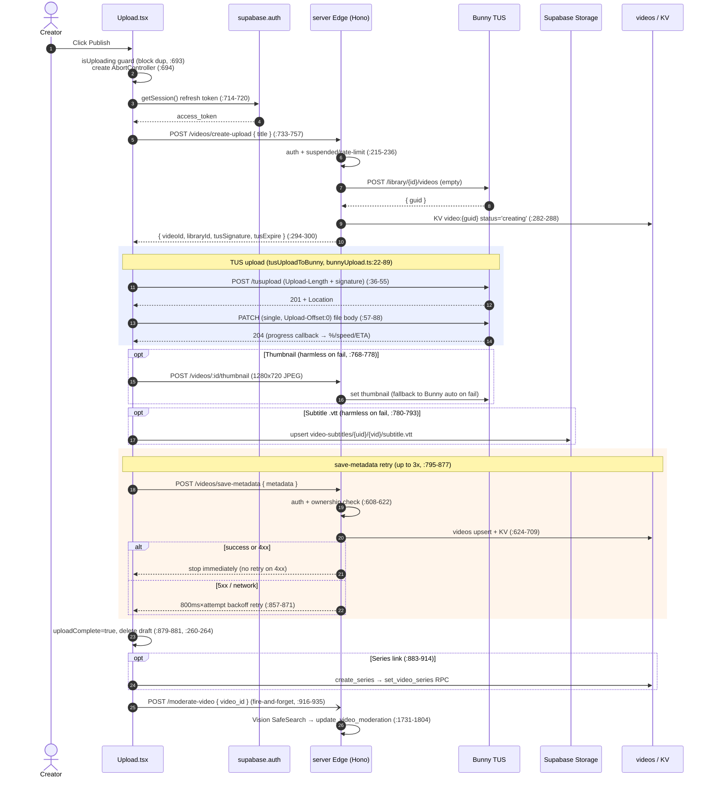
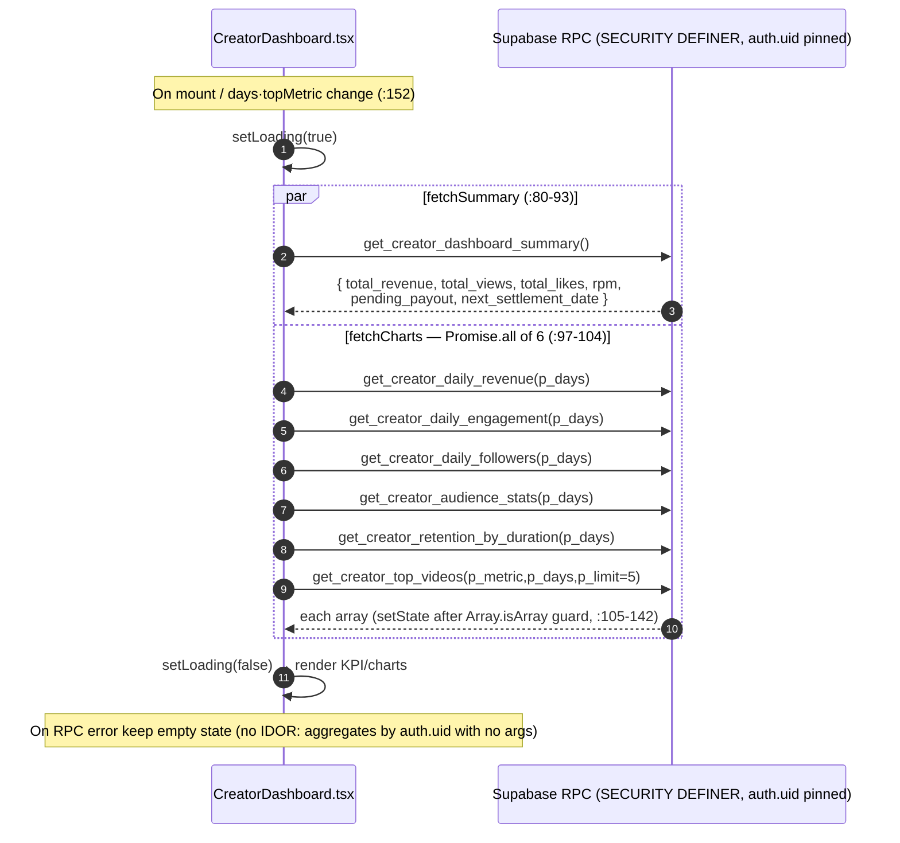

# 05. Upload · Creator Dashboard — Detailed Spec

> This document was written **by reading the actual code**. Every behavior/contract cites a `file:line` source.
> Key files:
> - Upload UI/orchestration: `src/app/components/Upload.tsx`
> - Bunny TUS uploader: `src/app/utils/bunnyUpload.ts`
> - Edge Function (Hono): `supabase/functions/server/index.ts`
>   - `create-upload` (`index.ts:197`), `save-metadata` (`index.ts:582`), `moderate-video` (`index.ts:1679`), thumbnail proxy (`index.ts:358`), subtitle transcribe (`index.ts:502`)
> - Dashboard UI: `src/app/components/CreatorDashboard.tsx`
> - Dashboard RPCs: `supabase/phase21_creator_dashboard.sql`, `supabase/phase20_creator_analytics.sql`
> - IDOR/stats security RPCs: `supabase/high_fixes_20260614.sql`
> - Suspended-account write block: `supabase/block_suspended_writes_20260625.sql`
> - Genre SSOT: `src/app/data/genres.ts`

---

## 1. Overview / Purpose

### 1.1 Upload
A 3-step wizard for creators to register AI videos on CREAITE. Core design principles:

- **Library key never exposed**: The Edge Function used to hand the Bunny library API Key to the client for direct PUT, but that key could delete/alter every video in the library, so it was removed. The client now uploads only with a server-generated **TUS presigned signature** (`SHA256(libraryId+apiKey+expire+videoId)`) (`bunnyUpload.ts:1-11`, `index.ts:290-300`).
- **Two-stage save**: (1) upload the video body to Bunny (TUS) → (2) save metadata to the Supabase `videos` table + KV (`save-metadata`). These are separate calls, so logic exists to prevent "orphan videos" (present in Bunny but absent from the DB) (`Upload.tsx:853-877`).
- **Content policy v2**: uploads under 30s are blocked; under 3 minutes (180s) cannot be sold for license (shown only in the free, ad-supported tier).

### 1.2 Creator Dashboard / Analytics
Placed at the top of the MyPage Sales tab, the creator's own channel KPI/trend/Top/retention analytics (`CreatorDashboard.tsx:1-4`). All data is aggregated only for the caller via `SECURITY DEFINER` RPCs keyed on `auth.uid()`, so IDOR is impossible. Split into two phases:
- **Phase 21** (`phase21_creator_dashboard.sql`): 4 cumulative KPIs + daily revenue + daily views/likes + settlement notice.
- **Phase 20** (`phase20_creator_analytics.sql`): audience stats (watch ratio, completion, unique) + Top videos + daily followers + retention by length bucket.

---

## 2. User Stories

- **US-1 (no-login entry)**: A logged-out user entering the upload tab sees, instead of a login wall, a screen with the "3 revenue sources (80%/50-60%/50%) + one-click social login" (`Upload.tsx:475-549`).
- **US-2 (file select)**: Choosing a video auto-measures duration/resolution, auto-extracts 3 thumbnail candidate frames, and auto-sets a default highlight range (`Upload.tsx:298-450`).
- **US-3 (info entry)**: Fill title/description/category/genre/age rating/AI tool/resolution/duration, and optionally series, AI evidence, cinema metadata, sponsorship, tags (`Upload.tsx:1344-1917`).
- **US-4 (price/visibility)**: Set visibility (public/unlisted/private) and a single price. Under 3 minutes shows a "license sale not allowed" notice instead of a price field (`Upload.tsx:1959-2069`).
- **US-5 (preview → publish)**: Final confirmation via a market-card simulation modal, then upload (`Upload.tsx:2100-2244`).
- **US-6 (resume draft)**: Leaving mid-edit auto-saves the draft to localStorage; on return a "continue editing" toast appears (`Upload.tsx:204-264`).
- **US-7 (channel analytics)**: The creator views revenue/views/likes/followers trends, Top videos, and completion by length with a 7/14/30-day toggle (`CreatorDashboard.tsx:239-422`).

---

## 3. Screens & States

### 3.1 Upload — step-by-step form
The progress bar has 3 steps (`Upload.tsx:1099-1123`).

**Step 1 — File select + thumbnail/highlight** (`Upload.tsx:1126-1342`)
- Drag/click dropzone (`accept="video/*,.mp4,.mov,.avi"`, `Upload.tsx:1128-1166`).
- Thumbnail picker grid: 3 auto-extracted frames (start/middle/end) + custom image upload (`Upload.tsx:1168-1237`).
- Highlight range marking: preview video + dual-thumb slider (5-30s constraint) + "preview highlight" button (`Upload.tsx:1239-1325`).
- "Next" is disabled without `selectedFile` (`Upload.tsx:1333-1340`).

**Step 2 — Content info** (`Upload.tsx:1344-1917`)
- Title (60-char counter, `Upload.tsx:1346-1362`), description (500-char counter, `:1364-1381`).
- Category/genre select (`:1383-1415`), series select (`:1417-1454`), age rating 4 buttons (`:1456-1489`), AI tool (`:1491-1505`), resolution/duration (`:1507-1536`).
- Collapsible sections (details): AI production evidence (prompt/seed, `:1538-1581`), cinema metadata (director/writer/composer/year/cast/language/subtitle language + .vtt upload, `:1583-1719`), admin-only license/source (`:1721-1792`), sponsorship/support (`:1794-1853`).
- Tag chip input (max 10, `:1855-1897`).

**Step 3 — Price/visibility/progress/done** (`Upload.tsx:1919-2097`)
- Progress card while uploading: %, 3-way split of progress/speed/remaining (`:1921-1957`).
- Visibility radios (3) (`:1959-1998`).
- Price: under 3 min shows a lock notice, otherwise single price input (≥₩10M shows negotiated-sale notice, `:2000-2053`).
- Copyright pledge checkbox (`:2055-2069`), submit button (`:2081-2094`).

**Preview modal**: market-card simulation + summary of visibility/highlight/category-genre/price/credits/tags (`Upload.tsx:2100-2244`).

**Done screen**: check animation + "upload more"/"view my products" (`Upload.tsx:1004-1039`).

### 3.2 Dashboard — KPI/charts/Top/retention
Full spinner while loading (`CreatorDashboard.tsx:154-160`); per-chart partial spinner on range toggle (`chartLoading`).

- **4 cumulative KPIs**: total revenue/total views/total likes/RPM (`CreatorDashboard.tsx:184-189`).
- **4 audience insights (range-based)**: avg watch ratio/completion rate/unique viewers/avg watch time (`:192-221`).
- **Next settlement notice**: only when `pending_payout > 0` (`:224-237`).
- **Range selector**: 7/14/30 days (`:239-258`, `RANGE_OPTIONS` `:50-54`).
- **Daily revenue LineChart** (`:260-285`), **views+likes combo LineChart** (`:287-313`), **daily followers (cumulative+new) LineChart** (`:315-340`), **avg watch ratio by length bucket BarChart** (`:342-374`), **Top videos (views/likes/watch_ratio toggle)** (`:376-422`).

---

## 4. Behavior Flows

### 4.1 Upload pipeline (`performUpload`, `Upload.tsx:692-942`)

1. **Duplicate-submit guard** — if `isUploading`, return immediately (`:693`). Create a new `AbortController` (`:694`).
2. **Refresh session token** — re-acquire `access_token` via `supabase.auth.getSession()` (`:714-720`).
3. **create-upload call** (`:733-757`) — body is only `{ title }`. Response `{ videoId, libraryId, tusSignature, tusExpire }`.
4. **TUS upload** (`uploadToBunny` `:610-636` → `tusUploadToBunny` `bunnyUpload.ts:22-89`):
   - (1) `POST https://video.bunnycdn.com/tusupload` (`Upload-Length` header + signature headers) → receive upload URL via `Location` header (`bunnyUpload.ts:36-55`).
   - (2) Send the file body to that URL via a **single PATCH** (XHR, `Upload-Offset: 0`) — report progress via `xhr.upload.progress` (`bunnyUpload.ts:57-88`).
   - In the progress callback, compute EMA speed + ETA, then `setUploadProgress`/`setUploadStats` (`Upload.tsx:616-634`).
   - Cancelable via `uploadAbortRef.current.signal` (`bunnyUpload.ts:77-79`).
5. **Thumbnail upload (optional, harmless on failure)** (`Upload.tsx:768-778`) — `setBunnyThumbnail` downscales the image to 1280×720 JPEG (`:561-583`) then sends via `POST /server/videos/:videoId/thumbnail` through the Edge proxy (`:589-607`). On failure, falls back to Bunny's auto thumbnail.
6. **Subtitle (.vtt) upload (optional, harmless on failure)** (`Upload.tsx:780-793`) — upsert to Supabase Storage `video-subtitles/{userId}/{videoId}/subtitle.vtt`, obtain publicUrl.
7. **save-metadata call (with retry)** (`Upload.tsx:795-877`) — build the metadata object then `POST /server/videos/save-metadata`. **Up to 3 retries**: stop immediately on success or 4xx; retry only 5xx/network errors with `800ms×attempt` backoff (`:857-871`).
8. **Completion** (`:879-881`) — `uploadComplete=true`, success toast, delete draft (`:260-264`).
9. **Series linking (optional)** (`:883-914`) — for a new series, create via `create_series` RPC then link via `set_video_series` RPC. Episode number auto +1.
10. **Auto moderation (fire-and-forget)** (`:916-935`) — `POST /server/moderate-video` body `{ video_id }`. Failure is independent of the upload flow (absorbed by `.catch`).

### 4.2 create-upload server flow (`index.ts:197-305`)
Auth (`:199-213`) → suspended/rate-limit check (`:215-236`) → create an empty video via Bunny `POST /library/{id}/videos` (`:256-275`) → record owner in KV `video:{guid}` (`status:'creating'`, `:282-288`) → generate and return TUS signature (`:290-300`).

### 4.3 save-metadata server flow (`index.ts:582-722`)
Auth (`:584-597`) → `videoId` required (`:602-604`) → **ownership check** (`:608-622`) → KV save (`:624-633`) → upsert into `videos` table (incl. extended columns, `:641-695`) → add to user's video-list KV (`:703-709`).

### 4.4 moderate-video server flow (`index.ts:1679-1816`)
Auth (`:1684-1688`) → fetch video + owner (`:1697-1705`) → **owner/admin only** (`:1707-1711`) → keep pending if no thumbnail (`:1713-1722`) → call Google Vision SafeSearch (`:1731-1743`) → 5-level likelihood → convert to 0-100 score (`:1773-1789`) → `score = max(adult, violence, racy)` (ignore spoof/medical, `:1791-1792`) → `update_video_moderation` RPC auto-decides status·is_hidden (`:1794-1804`).

### 4.5 Dashboard data flow (`CreatorDashboard.tsx`)
On mount/dependency change, run `fetchSummary` + `fetchCharts` in parallel (`:146-152`). `fetchCharts` calls 6 RPCs concurrently via `Promise.all` (`:97-104`). Range toggle (`days`) and Top-metric toggle (`topMetric`) are `useEffect` dependencies, so changing them refetches (`:152`).

---

## 5. Data / RPC Contracts

### 5.1 Saved metadata field mapping (client metadata → DB column)
Mapping between the client-built `metadata` object (`Upload.tsx:802-848`) and the server upsert (`index.ts:643-695`):

| Client field (`Upload.tsx`) | Server upsert column (`index.ts`) | Note |
|---|---|---|
| `videoId` | `id` (`:644`) | Bunny guid |
| `title` (file name if empty, `:804`) | `title` (`:645`) | |
| `description` | `description` (`:646`) | |
| — | `creator` (`:647`) | `user_metadata.name` or email prefix |
| — | `creator_id` (`:648`) | forced to authenticated `user.id` |
| `thumbnailUrl` (`https://{host}/{videoId}/thumbnail.jpg`, `:806`) | `thumbnail` (`:649`) | |
| `hlsUrl` (`.../playlist.m3u8`, `:807`) | `video_url` (`:650`) | |
| `duration` | `duration` (`:651`) | |
| `tags` (challenge tag auto-attached, `:810-812`) | `tags` (split→array, `:654`) | |
| `standardPrice` (commas stripped, `:814`) | `price_standard`/`price_commercial`/`price_exclusive` (`:657-659`) | commercial/exclusive are stale, same value as standard |
| `aiTool`, `aiModelVersion` | `ai_tool`(`:660`), `ai_model_version`(`:669`) | |
| `category`, `genre` | `category`(`:661`), `genre`(`:662`) | |
| `age_rating` (`:819`) | `age_rating` (default 'all', `:663`) | Phase 31.1 required |
| `prompt`, `seed` | `prompt`(`:664`), `seed`(`:670`) | |
| `resolution` | `resolution` (`:666`) | |
| `director`/`writer`/`composer`/`cast`/`productionYear`/`language`/`subtitleLanguage` | `director`/`writer`/`composer`/`cast_credits`/`production_year`/`language`/`subtitle_language` (`:672-678`) | `productionYear`→int (`:637`) |
| `subtitleUrl` | `subtitle_url` (`:679`) | |
| `visibility` | `visibility` (whitelist-validated, `:681`) | |
| `licenseType`/`licenseSourceUrl`/`attribution`/`originalCreator` | `license_type`/`license_source_url`/`attribution`/`original_creator` (`:683-686`) | **non-admins forced to 'original'/empty by server** |
| `highlightStart`/`highlightEnd` | `highlight_start`/`highlight_end` (parseFloat, default 0/15, `:638-639`,`:688-689`) | |
| `sponsorBrand`/`sponsorLogoUrl`/`sponsorDisclosure`/`sponsorLinkUrl` | `sponsor_brand`/`sponsor_logo_url`/`sponsor_disclosure`/`sponsor_link_url` (`:691-694`) | Phase 28 |
| — | `views:"0"`, `likes:0`, `status` (default 'ready', `:652-653`,`:665`) | |

### 5.2 create-upload response (`index.ts:294-300`)
```
{ videoId, libraryId, title, tusSignature, tusExpire }
```
- `tusSignature = SHA256(libraryId + apiKey + tusExpire + videoId)` (`index.ts:292`).
- `tusExpire = now + 6 hours` (`index.ts:291`).
- The client uses only `videoId/libraryId/tusSignature/tusExpire` (`Upload.tsx:756`), sent via `BunnyTusAuth` headers (`bunnyUpload.ts:29-34`).

### 5.3 save-metadata response (`index.ts:713-717`)
```
{ success: true, videoId, message }
```
Errors: 401 (token), 400 (missing videoId), 403 (permission), 500 (DB).

### 5.4 Dashboard RPC contracts (args / returns / auth.uid pinning / file:line)

All RPCs are `SECURITY DEFINER` + `SET search_path` and aggregate only the caller's (`auth.uid()`) data.

**Phase 21** (`phase21_creator_dashboard.sql`):

| RPC | Args | Returns | Auth pinning | file:line |
|---|---|---|---|---|
| `get_creator_dashboard_summary()` | none | `total_revenue, total_views, total_likes, rpm, pending_payout, next_settlement_date` | `v_uid := auth.uid()`, raises if NULL | `:18-93` (uid `:33`, guard `:44-46`) |
| `get_creator_daily_revenue(p_days int=30)` | days | `day, revenue` (incl. zero days) | `WHERE seller_id = auth.uid()` | `:101-131` (`:122`) |
| `get_creator_daily_engagement(p_days int=30)` | days | `day, views, likes` | `creator_id = auth.uid()` / videos.creator_id = auth.uid() | `:136-180` (`:158`,`:168`) |

- Revenue is `orders WHERE seller_id=uid AND status='completed'` (excludes refunded, `:49-51`). RPM = last-30-day (revenue/views)×1000 (`:64-77`). `pending_payout` = this month's sales + past pending `revenue_distributions` (`:79-89`). `next_settlement_date` = 1st of next month (`:42`).
- Daily aggregation buckets by date `AT TIME ZONE 'Asia/Seoul'` (`:119`,`:155`,`:164`).

**Phase 20** (`phase20_creator_analytics.sql`):

| RPC | Args | Returns | Auth pinning | file:line |
|---|---|---|---|---|
| `get_creator_audience_stats(p_days=30)` | days | `avg_watch_ratio, completion_rate, unique_viewers, total_views, avg_watch_seconds` | `v_uid:=auth.uid()`, raises if NULL | `:19-54` (`:33`,`:36-38`) |
| `get_creator_top_videos(p_metric='views', p_days=30, p_limit=5)` | metric/days/count | `id, title, thumbnail, duration, views_count, likes_count, avg_watch_ratio` | `WHERE v.creator_id = v_uid` | `:62-120` (`:82`,`:103`) |
| `get_creator_daily_followers(p_days=30)` | days | `day, gained, total` (cumulative window sum) | `creator_id = auth.uid()` | `:128-168` (`:150`,`:157`) |
| `get_creator_retention_by_duration(p_days=30)` | days | `bucket, bucket_order, avg_watch_ratio, view_count` | `WHERE vv.creator_id = v_uid` | `:176-227` (`:189`,`:213`) |

- `completion_rate` = ratio of `watch_ratio>=0.9` (`:43-45`). `p_metric` branches sorting via CASE for `views`/`likes`/`watch_ratio` (`:106-117`). Retention buckets: `<1min / 1-5min / 5-10min / 10min+` (`:199-210`).
- `get_creator_top_videos` returns only `is_hidden=false` (`:104`).

**Client RPC calls** (`CreatorDashboard.tsx:81`, `:97-104`): arg keys `p_days`/`p_metric`/`p_limit` match exactly. All returns defensively mapped with `Number(...) || 0` (`:84-141`).

**IDOR security RPCs** (`high_fixes_20260614.sql`) — not directly used by the dashboard but in the same stats family:
- `get_creator_view_stats(p_creator_id=auth.uid(), p_since=now()-30d)` — `WHERE creator_id=p_creator_id AND (p_creator_id=auth.uid() OR is_admin())` (`:107-120`).
- `get_creator_ad_stats(p_creator_id=auth.uid())` — same IDOR guard + `source_video_id IN (own videos)` (`:122-134`).
- `get_creator_ad_stats_by_video(...)` — per-video impressions/clicks, same guard (`:136-148`).

---

## 6. Business Rules

- **Required fields (Step 2)** (`validateStep2`, `Upload.tsx:640-674`): title, category, genre, age rating, AI tool, resolution, duration. On first missing, toast then false. Shared gate for both "Next" and final submit (`:687`, `:1910`).
- **Length/format validation**:
  - Title max 60 chars (`maxLength`, `:1359`), description 500 (`:1378`), tags max 10 (`addTag` `:178-181`).
  - Duration format regex `/^\d{1,3}:\d{2}(:\d{2})?$/` (e.g. `3:45`, `1:03:45`, `:669`).
  - File: MIME/extension whitelist (mp4/mov/avi), max 5GB (`:303-318`).
  - Subtitle: `.vtt` only, ≤1MB (`:1697-1698`). Custom thumbnail: image, ≤5MB (`:456-462`).
- **Block uploads under 30s**: reject selection if below `settings.minUploadSeconds` (default 30) (`:358-369`).
- **No sale under 3 min**: if `videoDurationSec < 180`, show lock notice instead of price field (free ad-supported only, `:2000-2022`).
- **Negotiated sale (₩10M+)**: if `isNegotiationOnly(price)`, show "1:1 negotiated sale" notice (`:2037-2043`).
- **Series**: single/existing/new. New series → `create_series` then `set_video_series`, episode auto +1 (`:883-914`). A newly created series immediately becomes selected (prevents duplicate creation, `:893-894`).
- **Challenge tag**: when entering via a challenge, auto-attach `challenge:{tag}` to submitted metadata tags (independent of visible tag chips, `:809-812`).
- **License type**: input shown only to admins (`:1722`); **non-admins forced to 'original' by server** (`index.ts:683-686`). The client also sends 'original' unless `profile.is_admin` (`Upload.tsx:835-838`) — double defense.
- **Draft saving**: per-user key `creaite_upload_draft_{userId}` (`:201`). Saved to localStorage on change (`:243-257`), restore toast on mount if content exists (`:204-240`), deleted on complete/reset (`:260-264`,`:1001`).
- **Rate limit**: create-upload non-admins **30/hour** (blocks unlimited empty-Bunny-video creation, `index.ts:223-235`). Admins exempt.
- **Age rating**: stored to match DB CHECK standard `'all'/'13'/'15'/'19'`, default 'all' (`Upload.tsx:72`, `index.ts:663`). 19+ shown only to identity-verified viewers (notice `:1486-1488`).

---

## 7. Edge Cases & Error Handling

- **Orphan video (TUS success, metadata fail)**: up to 3 backoff retries on save-metadata 5xx/network errors (`Upload.tsx:857-871`). 4xx (validation error) stops immediately (retry pointless).
- **Duplicate submit (double-click)**: `isUploading` guard blocks creating 2 videos (`:693`).
- **Leave/unmount during upload**: abort `uploadAbortRef` in unmount cleanup (`:160`); TUS XHR stops on abort signal (`bunnyUpload.ts:77-79`) — prevents large background transfers.
- **Measurement failure (metadata)**: on `video.onerror`, warning toast only; form can proceed (`:445-449`).
- **Frame capture failure**: per-timestamp 5s timeout; on failure, `console.warn` then continue (`:422-430`). Falls back to Bunny auto thumbnail even with 0 frames.
- **Partial failure (thumbnail/subtitle)**: neither blocks the upload flow — thumbnail failure → warning + Bunny fallback (`:774-777`); subtitle failure → warning only (`:789-792`).
- **Moderation failure**: fire-and-forget, absorbed by `.catch` (`:933-935`). Server keeps pending if no thumbnail (`index.ts:1713-1722`).
- **No token**: if both session and accessToken are missing, error toast then stop (`:697-700`,`:717-720`).
- **Dashboard RPC errors**: setState only after `Array.isArray` guard; on failure keep empty state (`CreatorDashboard.tsx:105-142`).

---

## 8. Performance

- **TUS single PATCH**: file body sent in a single PATCH (`Upload-Offset: 0`) without chunking (`bunnyUpload.ts:82-87`). Simple/low-overhead (but no resume — §12).
- **Speed/ETA smoothing**: smooth speed with EMA (new 70% / old 30%) in the progress callback; ignore samples under 200ms (`Upload.tsx:621-630`).
- **Thumbnail frame capture**: capture only 3 frames at 10%/50%/90% via `<video>` + `<canvas>` (`:399-431`), downscale to 1280×720 JPEG before upload to minimize payload (`:561-583`).
- **Draft saving**: based on `useEffect` dependency changes (per React rerender, not a timer debounce, `:243-257`) — serializes to localStorage on each input. (Note: not an explicit setTimeout debounce.)
- **Dashboard parallel fetch**: 6 analytics RPCs called concurrently via `Promise.all` (`CreatorDashboard.tsx:97-104`).
- **Ad stats index**: `idx_ad_video_events_source(source_video_id, event_type)` avoids full scans for settlement/stats (`high_fixes_20260614.sql:168-170`).

---

## 9. Permissions / Security

- **Library key never exposed**: only the TUS presigned signature reaches the client; the Bunny AccessKey stays server-side (`bunnyUpload.ts:1-11`, `index.ts:290-300`). Thumbnail/subtitle also go through the Edge proxy (`index.ts:355-433`,`:502-`).
- **Ownership check (save-metadata)**: for non-admins, KV `video:{id}.userId` or `videos.creator_id` must be the caller, else 403 (`index.ts:608-622`). Blocks overwriting metadata / hijacking ownership with someone else's videoId.
- **Ownership check (thumbnail/transcribe/moderate)**: KV → videos.creator_id → is_admin order (`index.ts:377-394`,`:517-534`,`:1707-1711`).
- **creator_id cannot be forged**: the upsert's `creator_id` is forced to the authenticated `user.id`, not client input (`index.ts:648`).
- **Suspended block**: create-upload Edge returns 403 if `is_suspended` (`index.ts:220-222`). The DB trigger (`block_suspended_writes_20260625.sql`) blocks direct user writes (comments/follows/likes) but not video upload, which goes through the service_role (save-metadata) path → the Edge 403 is the only defense line (SQL comment `:11`).
- **Rate limit**: create-upload 30/hour, generate-promo 20/hour (`index.ts:223-235`,`:447-461`).
- **No IDOR (stats)**: dashboard RPCs aggregate only the caller's data via `auth.uid()` with no args (`phase20/21.sql`). Stats RPCs that take an explicit creator_id arg are guarded by `(p_creator_id=auth.uid() OR is_admin())` (`high_fixes_20260614.sql:118`,`:132`,`:145`).
- **No license forgery by non-admins**: even if the client sends an arbitrary license_type, the server forces 'original' for non-admins (`index.ts:683-686`).
- **No VAST pixel forgery** (related): HMAC-signed tracking pixel (`index.ts:839-844`).

---

## 10. Analytics / Events

- **Upload progress logs**: `console.log` for version, request diagnostics, and each create/upload/save step (`Upload.tsx:712-879`).
- **Moderation result log**: score/status or failure reason (`Upload.tsx:929-934`).
- **Dashboard aggregation sources (read side)**:
  - Revenue: `orders(seller_id, status='completed', amount, created_at)`.
  - Watch: `video_views(creator_id, is_valid, occurred_at, watch_ratio, watch_seconds, viewer_user_id, video_duration)`.
  - Likes: `video_likes` JOIN `videos.creator_id`.
  - Followers: `creator_followers(creator_id, created_at)`.
  - Ad events: `ad_video_events(source_video_id, event_type=impression/click/complete/skip)`.
- **RPM** = last-30-day revenue/views×1000 (`phase21:64-77`), **completion rate** = ratio of watch_ratio≥0.9 (`phase20:43-45`).

---

## 11. Acceptance Criteria (Checklist)

Upload:
- [ ] On no-login entry, the revenue cards + social login screen are shown (`Upload.tsx:491-548`).
- [ ] Selecting a sub-30s video shows a reject toast and resets the file (`:358-369`).
- [ ] On file select, resolution/duration/highlight/3 thumbnail frames auto-set (`:354-439`).
- [ ] If any of the 7 required Step 2 fields is empty, "Next"/submit is blocked with a toast (`validateStep2`).
- [ ] Under 3 minutes shows a no-sale notice instead of a price field (`:2009-2022`).
- [ ] Double-clicking creates only 1 video (`:693`).
- [ ] The create-upload response contains no Bunny AccessKey (TUS signature only, `index.ts:294-300`).
- [ ] save-metadata retries up to 3 times on 5xx, fails immediately on 4xx (`:857-877`).
- [ ] Even if a non-admin forges license_type, the DB stores 'original' (`index.ts:683`).
- [ ] A suspended account receives 403 on create-upload (`index.ts:220-222`).
- [ ] Leaving the tab during upload aborts the TUS transfer (`:160`, `bunnyUpload.ts:77-79`).
- [ ] Re-entering after leaving mid-edit shows a "continue editing" toast (`:224-235`).
- [ ] On upload completion, auto moderation is called, and the done screen shows even if it fails (`:916-935`).

Dashboard:
- [ ] 4 cumulative KPIs + 4 audience metrics are shown (`CreatorDashboard.tsx:184-221`).
- [ ] Toggling 7/14/30 days refetches all charts (`:152`,`:243-256`).
- [ ] Top-video metric toggle (views/likes/watch_ratio) works (`:384-398`).
- [ ] If `pending_payout=0`, the settlement notice is hidden (`:224`).
- [ ] Another user's stats are never exposed (auth.uid pinning, IDOR RPC guard).
- [ ] If retention/Top data is absent, an empty state/notice is shown (`:343`,`:400-401`).

---

## 12. Known Constraints / Carryover

- **No TUS resume**: currently a single PATCH (offset 0), so an interruption requires re-sending from scratch. Partial resume (Upload-Offset-based) is unimplemented (`bunnyUpload.ts:82-87`).
- **Free-form duration input**: `duration` is auto-measured but the input is not read-only, so users can edit it freely → only regex format validation exists (`Upload.tsx:1527-1534`,`:669`). Measured vs. displayed value may diverge.
- **Stale price_commercial/exclusive columns**: kept equal to standard for NOT NULL safety even after the all-in-one single-price switch; to be DROPped during schema cleanup (`index.ts:655-659`).
- **KV ↔ DB dual write**: save-metadata writes to both KV and the `videos` table (backward compat, `index.ts:624-633`). KV is being gradually deprecated.
- **Rate-limit distributed accuracy**: KV-based best-effort window, so exact counts are not guaranteed under concurrency contention (`index.ts:216`,`:226-234`).
- **No draft debounce**: drafts serialize to localStorage immediately per rerender (not an explicit setTimeout debounce). Large forms may save frequently (`Upload.tsx:243-257`).
- **Moderation = single thumbnail frame**: Google Vision SafeSearch inspects only one thumbnail (`index.ts:1731-1743`). Video-body frame sampling is unimplemented → room for evasion.
- **Hardsub notice only**: burned-in subtitles cannot be turned off — UI warning only (`Upload.tsx:1714-1716`), no forced detection.

---

## Wireframes (Text Mockups)

> ASCII mockups show layout intent only; for actual classes/colors refer to `Upload.tsx`/`CreatorDashboard.tsx`.

### W-1. Upload wizard — Step 1 (file select + thumbnail/highlight) (`Upload.tsx:1126-1342`)

```
┌──────────────────────────────────────────────────────────────┐
│  Upload Video                                        [ X ]     │
│  ●━━━━━━━━━━○────────────○   1/3  File select             │  ← 3-step bar (:1099-1123)
├──────────────────────────────────────────────────────────────┤
│   ┌────────────────────────────────────────────────────┐     │
│   │            ⬆  Drag a video or click                │     │  ← dropzone
│   │        mp4 / mov / avi · max 5GB · 30s+            │     │    (:1128-1166)
│   └────────────────────────────────────────────────────┘     │
│   Select thumbnail                                             │  ← auto 3 frames
│   ┌──────┐ ┌──────┐ ┌──────┐ ┌──────┐                       │    (10/50/90%)
│   │[start]│ │[mid] │ │[end] │ │ + up │                       │    + custom
│   │  ●    │ │      │ │      │ │ load │                       │    (:1168-1237)
│   └──────┘ └──────┘ └──────┘ └──────┘                       │
│   Highlight range (5-30s)                                     │  ← dual-thumb
│   ┌────────────────────────────────────────────────────┐     │    slider
│   │  ▶ preview video                                    │     │    (:1239-1325)
│   │  ├──[█████]────────────────────┤  00:03 ~ 00:18    │     │
│   └────────────────────────────────────────────────────┘     │
│                                              [ Next ▶ ]        │  ← disabled w/o file
└──────────────────────────────────────────────────────────────┘    (:1333-1340)
```

No-login entry (login wall instead of Step 1, `Upload.tsx:475-549`):

```
┌──────────────────────────────────────────────────────────────┐
│          Here is how creator revenue is split                 │
│   ┌────────────┐  ┌────────────┐  ┌────────────┐             │
│   │ Sales 80%  │  │ Subs 50-60%│  │  Ads 50%   │             │
│   └────────────┘  └────────────┘  └────────────┘             │
│   [ Continue Google ] [ Continue Kakao ] [ Continue Apple ]   │
└──────────────────────────────────────────────────────────────┘
```

### W-2. Upload wizard — Step 2 (content info) (`Upload.tsx:1344-1917`)

```
┌──────────────────────────────────────────────────────────────┐
│  ○━━━━━━━━━━●━━━━━━━━━━○   2/3  Info entry                │
├──────────────────────────────────────────────────────────────┤
│  Title *          [_______________________________]  12/60   │
│  Description      [_______________________________]  0/500    │
│  Category * [▼ select]    Genre * [▼ select]                  │
│  Series     [Single] [Existing▼] [+ Create new]              │
│  Age rating * ( All ) ( 13+ ) ( 15+ ) ( 19+ )                │
│  AI tool * [▼     ]   Resolution * [▼ ]   Duration * [3:45]  │
│  ▸ AI production evidence (prompt / seed)          [collapsed]│  ← details
│  ▸ Cinema metadata (director/writer/cast/subs)    [collapsed]│    (:1538-1853)
│  ▸ Sponsorship · Support                          [collapsed]│
│  Tags  [#AI] [#film] [+ add]                        (max 10)  │
│                                  [ ◀ Back ]  [ Next ▶ ]       │
└──────────────────────────────────────────────────────────────┘
   * = 7 required (validateStep2, :640-674) — first miss → toast then block
```

### W-3. Upload wizard — Step 3 (price/visibility) + progress + done (`Upload.tsx:1919-2097`)

```
┌──────────────── Normal (3 min+) ──────────────────────────┐
│  ○━━━━━○━━━━━●  3/3  Price·Visibility                    │
│  Visibility  (●) Public  ( ) Unlisted  ( ) Private        │
│  Price  ₩ [   5,000   ]   (₩10M+ → 1:1 negotiated sale)   │
│  [✓] I own the copyright/portrait rights or secured them  │
│                           [ ◀ Back ]  [ Publish ]         │
└────────────────────────────────────────────────────────────┘

┌──────────────── Under 3 min (sale locked, :2000-2022) ────┐
│  🔒 Videos under 3 min cannot be sold for license         │
│     Shown only in the free ad-supported tier.             │
└────────────────────────────────────────────────────────────┘

┌──────────────── Uploading (:1921-1957) ───────────────────┐
│              ◜ 67% ◝                                        │
│   ┌──────────────┬──────────────┬──────────────┐          │
│   │ progress      │  speed       │  remaining   │          │
│   │ 2.0/3GB       │  8 MB/s      │  02:10       │          │
│   └──────────────┴──────────────┴──────────────┘          │
└────────────────────────────────────────────────────────────┘

┌──────────────── Done screen (:1004-1039) ─────────────────┐
│                  ✔  Upload complete!                       │
│        [ Upload more ]   [ View my products ]             │
└────────────────────────────────────────────────────────────┘
```

### W-4. Creator dashboard (KPI + charts + Top + retention) (`CreatorDashboard.tsx:181-423`)

```
┌──────────────────────────────────────────────────────────────┐
│  Cumulative KPIs (:184-189)                                    │
│  ┌─────────┐┌─────────┐┌─────────┐┌─────────┐               │
│  │💲Revenue││👁Views  ││♥ Likes  ││📈 RPM   │               │
│  │₩1.2M    ││ 340K    ││ 12.5K   ││₩3,400   │               │
│  └─────────┘└─────────┘└─────────┘└─────────┘               │
│  Audience insights (range-based, only if audience, :192-221)   │
│  ┌─────────┐┌─────────┐┌─────────┐┌─────────┐               │
│  │%WatchRat││✓Complete││👥Unique ││⏱ AvgTime│               │
│  │ 62%     ││ 41%     ││ 8.1K    ││ 1m 12s  │               │
│  └─────────┘└─────────┘└─────────┘└─────────┘               │
│  ┌────────────────────────────────────────────────────┐     │
│  │ 📅 Next settlement  Jul 1 · ₩240,000 pending       │     │  ← pending>0 only (:224)
│  └────────────────────────────────────────────────────┘     │
│  Daily trends                       [7d] [14d] [●30d]        │  ← range toggle (:239-258)
│  ┌──────────── Daily revenue LineChart (:260-285) ───┐      │
│  │  ₩ ╱╲      ╱╲╱                                      │     │
│  └────────────────────────────────────────────────────┘     │
│  ┌──── Views+likes combo (:287-313) ──────────────────┐     │
│  │  — views   --- likes                                │     │
│  └────────────────────────────────────────────────────┘     │
│  ┌──── Followers (cumulative — / new ---) (:315-340) ─┐     │
│  └────────────────────────────────────────────────────┘     │
│  ┌──── Avg watch ratio by length BarChart (:342-374) ─┐     │  ← retention>0 only
│  │  <1m ▇▇▇  1-5m ▇▇▇▇▇  5-10m ▇▇▇  10m+ ▇▇         │     │
│  └────────────────────────────────────────────────────┘     │
│  ┌──── Top videos [●views] [likes] [watch] (:376-422)┐     │
│  │ 1 [▣] Title A     👁340K ♥12K %62                  │     │
│  │ 2 [▣] Title B     👁210K ♥ 8K %58                  │     │
│  │ (empty → "No data" :400-401)                        │     │
│  └────────────────────────────────────────────────────┘     │
└──────────────────────────────────────────────────────────────┘
  Loading: full spinner (:154-160) / On range toggle: per-chart partial spinner (chartLoading)
```

---

## Sequence Diagrams

### S-1. Upload pipeline (`performUpload`, `Upload.tsx:692-942`)



### S-2. Dashboard load (parallel RPCs) (`CreatorDashboard.tsx:146-152`)



---

## API / RPC / Edge Reference

### A-1. Edge Function (Hono, `supabase/functions/server/index.ts`)

| Endpoint | Request | Response | Permission/validation | file:line |
|---|---|---|---|---|
| `POST /videos/create-upload` | `{ title }` | `{ videoId, libraryId, title, tusSignature, tusExpire }` | auth required, suspended 403, non-admin 30/hour rate limit | `:197-305` (suspend `:220`, RL `:223-235`, resp `:294-300`) |
| `POST /videos/save-metadata` | `{ metadata }` (§A-3) | `{ success:true, videoId, message }` | auth required, KV/`creator_id` ownership check, non-admin license_type forced 'original' | `:582-722` (ownership `:608-622`, license `:683-686`, resp `:713-717`) |
| `POST /moderate-video` | `{ video_id }` | `{ status, score }` etc. | auth required, owner/admin only | `:1679-1816` (guard `:1707-1711`, Vision `:1731-1743`, RPC `:1794-1804`) |
| `POST /videos/:videoId/thumbnail` | image body (JPEG) | success/fail | ownership KV→creator_id→admin | `:358-433` (guard `:377-394`) |
| `POST /videos/:videoId/transcribe` | subtitle request | subtitle/fail | same ownership guard | `:502-` (guard `:517-534`) |

Signature: `tusSignature = SHA256(libraryId + apiKey + tusExpire + videoId)` (`:292`), `tusExpire = now + 6h` (`:291`).

### A-2. Client uploader / RPC

| Function | Signature | Behavior | file:line |
|---|---|---|---|
| `tusUploadToBunny` | `(file, auth, onProgress?, signal?) => Promise<void>` | (1) POST /tusupload → Location (2) single PATCH(offset 0) XHR progress, abort support | `bunnyUpload.ts:22-89` |
| `BunnyTusAuth` (headers) | `{ videoId, libraryId, tusSignature, tusExpire }` | sent via `AuthorizationSignature/AuthorizationExpire/VideoId/LibraryId` headers | `bunnyUpload.ts:15-34` |

### A-3. Dashboard RPCs (args / returns / permission / file:line)

All RPCs: `SECURITY DEFINER` + `SET search_path`, aggregate only the caller's data via `auth.uid()` with no args (no IDOR).

**Phase 21** (`supabase/phase21_creator_dashboard.sql`):

| RPC | Args | Returns | Permission | file:line |
|---|---|---|---|---|
| `get_creator_dashboard_summary()` | none | `total_revenue, total_views, total_likes, rpm, pending_payout, next_settlement_date` | `v_uid:=auth.uid()`, raises if NULL | `:18-93` (uid `:33`, guard `:44-46`) |
| `get_creator_daily_revenue(p_days int=30)` | days | `day, revenue` (incl. zero days) | `WHERE seller_id=auth.uid()` | `:101-131` (`:122`) |
| `get_creator_daily_engagement(p_days int=30)` | days | `day, views, likes` | `creator_id=auth.uid()` | `:136-180` (`:158`,`:168`) |

**Phase 20** (`supabase/phase20_creator_analytics.sql`):

| RPC | Args | Returns | Permission | file:line |
|---|---|---|---|---|
| `get_creator_audience_stats(p_days=30)` | days | `avg_watch_ratio, completion_rate, unique_viewers, total_views, avg_watch_seconds` | `v_uid:=auth.uid()`, raises if NULL | `:19-54` (`:33`,`:36-38`) |
| `get_creator_top_videos(p_metric='views', p_days=30, p_limit=5)` | metric/days/count | `id, title, thumbnail, duration, views_count, likes_count, avg_watch_ratio` | `WHERE v.creator_id=v_uid`, `is_hidden=false` | `:62-120` (`:82`,`:103`,`:104`) |
| `get_creator_daily_followers(p_days=30)` | days | `day, gained, total` (cumulative window sum) | `creator_id=auth.uid()` | `:128-168` (`:150`,`:157`) |
| `get_creator_retention_by_duration(p_days=30)` | days | `bucket, bucket_order, avg_watch_ratio, view_count` | `WHERE vv.creator_id=v_uid` | `:176-227` (`:189`,`:213`) |

**IDOR security RPCs** (`supabase/high_fixes_20260614.sql`, same stats family):

| RPC | Args | Returns | Permission guard | file:line |
|---|---|---|---|---|
| `get_creator_view_stats(p_creator_id=auth.uid(), p_since=now()-30d)` | creator/since | view stats | `WHERE creator_id=p_creator_id AND (p_creator_id=auth.uid() OR is_admin())` | `:107-120` |
| `get_creator_ad_stats(p_creator_id=auth.uid())` | creator | ad impressions/clicks | same IDOR guard + `source_video_id IN (own videos)` | `:122-134` |
| `get_creator_ad_stats_by_video(...)` | creator | per-video ad stats | same guard | `:136-148` |

Client calls: `CreatorDashboard.tsx:81` (summary), `:97-104` (6 via Promise.all). Arg keys `p_days/p_metric/p_limit` match exactly; returns defensively mapped with `Number(...) || 0` (`:84-141`).

### A-4. save-metadata field mapping (client → DB column)

Client `metadata` (`Upload.tsx:802-848`) → server upsert (`index.ts:643-695`):

| Client field | Server column | Note |
|---|---|---|
| `videoId` | `id` (`:644`) | Bunny guid |
| `title` (file name if empty, `:804`) | `title` (`:645`) | |
| `description` | `description` (`:646`) | |
| — | `creator` (`:647`) | user_metadata.name or email prefix |
| — | `creator_id` (`:648`) | forced to authenticated user.id (cannot be forged) |
| `thumbnailUrl` (`:806`) | `thumbnail` (`:649`) | |
| `hlsUrl` (`:807`) | `video_url` (`:650`) | `.../playlist.m3u8` |
| `duration` | `duration` (`:651`) | |
| `tags` (challenge auto-attached `:810-812`) | `tags` (split→array, `:654`) | |
| `standardPrice` (commas stripped `:814`) | `price_standard`/`price_commercial`/`price_exclusive` (`:657-659`) | commercial/exclusive stale, same as standard |
| `aiTool`, `aiModelVersion` | `ai_tool`(`:660`), `ai_model_version`(`:669`) | |
| `category`, `genre` | `category`(`:661`), `genre`(`:662`) | |
| `age_rating` (`:819`) | `age_rating` (default 'all', `:663`) | Phase 31.1 required |
| `prompt`, `seed` | `prompt`(`:664`), `seed`(`:670`) | |
| `resolution` | `resolution`(`:666`) | |
| `director`/`writer`/`composer`/`cast`/`productionYear`/`language`/`subtitleLanguage` | `director`/`writer`/`composer`/`cast_credits`/`production_year`/`language`/`subtitle_language` (`:672-678`) | productionYear→int (`:637`) |
| `subtitleUrl` | `subtitle_url`(`:679`) | |
| `visibility` | `visibility` (whitelist-validated, `:681`) | |
| `licenseType`/`licenseSourceUrl`/`attribution`/`originalCreator` | `license_type`/`license_source_url`/`attribution`/`original_creator` (`:683-686`) | non-admins forced 'original'/empty |
| `highlightStart`/`highlightEnd` | `highlight_start`/`highlight_end` (parseFloat default 0/15, `:638-639`,`:688-689`) | |
| `sponsorBrand`/`sponsorLogoUrl`/`sponsorDisclosure`/`sponsorLinkUrl` | `sponsor_brand`/`sponsor_logo_url`/`sponsor_disclosure`/`sponsor_link_url` (`:691-694`) | Phase 28 |
| — | `views:"0"`, `likes:0`, `status` (default 'ready', `:652-653`,`:665`) | |

---

## Test Cases

### TC-Upload (normal·validation·progress·retry·cancel)

```gherkin
Feature: Video upload wizard

  Scenario: Normal upload (3 min+)
    Given a logged-in creator selects a 4-minute mp4
    And resolution/duration/highlight/3 thumbnail frames are auto-set  # :354-439
    When they fill the 7 required Step 2 fields, set price ₩5,000, visibility, then publish
    Then create-upload → TUS → save-metadata succeed in order
    And the done screen (✔) and success toast are shown                # :1004-1039
    And the draft is deleted                                           # :260-264

  Scenario: Block under 30s
    Given the creator selects a 20-second video
    When the file enters the dropzone
    Then a reject toast appears and selectedFile is reset              # :358-369

  Scenario Outline: Step 2 required validation
    Given <field> is left empty and "Next" is pressed
    Then navigation is blocked with a toast                            # validateStep2 :640-674
    Examples:
      | field |
      | title |
      | category |
      | genre |
      | age rating |
      | AI tool |
      | resolution |
      | duration |

  Scenario: Under-3-min sale lock
    Given a 90-second video reaches Step 3
    Then a "license sale not allowed" notice shows instead of price    # :2000-2022

  Scenario: Progress display
    When the TUS PATCH is in progress
    Then the %, progress/speed/remaining 3-way card updates            # :1921-1957
    And speed is smoothed with EMA (new70/old30)                       # :621-630

  Scenario: save-metadata retry (5xx)
    Given the TUS upload succeeded
    When save-metadata returns 500 three times
    Then it retries up to 3 times with 800ms×attempt backoff           # :857-871

  Scenario: save-metadata 4xx immediate failure
    When save-metadata returns 400
    Then it fails immediately without retry                            # :857-871

  Scenario: Cancel/leave during upload
    Given the TUS PATCH is in progress
    When the user leaves the tab and the component unmounts
    Then uploadAbortRef aborts and the XHR transfer stops              # :160, bunnyUpload.ts:77-79
```

### TC-Dashboard (display)

```gherkin
Feature: Creator dashboard

  Scenario: KPI and charts display
    Given the caller has own video/order/watch data
    When they open the dashboard
    Then 4 cumulative KPIs + 4 audience metrics are shown              # :184-221
    And daily revenue/views·likes/followers/retention/Top render       # :260-422

  Scenario: Range toggle
    When pressing 7/14/30-day buttons
    Then all charts refetch (fetchCharts useEffect dependency)         # :152, :243-256

  Scenario: Top metric toggle
    When pressing views/likes/watch_ratio buttons
    Then get_creator_top_videos refetches with p_metric               # :384-398, :103

  Scenario: Conditional settlement notice
    Given pending_payout = 0
    Then the next-settlement notice card is hidden                     # :224
```

### TC-Edge (orphan·duplicate·measurement·suspension)

```gherkin
Feature: Upload/dashboard edge cases

  Scenario: Prevent orphan video
    Given TUS succeeds and save-metadata has a network error
    Then up to 3 retries reduce DB omission (present in Bunny, absent in DB)  # :853-877

  Scenario: Duplicate submit (double-click)
    Given an upload is already in progress (isUploading=true)
    When the publish button is pressed again
    Then it returns immediately and only 1 video is created           # :693

  Scenario: Metadata measurement failure
    Given video.onerror fires (corrupt file)
    Then only a warning toast shows and the form can proceed           # :445-449

  Scenario: Frame capture failure
    Given a specific timestamp capture does not finish within 5s
    Then console.warn then continue; fall back to Bunny auto thumbnail even with 0 frames  # :422-430

  Scenario: Suspended account block
    Given an account with is_suspended=true
    When create-upload is called
    Then it returns 403 and the upload is blocked                      # index.ts:220-222

  Scenario: Rate limit exceeded
    Given a non-admin called create-upload 30 times within an hour
    When the 31st is called
    Then it returns 429                                                # index.ts:223-235

  Scenario: Block license_type forgery
    Given a non-admin sends license_type='exclusive'
    Then the server overwrites it to 'original' on save               # index.ts:683-686

  Scenario: Moderation measurement failure
    Given the moderate-video call fails
    Then it is absorbed by fire-and-forget .catch and the done screen still shows  # :916-935

  Scenario: Block dashboard IDOR
    Given an attacker tries to read another user's data
    Then RPCs aggregate only by auth.uid() with no args, exposing no other stats  # phase20/21.sql
    And stats taking a creator_id arg are guarded by (uid OR is_admin)            # high_fixes_20260614.sql:118,132,145

  Scenario: Dashboard RPC error
    Given one RPC returns an error
    Then the Array.isArray guard skips setState and keeps empty state  # :105-142
```

### Acceptance Criteria (summary)

- [ ] Normal upload: create-upload→TUS→save-metadata succeed then done screen.
- [ ] Under 30s rejected, under 3 min sale-locked.
- [ ] Step 2 7-required validation gate.
- [ ] Progress %/speed/ETA shown, TUS abort on cancel.
- [ ] save-metadata retries up to 3x on 5xx, immediate fail on 4xx.
- [ ] Double-click creates 1, suspended 403, rate limit 429, license_type forced 'original'.
- [ ] Dashboard KPI 4+4, range/Top toggle refetch, pending=0 hides settlement.
- [ ] No IDOR (auth.uid pinning + admin guard), empty state on RPC error.
