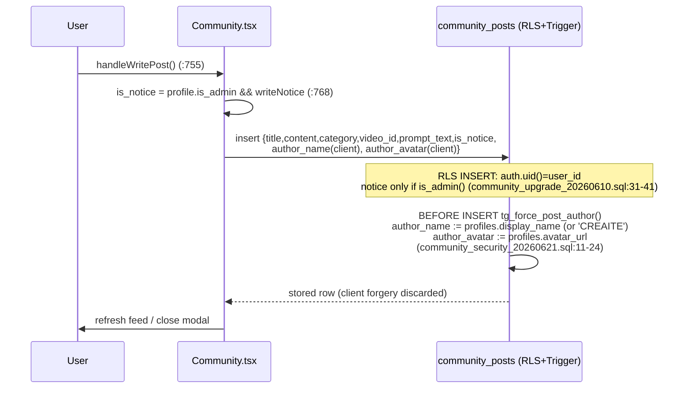
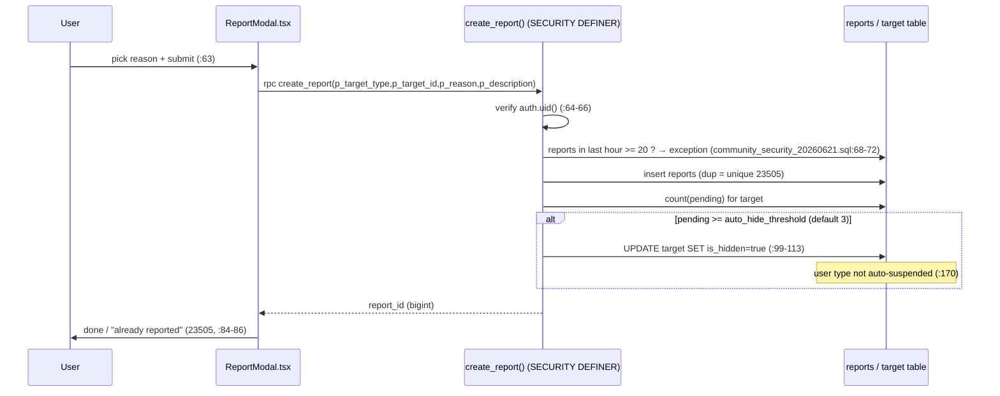
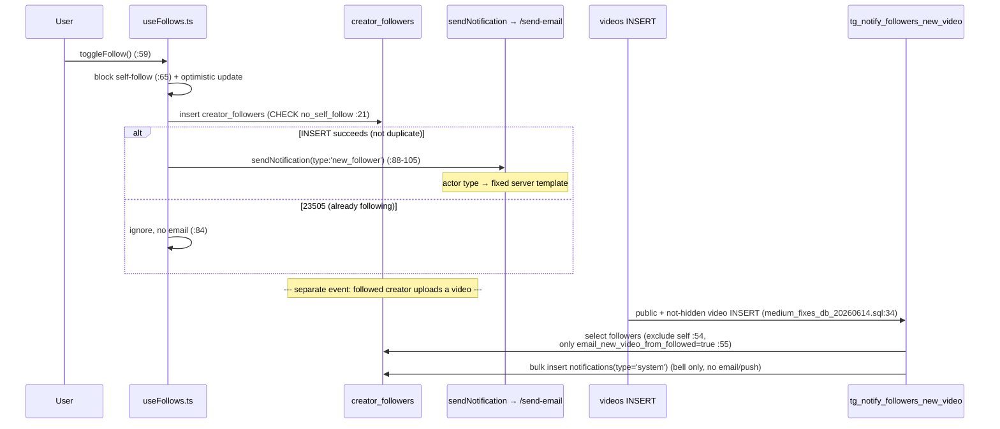
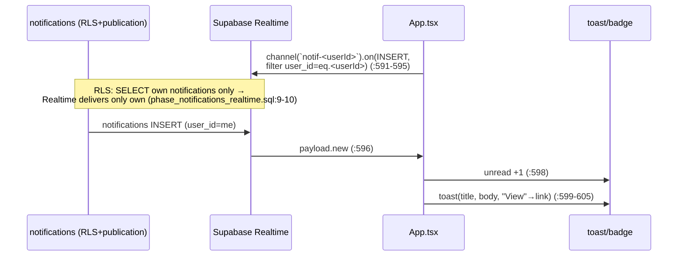
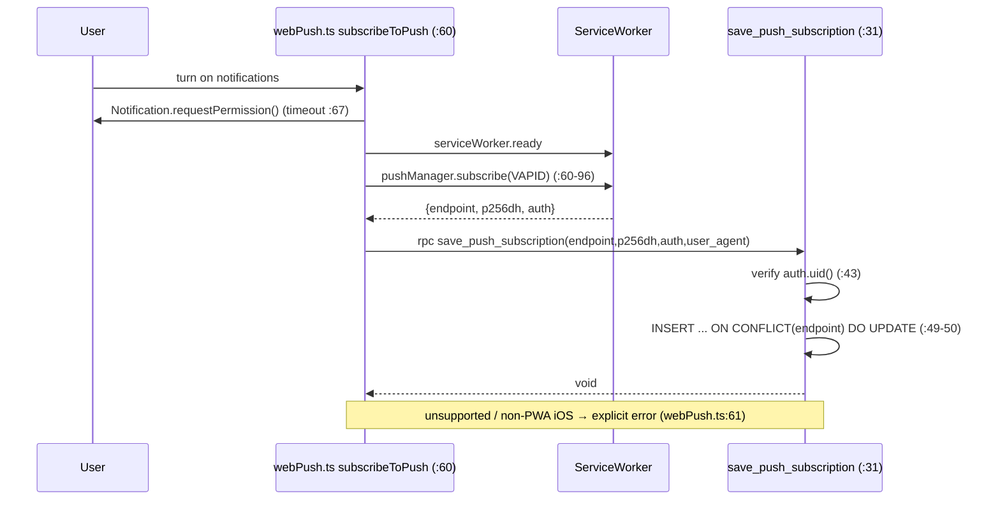
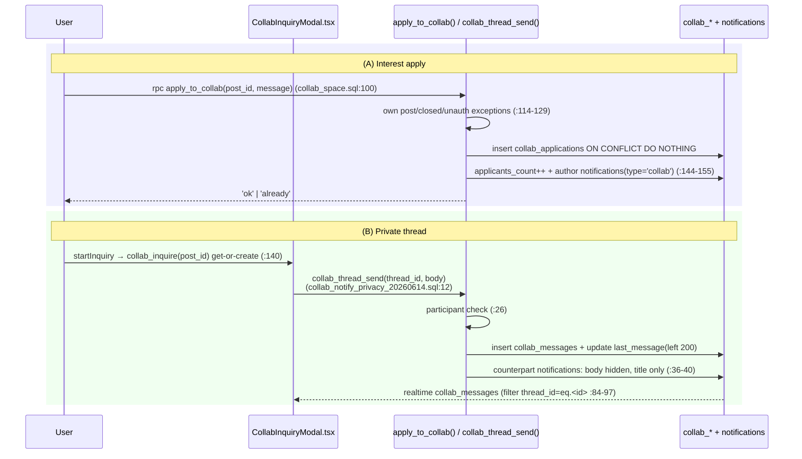

# 06. Community · Channels/Follow · Notifications — Detailed Spec

> This document is an SSOT spec written by reading the actual code/migrations. Every behavior, contract, and rule is sourced with `file:line` (no guessing).
>
> Target code:
> - Frontend: `src/app/components/Community.tsx`, `CommunityChallengeDetail.tsx`, `ReportModal.tsx`, `CommentPanel.tsx`, `Channel.tsx`, `FollowButton.tsx`, `NotificationPanel.tsx`, `CollabInquiryModal.tsx`, `src/app/hooks/useFollows.ts`, `src/app/utils/sendNotification.ts`, `src/app/utils/webPush.ts`, `src/app/App.tsx`
> - DB/Edge: `supabase/features_tables.sql`, `community_upgrade_20260610.sql`, `community_security_20260621.sql`, `collab_space.sql`, `collab_inquiries.sql`, `collab_notify_privacy_20260614.sql`, `phase10_reports.sql`, `creator_followers.sql`, `phase34_notifications.sql`, `phase_notifications_realtime.sql`, `phase_web_push_20260531.sql`, `new_video_follower_notify_20260612.sql`, `medium_fixes_db_20260614.sql`, `functions/server/index.ts` (/send-email, /broadcast-email, /broadcast-push)

---

## 1. Overview / Purpose

CREAITE's social layer. Three axes.

1. **Community** — Post feed (7 categories such as tips/prompts/comparison, with pinned notices), monthly recurring challenges (contests), creator collaboration space (recruit/seek/help/outsource + private 1:1 inquiry threads). Includes comments, likes, bookmarks, and reports. Entry component is `Community` at `Community.tsx:352` (3 tabs: `posts` / `challenges` / `collab`, `Community.tsx:881-884`).
2. **Channels/Follow** — Creator subscription (`creator_followers`). The "Subscribed" tab is the latest-video feed of followed channels; the "Explore" tab shows popular creator cards. Entry component `Channel.tsx:73`, follow toggle via the global cache hook `useFollows.ts:32`.
3. **Notifications/Realtime** — Three channels: in-app bell (`notifications` table + Realtime), email (Resend), and web push (Service Worker + VAPID). Per-user opt-in/out settings (`notification_preferences`). Bell panel `NotificationPanel.tsx:103`, realtime receive `App.tsx:591-608`.

Core security principles: author name/avatar are **forced by a server trigger** (impersonation blocked, `community_security_20260621.sql:11-29`); emails going to other users (actor types) **do not trust client content and use fixed server templates** (`functions/server/index.ts:1416-1445`); every notification dispatch must pass a **user-preference gate** (`should_send_notification`, `phase34_notifications.sql:168-207`).

---

## 2. User Stories

- As a viewer/creator, I want to post prompts/tips **by category** and leave likes, bookmarks, and comments.
- As an admin, I want to **pin notices at the top** and handle inappropriate posts/comments/users via a report queue.
- As a creator, I want to **enter monthly challenges** (upload videos tagged `challenge:<tag>`) and view other entries.
- As a creator, I want to post **collaboration listings** (recruiting/outsourcing, etc.) and converse with interested people via **a 1:1 private thread visible only to the author**.
- As a viewer, I want to **follow** my favorite creators and see their new videos collected in the "Subscribed" feed.
- As a user, I want to receive activities (replies/new followers/collab inquiries/new videos from followed channels) via **bell/email/push**, but **toggle each type on/off**.
- As a user, I want a new notification to appear **instantly as a toast** while the app is open (`App.tsx:599`), and to receive push even on the lock screen.
- Even for a malicious user, the system must block **author-name impersonation, report flooding, self-follow, and duplicate likes/reports**.

---

## 3. Screens & State

### 3.1 Community (`Community.tsx`)
- **Tab container**: `posts` / `challenges` / `collab` (`Community.tsx:879-908`). Deep-linking to a specific tab is possible (`initialTab`, `Community.tsx:360-366`; valid values `['posts','challenges','collab']`).
- **Post feed** (`posts` tab, `Community.tsx:910-`):
  - Category filter chips `all + CATEGORIES` (`Community.tsx:312`, filter UI `:915-936`), sort `latest|popular|comments` (`:937-953`, logic `visiblePosts` `:846-854`). Notices (`isNotice`) always pin to the top regardless of sort (`:849`).
  - Card: author avatar/name, timestamp, notice badge, category badge, title, body (line-clamp-3), prompt preview (line-clamp-2), embedded video thumbnail (`:986-1038`).
  - Non-premium users see an external ad slot (`ExternalAdSlot`, `Community.tsx:973`; `isPremium` check `:356`).
  - State: `posts/loadingPosts` (`:367-368`), `categoryFilter/sortKey` (`:370-371`), `likedPosts/bookmarkedPosts` (`:386-387`), `selectedPost` (detail, `:392`). Module cache (stale-while-revalidate) `postsCache` (`:349`).
- **Write/edit modal** (create + edit shared): `showWriteModal` (`:389`), fields `writeTitle/writeContent/writeCategory/writePrompt/writeVideoId/writeNotice/editingPostId` (`:403-409`). My-video embed list `myVideos` (`:410`, load `:424-439`). Notice toggle only meaningful for admins (`:768`).
- **Challenges** (`challenges` tab): `challenges/loadingChallenges` (`:373-374`), detail overlay `selectedChallenge` (`:393`). Loads DB `challenges` + counts entries (`:493-531`).
- **Collaboration** (`collab` tab): `collabs/loadingCollab` (`:375-376`), filter `collabFilter` (`:377`), create modal `showCollabModal/collabForm` (`:379-383`), private inquiry modal `inquiryPost` (`:385`).
- **Comment panel**: `commentPostId` (`:388`) → renders `CommentPanel` (passes `postId`, not a video).
- **Back-button LIFO**: every modal/panel registers with `useBackButton` (`Community.tsx:448-453`).

### 3.2 Challenge Detail (`CommunityChallengeDetail.tsx`)
- Slide overlay (`z-[60]`, `:149`). Hero, 3 key-info cards (prize/participants/D-day, `:190-208`), description, rules, awards, entry gallery, sticky participate button (`:322-337`).
- State: `entries/entriesLoading` (`:51-52`); entries are public videos with `videos.tags @> ['challenge:<tag>']`, top 12 by likes (`:58-64`).
- Progress state `ended|upcoming|ongoing` computed (`:130-132`; date-based if `startsAt` present, otherwise 0 participants = upcoming).

### 3.3 Report Modal (`ReportModal.tsx`)
- Shared component. `targetType: 'video'|'comment'|'user'|'community_post'` (`:28`). 7 reasons (`REASON_KEYS`, `:39-47`) + detail description (max 500 chars, `:175`).
- State: `selectedReason/description/submitting` (`:59-61`). If unauthenticated, calls `onSignInClick` then closes (`:64-68`).

### 3.4 Comment Panel (`CommentPanel.tsx`)
- Shared for video/community post (`videoId` XOR `postId`, `:77`). Mobile bottom sheet / desktop side panel (`mode`, `:711-714`).
- State: `comments` (parent + nested replies, `:83`), `likedComments` (`:95`), `replyTo` (`:93`), `expandedReplies` (`:94`), `openMenu` (`:96`), `reportTarget` (`:97`), inline edit local state `editing/draft/savingEdit` (`:444-446`).
- Creator-only actions: pin (`:610`), heart (`:621`), block (`:689`). Own comment: edit (`:633`), delete (`:642`). Others' comments: report/block menu (`:652-704`).

### 3.5 Channel (`Channel.tsx`)
- Tabs `subscribed` (`Users` icon) / `explore` (`Compass`) (`:23`, UI `:218-241`).
- **Subscribed tab** `SubscribedTab` (`:280`): login prompt if unauthenticated (`:294-312`), empty state (`:322-335`), video grid (`:337-385`). Data via `get_my_following_videos` (`:125`).
- **Explore tab** `ExploreTab` (`:391`): popular creator cards (TOP3 badge, stats, 3 recent thumbnails, FollowButton). Data via `get_popular_creators` (`:142`).
- Selecting a creator opens `CreatorChannel` full-screen (`:188-200`).
- State: `activeTab` (`:75`), `followingVideos` (`:88`), `creators` (`:92`), `myFollows` (FollowButton initial, `:96`). Module caches `channelCreatorsCache`/`followingVideosCache` (`:70-71`).

### 3.6 Follow Button (`FollowButton.tsx`)
- Two sizes: `sm` (round icon, `:42-69`) / `md` (text, `:72-98`). State auto-derived from `useFollows()` cache (`:25,27`). Not rendered for self (`:30`). Spinner while loading (`:59`).

### 3.7 Notification Bell Panel (`NotificationPanel.tsx`)
- Side panel (`w-80`, `:175`). Header has unread badge + "Mark all read" (`:181-196`).
- State: `notifications/loading` (`:108-109`). Sample notifications if unauthenticated (`SAMPLE_KO/EN`, `:20-72`).
- Per-type icon/background: `like/comment/purchase/sale/system/challenge/collab` (`:74-94`).
- Click → mark read + navigate via `link` (`handleClick` `:163-170`; sample ids prefixed with `s` do not navigate).

### 3.8 Collaboration Private Inquiry Modal (`CollabInquiryModal.tsx`)
- 3-view machine: `detail` / `list` (author: received inquiries) / `thread` (`:65`).
- State: `threads` (`:66`), `messages` (`:71`), `activeThreadId` (`:68`), `input/sending/starting` (`:73-75`), realtime `channelRef` (`:77`).
- Author/non-author CTA branch (`:243-281`): author = received inquiries + close/reopen + delete; non-author = start private inquiry (disabled if post closed).

---

## 4. Behavior Flows

### 4.1 Post CRUD
- **Create**: `handleWritePost` (`Community.tsx:755-807`). Inserts into `community_posts`, payload `title/content/category/video_id/prompt_text/is_notice` (`:762-769`). `is_notice` is true only when `profile.is_admin && writeNotice` (`:768`). The client sends `author_name/author_avatar` but → **a server trigger overwrites with profile values** (`community_security_20260621.sql:11-24`).
- **Edit**: same function, `editingPostId` branch (`:770-782`). RLS `auth.uid()=user_id`.
- **Delete**: `handleDeletePost` (`:822-837`). RPC `delete_community_post` (cascade-deletes comments) → falls back to `community_posts.delete` if not applied (`:824-828`).
- Ownership is ultimately decided by RLS, not the UI (0 rows = unauthorized).

### 4.2 Comments
- **Load**: `fetchComments` (`CommentPanel.tsx:102-176`). Parents are `is_hidden=false` + `parent_id is null` (`:115-118`); replies queried separately (`:135-140`). My like state via `get_my_comment_likes` (`:164`).
- **Create**: `handleSubmit` (`:190-282`). Inserts into `comments`, `video_id` XOR `post_id` + `parent_id` (`:204-206`). If `is_hidden` right after insert (auto-filter), not added to list and a notice is shown (`:219-224`).
- **Reply notification**: if the original commenter ≠ self, `sendNotification({type:'comment_reply'})` (`:242-268`). Link is `?video=…&comment=1` for videos, `?tab=community&sub=posts&post=…` for posts (`:259-263`).
- **Edit**: inline `saveEdit` (`:448-498`). Removed from list if auto-filtered hidden after edit (`:468-482`).
- **Pin/heart**: video author only. `toggle_pin_comment` (`:365`), `toggle_creator_heart` (`:389`). Only one comment can be pinned (others unpinned then re-sorted, `:373-386`).
- **Comment-count sync**: `comments` INSERT/DELETE/hidden-change triggers `tg_sync_post_comments_count` → recomputes `community_posts.comments_count` (`community_upgrade_20260610.sql:116-145`).

### 4.3 Likes / Bookmarks
- **Post like**: `toggleLike` (`Community.tsx:694-720`). Optimistic UI then `post_likes` upsert (`ignoreDuplicates`)/delete. Count synced by trigger `tg_sync_post_likes_count` (`community_upgrade_20260610.sql:49-77`) (SECURITY DEFINER to bypass author RLS, `:47-48`). Rollback on failure (`:709-719`).
- **Bookmark**: `toggleBookmark` (`Community.tsx:723-746`). `post_bookmarks` upsert/delete (`post_bookmarks` table `community_upgrade_20260610.sql:88-109`).
- **Comment like**: `handleLike` (`CommentPanel.tsx:302-363`). `like_comment`/`unlike_comment` RPC → corrected by server count (`:348-361`).
- On login, my likes/bookmarks are loaded in bulk (`Community.tsx:534-551`).

### 4.4 Reports
- `ReportModal.handleSubmit` (`:63-103`) → `create_report(p_target_type,p_target_id,p_reason,p_description)` (`phase10_reports.sql:110-175`, rate-limit addition `community_security_20260621.sql:48-117`).
- Auto-hide: same target `pending` reports ≥ `auto_hide_threshold` (default 3) → target `is_hidden=true` (`community_security_20260621.sql:99-113`). User type is not auto-suspended (`phase10_reports.sql:170`).
- Admin handling: `moderate_report(keep|remove|dismiss)` (`phase10_reports.sql:183-268`). keep=restore, remove=hide/suspend, dismiss=reject single.
- Duplicates violate the unique index (23505) → UI shows "already reported" (`ReportModal.tsx:84-86`).

### 4.5 Challenge Entry
- No dedicated entry table. Linked by putting `challenge:<tag>` into the video's `tags` on upload (entry query `CommunityChallengeDetail.tsx:58-64`, participant count `Community.tsx:514-523`).
- Participate button `handleParticipate` (`:134-141`): upcoming = notice toast; otherwise `onParticipate(challenge)` → enter upload. On participation the overlay is closed first, then navigation happens after the close animation (avoids history conflict, `Community.tsx:396-400`).

### 4.6 Collaboration — Apply / Thread
- **Listing creation**: `handleCreateCollab` (`Community.tsx:609-645`). Inserts into `collab_posts` (author name forced by trigger, `community_security_20260621.sql:26-29`).
- **Apply (interest)**: `apply_to_collab(p_post_id,p_message)` (`collab_space.sql:100-159`). Returns 'ok'/'already'. Exceptions for own post/closed/unauthenticated. On success `applicants_count++` + inserts `notifications(type='collab')` for the author (`:144-155`).
- **Private inquiry thread** (`collab_inquiries.sql`):
  - Start: `collab_inquire(p_post_id)` get-or-create thread (`:62-75`). Called by `CollabInquiryModal.startInquiry` (`:140-148`).
  - Send: `collab_thread_send(p_thread_id,p_body)` (`collab_notify_privacy_20260614.sql:12-43`, latest). Inserts message + updates thread last_message + **notifies the counterpart (message body hidden, only the post title)** (`:36-40`).
  - List: `collab_threads_for(p_post_id)` (author = all, inquirer = own, includes unread, `collab_inquiries.sql:115-137`).
  - Read: `collab_thread_mark_read` (`:140-152`).
  - Realtime: `collab_messages` added to the publication (`collab_inquiries.sql:155-157`). Client subscribe `CollabInquiryModal.subscribe` (`:84-97`), filter `thread_id=eq.<id>`.

### 4.7 Follow / Unfollow
- `useFollows.toggleFollow` (`useFollows.ts:59-127`). Module cache + subscribers shared across all components (`:12-30`).
- Optimistic update then `creator_followers` insert/delete (`:79-113`). Insert 23505 (already following) ignored (`:84`). Rollback on failure (`:115-124`).
- Only on successful INSERT (not duplicate) is the new-follower email `sendNotification({type:'new_follower'})` sent (`:88-105`), link = the follower's channel.
- Self-follow blocked: client (`:65`) + DB CHECK `no_self_follow` (`creator_followers.sql:21`).

### 4.8 New-Video Fan-out Notification
- DB trigger `tg_notify_followers_new_video` (`new_video_follower_notify_20260612.sql:20-52`, latest `medium_fixes_db_20260614.sql:34-58`). On `videos` INSERT, if the video is public + not hidden, bulk-inserts `notifications(type='system')` to all followers.
- **Opt-in gate**: only followers with `notification_preferences.email_new_video_from_followed = true` (`medium_fixes_db_20260614.sql:55`, `COALESCE(...,false)` → default OFF). Excludes self (`:54`).
- Sent as a **bell notification only**, not email/push (to save Resend cost, file header comment `new_video_follower_notify_20260612.sql:4-6`).

### 4.9 Realtime Receive (bell)
- `notifications` is registered in the `supabase_realtime` publication (`phase_notifications_realtime.sql:13-23`).
- Client subscribe `App.tsx:591-608`: channel `notif-<userId>`, `event:INSERT`, `filter: user_id=eq.<userId>`. On receive, unread +1 + toast (`title/body`, "View" action navigates to `link`, `:599-605`).
- Initial unread count loaded on entry (`:584-588`). 0 if logged out (`:578-580`).
- RLS allows SELECT of own notifications only, so Realtime also delivers only your own (security comment `phase_notifications_realtime.sql:9-10`).

### 4.10 Web Push Subscription
- Client `subscribeToPush` (`webPush.ts:60-96`): permission request → `serviceWorker.ready` → `pushManager.subscribe(VAPID)` → `save_push_subscription(endpoint,p256dh,auth,user_agent)` (`phase_web_push_20260531.sql:31-53`). Every await has a timeout (`:67-95`).
- Unsubscribe `unsubscribeFromPush` (`:98-107`) → `delete_push_subscription` (`phase_web_push_20260531.sql:56-67`) + `sub.unsubscribe()`.
- Dispatch via Edge `/send-push`, which queries `push_subscriptions` with service_role then uses web-push (file comment `phase_web_push_20260531.sql:5-7`).
- Push click → SW (`sw.js`) `postMessage({type:'push-navigate',url})` → `App.tsx:480-489` handles SPA navigation.
- iOS limit: works only on home-screen installed PWA + iOS 16.4+ (`webPush.ts:9`).

### 4.11 Email Dispatch (actor flow)
- Client `sendNotification` (`sendNotification.ts:48-81`) → Edge `/send-email` (`functions/server/index.ts:1361-`).
- Server: verify caller token (`:1366-1370`) → ignore `providedTo` and look up recipient by user_id (`:1372,1390-1396`) → per-type permission (self/admin/actor, `:1379-1388`) → bell INSERT (`:1447-1454`) → `should_send_notification(email)` gate (`:1460-1472`) → Resend (`:1484-`) → `log_notification` (`:1502,1515`).

---

## 5. Data / RPC Contracts

### 5.1 Tables · RLS
| Table | Definition | RLS summary |
|---|---|---|
| `community_posts` | `features_tables.sql:98-111` (+`is_notice/video_id/prompt_text/is_hidden` extensions) | SELECT: not hidden OR self OR admin (`community_security_20260621.sql:35-41`). INSERT/UPDATE: self + notices admin-only (`community_upgrade_20260610.sql:30-41`). DELETE: self (`features_tables.sql:128-129`) |
| `post_likes` | `features_tables.sql:132-137` | SELECT all, INSERT/DELETE self (`:141-148`) |
| `post_bookmarks` | `community_upgrade_20260610.sql:88-93` | SELECT/INSERT/DELETE self only (`:99-109`) |
| `comments` | (outside features) `is_hidden` extension `phase10_reports.sql:28-30` | SELECT hidden gate (code-level `is_hidden=false` filter, `CommentPanel.tsx:116`) |
| `challenges` | `community_upgrade_20260610.sql:157-172` | SELECT all (`:179-180`), others admin (`:182-184`) |
| `collab_posts` | `collab_space.sql:17-31` | SELECT all, INSERT/UPDATE/DELETE self (`:39-56`); admin delete via service_role/separate migration |
| `collab_applications` | `collab_space.sql:59-67` | SELECT applicant OR post owner (`:75-80`), INSERT/DELETE self (`:83-90`) |
| `collab_threads` | `collab_inquiries.sql:15-23` | SELECT inquirer OR post owner (`:29-34`) |
| `collab_messages` | `collab_inquiries.sql:37-44` | SELECT thread participants (`:49-58`); INSERT via RPC only |
| `creator_followers` | `creator_followers.sql:16-22` | SELECT all, INSERT/DELETE self (`:34-44`), `no_self_follow` CHECK (`:21`) |
| `reports` | `phase10_reports.sql:54-83` | SELECT self OR admin (`:336-342`); INSERT/UPDATE via RPC only |
| `notifications` | `features_tables.sql:68-77` (`collab` added to type `collab_space.sql:93-95`) | SELECT/UPDATE/INSERT/DELETE self (`:85-95`) |
| `notification_preferences` | `phase34_notifications.sql:17-41` | SELECT/UPDATE self (`:45-53`); INSERT via trigger/RPC |
| `notification_log` | `phase34_notifications.sql:58-70` | SELECT self (`:79-82`); INSERT via RPC only |
| `push_subscriptions` | `phase_web_push_20260531.sql:11-19` | SELECT self (`:25-27`); INSERT/DELETE via RPC only |

### 5.2 RPC Contracts
- `create_report(text,text,text,text?) → bigint` — record report + auto-hide + rate-limit (20/hour, `community_security_20260621.sql:68-72`). SECURITY DEFINER.
- `moderate_report(bigint,text,text?) → void` — admin only (`phase10_reports.sql:183-268`).
- `get_pending_reports()` / `get_my_reports()` (`phase10_reports.sql:276-329`).
- `apply_to_collab(uuid,text?) → text('ok'|'already')` (`collab_space.sql:100-159`).
- `collab_inquire(uuid) → uuid` / `collab_thread_send(uuid,text) → (id,created_at)` / `collab_threads_for(uuid)` / `collab_thread_mark_read(uuid)` (`collab_inquiries.sql`, send latest `collab_notify_privacy_20260614.sql`).
- `get_my_following_videos(int)` / `get_popular_creators(int)` / `get_creator_profile(uuid)` / `get_creator_videos(uuid,int)` (`creator_followers.sql:50-280`, GRANT anon+authenticated `:283-286`).
- Comments: `get_my_comment_likes` / `like_comment` / `unlike_comment` / `toggle_pin_comment` / `toggle_creator_heart` / `creator_block_user` (`CommentPanel.tsx:164,331,366,390,414`).
- Notifications: `get_my_notification_preferences()` / `update_my_notification_preferences(jsonb)` / `should_send_notification(uuid,text,text)→bool` / `log_notification(...)` (`phase34_notifications.sql:87-244`).
- Push: `save_push_subscription(text,text,text,text?)` / `delete_push_subscription(text)` (`phase_web_push_20260531.sql:31-67`).
- `delete_community_post(p_post_id)` — cascade-deletes post + comments (`Community.tsx:824`, defined in `fixes_audit_20260611.sql`).

### 5.3 Triggers
- `community_posts_force_author` / `collab_posts_force_author` — force author name/avatar (`community_security_20260621.sql:21-29`).
- `post_likes_sync_count` — like count sync (`community_upgrade_20260610.sql:74-77`).
- `comments_sync_post_count` — comment count recompute (`:142-145`).
- `trg_notify_followers_new_video` — new-video fan-out (`medium_fixes_db_20260614.sql:34-58`).
- `trg_init_notification_preferences` — default preferences INSERT on signup (`phase34_notifications.sql:266-270`).

---

## 6. Business Rules

1. **Server-forced author name** — On `community_posts`/`collab_posts` INSERT/UPDATE, a trigger overwrites with `profiles.display_name` (or 'CREAITE') and `avatar_url`. Client input ignored (`community_security_20260621.sql:11-29`).
2. **Notices admin-only** — `is_notice=true` INSERT/UPDATE allowed only when `public.is_admin()` (`community_upgrade_20260610.sql:31-41`). Client sends true only with `is_admin && writeNotice` (`Community.tsx:768`). Notices always pin to the top (`:849`).
3. **Hidden posts not shown** — Body of auto/manually hidden posts only for author/admin (`community_security_20260621.sql:35-41`). Hidden comments excluded from SELECT (`CommentPanel.tsx:116,139`).
4. **Report auto-hide + rate-limit** — Same target pending reports ≥ threshold (default 3) → auto-hide. One user limited to 20 reports/hour (`community_security_20260621.sql:68-72,93-113`).
5. **No self-follow** — DB CHECK `no_self_follow` (`creator_followers.sql:21`) + client guard (`useFollows.ts:65`, `FollowButton.tsx:30`).
6. **Notification opt-in** — Every dispatch must pass `should_send_notification(channel)` (`phase34_notifications.sql:168-207`). Push default OFF for all types (`:31-38`); new-video/reply emails default OFF (`medium_fixes_db_20260614.sql:55`, `new_video_follower_notify_20260612.sql:11`).
7. **Suspended users blocked from writing** — `profiles.is_suspended` (`phase10_reports.sql:38`). Admin remove action on a user target = suspend (`:247-250`).
8. **No applying/inquiring to own collab post** — `apply_to_collab` (`collab_space.sql:124-126`), `collab_inquire` (`collab_inquiries.sql:69`).
9. **Closed collab cannot be applied/inquired** — status='closed' exception (`collab_space.sql:127-129`), UI disabled (`CollabInquiryModal.tsx:263-264`).
10. **Actor emails use fixed server templates** — Notifications going to other users ignore client subject/html/link and use a fixed server template (anti-phishing, `functions/server/index.ts:1416-1445`).

---

## 7. Edge Cases & Error Handling

- **Impersonation prevention**: even if the client tries to insert `author_name='admin'`, the trigger overwrites with the profile name (§6.1). Applies to UPDATE too.
- **Duplicate like/bookmark**: upsert `onConflict + ignoreDuplicates` (`Community.tsx:708,736`) → 1 row even on double-tap/race. The count trigger only reacts to INSERT/DELETE, so duplicate upserts do not increment the count.
- **Duplicate report**: unique index `idx_reports_dedup` (`phase10_reports.sql:86-88`) → 23505 → "already reported" (`ReportModal.tsx:84-86`).
- **Duplicate follow**: insert 23505 ignored (`useFollows.ts:84`), email not sent either (`:88`).
- **Deleted deep-link target**: missing post/challenge → notice toast + clear signal (avoid retry loop) (`Community.tsx:593,604,572`).
- **Migration-not-applied fallback**: hardcoded fallback if challenges table missing (`Community.tsx:507-511`), simple delete fallback if `delete_community_post` missing (`:824-828`).
- **Realtime permission**: both notifications/collab_messages have RLS that SELECTs only own/participant rows → Realtime delivers only that scope (`phase_notifications_realtime.sql:9-10`).
- **Push endpoint**: `endpoint UNIQUE` + `save_push_subscription` ON CONFLICT upsert (handles device re-subscribe / owner change, `phase_web_push_20260531.sql:14,49-50`). Unsupported browser / non-PWA iOS get explicit errors (`webPush.ts:61`). Every await has a timeout to prevent infinite loading (`webPush.ts:67-95`).
- **Auto-filtered hidden comment**: if `is_hidden` right after insert/edit, not reflected in the list + notice (`CommentPanel.tsx:219-224,468-482`).
- **Optimistic UI failure**: like/bookmark/follow all roll back on failure (`Community.tsx:709-719,737-744`, `useFollows.ts:115-124`).

---

## 8. Permissions / Security

- **RLS self/public/admin matrix**: see §5.1. Public SELECT (community_posts·challenges·collab_posts·creator_followers), self-only (post_bookmarks·notification_preferences·push_subscriptions·notification_log), participant-only (collab_threads/messages), admin gate (challenge management·report viewing·notices).
- **Realtime inherits RLS** — Follows table RLS without separate policy (notifications=self, collab_messages=participant). Publication registration alone suffices (`phase_notifications_realtime.sql`, `collab_inquiries.sql:155-157`).
- **SECURITY DEFINER rationale** — Count sync / inserting notifications for others / fan-out must bypass author RLS, so DEFINER + `SET search_path=public` (`community_upgrade_20260610.sql:47-48`, `collab_space.sql:103-104`).
- **send-email actor template** — self/admin/actor permission branch (`index.ts:1379-1388`); actor uses fixed server subject/html/link (`:1416-1445`); recipient email always server-looked-up (open-relay blocked, `:1372`).
- **Opt-out consistency** — Email footers include the notification-settings link (server template `index.ts:1434`, client template `sendNotification.ts:108` etc.).
- **Message privacy** — Collab notification body never exposes the raw message (only the post title); `last_message` (200 chars) only for thread participants (`collab_notify_privacy_20260614.sql:36-40`).

---

## 9. Analytics / Events

> No dedicated analytics calls in the current code. Below are naturally occurring measurable signals.

- **Engagement counters (DB)**: `community_posts.likes_count/comments_count`, `collab_posts.applicants_count`, `creator_followers` (follower count), `videos.tags challenge:<tag>` (challenge entry count).
- **Dispatch audit**: `notification_log` (channel/type/status/resend_message_id, `phase34_notifications.sql:58-70`) — tracks send success/failure/skip.
- **Report queue metrics**: `reports.status` (pending/kept/removed/dismissed) + `get_pending_reports.report_count`.
- **Popular creator ranking**: `get_popular_creators` sort key = follower_count → total_views → video_count (`creator_followers.sql:173-177`).
- Suggestion (not implemented): logging post creation, challenge entry, collab inquiry start, and push-subscription conversion as separate events would enable funnel analysis.

---

## 10. Acceptance Criteria (Checklist)

- [ ] Post create/edit/delete works under RLS (self), and deleting also removes comments.
- [ ] Even if the client forges author_name, the stored result is the profile display name.
- [ ] The notice toggle only takes effect for admins, and notices always pin to the top of the feed.
- [ ] Category filter and sort (latest/popular/comments) work as intended.
- [ ] Likes/bookmarks/comment-likes update optimistically, roll back on failure, and counts sync exactly via triggers.
- [ ] Duplicate reports on the same target are blocked, more than 20 reports/hour are blocked, and accumulation at the threshold auto-hides.
- [ ] Hidden posts/comments are invisible to anyone but the author/admin.
- [ ] Challenge entries show only public videos with `challenge:<tag>` sorted by likes, and upcoming challenges block participation.
- [ ] Collab apply / private inquiry are disallowed on own posts and closed posts.
- [ ] Collab threads are readable only by author↔inquirer, new messages arrive via realtime, and the notification body does not expose the raw message.
- [ ] You cannot follow yourself (client+DB), duplicate follows are ignored, and the new-follower email is sent exactly once on a successful INSERT.
- [ ] The "Subscribed" feed shows only public videos from followed channels.
- [ ] With the app open, a new notification INSERT increments the bell badge +1 and shows a toast (own notifications only).
- [ ] New-video fan-out goes only to opted-in followers (default OFF), excluding self.
- [ ] All emails/push are skipped when the user setting (should_send) is OFF, and that fact is logged.
- [ ] Actor emails are sent with the fixed server template, not client content.
- [ ] Web push subscribe/unsubscribe works (unsupported devices get explicit errors), and push clicks navigate to the correct screen.

---

## 11. Known Constraints / Carry-overs

- **Denormalized challenge entries** — No separate entry table; linked only by the `challenge:<tag>` string in the video `tags` (`CommunityChallengeDetail.tsx:61`). Entry metadata (submit time/rank/review status), auto-ranking, and duplicate-entry limit (the rule "3 per person, `:100`" is advisory only, not enforced) are not implemented.
- **Manual challenge awards/judging** — Award structure is hardcoded text (`CommunityChallengeDetail.tsx:81-110`). No auto-settlement or winner marking.
- **Dual apply vs inquiry** — `collab_applications` (interest record, `apply_to_collab`) and `collab_threads` (private conversation) coexist. The current UI mainly uses inquiry threads (`CollabInquiryModal`).
- **Push dispatch FCM/web-push pending** — Subscription save/settings are complete, but operational activation of the actual `/send-push` Edge depends on the VAPID private key/deployment (`phase_web_push_20260531.sql:5-7`, `webPush.ts:13-17`).
- **Notification type enum drift** — `collab` was added to the `notifications.type` CHECK (`collab_space.sql:93-95`), but the frontend `Notification` type definition (`NotificationPanel.tsx:9-17`) does not include `collab` in the union (though the icon/background maps do). It displays, but the type-definition mismatch should be cleaned up.
- **Unauthenticated sample notifications** — Fake samples shown in the bell before login (`NotificationPanel.tsx:20-72`); to avoid confusion with real data, ids prefixed with `s` are made click-inert (`:166`).
- **i18n mixing** — Category keys use Korean constants ("팁","챌린지", etc.) directly in DB CHECK/filters (`features_tables.sql:105`, `Community.tsx:312`). Multilingual labels are handled only by a separate key map (`:314-322`).

---

## Wireframes (Text Mockups)

> ASCII mockups based on the actual component structure. They express information hierarchy/state, not pixels.

### Community — Post Feed (`posts` tab, `Community.tsx:910-`)

```
┌───────────────────────────────────────────────────────────────┐
│  Community                                         [+ Write]    │
│  ┌─────────────────────────────────────────────────────────┐  │
│  │ [Posts] [Challenges] [Collab]       ← tabs (:879-908)     │  │
│  └─────────────────────────────────────────────────────────┘  │
│  Category: (All) (Tips) (Prompts) (Compare) (Q) (Show) ...     │  ← :915-936
│  Sort:     [Latest ▼]  Latest | Popular | Comments            │  ← :937-953
│                                                                 │
│  ┌─────────────────────────────────────────────────────────┐  │
│  │ 📌 Notice  [notice badge]   ← isNotice always top :849    │  │
│  │ (avatar) Admin · 3h ago                                   │  │
│  │ [Notice] June challenge guide                             │  │
│  │ Body preview (line-clamp-3) ...                           │  │
│  └─────────────────────────────────────────────────────────┘  │
│  ┌─────────────────────────────────────────────────────────┐  │
│  │ (avatar) John · 1h ago               [Prompt] category    │  │
│  │ Title text                                                │  │
│  │ Body preview (line-clamp-3) ...                           │  │
│  │ ┌── Prompt preview (line-clamp-2) ──┐                     │  │
│  │ │ "cinematic, slow dolly-in ..."     │                     │  │
│  │ └────────────────────────────────────┘                     │  │
│  │ [▶ embedded video thumb]      ← writeVideoId :986-1038    │  │
│  │ ♥ 12   💬 4   🔖   ⚐ Report                               │  │
│  └─────────────────────────────────────────────────────────┘  │
│  ┌─ [External Ad Slot] ExternalAdSlot (non-premium :973) ────┐  │
│  └─────────────────────────────────────────────────────────┘  │
└───────────────────────────────────────────────────────────────┘
```

### Community — Write/Edit Modal (`showWriteModal`, `Community.tsx:389,755-807`)

```
┌──────────────── Write / Edit ────────────────[X]┐
│ Category: [Tips ▼]                                 │  ← writeCategory
│ Title:   [______________________________]          │  ← writeTitle
│ Body:    [                              ]           │  ← writeContent
│          [                              ]           │
│ Prompt:  [_____________________________] (optional) │  ← writePrompt
│ Embed video: [Pick my video ▼] myVideos (:410,424) │  ← writeVideoId
│ ┌ ⚠ Post as notice (admin only) ────────┐         │  ← writeNotice, :768
│ │ [ ] meaningful only when is_admin       │         │
│ └──────────────────────────────────────┘          │
│                          [Cancel]   [Publish]       │
│  ※ no author_name/avatar field → server-forced      │
└────────────────────────────────────────────────────┘
```

### Community — Challenge Card + Detail (`challenges` tab, `CommunityChallengeDetail.tsx`)

```
┌──────────── Challenge Card (:493-531) ──────────┐
│ [hero banner]                                     │
│ June Challenge: "Rainy City"                      │
│ Status: ● ongoing (ongoing | upcoming | ended :130)│
│ 🏆 Prize · 👥 23 joined · ⏳ D-7                  │
│                              [Participate →]       │
└──────────────────────────────────────────────────┘
        │ click → slide overlay (z-[60] :149)
        ▼
┌──────────── Challenge Detail ─────────────[X]┐
│ [hero]                                         │
│ ┌Prize┐ ┌Joined┐ ┌D-day┐ ← 3 cards :190-208  │
│ Description / Rules / Awards (hardcoded :81-110)│
│ Entry gallery:                                 │
│  videos.tags @> ['challenge:<tag>']            │  ← :58-64
│  public, top 12 by likes                       │
│  [thumb] [thumb] [thumb] [thumb] ...           │
│ ─────────────────────────────────────────     │
│ [Participate] (sticky; upcoming → notice toast)│  ← :134-141,322-337
└────────────────────────────────────────────────┘
```

### Community — Collab Card + Private Inquiry (`collab` tab, `CollabInquiryModal.tsx`)

```
┌──────────── Collab Card ────────────┐
│ [Recruit] Looking for an editor      │  ← type: recruit|join|help|outsource
│ (avatar) Director Kim · 2d ago       │
│ Roles: edit, motion graphics         │
│ Reward: negotiable · 5 applied       │  ← applicants_count
│ Status: ● open                       │
│              [Interested] [Inquire]   │
└──────────────────────────────────────┘
   │ Inquire → 3-view machine (:65)
   ▼
detail ──► (author) list: received inquiries  ──► thread
           ┌────────────────────────┐          ┌──────────────────────┐
           │ Editor Kim · unread 2   │          │ ← 「Looking for editor」│
           │ Motion Lee · closed     │          │ [other] Hello...      │
           └────────────────────────┘          │ [me] My portfolio...  │
           (non-author) detail:                  │ ......                │
           [Start private inquiry]               │ [_________] [Send]    │  ← input :73
           (disabled if closed :263)             │ realtime sub :84-97   │
                                                └──────────────────────┘
```

### Community — Report Modal (`ReportModal.tsx`)

```
┌──────────── Report ────────────[X]┐
│ Target: community_post | video | comment | user  (:28)
│ Reason (REASON_KEYS :39-47):       │
│  ( ) Spam/Ad        ( ) Inappropriate
│  ( ) Copyright      ( ) Violence    │
│  ( ) Harassment     ( ) Misinformation
│  (•) Other                         │
│ Details (optional, max 500 :175):  │
│  [______________________________]   │
│                  [Cancel]  [Submit]  │
│  ※ unauth → onSignInClick then close :64
└────────────────────────────────────┘
```

### Channel — Subscribed/Explore/Creator Channel (`Channel.tsx`)

```
┌──────────────────────── Channel ─────────────────────┐
│ [👥 Subscribed]  [🧭 Explore]    ← activeTab :23,218  │
├───────────────────────────────────────────────────────┤
│ ▣ Subscribed tab (SubscribedTab :280)                 │
│   get_my_following_videos (:125)                       │
│   unauth → login prompt(:294) / empty(:322)            │
│   ┌─────┐ ┌─────┐ ┌─────┐                            │
│   │video│ │video│ │video│  ← grid :337-385            │
│   └─────┘ └─────┘ └─────┘                            │
│                                                        │
│ ▣ Explore tab (ExploreTab :391)                       │
│   get_popular_creators (:142)                          │
│   ┌──────────────────────────────────────┐           │
│   │ 🥇TOP3  (avatar) Director Kim          │           │
│   │ 1.2K followers · 34 videos · 50K views │           │
│   │ [thumb][thumb][thumb]    [Follow] (md) │  ← FollowButton :72
│   └──────────────────────────────────────┘           │
│   click → CreatorChannel full-screen (:188-200)        │
└───────────────────────────────────────────────────────┘

FollowButton state (useFollows cache :25): [Follow] ⇄ [Following] (spinner :59)
Not rendered for self (:30)
```

### Notifications — Bell Panel (`NotificationPanel.tsx`)

```
            🔔(3)  ← unread badge (App.tsx unread)
            │ click
            ▼
┌──────────────── Notifications (w-80 :175) ───────────────┐
│ Notifications                       [Mark all read] (:181)│
├───────────────────────────────────────────────────────────┤
│ 💬 New reply on your comment    ● unread  ← comment       │
│    "Title" · 5m ago                                        │
│ ❤ You got a like                          ← like          │
│ 👤 You have a new follower                 ← system        │
│ 🤝 Editor Kim is interested in collab...   ← collab        │
│ 🏆 Challenge results announced             ← challenge     │
│ 💰 Settlement completed                    ← sale          │
│   (per-type icon/background :74-94)                        │
│   click → mark read + navigate via link (handleClick :163)│
│   ※ unauth → SAMPLE_KO/EN; ids prefixed 's' don't navigate │
└───────────────────────────────────────────────────────────┘
```

---

## Sequence Diagrams

> mermaid. Based on actual functions/file:lines. Some branches simplified.

### S1. Post Creation (server-forced author name)



### S2. Report → Auto-hide



### S3. Follow + New-video Fan-out



### S4. Realtime Bell Receive



### S5. Web Push Subscription



### S6. Collab Apply / Private Inquiry Thread



---

## API / RPC Reference

> Args/returns/permissions/source (file:line). RLS supplements §5.1.

### Table RLS (core)

| Table | SELECT | INSERT | UPDATE/DELETE | file:line |
|---|---|---|---|---|
| `community_posts` | not hidden OR self OR admin | self (notice admin) | self | `community_security_20260621.sql:35-41`, `community_upgrade_20260610.sql:30-41`, `features_tables.sql:128-129` |
| `comments` | `is_hidden=false` (code filter) | self | self | `phase10_reports.sql:28-30`, `CommentPanel.tsx:116` |
| `reports` | self OR admin | RPC only | RPC only (moderate) | `phase10_reports.sql:336-342` |
| `creator_followers` | all | self (`no_self_follow`) | DELETE self | `creator_followers.sql:16-22,34-44` |
| `notifications` | self | self (others via DEFINER RPC) | self | `features_tables.sql:85-95`, type+collab `collab_space.sql:93-95` |
| `collab_threads` | inquirer OR post owner | RPC only | — | `collab_inquiries.sql:29-34` |
| `collab_messages` | thread participants | RPC only | — | `collab_inquiries.sql:49-58` |
| `push_subscriptions` | self | RPC only | RPC only | `phase_web_push_20260531.sql:25-27` |

### RPC

| RPC | Args | Returns | Permission | file:line |
|---|---|---|---|---|
| `create_report` | `(p_target_type text, p_target_id text, p_reason text, p_description text=null)` | `bigint` (report_id) | DEFINER, authenticated. auth required, 20/hour limit, blocks reporting self (user), auto-hide | `community_security_20260621.sql:48-117` |
| `moderate_report` | `(bigint, text 'keep'|'remove'|'dismiss', text? note)` | `void` | admin only | `phase10_reports.sql:183-268` |
| `apply_to_collab` | `(p_post_id uuid, p_message text=null)` | `text 'ok'|'already'` | DEFINER. auth required, own-post/closed exceptions, notifies author | `collab_space.sql:100-159` |
| `collab_inquire` | `(p_post_id uuid)` | `uuid` (thread_id, get-or-create) | DEFINER. own-post exception | `collab_inquiries.sql:62-76` |
| `collab_thread_send` | `(p_thread_id uuid, p_body text)` | `TABLE(id uuid, created_at timestamptz)` | DEFINER. participants only. body-hidden notification | `collab_notify_privacy_20260614.sql:12-45` |
| `collab_threads_for` | `(p_post_id uuid)` | `TABLE(thread_id,other_id,other_name,other_avatar,last_message,last_message_at,unread)` | DEFINER. author=all / inquirer=own | `collab_inquiries.sql:115-137` |
| `collab_thread_mark_read` | `(p_thread_id uuid)` | `void` | DEFINER. participants only | `collab_inquiries.sql:140-152` |
| `save_push_subscription` | `(p_endpoint text, p_p256dh text, p_auth text, p_user_agent text=null)` | `void` | DEFINER, authenticated. auth required, endpoint upsert | `phase_web_push_20260531.sql:31-53` |
| `delete_push_subscription` | `(p_endpoint text)` | `void` | DEFINER, authenticated | `phase_web_push_20260531.sql:56-67` |
| `should_send_notification` | `(p_user_id uuid, p_type text, p_channel 'email'|'push')` | `bool` | DEFINER, authenticated+service_role. unknown channel/column = false | `phase34_notifications.sql:168-209` |
| `log_notification` | `(p_user_id, p_type, p_channel, p_recipient, p_subject, p_status, p_resend_message_id?, p_error_message?)` | `uuid` (log_id) | DEFINER, authenticated+service_role | `phase34_notifications.sql:212-244` |
| `get_my_following_videos` / `get_popular_creators` | `(int limit)` | `TABLE` | GRANT anon+authenticated | `creator_followers.sql:50-280` |

### Edge Functions (`functions/server/index.ts`)

| Endpoint | Args (body) | Returns | Permission/Behavior | file:line |
|---|---|---|---|---|
| `POST /send-email` | `{user_id, type, subject, html, link?}` (`to` ignored) | `{success, skipped?, reason?}` | Bearer token verified. self/admin/actor permission branch. actor = fixed server template. recipient = server lookup by user_id. bell INSERT → should_send(email) gate → Resend → log_notification | `index.ts:1361-1515` |
| `POST /broadcast-email` | (admin bulk payload) | `{...}` | admin bulk email | `index.ts:1542-` |
| `POST /broadcast-push` | (admin bulk payload) | `{...}` | admin bulk web push | `index.ts:1611-` |

### Client Helpers

| Function | Args | Returns | file:line |
|---|---|---|---|
| `sendNotification` | `{user_id, type, to?, subject, html, link?}` | `{success, skipped?, error?}` | `sendNotification.ts:48-81` (calls `/send-email` with access token) |
| `subscribeToPush` / `unsubscribeFromPush` | — | `Promise` | `webPush.ts:60-107` |
| `useFollows().toggleFollow` | `(creatorId)` | `Promise` (optimistic) | `useFollows.ts:59-127` |

---

## Test Cases

> Gherkin. Normal + edge. Each scenario maps to acceptance criteria (§10).

### Posts

```gherkin
Feature: Community post CRUD

  Scenario: A regular user creates a post
    Given a logged-in user opens the write modal
    When they enter title/body/category and submit
    Then a row is stored in community_posts with their user_id
    And it appears at the top of the latest feed
    # Acceptance: §10 post create/edit/delete

  Scenario: Author-name impersonation blocked (edge)
    Given the client inserts author_name="Admin" as well
    When the save completes
    Then author_name is the profile display name overwritten by the trigger
    And it is stored as 'CREAITE' when the profile name is empty
    # community_security_20260621.sql:11-24 / Acceptance: author_name forgery

  Scenario: Notice toggle admin-only (edge)
    Given a non-admin tries to insert with is_notice=true
    Then RLS rejects it (0 rows)
    Given an admin posts a notice
    Then it pins to the top of the feed regardless of sort
    # Acceptance: notice toggle/pin

  Scenario: Deleting a post also removes its comments
    Given my post has comments
    When delete_community_post(post_id) is called
    Then the post and comments are cascade-deleted
    And if the RPC is not applied, it falls back to a plain delete
```

### Comments / Likes / Bookmarks

```gherkin
Feature: Interactions

  Scenario: Reply notifies the original commenter
    Given I reply to someone else's comment
    Then sendNotification(type:'comment_reply') is called
    And the link for a post is ?tab=community&sub=posts&post=...
    Given I reply to my own comment
    Then no notification is sent

  Scenario: Duplicate like (edge)
    Given I double-tap like on the same post twice
    When handled by upsert(ignoreDuplicates)
    Then post_likes has 1 row and likes_count increments by only 1
    # Community.tsx:708 / trigger reacts only to INSERT/DELETE

  Scenario: Optimistic update rollback (edge)
    Given a like request fails with a network error
    Then the UI rolls back to the previous state

  Scenario: Auto-filtered hidden comment (edge)
    Given is_hidden=true right after a comment insert
    Then it is not added to the list and a notice is shown
```

### Reports

```gherkin
Feature: Reports / Moderation

  Scenario: Auto-hide on threshold accumulation
    Given 3 different users report the same post (default threshold=3)
    Then community_posts.is_hidden=true (auto-hidden)
    And it is invisible to anyone but author/admin

  Scenario: Duplicate report blocked (edge)
    Given the same user reports the same target again
    Then unique index 23505 rejects it and "already reported" is shown

  Scenario: Report flooding blocked (edge)
    Given a user has already submitted 20 reports in one hour
    When they attempt a 21st report
    Then a "too many reports" exception is raised

  Scenario: Reporting self blocked (edge)
    Given target_type='user' and target_id is self
    Then an exception is raised
```

### Challenges / Collaboration

```gherkin
Feature: Challenges & Collaboration

  Scenario: Challenge entries shown
    Given public videos tagged challenge:<tag> exist
    Then the detail shows up to 12 entries sorted by likes

  Scenario: Upcoming challenge participation blocked (edge)
    Given the challenge status is upcoming
    When the participate button is pressed
    Then it does not navigate to upload, only a notice toast appears

  Scenario: Apply/inquire to own collab post blocked (edge)
    Given it is my own collab post
    When apply_to_collab / collab_inquire is called
    Then an exception is raised

  Scenario: Apply to closed collab blocked (edge)
    Given the collab post status='closed'
    Then apply/inquiry are not possible and the UI is disabled

  Scenario: Collab thread privacy
    Given an inquirer sends a message
    Then the counterpart is notified but the body exposes only the post title
    And the thread is SELECTable only by author↔inquirer
    And new messages arrive via realtime
```

### Follow / Notifications / Push

```gherkin
Feature: Follow & Notifications

  Scenario: Self-follow blocked (edge)
    Given a user tries to follow from their own channel
    Then both the client guard and DB CHECK(no_self_follow) block it
    And FollowButton is not rendered in the first place

  Scenario: Duplicate follow (edge)
    Given an already-followed creator is followed again
    Then 23505 is ignored and the new-follower email is not sent again

  Scenario: New-follower notification once
    Given a first-time follow (INSERT succeeds)
    Then the new_follower email is sent exactly once

  Scenario: Realtime bell receive (edge)
    Given a notifications INSERT for me occurs while the app is open
    Then the unread badge increments +1 and a toast appears
    And notifications addressed to others are not received (RLS)

  Scenario: New-video fan-out opt-in (edge)
    Given among followers only those with email_new_video_from_followed=true (default OFF)
    When the followed creator posts a public video
    Then only opted-in followers get a bell notification, excluding self

  Scenario: Notification setting OFF skips
    Given the user turned that email type OFF
    When /send-email is called
    Then should_send_notification returns false → skipped and logged in notification_log

  Scenario: Actor email server template (edge)
    Given the client sends arbitrary html/subject/link (actor type)
    Then the server ignores them and sends with the fixed template (anti-phishing)

  Scenario: Unsupported device for web push (edge)
    Given non-PWA iOS or an unsupported browser
    When subscribeToPush is called
    Then an explicit error is returned and it does not hang (timeout)

  Scenario: Push click navigation
    Given a push notification is clicked
    Then the SW postMessage(push-navigate) makes the SPA navigate to the screen
```

### Acceptance Criteria (summary)

- All normal scenarios above pass per the RLS/trigger/RPC contracts.
- All edge cases (impersonation, duplication, flooding, self-follow, realtime permission, unsupported push) are blocked at the system level (client + DB, dual).
- All emails/push pass the should_send gate and the result is recorded in notification_log.
- Notification bodies/emails going to other users use fixed server templates and never expose raw private messages.
