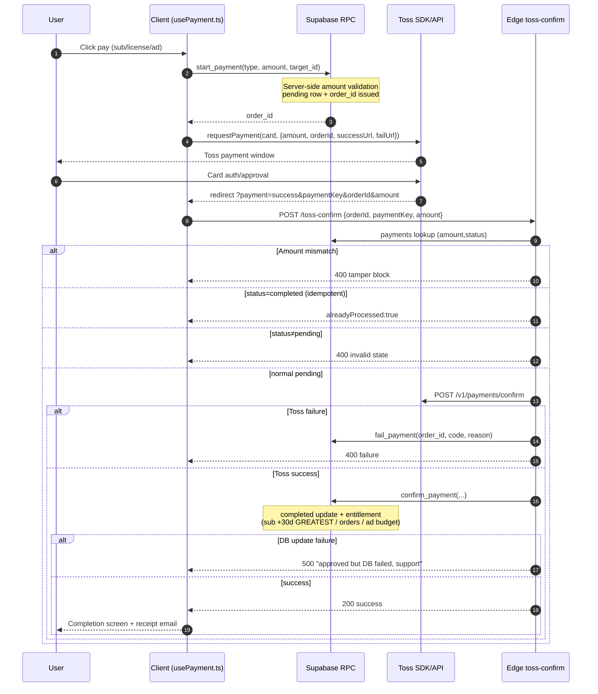
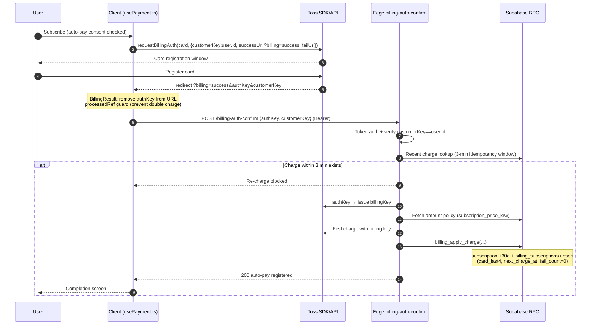
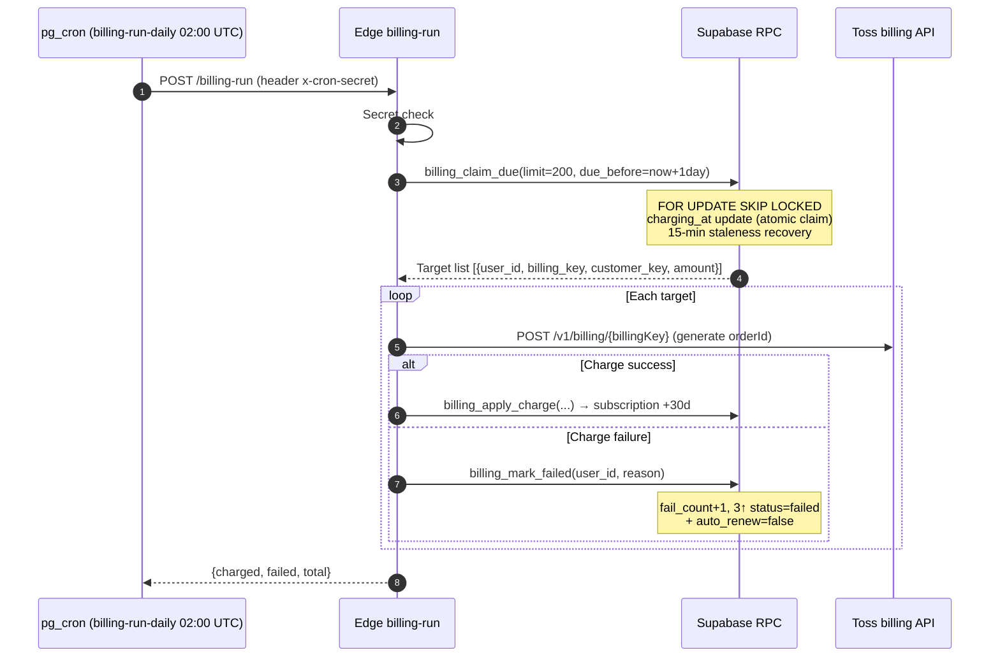
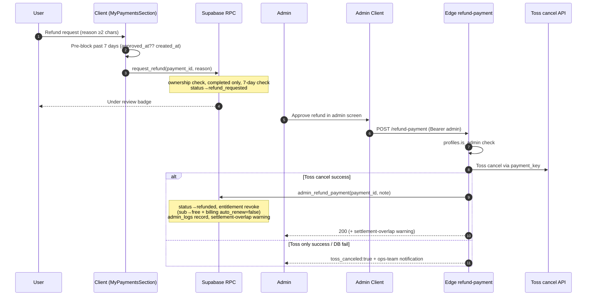
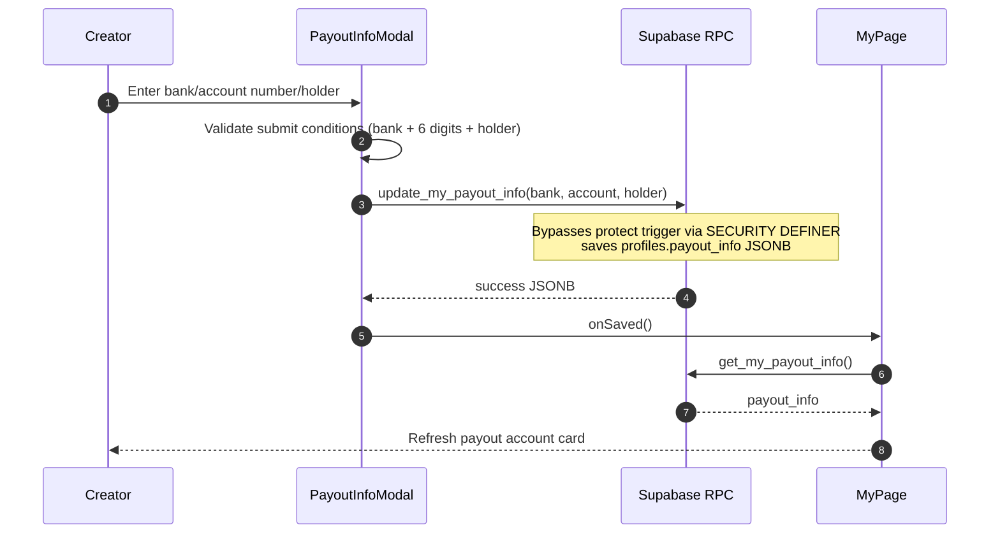

# 07. My Page · Payment / Subscription / Billing — Detailed Specification

> This document was written by reading the actual code and citing `file:line`. It reflects the current implementation with no guesswork.
> Primary target files: `src/app/components/MyPage.tsx`, `PayoutInfoModal.tsx`, `TaxInfoSection.tsx`, `MyPaymentsSection.tsx`, `SubscriptionPage.tsx`, `PaymentResult.tsx`, `BillingResult.tsx`, `src/app/hooks/usePayment.ts`, `supabase/functions/server/index.ts` (Edge), and many `supabase/*.sql` migrations.

---

## 1. Overview / Purpose

My Page is a unified account hub that provides both the buyer (user) and creator (seller) corners on a single screen; payment/subscription/billing is the monetization pipeline that operates within it.

- **My Page** (`MyPage.tsx:430`): After mode selection (`select`/`user`/`creator`, `MyPage.tsx:301-303`, `MyPage.tsx:442-446`), it shows a tab-based screen. Tabs = Profile / Purchases / Sales (creator) / Comment management / Watch history / Playlists / Settings (`MyPage.tsx:1284-1292`).
- The **Settings tab** consolidates Referral · Notifications · **Payment history · Tax** · Security · Block management · Data rights · Account deletion in one place (`MyPage.tsx:2042-2101`).
- **Payment**: Two paths — Toss Payments one-time payment (subscription/license/ad budget) and recurring auto-billing (billing key). The client launches the Toss SDK via `usePayment.ts`, while the trust boundary for approval, billing, and refund is all handled with service_role in the Edge Function (`server/index.ts`).
- **Subscription**: A single premium plan (KRW 4,900/month). The free ad-supported tier is independent of Toss; only premium follows Toss (the merchant review bottleneck, `CLAUDE.md`).
- **Settlement/Tax**: Creator payout account (`payout_info`) · tax type (3.3% withholding) · refund (7-day right of withdrawal) · admin refund · year-end tax report.

Purpose: Provide self-service limited to the account owner (profile/account/tax/payment history/watch history/playlists/blocks/data rights) and a safe payment·subscription·settlement flow all at once.

---

## 2. User Stories

- As a buyer, I want to see my payment history and request a refund for payments within 7 days.
- As a buyer, I want to download videos I purchased a license for from My Page.
- As a user, I want to change my profile (name/bio/avatar/banner), email (email accounts only), and password.
- As a user, I want to subscribe to premium, cancel/resume auto-billing at any time, and get a near-expiry (D-7) notification.
- As a creator, I want to register/edit a payout account, declare my tax type (non-business/business), and preview expected settlement amount and fees.
- As a user, I want to view watch history and delete individual/all entries, manage playlists, and block/unblock specific users.
- As a user, I want to download my data as JSON (data portability) and request/cancel account deletion with a 30-day grace period.
- As an admin, I want to (from a separate admin screen) refund payments, finalize settlements, and produce year-end tax materials.

---

## 3. Screens & State

### 3.1 My Page Entry / Mode
- Not logged in: login prompt screen (`MyPage.tsx:1066-1100`).
- Loading: spinner (`MyPage.tsx:1102-1124`). On re-entry, module cache (`myPageCache`, `MyPage.tsx:428`, `MyPage.tsx:784-805`) provides stale-while-revalidate.
- Mode select screen (`ModeSelectScreen`, `MyPage.tsx:315-378`); entering creator mode with 0 videos shows onboarding guidance (`CreatorOnboardingScreen`, `MyPage.tsx:381-410`, `MyPage.tsx:1138-1140`).
- `isCreator = myProducts.length > 0` (`MyPage.tsx:935`) — with 1+ videos, creator tabs (Sales/Comments) appear.
- The tab list is composed of 5–6 cells depending on `pageMode`/`isCreator` (`MyPage.tsx:1281-1316`). External entry (notifications, etc.) forces a specific tab via `initialTab` (`MyPage.tsx:435-441`).

### 3.2 Profile Section (profile tab)
- Subscription status card: current tier (free/basic/premium) badge + description (`tierMeta`, `MyPage.tsx:938-943`, card `MyPage.tsx:1329-1375`). When subscribed, shows expiry/next charge date, highlights D-7 imminence (`MyPage.tsx:1338-1351`). Button: non-subscriber = upgrade / subscriber = extend → `onNavigate("subscription")`.
- Account info card: email/name/account type (CREATOR badge) (`MyPage.tsx:1377-1406`).
- Quick links: membership management / support / settings (`MyPage.tsx:1408-1425`).
- **Payout account card — creators only** (`MyPage.tsx:1428-1456`): shows `payoutInfo` (bank·account number), register/change button → `PayoutInfoModal`.

### 3.3 Payout Account Modal (`PayoutInfoModal.tsx`)
- Dropdown of 22 Korean banks (`PayoutInfoModal.tsx:17-22`), account number, account holder input.
- Submittable when: bank selected + account number ≥6 numeric digits + account holder entered (`PayoutInfoModal.tsx:55-58`).
- Save → `update_my_payout_info` RPC (`PayoutInfoModal.tsx:63-67`); on success, `onSaved()` triggers `loadPayoutInfo()` re-fetch (`MyPage.tsx:1155`).

### 3.4 Tax Info Section (`TaxInfoSection.tsx`, Settings tab)
- Loaded on entry via `get_my_tax_info` (`TaxInfoSection.tsx:63`).
- 4 tax-type radios: individual / business_simple / business_general / business_corp (`TaxInfoSection.tsx:39-44`).
- When business is selected, extra fields appear: business registration number (10-digit numeric validation, `TaxInfoSection.tsx:94-98`), business name, tax invoice email (`TaxInfoSection.tsx:189-227`).
- Registration-complete badge + `tax_consent_at` display (`TaxInfoSection.tsx:152-159`).
- Save → `update_my_tax_info` (`TaxInfoSection.tsx:102-107`).

### 3.5 Payment History Section (`MyPaymentsSection.tsx`, Settings tab)
- Loaded on entry via `get_my_payments(p_limit=50, p_offset=0)` (`MyPaymentsSection.tsx:61`).
- Status badge color mapping (`MyPaymentsSection.tsx:36-43`): completed/pending/failed/refunded/cancelled/refund_requested.
- Refund button active when: `status==='completed' && within 7 days of payment` (`MyPaymentsSection.tsx:147`, baseline = `approved_at ?? created_at`, `daysSince` `MyPaymentsSection.tsx:45-48`).
- `refund_requested` state shows "under review" + reason, button disabled (`MyPaymentsSection.tsx:171-178`).
- Refund request modal: reason ≥2 chars → `request_refund` (`MyPaymentsSection.tsx:88-112`).

### 3.6 Purchases Section (purchases tab)
- Direct query of `orders` table (JOIN videos) (`MyPage.tsx:617-637`). Shows total spend sum (`MyPage.tsx:1463`).
- Download: `log_download` RPC then Bunny mp4 resolution probe (1080→240p HEAD), then open new tab (`handleDownloadPurchase`, `MyPage.tsx:573-607`).

### 3.7 Sales (Creator) Section (sales tab)
- `CreatorDashboard` + total revenue / net settlement (after fee deduction) KPIs (`MyPage.tsx:1538-1558`).
- Ad revenue stats (impressions/clicks/CTR/expected revenue, weighted-average share rate) (`MyPage.tsx:915-932`, card `MyPage.tsx:1561-1587`).
- Settlement schedule (assumed 15th of each month) (`MyPage.tsx:1589-1607`), monthly revenue chart (`MyPage.tsx:1610-1628`), product list (`MyPage.tsx:1631-1683`).
- Distribution policy loaded via `get_active_platform_settings`; if not loaded, defaults (sales 80% / ads home50·cinema55·ott60 / CPM 2000 / settlement minimum 10000) (`MyPage.tsx:905-910`).

### 3.8 Referral / Watch History / Playlists / Blocks / Data Rights (Settings and dedicated tabs)
- Referral: `ReferralCard` (`MyPage.tsx:2045`).
- Watch history (history tab): `get_my_watch_history`/`delete_my_watch_history` (individual/all) (`MyPage.tsx:807-838`).
- Playlists (playlists tab): `get_my_playlists`/`get_playlist_videos`/`delete_playlist`/`remove_from_playlist` (`MyPage.tsx:840-899`). Watch Later cannot be deleted (notice) (`MyPage.tsx:881-885`).
- Block management (`BlockedUsersSection`, `MyPage.tsx:213-278`): `get_my_blocked_users` + `unblockUser`.
- Data download (`DataDownloadSection`, `MyPage.tsx:27-76`): `export_my_data` → save JSON file.
- Danger zone account deletion (`DangerZoneSection`, `MyPage.tsx:86-210`): `get_my_deletion_status`/`request_account_deletion`/`cancel_account_deletion` (30-day grace).

### 3.9 Subscription Page (`SubscriptionPage.tsx`)
- Free vs Premium (KRW 4,900/month) 2-card comparison (`SubscriptionPage.tsx:136-199`).
- Current premium + auto-billing status / card last 4 digits / auto-billing ON·OFF toggle (`get_my_billing`/`set_my_auto_renew`, `SubscriptionPage.tsx:44-80`, `SubscriptionPage.tsx:110-133`).
- Auto-billing consent checkbox (E-commerce Act); subscribe button disabled until consented (`SubscriptionPage.tsx:179-187`).
- In the app wrapper (reader app), users are guided to web payment to avoid IAP fees (`SubscriptionPage.tsx:56-61`).

### 3.10 Payment Result Screens
- One-time payment result (`PaymentResult.tsx`): `?payment=success|fail`. 3 states processing/success/failed (`PaymentResult.tsx:27`). On success, calls `toss-confirm` then sends receipt email (fire-and-forget, `PaymentResult.tsx:102-129`).
- Auto-billing card registration result (`BillingResult.tsx`): `?billing=success|fail`. On success, calls `billing-auth-confirm`. To prevent double-charging on refresh, immediately removes authKey from URL + `processedRef` guard (`BillingResult.tsx:28-33`, `BillingResult.tsx:53-55`).

---

## 4. Behavior Flows

### 4.1 Profile Edit
1. Edit button → modal opens, prefilled with current values (`MyPage.tsx:1230-1245`).
2. Avatar (≤2MB)/banner (≤5MB) upload → Supabase Storage `user-avatars`/`user-banners`, cache-buster `?t=` added (`MyPage.tsx:501-558`).
3. Save: `auth.updateUser({data:{name}})` + `profiles` upsert (display_name/bio/avatar_url/banner_url) (`MyPage.tsx:1017-1046`).
4. Email change (email accounts only; verify `identities` has provider==='email' `MyPage.tsx:985-994`): `auth.updateUser({email})` → confirmed when the verification email link is clicked (`MyPage.tsx:996-1015`).
5. Password change: validate ≥6 chars and match → `auth.updateUser({password})` (`MyPage.tsx:1048-1064`).

### 4.2 Payout Account Registration
Modal input → `update_my_payout_info(bank,account,holder)` → success toast → `get_my_payout_info` re-fetch → card refresh.

### 4.3 Tax Info
Radio selection → (if business) business number format validation → `update_my_tax_info(...)` → `tax_consent_at` update → registration-complete badge.

### 4.4 Payment History / Refund Request
1. Load `get_my_payments`.
2. On refund button click, client pre-blocks if over 7 days (`MyPaymentsSection.tsx:77-86`).
3. Enter reason (≥2 chars) → `request_refund(p_payment_id, p_reason)` → status `completed`→`refund_requested`.
4. Actual refund (Toss cancel + entitlement revocation) is performed by an admin from the admin screen via `refund-payment` Edge → `admin_refund_payment` RPC.

### 4.5 Subscription — Auto-billing (Recurring) Flow (recommended path)
1. `SubscriptionPage.subscribe()` → after consent check, `startAutoBilling({customerKey:user.id, email})` (`SubscriptionPage.tsx:52-72`).
2. `usePayment.startAutoBilling` → `startBillingAuth` → Toss `requestBillingAuth("카드", {customerKey, successUrl:?billing=success, failUrl:?billing=fail})` (`usePayment.ts:64-78`, `usePayment.ts:139-142`).
3. Toss card registration complete → `?billing=success&authKey=&customerKey=` redirect → `BillingResult` calls `billing-auth-confirm`.
4. Edge `billing-auth-confirm` (`server/index.ts:1163-1246`): token auth → verify customerKey==user.id → **3-minute idempotency** (blocks re-charge if recently charged, `:1176-1188`) → issue billingKey from authKey (`:1195-1205`) → fetch amount policy (`:1208-1212`) → first charge with billing key (`:1216-1225`) → `billing_apply_charge` RPC for subscription +30 days + save billing (`:1230-1235`).
5. Thereafter, the monthly cron (`billing-run`) charges automatically.

### 4.6 Auto-billing Recurring Charge (cron)
1. pg_cron `billing-run-daily` (daily 02:00 UTC) calls the `billing-run` Edge (header `x-cron-secret`) (`billing_cron_20260612.sql:12-22`).
2. Edge `billing-run` (`server/index.ts:1252-1302`): secret check → targets up to **1 day before expiry** (`dueBefore`) → atomic claim via `billing_claim_due` (FOR UPDATE SKIP LOCKED) → per item, Toss billing charge → on success `billing_apply_charge` / on failure `billing_mark_failed`.

### 4.7 Auto-billing Cancel/Resume
`SubscriptionPage.setAutoRenew(on)` → `set_my_auto_renew(p_on)` (`SubscriptionPage.tsx:74-80`). OFF = not charged from the next payment date; current subscription remains until expiry.

### 4.8 One-time Payment (Toss standard payment) Flow
1. `usePayment.startTossPayment` → `start_payment(type, amount, target_id)` RPC issues a pending row + order_id (`usePayment.ts:29-61`).
2. Toss `requestPayment("카드", {amount, orderId, successUrl:?payment=success, failUrl:?payment=fail})`.
3. Success redirect → `PaymentResult` calls the `toss-confirm` Edge.
4. Edge `toss-confirm` (`server/index.ts:1046-1157`): payments lookup → **amount tamper check** (`:1075-1078`) → idempotent (pass if completed `:1080-1083`) → pending-state guard (`:1085-1087`) → Toss confirm API (`:1092-1099`) → on success `confirm_payment` / on failure `fail_payment`.
5. Failure redirect → call `fail_payment` directly (`PaymentResult.tsx:49-57`).

---

## 5. Data / RPC / Edge Contracts

> Unless stated otherwise, all are `SECURITY DEFINER`. Owner-only RPCs are based on `auth.uid()`.

### 5.1 Payment Core RPCs
- **`start_payment(p_payment_type TEXT, p_amount INTEGER, p_target_id TEXT DEFAULT NULL) RETURNS TEXT`** — latest def `start_payment_ad_owner_20260624.sql:15-67` (SECURITY DEFINER, `SET search_path=public`). Issues pending row + order_id. **Server-side amount validation**: subscription = matches platform_settings `subscription_price_krw`, license = one of the video's price_standard/commercial/exclusive, ad budget = verifies `ads.owner_id=uid` ownership (`:52-59`). Initial v1 `phase9_payments.sql:92-128` (no amount check), v2 `payment_hardening_20260612.sql:10-55`.
- **`confirm_payment(p_order_id TEXT, p_payment_key TEXT, p_method TEXT, p_approved_at TIMESTAMPTZ, p_raw_response JSONB) RETURNS VOID`** — `phase9_payments.sql:143-223`. Idempotent (no-op if completed `:166-169`), pending→completed guard (`:171-173`). Subscription: `subscription_expires_at = GREATEST(COALESCE(expires, now()), now()) + INTERVAL '30 days'` (accumulative, `:191-202`). License: orders INSERT (license_type='standard', ON CONFLICT DO NOTHING). Ad: `ads.budget_krw += amount`.
- **`fail_payment(p_order_id TEXT, p_failure_code TEXT, p_failure_reason TEXT) RETURNS VOID`** — `phase9_payments.sql:231-249`. Updates only `WHERE order_id=? AND status='pending'` (prevents overwriting completed records).
- **`get_my_payments(p_limit INTEGER=50, p_offset INTEGER=0) RETURNS TABLE(...)`** — canonical `phase_user_payment_history.sql:48-95`, GRANT `authenticated` (`:97`). Own rows only, created_at DESC. Returns: id, order_id, payment_type, target_id, amount, method, status, approved_at, created_at, failure_reason, refund_reason, refund_requested_at.
- **`request_refund(p_payment_id BIGINT, p_reason TEXT) RETURNS VOID`** — `phase_user_payment_history.sql:117-174`, GRANT `authenticated` (`:176`). Ownership check, completed status only, **blocks past 7 days (right of withdrawal)** (`:155-159`), reason ≥2 chars. → status='refund_requested'.
- **`admin_refund_payment(p_payment_id BIGINT, p_admin_note TEXT=NULL) RETURNS TEXT`** — latest `refund_cancel_billing_20260614.sql:9-93` (`assert_admin()` gate). completed/refund_requested only, status→'refunded', entitlement revocation (subscription→free + expires NULL **+ billing_subscriptions auto_renew=false/status='canceled'**, license orders→refunded, ad budget decrement floor 0), `admin_logs` record, **returns TEXT warning on finalized-settlement overlap** (R6). Old version `phase_user_payment_history.sql:184-244`.
- **`admin_get_all_payments(p_status='all', p_payment_type='all', p_limit=100, p_offset=0)`** — `phase_admin_payments_refund_reason.sql:22-77` (assert_admin, STABLE). Includes refund_reason/refund_requested_at.

### 5.2 Payout Account / Tax RPCs
- **`get_my_payout_info() RETURNS JSONB`** — `phase_security_hardening_20260531.sql:30-38`, GRANT `authenticated` (`:39`). `SELECT payout_info FROM profiles WHERE id=auth.uid()`. (Called by MyPage `loadPayoutInfo`, `MyPage.tsx:452-460`.)
- **`update_my_payout_info(p_bank_name TEXT, p_account_number TEXT, p_account_holder TEXT) RETURNS JSONB`** — `phase_payout_info.sql:20-66`, GRANT `authenticated` (`:68`). Validates login·bank·6-digit account·account holder. Saves `profiles.payout_info` as JSONB (bypasses protect trigger via SECURITY DEFINER).
- **`get_my_tax_info() RETURNS TABLE(tax_type, business_number, business_name, tax_invoice_email, tax_consent_at)`** — `phase32_tax_withholding.sql:125-152`, GRANT `authenticated`.
- **`update_my_tax_info(p_tax_type TEXT, p_business_number TEXT=NULL, p_business_name TEXT=NULL, p_tax_invoice_email TEXT=NULL) RETURNS VOID`** — `phase32_tax_withholding.sql:157-195`, GRANT `authenticated`. Validates 4 tax types; business number required if business_*; always sets `tax_consent_at=now()`.
- **`mark_revenue_paid(p_distribution_id BIGINT) RETURNS VOID`** — `phase32_tax_withholding.sql:64-118` (assert_admin). **Withholding**: if individual (or NULL), `tax_withholding=FLOOR(total*0.033)`; if business, 0. Only `WHERE id=? AND payout_status='pending'` (idempotent). GRANT authenticated but internal assert_admin.
- **`admin_get_tax_annual_report(p_year INTEGER)`**, **`get_revenue_distributions_by_period(p_year, p_month)`** — for admin settlement/tax. The latter extracts bank/account/holder from `payout_info` and exposes it to admin (`phase_settlement_payout_account.sql:21-60`).

### 5.3 Billing (Auto-pay) RPCs
- **`get_my_billing() RETURNS TABLE(card_company, card_last4, auto_renew, status, amount, next_charge_at)`** — `billing_subscriptions_20260612.sql:36-51`, GRANT `authenticated`. **billing_key/customer_key intentionally excluded**.
- **`set_my_auto_renew(p_on BOOLEAN) RETURNS void`** — `billing_subscriptions_20260612.sql:54-65`, GRANT `authenticated`.
- **`billing_apply_charge(p_user_id, p_billing_key, p_customer_key, p_card_company, p_card_last4, p_amount, p_order_id, p_payment_key, p_approved_at, p_raw) RETURNS void`** — `billing_charge_rpcs_20260612.sql:8-68`, GRANT **service_role only** (`:68`). Idempotent (RETURN if order_id completed), payments INSERT (ON CONFLICT DO NOTHING), subscription +30 days GREATEST, billing_subscriptions upsert (next_charge_at=new expiry, fail_count=0).
- **`billing_mark_failed(p_user_id, p_reason) RETURNS void`** — `billing_charge_rpcs_20260612.sql:71-92`, GRANT **service_role**. fail_count+1, **at 3+ sets status='failed' + auto_renew=false**, next_charge_at=+1day.
- **`billing_claim_due(p_limit=200, p_due_before=now()) RETURNS TABLE(user_id, billing_key, customer_key, amount)`** — `billing_claim_due_20260616.sql:14-33`, **REVOKE PUBLIC/anon/authenticated + GRANT service_role**. Atomic claim via `charging_at` update, `FOR UPDATE SKIP LOCKED`, 15-minute staleness auto-recovery. The only path that returns billing_key (Edge-only).

### 5.4 Watch History / Playlists / Blocks / Data Rights RPCs
- Watch history: `get_my_watch_history(p_limit=50, p_offset=0)` (`phase17_watch_history.sql:7-70`, DISTINCT ON video_id latest, excludes deleted·hidden videos), `delete_my_watch_history(p_video_id TEXT=NULL) RETURNS INTEGER` (`:78-102`, NULL=delete all).
- Playlists: `get_my_playlists()` (`phase18_playlists.sql:63-99`, Watch Later pinned), `get_playlist_videos(p_playlist_id uuid)` (`:104-142`, ownership check), `delete_playlist` (`:194-210`, **Watch Later cannot be deleted**), `remove_from_playlist` (`:244-263`), `create/update/add/toggle_watch_later/get_playlist_memberships`. RLS: own only (`:44-60`).
- Blocks: `get_my_blocked_users()` (`phase24_user_blocks.sql:87-104`), `block_user`/`unblock_user` (`:44-82`), `get_my_blocked_user_ids() RETURNS UUID[]` (for client filtering `:109-119`). Viewer-side blocking (client-side filter).
- Data rights: `export_my_data() RETURNS JSONB` (16 data sections, `phase27_user_data_rights.sql:134-189`), `request_account_deletion(p_reason=NULL)`/`cancel_account_deletion()`/`get_my_deletion_status()` (30 days, `:35-220`), `purge_pending_deletions(p_days=30)` (admin/cron, deletes only profiles — auth.users handled by Edge).

### 5.5 Edge Function Contracts (`supabase/functions/server/index.ts`)
- **`POST /toss-confirm`** (`:1046`): body `{orderId, paymentKey, amount}`. With service_role: payments lookup→amount check→Toss confirm→`confirm_payment`/`fail_payment`. (Auth: anon apikey + optional Bearer.)
- **`POST /billing-auth-confirm`** (`:1163`): Bearer auth required, body `{authKey, customerKey}`, customerKey==user.id. 3-minute idempotency, issue billingKey + first charge + `billing_apply_charge`.
- **`POST /billing-run`** (`:1252`): header `x-cron-secret` check (cron-only). `billing_claim_due`→Toss billing charge→apply/mark_failed.
- **`POST /refund-payment`** (`:1833`): Bearer (admin) auth + `profiles.is_admin` check (`:1850-1857`). Toss cancel via payments.payment_key→`admin_refund_payment` (passes assert_admin using the admin token client, `:1916-1926`). Returns info for settlement-overlap warning/email dispatch.
- **`POST /purge-deletions`** (`:1313`): `x-cron-secret` check. For 30+ days elapsed deletion requesters, `auth.admin.deleteUser` (CASCADE destruction).
- All server Edges include public endpoints → deployed with `--no-verify-jwt` (`CLAUDE.md`, `supabase/config.toml`).

---

## 6. Business Rules

- **Subscription price/tiers**: Premium KRW 4,900/month (single). Canonical price is `platform_settings.subscription_price_krw` (queried by both client/Edge, `usePayment.ts:86-89`, `server/index.ts:1208-1212`). Tiers free/basic/premium (`MyPage.tsx:938-942`).
- **Subscription renewal (accumulative)**: On payment, expiry = `GREATEST(existing expiry, now()) + 30 days` — accumulates without cutting remaining period (`confirm_payment` / `billing_apply_charge`).
- **Expiry downgrade**: `reset_expired_subscriptions` (cron 03:00) premium→free (`payment_hardening_20260612.sql:58-69`). Immediate downgrade on refund.
- **7-day right of withdrawal**: `request_refund` blocks past 7 days based on `approved_at ?? created_at` (E-commerce Act). Client also pre-blocks.
- **3.3% withholding**: Non-business (individual/unregistered) gets `tax_withholding=FLOOR(total*0.033)` on settlement finalization; business (business_*) gets 0 (tax invoice handled separately). `mark_revenue_paid`.
- **Minimum settlement amount**: Screen guidance shows KRW 10,000 (`PAYOUT_MIN_KRW`, `MyPage.tsx:910`, display `:1702`) — based on platform_settings `payout_minimum_krw`. (No enforced threshold logic confirmed in the settlement SQL RPC.)
- **Distribution rate**: sales 80% / ads home50·cinema55·ott60 (defaults, changeable via platform_settings, `MyPage.tsx:905-909`).
- **Negotiated sale (license)**: Price must be one of the video's price_standard/commercial/exclusive for the payment to be established (`start_payment` validation).
- **Idempotency**: One-time = order_id UNIQUE + confirm_payment no-op if completed + toss-confirm pass if completed. Billing = RETURN if order_id completed + billing-auth-confirm 3-minute window + BillingResult `processedRef`/authKey removal.
- **Billing key non-exposure**: `billing_subscriptions` has no RLS policy + `REVOKE ALL FROM anon, authenticated` (`billing_subscriptions_20260612.sql:30-33`). `get_my_billing` returns only card company·last 4. billing_key accessible only to service_role (`billing_claim_due`/`billing_apply_charge`).

---

## 7. Edge Cases & Error Handling

- **Duplicate payment confirmation**: toss-confirm passes with `alreadyProcessed:true` if completed (`server/index.ts:1080-1083`); confirm_payment is also no-op.
- **Amount tampering**: If payments.amount ≠ Toss amount, 400 block (`:1075-1078`); also server amount validation at start_payment stage.
- **Invalid state**: Non-pending records rejected at confirm (`:1085-1087`); fail_payment updates only pending.
- **DB update failure (Toss only succeeded)**: toss-confirm 500 + support guidance (`:1126-1134`); billing-auth-confirm same (`:1236-1239`); refund-payment returns `toss_canceled:true` + ops-team notification guidance (`:1928-1937`).
- **Refund state machine**: completed→refund_requested (user)→refunded (admin). Distinct messages on re-request for refund_requested/refunded (`phase_user_payment_history.sql:146-152`). After refund, billing auto_renew=false/canceled blocks cron re-charge.
- **Billing concurrent charge**: `billing_claim_due`'s `FOR UPDATE SKIP LOCKED` + charging_at 15-minute window prevents double-charging on concurrent cron runs.
- **Billing consecutive failures**: After 3 cumulative failures, auto-billing stops (auto_renew=false), user notified (`billing_mark_failed`).
- **Download**: On Bunny per-resolution HEAD probe failure, "encoding in progress" guidance (`MyPage.tsx:598`).
- **Partial data load**: Each query has independent try/catch; missing individual tables only console.warn (partial display instead of blank screen, `MyPage.tsx:609-780`).
- **Invalid payment-result entry**: Outcomes other than success/fail are treated as failure (`PaymentResult.tsx:138-141`).
- **Support**: Payment/refund inquiries → 1:1 inquiry or support@creaite.net (`SubscriptionPage.tsx:206`).

---

## 8. Permissions / Security

- **Owner-only**: get_my_*/update_my_*/request_refund etc. are based on `auth.uid()`, GRANT `authenticated`. Payment history·account·tax·watch history·playlists·blocks·data all return/modify only the owner's.
- **protect_subscription_columns trigger**: For direct `profiles` UPDATE in a normal session, reverts the 8 protected columns (subscription_tier/started_at/expires_at, **payout_info**, **is_admin**, referral_code/referred_by/referral_count) to OLD (`fix_protect_is_admin_20260624.sql:13-35`). Including is_admin is mandatory (omission = privilege-escalation regression, MEMORY `protect-trigger-shared-ssot`). payout_info updates only via the SECURITY DEFINER RPC (`update_my_payout_info`).
- **confirm/billing run as service_role**: toss-confirm/billing-run use the service_role client (`getSupabaseClient(true)`) to bypass RLS + call DEFINER RPCs. billing_apply_charge/mark_failed/claim_due are GRANT service_role only.
- **is_admin refund**: refund-payment Edge proceeds only after token→`profiles.is_admin` check (`server/index.ts:1850-1857`); RPC also `assert_admin()`.
- **Account PII**: Client gets only own `get_my_payout_info`. Other users' accounts exposed only via the admin settlement RPC (`get_revenue_distributions_by_period`). billing_key/customer_key never exposed via any client path.
- **Cron secret**: billing-run/purge-deletions protected by `x-cron-secret` (BILLING_CRON_SECRET).

---

## 9. Analytics / Events

- **Payment conversion**: ratio of confirm_payment(completed) to start_payment(pending); auto-failed-after-24h (`cleanup_stale_payments`) enables drop-off tracking.
- **Subscription metrics**: get_my_billing/billing_subscriptions (status, fail_count, next_charge_at) for active/failed/canceled (auto_renew) cohorts.
- **Refund rate**: payments.status distribution (refund_requested/refunded) + admin_logs `refund_payment` records (was_user_requested flag).
- **Receipt email**: On payment success, `subscription_receipt` notification sent (`PaymentResult.tsx:113-125`).
- **Creator revenue**: ad impressions/clicks/CTR/expected revenue, monthly revenue chart (sales tab).
- (No dedicated GA/event tracker code confirmed in the files in this scope — metrics are DB-state-based.)

---

## 10. Acceptance Criteria (Checklist)

- [ ] Non-creators do not see the payout account card / sales tab; they appear when 1 video is registered.
- [ ] On payout account save, account numbers under 6 digits / empty bank / empty holder are rejected.
- [ ] When business tax type is selected, save requires passing the 10-digit business number validation.
- [ ] In payment history, payments over 7 days have no refund button or are blocked on click.
- [ ] On refund request, status changes to refund_requested and an "under review" badge appears.
- [ ] On successful subscription payment, expiry accumulates +30 days on top of the existing expiry (not cut).
- [ ] With auto-billing ON, the cron auto-charges 1 day before expiry; with OFF, it stays only until expiry.
- [ ] Re-confirming the same order_id (including refresh) does not cause double charging / double entitlement.
- [ ] After 3 consecutive billing failures, auto-billing stops and the user is notified.
- [ ] billing_key/customer_key is never returned via any client path (get_my_billing returns only last 4).
- [ ] A normal user cannot change subscription_tier/is_admin/payout_info via direct profiles UPDATE (trigger reverts).
- [ ] Calling refund-payment with a non-admin token returns 403.
- [ ] On settlement finalization, non-business records 3.3% withholding, business records 0.
- [ ] Data download produces a 16-section JSON.
- [ ] After an account deletion request, a 30-day grace is shown, cancelable; if not canceled, the cron destroys it.

---

## 11. Known Constraints / Carry-overs

- **Toss merchant review bottleneck**: Premium subscription·license payment follows Toss Payments merchant review (1–2 months). The free ad-supported tier is independent of Toss and can launch first (`CLAUDE.md`).
- **PG dependency**: Billing is Toss-based. Changing PG (e.g., Inicis) carries large billing rebuild cost → considered only if Toss rejects (`CLAUDE.md`).
- **App (IAP) avoidance**: In the app wrapper, subscription is guided to web (creaite.net) (`SubscriptionPage.tsx:56-61`). iOS after beta.
- **2FA not implemented**: In the security section, the "in preparation" button is hidden (`MyPage.tsx:2070`).
- **Minimum settlement enforcement**: Screen guidance (KRW 10,000) exists, but no minimum-threshold blocking logic in the settlement RPC is confirmed in this scope's SQL — needs verification at ops/admin finalization stage.
- **basic tier**: Defined in tierMeta but the current plan is a 2-tier free/premium (`SubscriptionPage.tsx`). The basic activation path is unimplemented.
- **Missing search_path**: Some phase17/phase18 RPCs do not specify `SET search_path` (other migrations do) — a hardening candidate.
- **2026-06-16 lesson** (MEMORY): For external·regional facts (fees·tax rates·policy), do not assert; verify latest values first.

---

## Wireframes (Text Mockups)

### My Page — Profile Tab (`MyPage.tsx:1329-1456`)

```
┌──────────────────────────────────────────────────────────────┐
│  [Banner image]                                     [Edit profile]│
│   (●avatar)  Hong Gildong  creator@creaite.net  [CREATOR]      │
├──────────────────────────────────────────────────────────────┤
│  ┌── Subscription status ───────────────────────────────────┐ │
│  │ [PREMIUM] Premium member                                  │ │
│  │ Next charge: 2026-07-25  (27 days to expiry)              │ │
│  │ ⚠ Expiry imminent (highlighted within D-7)                │ │
│  │                                [ Extend/manage sub → ]    │ │
│  └──────────────────────────────────────────────────────────┘ │
│  ┌── Account info ────────┐  ┌── Quick links ───────────────┐ │
│  │ Email  creator@…       │  │ ▸ Membership management      │ │
│  │ Name   Hong Gildong    │  │ ▸ Support                    │ │
│  │ Type   [CREATOR]       │  │ ▸ Settings                   │ │
│  └────────────────────────┘  └──────────────────────────────┘ │
│  ┌── Payout account (creators only) ────────────────────────┐ │
│  │ Kookmin Bank  123456-**-****  Hong Gildong               │ │
│  │                              [ Register/change → modal ]  │ │
│  └──────────────────────────────────────────────────────────┘ │
└──────────────────────────────────────────────────────────────┘
Tabs: [Profile][Purchases][Sales][Comments][Watch history][Playlists][Settings]
```

### Payout Account Modal (`PayoutInfoModal.tsx`)

```
┌──────────── Register payout account ─────────────┐
│  Bank          [ Kookmin Bank      ▼ ]           │  ← 22 banks dropdown
│  Account no.   [ 12345678901        ]            │  ← ≥6 numeric digits
│  Account holder[ Hong Gildong       ]            │
│  ────────────────────────────────────────────────│
│  ⓘ Settlement on the 15th monthly, min KRW 10,000 │
│              [ Cancel ]   [ Save ]               │  ← disabled if conditions unmet
└───────────────────────────────────────────────────┘
```

### Tax Info Section (`TaxInfoSection.tsx`, Settings tab)

```
┌──────────── Tax info ─────────────────────────────┐
│ Tax type                                           │
│  (◉) Non-business (3.3% withholding)               │
│  ( ) Simplified-tax business                       │
│  ( ) General-tax business                          │
│  ( ) Corporate business                            │
│ ─ Expands when business is selected ───────────────│
│  Business reg. no. [ 123-45-67890 ]  ← 10 digits   │
│  Business name     [ Crebiz Co.   ]                │
│  Tax invoice email [ tax@…        ]                │
│ ───────────────────────────────────────────────────│
│  [✓ Registered]  Consent 2026-06-01   [ Save ]     │
└─────────────────────────────────────────────────────┘
```

### Payment History Section (`MyPaymentsSection.tsx`, Settings tab)

```
┌──────────── Payment history ───────────────────────────────┐
│ 2026-06-20  Premium sub   KRW 4,900  [Done]  [Request refund]│ ← ≤7d
│ 2026-06-10  License buy   KRW 50,000 [Done]  (over 7d,       │
│                                               no button)    │
│ 2026-06-18  Ad budget     KRW 30,000 [Reviewing] reason: …  │ ← refund_requested
│ 2026-05-30  Premium sub   KRW 4,900  [Refunded]             │
│ 2026-05-12  License buy   KRW 20,000 [Failed] reason: limit │
└────────────────────────────────────────────────────────────┘
Badge colors: Done=green Pending=yellow Failed=red Refunded=gray Reviewing=orange
```

### Referral / Watch History / Playlists / Blocks (Settings and dedicated tabs)

```
[Settings tab]                     [Watch history tab]
┌── Referral card ────────┐        ┌──────────────────────────┐
│ My code   CR-AB12        │        │ VideoA  2026-06-24 [Del] │
│ 3 signups · earned KRW X │        │ VideoB  2026-06-23 [Del] │
│ [Copy code] [Share]      │        │           [ Delete all ] │
└──────────────────────────┘        └──────────────────────────┘
[Playlists tab]                    [Block management (Settings)]
┌──────────────────────────┐        ┌──────────────────────────┐
│ 📌 Watch Later (no delete) │        │ user_xyz       [Unblock] │
│ My collection 1   [Del]    │        │ user_abc       [Unblock] │
│  └ video list [Remove one] │        └──────────────────────────┘
└──────────────────────────┘
```

### Subscription Page (`SubscriptionPage.tsx`)

```
┌──────────────── Membership ────────────────┐
│ ┌── FREE ──────┐   ┌── PREMIUM ──────────┐ │
│ │ KRW 0        │   │ KRW 4,900 / month   │ │
│ │ • Ad viewing │   │ • No ads            │ │
│ │ • Basic res. │   │ • Cinema/OTT unlimited│ │
│ │              │   │ • High resolution    │ │
│ │ [Current]    │   │ [✓] Auto-pay consent │ │  ← button disabled if not consented
│ │              │   │ [ Subscribe ]        │ │
│ └──────────────┘   └─────────────────────┘ │
│ ── Current auto-pay status (premium member) ─│
│  Card  Kookmin Card ****1234                 │
│  Auto-pay  [ ON ●——○ OFF ]  toggle           │
│  Next charge  2026-07-25                      │
│  Inquiries: support@creaite.net              │
└──────────────────────────────────────────────┘
```

### Payment Result Screens (`PaymentResult.tsx` / `BillingResult.tsx`)

```
[One-time ?payment=success]         [Failure ?payment=fail]
┌──────────────────────────┐        ┌──────────────────────────┐
│   ⏳ Confirming payment…  │        │   ❌ Payment failed       │
│   (calls toss-confirm)     │        │   Reason: card limit      │
│        ↓                   │        │   [ Retry ] [ Home ]      │
│   ✅ Payment complete!     │        └──────────────────────────┘
│   Premium activated (30d)  │
│   Receipt email sent       │        [Auto-pay card reg ?billing=success]
│   [ My Page ] [ Home ]    │        │ ⏳ Registering card…       │
└──────────────────────────┘        │ (billing-auth-confirm,    │
                                     │  authKey removed from URL)│
                                     │ ✅ Auto-pay registered    │
```

---

## Sequence Diagrams

### One-time Payment (start_payment → Toss → toss-confirm → confirm_payment, idempotent)



### Auto-billing Setup (billing-auth-confirm: billing key + first charge)



### Recurring Charge (billing-run cron)



### Refund (request_refund → admin Edge → admin_refund_payment)



### Payout Account Registration (update_my_payout_info)



---

## API / RPC / Edge Reference

### Owner Read/Write RPCs (GRANT authenticated, based on auth.uid())

| Name | Args | Returns | Permission | file:line |
|---|---|---|---|---|
| `get_my_payout_info` | (none) | `JSONB` (payout_info) | authenticated, DEFINER | `phase_security_hardening_20260531.sql:30-39` |
| `update_my_payout_info` | `p_bank_name TEXT, p_account_number TEXT, p_account_holder TEXT` | `JSONB` | authenticated, DEFINER (bypass protect) | `phase_payout_info.sql:20-68` |
| `get_my_tax_info` | (none) | `TABLE(tax_type, business_number, business_name, tax_invoice_email, tax_consent_at)` | authenticated | `phase32_tax_withholding.sql:125-152` |
| `update_my_tax_info` | `p_tax_type TEXT, p_business_number TEXT=NULL, p_business_name TEXT=NULL, p_tax_invoice_email TEXT=NULL` | `VOID` | authenticated | `phase32_tax_withholding.sql:157-195` |
| `get_my_payments` | `p_limit INTEGER=50, p_offset INTEGER=0` | `TABLE(id, order_id, payment_type, target_id, amount, method, status, approved_at, created_at, failure_reason, refund_reason, refund_requested_at)` | authenticated | `phase_user_payment_history.sql:48-97` |
| `request_refund` | `p_payment_id BIGINT, p_reason TEXT` | `VOID` | authenticated (ownership + 7-day check) | `phase_user_payment_history.sql:117-176` |
| `get_my_billing` | (none) | `TABLE(card_company, card_last4, auto_renew, status, amount, next_charge_at)` | authenticated (excludes billing_key) | `billing_subscriptions_20260612.sql:36-51` |
| `set_my_auto_renew` | `p_on BOOLEAN` | `void` | authenticated | `billing_subscriptions_20260612.sql:54-65` |

### Payment Core RPCs

| Name | Args | Returns | Permission | file:line |
|---|---|---|---|---|
| `start_payment` | `p_payment_type TEXT, p_amount INTEGER, p_target_id TEXT=NULL` | `TEXT` (order_id) | authenticated, DEFINER, server amount check | `start_payment_ad_owner_20260624.sql:15-67` |
| `confirm_payment` | `p_order_id TEXT, p_payment_key TEXT, p_method TEXT, p_approved_at TIMESTAMPTZ, p_raw_response JSONB` | `VOID` | DEFINER (idempotent, pending→completed) | `phase9_payments.sql:143-223` |
| `fail_payment` | `p_order_id TEXT, p_failure_code TEXT, p_failure_reason TEXT` | `VOID` | DEFINER (updates pending only) | `phase9_payments.sql:231-249` |
| `admin_refund_payment` | `p_payment_id BIGINT, p_admin_note TEXT=NULL` | `TEXT` (settlement-overlap warning) | assert_admin() | `refund_cancel_billing_20260614.sql:9-93` |
| `admin_get_all_payments` | `p_status='all', p_payment_type='all', p_limit=100, p_offset=0` | `TABLE(...)` | assert_admin, STABLE | `phase_admin_payments_refund_reason.sql:22-77` |
| `mark_revenue_paid` | `p_distribution_id BIGINT` | `VOID` | internal assert_admin (3.3% withholding) | `phase32_tax_withholding.sql:64-118` |

### Billing Core RPCs (service_role only — Edge-only)

| Name | Args | Returns | Permission | file:line |
|---|---|---|---|---|
| `billing_claim_due` | `p_limit=200, p_due_before=now()` | `TABLE(user_id, billing_key, customer_key, amount)` | service_role (REVOKE public/anon/authenticated), FOR UPDATE SKIP LOCKED | `billing_claim_due_20260616.sql:14-33` |
| `billing_apply_charge` | `p_user_id, p_billing_key, p_customer_key, p_card_company, p_card_last4, p_amount, p_order_id, p_payment_key, p_approved_at, p_raw` | `void` | service_role (idempotent, sub +30d) | `billing_charge_rpcs_20260612.sql:8-68` |
| `billing_mark_failed` | `p_user_id, p_reason` | `void` | service_role (fail_count+1, 3↑ stop) | `billing_charge_rpcs_20260612.sql:71-92` |

### Edge Function (`supabase/functions/server/index.ts`)

| Endpoint | Args (body/header) | Returns | Permission | file:line |
|---|---|---|---|---|
| `POST /toss-confirm` | `{orderId, paymentKey, amount}` | `{success, message, alreadyProcessed?}` / 4xx·5xx | anon apikey (+optional Bearer), service_role processing | `server/index.ts:1046-1157` |
| `POST /billing-auth-confirm` | `{authKey, customerKey}`, Bearer | `{success}` / 4xx·5xx | Bearer required, customerKey==user.id, 3-min idempotency | `server/index.ts:1163-1246` |
| `POST /billing-run` | header `x-cron-secret` | `{charged, failed, total}` | cron secret (BILLING_CRON_SECRET) | `server/index.ts:1252-1302` |
| `POST /refund-payment` | (admin body), Bearer | `{success, ...settlement-overlap/toss_canceled}` | Bearer + profiles.is_admin | `server/index.ts:1833-1937` |

### Client Hooks / Call Sites

| Function | Role | file:line |
|---|---|---|
| `usePayment.startTossPayment` | start_payment → Toss requestPayment | `usePayment.ts:29-61` |
| `usePayment.startAutoBilling` / `startBillingAuth` | requestBillingAuth (billing key registration) | `usePayment.ts:64-78, 139-142` |
| `PaymentResult` | calls toss-confirm + receipt email | `PaymentResult.tsx:102-129` |
| `BillingResult` | calls billing-auth-confirm + idempotency guard | `BillingResult.tsx:28-55` |

---

## Test Cases

### Profile Edit

```gherkin
Feature: Profile edit
  Scenario: Save name, bio, avatar
    Given a logged-in user opens the profile edit modal
    When they edit name and bio and upload an avatar ≤2MB, then save
    Then auth.updateUser({data:{name}}) and profiles upsert are called
    And a cache-buster ?t= is appended to the avatar URL for instant reflection

  Scenario: Email change is allowed for email accounts only
    Given an OAuth (Google) login user
    When they open profile edit
    Then the email change field is not shown (identities provider!='email')

  Scenario: Reject password under 6 chars
    When the password is entered as "12345"
    Then it is blocked by the ≥6 chars and match validation and not saved
```

### Payout Account

```gherkin
Feature: Payout account registration
  Scenario: Normal save
    Given a creator (1+ videos)
    When bank selected + 11-digit account number + holder entered, then save
    Then update_my_payout_info is called and the payout account card refreshes

  Scenario Outline: Reject input validation
    When <field> is set to <value> and submission is attempted
    Then the save button is disabled or the RPC rejects
    Examples:
      | field         | value           |
      | account no.   | 12345 (5 digits)|
      | bank          | (not selected)  |
      | account holder| (empty)         |
```

### Payment (One-time)

```gherkin
Feature: One-time payment
  Scenario: Subscription payment success
    Given start_payment created a pending payment and order_id
    When toss-confirm is called after Toss approval
    Then amount check passes → Toss confirm → confirm_payment runs
    And subscription_expires_at = GREATEST(existing expiry, now()) + 30 days accumulates
    And a subscription_receipt email is sent

  Scenario: Payment failure redirect
    Given entry via ?payment=fail
    When fail_payment is called
    Then the status of that order_id is recorded as failed (updates pending only)
```

### Subscription / Auto-billing

```gherkin
Feature: Subscription and auto-billing
  Scenario: Auto-billing registration (billing key issuance)
    Given the auto-billing consent checkbox is checked
    When billing-auth-confirm is called after requestBillingAuth
    Then billingKey is issued from authKey → first charge → billing_apply_charge
    And get_my_billing returns only card company·last 4 and never exposes billing_key

  Scenario: Auto-billing OFF
    Given a premium + auto-billing ON user
    When set_my_auto_renew(false) is called
    Then no charge occurs from the next payment date and the current subscription stays until expiry

  Scenario: Recurring charge (cron)
    Given an active subscription 1 day before expiry
    When billing-run runs
    Then claim via billing_claim_due → Toss billing charge → subscription +30 days accumulates
```

### Refund

```gherkin
Feature: Refund
  Scenario: Refund request within 7 days
    Given a completed payment 5 days after payment
    When a refund is requested with a reason ≥2 chars
    Then status changes to refund_requested and an "under review" badge appears

  Scenario: Admin refund approval
    Given a refund_requested payment
    When an admin calls the refund-payment Edge
    Then after Toss cancel, admin_refund_payment sets status→refunded
    And the subscription is downgraded to free and billing auto_renew=false blocks cron re-charge
```

### Edge Cases

```gherkin
Feature: Edge cases
  Scenario: Duplicate confirmation (including refresh)
    Given an order_id already completed
    When toss-confirm is called again
    Then it passes with alreadyProcessed:true and confirm_payment is no-op (no double entitlement)

  Scenario: Concurrent charge prevention
    Given billing-run cron runs twice simultaneously
    When they try to claim the same target
    Then FOR UPDATE SKIP LOCKED + charging_at window ensures charging only once

  Scenario: DB update failure (Toss only succeeded)
    Given Toss confirm succeeded but confirm_payment RPC failed
    Then a 500 with "approved but DB processing failed, contact support" is returned

  Scenario: Right of withdrawal past 7 days
    Given a completed payment 8 days after payment
    When a refund is requested
    Then the client pre-blocks or request_refund rejects for being past 7 days

  Scenario: Minimum settlement amount
    Given cumulative settlement under KRW 10,000
    Then the screen guidance shows the minimum settlement amount of KRW 10,000
    # Note: enforced minimum threshold in the settlement SQL RPC is unconfirmed in this scope (carry-over)

  Scenario: 3 consecutive billing failures
    Given a subscription with 2 consecutive failed charges
    When the 3rd charge also fails
    Then billing_mark_failed sets status=failed + auto_renew=false and notifies the user
```

### Acceptance Criteria (Summary)

- [ ] All owner-only RPCs return/modify data based solely on auth.uid().
- [ ] Subscription expiry always accumulates via GREATEST without cutting remaining period.
- [ ] billing_key/customer_key is never exposed via any client path.
- [ ] No double charge / double entitlement on re-confirming the same order_id.
- [ ] Payments over 7 days are blocked from refund.
- [ ] A refund-payment call with a non-admin token returns 403.
- [ ] On settlement finalization for non-business, 3.3% withholding is recorded.
