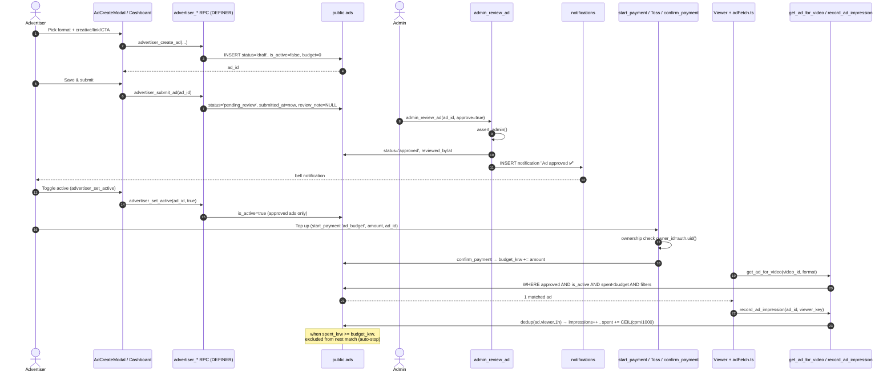
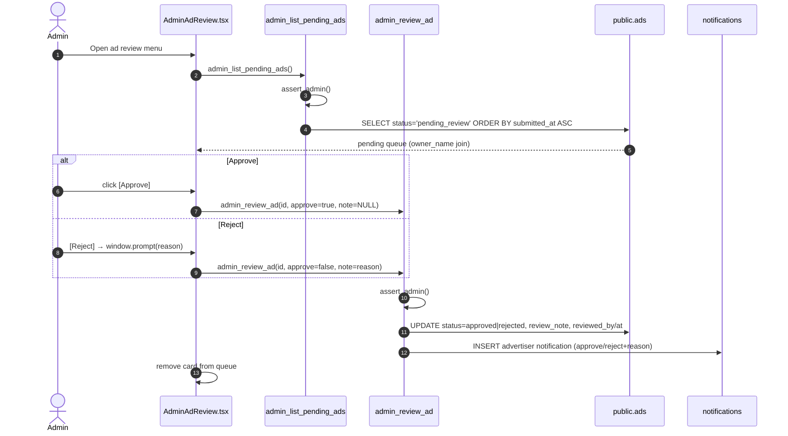
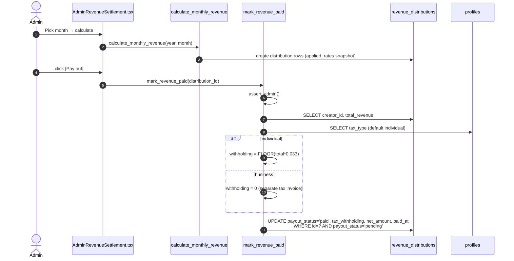
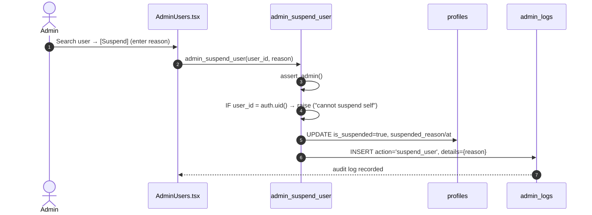

# 08. Ads · Advertisers · Admin — Detailed Spec

> This document was written **by reading the actual code** (no guessing). Every RPC/RLS/Edge function carries a `file:line` citation.
> Scope: (1) ad serving & billing (in-house House Ads + external ad networks), (2) advertiser self-service center, (3) the entire admin panel.
> Last reviewed: 2026-06-28. Supporting SSOT docs: `docs/advertiser-self-service-design.md`, `docs/ad-fraud-hardening-plan.md`, `docs/launch-checklist.md`.

---

## 1. Overview / Purpose

CREAITE's ad/operations system has three pillars.

1. **Ad serving & monetization** — the core revenue source for the free (ad-supported) tier. There are 6 ad formats (`src/app/utils/adFetch.ts:7` `AdFormat = "feed" | "preroll" | "midroll" | "overlay" | "postroll" | "bumper"`), and surfaces are mutually exclusive (`supabase/ad_surface_exclusive_20260615.sql`). House Ads (`budget_krw IS NULL`) and advertiser budget ads (`budget_krw` set) share the same `public.ads` table but are distinguished by billing/serving gates. When no House Ad is available, empty slots rotate external networks (Kakao AdFit + Google AdSense) (`src/app/components/ExternalAdSlot.tsx`).

2. **Advertiser self-service** — after signing up, a normal user creates ads (uploads creatives), submits for review, and after approval tops up budget to start serving (`src/app/components/AdvertiserDashboard.tsx`). All writes go through `advertiser_*` SECURITY DEFINER RPCs (no direct INSERT/UPDATE policy).

3. **Admin panel** — a YouTube Studio-style separate layout (`src/app/components/AdminLayout.tsx`). 21 menus grouped (users/content/notices/inquiries/challenges/banners/bugs/mega/house-ads/ad-review/external-ads/sponsorships/revenue-policy/settlement/payments/reports/hidden/comments/activity-log). Every admin function is gated by `assert_admin()` (`supabase/phase10_6_admin_management.sql:18`) or `is_admin()` (`supabase/admin_rls_is_admin_function.sql:21`).

**Key launch dependency:** the free ad tier can launch ahead of Toss Payments merchant review (`CLAUDE.md` launch dependency order). But advertiser **budget top-up** depends on Toss payment (`ad_budget`), so top-up activates only after payment onboarding.

---

## 2. User Stories (Advertiser / Admin)

### Advertiser

- As a signed-up user, just by **logging in** I can enter the advertiser center and create my first ad (`AdvertiserDashboard.tsx:93` prompts sign-in when not logged in).
- I can pick one of 4 formats (overlay banner / feed image / feed video / video preroll), enter creative (image or video)/link/CTA, and **save draft** or **save & submit** (`AdCreateModal.tsx:47,317-332`).
- I want to see the per-impression price (₩2/imp, CPM ₩2,000) and estimated impressions up front (`AdCreateModal.tsx:201-215`, `AdTopupModal.tsx:34`).
- I want to see my submitted ad's **review status** (draft/in review/approved/rejected/paused) and **rejection reason** (`AdvertiserDashboard.tsx:68-78,140-142`).
- I want to **top up budget** on approved ads (₩10,000 min), have serving start immediately on top-up, and auto-stop when budget is depleted (`AdTopupModal.tsx`, `advertiser_self_service_phase1_20260614.sql:70`).
- I want **impressions/clicks/CTR** per ad and a **14-day daily trend** (`AdStatsModal.tsx`, `advertiser_self_service_phase5_20260614.sql:54`).
- I understand that editing an approved ad triggers re-review, and I expect serving to auto-resume on re-approval (`AdCreateModal.tsx:303-307`, `advertiser_edit_approved_rereview_20260615.sql`).
- I can **pause/resume** an ad myself (`AdvertiserDashboard.tsx:182-185`).

### Admin

- I enter a separate console via My Page → "Admin Page" (menu shown to admins only, `AdminLayout.tsx:154,167`).
- I view the submitted-ad queue, preview creatives, and **approve/reject (with reason)** (`AdminAdReview.tsx`, `admin_review_ad`).
- I register/edit/toggle/delete **House Ads** directly (`AdminDashboard.tsx`).
- I search/suspend users and grant admin role (`AdminUsers.tsx`), force-hide/delete content (`AdminContent.tsx`), manage comments (`AdminComments.tsx`), handle the report queue (`AdminReports.tsx`), and run AI safety moderation (`AdminModeration.tsx`).
- I compute monthly creator revenue and pay it out with tax withholding (`AdminRevenueSettlement.tsx`).
- I change policy (split rates/CPM/settlement thresholds) and track history (`AdminRevenuePolicy.tsx`).
- I handle payments/refunds (`AdminPayments.tsx`), broadcast notices (`AdminBroadcast.tsx`), customer/business inquiries (`AdminSupportInquiries.tsx`, `AdminInquiries.tsx`), and bugs/mega/challenges/banners.
- I can audit all my own changes via the audit log (`AdminActivityLog.tsx`, `admin_logs`).

---

## 3. Screens & State

### 3.1 Advertiser Center (`AdvertiserDashboard.tsx`)

- **Entry**: sign-in prompt when not logged in (`:93-97`).
- **List**: loads own ads via `advertiser_my_ads()` RPC (`:44`). Each card = creative thumb + title + status badge + impressions/clicks/CTR (`:130-136`).
- **5 status badges** (`:68-78`): `draft`, `pending_review`, `approved`, `rejected`, `paused`.
- **Rejection card**: when `rejected` + `review_note`, the reason shows in a red box (`:140-142`).
- **Budget bar**: `approved` ads show a `spent_krw / budget_krw` bar (`:144-157`). When `budget_krw === 0`, shows "Top up budget to start serving" (`:153-155`).
- **Per-state buttons** (`:159-197`):
  - `draft`/`rejected`: [Edit] [Submit].
  - `approved`: [Top up] [Edit] [Pause/Resume].
  - `pending_review`: "Under review" + [Edit].
- **Modals**: `AdCreateModal` (create/edit), `AdTopupModal` (top-up), `AdStatsModal` (stats) (`:207-209`).

### 3.2 Create/Edit Ad (`AdCreateModal.tsx`)

- **Pick 1 of 4 formats** (new ad only, `:174-198`): overlay / feed_image / feed_video / preroll → DB mapping `format`+`ad_type` (`:114-115`).
- **Cost note**: fixed ₩2 per impression (same for all formats); e.g. ₩10,000 → ~5,000 impressions (`:201-215`).
- **Inputs**: ad name (80 chars), advertiser name (optional, 60), creative (image or video), click link, CTA (20 chars).
- **Image upload**: `ad-images` bucket `{uid}/{ts}.{ext}`, 10MB limit, image/* only (`:72-87`). Pasted URL that fails to load falls back to a warning (`:245-259`).
- **Video upload**: Bunny (create-upload + TUS) `uploadAdVideo`, 300MB limit, video/* only (`:89-101`). Shows progress.
- **Re-review mode** (`reReview`, `:58`): editing approved/in-review ads → single [Save & re-review] button only (no re-submit, `:317-321`).
- **New mode**: [Save draft] / [Save & submit] two buttons (`:322-332`).

### 3.3 Budget Top-up (`AdTopupModal.tsx`)

- Presets ₩10,000/30,000/50,000/100,000 + custom (`:23,71-84`), min ₩10,000 (`:24,37`).
- Estimated impressions = `amount / cpm(=2)` (`:34`).
- E-commerce law refund notice (full refund within 7 days before serving / remaining balance after, `:91-97`).
- Payment: `usePayment.startAdBudgetTopUp` → Toss payment window → `/?payment=success` → `confirm_payment` increases `budget_krw` (`:1-5,40`).

### 3.4 Ad Stats (`AdStatsModal.tsx`)

- `advertiser_ad_daily_stats(p_ad_id, p_days=14)` RPC (`:25`). Total impressions/clicks/CTR + daily bar chart (`:62-78`).

### 3.5 External Ad Slot (`ExternalAdSlot.tsx`)

- External networks fill feed slots with no House Ad (every 4 videos). Fixed 300×250 size (`:27-29`).
- Networks: Kakao AdFit (`:101-113`) + Google AdSense (`:114-132`). `index % networks.length` rotation (`:76`).
- Active condition: `VITE_EXTERNAL_ADS_ENABLED` + network IDs (env) present (`:41-42`). When inactive returns `null` → no empty box (`:140-142`).
- **Lazy load**: IntersectionObserver `rootMargin: 300px` loads scripts only near the viewport (avoids first-screen jank from infinite-feed concurrent loads, `:82-94`).
- AdFit policy compliance: no rounding/border/AD overlay; show original as-is (`:149-151`).

### 3.6 Video Ad Player (`AdMidrollPlayer.tsx`) / Overlay (`AdOverlayBanner.tsx`)

- **AdMidrollPlayer**: video.js-based fullscreen ad (pre/mid/post-roll/bumper). HTML5 `<video>` memory leak (800MB+) → moved to video.js `dispose()` (`:1-7`). `recordAdImpression` on mount (`:37`), completed tally on `ended` (`:80-88`), SKIP policy (`skip_after_seconds`, `:33-34`), muted autoplay then unmute attempt (`:99-121`), timeout fallback (`maxDur+5`s, `:124-127`), `recordAdClick` on click (`:147`).
- **AdOverlayBanner**: bottom banner over video, `duration_seconds` countdown auto-close (`:23-35`), text fallback on image load failure (`:54-67`), `recordAdClick("overlay")` on click (`:39`).

### 3.7 Admin Panel Screens (`AdminLayout.tsx`)

Layout: left sidebar + main (`:219-324`). Menu groups (`:74-96`):
- **📊 At a glance**: dashboard (`overview` → `AdminOverview`).
- **👥 Operations**: users/content/notices/customer-inquiries/business-inquiries/challenges/banners/bugs/mega.
- **📢 Ad management**: House Ads (`ads` → `AdminDashboard`)/Ad review (`ad_reviews` → `AdminAdReview`)/External ads (placeholder)/Sponsorships (placeholder).
- **💰 Monetization**: revenue policy/settlement/payments-refunds.
- **🛡 Safety & quality**: report queue/hidden content/comments/activity log.

Badges: mega-pending, new bugs, unanswered inquiries counts (`:138-149`). Access restriction: blocked screen for not-logged-in/non-admin (`:157-180`).

Per-panel screens:
- **AdminOverview**: KPI cards (users/videos/monthly revenue/24h views) + alert banner + charts (revenue/growth/views, 30 days) + Top10 videos/creators + ad performance summary.
- **AdminDashboard (House Ads)**: House/Advertiser tabs, form (per-format options/budget/period/targeting), image (`ad-images`)/Bunny video upload, toggle/delete.
- **AdminAdReview (Ad review)**: `pending_review` queue, creative preview, [Approve]/[Reject (reason prompt)] (`AdminAdReview.tsx:34-47`).
- **AdminUsers / AdminContent / AdminComments / AdminModeration / AdminReports / AdminActivityLog**: search/filter/action (suspend/hide/delete/restore/review).
- **AdminPayments / AdminRevenueSettlement / AdminRevenuePolicy**: payments/refunds, monthly settlement + tax, policy edit/history.
- **AdminBroadcast / AdminInquiries / AdminSupportInquiries / AdminBugReports / AdminChallenges / AdminBanners / AdminMegaUploader**: operations tools.
- **AdminExternalAds / AdminSponsorships**: placeholders in progress (`AdminLayout.tsx:48-49,204-205`).

---

## 4. Flows

### 4.1 Create → edit → submit → approve/reject → activate → top up → serve/bill

```
[Create]  advertiser_create_ad  → status='draft', is_active=false, budget_krw=0   (phase1:98-118)
   ↓
[Edit]    advertiser_update_ad  (draft/rejected: free / approved: re-review switch) (rereview:12-45)
   ↓
[Submit]  advertiser_submit_ad  → status='pending_review', submitted_at=now()      (phase1:140-150)
   ↓
[Review]  admin_review_ad(approve)
           ├ approve → status='approved' + advertiser notification (bell)          (phase1:180-205)
           └ reject  → status='rejected', review_note=reason + notification
   ↓
[Activate] right after approval, is_active is controlled by advertiser. budget=0 → 0 impressions
   ↓
[Top up]  start_payment('ad_budget', amount, adId) → Toss → confirm_payment raises budget_krw
   ↓
[Serve]   get_ad_for_video / pick_random_video_preroll: status='approved' AND is_active
           AND (budget_krw IS NULL OR spent_krw < budget_krw) AND period/length/category filters (phase1:43-94)
   ↓
[Bill]    record_ad_impression: budget ads count once per (ad,viewer,1h) + deduct CPM  (phase5:11-51)
           when spent_krw >= budget_krw, excluded from next match → auto-stop
```

**Re-review flow for approved-ad edits** (`advertiser_edit_approved_rereview_20260615.sql:36-42`): editing an `approved` ad auto-switches `status='pending_review'` and clears `review_note/reviewed_by/reviewed_at`. The serving gate requires `status='approved'`, so serving pauses during re-review and auto-resumes on re-approval since `is_active` is preserved. (anti bait-and-switch)

### 4.2 External Ad Serving Flow

Feed render → slot with no House Ad → if `EXTERNAL_ADS_ACTIVE`, insert `ExternalAdSlot` → IntersectionObserver detects near-viewport (`rootMargin:300px`) → inject per-network `ins` + loader script (AdFit `ba.min.js` / AdSense `adsbygoogle.js`) → network renders a 300×250 ad. On unmount, clean up via `el.innerHTML=""` (`ExternalAdSlot.tsx:134-136`).

### 4.3 VAST Preroll Flow (Bunny IMA SDK)

Bunny Player `vastTagUrl` → `/vast-tag/:sourceVideoId` (Edge, `supabase/functions/server/index.ts:846`) → `pick_random_video_preroll(source_video_id)` (weighted random + video-length check) → if an ad exists, VAST 2.0 XML, else empty `<VAST></VAST>` (`:858-870`) → tracking pixel URLs are HMAC-signed (`vastSign`, valid 6h, `:836-844,879-886`) → IMA SDK fires impression/start/quartile/complete/skip/click pixels.

### 4.4 Admin Operations Flow

- **Suspend/role**: `admin_suspend_user`/`admin_unsuspend_user`/`admin_set_admin_role` (blocks self-revocation).
- **Moderation**: AI score (`update_video_moderation`: ≥90 reject / 70-89 flagged / <70 pass) → `get_moderation_queue` → `resolve_moderation_flag(pass|reject)`.
- **Reports**: `create_report` (auto-hide on threshold) → `get_pending_reports` → `moderate_report(keep|remove|dismiss)` → result notification/email to reporter.
- **Settlement**: `calculate_monthly_revenue(year,month)` (split-rate snapshot `applied_rates`) → `get_revenue_distributions_by_period` → `mark_revenue_paid` (computes tax withholding).
- **Policy**: `update_platform_setting(key,value,note)` (close prior row `effective_to` + new row) → `get_platform_setting_history`. Past settlement months use snapshots, so no retroactive application.
- **Notices**: `admin_broadcast_notification(title,body,link,segment)` → per-segment notifications + optional email.
- **Review/inquiries**: ad review per 4.1, `admin_reply_support_inquiry` (customer notification), business inquiries via direct table status change.

---

## 5. Data/RPC Contracts

### 5.1 `public.ads` table (core columns)

Base (`ads_table.sql:6-23`): `id, title, advertiser, image_url, video_url, thumbnail_url, link_url, cta_text, interval_count, is_active, starts_at, ends_at, impressions, clicks`.
Self-service extension (`advertiser_self_service_phase1_20260614.sql:13-20`): `owner_id` (FK auth.users, ON DELETE SET NULL), `status` (CHECK `draft|pending_review|approved|rejected|paused`, default `approved`), `review_note, reviewed_by, reviewed_at, submitted_at`.
Other (various phases): `format, ad_type, budget_krw, spent_krw, weight, target_tiers, target_categories, min_video_duration_sec, duration_seconds, skip_after_seconds, trigger_position_pct, max_duration, skip_offset`.
`ad_type` CHECK (`ad_surface_exclusive_20260615.sql:19-20`): `feed_display | video_preroll | overlay`.

### 5.2 Advertiser RPCs (`advertiser_*`, all SECURITY DEFINER, GRANT authenticated)

| RPC | Args | Returns | Permission/condition | file:line |
|---|---|---|---|---|
| `advertiser_create_ad` | `p_title,p_format,p_ad_type,p_link_url,p_cta_text='자세히 보기',p_image_url,p_video_url,p_thumbnail_url,p_advertiser` | `uuid` | `auth.uid()` required. status='draft', is_active=false, budget=0 | phase1:98-118 |
| `advertiser_update_ad` | `p_ad_id,p_title,p_link_url,p_cta_text,p_image_url,p_video_url,p_thumbnail_url` | `void` | own + `draft/rejected/pending_review/approved`. Editing approved→re-review switch. Media via COALESCE (empty=keep existing) | rereview:12-45, media_coalesce:3-21 |
| `advertiser_submit_ad` | `p_ad_id` | `void` | own + `draft/rejected` → `pending_review`, clears review_note | phase1:140-150 |
| `advertiser_set_active` | `p_ad_id,p_on` | `void` | own + **approved ads only** is_active toggle | phase1:153-162 |
| `advertiser_my_ads` | (none) | `TABLE(... incl video_url ...)` | `owner_id=auth.uid()` only | phase1:165-177, add_video_url:8-20 |
| `advertiser_ad_daily_stats` | `p_ad_id,p_days=14` | `TABLE(day,impressions,clicks)` | own or is_admin. Aggregates `ad_video_events` | phase5:54-72 |

> Note: `advertiser_update_ad` is defined with the same signature in multiple files (phase1 → media_coalesce → rereview). **The current canonical is the rereview version (2026-06-15, includes approved→re-review switch).** Confirm canonical based on redeploy order.

### 5.3 Serving/Review RPCs

| RPC | Args | Returns | Key filter/permission | file:line |
|---|---|---|---|---|
| `get_ad_for_video` | `p_video_id,p_format` | `TABLE(ad_id,...,trigger_position_pct)` | status='approved' AND is_active AND format=p_format AND period AND `(budget_krw IS NULL OR spent_krw<budget_krw)` AND video length/category targeting. `ORDER BY random() LIMIT 1` | phase1:43-76 |
| `pick_random_video_preroll` | `p_source_video_id` | `SETOF ads` | ad_type='video_preroll' AND approved AND active AND video_url AND period AND budget. `random()*weight DESC LIMIT 1` | phase1:78-94 |
| `admin_review_ad` | `p_ad_id,p_approve,p_note` | `void` | `assert_admin()`. status transition + advertiser notification + admin_logs (`admin_audit_log_boost_20260616.sql`) | phase1:180-205 / audit_boost:7-39 |
| `admin_list_pending_ads` | (none) | `TABLE(... owner_name ...)` | `assert_admin()`. status='pending_review', submitted_at ASC | phase4:2-18 |

### 5.4 Impression/Click/Billing RPCs

| RPC | Args | Returns | Behavior | file:line |
|---|---|---|---|---|
| `record_ad_impression` (canonical) | `p_ad_id,p_video_id,p_format,p_position_seconds,p_completed,p_skipped,p_viewer_key` | `void` | Budget ads count once per `ad_charge_dedup` (ad,viewer,1h) + CPM deduct. Free House Ads (budget NULL) count every impression, no billing. `ad_impressions`+`ad_video_events`+`ads.impressions++` | phase5:11-51 |
| `record_ad_click` | `p_ad_id,p_video_id,p_format` | `void` | `ad_clicks`+`ad_video_events(click)`+`ads.clicks++` (called by front `adFetch.ts:84`) | phase28_ad_revenue_distribution_fix.sql |
| `increment_ad_impressions` | `ad_id,p_viewer_key,p_video_id` | `void` | dedup (`ad_charge_dedup`) once → impressions++ + CPM deduct | ad_charge_dedup_phase3:22-48 |
| `increment_ad_clicks` (canonical) | `ad_id,p_viewer_key` | `void` | **DROP old 1-param sql function** then dedup (`ad_click_dedup`) 2-param. Once per (ad,viewer,1h) → clicks++ | home_security_20260620.sql:51-70 |
| `cleanup_ad_charge_dedup` / `cleanup_ad_click_dedup` | (none) | `integer` | Clean dedup older than 7 days (cron recommended) | dedup_phase3:51-59 / home_security:73-81 |

> Front call mapping (`adFetch.ts`): match=`get_ad_for_video` (1-min TTL cache, `:26,41`), impression=`record_ad_impression` (`:67`, `p_viewer_key=getViewerSessionKey()`), click=`record_ad_click` (`:84`). `increment_ad_clicks` is used in the home-feed House Ads click path.

### 5.5 Admin RPCs (representative, all SECURITY DEFINER)

| RPC | Permission gate | file:line |
|---|---|---|
| `assert_admin()` | (the guard itself) checks profiles.is_admin then raises | phase10_6_admin_management.sql:18-34 |
| `is_admin()` | returns boolean for RLS | admin_rls_is_admin_function.sql:21-25 |
| `admin_search_users / admin_suspend_user / admin_unsuspend_user / admin_set_admin_role` | `assert_admin()`. Role RPC blocks self-revocation | phase10_6:41 / phase10_7:166,192,321 |
| `admin_search_videos / admin_hide_video / admin_unhide_video / admin_delete_video / admin_get_hidden_content` | `assert_admin()` | phase10_6:158,263 / phase10_7:208,229,244 |
| `admin_search_comments / admin_hide_comment / admin_unhide_comment / admin_delete_comment / admin_unhide_post` | `assert_admin()` | phase23_admin_comments.sql:21,104,125,145 / phase_security_hardening:111 |
| `get_admin_dashboard_summary / get_daily_revenue / get_daily_user_growth / get_daily_views / get_top_videos / get_top_creators / get_ad_performance_summary / get_report_stats` | SECURITY DEFINER (no explicit assert; called only from admin-only console screens) | phase10_5_admin_dashboard.sql:17,112,151,188,220,256,292,326 |
| `get_pending_reports / moderate_report / create_report / get_my_reports` | moderate_report=is_admin check / create_report·get_my are user-facing | phase10_reports.sql:110,183,276,311 |
| `get_moderation_queue / resolve_moderation_flag / update_video_moderation` | first two `assert_admin()`, last is service_role (Edge) | phase25_moderation.sql:50,100,153 |
| `admin_broadcast_notification` / `admin_broadcast_email_targets` | first `assert_admin()`, second service_role (PII) | phase10_7:15 / broadcast_email_20260616.sql:16 |
| `admin_get_activity_logs` | `assert_admin()` | phase10_7:108 |
| `admin_get_all_payments / admin_refund_payment` | `assert_admin()` | phase10_6:342 / phase_user_payment_history.sql:184 |
| `get_active_platform_settings / update_platform_setting / get_platform_setting_history / get_platform_setting / get_platform_setting_at` | update=is_admin check, rest read-only | phase8_platform_settings.sql:69,85,103,140,204 |
| `calculate_monthly_revenue / mark_revenue_paid / get_revenue_distributions_by_period / admin_get_tax_annual_report` | calc=is_admin / rest assert_admin (annual) | phase8_revenue_distributions.sql:77,340 / phase32_tax_withholding.sql:64,201 |
| `admin_reply_support_inquiry` | (sends customer notification) | AdminSupportInquiries.tsx:65 caller |
| `admin_list_upload_milestones` | mega event | mega_uploader_event_20260611.sql:89 |

Direct table access (admin screens, relying on RLS "Admin full access"/`is_admin()` policies): `ads` (AdminDashboard), `business_inquiries` (AdminInquiries), `support_inquiries` (AdminSupportInquiries), `bug_reports` (AdminBugReports), `challenges`/`videos` (AdminChallenges), `event_banners` (AdminBanners), `upload_milestones` (AdminMegaUploader).

### 5.6 Core Tables

- `ad_charge_dedup` (PK `ad_id,viewer_key,bucket`, RLS on + no policy, REVOKE anon/auth — only DEFINER functions write, `dedup_phase3:11-20`).
- `ad_click_dedup` (same structure, `home_security:40-48`).
- `admin_logs` (`admin_id,action,target_type,target_id,details(jsonb),created_at`, RLS SELECT to `is_admin()` only, `phase10_7:85-105`).
- `platform_settings` (key/value/effective_from/effective_to, 1 active row UNIQUE, `phase8_platform_settings.sql:22-46`).
- `revenue_distributions` (applied_rates snapshot + tax_withholding/net_amount, `phase8_revenue_distributions.sql:18-50`).
- `ads_public` view (public-safe columns only, approved/active/period filter built in, `ads_public_view_20260620.sql:20-30`).

---

## 6. Business Rules

1. **Creation defaults**: a new ad is `status='draft'`, `is_active=false`, `budget_krw=0` (phase1:111-114). Creating it does not serve it immediately.
2. **Review state machine**: `draft/rejected → (submit) → pending_review → (admin) → approved | rejected`. Editing approved → `pending_review` (re-review). Pause is handled via `is_active` toggle, not status (status stays approved).
3. **Serving gate (approved only)**: every serving RPC enforces `status='approved' AND is_active AND period AND budget not depleted` (phase1:65-73,86-92). draft/pending/rejected/paused never serve → review cannot be bypassed.
4. **Self-only active toggle**: `advertiser_set_active` works only on **own approved ads** (phase1:159-160). Cannot toggle others'/unapproved ads.
5. **Self-only top-up**: `start_payment('ad_budget', ...)` validates `owner_id=auth.uid()` at payment creation (start_payment_ad_owner_20260624.sql:52-59). Blocks others' budget pollution.
6. **CPM deduct**: per budget-ad impression, deduct `CEIL(ad_cpm_krw/1000)` (default CPM ₩2,000 → ₩2/imp, phase5:46-48). When `spent_krw >= budget_krw`, excluded from next match → auto-stop.
7. **dedup (billing integrity)**: budget ads count/bill once per (ad, viewer, 1h) (phase5:28-32). Viewer key = `auth.uid()` or client session key. Blocks competitor budget drain and self-inflation via repeated calls.
8. **Free House Ads never stop**: House Ads with `budget_krw IS NULL` count every impression with no billing (phase5:6,46). Default status `approved`, so they keep serving even after self-service launch (phase1:6,15).
9. **Mutually exclusive surfaces**: overlay = `ad_type='overlay'`, feed card = `feed_display`, preroll = `video_preroll` (ad_surface_exclusive). Removed duplicate serving where overlay also appeared in the feed (AdCreateModal.tsx:42-46).
10. **External ad IO deferral**: external ads load scripts only on viewport proximity (ExternalAdSlot:82-94). Fixed 300×250 AdFit standard, no arbitrary resizing/occlusion (avoids policy violations).
11. **Split-rate policy**: ad revenue is distributed to creators by surface-tier (OTT/cinema/home) CPM × tier_share (`calculate_monthly_revenue`). Policy values change in `platform_settings`; past settlement months use `applied_rates` snapshots (no retroactivity).
12. **VAST empty fallback**: on no ad / length shortfall / error, return empty `<VAST>` → Bunny skips the ad (index.ts:858-870,941-952).

---

## 7. Edge Cases & Error Handling

- **Review bypass blocked**: serving RPC gate enforces `status='approved'`. draft/pending/rejected ads do not serve even if topped up (phase1:65). Approved-creative swap (bait-and-switch) is blocked by forced re-review switch (rereview:36-42).
- **Budget pollution blocked**: top-up validates ownership (start_payment_ad_owner). The earlier `payment_hardening` assumption "ads has no owner" broke once owner_id existed, allowing others' budget increase; closed in #B (2026-06-24).
- **Billing fraud (carry-over)**: client `record_ad_impression`/`record_ad_click`/`increment_ad_*` bill once per hour via dedup. **But video-ad VAST tracking (via Edge service_role) is a separate path** with no dedup — noted as "future hardening" in the `dedup_phase3` comment (`ad_charge_dedup_phase3:6-7`). → carry-over item in §11.
- **Duplicate review**: `admin_list_pending_ads` shows only `pending_review`; `admin_review_ad` does a status-agnostic blanket UPDATE so it is idempotent (re-processing an already approved/rejected one is a plain overwrite). If advertiser edits during review, it stays `pending_review` (no re-submit, AdCreateModal:57-58).
- **Creative load failure**: if image URL is a webpage/wrong address, preview and serving both fall back (AdCreateModal:245-259, AdOverlayBanner:54-67, AdMidrollPlayer:182-183).
- **Video memory leak/timeout**: video.js `dispose()` frees buffer (:129-135), `maxDur+5`s timeout forces complete (:124-127), keep muted on autoplay failure (:111-120).
- **VAST query string loss**: Bunny `vastTagUrl` can't preserve query, so the path parameter (`/vast-tag/:sourceVideoId`) is canonical; the query version is legacy compat (index.ts:814-817).
- **Self privilege-revocation prevention**: `admin_set_admin_role` blocks self admin revocation (phase10_7:331).
- **Media empty-value preservation**: `advertiser_update_ad` (media_coalesce) ignores empty media args → editing metadata only won't drop the video.

---

## 8. Permissions/Security

- **All admin functions gated**: nearly all `admin_*` RPCs start with `PERFORM public.assert_admin();` (phase10_6:18 guard). Some stats reads (`get_admin_dashboard_summary` etc.) are SECURITY DEFINER without explicit assert, called only from admin-only console screens — but client exposure is possible → hardening candidate in §9 analysis.
- **RLS policies**: `ads` keeps only "Admin full access" (is_admin) + "Advertiser can view own ads" (owner_id=auth.uid()); public SELECT policy removed (ads_public_view:36-37). No advertiser direct INSERT/UPDATE policy → all writes via DEFINER RPC.
- **ads_public view**: public exposure uses safe columns only (excludes budget/spent/owner_id/review_note). The feed queries `ads_public` not base (ads_public_view:20-30). Advertiser dashboard/preroll go via DEFINER RPC so they bypass RLS.
- **Image own-folder**: `ad-images` bucket INSERT/UPDATE/DELETE require `(storage.foldername(name))[1] = auth.uid()::text` (own folder only, ad_images_advertiser_upload:8-20). Read is public (for serving).
- **dedup table lockdown**: `ad_charge_dedup`/`ad_click_dedup` RLS on + no policy + REVOKE anon/auth → only DEFINER functions write (blocks client forgery).
- **VAST escaping**: prevents XML injection — neutralizes CDATA escape (`]]>`) + allows click link only if `^https?://` (else `#`) (index.ts:888-890). Tracking pixels HMAC-signed (service_role_key, 6h expiry) to block arbitrary ad_id forgery (index.ts:836-844).
- **Payment validation**: `start_payment` validates amount/ownership server-side (subscription=policy price match, license=video price match, ad_budget=own ad) (start_payment_ad_owner:36-60).
- **Audit trigger**: admin direct INSERT/UPDATE/DELETE on `ads` is auto-logged by the `log_ads_changes` trigger into `admin_logs` (viewer RPC deductions are skipped as non-admin, admin_audit_ads_trigger.sql:20-109).
- **CORS**: VAST echoes the exact origin (no wildcard) for credentialed requests (index.ts:825-833).

---

## 9. Analytics/Events

### Ad performance
- Advertiser: `advertiser_my_ads` (cumulative impressions/clicks/CTR), `advertiser_ad_daily_stats` (last 14 days daily, `ad_video_events` aggregate).
- Impression detail: `ad_impressions` (format, position_seconds, completed, skipped). Revenue split: `ad_video_events` (impression/click + source_video_id + viewer).
- VAST tracking events: impression/start/firstQuartile/midpoint/thirdQuartile/complete/skip/click (index.ts:905-916).
- Admin stats: `get_ad_performance_summary` (total/active/depleted ads, impressions, clicks, spent/budget, avg_ctr).

### Admin stats
- `get_admin_dashboard_summary` (users·revenue·views·ops KPI), `get_daily_revenue/user_growth/views` (30-day trend), `get_top_videos/creators`, `get_report_stats`.
- Audit: `admin_logs` (all admin actions — suspend/role/hide/delete/refund/broadcast/ad_approve/ad_reject/resolve_moderation), queried via `admin_get_activity_logs`.

---

## 10. Acceptance Criteria (Checklist)

- [ ] Not-logged-in users see only the sign-in prompt in the advertiser center.
- [ ] New ads are created as draft/inactive/budget-0 and do not serve immediately.
- [ ] Only draft/rejected ads are freely editable; editing approved auto-switches to re-review (pending_review) and pauses serving.
- [ ] On re-approval, `is_active` is preserved so serving auto-resumes.
- [ ] Advertisers can toggle active/top up only their own approved ads (others'/unapproved blocked).
- [ ] Calling `start_payment('ad_budget',...)` with someone else's ad id raises "own ad only…".
- [ ] Budget ads bill once per (ad,viewer,1h); when `spent_krw>=budget_krw`, serving auto-stops.
- [ ] Free House Ads (budget NULL) serve without stopping and without billing.
- [ ] Repeated `record_ad_impression`/`increment_ad_clicks` calls are not billed/counted thanks to dedup.
- [ ] Overlay ads do not serve simultaneously on feed cards (surface exclusivity).
- [ ] External ads load only when env (ENABLED+network ID) is set and only on viewport proximity.
- [ ] anon querying base `ads` directly gets 0 rows; `ads_public` exposes only approved-ad safe columns.
- [ ] Advertisers can upload only into their own folder in `ad-images`.
- [ ] Every change-making `admin_*` RPC raises on non-admin (assert_admin) and is recorded in admin_logs.
- [ ] VAST click link is replaced with `#` if not http(s), and CDATA-escape injection is neutralized.
- [ ] Admin ad review: pending queue shown → approve/reject (reason) → advertiser notification sent.
- [ ] Policy changes are recorded in history and not applied retroactively to past settlement months (applied_rates snapshot).

---

## 11. Known Limitations / Carry-over

- **No dedup for video-ad VAST tracking**: the client RPC path (`record_ad_impression`/`increment_ad_*`) has dedup, but **the VAST tracking pixel (via Edge service_role) has no dedup** (`ad_charge_dedup_phase3:6-7` comment). HMAC blocks forgery, but billing integrity for repeated same-viewer impressions needs future hardening. (See `docs/ad-fraud-hardening-plan.md`.)
- **Multiple `advertiser_update_ad` definitions**: the same signature is redefined in order phase1 → media_coalesce → rereview. Confirm canonical based on deploy order (intended canonical = rereview, includes re-review switch).
- **External ad whitelist**: external ads support only Kakao AdFit + Google AdSense in code (`ExternalAdSlot.tsx:44`). Coupang Partners etc. are `AdminExternalAds` placeholder ("in progress · post-beta integration", AdminLayout:111). New networks need env + `enabledNetworks()` whitelist expansion.
- **Stats-read RPC gating**: the `get_admin_dashboard_summary` family relies only on SECURITY DEFINER without explicit assert_admin (phase10_5). Called only from admin-only console screens, but the RPC itself is callable directly by authenticated users → add assert_admin as a hardening candidate.
- **Budget top-up depends on Toss**: budget top-up depends on Toss `ad_budget` payment → disabled/guided until Toss merchant review completes (`AdvertiserDashboard.tsx:5` comment context, `CLAUDE.md` launch dependency order).
- **External sponsorship/creator content sponsorship**: `AdminSponsorships` placeholder (in progress).

---

## Wireframes (Text Mockups)

> ASCII mockups transcribing the markup/state/buttons of the actual components (`AdvertiserDashboard.tsx`, `AdCreateModal.tsx`, `AdTopupModal.tsx`, `AdStatsModal.tsx`, `ExternalAdSlot.tsx`, `AdminLayout.tsx`, `AdminAdReview.tsx`). Labels per English i18n.

### W1. Advertiser Center — Ad List (`AdvertiserDashboard.tsx:82-205`)

```
┌───────────────────────────────────────────────┐
│ [←]  📢 Advertiser Center                       │
├───────────────────────────────────────────────┤
│ ┌───────────────────────────────────────────┐ │
│ │  +  New ad                                  │ │  (:100-103)
│ └───────────────────────────────────────────┘ │
│                                                 │
│ ┌── Ad card (draft) ────────────────────────┐  │
│ │ [thumb] Summer sale          [Draft]       │  │  (:127-128)
│ │          📊 Imp 0  Clicks 0  CTR —  trend   │  │  (:130-136)
│ │  [ ✎ Edit ]            [ ➤ Submit ]         │  │  (:160-170)
│ └────────────────────────────────────────────┘ │
│                                                 │
│ ┌── Ad card (rejected) ─────────────────────┐  │
│ │ [thumb] Fall launch          [Rejected]    │  │
│ │ ┌ Reason: creative contains exaggeration ┐ │  │  (:140-142)
│ │ └────────────────────────────────────────┘ │  │
│ │  [ ✎ Edit ]            [ ➤ Submit ]         │  │
│ └────────────────────────────────────────────┘ │
│                                                 │
│ ┌── Ad card (pending_review) ───────────────┐  │
│ │ [thumb] Teaser               [In review]   │  │
│ │  Under review (~1 business day).  [ ✎ Edit ]│  │  (:188-195)
│ └────────────────────────────────────────────┘ │
│                                                 │
│ ┌── Ad card (approved, budget 0) ───────────┐  │
│ │ [thumb] Brand campaign       [Approved]    │  │
│ │  Budget used         ₩0 / ₩0               │  │  (:144-152)
│ │  ▕░░░░░░░░░░░░░░░░░░░░░░░░░░░░░░░░░░░░░▏ 0% │  │
│ │  ⚡ Top up budget to start serving.         │  │  (:153-155)
│ │  [ 💳 Top up ] [ ✎ Edit ] [ ▶ Resume/⏸Pause]│  │  (:172-186)
│ └────────────────────────────────────────────┘ │
└───────────────────────────────────────────────┘
  Not logged in → "Please sign in." + [Sign in] only (:93-97)
```

### W2. Create/Edit Ad Modal (`AdCreateModal.tsx:157-339`)

```
┌──────────────── New ad ───────────────── [x] ┐
│ [4 formats — new ad only] (:174-198)          │
│  ┌──────────┐┌──────────┐                    │
│  │🖼 Overlay  ││🖼 Feed image│                 │
│  └──────────┘└──────────┘                    │
│  ┌──────────┐┌──────────┐                    │
│  │🎞 Feed video││🎞 Preroll │                 │
│  └──────────┘└──────────┘                    │
│  ⓘ Selected-format note (surface explainer)   │
│ ┌ 💰 Cost                       ₩2 / imp ───┐ │  (:201-215)
│ │ ₩2 per imp (CPM ₩2,000). Clicks free.     │ │
│ │ e.g. ₩10,000 → ~5,000 imps, auto-stop     │ │
│ └──────────────────────────────────────────┘ │
│ Ad name       [____________________] (80)     │  (:217-221)
│ Advertiser(opt)[___________________] (60)     │  (:223-229)
│ Banner image  [Upload | URL ]  [preview]      │  (:231-261)
│   └ image-kind / video-kind render exclusive   │  (:264-291)
│ Click link    [https://...]                    │  (:293-296)
│ CTA text      [Learn more] (20)               │  (:298-301)
│ ⓘ Submit after saving → approve → top up → serve │  (:308-313)
├───────────────────────────────────────────────┤
│  [ Save draft ]          [ ➤ Save & submit ]   │  new (:322-332)
│  ────── or re-review mode ──────                │
│  [ ➤ Save & re-review ] (single button)        │  reReview (:317-321)
└───────────────────────────────────────────────┘
```

### W3. Budget Top-up Modal (`AdTopupModal.tsx:50-110`)

```
┌──────────── 💳 Top up budget ──────── [x] ┐
│ 「Brand campaign」                          │  (:69)
│ ┌────────┐┌────────┐┌────────┐┌────────┐ │  (:71-78)
│ │ ₩10,000││ ₩30,000││ ₩50,000││₩100,000│ │
│ └────────┘└────────┘└────────┘└────────┘ │
│ Custom (₩) [ 30000 ]  (min ₩10,000)        │  (:80-84)
│ ⓘ ~15,000 impressions (₩2/imp).            │  (:86-89)
│   Applied immediately.                      │
│ ⓘ Full refund within 7 days before serving; │  (:91-97)
│   remaining balance after. Terms §7         │
├─────────────────────────────────────────────┤
│        [ Top up ₩30,000 ]                   │  → Toss window (:100-105)
└─────────────────────────────────────────────┘
```

### W4. Ad Stats Modal (`AdStatsModal.tsx`)

```
┌──────────── 📊 「Brand campaign」 stats ─ [x] ┐
│  Total imp 12,340  Clicks 215   CTR 1.7%      │
│  Last 14 days trend (daily bars)              │
│   ▁▂▃▅▇▆▄▃▂▁▂▃▄▅   (impressions)            │
│   advertiser_ad_daily_stats(p_ad_id, 14)     │
└───────────────────────────────────────────────┘
```

### W5. External Ad Slot (`ExternalAdSlot.tsx`)

```
Feed: [video][video][video][video][▼external ad slot▼][video]...
                                   └ 1 slot per 4
┌──── 300 × 250 (fixed) ────┐   (:27-29)
│  Kakao AdFit / AdSense    │   index % networks.length rotation (:76)
│  (load script only when   │   IntersectionObserver lazy-load (:82-94)
│   within 300px viewport)   │
└───────────────────────────┘
  No env(VITE_EXTERNAL_ADS_ENABLED + network ID) → null (no empty box) (:41-42,140-142)
```

### W6. Admin Panel Layout (`AdminLayout.tsx:74-96,219-324`)

```
┌─ Sidebar ───────────┬─ Main ────────────────────────┐
│ 📊 At a glance      │                                │
│   Dashboard         │   (renders selected menu panel)│
│ 👥 Operations       │                                │
│   Users / Content   │                                │
│   Notices / Cust.   │                                │
│   Business inquiry  │                                │
│   Challenges/Banners│                                │
│   Bugs / Mega [N]   │  ← badge: pending count (:138-149)│
│ 📢 Ad management    │                                │
│   House Ads         │                                │
│   Ad review [N]     │                                │
│   External(WIP)     │                                │
│   Sponsorships(WIP) │                                │
│ 💰 Monetization     │                                │
│   Revenue policy    │                                │
│   Settlement        │                                │
│   Payments/refunds  │                                │
│ 🛡 Safety & quality │                                │
│   Reports / Hidden  │                                │
│   Comments / Audit  │                                │
└─────────────────────┴────────────────────────────────┘
  Not logged in/non-admin → access-blocked screen (:157-180)
```

### W7. Admin — Ad Review Queue (`AdminAdReview.tsx:49-101`)

```
┌─ 📢 Ad review   [3 pending] ─────────────────┐  (:51-56)
│ ┌── Review card ───────────────────────────┐ │
│ │ [creative 32×24] Teaser                    │ │  (:70-75)
│ │   Advertiser: Acme · account hong          │ │  (:77)
│ │   Format: feed · CTA: Learn more           │ │  (:78)
│ │   🔗 https://example.com/promo            │ │  (:79-82)
│ │   [ ✓ Approve ]        [ ✗ Reject ]        │ │  (:86-95)
│ └────────────────────────────────────────────┘ │  reject → window.prompt(reason) (:36-40)
│   0 pending → "No ads awaiting review."         │  (:60-64)
└───────────────────────────────────────────────┘
```

### W8. Admin — Users / Settlement / Policy (conceptual mockups)

```
[Users AdminUsers]                       [Settlement AdminRevenueSettlement]
┌──────────────────────────────┐        ┌──────────────────────────────────┐
│ 🔍 [search: email/nickname]   │        │ Month [2026-05] [Calculate]        │
│ ─ hong  active  [Suspend][Role]│        │  creator      total   tax   net    │
│ ─ kim   suspended [Unsuspend]  │        │  hong       120,000 -3,960 116,040│
│   admin_suspend_user (no self) │        │   [Pay out] → mark_revenue_paid    │
│   admin_set_admin_role(no self)│        │   3.3% w/h (individual) / 0% (biz) │
└──────────────────────────────┘        └──────────────────────────────────┘

[Revenue policy AdminRevenuePolicy]
┌──────────────────────────────────────────────┐
│ ad_cpm_krw           [2000]  [Save]            │
│ subscription_price_krw [9900] [Save]           │
│   update_platform_setting → history append     │
│   past settlement months use applied_rates snap│
└──────────────────────────────────────────────┘
```

---

## Sequence Diagrams

### S1. Create → review → approve → activate → top up → serve/bill (full lifecycle)



### S2. Admin ad review (`admin_review_ad`)



### S3. Settlement payout (`mark_revenue_paid`, tax withholding)



### S4. User suspension (`admin_suspend_user`)



---

## API / RPC Reference

> All RPCs are PostgreSQL `SECURITY DEFINER`. `assert_admin()` = `phase10_6_admin_management.sql:18-34` (raises if profiles.is_admin not met), `is_admin()` = `admin_rls_is_admin_function.sql:21-25` (boolean).

### A1. Advertiser RPCs (`advertiser_*`, GRANT authenticated)

| RPC | Args | Returns | Permission/condition | file:line |
|---|---|---|---|---|
| `advertiser_create_ad` | `p_title, p_format, p_ad_type, p_link_url, p_cta_text='자세히 보기', p_image_url, p_video_url, p_thumbnail_url, p_advertiser` | `uuid` | `auth.uid()` required. status='draft', is_active=false, budget=0 | `advertiser_self_service_phase1_20260614.sql:98-118` |
| `advertiser_update_ad` (canonical) | `p_ad_id, p_title, p_link_url, p_cta_text, p_image_url, p_video_url, p_thumbnail_url` | `void` | own + status∈`draft/rejected/pending_review/approved`. **approved edit→pending_review switch**. Empty media=keep existing (COALESCE) | `advertiser_edit_approved_rereview_20260615.sql:12-45` |
| `advertiser_submit_ad` | `p_ad_id` | `void` | own + `draft/rejected` → `pending_review`, review_note=NULL | `advertiser_self_service_phase1_20260614.sql:140-150` |
| `advertiser_set_active` | `p_ad_id, p_on` | `void` | own + **approved ads only** is_active toggle | `advertiser_self_service_phase1_20260614.sql:153-162` |
| `advertiser_my_ads` | (none) | `TABLE(id,title,format,ad_type,status,is_active,image_url,thumbnail_url,link_url,cta_text,budget_krw,spent_krw,impressions,clicks,review_note,created_at,submitted_at)` | `owner_id=auth.uid()` only, created_at DESC | `advertiser_self_service_phase1_20260614.sql:165-177` |
| `advertiser_ad_daily_stats` | `p_ad_id, p_days=14` | `TABLE(day,impressions,clicks)` | own or `is_admin()`. Aggregates `ad_video_events` | `advertiser_self_service_phase5_20260614.sql:54-72` |

### A2. Review RPCs

| RPC | Args | Returns | Permission/condition | file:line |
|---|---|---|---|---|
| `admin_review_ad` | `p_ad_id, p_approve, p_note=NULL` | `void` | `assert_admin()`. status=approved\|rejected switch + reviewed_by/at + advertiser notification | `advertiser_self_service_phase1_20260614.sql:180-205` |
| `admin_list_pending_ads` | (none) | `TABLE(id,owner_id,owner_name,title,advertiser,format,ad_type,image_url,video_url,thumbnail_url,link_url,cta_text,submitted_at,created_at)` | `assert_admin()`. status='pending_review', submitted_at ASC NULLS LAST | `advertiser_self_service_phase4_admin_review_20260614.sql:2-19` |

### A3. Impression/Click/Billing RPCs

| RPC | Args | Returns | Behavior | file:line |
|---|---|---|---|---|
| `record_ad_impression` | `p_ad_id, p_video_id, p_format, p_position_seconds=NULL, p_completed=false, p_skipped=false, p_viewer_key=NULL` | `void` | Budget ads count once per `ad_charge_dedup` (ad,viewer,1h) + CPM deduct (`CEIL(cpm/1000)`). House Ads (budget NULL) count every impression, no billing. `ad_impressions`+`ad_video_events`+`ads.impressions++` | `advertiser_self_service_phase5_20260614.sql:11-51` |
| `record_ad_click` | `p_ad_id, p_video_id, p_format` | `void` | `ad_clicks`+`ad_video_events(click)`+`ads.clicks++`. Called by front `adFetch.ts:84` | `phase28_ad_revenue_distribution_fix.sql` |
| `increment_ad_clicks` (canonical) | `ad_id, p_viewer_key=NULL` | `void` | DROP old 1-param function then dedup (`ad_click_dedup`) 2-param. Once per (ad,viewer,1h) → clicks++ | `home_security_20260620.sql:51-70` |
| `cleanup_ad_click_dedup` | (none) | `integer` | Clean dedup older than 7 days (cron recommended) | `home_security_20260620.sql:73-81` |

> Front call mapping (`adFetch.ts`): match=`fetchAdForVideo`→`get_ad_for_video` (1-min TTL cache, `:26,41`), impression=`recordAdImpression`→`record_ad_impression` (`:67`, `p_viewer_key=getViewerSessionKey()` `:74`), click=`recordAdClick`→`record_ad_click` (`:84`).

### A4. Payment (ad budget top-up)

| RPC | Args | Returns | Permission/condition | file:line |
|---|---|---|---|---|
| `start_payment` (`ad_budget` branch) | `p_payment_type='ad_budget', p_amount, p_target_id`(=ad_id) | `text`(order_id) | `auth.uid()` required, amount>0. **own ads only** (owner_id=auth.uid()) else raise. INSERT payments status='pending' | `start_payment_ad_owner_20260624.sql:15-67` |
| (follow-up) `confirm_payment` | (Toss callback) | — | on confirm `budget_krw += amount` (ownership already guaranteed at start) | `start_payment_ad_owner_20260624.sql:11-13` comment |

### A5. Key Admin RPCs (all `assert_admin()` gated, noted explicitly)

| RPC | Args | Returns | Permission | file:line |
|---|---|---|---|---|
| `assert_admin` | (none) | `void` | raises if profiles.is_admin not met | `phase10_6_admin_management.sql:18-34` |
| `admin_suspend_user` | `p_user_id, p_reason=NULL` | `void` | `assert_admin()`. **blocks self-suspend**. admin_logs recorded | `phase10_7_broadcast_and_logs.sql:166-190` |
| `admin_unsuspend_user` | `p_user_id` | `void` | `assert_admin()`. admin_logs recorded | `phase10_7_broadcast_and_logs.sql:192-205` |
| `admin_set_admin_role` | `p_user_id, p_is_admin` | `void` | `assert_admin()`. **blocks self role-revocation** | `phase10_7_broadcast_and_logs.sql:321-331` |
| `mark_revenue_paid` | `p_distribution_id` | `void` | `assert_admin()`. tax withholding (individual 3.3%/business 0%) + payout_status='paid' (WHERE pending) | `phase32_tax_withholding.sql:64-118` |
| `calculate_monthly_revenue` | `(year, month)` | — | is_admin check. applied_rates snapshot | `phase8_revenue_distributions.sql:77` |
| `update_platform_setting` | `(key, value, note)` | — | is_admin check. close prior effective_to + new row | `phase8_platform_settings.sql:85` |

### A6. Ad State Machine

| Current state | Trigger | Next state | Side effects | Citation |
|---|---|---|---|---|
| (none) | `advertiser_create_ad` | `draft` | is_active=false, budget=0 | phase1:111-114 |
| `draft` / `rejected` | `advertiser_update_ad` | (same) | content edit free | rereview:25-44 |
| `draft` / `rejected` | `advertiser_submit_ad` | `pending_review` | submitted_at=now, review_note=NULL | phase1:145-148 |
| `pending_review` | `admin_review_ad(approve)` | `approved` | reviewed_by/at, advertiser notification | phase1:189-203 |
| `pending_review` | `admin_review_ad(reject)` | `rejected` | review_note=reason, notification | phase1:189-203 |
| `pending_review` | `advertiser_update_ad` | (stays `pending_review`) | no re-submit (single save) | rereview:37 / AdCreateModal:57-58 |
| `approved` | `advertiser_update_ad` | `pending_review` | submitted_at=now, review_note/reviewed_* NULL (re-review, serving paused, is_active preserved) | rereview:36-42 |
| `approved` | `advertiser_set_active(on/off)` | (same) | is_active toggle (pause/resume) | phase1:158-160 |
| `approved` + budget>spent + is_active | `get_ad_for_video` match | (same) | 1 impression + dedup billing | phase1:65-74 / phase5:28-49 |
| `approved` + spent≥budget | match attempt | (same) | **excluded (auto-stop)** | phase1:70 |

> Note: `paused` exists in the CHECK constraint (phase1:16) but is currently unused as a status in the code path — pause is handled via `is_active=false` toggle (`AdvertiserDashboard.tsx:182-185`).

---

## Test Cases

> Gherkin. Each scenario is verifiable via the RPC/component citations above. Acceptance criteria align with the §10 checklist.

### TC-Advertiser

```gherkin
Feature: Advertiser self-service ad lifecycle

  Background:
    Given a logged-in advertiser "hong"
    And entered the advertiser center (AdvertiserDashboard)

  Scenario: New ad is draft/inactive/budget-0
    When I create an overlay ad via advertiser_create_ad
    Then status="draft" AND is_active=false AND budget_krw=0   # phase1:111-114
    And it does not serve immediately

  Scenario: Free edit of draft ad
    Given my ad with status="draft"
    When I change title/link/creative via advertiser_update_ad
    Then only content changes, no status change                # rereview:25-44

  Scenario: Submit for review
    Given my ad with status="draft"
    When I call advertiser_submit_ad
    Then status="pending_review" AND submitted_at is set        # phase1:145-148
    And review_note is reset to NULL

  Scenario: Editing approved ad auto-switches to re-review
    Given my ad with status="approved"
    When I swap the creative via advertiser_update_ad
    Then status switches to "pending_review"                    # rereview:36-42
    And review_note/reviewed_by/reviewed_at are reset to NULL
    And is_active is preserved so serving auto-resumes on re-approval
    And AdCreateModal shows only the single [Save & re-review] button  # AdCreateModal:317-321

  Scenario: Active toggle only on own approved ads
    Given my ad with status="approved"
    When I call advertiser_set_active(p_on=true)
    Then is_active=true                                         # phase1:158-160

  Scenario: Budget top-up
    Given my ad with status="approved", budget=0
    When I top up ₩30,000 in AdTopupModal → Toss success
    Then confirm_payment raises budget_krw to 30000
    And spent<budget so it serves from the next match           # phase1:70
```

### TC-Admin

```gherkin
Feature: Admin review/settlement/suspension

  Background:
    Given admin "root" with is_admin=true

  Scenario: Show queue → approve → notify
    Given 3 ads with status="pending_review"
    When I call admin_list_pending_ads()
    Then 3 rows return ordered by submitted_at ASC             # phase4:15-16
    When I call admin_review_ad(id, approve=true)
    Then status="approved" and advertiser gets "Approved ✅" notification  # phase1:189-203

  Scenario: Rejection requires reason
    When in AdminAdReview I click [Reject] then confirm with no reason
    Then blocked with "please enter a rejection reason" toast  # AdminAdReview:39
    When I enter a reason and call admin_review_ad(approve=false, note=reason)
    Then status="rejected" + review_note=reason + advertiser notification

  Scenario: Settlement payout + withholding (individual)
    Given a pending distribution row (total=120000) for tax_type="individual"
    When I call mark_revenue_paid(distribution_id)
    Then tax_withholding=3960 (FLOOR(120000*0.033))            # phase32:97-99
    And net_amount=116040, payout_status="paid"

  Scenario: Payout (business) has 0 withholding
    Given a creator with tax_type "business"
    When I call mark_revenue_paid
    Then tax_withholding=0, net_amount=total                    # phase32:100-103

  Scenario: User suspension
    When I call admin_suspend_user(user_id, reason)
    Then is_suspended=true and admin_logs records 'suspend_user'  # phase10_7:179-188
```

### TC-Edge Cases

```gherkin
Feature: Security/billing/bypass edges

  Scenario: Review bypass blocked (top-up doesn't serve unapproved)
    Given a status="draft" ad with budget_krw>0 forced
    When get_ad_for_video attempts a match
    Then it is blocked by the status="approved" gate, returns 0 rows  # phase1:65

  Scenario: Budget pollution blocked (top up someone else's ad)
    Given advertiser "hong" attempts top-up with "kim"'s ad id
    When I call start_payment('ad_budget', 1000, kim_ad_id)
    Then raise "can top up budget only on own ads"             # start_payment_ad_owner:55-59

  Scenario: Billing dedup (repeated impressions bill once)
    Given a budget ad with the same viewer recording 5 impressions within 1h
    When record_ad_impression is called 5 times
    Then ad_charge_dedup limits impressions++ and CPM deduct to once  # phase5:28-32
    And calls 2-5 skip event/counter/billing entirely

  Scenario: Click dedup
    Given the same viewer clicks the same ad several times within 1h
    When increment_ad_clicks(ad_id, viewer_key) is called repeatedly
    Then clicks++ happens once via ad_click_dedup              # home_security:60-68

  Scenario: House Ads never stop (budget NULL = no billing)
    Given a House Ad with budget_krw IS NULL
    When record_ad_impression is called
    Then it counts every impression without dedup and no spent_krw deduct  # phase5:6,46

  Scenario: Non-admin blocked
    Given a regular authenticated user "guest"
    When calling admin_review_ad / mark_revenue_paid / admin_suspend_user
    Then assert_admin() raises                                  # phase10_6:18-34

  Scenario: Self role/suspend prevention
    When I call admin_set_admin_role(self_id, false)
    Then raise "self role-revocation blocked"                   # phase10_7:331
    When I call admin_suspend_user(self_id)
    Then raise "cannot suspend self"                            # phase10_7:176-178
```

### Acceptance Criteria (summary)

- [ ] A just-created ad is draft/inactive/budget-0 and does not serve immediately.
- [ ] Editing an approved ad auto-switches to re-review (pending_review) and pauses serving; on re-approval, is_active is preserved so serving auto-resumes.
- [ ] Top-up/active toggle are allowed only on own approved ads, and topping up others' ads is blocked with an exception.
- [ ] Budget ads bill once per (ad,viewer,1h) and auto-stop when spent≥budget.
- [ ] House Ads (budget NULL) serve without stopping and without billing.
- [ ] All change-making admin_* RPCs raise on non-admin, and self-suspend/self role-revocation are blocked.
- [ ] Settlement payout computes withholding per tax type (individual 3.3% / business 0%) and switches only pending rows to paid.
- [ ] The review queue shows only pending_review ordered by submitted_at ASC, and rejection enforces a reason.
