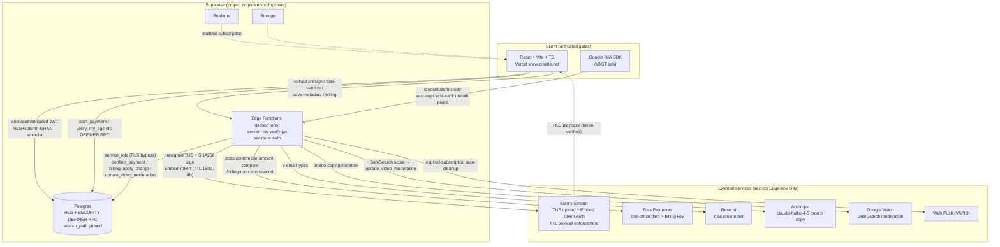
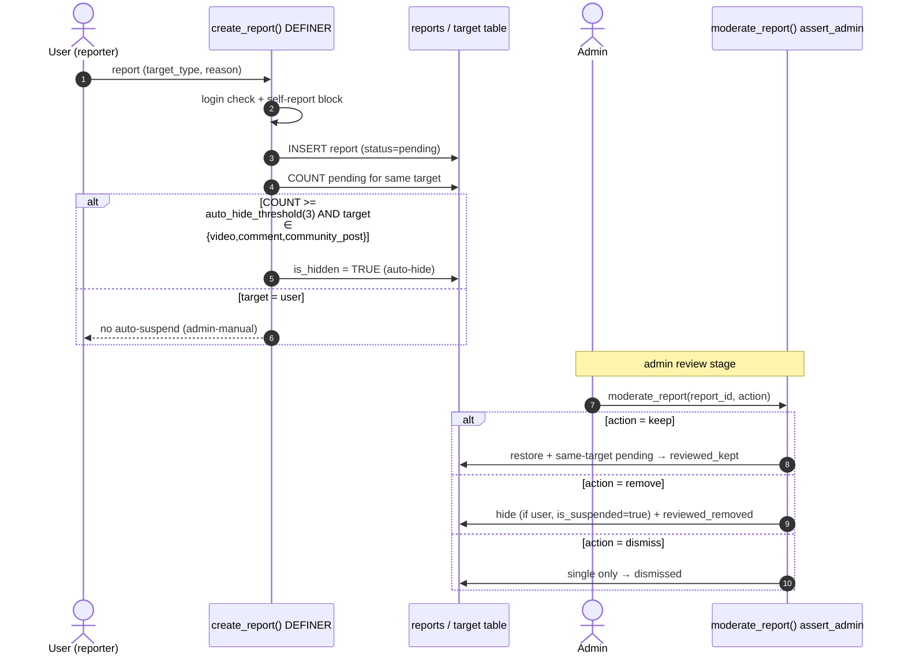
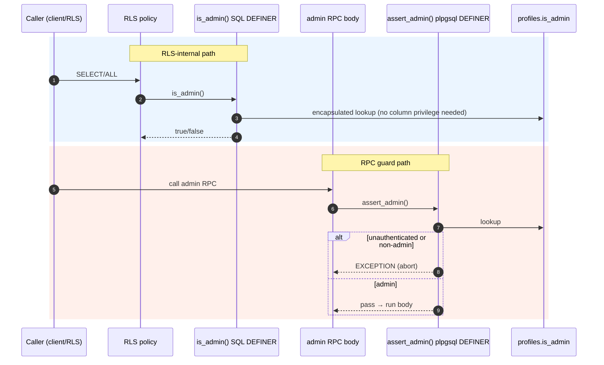
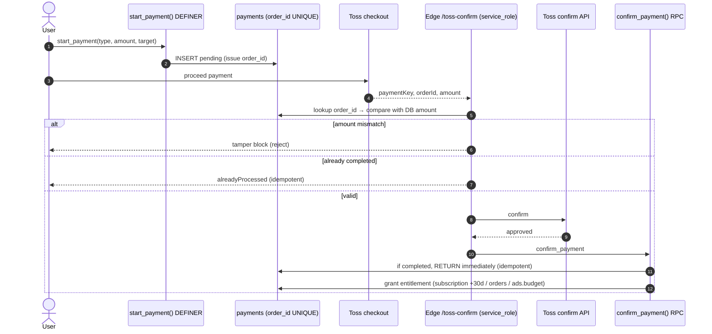
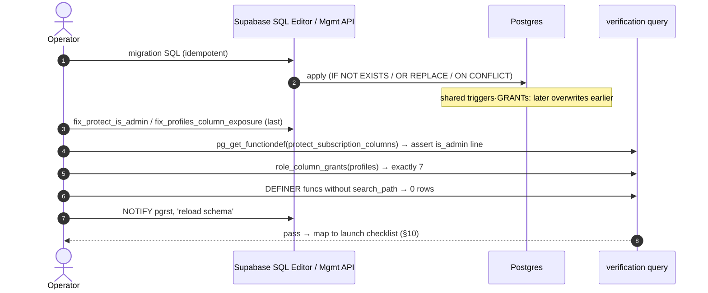
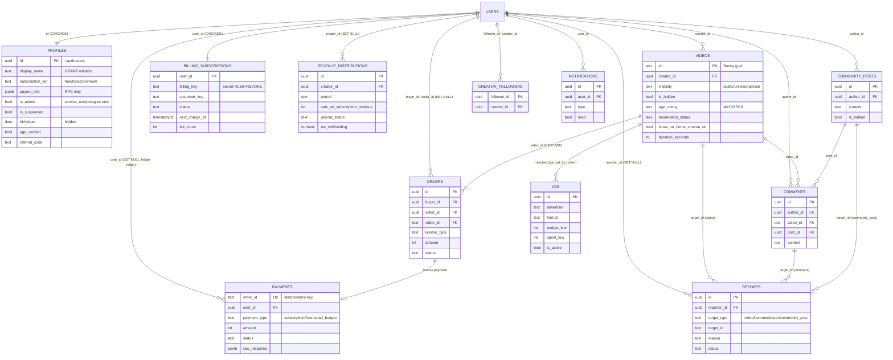

# 09. Content Policy · Security · Data Model · Tech — Detailed Spec

> This spec was written by **reading the actual migration SQL / Edge code, no guessing**. Every basis is cited as `file:line`.
> Migrations are applied **directly via Supabase SQL Editor / Management API** (not a migration tool); all are idempotent. Index: `docs/MIGRATIONS.md`.
> Verification-first principle (`CLAUDE.md`): externally mutable values (Toss policy, tax rates, fee rates, etc.) must be re-confirmed at the time of application.

---

## 1. Content Policy (age rating · length gating · auto-moderation · report → auto-hide → suspension machine)

### 1.1 Video length gating / paywall / ads (content_policy_v2)

6 `platform_settings` keys tunable dynamically by admins. Defaults (`supabase/content_policy_v2.sql:25-32`):

| key | default | meaning | basis |
|---|---|---|---|
| `min_upload_duration_seconds` | 30 | minimum upload length (blocks below) | content_policy_v2.sql:26 |
| `cinema_min_duration_seconds` | 60 | cinema section visibility floor | content_policy_v2.sql:27 |
| `ott_min_duration_seconds` | 600 | OTT section visibility floor | content_policy_v2.sql:28 |
| `cinema_preview_seconds` | 60 | non-subscriber detail preview (sec) | content_policy_v2.sql:29 |
| `min_duration_for_preroll_seconds` | 60 | min video length for pre-roll/overlay ads | content_policy_v2.sql:30 |
| `min_duration_for_midroll_seconds` | 600 | min video length for mid-roll ads | content_policy_v2.sql:31 |

- Auto-classify trigger `classify_video_placement()` (BEFORE INSERT/UPDATE): `show_on_home=true` (all), `show_on_cinema = parsed>=60`, `show_on_ott = parsed>=600`. Auto-parses the `duration` string (`hh:mm:ss`/`mm:ss`/seconds) (`content_policy_v2.sql:38-87`). Ad-review wait `ad_eligibility_at = created_at + 48h` (`content_policy_v2.sql:81-83`).
- Ad matching `get_ad_for_video(p_video_id,p_format)` SECURITY DEFINER: **videos under 1 min block preroll/overlay/postroll/bumper; under 10 min block midroll** (`content_policy_v2.sql:143-151`). Thresholds read dynamically from platform_settings.
- Playback paywall is enforced not by the DB but by **Bunny Embed Token TTL**: non-subscriber token lifetime 150s (covers the 1-min preview), subscriber/owner/admin/purchaser 4 hours (`functions/server/index.ts:307-353`, esp. :345 `ttl = fullAccess ? 4*3600 : 150`).

### 1.2 Age rating 19+ gate (phase26_age_rating)

- `videos.age_rating` TEXT NOT NULL DEFAULT 'all', CHECK `('all','13','15','19')` (`phase26_age_rating.sql:18-30`). Partial index `age_rating<>'all'` (:35-37).
- Added `profiles.birthdate / age_verified / age_verified_at` (`phase26_age_rating.sql:42-47`).
- Self-verification RPC `verify_my_age(p_birthdate)` SECURITY DEFINER: 19+ → `age_verified=true`, under → false (`phase26_age_rating.sql:55-95`). **MVP uses self-entered birthdate** (:50 comment) — real-name/carrier identity verification not implemented (debt).
- On upload, rating is applied via `update_my_video_metadata(...,p_age_rating)` after owner check (`phase26_age_rating.sql:104-149`); Edge `save-metadata` also forces `age_rating` default 'all' (`functions/server/index.ts:663`).

### 1.3 Auto-moderation (phase25_moderation — Google Vision SafeSearch)

- 5 `videos` moderation columns: `moderation_status` (pending/passed/flagged/rejected), `moderation_score` (0-100), `moderation_categories` (JSONB), `moderation_checked_at`, `moderation_error` (`phase25_moderation.sql:18-38`). Review-queue partial index (:41-43).
- Score→status rules `update_video_moderation()` (`phase25_moderation.sql:50-91`):

| condition | status | is_hidden |
|---|---|---|
| error or score NULL | pending (retry) | unchanged |
| score >= 90 | rejected | **TRUE (auto-hide)** |
| score 70~90 | flagged (pending review) | unchanged (still visible to user) |
| score < 70 | passed | unchanged |

- **Authorization**: `update_video_moderation` has no in-body authz check → forgery risk, so REVOKE from `authenticated`, EXECUTE only for `service_role` (`phase25_moderation.sql:93-94`, `phase_security_hardening_20260531.sql:48`). Edge calls it as service_role.
- Admin review: `get_moderation_queue(status,limit)` / `resolve_moderation_flag(video_id,'pass'|'reject')` — both gated by `assert_admin()` first (`phase25_moderation.sql:124,163`). On pass, restores `is_hidden=false` + `admin_logs` audit (H4/M8, `phase_security_hardening_20260531.sql:96-105`).

### 1.4 Report → auto-hide → suspension state machine (phase10_reports)

- `reports` table: target_type (video/comment/user/community_post), reason (spam/inappropriate/copyright/violence/harassment/misinformation/other), status (pending/reviewed_kept/reviewed_removed/dismissed) (`phase10_reports.sql:54-83`). **Duplicate-report prevention** unique index `(reporter_id,target_type,target_id)` (:86-88).
- Auto-hide threshold `platform_settings.auto_hide_threshold=3` (`phase10_reports.sql:47-49`).
- `create_report()` SECURITY DEFINER: login required, self-report blocked; after report INSERT, if pending count for the same target ≥ threshold → **auto-hide video/comment/community_post** (`phase10_reports.sql:155-171`). **user is NOT auto-suspended** (abuse prevention, admin-manual) — :170.
- `moderate_report(report_id, 'keep'|'remove'|'dismiss')`: keep = restore + bulk-set same-target pending to reviewed_kept; remove = hide (+ if user, `is_suspended=true`) + reviewed_removed; dismiss = reject single only (`phase10_reports.sql:215-266`).
- Reports RLS: only own report or admin can SELECT; INSERT/UPDATE only via DEFINER RPC (`phase10_reports.sql:334-344`, later `is_admin()`-ified by `admin_rls_is_admin_function.sql:49-51`).

### 1.5 Suspended-user write blocking (block_suspended_writes)

- `is_suspended=true` alone could not block login/writes (Medium gap) → DB-layer blocking (`block_suspended_writes_20260625.sql:1-12`).
- `is_self_suspended()` (DEFINER, reads is_suspended column directly) + `tg_block_suspended()` BEFORE INSERT/UPDATE trigger attached to comments/community_posts/collab_posts (create/edit), creator_followers/post_likes/comment_likes/video_likes/reports (create) (`block_suspended_writes_20260625.sql:16-69`).
- service_role (auth.uid()=NULL) is not blocked (preserves normal system operation). **Video upload goes through Edge save-metadata (service_role) so the trigger doesn't apply → a separate 403 in the create-upload Edge** (`functions/server/index.ts:220-222`).

---

## 2. Security Model (roles · authorization SSOT)

### 2.1 Per-role permission boundaries

| role | granted to | permissions | note |
|---|---|---|---|
| `anon` | unauthenticated PostgREST | SELECT only within RLS + column-GRANT whitelist | profiles sensitive columns hidden |
| `authenticated` | logged-in JWT | own rows + via DEFINER RPC | cannot directly UPDATE protected columns |
| `service_role` | Edge Functions only | **bypasses RLS** + payment/moderation/billing RPC | key lives only in Edge secrets |
| `postgres`/`supabase_admin` | SQL Editor/Dashboard | full | migrations · admin elevation |

### 2.2 Authorization SSOT = server (DB DEFINER + Edge)

Client-side gates are not trusted. Core patterns:
- 2 admin-determination SSOTs:
  - `is_admin()` SQL DEFINER — for use inside RLS policies. Encapsulated so it evaluates without profiles column privileges (`admin_rls_is_admin_function.sql:21-27`). anon/authenticated EXECUTE.
  - `assert_admin()` plpgsql DEFINER — for guarding RPC bodies; raises an exception if unauthenticated/non-admin (`phase10_6_admin_management.sql:18-34`).
- IDOR prevention: `get_my_revenue_history(p_creator_id)` ignores the parameter and always uses `auth.uid()` (`phase_security_hardening_20260531.sql:50-77`).
- Reduced payment-RPC exposure: `confirm_payment` REVOKE from anon/authenticated (Edge-only); `fail_payment`, since the client calls it directly, only processes own payment or service_role claims (`security_patch_critical_20260614.sql:55-74`).

### 2.3 search_path pinning

All SECURITY DEFINER functions have `SET search_path = public(, pg_temp)` — blocks search_path hijacking. A bulk-hardening migration scans pg_proc and ALTERs any unset functions (`security_definer_search_path_fix.sql:26-66`). New DEFINER functions must include SET.

---

## 3. RLS · Authorization SSOT & Forbidden Lines

### 3.1 profiles protection trigger — 8-column SSOT (never omit)

`protect_subscription_columns()` is a **shared trigger** that multiple migrations overwrite via CREATE OR REPLACE (profiles BEFORE UPDATE, connected at `profiles_table.sql:94-97`). For ordinary users (non service_role) it reverts these 8 columns to OLD (`fix_protect_is_admin_20260624.sql:18-32`):

| group | column | allowed change path |
|---|---|---|
| subscription | subscription_tier, subscription_started_at, subscription_expires_at | payment webhook/billing/admin |
| payout | payout_info | dedicated RPC |
| **privilege** | **is_admin** | **service_role/postgres only** |
| referral | referral_code, referred_by, referral_count | claim_referral RPC |

> **Regression incident**: `referral_20260618.sql` overwrote this trigger and omitted the `is_admin` line → in production an ordinary user could hijack privileges with `UPDATE profiles SET is_admin=true WHERE id=auth.uid()` (critical). Restored to the full 8-column version on 2026-06-24 via `fix_protect_is_admin_20260624.sql`. (memory: protect-trigger-shared-ssot)
> **🚫 Forbidden line**: any migration that overwrites this trigger must include all 8 columns above. After applying, verify the `is_admin` line via `pg_get_functiondef('public.protect_subscription_columns()'::regprocedure)`. On rebuild, ensure `fix_protect_is_admin_20260624.sql` is applied last.

### 3.2 profiles column-GRANT whitelist (PII non-exposure SSOT)

profiles RLS SELECT is `USING(true)` (whole row public), but **column-level GRANT whitelist** blocks sensitive columns.
- After revoking table SELECT, re-grant only the 7 safe columns: `id, display_name, avatar_url, banner_url, bio, subscription_tier, created_at` (`phase_security_hardening_20260531.sql:13-15`).
- Recurrence of exposure: extra PII columns (birthdate/business_*/tax_*/referral_*/email/payout_info/is_admin/is_suspended/deletion_requested_at) became exposed again → on 2026-06-25 re-revoked + re-GRANT only the 7 safe columns (`fix_profiles_column_exposure_20260625.sql:21-33`). Defensively, explicit REVOKE on 13 sensitive columns (:25-29).
- Own sensitive values only via DEFINER RPC: `get_my_profile()` / `get_my_payout_info()` (`phase_security_hardening_20260531.sql:18-39`).

> **🚫 Forbidden line**: if anyone runs `GRANT SELECT ON public.profiles TO anon/authenticated` (no columns specified), all columns open and all users' PII leaks. Do not add new PII columns to the GRANT list. Verify: `SELECT column_name FROM information_schema.role_column_grants WHERE table_name='profiles' AND grantee IN ('anon','authenticated')` → exactly 7. (memory: profiles-column-grant-ssot)

### 3.3 Narrowing videos SELECT RLS

The legacy `USING(true)` let anon directly SELECT private/hidden/unreviewed videos' video_url·moderation_*·seed → restricted (`videos_select_rls_20260620.sql:24-32`):
`(visibility IN public,unlisted AND is_hidden=false) OR creator_id=auth.uid() OR is_admin()`. (Column REVOKE not applied — App/MyPage use select("*"). Exposure of public videos' internal moderation_* remains low-risk residual, :18-20.)

---

## 4. Payment / Settlement Integrity

### 4.1 One-off payment (Toss confirm)

- Flow: `start_payment(type,amount,target)` → creates pending payments row (`phase9_payments.sql:92-128`) → Toss checkout → Edge `/toss-confirm` **compares against DB amount to block tampering** (`functions/server/index.ts:1075-1078`) → Toss confirm API → `confirm_payment` RPC.
- **Idempotency**: payments.order_id UNIQUE (`phase9_payments.sql:25`). `confirm_payment` returns immediately if already completed (`phase9_payments.sql:166-169`); Edge also returns alreadyProcessed (`functions/server/index.ts:1080-1082`).
- Entitlement grant (`confirm_payment`, `phase9_payments.sql:191-221`): subscription → premium +30 days, license → orders INSERT, ad_budget → increment ads.budget_krw.

### 4.2 Recurring payment (billing key) — service_role isolation

- `billing_subscriptions.billing_key` (card-charge token) is **absolutely never exposed to client**: RLS enabled + 0 policies + table privileges REVOKE (`billing_subscriptions_20260612.sql:30-33`). Display via `get_my_billing()` (excludes billing_key, :36-51).
- Charge RPCs `billing_apply_charge` / `billing_mark_failed` are service_role EXECUTE only (`billing_charge_rpcs_20260612.sql:68,94`). Idempotent: if same order_id is completed, RETURN (:26-28) → prevents double +30-day subscription.
- After 3 cumulative failures, auto_renew off + status='failed' (`billing_charge_rpcs_20260612.sql:77-83`).
- Scheduler `/billing-run` verifies `x-cron-secret` (BILLING_CRON_SECRET) (`functions/server/index.ts:1254-1256`); `billing_claim_due` claims atomically with `FOR UPDATE SKIP LOCKED` (prevents double-charge, :1265-1267).

### 4.3 Settlement accounts / ledger retention & anonymization

- Settlement account lookup `get_revenue_distributions_by_period` is gated by `assert_admin()` + pinned search_path (SQL→plpgsql conversion, `security_patch_critical_20260614.sql:31-53`).
- **Blocking accounting-ledger CASCADE loss**: on account deletion, change payments.user_id / revenue_distributions.creator_id / orders.buyer_id FKs to `ON DELETE SET NULL` (ledger retained anonymized — e-commerce law retention duty + settlement-dispute basis, `security_patch_critical_20260614.sql:76-93`).

---

## 5. Data Model (key table summary)

| table | key columns | relations | RLS / privilege one-liner | basis |
|---|---|---|---|---|
| profiles | id(PK=auth.users), display_name, subscription_tier(free/basic/premium), payout_info, is_admin, is_suspended, birthdate, age_verified, referral_* | id→auth.users CASCADE | SELECT USING(true) but **7-column GRANT whitelist**; UPDATE own + protection trigger 8 columns | profiles_table.sql:18-49, fix_profiles_column_exposure_20260625.sql:32 |
| videos | id(TEXT=Bunny guid), creator_id, visibility, is_hidden, age_rating, moderation_status, show_on_home/cinema/ott, duration_seconds | creator_id→auth.users | SELECT public/own/admin; INSERT/UPDATE own | videos_select_rls_20260620.sql:27-32 |
| orders | buyer_id, seller_id(auto), video_id, license_type, amount, status | buyer/seller→auth.users SET NULL, video_id→videos CASCADE | SELECT own (buyer/seller); writes service_role | orders_table.sql:23-25,93-96 |
| payments | order_id(UNIQUE), user_id, payment_type(subscription/license/ad_budget), amount, status, raw_response | user_id→auth.users **SET NULL** (ledger retention) | SELECT own; writes DEFINER RPC | phase9_payments.sql:21-58,266-269 |
| billing_subscriptions | user_id(PK), **billing_key(secret)**, customer_key, status, next_charge_at, fail_count | user_id→auth.users CASCADE | 0 RLS policies + table REVOKE = 0 client access | billing_subscriptions_20260612.sql:8-33 |
| reports | reporter_id, target_type/id, reason, status | reporter→auth.users SET NULL | SELECT own or admin; writes DEFINER | phase10_reports.sql:54-88,334-342 |
| revenue_distributions | creator_id, period, sale/ad/subscription_revenue, payout_status, tax_withholding | creator_id→auth.users **SET NULL** | SELECT own or admin | admin_rls_is_admin_function.sql:54-56 |
| notification_preferences / notification_log | user_id, email_*/push_* toggles / send log | user_id→auth.users | SELECT/UPDATE own; INSERT DEFINER | phase34_notifications.sql:43-84 |
| ads | id(uuid), advertiser, format, budget_krw, spent_krw, is_active, starts/ends_at | (advertiser self-service) | active-ad public SELECT, manage `is_admin()` ALL | ads_table.sql:40-61 |
| platform_settings | key, value, note | — | tuned via admin RPC | content_policy_v2.sql:25 |

New signup: `auth.users` INSERT trigger `handle_new_user` (creates profile, `profiles_table.sql:102-123`) + `init_notification_preferences_on_signup` (notification defaults, `phase34_notifications.sql:247-270`).

---

## 6. Technical Architecture

| layer | stack | note |
|---|---|---|
| frontend | React + Vite + TS, Vercel (`www.creaite.net`) | typecheck `npx tsc --noEmit` (pre-commit) |
| backend | Supabase Postgres (RLS+DEFINER RPC) + Edge Functions (Deno/Hono) | project_id `tvbpiuwmvrccfnplhwer` (config.toml:5) |
| video | Bunny Stream (TUS upload presigned, Embed Token Auth) | API key hidden, SHA256-signed issuance (index.ts:188-300) |
| payment | Toss Payments (one-off confirm + billing-key recurring) | Edge `/toss-confirm`, `/billing-run` |
| mail/push | Resend (mail.creaite.net) + Web Push (VAPID) | index.ts:11-68; FCM is column-only (not wired) |
| AI | Anthropic (promo copy, `claude-haiku-4-5`), Google Vision (moderation) | index.ts:463-495 |
| app | Android TWA (PWABuilder, personal Play $25) | iOS after beta. docs/twa-build-guide.md |

- **Edge `server` always deployed with `--no-verify-jwt`**: there are unauthenticated public endpoints (VAST pixels vast-tag/vast-track), so gateway JWT verification is off and each route does its own auth (token/admin/cron-secret) (`config.toml:1-8`). **If omitted, public pixels return 401.**
- **Secrets (Edge env)**: SUPABASE_SERVICE_ROLE_KEY, BUNNY_API_KEY / BUNNY_LIBRARY_ID / BUNNY_TOKEN_AUTH_KEY, TOSS_SECRET_KEY, ANTHROPIC_API_KEY, VAPID_PUBLIC/PRIVATE_KEY, BILLING_CRON_SECRET. All server-side only (never sent to client).
- **CORS**: `origin: (o)=>o||'*'` echo + `credentials:true` (Google IMA SDK calls with credentials:'include', so wildcard is not allowed) — `index.ts:85-95`. VAST endpoints use a separate `vastCorsHeaders` (exact-origin echo, `index.ts:825-834`).
- search_path: see §2.3 (all DEFINER functions pinned).

---

## 7. Non-functional

- **Playback stability**: Bunny HLS + non-subscriber preview uses short-TTL tokens (even if URL extracted, can't reach the end of long-form, index.ts:308-310). If BUNNY_TOKEN_AUTH_KEY unset, falls back to token=null without interruption (:317).
- **Performance**: admin/aggregate partial indexes (moderation queue phase25:41-43, report queue phase10_reports:91-97, billing due billing_subscriptions:25-27), payment-lookup indexes (phase9_payments:60-67).
- **i18n/subtitles**: multi-language VTT auto-generated via Bunny built-in transcribe (index.ts:502-579).
- **Notifications**: 8 email toggles (welcome/receipt/new_video/comment_reply/follower/revenue/report/ad_budget) + push columns pre-provisioned (phase34_notifications.sql:21-41). Expired push subscriptions auto-cleaned (index.ts:30-33,61-63).
- **Responsive/SEO/accessibility**: frontend (React+Vite) responsibility — out of scope for this spec (not asserted as code not inspected).

---

## 8. Migration Operations

- All **idempotent** (IF NOT EXISTS / CREATE OR REPLACE / ON CONFLICT DO NOTHING / DO $$ constraint guards). Safe to re-run.
- Apply: Supabase SQL Editor or Management API (`MIGRATIONS.md:3`). Apply verification: `supabase/_verify_migrations_applied.sql`.
- **Apply-order caution**: shared triggers (`protect_subscription_columns`) · shared GRANTs (profiles columns) — **later application overwrites earlier**. On rebuild, ensure `fix_protect_is_admin_20260624.sql` (8 columns) / `fix_profiles_column_exposure_20260625.sql` (7 columns) come **last** (see §3).
- Canonical-version caution: redefining old versions of `confirm_payment`/`admin_refund_payment`/`get_my_payments` causes regressions → canonical is `phase_user_payment_history.sql` (phase10_6_admin_management.sql:400-404, phase9_payments.sql:253-256). Must be applied together when setting up a new environment.
- After schema changes, `NOTIFY pgrst, 'reload schema'` (e.g., billing_subscriptions_20260612.sql:67).

---

## 9. Known Security Debt / Carryover

| item | content | status / basis |
|---|---|---|
| ad impression/click fraud | `increment_ad_impressions` dedup key is a client-generated session key (localStorage) → key rotation enables budget burn/impression inflation | Edge-based redesign planned before payments go live (self-ad OFF, pre-billing so real loss 0). ad-fraud-hardening-plan.md:6-9,17-24 |
| VAST video-ad charge dedup absent | `track_video_ad_event` has no dedup — repeated GET of same URL before exp charges each time, viewer dedup impossible | ad-fraud-hardening-plan.md:37; handled in Edge bulk cleanup |
| self-entered age verification | birthdate self-entry only (no real-name/carrier verification) | phase26_age_rating.sql:50 (MVP) |
| residual videos column exposure | public videos' moderation_*/seed internal values exposed via direct SELECT (low-risk) | videos_select_rls_20260620.sql:18-20 |
| phone/PII | blocked by profiles whitelist, but re-leak risk persists when new PII columns are added | must follow §3.2 forbidden line |
| CORS echo | origin echo + credentials (required by IMA SDK) — broad. Mitigated by token-based auth but room to tighten origin whitelist | index.ts:85-95 |
| ads_table legacy policy | the profiles-direct-reference admin policy at `ads_table.sql:53-61` was broken and replaced with `is_admin()` at `admin_rls_is_admin_function.sql:29-33` — mind re-apply order | admin_rls_is_admin_function.sql |

---

## 10. Pre-launch Security Checklist

- [ ] `protect_subscription_columns()` body contains **all 8 columns** (esp. `is_admin`) — verify via `pg_get_functiondef` (§3.1).
- [ ] profiles column GRANT = only the 7 safe ones — confirm via `role_column_grants` query (§3.2).
- [ ] videos SELECT RLS = public/own/admin conditions applied (`videos_select_rls_20260620.sql`).
- [ ] All SECURITY DEFINER functions have search_path set (`security_definer_search_path_fix.sql` verification query 0 rows).
- [ ] `confirm_payment` REVOKE from anon/authenticated; `update_video_moderation` service_role-only.
- [ ] Confirm billing_subscriptions table privileges REVOKE (billing_key exposure 0).
- [ ] payments/revenue/orders FK = ON DELETE SET NULL (ledger retention).
- [ ] Edge `server` deployed with `--no-verify-jwt` + all secrets set (TOSS_SECRET_KEY, BUNNY_*, BILLING_CRON_SECRET, VAPID_*, ANTHROPIC_API_KEY).
- [ ] Confirm 8 suspended-account write-blocking triggers attached (`block_suspended_writes_20260625.sql` verification query).
- [ ] **Before ads-payment Toss go-live**: ad-fraud Edge redesign complete (§9 rows 1·2).
- [ ] New/rebuild apply order: fix_protect_is_admin / fix_profiles_column_exposure come last.

---

## Architecture Diagram

> System diagram + data flow. The authorization SSOT is the server (DB DEFINER + Edge); client gates are untrusted (§2.2). All secrets live only in Edge env (§6).



---

## Sequence Diagrams

### (a) Report → auto-hide → suspension state machine (§1.4)



### (b) Authorization decision — assert_admin / is_admin (§2.2)



### (c) Payment integrity — Toss one-off confirm (§4.1)



### (d) Migration apply / verify (§8)



---

## Data Model ERD

> Based on the §5 table summary. PK/FK and ON DELETE behavior match the §5 table and basis files. (id→auth.users relations are in the external auth schema, so represented here as a virtual USERS entity.)



---

## Test Cases (Security · Policy)

> Gherkin. The `→ checklist` at the end of each scenario maps to a §10 pre-launch security checklist item. Regression-prevention scenarios tie directly to the §3 forbidden lines (protect 8 columns / profiles GRANT).

```gherkin
Feature: RLS — block others' data

  Scenario: anon blocked from directly SELECTing private/hidden videos (§3.3)
    Given access as anon role via PostgREST
    When SELECT a video with visibility='private' or is_hidden=true
    Then no rows are returned
    And only public (public/unlisted, is_hidden=false) or own (creator_id=auth.uid) or is_admin() is visible
    # → checklist: videos SELECT RLS = public/own/admin

  Scenario: IDOR — block viewing others' revenue history (§2.2)
    Given user A logged in
    When call get_my_revenue_history(p_creator_id=B's id)
    Then parameter is ignored and only auth.uid() (=A) basis is returned
    # → checklist: (IDOR-prevention DEFINER RPC)

  Scenario: block client exposure of billing_key (§4.2)
    Given authenticated user
    When directly SELECT the billing_subscriptions table
    Then 0 policies + table REVOKE → 0 rows / denied
    And get_my_billing() returns only columns excluding billing_key
    # → checklist: confirm billing_subscriptions table privileges REVOKE

Feature: Privilege-escalation block (regression prevention — protect 8-column SSOT §3.1)

  Scenario: block self is_admin elevation by ordinary user
    Given authenticated user (non-admin)
    When UPDATE profiles SET is_admin=true WHERE id=auth.uid()
    Then the protect_subscription_columns trigger reverts to OLD value
    And is_admin stays false
    # → checklist: protect_subscription_columns body contains all 8 columns (esp. is_admin)

  Scenario: all 8 protected columns reverted
    Given authenticated user
    When directly UPDATE subscription_tier/subscription_*/payout_info/is_admin/referral_*
    Then all 8 columns restored to OLD (only service_role/designated RPC path allowed)
    # → checklist: verify 8 columns via pg_get_functiondef

  Scenario Outline: regression guard — is_admin line present after trigger redefinition
    Given <migration> just overwrote protect_subscription_columns
    When inspect pg_get_functiondef('public.protect_subscription_columns()'::regprocedure)
    Then the body must contain the is_admin protection line
    And fix_protect_is_admin_20260624.sql was applied last
    Examples:
      | migration |
      | referral_20260618.sql |
      | (any shared-trigger-redefining migration) |
    # → checklist: new/rebuild apply order = fix_protect_is_admin last

Feature: profiles PII non-exposure (regression prevention — GRANT whitelist §3.2)

  Scenario: only the 7 safe columns GRANTed
    Given anon/authenticated role
    When query profiles GRANT columns from role_column_grants
    Then exactly 7 (id, display_name, avatar_url, banner_url, bio, subscription_tier, created_at)
    And PII such as birthdate/email/payout_info/is_admin/business_*/tax_*/referral_* is hidden
    # → checklist: profiles column GRANT = only the 7 safe ones

  Scenario: forbidden line — no whole-table GRANT
    Given a migration author
    When attempt GRANT SELECT ON public.profiles TO anon/authenticated (no columns)
    Then this is an all-column PII leak and violates the forbidden line
    And own sensitive values are accessed only via get_my_profile()/get_my_payout_info() DEFINER RPC
    # → checklist: profiles column GRANT = only the 7 safe ones (no whole-table GRANT)

Feature: forced write-block for suspended users (§1.5)

  Scenario: suspended-account write-block trigger
    Given user with profiles.is_suspended=true
    When create/edit comments/community_posts/collab_posts or
         create creator_followers/post_likes/comment_likes/video_likes/reports
    Then the tg_block_suspended trigger blocks it
    And service_role (auth.uid()=NULL) is not blocked (preserves system operation)

  Scenario: block video upload for suspended account (covering trigger-bypass path)
    Given is_suspended=true user
    When call the create-upload Edge
    Then Edge returns 403 (since save-metadata runs as service_role and bypasses the trigger)
    # → checklist: confirm 8 suspended-account write-blocking triggers attached

Feature: Age gate 19+ (§1.2)

  Scenario: block 19+ playback for unverified user
    Given user with age_verified=false
    When access an age_rating='19' video
    Then blocked by the gate (must verify 19+ via verify_my_age)

  Scenario: self-entered birthdate verification
    Given user calls verify_my_age(p_birthdate)
    When 19 or older
    Then age_verified=true, age_verified_at recorded
    But MVP is self-entry only — real-name/carrier verification not implemented (debt §9)

Feature: report auto-hide threshold (§1.4)

  Scenario: auto-hide on reaching threshold
    Given 2 pending reports exist on the same video (threshold=3)
    When a different user files the 3rd report
    Then is_hidden=true auto-hide
    And target_type=user is not auto-suspended (admin-manual)
    # → checklist: report/moderation policy behavior

Feature: payment idempotency (§4.1, §4.2)

  Scenario: prevent double confirm of same order_id
    Given payments.order_id UNIQUE
    And that payment is already completed
    When confirm_payment is re-called
    Then RETURN immediately (no double entitlement grant)
    And Edge returns alreadyProcessed

  Scenario: prevent billing double-charge
    Given billing_apply_charge re-called with the same order_id
    When already completed
    Then RETURN (block double +30-day subscription)
    And billing_claim_due claims atomically with FOR UPDATE SKIP LOCKED
    # → checklist: payments/billing idempotency

Feature: payment tamper block (§4.1)

  Scenario: block payment-amount tampering
    Given the pending amount created by start_payment
    When the Toss callback amount mismatches the DB amount
    Then Edge /toss-confirm rejects (DB comparison)

Feature: update_video_moderation tamper block (§1.3)

  Scenario: block direct manipulation of moderation score
    Given authenticated user
    When attempt to call update_video_moderation directly
    Then no EXECUTE privilege (authenticated REVOKE, service_role-only)
    # → checklist: update_video_moderation service_role-only

Feature: accounting-ledger retention (§4.3)

  Scenario: anonymized ledger retention on account deletion
    Given payments/orders/revenue_distributions reference the user FK
    When that account is deleted
    Then FK ON DELETE SET NULL retains (anonymizes) ledger rows
    And they are not lost via CASCADE (e-commerce law retention duty)
    # → checklist: payments/revenue/orders FK = ON DELETE SET NULL
```
